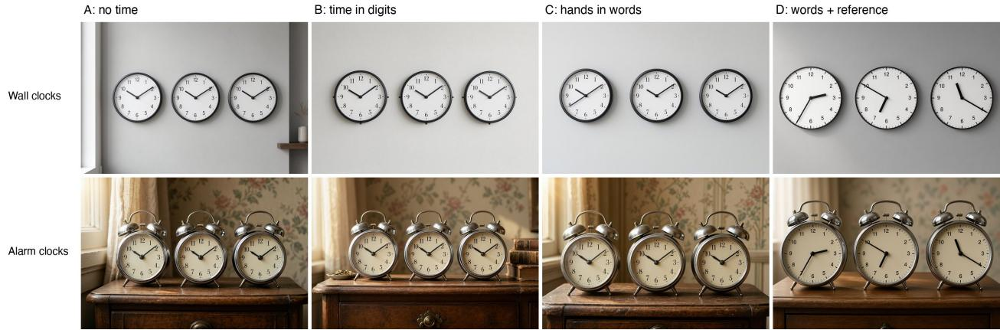
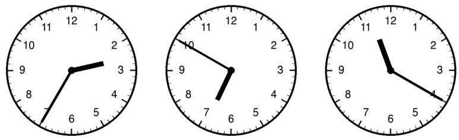
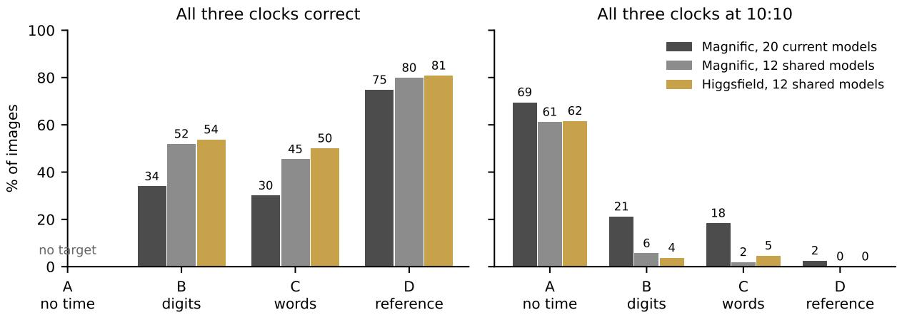
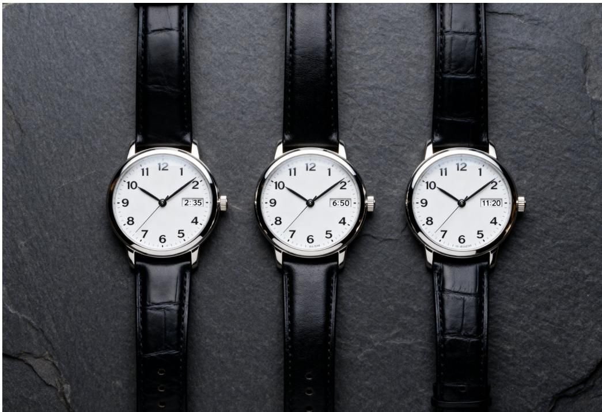

# It’s Always 10:10: Reference Images Break a Bias That Prompts Only Dent

Luca Cazzaniga Independent Researcher, AI-Assisted Visual Production luca@lucacazzaniga.com

October 2026

## Abstract

Text-to-image models appear to reproduce the habits of the photographs they learned from. Analog clocks are an extreme case: in advertising, watches almost always show 10:10, and generated clocks return to 10:10 even when another time is requested. We measure this bias and test three ways of overcoming it on 52 models available on the Magnific platform, with a replication on Higgsfield. Every image shows three identical clocks that must show 2:35, 6:50 and 11:20. The description of the object is fixed and only the request about the time changes: no time (A), the time in digits (B), the hand positions described by construction relative to the dial numerals (C), or the same description plus a drawn reference dial (D). Two AI readers read all 1,799 images blind from coded copies, with a third reader and the author settling disagreements (dial-level agreement 96.0% and 97.3%). With no time requested, 67% of the images have all three clocks at 10:10. On the 20 current models, all three clocks are correct in 34% of the images with digits, 30% with the hands described in words and 75% with the reference dial (D−B: +37 points, 95% CI +28 to +45); we found no evidence that describing the hands in words beats the digits (C−B: −4 points, CI −10 to +1). The replication on the 12 models shared by both platforms gives the same picture (B 54%, C 50%, D 81%). Writing the time reduces the bias but leaves two thirds of the images of the 20 current models with at least one wrong clock; adding a drawn reference raises full accuracy to three quarters and almost eliminates images entirely at 10:10. We release all images, prompts, raw readings and a script that recomputes every result.

  
Figure 1: The same model (MAI Image 2.5 on Magnific, round 1) under the four conditions. The target times are 2:35, 6:50 and 11:20 from left to right. With no time (A), with the time in digits (B) and with the hand positions described in words (C) every clock shows 10:10. With the description plus a drawn reference dial (D) all three clocks in both images show the requested time.

## 1 Introduction

Ask an image generator for a watch showing a quarter to three and, more often than not, it will show ten past ten. The pose is not an accident of one model. Watch and clock advertising has used 10:10 for decades, a pose that experiments associate with a more positive emotional response to the product [13]. The photographs that fill training sets presumably inherit the convention, and the generators inherit it from them. The phenomenon is well known among practitioners and has been described in the press [8, 20].

Clocks are a convenient test case for a more general question. Generators repeat the defaults of their training data, and sometimes no written instruction moves them: the full wine glass is another well-known example [21]. A clock has a property that most defaults lack: an objective ground truth. Two hand angles say whether the instruction was followed, so the bias can be measured without aesthetic judgment.

We ask four questions. (1) How strong is the 10:10 default when no time is requested? (2) Does writing the time in digits fix it? (3) Does describing the hand geometry in words, relative to the dial numerals, help more than the digits? SCHEMA [3] is a structured prompting method that writes the request as labelled sections (subject, design, setting, composition, camera, lighting, style, constraints) and recommends describing spatial requirements by construction, relative to visible landmarks, rather than by name or number; condition C applies that recommendation to the hands. (4) Does attaching a drawn reference dial with the right angles help more than the wordings we tested?

## Contributions.

• A controlled comparison of four prompting conditions on 52 text-to-image models available on one platform (Magnific), with three rounds on the 20 current models and a replication of the 12 models also available on a second platform (Higgsfield) with six rounds: 1,801 images generated, 1,799 read, three clocks each.

• A blind reading protocol with two independent AI readers, a third reader on disagreements and human arbitration of the remaining cases; the two readers assign the same class to 96.0% of the dials in the main study and 97.3% in the replication.

• The finding that the time written in digits reduces the bias but leaves most images of the 20 current models with at least one wrong clock, that we found no evidence that a precise description of the hands in words does better than the digits, and that adding a drawn reference dial raises the share of fully correct images by +37 points on the main study and +22 points on the shared models.

• An open dataset with every image, prompt, raw reading and verdict, and a script that recomputes all results from the raw readings [2].

## 2 Related work

The 10:10 bias. The preference of advertising for 10:10 was studied experimentally by Karim et al. [13], who found that the pose increases the positive emotional response to the product. In generated images the default has been documented in the press with examples from several tools [8, 20]. Mohammed et al. [18] propose a model-side algorithm that reduces the temporal bias of watch images generated by Stable Difusion 1.5. Our study is complementary: we do not modify any model but measure, across 52 commercial models, what can be obtained by changing only the request.

Reading clocks. Reading analog clocks is itself hard for vision models. Yang et al. [28] train a dedicated reader on images in the wild; ClockQA [24] and ClockBench [23] show that multimodal language models often misread the time; Choi et al. [6] address in particular the confusion between hour and minute hands. OmniClock [19] evaluates both reading and generation of clocks, scoring generated images with a fixed time reader and accuracy within five minutes, the same tolerance we use for the minute hand. These results motivate our protocol: two independent readers, explicit reporting of hand positions rather than of the time alone, arbitration of disagreements, and a dedicated class for swapped hands.

Faithfulness benchmarks. Text-to-image alignment is usually measured with object-level checks or question answering: GenEval [7], T2I-CompBench [11], TIFA [10], DPG-Bench [9], GenAI-Bench [15] and VQAScore [16] cover counting, attributes, spatial relations and composition. Hand angles are a fine-grained spatial attribute that these benchmarks do not isolate, and the 10:10 default makes failures systematic rather than random.

Learned defaults. Generators reproduce regularities and sometimes specific items of their training data, from social stereotypes [17] to memorised images [1, 26]. A recurrent pose such as 10:10 is a diferent phenomenon from the copy of a single image, and our design does not identify its origin: it measures how hard it is to move.

Visual conditioning. Images can constrain generation more directly than text: ControlNet adds structural conditions such as edges and poses [30], IP-Adapter conditions on image prompts [29], Paint by Example edits from exemplars [27], and MultiRef evaluates generation from several visual references, with persistent failures [5]. We test the simplest form available to an end user of a commercial platform: a single reference image attached to the request.

Models as judges. Multimodal models are increasingly used to evaluate generated images, with known biases and inconsistencies [4, 12, 14, 25]; collaborative discussion among several judges has also been proposed [22]. Our two-of-three vote is a simpler arbitration that those works do not validate. We use AI readers for a narrow perceptual task, under blinding, and report their agreement and the human arbitration.

## 3 Method

## 3.1 Scenes, targets and conditions

Each image contains three identical analog clocks in a row, in one of three scenes: wristwatches in a top-down product shot (S1), wall clocks (S4) and vintage twin-bell alarm clocks (S5).1 The three clocks must show 2:35, 6:50 and 11:20, three times far from 10:10 and from each other. Their order rotates over three rounds (rotation 1: 2:35, 6:50, 11:20; rotation 2: 6:50, 11:20, 2:35; rotation 3: 11:20, 2:35, 6:50), so that position on the image is not confounded with the target.

The description of the object is identical in all conditions, including the construction of the hands (a short thick hour hand reaching about half the radius, a long thin minute hand reaching the minute track, the same central pin), the scene, the light and the framing. Only the request about the time changes: one added block of lines and, in B to D, the words “each one set as listed above” in the constraint line (Appendix A; every prompt is in the dataset):

• A, no time. No time is requested: the control shows where free hands go.

• B, time in digits. “Times, left to right: 2:35, 6:50, 11:20”.

• C, hands in words. Each hand is placed by construction relative to the dial numerals, without digits: for 2:35, “the hour hand points seven twelfths of the way from the 2 to the 3; the minute hand points exactly at the 7”. Positions are never given in degrees or percentages, which models tend to print on the image.

• D, words plus reference. The text of C plus a drawn reference image (Figure 2) and one line: “use the attached diagram solely to determine the hand angles and their left-to-right assignment. Render the clocks using the design, scene and photographic style specified here.”

The reference dials were drawn programmatically, not generated, one image per rotation. The same reference is used for all three scenes and is attached as a generic image reference, with no weight or strength parameter. Because the reference also shows a plain dial, condition D estimates the combined efect of reference conditioning, including possible changes in the appearance of the dials, not the efect of the geometric information alone.

## 3.2 Models, platforms and rounds

All images were generated on 7 October 2026 through two commercial platforms that give access to many third-party models: Magnific and Higgsfield, with paid subscriptions. Models are named as the platforms list them; the identifier used by each platform is recorded in the dataset.2 Images were requested in 3:2 at the lowest resolution ofered (1K; 1.5K or 2K for the Seedream models) and at medium quality where a choice exists; on Higgsfield, where the option is exposed, Ideogram’s prompt rewriting was turned of. Mystic 2.5 Fluid has no 3:2 format and was run in 16:9 with the same prompt.

  
Figure 2: The reference image of condition D for rotation 1 (2:35, 6:50, 11:20). It was drawn with a script, without any generative model; rotations 2 and 3 use the same drawing with the times reordered.

Each cell received exactly one request and its output was kept, with no selection; a request was repeated only when the server returned no image. Requests were sent in parallel batches mixing conditions and scenes; their order and identifiers are in the raw logs. Seeds are not exposed by the platforms.

Magnific study. Condition A was run on all 52 image models of the platform that accept a text-only request.3 The 20 current models (Table 4), classified as such before data collection as the latest generation of each provider’s line on the platform together with its variants (for example Nano Banana 2.1, Pro, 2 and 2 Lite), were run in all four conditions for three rounds, one image per model, scene and round; the other 32 models were run once in condition A (Appendix B). Two models accept only style or character references and could not run condition D (Recraft V4.1, Mystic 2.5). In total: 798 images.

Higgsfield replication. The 12 current models available on both platforms were run in all four conditions for six rounds (two full rotations), with the same prompts and reference images; Recraft V4.1 again had no D. One image (Nano Banana 2 Lite, D, S5, round 3) failed three times on the server. In total: 845 images. The two platforms are never mixed in the same cell.

Pilot. Before the study, condition B was run once on the 52 models with an earlier prompt version. A methodological review of that version by an independent model (GPT-6.1) led to the final prompts: the hand construction moved into the description of all conditions, contradictory constraints were removed and the precision of condition C was made uniform. The pilot is reported separately (Section 4.6).

## 3.3 Blind reading

Each image was copied as JPEG under a random six-character code into a neutrally named folder, metadata stripped and the long side reduced to at most 1600 pixels; codes were spread in shufled batches of 13 that mix models, scenes and conditions. Readers never saw the model, the condition, the target times or the purpose of the test.

Two readers read every image, in separate sessions and without access to each other’s output, with the same English instructions (released with the data): Sol (OpenAI gpt-6.1-sol, high reasoning efort) and Claude (Anthropic Opus 5.5 in the pilot and the Magnific study, Sonnet 5.5 in the replication). For every dial, left to right, they report where the shorter hand points (in hours, one decimal), where the longer hand points (in minutes), the number of hands, whether the two hands can be told apart, and notes. The Claude readers had a strict rule: one look per image and at most one enlarged crop, only when the hands could not be told apart; in the replication, three of the 17 Sonnet readers reported measuring hand lengths or angles on the pixels as well, for 56 of the 845 images; we report the replication with and without them. Sol was run through the Codex command-line tool in a read-only sandbox, one call per batch; Claude readers ran as separate Claude Code sub-agents or sessions, one per group of batches; the third reader ran through the Antigravity command-line tool with no tool other than opening the images. Dials are matched by position from left to right; when the readers count a diferent number of dials, the image is non-conforming.

Each reading is turned into one class from the two hand positions, never from the reported time, using circular distances on the dial and a fixed precedence: correct (minute hand within 5 minutes and hour hand within 0.6 hours of the target; the first is the usual five-minute tolerance, the second accepts an hour hand placed on the nearest numeral instead of between numerals, a frequent drawing error, but not one placed on the preceding hour late in the hour, such as on the 6 for 6:50); 10:10 (hour hand between 9.7 and 10.6, minute hand between 6 and 14); another clock’s time (the target of another clock in the same image); hands swapped (correct once the roles are exchanged: the hour reading times five is taken as the minute position and the minute reading divided by five as the hour position); hands overlapping (the two hands within 3 minutes of each other); other error; and unreadable (a position missing). Extra hands, such as second hands, are noted but do not change the class. When a reader cannot tell the hands apart, it still assigns the two roles, marks them as not distinguishable and the assignment is classified as given; when only one hand is visible, the reading either repeats the same position for both hands (classified as overlapping) or leaves one position empty (unreadable). In condition A, which has no target, everything that is not 10:10 is other time.

When the two readers assign the same class, that class is final. Otherwise a third reader (Google Gemini 3.8 Flash) reads the image and the class shared by two of the three is final; the few dials still open were decided by the author on an annotated image. Agreement is the share of dials to which the two readers assign the same class. Of the 5,385 dials scored, 164 were settled by the majority of three readers and 20 by the author (Table 1).

## 3.4 Outcomes and statistics

The primary outcome is image-level: all three clocks correct. An image counts only if both readers see exactly three dials; images with more or fewer clocks stay in the denominator as failures. The secondary outcome is all three clocks at 10:10, and we also report dial-level shares. Paired diferences between conditions are computed on units model × scene × round that have B, C and D, so models without D and the one missing image are left out of the comparison. The estimand is the diference for this fixed set of models: the main intervals come from a percentile bootstrap over units (4,000 resamples, seed 7, 95%). As a sensitivity analysis for generalisation to similar models we also resample whole models with their units (4,000 resamples, seed 11). We report three comparisons (C−B, D−B, D−C) without correction for multiple comparisons. A second sensitivity analysis tightens the tolerances to 2.5 minutes and 0.3 hours and requires both readers’ positions to meet them. With three rounds per cell on Magnific and six on Higgsfield, per-model results are descriptive.

<table><tr><td>Block</td><td>Generated</td><td>Read</td><td>Scored</td><td>Dials scored</td></tr><tr><td>Magnific study</td><td>798</td><td>798</td><td>798</td><td>2,394</td></tr><tr><td>Higgsfield replication</td><td>845</td><td>845</td><td>845</td><td>2,535</td></tr><tr><td>Pilot</td><td>156</td><td>156</td><td>152</td><td>456</td></tr><tr><td>Graphic test</td><td>2</td><td></td><td></td><td></td></tr><tr><td>Total</td><td>1,801</td><td>1,799</td><td>1,795</td><td>5,385</td></tr></table>

Table 1: Images and dials by block. In the pilot, four images with four clocks (seen as such by both readers) were left out; in the study and the replication, non-conforming images stay in the denominator as failures. The Higgsfield replication planned 846 images; one failed on the server.

## 4 Results

## 4.1 The default: 10:10 when no time is requested

With no time in the prompt, 67% of the 276 images of the 52 Magnific models have all three clocks at 10:10, and 72% of all dials are at 10:10 (62% and 69% on the 32 older models, 69% and 74% on the 20 current ones; the current models contribute three rounds each, and with every model weighted equally the share of images entirely at 10:10 is 65%). The default is strong but not universal. On Higgsfield, Nano Banana Pro puts 54 of 54 dials at 10:10 and Flux.3 53 of 54, whereas Ideogram 4.5 does so for 2 and GPT 2.5 Sunburst for 8 of 54.

<table><tr><td>Condition</td><td>Images</td><td>All three correct</td><td>All three at 10:10</td><td>Dials at 10:10</td></tr><tr><td>A, no time</td><td>180</td><td>(no target)</td><td>69%</td><td>74%</td></tr><tr><td>B, time in digits</td><td>180</td><td>34%</td><td>21%</td><td>25%</td></tr><tr><td>C, hands in words</td><td>180</td><td>30%</td><td>18%</td><td>22%</td></tr><tr><td>D, words + reference</td><td>162</td><td>75%</td><td>2%</td><td>5%</td></tr></table>

Table 2: The 20 current models on Magnific, three rounds per model and scene. Condition D excludes the two models that accept no generic reference image.

## 4.2 Digits, words and a reference

Table 2 and Figure 3 summarise the four conditions on the 20 current Magnific models. Writing the time in digits reduces the share of images entirely at 10:10 from 69% to 21%, but all three clocks are correct in only 34% of the images. We found no evidence that describing the hands in words improves on the digits: 30% of the images are fully correct, a paired diference of −4 points (95% CI −10 to +1). At the level of single dials the two conditions are close (43% correct dials with digits, 46% with words). Adding the drawn reference raises the share of fully correct images to 75%: +37 points over the digits (CI +28 to +45) and +41 points over the words alone (CI +33 to +49), on

162 paired units. On the same 18 models that have all three conditions, the shares are 38% (B), 33% (C) and 75% (D), which is why the paired diference difers from the gap between the marginal rates. Images entirely at 10:10 almost disappear (2%).

The conclusions survive both sensitivity analyses. Resampling whole models widens the intervals $\mathrm { ( D - B + 2 1 ~ t o ~ + 5 4 , C - B ~ - 1 0 ~ t o ~ + 1 ) }$ without changing their sign. With the tighter tolerances, the share of fully correct images falls to 19% with digits, 17% with words and 69% with the reference on Magnific (25%, 31% and 75% on Higgsfield): the advantage of the reference grows, while the comparison between digits and words stays mixed.

The efect holds in every scene: with digits, 28% of wristwatch images, 42% of wall-clock images and 32% of alarm-clock images are fully correct; with the reference, 76%, 78% and 70%.

Figure 3: Share of images with all three clocks correct (left) and with all three at 10:10 (right), by condition. Dark grey: the 20 current Magnific models (D on 18). Light grey and gold: the 12 models available on both platforms, on Magnific (3 rounds) and on Higgsfield (6 rounds).
<table><tr><td>Magnific, 20 models Magnific, 12 shared Higgsfield, 12 shared</td><td></td><td></td><td></td></tr><tr><td>Paired units</td><td>162</td><td>99</td><td>197</td></tr><tr><td>C- B</td><td> $- 4 \left[ - 1 0 , + 1 \right]$ </td><td> $- 7 \ [ - 1 5 , + 1 ]$ </td><td> $- 4 \left[ - 1 0 , + 2 \right]$ </td></tr><tr><td>D - B</td><td> $+ 3 7 \ [ + 2 8 , + 4 5 ]$ </td><td> $+ 2 3 \ [ + 1 3 , + 3 4 ]$ </td><td> $+ 2 2 \ [ + 1 5 , \ + 2 9 ]$ </td></tr><tr><td>D - C</td><td> $+ 4 1 \ [ + 3 3 , + 4 9 ]$ </td><td> $+ 3 0 \ [ + 2 0 , \ + 4 0 ]$ </td><td> $+ 2 6 \ [ + 1 9 , + 3 3 ]$ </td></tr></table>

Table 3: Paired diferences in the share of images with all three clocks correct, in percentage points, with 95% bootstrap intervals. Units are model × scene × round with conditions B, C and D.

## 4.3 Replication on a second platform

On the 12 models available on both platforms, Higgsfield gives 54% fully correct images with digits, 50% with words and 81% with the reference; the same models on Magnific give 52%, 45% and 80% (Figure 3, Table 3). With no time, 62% of the Higgsfield images are entirely at 10:10, against 61% on Magnific. The two platforms agree within a few points in every condition. Aggregate rates were similar across platforms for the shared models; the 20-model rates are lower because they include models that Higgsfield does not ofer. The replication uses the same models, so it tests the platform and the generation run, not a new sample of models. On the 11 Higgsfield models with all three conditions the shares are 59%, 55% and 81%; the gain of the reference is smaller there (+22 points;

resampling models, +8 to +39) because several of these models are already near the ceiling with digits. Leaving out the 56 images read with pixel measurements gives D−B +20 points (+13 to +27) and C−B −6 (−12 to +1) on 164 units.

## 4.4 Models

Table 4 and Figure 4 show four patterns, descriptive given the few rounds per model. GPT 2.5 Flare and Sunburst draw every requested time in every condition with text alone, and Seedream 5 Pro, Seedream 5 Flash and Nano Banana 2.1 come close. A second group follows the digits poorly or not at all but draws the right time once the reference is attached: MAI Image 2.5 and Seedream 5 Lite go from 0 to 9 of 9 images, Flux.3 and Ideogram 4.5 from 0 to 7 (Ideogram reaches 17 of 18 on Higgsfield). Some models ignored the time request entirely: Flux.2 Max, Flux.2 Pro and MAI Image 2.5 put every dial at 10:10 in conditions A, B and C alike. A last group stays weak even with the reference: Krea 2, Nano Banana Pro and the two Flux.2 models.
<table><tr><td></td><td colspan="4">Magnific (3 rounds)</td><td colspan="4">Higgsfield (6 rounds)</td></tr><tr><td>Model</td><td>A: 10:10 dials</td><td>B</td><td>C</td><td>D</td><td>A: 10:10 dials</td><td>B</td><td>C</td><td>D</td></tr><tr><td>GPT 2.5 Flare</td><td>6/27</td><td>9/9</td><td>9/9</td><td>9/9</td><td>20/54</td><td>18/18</td><td>18/18</td><td>18/18</td></tr><tr><td>GPT 2.5 Sunburst</td><td>4/27</td><td>9/9</td><td>9/9</td><td>99/9</td><td>8/54</td><td>18/18</td><td>18/18</td><td>18/18</td></tr><tr><td>Seedream 5 Pro</td><td>24/27</td><td>9/9</td><td>6/9 9/9</td><td></td><td>46/54</td><td>18/18</td><td>16/18</td><td>18/18</td></tr><tr><td>Grok Imagine 2.0</td><td>21/27</td><td>8/9</td><td>8/9 8/9</td><td></td><td>33/54</td><td>15/18</td><td>12/18</td><td>16/18</td></tr><tr><td>Nano Banana 2.1</td><td>22/27</td><td>7/9</td><td> 4/9 9/9</td><td></td><td>46/54</td><td>16/18</td><td>14/18</td><td>18/18</td></tr><tr><td>Seedream 5 Flash</td><td>21/27</td><td>6/9</td><td>7/9 9/9</td><td></td><td>48/54</td><td>16/18</td><td>314/18</td><td>18/18</td></tr><tr><td>Qwen Image 3.0 Pro</td><td>27/27</td><td></td><td>5/9 4/9 9/9</td><td></td><td></td><td>not on Higgsfield</td><td></td><td></td></tr><tr><td>Nano Banana 2</td><td>25/27</td><td></td><td>6/9 4/9 6/9</td><td></td><td>42/54</td><td>9/187/18</td><td></td><td>13/18</td></tr><tr><td>MAI Image 2.5</td><td>27/27</td><td></td><td>0/9 0/9 9/9</td><td></td><td></td><td>not on Higgsfield</td><td></td><td></td></tr><tr><td>Seedream 5 Lite</td><td>18/27</td><td></td><td>0/9 0/9 9/9</td><td></td><td></td><td>not on Higgsfield</td><td></td><td></td></tr><tr><td>Luma Uni-1.1</td><td>25/27</td><td></td><td>0/9 1/9 8/9</td><td></td><td></td><td>not on Higgsfield</td><td></td><td></td></tr><tr><td>Flux.3 Image</td><td>27/27</td><td></td><td>0/9 0/9 7/9</td><td></td><td>53/54</td><td>0/18</td><td>0/18</td><td>8/18</td></tr><tr><td>Ideogram 4.5</td><td>6/27</td><td></td><td>0/9 0/9 7/9</td><td></td><td>2/54</td><td>0/18</td><td>0/18</td><td>17/18</td></tr><tr><td>Nano Banana 2 Lite</td><td>24/27</td><td></td><td>2/9 1/9 5/9</td><td></td><td>43/54</td><td>3/18</td><td>2/18</td><td>7/17</td></tr><tr><td>Flux.2 Pro</td><td>27/27</td><td></td><td>0/9 0/9 4/9</td><td></td><td></td><td>not on Higgsfield</td><td></td><td></td></tr><tr><td>Flux.2 Max</td><td>27/27</td><td></td><td>0/9 0/9 3/9</td><td></td><td></td><td>not on Higgsfield</td><td></td><td></td></tr><tr><td>Nano Banana Pro</td><td>24/27</td><td></td><td>0/9 1/9 1/9</td><td></td><td>54/54</td><td>3/18 7/18</td><td></td><td>8/18</td></tr><tr><td>Krea 2</td><td>21/27</td><td></td><td>0/9 0/9</td><td>9 0/9</td><td></td><td>not on Higgsfield</td><td></td><td></td></tr><tr><td>Mystic 2.5</td><td>14/27</td><td></td><td>0/9 0/9</td><td></td><td></td><td>not on Higgsfield</td><td></td><td></td></tr><tr><td>Recraft V4.1</td><td>10/27</td><td></td><td>0/9 0/9</td><td></td><td>37/54</td><td></td><td>0/18 0/18</td><td></td></tr></table>

Table 4: Per model. Column A: dials at 10:10 with no time requested. Columns B, C, D: images with all three clocks correct. “–”: condition not possible (no generic reference image).

## 4.5 Error types

Table 5 breaks the dials of the 20 current Magnific models into classes. With digits or words, about a quarter of the dials still go to 10:10 and about a fifth are other errors; swapped hands are slightly more frequent when the hands are described in words (8%) than with digits (5%). With the reference every class of error is less frequent.

## 4.6 Pilot: the time as text, the hands at 10:10

In the pilot (condition B, earlier prompt, one round on 52 models), all three clocks were correct in 18% of the 152 readable images and entirely at 10:10 in 41%; 5 models drew every requested time and 31 drew none. Twelve models put all nine dials at 10:10 despite the requested times. In six images the model wrote the requested time as text on the dial, in a date window or in place of a numeral, while the hands stayed at 10:10 (Figure 5): the time was understood as a string but not turned into hand positions.

<table><tr><td rowspan=3 colspan=1>GPT 2.5 FlareGPT 2.5 SunburstSeedream 5 Pro</td><td rowspan=1 colspan=1>9/9</td><td rowspan=2 colspan=1>9/99/9</td><td rowspan=8 colspan=1>9/99/99/99/99/99/99/99/9</td></tr><tr><td rowspan=1 colspan=1>9/9</td></tr><tr><td rowspan=1 colspan=1>9/9</td><td rowspan=1 colspan=1>6/9</td></tr><tr><td rowspan=2 colspan=1>Nano Banana 2.1Seedream 5 Flash</td><td rowspan=1 colspan=1>7/9</td><td rowspan=1 colspan=1>4/9</td></tr><tr><td rowspan=1 colspan=1>6/9</td><td rowspan=1 colspan=1>7/9</td></tr><tr><td rowspan=1 colspan=1>Qwen Image 3.0 Pro</td><td rowspan=1 colspan=1>5/9</td><td rowspan=1 colspan=1>4/9</td></tr><tr><td rowspan=2 colspan=1>MAI Image 2.5Seedream 5 Lite</td><td rowspan=1 colspan=1>0/9</td><td rowspan=2 colspan=1>0/90/9</td></tr><tr><td rowspan=1 colspan=1>0/9</td></tr><tr><td rowspan=1 colspan=1>Grok Imagine 2.0</td><td rowspan=1 colspan=1>8/9</td><td rowspan=1 colspan=1>8/9</td><td rowspan=2 colspan=1>8/98/9</td></tr><tr><td rowspan=1 colspan=1>Luma Uni-1.1</td><td rowspan=1 colspan=1>0/9</td><td rowspan=1 colspan=1>1/9</td></tr><tr><td rowspan=1 colspan=1>Flux.3 Image</td><td rowspan=1 colspan=1>0/9</td><td rowspan=1 colspan=1>0/9</td><td rowspan=2 colspan=1>7/97/9</td></tr><tr><td rowspan=1 colspan=1>Ideogram 4.5</td><td rowspan=1 colspan=1>0/9</td><td rowspan=1 colspan=1>0/9</td></tr><tr><td rowspan=1 colspan=1>Nano Banana 2</td><td rowspan=1 colspan=1>6/9</td><td rowspan=1 colspan=1>4/9</td><td rowspan=1 colspan=1>6/9</td></tr><tr><td rowspan=1 colspan=1>Nano Banana 2 Lite</td><td rowspan=1 colspan=1>2/9</td><td rowspan=1 colspan=1>1/9</td><td rowspan=1 colspan=1>5/9</td></tr><tr><td rowspan=1 colspan=1>Flux.2 Pro</td><td rowspan=1 colspan=1>0/9</td><td rowspan=1 colspan=1>0/9</td><td rowspan=1 colspan=1>4/9</td></tr><tr><td rowspan=1 colspan=1>Flux.2 Max</td><td rowspan=1 colspan=1>0/9</td><td rowspan=1 colspan=1>0/9</td><td rowspan=1 colspan=1>3/9</td></tr><tr><td rowspan=1 colspan=1>Nano Banana Pro</td><td rowspan=1 colspan=1>0/9</td><td rowspan=1 colspan=1>1/9</td><td rowspan=1 colspan=1>1/9</td></tr><tr><td rowspan=1 colspan=1>Krea 2</td><td rowspan=1 colspan=1>0/9</td><td rowspan=1 colspan=1>0/9</td><td rowspan=1 colspan=1>0/9</td></tr><tr><td rowspan=1 colspan=1>Mystic 2.5</td><td rowspan=1 colspan=1>0/9</td><td rowspan=1 colspan=1>0/9</td><td rowspan=2 colspan=1>n/an/a</td></tr><tr><td rowspan=1 colspan=1>Recraft V4.1</td><td rowspan=1 colspan=1>0/9</td><td rowspan=1 colspan=1>0/9</td></tr><tr><td rowspan=1 colspan=1></td><td rowspan=1 colspan=1>B digits</td><td rowspan=1 colspan=1>C words</td><td rowspan=1 colspan=1>D reference</td></tr></table>

Figure 4: Images with all three clocks correct out of 9, per model and condition, on Magnific. $\mathrm { { \ddot { \Delta } n / a \mathrm { { \ ' } } } } \mathrm { { ; } }$ the model accepts no generic reference image.

<table><tr><td>Class</td><td>A</td><td>B</td><td>C</td><td>D</td></tr><tr><td>Correct</td><td>0% (0)</td><td>43% (231)</td><td>46% (250)</td><td>83% (403)</td></tr><tr><td>10:10</td><td>74% (400)</td><td>25% (136)</td><td>22% (120)</td><td>5% (23)</td></tr><tr><td>Another clock&#x27;s time</td><td>0% (0)</td><td>1% (4)</td><td>1% (4)</td><td>0% (1)</td></tr><tr><td>Hands swapped</td><td>0% (0)</td><td>5% (26)</td><td>8% (44)</td><td>3% (14)</td></tr><tr><td>Hands overlapping</td><td>0% (0)</td><td>3% (14)</td><td>1% (6)</td><td>0% (0)</td></tr><tr><td>Other error</td><td>0% (0)</td><td>23% (123)</td><td>21% (112)</td><td>9% (45)</td></tr><tr><td>Other time (A only)</td><td>26% (139)</td><td>0% (0)</td><td>0% (0)</td><td>0% (0)</td></tr><tr><td>Unreadable</td><td>0% (1)</td><td>1% (6)</td><td>1% (4)</td><td>0% (0)</td></tr><tr><td>Dials (N)</td><td>540</td><td>540</td><td>540</td><td>486</td></tr></table>

Table 5: Share and number of dials in each class, 20 current Magnific models (D on 18 models). All dials read are included, also those of non-conforming images. Percentages are rounded and may not sum to 100.

  
Figure 5: Pilot, Seedream 4 4K, time in digits: the requested times appear in the date windows (2:35, 6:50, 11:20) while all three hands show 10:10.

## 5 Discussion

Showing and telling. The prompts we tested reduce the bias but do not remove it: with the time in digits, between half and two thirds of the images still have at least one wrong clock, and on the 20 current models a quarter of the dials remain at 10:10. Spelling out the geometry, which is what a careful prompt writer would try next, gave no measurable gain over the digits. Adding a drawn reference raised the share of fully correct images to three quarters on the 20 current models and to four fifths on the shared ones. Among the models that ignored the time request, the reference turned zero correct images into nine of nine for MAI Image 2.5, while the gain was partial for the two Flux.2 models.

Why words did not help more. The pilot images with the time printed in a window suggest one reading: the request is understood, but the mapping from a described configuration to drawn geometry is weak, while the prior on the pose of the hands is strong. Reference conditioning may reduce this dificulty, but our design does not identify the mechanism, and other explanations, such as the attention given to long constraint lines, remain open.

What the reference also transfers. In condition D some models copied the look of the drawing as well as its angles: dials became flatter and closer to the diagram (Figure 1). The object is therefore not perfectly fixed in D, and part of the gain may come from a simpler dial being easier to draw, or to read, correctly. D estimates the combined efect of reference conditioning; separating the geometric information from the appearance would need further controls, such as the same diagram without hands, a reference drawn in the photographic style of the target object, or the time in digits plus a reference. We leave them to a follow-up study.

Implications. For practitioners facing a strong default, our results suggest attaching a simple drawing of the intended configuration rather than rewording the request. As a practical suggestion that this study does not test, a structured description such as SCHEMA [3] can still specify the scene and help plan the reference. For evaluation, the clock is an inexpensive probe of instruction following with an objective answer, and in our data it separated the models sharply. Whether the same pattern holds for other strong defaults is a question for follow-up studies.

## 6 Limitations

Each cell has three rounds on Magnific and six on Higgsfield, so per-model results are descriptive. We used three fixed target times, one style of reference and English prompts only. The models were reached through two commercial platforms: we cannot see the exact model versions, any internal prompt processing, or settings that the platforms do not expose. The readers are AI models; agreement is high and disagreements were arbitrated, but agreement is not accuracy: errors shared by both readers would pass unnoticed, especially on distorted dials, and a human audit of a random sample of agreed dials has not been done yet. The second Claude reader changed from Opus to Sonnet between study and replication, and three Sonnet readers reported measuring hands on the pixels in addition to looking. The replication repeats the same models on another platform and is not an independent sample of models; the share of images at 10:10 in condition A weights the current models more, as they have three rounds. In condition D the reference also changed the appearance of the dials in some models, so D does not isolate the geometric information. The origin of the bias in the training data is a plausible hypothesis that our design does not test. Finally, the platforms’ terms forbid using the generated images to train models, which limits the licence of the released images.

## Data availability

All 1,801 generated images, every prompt, the reference dials, the raw readings of every reader, the arbitration, the final class of every dial and a script that recomputes every number of this paper from the raw readings are available on Zenodo [2] (https://doi.org/10.5281/zenodo.23224681). Images are released under a licence that allows any use, including commercial, but forbids training AI models on them; data and documentation under CC BY 4.0; code under MIT.

## Use of AI tools

The images were generated by the AI models under study. The dials were read by AI models (OpenAI, Anthropic and Google) under the blind protocol described above, with human decisions on unresolved cases. The study design was reviewed with an OpenAI model before data collection. Scripts, analysis and the drafting of this paper were carried out with the assistance of Claude (Anthropic); the author reviewed all content and takes full responsibility for it.

## References

[1] Nicholas Carlini, Jamie Hayes, Milad Nasr, Matthew Jagielski, Vikash Sehwag, Florian Tramèr, Borja Balle, Daphne Ippolito, and Eric Wallace. Extracting Training Data from Difusion Models. arXiv:2301.13188, 2023.

[2] Luca Cazzaniga. It’s Always 10:10: images, prompts and blind readings on the clock bias of text-to-image models (OROLOGI-01). Zenodo, version 1.0.0, 2026. URL https://doi.org/ 10.5281/zenodo.23224681.

[3] Luca Cazzaniga. SCHEMA for Gemini 3 Pro Image: A Structured Methodology for Controlled AI Image Generation on Google’s Native Multimodal Model. arXiv:2602.18903, 2026.

[4] Dongping Chen, Ruoxi Chen, Shilin Zhang, Yinuo Liu, Yaochen Wang, Huichi Zhou, Qihui Zhang, Yao Wan, Pan Zhou, and Lichao Sun. MLLM-as-a-Judge: Assessing Multimodal LLM-as-a-Judge with Vision-Language Benchmark. arXiv:2402.04788, 2024.

[5] Ruoxi Chen, Dongping Chen, Siyuan Wu, Sinan Wang, Shiyun Lang, Petr Sushko, Gaoyang Jiang, Yao Wan, and Ranjay Krishna. MultiRef: Controllable Image Generation with Multiple Visual References. arXiv:2508.06905, 2025.

[6] Jaeha Choi, Jin Won Lee, Siwoo You, and Jangho Lee. It’s Time to Get It Right: Improving Analog Clock Reading and Clock-Hand Spatial Reasoning in Vision-Language Models. arXiv:2603.08011, 2026.

[7] Dhruba Ghosh, Hanna Hajishirzi, and Ludwig Schmidt. GenEval: An Object-Focused Framework for Evaluating Text-to-Image Alignment. arXiv:2310.11513, 2023.

[8] Mike Harris. Why are AI-generated images of clocks always set to 10 past 10? I think I know the answer. Digital Camera World, 15 January, 2025. URL https://www.digitalcamerawor ld.com/tech/artificial-intelligence/why-are-ai-generated-images-of-clocks-alw ays-set-to-10-past-10-i-think-i-know-the-answer.

[9] Xiwei Hu, Rui Wang, Yixiao Fang, Bin Fu, Pei Cheng, and Gang Yu. ELLA: Equip Difusion Models with LLM for Enhanced Semantic Alignment. arXiv:2403.05135, 2024.

[10] Yushi Hu, Benlin Liu, Jungo Kasai, Yizhong Wang, Mari Ostendorf, Ranjay Krishna, and Noah A Smith. TIFA: Accurate and Interpretable Text-to-Image Faithfulness Evaluation with Question Answering. arXiv:2303.11897, 2023.

[11] Kaiyi Huang, Kaiyue Sun, Enze Xie, Zhenguo Li, and Xihui Liu. T2I-CompBench: A Comprehensive Benchmark for Open-world Compositional Text-to-image Generation. arXiv:2307.06350v2, 2023.

[12] Amita Kamath, Kai-Wei Chang, Ranjay Krishna, Luke Zettlemoyer, Yushi Hu, and Marjan Ghazvininejad. GenEval 2: Addressing Benchmark Drift in Text-to-Image Evaluation. arXiv:2512.16853, 2025.

[13] Ahmed A. Karim, Britta Lützenkirchen, Eman Khedr, and Radwa Khalil. Why Is 10 Past 10 the Default Setting for Clocks and Watches in Advertisements? A Psychological Experiment. Frontiers in Psychology, 2017. doi: 10.3389/fpsyg.2017.01410.

[14] Max Ku, Dongfu Jiang, Cong Wei, Xiang Yue, and Wenhu Chen. VIEScore: Towards Explainable Metrics for Conditional Image Synthesis Evaluation. Proceedings of the 62nd Annual Meeting of the Association for Computational Linguistics (Volume 1: Long Papers), 2024. doi: 10.18653/v1/2024.acl-long.663.

[15] Baiqi Li, Zhiqiu Lin, Deepak Pathak, Jiayao Li, Yixin Fei, Kewen Wu, Tifany Ling, Xide Xia, Pengchuan Zhang, Graham Neubig, and Deva Ramanan. GenAI-Bench: Evaluating and Improving Compositional Text-to-Visual Generation. arXiv:2406.13743, 2024.

[16] Zhiqiu Lin, Deepak Pathak, Baiqi Li, Jiayao Li, Xide Xia, Graham Neubig, Pengchuan Zhang, and Deva Ramanan. Evaluating Text-to-Visual Generation with Image-to-Text Generation. arXiv:2404.01291, 2024.

[17] Alexandra Sasha Luccioni, Christopher Akiki, Margaret Mitchell, and Yacine Jernite. Stable Bias: Analyzing Societal Representations in Difusion Models. arXiv:2303.11408, 2023.

[18] Noor F. Mohammed, Mohammed Safar, and Rawan A. AlRashid Agha. A Cognitive-Inspired Algorithm for Mitigating Temporal Bias in Artificial Intelligence-Generated Watch Images Using Difusion Models. Ingénierie des systèmes d information, 2026. doi: 10.18280/isi.310626.

[19] OmniClock authors. OmniClock: A Controllable Multimodal Dataset for Temporal Understanding and Generation. GitHub repository PoisonousBelief/OmniClock, created 20 September, 2026. URL https://github.com/PoisonousBelief/OmniClock.

[20] Justin Pot. Why does AI suck at making clocks? Popular Science, 10 January, 2026. URL https://www.popsci.com/technology/ai-making-clocks/.

[21] Daniil Pyatko. Fine-Tuning Stable Difusion to Generate Full Wine Glasses. Rapidata blog, 9 July, 2025. URL https://www.rapidata.ai/blog/wine-glasses.

[22] Yiyue Qian, Shinan Zhang, Yun Zhou, Haibo Ding, Diego Socolinsky, and Yi Zhang. CollabEval: Enhancing LLM-as-a-Judge via Multi-Agent Collaboration. arXiv:2603.00993, 2026.

[23] Alek Safar. ClockBench: Visual Time Benchmark Where Humans Beat the Clock, LLMs Don’t. Technical report, 2 September, 2025. URL https://clockbench.ai/ClockBench.pdf.

[24] Rohit Saxena, Aryo Pradipta Gema, and Pasquale Minervini. Lost in Time: Clock and Calendar Understanding Challenges in Multimodal LLMs. arXiv:2502.05092, 2025.

[25] Michael Saxon, Fatima Jahara, Mahsa Khoshnoodi, Yujie Lu, Aditya Sharma, and William Yang Wang. Who Evaluates the Evaluations? Objectively Scoring Text-to-Image Prompt Coherence Metrics with T2IScoreScore (TS2). arXiv:2404.04251, 2024.

[26] Gowthami Somepalli, Vasu Singla, Micah Goldblum, Jonas Geiping, and Tom Goldstein. Difusion Art or Digital Forgery? Investigating Data Replication in Difusion Models. arXiv:2212.03860, 2022.

[27] Binxin Yang, Shuyang Gu, Bo Zhang, Ting Zhang, Xuejin Chen, Xiaoyan Sun, Dong Chen, and Fang Wen. Paint by Example: Exemplar-based Image Editing with Difusion Models. arXiv:2211.13227, 2022.

[28] Charig Yang, Weidi Xie, and Andrew Zisserman. It’s About Time: Analog Clock Reading in the Wild. arXiv:2111.09162, 2021.

[29] Hu Ye, Jun Zhang, Sibo Liu, Xiao Han, and Wei Yang. IP-Adapter: Text Compatible Image Prompt Adapter for Text-to-Image Difusion Models. arXiv:2308.06721, 2023.

[30] Lvmin Zhang, Anyi Rao, and Maneesh Agrawala. Adding Conditional Control to Text-to-Image Difusion Models. arXiv:2302.05543, 2023.

## A Prompts

The four prompts for the wall clocks (S4), rotation 1. The other scenes change the subject, design, setting, camera, lighting and style lines; all prompts are in the dataset. In condition A the constraint line reads “identical design for all three;” without “each one set as listed above”.

A, no time.

Subject: three identical round analog wall clocks hanging in a single horizontal row on a plain wall

Clock design: thin black metal frame about 30 cm across, white dial, black Arabic numerals 1 to 12, two black hands only: a short thick hour hand reaching about half of the dial radius and a long thin minute hand reaching the minute track, both starting from the same small central pin; no second hand

Setting: smooth light grey painted wall, clean minimal interior Composition: all three clocks fully visible, evenly spaced, same size, centered

Camera: straight-on frontal view, eye level, 50mm lens, sharp focus across all dials

Lighting: soft diffused daylight, even illumination, no glare on the glass Style: photorealistic interior photography

Constraints: identical design for all three; Arabic numerals only, no other lettering, no logos, no brand names

Aspect ratio: 3:2

B, time in digits adds after the subject line:

Times, left to right: 2:35, 6:50, 11:20

C, hands in words adds instead:

Hands, left to right:

\- clock 1: the hour hand points seven twelfths of the way from the 2 to the 3; the minute hand points exactly at the 7

\- clock 2: the hour hand points five sixths of the way from the 6 to the 7; the minute hand points exactly at the 10

\- clock 3: the hour hand points one third of the way from the 11 to the 12; the minute hand points exactly at the 4

D, words plus reference adds to C, with the reference image attached:

Reference: use the attached diagram solely to determine the hand angles and their left-to-right assignment. Render the clocks using the design, scene and photographic style specified here.

## B The 32 older models, condition A

Dials at 10:10 (out of 9) and images with all three clocks at 10:10 (out of 3), one round per scene.

<table><tr><td>Model</td><td>10:10 dials</td><td>All three</td><td>Model</td><td>10:10 dials</td><td>All three</td></tr><tr><td>Flux.1 Fast</td><td>9/9</td><td>3/3</td><td>Seedream 4</td><td>7/9</td><td>2/3</td></tr><tr><td>Flux.1 Kontext Max</td><td>9/9</td><td>3/3</td><td>Cinematic</td><td>6/9</td><td>2/3</td></tr><tr><td>Flux.2 Flex</td><td>9/9</td><td>3/3</td><td>Flux.1 Realism</td><td>6/9</td><td>2/3</td></tr><tr><td>Flux.2 Klein</td><td>9/9</td><td>3/3</td><td>Ideogram 4</td><td>6/9</td><td>2/3</td></tr><tr><td>GPT</td><td>9/9</td><td>3/3</td><td>Mystic 1.0</td><td>6/9</td><td>2/3</td></tr><tr><td>GPT 1 HQ</td><td>9/9</td><td>3/3</td><td>Mystic 2.5 Fluid</td><td>6/9</td><td>2/3</td></tr><tr><td>Grok</td><td>9/9</td><td>3/3</td><td>Recraft V4 Pro</td><td>6/9</td><td>2/3</td></tr><tr><td>Ideogram</td><td>9/9</td><td>3/3</td><td>GPT 2</td><td>4/9</td><td>1/3</td></tr><tr><td>Mystic 2.5 Flexible</td><td>9/9</td><td>3/3</td><td>Seedream 4 4K</td><td>4/9</td><td>1/3</td></tr><tr><td>Qwen</td><td>9/9</td><td>3/3</td><td>Flux.1</td><td>3/9</td><td>1/3</td></tr><tr><td>Qwen Image 3.0</td><td>9/9</td><td>3/3</td><td>Recraft V4</td><td>3/9</td><td>1/3</td></tr><tr><td>Z-Image</td><td>9/9</td><td>3/3</td><td>Seedream 4.5</td><td>3/9</td><td>1/3</td></tr><tr><td>Classic Fast</td><td>8/9</td><td>0/3</td><td>Classic</td><td>1/9</td><td>0/3</td></tr><tr><td>Flux.1 Kontext Pro</td><td>8/9</td><td>2/3</td><td>GPT 1.5</td><td>0/9</td><td>0/3</td></tr><tr><td>Flux.1.1</td><td>7/9</td><td>2/3</td><td>GPT 1.5 High</td><td>0/9</td><td>0/3</td></tr><tr><td>Nano Banana (prima versione)</td><td>7/9</td><td>1/3</td><td>P-Image Ideogram</td><td>0/9</td><td>0/3</td></tr></table>