# LOOK WHERE YOU CAN: ACTIVE VIEW SELECTIONFOR CAD RECONSTRUCTION UNDER OCCLUSION

Kartik Bali1, Mahish K. Guru2, Yiderigun Borjigin3, Alexandra Starostina1, Christian J. Cyron4, Roland Aydin3

1Helmholtz-Zentrum Hereon 2Leuphana Universitat L ¨ uneburg¨ 3Universitat des Saarlandes ¨ 4Technische Universitat Hamburg¨ kartik.bali@hereon.de

## ABSTRACT

CAD reconstruction methods assume a luxury reality rarely grants: unrestricted visual access to the object, photographed from any desired angle. Real objects, however, are scene-embedded, bolted against walls, wedged into corners, resting on floors, where the scene renders much of the view sphere unreachable and the remaining views unequally informative. We introduce SightCAD, a framework for parametric CAD reconstruction that treats view feasibility as a first-class constraint. In this work we consider objects from standard CAD benchmarks embedded in realistic indoor scenes with physically derived visibility constraints over a discrete view sphere. A learned view selector must choose K feasible views for a vision–language model (VLM) that generates executable CadQuery code, scored by geometric fidelity of the executed solid. Because reward arrives only after discrete view selection, autoregressive generation, and CAD-kernel execution, we propose a joint training paradigm in which the view selector and the CADgeneration VLM are trained together against this reward. The learned selection policy departs sharply from random, uniform, and coverage-greedy alternatives, outperforming surface-area maximization (SA-max) by up to 6.4 Intersectionover-Union (IoU) points across budgets K ∈ {1, . . . , 5}. The full system surpasses strong external baselines on scene-embedded, occluded multi-view renders of DeepCAD and Fusion360 objects (+21 and +17 effective-mIoU points over the best baseline, respectively), as well as on test-time domain-canonicalized real images from the industrial T-LESS benchmark and on both synthetic and real images from the MP6D industrial metal-parts benchmark, while producing the highest rate of executable programs of any method compared (invalid-code rate ≤1.5%).

## 1 INTRODUCTION

Parametric computer-aided design (CAD) is the language in which engineers specify physical structures, from bicycle pedals to airplanes to printed circuit boards (Wu et al., 2021; Khan et al., 2024). Its defining property is that geometry is encoded not as a static mesh or point cloud but as an editable, executable program: a sketch-and-extrude sequence whose numerical parameters can be inspected, re-solved, and re-manufactured. Recovering such a program from observations of an existing object, parametric CAD reconstruction, is therefore the enabling step for reverse-engineering, repair, and digitization, and a growing line of work casts it as code generation from point clouds (Rukhovich et al., 2025) or images (Kolodiazhnyi et al., 2025).

The settings where this capability matters most are precisely those where it is hardest to exercise: a part bolted to a factory wall, piping installed along a ceiling, a fixture wedged into a cluttered interior. Existing methods, however, from sketch-and-extrude generators (Wu et al., 2021) to vision– language models that emit CAD code (Rukhovich et al., 2025; Kolodiazhnyi et al., 2025), are trained and evaluated on free-floating objects observed from unrestricted viewpoints. This assumption is far from benign. A wall removes half the view sphere and a corner still more, and the views that survive are far from equally informative: one frames the part’s defining feature, another reduces it to a foreshortened smear, and a third shows nothing but a featureless box. A system that cannot reason about where it may look, and which of the permitted views matter, fails in exactly the deployments that motivate the field.

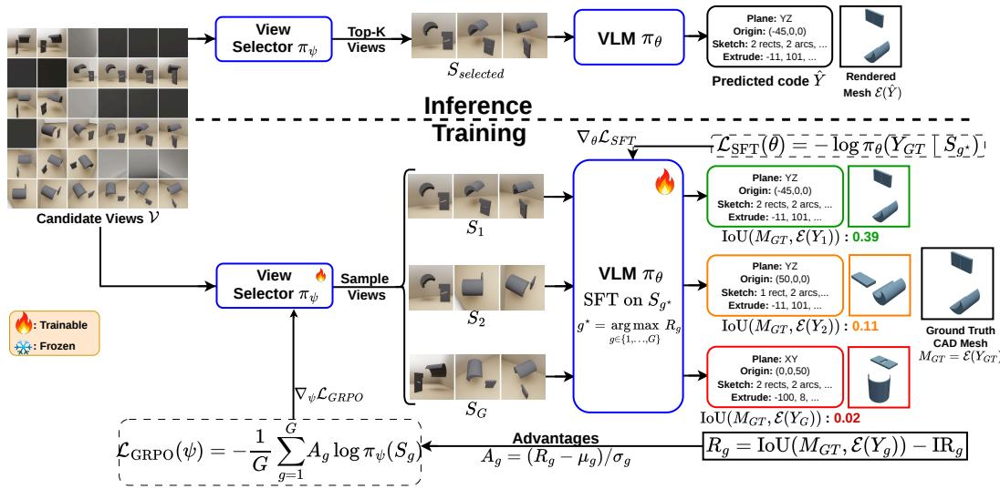  
Figure 1: SightCAD joint training paradigm: the view selector actively learns the VLM’s view Fig: Joint Training Paradigm: View Selector actively learns VLMs preferences via GRPOpreferences via GRPO while the VLM learns to understand and exploit view selections that maximize reward via SFT. Here $\psi$ Here , represent the trainable parameters of the view selector and code generation VLMrespectively. is a subset of the calibrated views , is the invalid code reward and is theand θ are the trainable parameters of the view selector and the code-mesh computed after the render execution operation on code generation VLM, respectively; S is a subset of the calibrated views V; IR is the invalid-code penalty (−0.5, Eq.1); and $M _ { g }$ is the mesh computed by the execution operation E (exec in text) on code $Y _ { g }$

In this work, we formalize this problem for CAD reconstruction. Placing an object in a realistic indoor scene renders part of the fixed view grid infeasible, so a method built to consume a fixed set of perspectives cannot exploit the views that remain available; a learned, budget-aware view selection strategy becomes necessary.

Is learning necessary? Decades of next-best-view (NBV) heuristics exist (Connolly, 1985; Scott et al., 2003), and greedy coverage maximization, from viewpoint entropy (Vazquez et al., 2002)´ to volumetric information gain (Isler et al., 2016), is near-optimal for coverage (Nemhauser et al., 1978). But coverage is only a proxy for reconstruction, and for program recovery it is a poor one: accuracy hinges on a distortion-free readout of the program parameters from visual input. This dependence on view geometry was recognized early in photogrammetric network design (Fraser et al., 1984) and rediscovered by uncertainty-driven active reconstruction (Pan et al., 2022). We show that a view selector trained end-to-end with a CAD generator can learn a better view policy when rewarded for final reconstruction as it learns to trade coverage for parameter legibility.

## Thus, our contributions are:

1. A new problem and dataset. We formalize scene-embedded CAD reconstruction under physically derived view feasibility, and release a large-scale multi-view dataset in which objects from CAD-Recode (Rukhovich et al., 2025) and Text2CAD (Khan et al., 2024) are placed in SceneNet (Handa et al., 2016) rooms across three occlusion regimes (floor, wall, corner).

2. A joint selection–generation RL framework. We propose SightCAD, a CAD reconstruction framework where we train a discrete view-subset policy jointly with an autoregressive CAD-code generator against an executable geometric reward, using shared rollouts so that credit is assigned separably to the choice of views and the choice of tokens.

3. An analysis of the learned perception strategy. We show that the learned policy is interpretable and budget-dependent, and give a mechanistic account of which views make which program parameters legible (Appendix A.1).

4. State-of-the-art scene-embedded CAD reconstruction. Our framework SightCAD’s learned view selection policy outperforms SA-max selection at every budget $K \in$ $\{ 1 , \ldots , 5 \}$ , and the full system outperforms cadrille (Kolodiazhnyi et al., 2025), Gen-CAD (Alam & Ahmed, 2024), and CAD-Recode←TripoSR (Tochilkin et al., 2024) on DeepCAD, Fusion360, T-LESS (Hodan et al., 2017) and MP6D (Chen et al., 2022) under matched scene occlusion, as well as real renders e.g., 68.5 vs. 49.1 mIoU on DeepCAD.

## 2 RELATED WORK

Parametric CAD generation from visual input. DeepCAD (Wu et al., 2021) introduced generative modeling of sketch-and-extrude sequences, and subsequent work recast reconstruction as code generation: CAD-Recode translates point clouds into executable programs with an LLM decoder (Rukhovich et al., 2025), cadrille extends the recipe to multi-view images and fine-tunes its generator with online RL (Kolodiazhnyi et al., 2025), and ReCAD likewise tunes a VLM with geometric rewards (Li et al., 2026). A parallel line conditions generation on a single image, either through diffusion and contrastive priors (Alam & Ahmed, 2024) or by first lifting the image to a mesh and then recovering the program (Tochilkin et al., 2024). All of these methods assume a freespace object and unconstrained viewpoints; none models which views are available, and none selects among them. We inherit the code-as-output formulation and the group-relative RL machinery, but make view acquisition itself part of the learned policy.

Next-best-view planning and active reconstruction. View planning is a classical problem (Connolly, 1985; Scott et al., 2003), and coverage has been its dominant objective. Viewpoint entropy scores a view by the entropy of its projected face areas (Vazquez et al., 2002; Polonsky et al.,´ 2005), volumetric formulations maximize newly observed surface (Isler et al., 2016; Delmerico et al., 2018), and submodularity grants greedy selection $( 1 - 1 / e )$ near-optimality (Nemhauser et al., 1978; Krause & Golovin, 2014). Learned variants inherit the same objective: NBV networks are supervised on coverage (Mendoza et al., 2020; Zeng et al., 2020), and RL scanners reward it directly (Peralta et al., 2020; Chen et al., 2024). A more recent wave instead selects views by the uncertainty of an in-progress neural-field reconstruction (Pan et al., 2022; Lee et al., 2022; Jin et al., 2023; Jiang et al., 2023), and goal-oriented, frame-budgeted, and occlusion-aware variants are beginning to appear (Zhu et al., 2026; Song et al., 2026; Gao et al., 2026). All of this work, however, outputs dense geometry, plans sequentially with the reconstruction in the loop, and optimizes objectives that are independent of any downstream decoder. Our setting differs on multiple axes: the geometric output is a CadQuery program, views are chosen as a one-shot budgeted subset by an amortized policy, feasibility is imposed by the scene, and the objective is the fidelity of the executed program.

Task-driven view selection. Closest to our mechanism, MVSelect trains an RL camera-selection module jointly with a task network under a compute budget (Hou et al., 2023), and related policies choose views for active recognition and pose estimation (Jayaraman & Grauman, 2016; Gartner¨ et al., 2020) or for manipulation under occlusion (Bai et al., 2026). In the CAD domain, MV-GEL ranks rendered views by the language-conditioned observability of a queried geometric entity for localization on meshes (Bali & Aydin, 2026), though its views serve a discriminative grounding task and are scored independently rather than selected as a budgeted subset. These tasks are discriminative or control-oriented and provide dense feedback. On the theory side, our setting can be read as Bayesian experimental design (Lindley, 1956; Foster et al., 2021) and mismatched decoding (Csiszar & Narayan, 1995; Lapidoth, 1996) applied to view selection; Zhu et al. (2026) independently argue for task-specific NBV in a Bayesian framework, but target dense geometries and do not learn an amortized policy.

## 3 DATASET

In this section we describe our data creation pipeline, in which we embed CAD objects in generated indoor scenes, and illustrate our viewpoint sampling. We also describe our initial view selection policy, hereafter surface-area maximization (SA-max).

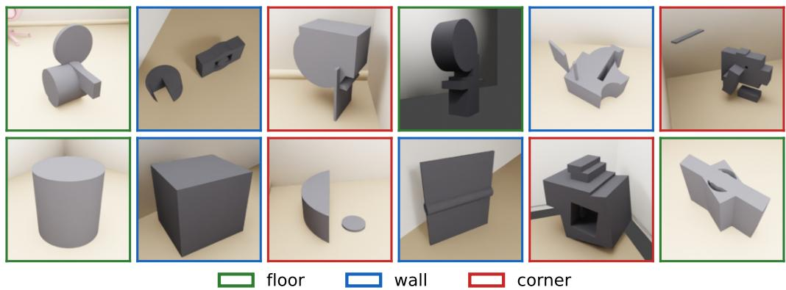  
Figure 2: Scene-embedded CAD objects. Objects from CAD-Recode and Text2CAD are placed into furnished SceneNet office rooms under three occlusion regimes: floor (free-standing), wall (one open half-space), and corner (wedged between two walls). Placement determines which of the N=36 candidate views are feasible.

Source CAD models and scene placement. Ground-truth solids and their executable Cad-Query programs come from CAD-Recode v1.5 (Rukhovich et al., 2025) (523k objects) and Text2CAD (Khan et al., 2024) (44k objects), spanning a broad range of sketch-and-extrude complexity. Each object is rescaled to a maximum extent of 0.8–1.0 m and given one placement in one of seven furnished SceneNet office-room variants, under one of three occlusion regimes, sampled uniformly: floor (free-standing, mild self-occlusion), wall (flush against one wall, one open halfspace), and corner (wedged between two walls). Floor placements sample a collision-free floor position whose surrounding camera orbit is unobstructed; wall and corner placements draw from curated pools of 10 wall and 17 corner anchors (curation details in Appendix A.4). As seen in Fig. 2, each object is placed at a random yaw in [0, 2π) with respect to the walls, with the camera grid rotated to compensate, so view indices stay in the object’s canonical frame.

Rendering and view feasibility. Scenes are rendered with BlenderProc (Denninger et al.) (Cycles) at 256×256 under the room’s own lighting plus local key/fill lights. Each placement is captured from a fixed grid of N=36 viewpoints with three elevation rings $\{ \overline { { 0 ^ { \circ } } } , 3 0 ^ { \circ } , 6 0 ^ { \circ } \} \times$ twelve azimuths (30◦ spacing) with each view tagged by its canonical pose. This grid is the action space of the view selector. For each placement we sample P=8000 surface points (with area weights a) and ray-cast from every camera to obtain a scene-aware visibility matrix $\dot { V } \dot { \in } \lbrace 0 , 1 \rbrace ^ { N \times P }$ , marking a point invisible under self- or scene occlusion. The occlusion-aware coverage of view i is the visible surface-area fraction $\begin{array} { r } { c _ { i } = \sum _ { p } V _ { i , p } a _ { p } / \sum _ { p } a _ { p } , } \end{array}$ , and a view is feasible when $c _ { i } > \epsilon ( \epsilon = 0 . 0 1 )$ which masks out cameras inside or behind walls. This yields our SA-max policy: the ordering that repeatedly appends the view adding the most newly visible area (Appendix A.3.2).

## 4 METHOD

## 4.1 PROBLEM FORMULATION

An object O is embedded in a scene context C and observed from a fixed three-ring grid of candidate viewpoints (Sec. 3). A view is occluded if the camera lies inside or behind scene geometry, or if the scene blocks sight of the object. Each view provides a render $I _ { i }$ with known pose $p _ { i }$ . Together these form the calibrated candidate set $\mathcal { V } = \{ ( I _ { i } ^ { \phantom { } } , p _ { i } ) \} _ { i = 1 } ^ { N }$ . Given a budget K, a selection policy $\pi _ { \psi }$ chooses a subset $S \subset \{ 1 , \ldots , N \}$ of feasible views (Sec. 3), $| S | = K$ , and a generator produces a CadQuery program $y \sim \pi _ { \boldsymbol { \theta } } ( \cdot \mid \{ I _ { i } \} _ { i \in S } )$ whose execution yields a solid $\hat { O } = \csc ( y )$ ; hereafter we write $\pi _ { \theta } ( \cdot \mid S )$ for $\pi _ { \boldsymbol { \theta } } ( \cdot \cdot \mid \{ I _ { i } \} _ { i \in { S } } )$ . The joint objective is

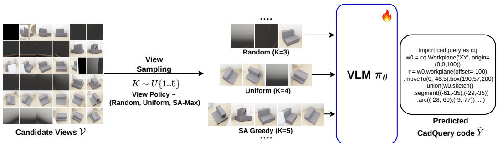  
Figure 3: SightCAD generator warm-starting on variable-K multi-view subsets: candidate views are sampled under three view policies (random, uniform, SA-max) with $K \sim \mathrm { U } \{ 1 , \ldots , 5 \}$

$$
\operatorname* { m a x } _ { \pi _ { \psi } , \pi _ { \theta } } \mathbb { E } _ { S \sim \pi _ { \psi } ( \cdot | \mathcal { V } ) } \mathbb { E } _ { y \sim \pi _ { \theta } ( \cdot | S ) } \big [ R ( y , O ) \big ] ,
$$

$$
R ( y , O ) = { \left\{ \begin{array} { l l } { \operatorname { I o U } ( { \hat { O } } , O ) } & { y { \mathrm { ~ i s ~ e x e c u t a b l e ~ a n d ~ p r o d u c e s ~ a ~ n o n - e m p t y ~ s o l i d } } , } \\ { - 0 . 5 } & { { \mathrm { o t h e r w i s e } } } \end{array} \right. }\tag{1}
$$

with volumetric IoU computed between voxelized solids. The reward is observable only after discrete selection, autoregressive decoding, and CAD kernel execution; no gradient path connects R to either policy.

## 4.2 ARCHITECTURE

View selector. The view selector $\pi _ { \psi }$ maps the full calibrated view set $\nu$ to per-view logits $z \in$ $\mathbb { R } ^ { N }$ . Each render is encoded by a frozen DINOv2 ViT-S/14 backbone (Oquab et al., 2023); pose is injected by sinusoidal azimuth/elevation encodings; a cross-view transformer exchanges information across the N view candidates so that logits reflect joint evidence for per-view quality (for further details on the architecture, refer to Appendix A.3.1). During training, subsets are drawn without replacement by sequential masked sampling from the softmax over the logits z (Eq.2; Singh & Joachims, 2019); at inference the deterministic top-K views are taken.

$$
i _ { k } \sim P ( i | i _ { 1 } , \dots , i _ { k - 1 } ) = { \frac { \exp z _ { i } \cdot \mathbb { 1 } [ i \not \in \{ i _ { 1 } , \dots , i _ { k - 1 } \} ] } { \sum _ { j \not \in \{ i _ { 1 } , \dots , i _ { k - 1 } \} } \exp z _ { j } } } , \qquad k = 1 , \dots , K\tag{2}
$$

Summing the per-step log-probabilities of Eq.2 gives the log-probability the policy assigns to the whole ordered draw ${ \cal S } = ( i _ { 1 } , \dots , i _ { K } )$

$$
\log \pi _ { \psi } ( S ) = \sum _ { k = 1 } ^ { K } \log \frac { \exp z _ { i _ { k } } } { \sum _ { j \not \in \{ i _ { 1 } , \ldots , i _ { k - 1 } \} } \exp z _ { j } } .\tag{3}
$$

Generator. The generator $\pi _ { \theta }$ is a Qwen2-VL vision–language model (Wang et al., 2024) (∼2B parameters) initialized from the multi-view image-to-CadQuery checkpoint of cadrille (Kolodiazhnyi et al., 2025), which supplies a strong sketch-and-extrude code prior. It takes the K views selected by $\pi _ { \psi }$ and concatenates them in a horizontal strip as input: each render is tokenized into visual tokens by the vision encoder and interleaved, in ascending view-index order, with a short textual pose tags $( { \tt e } \langle { \tt e l e v } \rangle _ { - } \mathrm { a } \langle \mathrm { a z i m } \rangle )$ for each view in the strip, derived from the camera’s position on the view grid. Conditioned on this multimodal prompt, πθ autoregressively emits a program y.

## 4.3 TRAINING

We divide training into three phases: Network Warm-Starting, where we prime both the view selector and the generator VLM for stable downstream RL; Joint Training, where the view selector is trained with Group Relative Policy Optimization (GRPO) (Shao et al., 2024) while the generator VLM is concurrently fine-tuned with the negative log-likelihood (NLL) of the ground-truth CadQuery code; and Generator RL Tuning, where the view selector is frozen and the VLM is trained with GRPO on its own high-temperature samples, rewarded against the ground-truth geometry. Each stage runs for one epoch over the entire scene-embedded CAD dataset (Sec. 3).

Network Warm-Starting. Using an untrained VLM as the reward model leads to unstable RL training due to uninformative initial rewards. We therefore prime the CadQuery generator to handle variable viewpoints and view counts: it is fully fine-tuned with token-level NLL on ground-truth programs, conditioned on view sets drawn from a curriculum mixing the SA-max, random, and uniformly spaced view policies, with $K \sim \mathrm { U } \{ 1 , \ldots , 5 \}$ (Fig. 3). The uniformly spaced policy is a naive, scene-agnostic orbit scan (Appendix A.4). This mixture prevents the generator from overfitting to any fixed view rig and prepares it to exploit whatever views the selector later provides. We likewise initialize the view selector by distilling an already viable SA-max strategy (Appendix A.3.2, Fig. 24) that naturally prioritizes object visibility and filters out occluded views.

Joint Training: View Selector RL + Generator SFT. After initialization, the view selector policy $\pi _ { \psi }$ is optimized with GRPO adapted to view subsets (Fig. 1). For each object, a group of G subsets $S _ { 1 } , \dots , S _ { G } \sim \pi _ { \psi }$ is sampled via Eq.2. The warm-started generator πθ decodes each subset greedily, and the rewards $R _ { g }$ from $\mathrm { E q . l }$ are converted to group-relative advantages, which weight the logprobabilities of the sampled subsets to form the selector loss (Eq.4):

$$
A _ { g } = \frac { R _ { g } - \mathrm { m e a n } ( R _ { 1 : G } ) } { \mathrm { s t d } ( R _ { 1 : G } ) + \varepsilon } , \qquad \mathcal { L } _ { \mathrm { G R P O } } ( \psi ) = - \frac { 1 } { G } \sum _ { g = 1 } ^ { G } A _ { g } \log \pi _ { \psi } ( S _ { g } ) .\tag{4}
$$

Concurrently, the generator $\pi _ { \theta }$ is trained with the negative log-likelihood of the ground-truth code $Y _ { \mathrm { G T } }$ conditioned on the highest-reward view set in the group:

$$
\mathcal { L } _ { \mathrm { S F T } } ( \theta ) = - \log \pi _ { \theta } \mathopen { } \mathclose \bgroup \left( Y _ { \mathrm { G T } } \mid S _ { g ^ { \star } } \aftergroup \egroup \right) , \qquad g ^ { \star } = \arg \operatorname* { m a x } _ { g \in \{ 1 , . . . , G \} } \ R _ { g } .\tag{5}
$$

Because all subsets in a group share the same object and the generator decodes greedily, reward differences within a group are largely attributable to the selected views. The SFT update is additionally gated by ground-truth view visibility, so the generator is never trained to hallucinate unseen geometry. We sample G=4 subsets per object across 4 GPUs in Distributed Data Parallel (Li et al., 2020); optimizer and visibility-gate hyperparameters are listed in Appendix A.4 (Table 6).

Generator RL Tuning. Once the view selector converges, it is frozen and the joint-trained generator $\pi _ { \theta }$ is further optimized with standard GRPO over G decodes $Y _ { 1 } , \dots , Y _ { G }$ sampled at high temperature $\left( \tau = 0 . 9 \right)$ , as shown in Fig. 4, conditioned on the frozen selector’s views $S ^ { \star }$ and scored with the same executable IoU reward. For training stability we regularize the policy toward the initialization checkpoint $\pi _ { \mathrm { r e f } }$ with a per-token KL penalty:

$$
{ \mathcal { L } } _ { \mathrm { G R P O } } ( \theta ) = - { \frac { 1 } { G } } \sum _ { g = 1 } ^ { G } { \frac { 1 } { | Y _ { g } | } } \sum _ { t = 1 } ^ { | Y _ { g } | } \left[ A _ { g } \log \pi _ { \theta } ( y _ { g , t } \mid y _ { g , < t } , S ^ { \star } ) \ - \ \beta { \widehat \mathbb { D } } _ { \mathrm { K L } , t } [ \pi _ { \theta } \parallel \pi _ { \mathrm { r e f } } ] \right] ,\tag{6}
$$

where the advantages $A _ { g }$ are computed as in Eq.4 and the KL term uses the unbiased non-negative estimator of Shao et al. (2024):

$$
\widehat { \mathbb { D } } _ { \mathrm { K L } , t } [ \pi _ { \theta } \left. \pi _ { \mathrm { r e f } } \right. = \frac { \pi _ { \mathrm { r e f } } ( y _ { g , t } \mid y _ { g , < t } , S ^ { \star } ) } { \pi _ { \theta } ( y _ { g , t } \mid y _ { g , < t } , S ^ { \star } ) } - \log \frac { \pi _ { \mathrm { r e f } } ( y _ { g , t } \mid y _ { g , < t } , S ^ { \star } ) } { \pi _ { \theta } ( y _ { g , t } \mid y _ { g , < t } , S ^ { \star } ) } - 1 .\tag{7}
$$

For $\widehat { \mathbb { D } } _ { \mathrm { K L } , t } [ \pi _ { \theta } \parallel \pi _ { \mathrm { r e f } } ]$ we choose $\pi _ { \mathrm { r e f } }$ to be the final SFT weights of the joint-trained generator; the remaining hyperparameters are listed in Appendix A.4 (Table 6). Decoupling the two RL phases assigns GRPO credit to the correct module in each: a single combined RL objective over both $\pi _ { \psi }$ and $\pi _ { \theta }$ would confound whether reward variation stems from the views or from the decode.

## 5 EVALUATION

Data and metrics. We evaluate our framework on a held-out test split of the CAD-Recode and Text2CAD datasets comprising ∼4k CAD objects for view policy comparison, and compare against external baselines on the DeepCAD-test and Fusion360 datasets, with object placements spanning further learns to understand views and express code better via GRPO on high temperature codefloor/wall/corner occlusion regimes. Placements are randomly sampled and frozen, thus every VLM respectively. is a subset of the calibrated views , is the invalid code reward and ismethod and view policy is evaluated on identical placements and occlusion patterns. For a more realistic setting, we further use two multi-view industrial CAD datasets: T-LESS (Hodan et al., 2017), with both synthetic re-renders of the CAD models (n=30) and real captured images $\left( n { = } 1 3 8 \right.$ multi-view sets), and the metal-parts dataset MP6D (Chen et al., 2022) (n=20 synthetic, n=200 real multi-view sets extracted from video frames). We report invalidity ratio (IR%: generations that fail to execute or produce an empty solid), median Chamfer distance $( \times 1 0 ^ { 3 }$ , computed on valid samples only), and mean volumetric IoU (mIoU%, over valid samples). We additionally report an effective variant $\mathrm { ( m I o U _ { \mathrm { e f f } } ) }$ that scores every sample, assigning zero IoU to invalid generations. These metrics are computed under two scoring protocols i.e view-policy comparison and cross-method comparison, matched to what each can assume. The view-policy comparisons (Table 1) share our canonical frame and metric scale by construction and thus absolute-size and placement errors are penalized as genuine program errors. The cross-method comparisons (Tables 2, 3, 4) involve baselines whose outputs carry arbitrary units. We therefore adopt a scale-invariant protocol that normalizes each predicted and ground-truth mesh independently to the unit cube before computing IoU and Chamfer distance, so that no method is penalized for its unit rather than for its geometry.

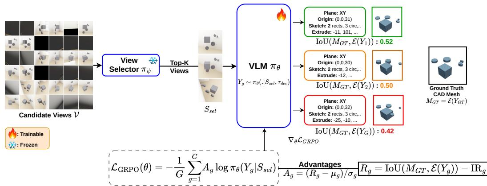  
Figure 4: SightCAD generator RL tuning: the view selector trained in the joint stage is kept frozen while the VLM further learns to understand views and express code better via GRPO on hightemperature code rollouts. All mathematical expressions are as per Fig. 1. KL regularization toward the SFT reference $( \beta \widehat { \mathbb { D } } _ { \mathrm { K L } } [ \pi _ { \theta } \Vert \pi _ { \mathrm { r e f } } ]$ , Eq.6) omitted for clarity.

Evaluation structure and baselines. We organize the evaluation into three comparisons. (i) Coadapted generator: each policy is paired with the generator co-trained on its own views (Sec. 4.3), reported at both stages, SFT and +GRPO, with a separate pair per budget $K \in \{ 1 , \ldots , 5 \}$ , contrasting the learned policy against SA-max and its curvature-weighted variant fw-SA (Appendix A.4). (ii) Policy-neutral generator: the single warm-started generator (Sec. 4.3) decodes random, uniform, SA-max, fw-SA, and learned selections, isolating view quality from co-adaptation. For both (i) and (ii) we use our test split of ∼4k CAD objects. (iii) External CAD baselines: SightCAD (K=4, SFT and +GRPO) against cadrille (Kolodiazhnyi et al., 2025), CAD-Coder (Doris et al., 2026), CAD-Fit (Nehme et al., 2026), CAD-Recode←TripoSR (Tochilkin et al., 2024; Rukhovich et al., 2025), and GenCAD (Alam & Ahmed, 2024), each on its native input convention (Appendix A.2).

View Selector Co-adapted Generator. Table 1a pairs each policy with its co-trained generator. IoU increases monotonically with the budget for both policies and both training stages, and the learned selector outperforms SA-max at every K, by 3.3 to 5.3 mIoU after joint training (SFT) and by up to +6.4 after generator RL (+GRPO). This gap holds within every occlusion regime (Appendix Table 8). Generator RL training improves both policies over their SFT stage, and the improvement is larger for the learned views. The fw-SA columns test whether a part-aware coverage objective closes this gap: despite the transfer disadvantage of decoding through the SA-max–co-adapted generator, fw-SA matches SA-max within 0.7 mIoU at every budget $\bar { K \geq 2 }$ (at K=3: 47.66 vs. 47.75 SFT and 54.40 vs. 54.72 +GRPO; see Appendix A.5), so curvature-weighted coverage is interchangeable with plain coverage yet remains far below the learned policy.

Table 1: What view selection is worth, and what co-adaptation adds. Left (a): each policy is paired with the generator trained alongside it, at both stages (SFT, +GRPO). Right (b): a single policy-neutral warm-started generator decodes the views chosen by five selection policies fw-SA is a curvature-saliency-reweighted variant of SA-max (Appendix A.4). Scene-embedded test split, mIoUeff (%); standard errors are 0.46–0.53 throughout (n=4000 objects).
<table><tr><td rowspan="2">K</td><td colspan="2">SA-max (a)</td><td colspan="2">fw-SA (a)</td><td colspan="2">Learned (a)</td><td colspan="5">Policy-neutral generator (b)</td></tr><tr><td>SFT</td><td>+GRPO</td><td>SFT</td><td>+GRPO</td><td>SFT</td><td>+GRPO</td><td>Random</td><td>Uniform</td><td>SA-max</td><td>fw-SA</td><td>Learned</td></tr><tr><td>1</td><td>45.80</td><td>53.05</td><td>44.15</td><td>50.98</td><td>49.97</td><td>55.86</td><td>24.36</td><td>23.79</td><td>40.90</td><td>39.23</td><td>44.05</td></tr><tr><td>2</td><td>47.36</td><td>54.28</td><td>46.72</td><td>53.75</td><td>50.68</td><td>56.95</td><td>33.11</td><td>36.40</td><td>44.44</td><td>44.32</td><td>46.04</td></tr><tr><td>3</td><td>47.75</td><td>54.72</td><td>47.66</td><td>54.40</td><td>51.69</td><td>58.51</td><td>36.89</td><td>40.57</td><td>46.02</td><td>46.11</td><td>47.46</td></tr><tr><td>4</td><td>48.15</td><td>55.16</td><td>48.26</td><td>54.99</td><td>52.90</td><td>60.52</td><td>38.82</td><td>42.68</td><td>46.30</td><td>46.59</td><td>47.81</td></tr><tr><td>5</td><td>48.55</td><td>55.40</td><td>48.89</td><td>55.29</td><td>53.88</td><td>61.79</td><td>39.85</td><td>43.81</td><td>46.01</td><td>46.68</td><td>48.86</td></tr></table>

Table 2: DeepCAD-test and Fusion360-test (n=100 each).
<table><tr><td></td><td colspan="4">DeepCAD</td><td colspan="4">Fusion360</td></tr><tr><td>Method</td><td>IR%↓</td><td>medCD↓</td><td>mIoU% ↑</td><td>mIoUeff ↑</td><td>IR%↓</td><td>medCD↓</td><td>mIoU% ↑</td><td>mIoUeff ↑</td></tr><tr><td>Ours (K=4, +GRPO)</td><td>0.00</td><td>5.36</td><td>68.49</td><td>68.49</td><td>1.00</td><td>10.42</td><td>53.56</td><td>53.03</td></tr><tr><td>Ours (K=4, SFT)</td><td>0.00</td><td>6.83</td><td>62.18</td><td>62.18</td><td>1.00</td><td>11.96</td><td>49.86</td><td>49.36</td></tr><tr><td>cadrille</td><td>4.00</td><td>18.30</td><td>49.05</td><td>47.09</td><td>5.00</td><td>33.62</td><td>37.73</td><td>35.85</td></tr><tr><td>CAD-Fit</td><td>6.00</td><td>21.07</td><td>47.08</td><td>44.26</td><td>17.00</td><td>26.46</td><td>40.32</td><td>33.47</td></tr><tr><td>CAD-Coder</td><td>2.00</td><td>37.10</td><td>38.29</td><td>37.52</td><td>3.00</td><td>66.61</td><td>28.56</td><td>27.71</td></tr><tr><td>CAD-Recode←TripoSR</td><td>16.00</td><td>76.92</td><td>18.84</td><td>15.83</td><td>15.00</td><td>80.07</td><td>18.10</td><td>15.38</td></tr><tr><td>GenCAD</td><td>58.00</td><td>91.04</td><td>18.21</td><td>7.65</td><td>77.00</td><td>46.77</td><td>16.43</td><td>3.78</td></tr></table>

Fixed Policy Neutral Generator. Table 1b isolates view quality by decoding all five policies with the single policy-neutral generator (Sec. 4.3). The ordering learned > fw-SA ≈ SA-max > uniform > random holds at every budget except K=1, where uniform trails random: the learned views are on average more informative for CadQuery code prediction, and the learned-over-SA-max gap is significant at every budget. The gaps separate the value of selection into two components: occlusion-aware coverage selection contributes the most (SA-max over random), and image-based learned selection adds a further +1.4 to +3.2 over SA-max at every budget. Under this fully policyneutral decode, fw-SA is statistically indistinguishable from SA-max at $K \in \{ 2 , 3 , 4 \}$ , worse at K=1, and +0.7 at K=5, while the learned policy stays significantly ahead of both at every budget (for a mechanistic analysis, refer to Appendix A.1.2).

Comparison with Other CAD Baselines. Tables 2, 3, and 4 report our framework evaluated on external datasets against existing CAD baselines. Every baseline is evaluated on its own native input format, and the scene contributes only occlusion: where a native viewpoint is occluded by the object’s scene-embedded placement, the corresponding view is replaced by a blank frame (perbaseline conventions in Appendix A.2). SightCAD (K=4, +GRPO) achieves the best $\mathrm { m I o U _ { e f f } }$ on the scene-embedded benchmarks (DeepCAD-test, Fusion360, T-LESS synth, MP6D synth) and on canonicalized real captures (T-LESS canon and MP6D real), and emits the most executable CAD: its invalid rate is 1.45% on real photographs and 0.00% after canonicalization. The T-LESS real evaluation feeds real photographs from the wild directly to each method. The canon evaluation applies a model-agnostic, test-time-only domain match (SAM segmentation (Kirillov et al., 2023), exposure normalization, and compositing onto each baseline’s own native plate, without retraining or ground truth), which places every CAD viewpoint in its most favorable in-distribution image setting. On T-LESS real images our approach trails some baselines due to an image-distribution gap that canonicalization removes. Unlike the CAD-benchmark evaluations, where the pose used to author the ground-truth program is known, neither T-LESS nor MP6D provides a canonical frame, and their real captures lie on scattered camera poses rather than on our discrete view grid. For our method only, we therefore apply a fixed two-step protocol before decoding: a learned alignment step (align-net) recovers the in-plane object orientation and re-anchors all view azimuths to it, and the available views are then snapped onto the selector’s training-time view lattice (one view per slot, blank tiles for unfilled slots) so that the frozen selector chooses its K views exactly as at training time. Both steps are applied identically to the synthetic, raw, and canonicalized conditions of each benchmark (details in Appendices A.3.3 and A.3.4). On MP6D (Table 4), whose captures are acquired on a plain background with no embedding scene, the raw–canon domain match required for T-LESS does not apply, so we report the synthetic and real conditions only; there SightCAD (K=4, +GRPO) leads every baseline on both, corroborating that the T-LESS real deficit is a backgrounddomain artifact rather than a multi-view reconstruction failure. For comparison of baselines on the internal ∼4k test split of our dataset, please refer to Table 9 in the Appendix.

Table 3: T-LESS industrial objects (n=138 real, n=30 synthetic).
<table><tr><td>Method</td><td colspan="4">Synth (n=30)</td><td colspan="4">Real (n=138)</td><td colspan="4">Canon (n=138)</td></tr><tr><td></td><td>IR%</td><td>medCD</td><td>mIoU%</td><td> $\mathrm { m I o U } _ { \mathrm { e f f } }$ </td><td>IR%</td><td>medCD</td><td>mIoU%</td><td> $\mathrm { m I o U } _ { \mathrm { e f f } }$ </td><td>IR%</td><td>medCD</td><td>mIoU%</td><td> $\mathrm { m I o U _ { \mathrm { e f f } } }$ </td></tr><tr><td>Ours (K=4, +GRPO)</td><td>0.00</td><td>18.79</td><td>54.02</td><td>54.02</td><td>1.45</td><td>111.59</td><td>8.38</td><td>8.26</td><td>0.00</td><td>43.56</td><td>32.48</td><td>32.48</td></tr><tr><td>Ours  $( K { = } 4 , \operatorname { S F T } )$ </td><td>3.33</td><td>24.47</td><td>46.76</td><td>45.20</td><td>4.35</td><td>101.41</td><td>9.68</td><td>9.25</td><td>11.59</td><td>71.36</td><td>19.83</td><td>17.53</td></tr><tr><td>cadrille</td><td>10.00</td><td>36.45</td><td>34.92</td><td>31.43</td><td>24.64</td><td>104.27</td><td>13.39</td><td>10.09</td><td>27.54</td><td>81.21</td><td>15.11</td><td>10.95</td></tr><tr><td>CAD-Fit</td><td>13.33</td><td>12.53</td><td>57.73</td><td>50.03</td><td>57.97</td><td>45.54</td><td>34.33</td><td>14.43</td><td>39.86</td><td>47.54</td><td>29.86</td><td>17.96</td></tr><tr><td>CAD-Coder</td><td>6.67</td><td>84.22</td><td>17.94</td><td>16.74</td><td>23.91</td><td>94.36</td><td>15.58</td><td>11.86</td><td>2.90</td><td>58.36</td><td>27.11</td><td>26.32</td></tr><tr><td>CAD-Recode←TripoSR</td><td>6.67</td><td>40.23</td><td>34.83</td><td>32.51</td><td>17.39</td><td>47.65</td><td>31.06</td><td>25.66</td><td>13.04</td><td>65.47</td><td>23.02</td><td>20.01</td></tr><tr><td>GenCAD</td><td>96.67</td><td>73.66</td><td>14.24</td><td>0.47</td><td>95.65</td><td>93.62</td><td>11.48</td><td>0.50</td><td>51.45</td><td>86.42</td><td>17.74</td><td>8.61</td></tr></table>

Table 4: MP6D industrial objects (n=200 real, n=20 synthetic).
<table><tr><td></td><td colspan="4">Synth  $( n { = } 2 0 )$ </td><td colspan="4">Real (n=200)</td></tr><tr><td>Method</td><td>IR%</td><td>medCD</td><td>mIoU%</td><td> $\mathrm { m I o U _ { e f f } }$ </td><td>IR%</td><td>medCD</td><td>mIoU%</td><td> $\mathrm { m I o U _ { e f f } }$ </td></tr><tr><td>Ours (K=4, +GRPO)</td><td>0.00</td><td>20.55</td><td>48.31</td><td>48.31</td><td>0.50</td><td>57.91</td><td>25.71</td><td>25.58</td></tr><tr><td>Ours (K=4, SFT)</td><td>10.00</td><td>31.22</td><td>40.81</td><td>36.73</td><td>4.00</td><td>72.09</td><td>19.37</td><td>18.59</td></tr><tr><td>cadrille</td><td>10.00</td><td>26.91</td><td>43.03</td><td>38.73</td><td>30.50</td><td>77.94</td><td>18.44</td><td>12.82</td></tr><tr><td>CAD-Fit</td><td>20.00</td><td>29.51</td><td>42.39</td><td>33.91</td><td>21.50</td><td>71.03</td><td>21.85</td><td>17.16</td></tr><tr><td>CAD-Coder</td><td>15.00</td><td>49.47</td><td>27.51</td><td>23.38</td><td>7.50</td><td>66.28</td><td>21.45</td><td>19.84</td></tr><tr><td>CAD-Recode←TripoSR</td><td>15.00</td><td>42.30</td><td>30.91</td><td>26.27</td><td>14.50</td><td>68.81</td><td>18.65</td><td>15.95</td></tr><tr><td>GenCAD</td><td>80.00</td><td>112.53</td><td>9.19</td><td>1.84</td><td>65.00</td><td>103.74</td><td>7.55</td><td>2.64</td></tr></table>

Learned View Policy Analysis. View selection changes strongly with the budget K: a single mid-elevation canonical view at $K { = } 1$ , a narrow stereo wedge that pins the defining feature’s depth at $K { = } 2 .$ , and from $K { = } 3$ an orthographic front/side/plan drawing triad, recovering the projection conventions of a mechanical drawing from reward alone. We also probe mechanistically, locating each view’s visual tokens in the horizontal strip of the K views. At every decoder layer, we ablate the face-on (views angled at $\leq 1 5 ^ { \circ }$ to the part’s sketch normal) and in-plane (views angled at $\ge 7 5 ^ { \circ } )$ view tokens by replacing them with the mean of the other views’ tokens, keeping hidden states in distribution. We then teacher-force the ground-truth CadQuery program and measure the resulting ∆NLL on specific token categories, extrude-depth digits and sketch-coordinate digits. This reveals that the learned policy supplies more of the in-plane views that carry the signal for accurate extrudedepth inference than any other view policy considered in this work (Fig. 8). The detailed analysis is in Appendix A.1.

## 6 CONCLUSION

We introduced scene-embedded CAD reconstruction under physically derived view feasibility and SightCAD, a framework that treats view acquisition as a learned, budgeted decision. SightCAD jointly trains a discrete view-subset selector and an autoregressive CadQuery generator against the volumetric IoU of the executed solid using shared-rollout GRPO, separating credit for the choice of views from credit for the choice of tokens. The learned selector outperforms SA policies at every budget, and the full system leads strong external baselines under matched scene occlusion while emitting executable code far more reliably. The learned policy partly recovers engineering-drawing projection conventions, prioritizing views that make program parameters, especially extrude depth, legible.

Limitations and future work. SightCAD selects from a fixed discrete view grid and assumes known camera parameters, object distance, and canonical anchor (compensable only partly at test time). Continuous camera control, relaxing the anchor assumption, and closing the raw-photograph gap are natural next steps. Our interpretability findings are moreover tied to the specific Qwen2-VL generator we train and may not transfer to other VLM backbones or tokenizations.

## AI USE STATEMENT

In this work, we used AI coding assistants to help with minor implementations of the training, rendering, and evaluation code. We have not used generative AI tools for creating CAD data: all training and evaluation data derive from existing public assets (CAD-Recode, Text2CAD, SceneNet, DeepCAD, Fusion360, T-LESS, MP6D) processed by our deterministic placement, rendering, and visibility pipeline. We additionally used generative AI tools for light editing of the manuscript text (grammar and phrasing). All AI-assisted work was reviewed by the authors: AI-generated code was verified and tested for correctness by the authors, all quantitative results were produced by executing the verified pipeline rather than by any generative model, and all edited text was checked for factual accuracy against our experimental records. We take responsibility for the final content of this work, including text, claims, and artifacts produced with the aid of generative AI.

## ETHICS STATEMENT

This work does not involve human subjects, personally identifiable information, or crowdsourced annotation. All datasets used are publicly available research benchmarks (CAD-Recode, Text2CAD, SceneNet, DeepCAD, Fusion360, T-LESS, MP6D) and are used in accordance with their licenses; our released dataset consists of synthetic renders of these assets and contains no private or sensitive content. The primary applications of this research, reverse-engineering, digitization, and repair of physical parts, are broadly beneficial; as with any reconstruction technology, it could in principle be used to copy proprietary parts, but our method offers no capability beyond what existing measurement and scanning tools already provide. We foresee no discrimination, fairness, privacy, or security concerns arising from this work, and we declare no conflicts of interest.

## REPRODUCIBILITY STATEMENT

We have made several efforts to ensure reproducibility. The problem formulation, reward, and training objectives are fully specified in Sec. 4 (Eq.1–7), and the data generation pipeline, including scene placement, rendering configuration, the N=36 view grid, and the visibility/feasibility computation, is described in Sec. 3. The view-selector architecture, SA-max warm-starting procedure, optimization hyperparameters, the T-LESS/MP6D alignment network, and the real-capture view-selection protocol are detailed in Appendix A.3, and the evaluation protocol, metrics, and baseline input conventions are given in Sec. 5 and Appendix A.5. We have attached the training and evaluation code in the supplementary and will subsequently release the rendered scene-embedded dataset together with the model checkpoints, so that all reported results can be regenerated end to end upon acceptance.

## REFERENCES

Md Ferdous Alam and Faez Ahmed. Gencad: Image-conditioned computer-aided design generation with transformer-based contrastive representation and diffusion priors. arXiv preprint arXiv:2409.16294, 2024.

Yongjie Bai, Zhouxia Wang, Yang Liu, Kaijun Luo, Yifan Wen, Mingtong Dai, Weixing Chen, Ziliang Chen, Lingbo Liu, Guanbin Li, et al. Learning to see and act: Task-aware virtual view exploration for robotic manipulation. In Proceedings of the IEEE/CVF Conference on Computer Vision and Pattern Recognition, pp. 13386–13396, 2026.

Kartik Bali and Roland Aydin. Mv-gel: Language-driven multi-view geometric entity localization on meshes. In European Conference on Computer Vision, pp. 599–617. Springer, 2026.

Long Chen, Han Yang, Chenrui Wu, and Shiqing Wu. Mp6d: An rgb-d dataset for metal parts’ 6d pose estimation. IEEE Robotics and Automation Letters, 7(3):5912–5919, 2022.

Xiao Chen, Quanyi Li, Tai Wang, Tianfan Xue, and Jiangmiao Pang. Gennbv: Generalizable nextbest-view policy for active 3d reconstruction. In 2024 IEEE/CVF Conference on Computer Vision and Pattern Recognition (CVPR), pp. 16436–16445. IEEE, 2024.

Cl Connolly. The determination of next best views. In Proceedings. 1985 IEEE international conference on robotics and automation, volume 2, pp. 432–435. IEEE, 1985.

Imre Csiszar and Prakash Narayan. Channel capacity for a given decoding metric. IEEE Transactions on Information Theory, 41(1):35–43, 1995.

Jeffrey Delmerico, Stefan Isler, Reza Sabzevari, and Davide Scaramuzza. A comparison of volumetric information gain metrics for active 3d object reconstruction. Autonomous Robots, 42(2): 197–208, 2018.

M Denninger, D Winkelbauer, M Sundermeyer, KH Strobl, M Humt, and R Triebel. Blenderproc2: a procedural pipeline for photorealistic rendering. j. open source softw. 8 (82), 4901 (2023).

Anna C Doris, Ferdous Alam, Amin Heyrani Nobari, and Faez Ahmed. Cad-coder: An opensource vision-language model for computer-aided design code generation. Journal ofMechanical Design, 148(7):071702, 2026.

Adam Foster, Desi R Ivanova, Ilyas Malik, and Tom Rainforth. Deep adaptive design: Amortizing sequential bayesian experimental design. In International conference on machine learning, pp. 3384–3395. PMLR, 2021.

Clive S Fraser et al. Network design considerations for non-topographic photogrammetry. Photogrammetric Engineering and Remote Sensing, 50(8):1115–1126, 1984.

Hongbo Gao, Wei Zhang, Zeyu Ni, Dihao Zhu, Ruifeng Li, Yunke Wang, and Chang Xu. Occamview: Object-conditioned view selection for frame-budgeted active 3d gaussian reconstruction. arXiv preprint arXiv:2608.16499, 2026.

Erik Gartner, Aleksis Pirinen, and Cristian Sminchisescu. Deep reinforcement learning for active¨ human pose estimation. In Proceedings of the AAAI Conference on Artificial Intelligence, volume 34, pp. 10835–10844, 2020.

Ankur Handa, Viorica Patraucean, Vijay Badrinarayanan, Simon Stent, and Roberto Cipolla. Understanding real world indoor scenes with synthetic data. In Proceedings of the IEEE conference on computer vision and pattern recognition, pp. 4077–4085, 2016.

Toma´s Hodan, Pavel Haluza, ˇ Step ˇ an Obdr ´ zˇalek, Jiri Matas, Manolis Lourakis, and Xenophon Zab- ´ ulis. T-less: An rgb-d dataset for 6d pose estimation of texture-less objects. In 2017 IEEE winter conference on applications ofcomputer vision (WACV), pp. 880–888. IEEE, 2017.

Yunzhong Hou, Stephen Gould, and Liang Zheng. Learning to select camera views: Efficient multiview understanding at few glances. arXiv preprint arXiv:2303.06145, 2023.

Stefan Isler, Reza Sabzevari, Jeffrey Delmerico, and Davide Scaramuzza. An information gain formulation for active volumetric 3d reconstruction. In 2016 IEEE international conference on robotics and automation (ICRA), pp. 3477–3484. IEEE, 2016.

Dinesh Jayaraman and Kristen Grauman. Look-ahead before you leap: end-to-end active recognition by forecasting the effect of motion. In European Conference on Computer Vision, pp. 489–505. Springer, 2016.

Wen Jiang, Boshu Lei, and Kostas Daniilidis. Fisherrf: Active view selection and uncertainty quantification for radiance fields using fisher information. arXiv preprint arXiv:2311.17874, 2023.

Liren Jin, Xieyuanli Chen, Julius Ruckin, and Marija Popovi ¨ c. Neu-nbv: Next best view planning ´ using uncertainty estimation in image-based neural rendering. In 2023 IEEE/RSJ International Conference on Intelligent Robots and Systems (IROS), pp. 11305–11312. IEEE, 2023.

Mohammad S Khan, Sankalp Sinha, Talha U Sheikh, Didier Stricker, Sk A Ali, and Muhammad Z Afzal. Text2cad: Generating sequential cad designs from beginner-to-expert level text prompts. Advances in Neural Information Processing Systems, 37:7552–7579, 2024.

Alexander Kirillov, Eric Mintun, Nikhila Ravi, Hanzi Mao, Chloe Rolland, Laura Gustafson, Tete Xiao, Spencer Whitehead, Alexander C Berg, Wan-Yen Lo, et al. Segment anything. In 2023 IEEE/CVF international conference on computer vision (ICCV), pp. 3992–4003. IEEE, 2023.

Maksim Kolodiazhnyi, Denis Tarasov, Dmitrii Zhemchuzhnikov, Alexander Nikulin, Ilya Zisman, Anna Vorontsova, Anton Konushin, Vladislav Kurenkov, and Danila Rukhovich. cadrille: Multi modal cad reconstruction with reinforcement learning. arXiv preprint arXiv:2505.22914, 2025.

Andreas Krause and Daniel Golovin. Tractability: Practical approaches to hard problems. In Submodular Function Maximization, pp. 71–104. Cambridge Univ. Press Cambridge, UK, 2014.

Amos Lapidoth. Mismatched decoding and the multiple-access channel. IEEE Transactions on Information Theory, 42(5):1439–1452, 1996.

Soomin Lee, Le Chen, Jiahao Wang, Alexander Liniger, Suryansh Kumar, and Fisher Yu. Uncertainty guided policy for active robotic 3d reconstruction using neural radiance fields. IEEE Robotics and Automation Letters, 7(4):12070–12077, 2022.

Jiahao Li, Yusheng Luo, Yunzhong Lou, and Xiangdong Zhou. Recad: Reinforcement learning enhanced parametric cad model generation with vision-language models. In Proceedings of the AAAI Conference on Artificial Intelligence, volume 40, pp. 6190–6198, 2026.

Shen Li, Yanli Zhao, Rohan Varma, Omkar Salpekar, Pieter Noordhuis, Teng Li, Adam Paszke, Jeff Smith, Brian Vaughan, Pritam Damania, et al. Pytorch distributed: Experiences on accelerating data parallel training. arXiv preprint arXiv:2006.15704, 2020.

Dennis V Lindley. On a measure of the information provided by an experiment. The Annals of Mathematical Statistics, 27(4):986–1005, 1956.

Miguel Mendoza, J Irving Vasquez-Gomez, Hind Taud, L Enrique Sucar, and Carolina Reta. Supervised learning of the next-best-view for 3d object reconstruction. Pattern Recognition Letters, 133:224–231, 2020.

Ghadi Nehme, Eamon Whalen, and Faez Ahmed. Cadfit: Precise mesh-to-cad program generation with hybrid optimization. arXiv preprint arXiv:2605.01171, 2026.

George L Nemhauser, Laurence A Wolsey, and Marshall L Fisher. An analysis of approximations for maximizing submodular set functions—i. Mathematical programming, 14(1):265–294, 1978.

Maxime Oquab, Timothee Darcet, Th´ eo Moutakanni, Huy Vo, Marc Szafraniec, Vasil Khalidov,´ Pierre Fernandez, Daniel Haziza, Francisco Massa, Alaaeldin El-Nouby, et al. Dinov2: Learning robust visual features without supervision. arXiv preprint arXiv:2304.07193, 2023.

Stephen E Palmer. Cannonical perspective and the perception of objects. Attention and performance, 9:135–151, 1981.

Xuran Pan, Zihang Lai, Shiji Song, and Gao Huang. Activenerf: Learning where to see with uncertainty estimation. In European Conference on Computer Vision, pp. 230–246. Springer, 2022.

Daryl Peralta, Joel Casimiro, Aldrin Michael Nilles, Justine Aletta Aguilar, Rowel Atienza, and Rhandley Cajote. Next-best view policy for 3d reconstruction. In European Conference on Computer Vision, pp. 558–573. Springer, 2020.

Oleg Polonsky, Giuseppe Patane, Silvia Biasotti, Craig Gotsman, and Michela Spagnuolo. What’s´ in an image? towards the computation of the “best” view of an object. The Visual Computer, 21 (8):840–847, 2005.

Danila Rukhovich, Elona Dupont, Dimitrios Mallis, Kseniya Cherenkova, Anis Kacem, and Djamila Aouada. Cad-recode: Reverse engineering cad code from point clouds. In 2025 IEEE/CVF International Conference on Computer Vision (ICCV), pp. 9801–9811. IEEE, 2025.

William R Scott, Gerhard Roth, and Jean-Franc¸ois Rivest. View planning for automated threedimensional object reconstruction and inspection. ACM Computing Surveys (CSUR), 35(1):64– 96, 2003.

Zhihong Shao, Peiyi Wang, Qihao Zhu, Runxin Xu, Junxiao Song, Xiao Bi, Haowei Zhang, Mingchuan Zhang, YK Li, Yang Wu, et al. Deepseekmath: Pushing the limits of mathematical reasoning in open language models. arXiv preprint arXiv:2402.03300, 2024.

Ashudeep Singh and Thorsten Joachims. Policy learning for fairness in ranking. Advances in neural information processing systems, 32, 2019.

Yan Song, Zhihao Li, Chenglong Li, Li He, Yan Wang, and Wenqiang Zhang. Go-pre: Goaloriented next-best-view selection via predictive rendering entropy for active 3d reconstruction. arXiv preprint arXiv:2607.29037, 2026.

Dmitry Tochilkin, David Pankratz, Zexiang Liu, Zixuan Huang, Adam Letts, Yangguang Li, Ding Liang, Christian Laforte, Varun Jampani, and Yan-Pei Cao. Triposr: Fast 3d object reconstruction from a single image. arXiv preprint arXiv:2403.02151, 2024.

Pere-Pau Vazquez, Miquel Feixas, Mateu Sbert, and Antoni Llobet. Viewpoint entropy: a new tool´ for obtaining good views of molecules. In ACM International Conference Proceeding Series, volume 22, pp. 183–188, 2002.

Peng Wang, Shuai Bai, Sinan Tan, Shijie Wang, Zhihao Fan, Jinze Bai, Keqin Chen, Xuejing Liu, Jialin Wang, Wenbin Ge, et al. Qwen2-vl: Enhancing vision-language model’s perception of the world at any resolution. arXiv preprint arXiv:2409.12191, 2024.

Rundi Wu, Chang Xiao, and Changxi Zheng. Deepcad: A deep generative network for computeraided design models. In 2021 IEEE/CVF International Conference on Computer Vision (ICCV), pp. 6752–6762. IEEE, 2021.

Rui Zeng, Wang Zhao, and Yong-Jin Liu. Pc-nbv: A point cloud based deep network for efficient next best view planning. In 2020 IEEE/RSJ International Conference on Intelligent Robots and Systems (IROS), pp. 7050–7057. IEEE, 2020.

Jingsen Zhu, Silvia Sellan, and Alexander Terenin. A bayesian approach for task-specific next-best-´ view selection with uncertain geometry. arXiv preprint arXiv:2605.05095, 2026.

## A APPENDIX

In this section we provide additional analysis, results, and framework details that could not be included in the main paper due to space constraints. In the A.1 subsection we provide a deeper statistical and mechanistic analysis of the learned view selection policy. In A.2 we qualitatively illustrate the view inputs and CAD reconstruction outputs for all the baselines and additional datasets compared in the main text. In A.3, we illustrate SightCAD view selector warm-starting training and align-net training for pose estimation for T-LESS and MP6D evaluations, and detail the viewselection protocol applied to the real and canonicalized captures of these benchmarks. In A.4, we collect dataset-curation and optimization details. In A.5, we complete the main-paper comparisons on the full scene-embedded test split, evaluating co-trained view policies and external baselines at scale, and report paired significance tests with an occlusion-regime breakdown.

## A.1 VIEW POLICY ANALYSIS

In this section we analyze the learned view selection strategy by examining how views change statistically at every budget and with changing part geometry. We also analyze mechanistically why these views perform optimally when input to the VLM CadQuery generator, by first looking at the CadQuery code per-property metrics across views. By ablating the views relevant to the metrics in the activation space of the generator we find these views help infer key properties for the CadQuery code like extrude depth and sketch parameters.

Table 5: Learned selection policy over the full evaluation set (4,000 test (CAD-Recode and Text2CAD) + 100 DeepCAD + 100 Fusion360, 1365 floor / 977 wall / 1858 corner), per budget K. ortho. # is the number of views in a selection whose azimuth is cardinal $( 0 ^ { \circ } , 9 0 ^ { \circ } , 1 8 0 ^ { \circ } , 2 7 0 ^ { \circ }$ on the 12-azimuth grid), averaged over objects. az-gap is the minimum pairwise azimuth gap within a selection; cov. is the fraction of the object’s surface area physically visible from the union of the selected views, rig is the mean fraction of a selection lying on the modal K-slot rig (the K globally most frequent view slots of that policy at that budget). fw-SA is the feature-weighted variant of SA-max whose greedy coverage objective reweights surface points by local curvature saliency (Appendix A.4). All columns span the full 4,200-object set for all three policies.
<table><tr><td></td><td colspan="4">Learned</td><td colspan="4">SA-max</td><td colspan="4">fw-SA</td></tr><tr><td>K</td><td>ortho. # az-gap (°) cov. %</td><td></td><td></td><td>rig %</td><td>ortho. #</td><td>az-gap (°) cov. %</td><td></td><td>rig %</td><td></td><td>ortho. # az-gap (°) cov. %</td><td></td><td>rig %</td></tr><tr><td>1</td><td>0.30</td><td></td><td>43.5</td><td>8.7</td><td>0.16</td><td></td><td>47.4</td><td>6.5</td><td>0.26</td><td></td><td>45.5</td><td>5.4</td></tr><tr><td>2</td><td>0.61</td><td>52.5</td><td>54.0</td><td>16.5</td><td>0.31</td><td>135.6</td><td>75.8</td><td>9.4</td><td>0.45</td><td>131.2</td><td>73.5</td><td>9.6</td></tr><tr><td>3</td><td>1.25</td><td>15.8</td><td>60.7</td><td>21.6</td><td>0.79</td><td>55.3</td><td>81.1</td><td>16.3</td><td>0.92</td><td>55.0</td><td>80.5</td><td>17.2</td></tr><tr><td>4</td><td>2.15</td><td>11.2</td><td>66.3</td><td>39.2</td><td>1.29</td><td>31.0</td><td>82.5</td><td>25.6</td><td>1.41</td><td>29.8</td><td>82.5</td><td>26.4</td></tr><tr><td>5</td><td>2.13</td><td>12.6</td><td>72.1</td><td>43.8</td><td>1.70</td><td>21.3</td><td>82.9</td><td>34.8</td><td>1.82</td><td>20.0</td><td>83.1</td><td>36.3</td></tr></table>

## A.1.1 WHAT DO THE LEARNED VIEWS LOOK LIKE?

Learned selection strategy. Table 5 quantifies all three policies over the full evaluation set (4,200 objects), and Fig. 5 shows representative selections side by side at every budget. The learned selector allocates its budget like an engineering draftsman, and its strategy changes qualitatively with K. Below the budget needed for a full drawing, selection is feature-centric: the whole budget is spent on the single region that fixes the most program parameters. At K=1 it takes a single mid-elevation (canonical) recognition view (Palmer, 1981) that maximizes the gross-shape visibility of the part, similar (but not identical) to the view chosen by SA-max. At K=2 it does not add a complementary face but a second view close in azimuth: a narrow stereo wedge straddling the same feature to pin its depth, plainly visible in the $K { = } 2$ rows of Fig. 5 and in the min az-gap column $( 5 2 . 5 ^ { \circ }$ against SA-max’s near-antipodal $1 3 5 . 6 ^ { \circ } )$ . Only from $K { = } 3 .$ , with the feature secured, does an axis-aligned reading appear: an orthographic front profile, a top-down plan, and a three-quarter anchor similar to the projection triad of a mechanical drawing. The ortho. # column traces this transition: the learned cardinal supply grows from 0.30 picks per selection at K=1 to 2.15 at K=4, a majority of the budget and 1.6–2× SA-max’s supply for $K \leq 4 ( 1 . 2 9$ at $K { = } 4 )$ , narrowing to 1.25× at $K { = } 5 ;$ : scoring area alone, SA-max prefers the oblique azimuths that graze the most surface. Simultaneously the min az-gap falls to ${ \sim } 1 1 ^ { \circ }$ as the selector stacks elevations at a shared azimuth to read a single face at several heights (the same-azimuth tile columns in Fig. 5). At K=5 the cardinal supply plateaus (2.13 from 2.15): the fifth learned view departs from the cardinal angles. This view legibility by the learned policy is bought at the expense of visible area coverage over the scene-embedded CAD part: in the cov. columns, learned subsets range from 43.5 to 72.1% of the object’s surface across $K \in \{ 1 , \ldots , 5 \}$ versus 47.4 to 82.9% for SA-max. SA-max essentially saturates by K=3 (81.1% to ≈83% ceiling) as the scene-embedded setting fundamentally hides part surface from all possible view angles. Both policies drift toward different templates as the budget grows (rig 6.5 to 34.8% SAmax, 8.7 to 43.8% learned in Table 5): SA-max’s view rig is entirely geometry-centric whereas the learned modal rig template is partly drawing-rig-centric (with the cardinal views at $K { \geq } 3 )$ and partly geometry-centric. The fw-SA columns show that curvature reweighting only nudges these statistics within the coverage family: fw-SA changes the selected set for roughly two thirds of objects, yet its cardinal supply, az-gap, coverage, and rig share all track SA-max closely (e.g. ortho. 1.41 vs. 1.29 at $K { = } 4 .$ , coverage within 2.3 pp everywhere) and stay far from the learned profile, mirroring the IoU tie of Table 1. We examine this geometry dependence in the next paragraph.

Dependence on part geometry. A natural concern is that the learned policy might collapse to a fixed per-K template. Our finding here is contrary: while selection tilts toward a shared canonical rig as the budget grows (rig share 8.7% at K=1 rising to 43.8% at K=5, Table 5), object-specific picks remain the majority at every budget, and Fig. 6 shows that these picks are dictated by part geometry alone. There, six parts of contrasting geometry are placed in the same room, at the same corner anchor, with the same $4 5 ^ { \circ }$ yaw. The selections diverge sharply beyond $K { = } 1$ (which largely converges to the e30 a120 view). The ring brackets its lateral through-hole with a narrow e30 wedge before adding a plan straight down the bore; the flat plate is read only from mid and high elevations, never from a level view that would foreshorten it to a sliver. The bore-pierced block stack gets level front views that project its bore as a true circle while the U-bracket’s budget goes almost entirely $\mathbf { t o } \in 6 0$ plans looking down into the channel. The two-piece assembly splits its picks between plans over the cylinder and level views of the slotted block; and the hollow cylinder receives near-antipodal level profiles for height and diameter plus late rim views that reveal it is hollow. The same selector, in the same scene, thus reallocates its budget from feature bracketing (ring, bore, channel) to profile reading (plate, cylinder) to member splitting (assembly) purely as a function of part geometry, and the same pattern recurs across the test dataset.

## A.1.2 WHY DOES THE VLM PREFER THESE VIEWS?

The preceding paragraphs described what the learned policy selects; in this section we explore why those selections help. All measurements here use the policy-neutral generator of Table 1b, so every effect is a property of the views.

Where the views act. We first decompose the end-to-end gap by scoring the executed program property-by-property (Fig. 7). Program structure is view-independent: every policy, unrestricted random included, emits executable code 97.9–98.6% of the time. We find that different view policies affect numeric parameters generated by the policy-neutral VLM differently, of which extrude depth and sketch parameters show the largest differences between the view policies.

Mechanism. We divide the views of the CAD geometry into two categories to find the relationship of views with depth and sketch parameters: face-on and in-plane, where the camera view angles are $\leq 1 5 ^ { \circ }$ and $\geq 7 5 ^ { \circ }$ to the part’s sketch normal, respectively. To find this causal relationship between views and key numerical parameters (extrude depth and sketch parameters) we do the following: (i) We first find the view’s visual tokens. As the K views are concatenated into one wide image in the visual encoder of our VLM (Qwen2-VL 2B), a view owns contiguous column ranges of the token grid. (ii) We then ablate the view tokens pertaining to both face-on and in-plane views in our horizontal view input strip at every layer in the decoder’s residual stream, by replacing them with the mean of other views’ tokens (so that the hidden states stay in-distribution) at that layer. (iii) We then teacher-force the ground truth CadQuery program and measure the $\Delta \mathrm { N L L }$ restricted to the specific token categories, namely extrude-depth digits and sketch-coordinate digits. We find that, averaged across $K \ \in \ \{ 1 , \ldots , 5 \}$ , there is a causal dissociation between in-plane views and extrude-depth tokens, and between face-on views and sketch parameters. This is visible in Fig. 8a: the extrude-depth NLL and the sketch-parameter NLL degrade most sharply when the in-plane and face-on tokens, respectively, are removed at the input layer of the decoder. Figures 8b–c show the timing: the $\Delta \mathrm { N L I }$ from ablating the in-plane (resp. face-on) tokens stays flat through layer 16 and collapses to zero by layer 24, the logit-lens window in which the digit tokens are committed, indicating a late readout of both properties.

Conclusion Finally, the supply of in-plane and face-on views under each view selection policy (accounting also for the occluded views drawn by the random and uniform policies), shown in Fig. 9, correlates strongly with the drop in accuracy on the extrude depth and sketch parameters (Fig. 7), consistent with the mechanism observed above. This confirms to an extent that learned policy wins by supplying the depth and sketch-parameter carriers that other view selection policies under-supply.

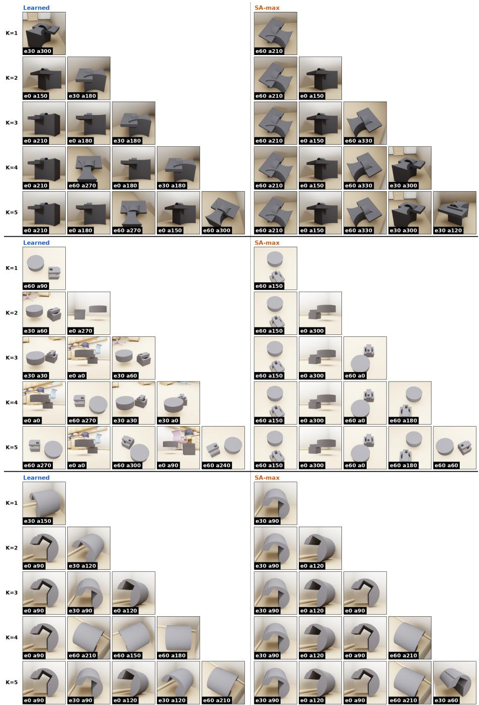  
Figure 5: Three randomly sampled CAD objects from the view analysis split, showing the learned selector’s picks (left) beside the SA-max chain’s first K picks (right) for every budget $K \in \{ 1 , \ldots , 5 \}$ ; each tile is tagged with its (elevation, azimuth) pose. The patterns quantified in the table are directly visible: the learned selector squares views to the cardinal azimuths and stacks elevations at a shared azimuth (small min az-gap), and its per-budget selections are non-nested, whereas SA-max spreads toward antipodal, oblique, surface-grazing views to maximize coverage.

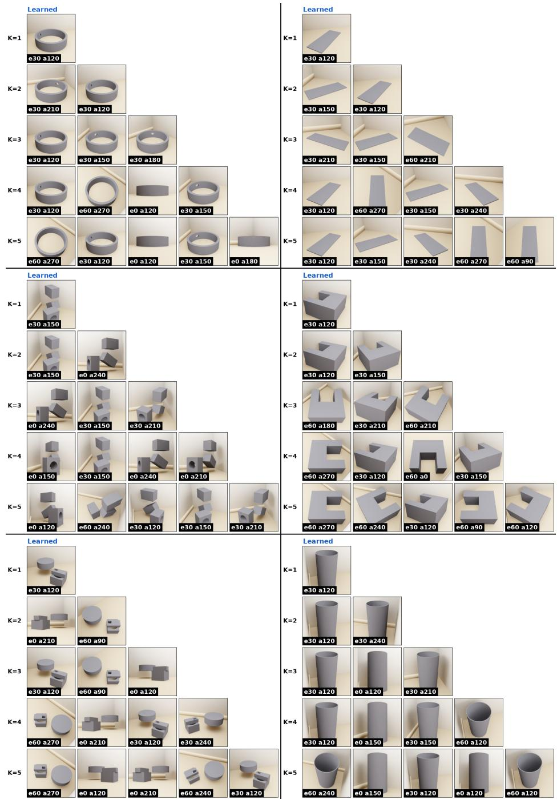  
Figure 6: Controlled same-scene study of geometry-dependent selection. Six parts spanning the geometry taxonomy: a ring with a lateral through-hole and a flat plate (top row), a block stack pierced by a circular bore and a U-bracket (middle row), a cylinder–block assembly and a hollow cylinder (bottom row); are placed in the same room at the same corner anchor with an identical shared yaw of $4 5 ^ { \circ } .$ . Each panel shows the frozen per-K selectors’ picks for budgets $K \in \{ 1 , \ldots , 5 \}$ each tile is tagged with its (elevation, azimuth) pose. With scene, anchor, lighting, and feasibility held fixed, all differences between panels are attributable to part geometry alone.

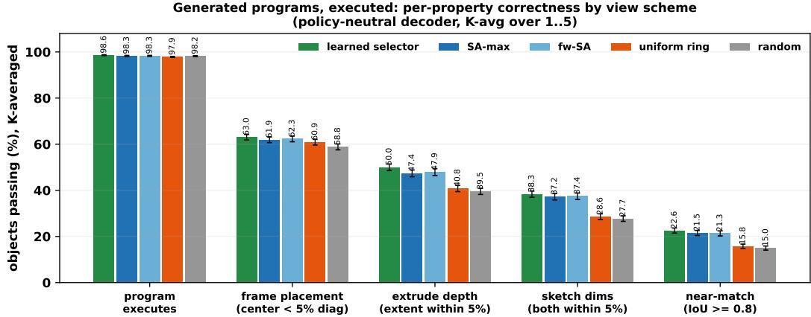  
Figure 7: Executed per-property correctness under five view-selection policies decoded by the same policy-neutral generator, averaged over $K \in \{ 1 , \ldots , 5 \}$ . Program validity is view-policy independent; the graded properties degrade in the ordering of Table 1b; extrude depth is the major property on which learned selection separates from SA-max.

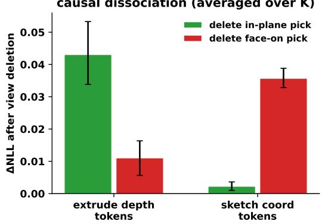  
(a) Causal dissociation.

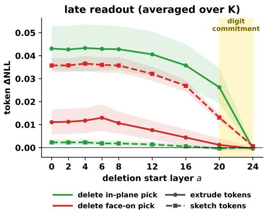  
(b) Late readout.

Figure 8: The view-class mechanism, averaged over budgets K (learned-selector picks, tokencolumn ablation with other-views-mean replacement). (a) Deleting the in-plane pick damages extrude-depth tokens while deleting the face-on pick damages sketch-coordinate tokens. (b) Latereadout analysis: extrude-token damage from deleting the in-plane pick remains approximately flat through L16 and collapses to zero by L24, while sketch-token damage from deleting the face-on pick follows the same late collapse around the logit-lens digit-commitment window. Depth and sketch parameters are thus read late, from disjoint view classes, at every budget K.  
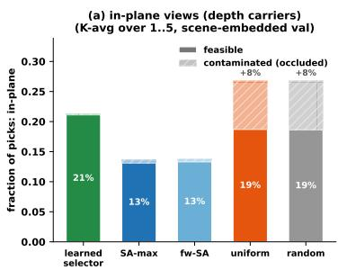

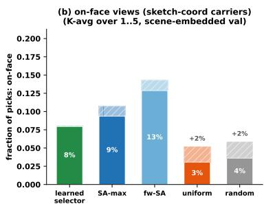  
Figure 9: In-plane and face-on view supply for all view selection policies considered in this work. Occluded (contaminated) views, together with the frequency of in-plane and face-on views, correlate with the loss in accuracy on the extrude depth and sketch parameters, respectively, in Fig. 7.

## A.2 QUALITATIVE RESULTS

We complement the aggregate metrics with per-object qualitative comparisons on DeepCAD, Fusion360, all three T-LESS conditions (synthetic, real-raw, and real-canon), and both MP6D conditions (synthetic and real). For each benchmark we show two figures over the same set of held-out objects: the inputs actually consumed by every method (Fig. 10,12, 18, 16, 14, 20, 22), and the executed reconstructions they produce (Fig. 11, 13, 19, 17, 15, 21, 23). To keep the comparison fair, each baseline is fed its own native input distribution and the scene contributes only occlusion: the single-view lift methods (CAD-Fit, CAD-Recode←TripoSR) receive a clean white-background studio render from the same feasible viewpoint, cadrille its native four-quadrant view grid with scene-occluded quadrants blanked, and CAD-Coder / GenCAD their native isometric renders; only our method consumes the real scene-embedded multi-view input. This isolates reconstruction ability from any input-domain penalty. Consistent with the quantitative tables, our reconstructions track the ground-truth geometry most faithfully on DeepCAD, Fusion360, synthetic and canonicalized T-LESS, and synthetic and real on MP6D while the lift baselines recover coarse shape but distort feature dimensions; the sole exception is real-raw T-LESS, where the raw-photograph domain gap (removed by canonicalization) leaves our method behind the mesh-lift methods.

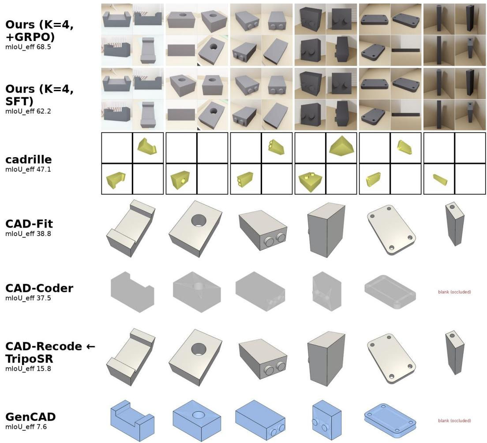

Figure 10: DeepCAD-test model inputs. For eight held-out objects, the exact visual input consumed by each method: Ours receives the four scene-embedded views chosen by the learned selector (2×2 montage); cadrille its native yellow four-quadrant view grid with scene-occluded quadrants whited out; CAD-Fit and CAD-Recode←TripoSR their native white-background single-view studio render; CAD-Coder and GenCAD their native isometric / edge-lattice render, blanked where the scene occludes the native camera. Rows are ordered by mIoUeff.

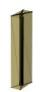  
Ground truth

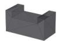

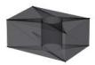

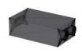

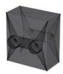

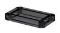  
Ours (K=4, +GRPO) mloU eff 68.5

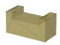

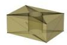  
loU 0.94  
IoU 0.87

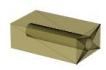  
IoU 0.84

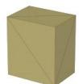  
loU 0.74

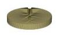  
loU 0.73  
loU 0.98  
Ours (K=4, SFT) mloU\_eff 62.2

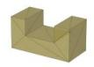  
IoU 0.84

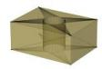  
IoU 0.87

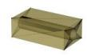  
loU 0.89

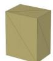  
loU 0.72

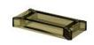

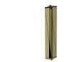  
loU 0.80  
IoU 0.62  
cadrille mloU\_eff 47.1

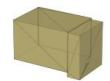  
loU 0.59

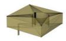  
IoU 0.45

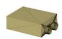  
loU 0.79

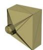  
IoU 0.65

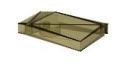  
IoU 0.42

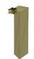  
loU 0.55  
CAD-Fit mloU\_eff 38.8

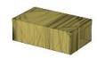  
IoU 0.98

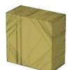  
IoU 0.82

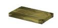  
loU 0.84

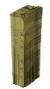  
IoU 0.57  
CAD-Coder mloU\_eff 37.5

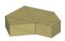  
loU 0.47

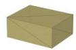  
loU 0.70

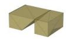  
loU 0.73

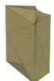  
loU 0.57

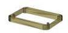  
loU 0.29

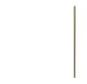  
loU 0.02  
TripoSR mloU\_eff 15.8

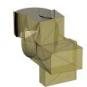  
loU 0.16

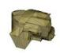  
IoU 0.39

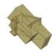  
loU 0.43

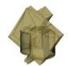  
IoU 0.38

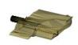  
IoU 0.57

  
loU 0.33  
mloU\_eff 7.6

  
loU 0.64

  
loU 0.24

Figure 11: DeepCAD-test reconstructions. Executed CAD for the objects of Fig. 10: ground truth (top) and each method’s solid, rendered semi-transparent so internal features are visible and aligned by its per-object best-fit proper rotation (the same rotation scores the printed IoU), so shape quality is shown independent of coordinate-frame convention.

  
Figure 12: Fusion360-test model inputs. For eight held-out objects, the exact visual input consumed by each method: Ours receives the four scene-embedded views chosen by the learned selector (2×2 montage); cadrille its native yellow four-quadrant view grid with scene-occluded quadrants whited out; CAD-Fit and CAD-Recode←TripoSR their native white-background single-view studio render; CAD-Coder and GenCAD their native isometric / edge-lattice render, blanked where the scene occludes the native camera. Rows are ordered by mIoUeff.

  
Figure 13: Fusion360-test reconstructions. Ground truth and per-method executed solids for the objects of Fig. 12, shown translucent and aligned by each object’s best-fit rotation with the corresponding IoU.

Figure 14: T-LESS synth model inputs. For eight held-out objects, the exact visual input consumed by each method: Ours receives the four scene-embedded views chosen by the learned selector (2×2 montage); cadrille its native yellow four-quadrant view grid with scene-occluded quadrants whited out; CAD-Fit and CAD-Recode←TripoSR their native white-background single-view studio render; CAD-Coder and GenCAD their native isometric / edge-lattice render, blanked where the scene occludes the native camera. Rows are ordered by mIoU .

<table><tr><td rowspan="2">Ground truth</td><td rowspan="2"></td><td rowspan="2"></td><td rowspan="2"></td><td rowspan="2"></td><td rowspan="2"></td><td rowspan="2"></td></tr><tr><td></td></tr><tr><td>Ours (K=4, +GRPO) mloU_eff 54.0</td><td> loU 0.61</td><td> IoU 0.62</td><td> IoU 0.59</td><td> IoU 0.57</td><td> loU 0.58</td><td> IoU 0.55</td></tr><tr><td>CAD-Fit mloU_eff 47.9</td><td> IoU 0.87</td><td> IoU 0.19</td><td> IoU 0.22</td><td> IoU 0.56</td><td> IoU 0.28</td><td> IoU 0.60</td></tr><tr><td>Ours (K=4, SFT) mloU_eff 45.2</td><td></td><td></td><td></td><td></td><td></td><td></td></tr><tr><td>CAD-Recode ←</td><td>loU 0.46</td><td>loU 0.60</td><td>loU 0.62</td><td>IoU 0.52</td><td>loU 0.53</td><td>IoU 0.56</td></tr><tr><td>TripoSR mloU_eff 32.5</td><td> IoU 0.43</td><td> loU 0.37</td><td>invalid</td><td> IoU 0.37</td><td> IoU 0.26</td><td> IoU 0.19</td></tr><tr><td>cadrille mloU_eff 31.4</td><td></td><td>invalid</td><td></td><td></td><td></td><td></td></tr><tr><td></td><td>loU 0.17</td><td></td><td>loU 0.43</td><td>IoU 0.03</td><td>IoU 0.30</td><td>IoU 0.46</td></tr><tr><td>CAD-Coder mloU_eff 16.7</td><td></td><td></td><td></td><td></td><td></td><td></td></tr><tr><td></td><td>IoU 0.50</td><td>IoU 0.00</td><td>IoU 0.44</td><td>IoU 0.01</td><td>IoU 0.46</td><td>IoU 0.37</td></tr><tr><td>GenCAD mloU_eff 0.5</td><td>invalid</td><td>invalid</td><td>invalid</td><td>invalid</td><td>invalid</td><td>invalid</td></tr></table>

Figure 15: T-LESS synth reconstructions. Ground truth and per-method executed solids for the objects of Fig. 14, translucent and aligned by each object’s best-fit rotation with the corresponding IoU.

  
Figure 16: T-LESS real model inputs. The real photographs fed to each method for eight T-LESS captures, without any test-time domain match (conventions as in Fig. 10); ours consumes the real scene-embedded views directly.

loU 0.02

  
Ground truth

  
mloU\_eff 25.7

  
loU 0.47

  
IoU 0.30

  
loU 0.56

  
loU 0.41

  
loU 0.58

  
loU 0.54  
mloU\_eff 14.4

  
IoU 0.92

  
IoU 0.38

  
loU 0.53

  
IoU 0.46

  
loU 0.48

  
IoU 0.90  
CAD-Coder mloU\_eff 11.9

  
loU 0.37

  
loU 0.73  
IoU 0.62

  
loU 0.06

  
IoU 0.06  
mloU\_eff 8.3

  
loU 0.28

  
loU 0.12

  
IoU 0.06

  
loU 0.01  
loU 0.01  
mloU\_eff 9.3

  
IoU 0.06

  
IoU 0.02

  
IoU 0.15

  
IoU 0.12

  
IoU 0.06

  
loU 0.34  
mloU\_eff 0.5

Figure 17: T-LESS real reconstructions. Ground truth and per-method executed solids for the objects of Fig. 16, translucent and aligned by each object’s best-fit rotation with the corresponding IoU. This is the one regime where our framework trails the lift baselines, reflecting the raw-photograph domain gap discussed in the main text.

  
Figure 18: T-LESS real (canon) model inputs. The same real captures as Fig. 16 after the modelagnostic, test-time-only domain match, composited onto each method’s native plate (conventions as in Fig. 10).

  
mloU\_eff 8.6  
Ground truth

  
Ours (K=4, +GRPO) mloU\_eff 32.5

  
loU 0.54

  
IoU 0.47

  
IoU 0.51

  
loU 0.38

  
IoU 0.41

  
loU 0.35  
CAD-Coder mloU eff 26.3

  
loU 0.54

  
IoU 0.44

  
IoU 0.73

  
IoU 0.53

  
loU 0.37

  
loU 0.11

  
loU 0.15

  
IoU 0.54

  
loU 0.66

  
loU 0.49

  
loU 0.52

  
loU 0.07

  
IoU 0.45

  
loU 0.53

  
IoU 0.42

  
loU 0.52  
Ours (K=4, SFT) mloU eff 17.5

  
loU 0.57

  
IoU 0.12

  
loU 0.18

  
IoU 0.16

  
loU 0.34

  
loU 0.43

  
IoU 0.37

  
loU 0.17

  
loU 0.38

  
loU 0.09  
loU 0.05

Figure 19: T-LESS real (canon) reconstructions. Ground truth and per-method executed solids for the objects of Fig. 18, translucent and aligned by each object’s best-fit rotation with the corresponding IoU.

  
Figure 20: MP6D synth model inputs. For eight held-out objects, the exact visual input consumed by each method: Ours receives the four scene-embedded views chosen by the learned selector (2×2 montage); cadrille its native yellow four-quadrant view grid with scene-occluded quadrants whited out; CAD-Fit and CAD-Recode←TripoSR their native white-background single-view studio render; CAD-Coder and GenCAD their native isometric / edge-lattice render, blanked where the scene occludes the native camera. Rows are ordered by mIoUeff.

  
Figure 21: MP6D synth reconstructions. Ground truth and per-method executed solids for the objects of Fig. 20, translucent and aligned by each object’s best-fit rotation with the corresponding IoU.

  
Figure 22: MP6D real model inputs. The real photographs fed to each method for eight MP6D captures, without any test-time domain match (conventions as in Fig. 10); ours consumes the real multi-view input directly.

  
Ground truth

  
Ours (K=4, +GRPO) mloU eff 25.6

  
loU 0.51

  
IoU 0.46

  
loU 0.45

  
IoU 0.38  
loU 0.36

  
IoU 0.33

  
loU 0.34  
IoU 0.32

  
loU 0.39

  
loU 0.20

  
loU 0.31

  
loU 0.11

  
loU 0.17

  
loU 0.15  
loU 0.39

  
loU 0.10  
cadrille mloU\_eff 12.8

  
loU 0.06  
loU 0.23

  
IoU 0.38

  
loU 0.27

  
IoU 0.40

  
IoU 0.21  
CAD-Fit mloU eff 17.2

  
loU 0.16

  
loU 0.27

  
loU 0.30

  
loU 0.21  
CAD-Coder mloU\_eff 19.8

  
loU 0.18

  
IoU 0.06

  
loU 0.37

  
IoU 0.06

  
IoU 0.01

  
loU 0.03  
TripoSR mloU eff 15.9

  
loU 0.38

  
loU 0.35

  
loU 0.33

  
loU 0.16

  
IoU 0.28

  
loU 0.30

  
loU 0.35  
GenCAD mloU eff 2.6

  
loU 0.21

  
IoU 0.01

Figure 23: MP6D real reconstructions. Ground truth and per-method executed solids for the objects of Fig. 22, translucent and aligned by each object’s best-fit rotation with the corresponding IoU. Unlike real T-LESS, MP6D captures are acquired on a plain background, and our framework leads every baseline on this real condition (Table 4).

## A.3 VIEW SELECTOR TRAINING AND ALIGNMENT

This section details the two auxiliary perception modules of SightCAD: the view selector $\pi _ { \psi }$ (architecture and SA-max warm-starting, Sec. 4.3) and the canonical alignment network (align-net) used to recover the object’s yaw frame on T-LESS and MP6D, where no canonical pose is available. It also specifies the view-selection protocol used on the real and canonicalized captures of these two benchmarks (Sec. A.3.4), where the available views do not lie on the discrete view grid the selector was trained on.

## A.3.1 VIEW SELECTOR ARCHITECTURE

The selector (Fig. 24) maps the full candidate view set to per-view logits $z \in \mathbb { R } ^ { N }$ in four stages:

1. Per-view encoding. Each of the N=36 candidate renders is encoded by afrozen DINOv2 ViT-S/14 backbone (Oquab et al., 2023); the CLS token gives a 384-d per-view descriptor, which a LayerNorm+Linear projection maps to the working width d=256.

2. Pose injection. Each view’s camera pose is added as a sinusoidal positional encoding. Azimuth θ is embedded circularly as [sin kθ, cos $k \theta ] _ { k = 1 \ldots 3 2 }$ followed by a learned linear projection to $d ;$ elevation is embedded analogously. The circular encoding respects the wrap-around of the azimuth ring $( 3 6 0 ^ { \circ } { = } 0 ^ { \circ } )$ and makes angular distances explicit, so the network knows where each view sits on the sphere, not just what it shows.

3. Cross-view reasoning. A lightweight pre-norm transformer encoder (2 layers, 4 heads, FFN width 4d, dropout 0.1) exchanges information across all N candidates. This stage is essential for subset selection: after cross-attention, each view’s representation reflects what the other views already cover, so the logits encode marginal value (complementarity, redundancy) rather than isolated per-view quality.

4. Scoring. A two-layer MLP head (LayerNorm → Linear 256→128 → GELU → Linear 128→1) emits one unnormalized logit per view. Training samples subsets without replacement via the sequential masked softmax of Eq.2; inference takes the deterministic top-K.

With the backbone frozen, the trainable head is only ∼2M parameters, so the selector trains on a single GPU and adds negligible inference cost on top of the generator. Views are fed at 126 × 126 (a multiple of the ViT patch size 14, avoiding internal resizing).

## A.3.2 WARM-STARTING THE SELECTOR BY SA-MAX DISTILLATION

Starting selector RL from random logits gives near-uninformative group rewards, so we first distill the SA-max policy of Sec. 3 into the image-based scorer (Fig. 24). Distillation turns the perplacement geometric “lookup table” (the greedy chain stored with each placement’s visibility matrix) into afunction ofimages and poses that generalizes to unseen objects and placements where no visibility oracle exists.

1. Targets. For each placement, the positives are the first five entries of the SA-greedy chain, i.e., the views that sequentially maximize newly visible surface area; all other views are negatives. We deliberately supervise the top-5 chain rather than a binary top-4 label: the marginal-gain gap between chain ranks #4 and #5 is often near-tied (coverage saturates around K=5), so a hard top-4 label would inject noise exactly at the top-K decision boundary.

2. Set-membership loss. A RankNet-style pairwise ranking loss requires every chain view to outscore every non-chain view by margin m=1: ${ \mathcal { L } } _ { \mathrm { p a i r } } = { \mathrm { m e a n } } _ { ( i , j ) }$ softplus $\left( m - \left( z _ { i } - z _ { j } \right) \right)$ over all (chain i, non-chain j) pairs. Unlike a multi-label BCE, no gradient is spent on absolute logit calibration; only the decision boundary that top-K selection actually uses is optimized.

3. Within-chain order loss. A Plackett–Luce term adds the NLL of the greedy chain order under the logits (the same sequential masked softmax as Eq.2), with weight 0.5. This supervises the within-chain ranking, including the #4-versus-#5 boundary, through a ranking cue instead of a fabricated binary one.

4. Optimization. AdamW, learning rate $1 0 ^ { - 4 }$ with cosine decay, weight decay 0.01, batch of 16 objects (each contributing all N candidate views), trained on the full training split with the same train/val split seed as the generator.

On the held-out validation split the distilled scorer reaches 55.7% top-4 overlap with SA-max’s exact picks and 87.6% of SA-max’s union surface coverage (a tie-agnostic measure of selection quality), against 71.0% coverage for a random-4 baseline. Exact-set agreement is low (4.7%) by construction: many SA-max picks are near-ties, so the strict-set metric penalizes selections that are equally good in coverage. This warm-started policy is the initialization for the joint GRPO phase of Sec. 4.3; one selector is trained per budget K, which is why the per-budget optima of Sec. A.1 need not be nested.

## A.3.3 CANONICAL ALIGNMENT NETWORK FOR T-LESS AND MP6D

On the CAD benchmarks the canonical yaw frame is known by construction; on the industrial benchmarks T-LESS and MP6D (especially for real and canon captures from the wild) it is not. The align-net recovers the in-plane object orientation from images alone, so that the selected views can be re-anchored to a canonical frame before decoding and the generator can emit a program in a consistent frame (Fig. 25).

1. Task. Given the level ring of 12 views (elevation $0 ^ { \circ }$ , azimuths $3 0 ^ { \circ }$ apart) presented in azimuth order with unknown global phase, predict which ring position is the canonical $a { = } 0 ^ { \circ }$ view. This is a 12-way classification with chance $1 / 1 2 \approx 8 . 3 \%$

2. Architecture. The network mirrors the view selector: frozen DINOv2 ViT-S/14 CLS features → projection to $d { = } 2 5 6 \to$ circular azimuth encoding of the presentation azimuths $0 ^ { \circ } , 3 0 ^ { \circ } , \ldots , 3 3 0 ^ { \circ }$ (relative ring geometry is known; the absolute phase is not, so the encoding leaks no answer) → 2-layer cross-view transformer → per-position logit. Cross-view attention supplies the “which face is the front” comparison across the ring.

3. Training. Frozen DINO features for each object’s ring are cached once; the head is trained with cross-entropy on random cyclic rolls of the ring (the target is the rolled position of the true $a { = } 0$ view), so every gradient step sees a fresh unknown phase. AdamW, learning rate $3 \times 1 0 ^ { - 4 }$ , weight decay $\bar { 1 0 ^ { - 4 } }$ , batch 128, 80 epochs over 40k training objects, views at $2 2 4 \times 2 2 4$

4. Accuracy. On the held-out validation split, evaluated over all 12 rolls per object: exact top-1 28.2% (3.4× chance), correct up to a 180◦ flip 51.9%, and correct up to $\mathrm { ~ a ~ } 9 0 ^ { \circ }$ rotation 90.3%. The mean circular error (86◦) is dominated by these symmetry flips: most CAD parts are near-2- or 4-fold symmetric, making the exact anchor ill-posed while the axisaligned frame (frame modulo 90◦) is recovered for 9 in 10 objects, which is the quantity that matters for sketch-and-extrude programs authored in axis-aligned workplanes.

5. Deployment on T-LESS and MP6D. For each capture, the 12 available views nearest to the $\mathrm { { \bar { 3 0 ^ { \circ } } } }$ -spaced ring slots are assembled into a presentation ring; the align-net predicts the canonical slot; all view azimuths are re-anchored by the predicted offset (predicted $a 0  0 ^ { \circ } )$ before selection and decoding. The generated program then lives in the aligned frame. This step is applied identically to every condition of both benchmarks: T-LESS synth, real, and canon, and MP6D synth and real.

## A.3.4 VIEW SELECTION ON REAL AND CANONICALIZED MULTI-VIEW CAPTURES

The view selector is trained on the fixed three-ring view lattice of Sec. 3, but the real T-LESS and MP6D captures lie on scattered camera poses: T-LESS provides images on discrete elevation rings whose azimuths do not coincide with our grid, and MP6D frames come from hand-held video sweeps whose azimuth and elevation vary quasi-continuously (camera poses are read off the ground-truth object-pose annotations, exactly as in the BOP conventions). Rather than fine-tune the selector per dataset, we reconstruct its training-time input at test time:

1. Azimuth re-anchoring. All view azimuths are first re-anchored to the align-net’s predicted canonical frame (Sec. A.3.3), so lattice slots carry the same meaning as during training.

2. Snap-to-lattice. Within each elevation ring, every lattice slot is assigned the nearest available native view by azimuth distance, greedily by angular error, with at most one native view per slot and a snap tolerance of 20◦; a view can occupy only one slot.

3. Blank-tile padding. Lattice slots left unfilled receive a blank white tile, the exact appearance that scene-infeasible views have during training, so the reconstructed lattice is in-distribution for the selector and empty slots are naturally down-scored.

4. Selection and map-back. The frozen selector scores the reconstructed lattice and the deterministic top-K slots are taken; each pick maps back to the native view occupying its slot. Picks landing on blank slots are dropped and the selection is back-filled from the remaining native views, so exactly K=4 real views always reach the generator, tagged with their lattice poses.

Elevation handling differs only in how rings are populated: T-LESS captures (and the MP6D syn thetic re-renders) carry discrete elevation rings that map directly onto the lattice’s three rings and are therefore retained, whereas the scattered elevations of the MP6D real video frames provide no stable ring structure, so selection there is anchored on the azimuthal lattice alone. The entire protocol, alignment, snapping, padding, and map-back, is identical across the synthetic, raw, and canonicalized conditions of each benchmark; the canonicalized T-LESS condition changes only the pixels inside each view (segmentation, exposure normalization, native-plate compositing, Sec. 5), never the set of candidate views or the selection rule.

  
Figure 24: View-selector pretraining by SA-max: the greedy surface-area set-cover SA-max is distilled into an image-based scorer. The coverage (cov.) values denote the cumulative coverage of the object as the views increase from left to right. After training a central view selector we then train seperate view selectors for Joint-training for every view budget ${ \mathrm { K } } { = } \{ 1 , . . . 5 \} $

  
Figure 25: Align-net training for pose estimation on captured renders of CAD objects, used for the T-LESS (real and canon) and MP6D evaluations to re-anchor view azimuths to the canonical frame before CAD generation.

## A.4 DATASET AND TRAINING DETAILS

Wall and corner anchor curation. Anchor pools are obtained by scanning each room’s floor on a 0.25 m grid, ray-casting for perpendicular wall pairs, and collision-checking both the object and its camera orbit against the room geometry.

Uniformly spaced view policy. The uniform policy is a naive orbit scan: it picks one of the three elevation rings $( 0 ^ { \circ } / \bar { 3 0 ^ { \circ } } / \bar { 6 0 ^ { \circ } } )$ and a random azimuth phase, then takes K azimuths equispaced around that ring (90◦ apart at K=4). It ignores the scene, so occluded views may be included, subject only to a guarantee that at least one selected view sees the object.

Feature-weighted SA-max (fw-SA). fw-SA keeps SA-max’s greedy set-cover chain (Sec. 3) but reweights the visible area of each cached surface sample point by a curvature-saliency factor w = 0.25+0.75 s, where s integrates |dihedral angle|×edge length over the mesh’s face-adjacency edges within a radius of 3% of the part diagonal around the point, normalized by its mesh-wide mean and capped at the 95th percentile. Each greedy step therefore appends the view adding the most newly visible saliency-weighted area, biasing selection toward feature-dense regions (holes, fillets, slots) rather than blank faces. The reweighting is consequential at the selection level, roughly two thirds of objects receive a different view set than SA-max at every budget, while sacrificing only 0.3–2.3 pp of real surface coverage (Table 5); its effect on reconstruction accuracy is reported in Table 1.

Table 6: Optimization hyperparameters of the two RL training phases (Sec. 4.3).
<table><tr><td></td><td>Joint training</td><td>Generator RL tuning</td></tr><tr><td>Group size G</td><td>4</td><td>8</td></tr><tr><td>Sampling temperature</td><td>1.0 (view subsets)</td><td>0.9 (decodes)</td></tr><tr><td>Batch size</td><td>64 global (4 GPUs)</td><td>12 per GPU (4 GPUs)</td></tr><tr><td>Selector optimizer</td><td>AdamW, lr 10 4</td><td>frozen</td></tr><tr><td>Generator optimizer</td><td>AdamW, lr 10−5, wd 10−2</td><td>AdamW, lr 10−5</td></tr><tr><td>SFT weight</td><td>0.5</td><td></td></tr><tr><td>KL coefficient β</td><td>0</td><td>0.02</td></tr><tr><td>Invalid-code penalty</td><td>-0.5</td><td>-0.5</td></tr><tr><td>SFT gate coverage floors (per-view / cumulative)</td><td>0.05 / 0.3</td><td></td></tr></table>

## A.5 ADDITIONAL EVALUATIONS

This section completes the main-paper comparisons on the full held-out scene-embedded test split (n=4000 CAD-Recode + Text2CAD objects, Sec. 5): first the co-trained view-policy comparison at K=3 promised in Sec. 5, then external CAD baselines evaluated on the same 4k objects.

Every policy with its own co-trained generator (K=3). Table 7 justifies the choice of SA-max as the co-trained heuristic anchor in Table 1a (fw-SA, its feature-weighted variant, matches SA-max there without a dedicated co-trained generator and here with a co-trained generator): at K=3, each heuristic policy is paired with a generator fine-tuned for one epoch on that policy’s views, starting from the same policy-neutral initialization (Sec. 4.3); the unadapted policy-neutral generator decoding unrestricted random views (Table 1b) marks the no-selection floor. The policy ordering of the policy-neutral panel is preserved under co-training, learned > SA-max ≈ fw-SA > uniform, so SAmax remains the strongest non-learned policy even when every alternative is given its own adapted generator. The co-adaptation gain is also unevenly distributed: uniform improves by +3.2 over its policy-neutral value while SA-max gains +1.7 and the learned selector +4.2, whose consistent, informative view distribution gives the generator a stable input regime it can specialize to.

Table 7: View policies with co-trained generators at K=3. Each heuristic policy’s generator is fine-tuned for one epoch on that policy’s views from the same policy-neutral initialization. Sceneembedded 4k test split, mIoUeff (%), standard errors 0.47–0.53.
<table><tr><td>Policy</td><td>mIoUeff ↑</td><td>IR%↓</td></tr><tr><td>Random</td><td>36.89</td><td>2.03</td></tr><tr><td>Uniform</td><td>43.80</td><td>1.85</td></tr><tr><td>SA-max</td><td>47.75</td><td>2.00</td></tr><tr><td>fw-SA</td><td>47.76</td><td>2.00</td></tr><tr><td>Learned (Joint-Training)</td><td>51.69</td><td>1.80</td></tr></table>

Statistical significance and occlusion-regime breakdown. Table 8 reports paired per-object learned−SA-max contrasts on the same 4000 scene-embedded test objects, for the policy-neutral generator (Table 1b) and the co-adapted +GRPO arms (Table 1a). Every per-budget gap is significant under a two-sided Wilcoxon signed-rank test: $p \ < \ 0 . 0 2$ at every K for the policy-neutral decoder and $p < 1 0 ^ { - 2 1 }$ for the co-adapted arms. Binning the co-adapted contrast by placement regime shows the advantage is significant within every regime at every budget $( p < 1 0 ^ { - \bar { 4 } }$ in all 15 cells) and is at least as large on mildly occluded floor placements as in corners.

Table 8: Paired learned−SA-max contrasts on the 4k scene-embedded test split. $\Delta \mathrm { m I o U _ { \mathrm { e f f } } \left( p p \right) }$ paired per object, with task-bootstrap 95% CIs; all entries are significant under two-sided Wilcoxon signed-rank tests $( p < 0 . 0 2$ for the policy-neutral row, $p < 1 0 ^ { - 4 }$ for the co-adapted row and every regime cell). Regimes: 1305 floor / 933 wall / 1762 corner.
<table><tr><td> $\Delta \mathrm { m I o U _ { \mathrm { e f f } } \ ( p p ) }$ </td><td> $K { = } 1$ </td><td> $K { = } 2$ </td><td> $K { = } 3$ </td><td> $K { = } 4$ </td><td> $K { = } 5$ </td></tr><tr><td>Policy-neutral</td><td> $+ 3 . 2 \ [ 2 . 4 , 3 . 8 ]$ </td><td> $+ 1 . 6 \ [ 0 . 8 , 2 . 4 ]$ </td><td> $+ 1 . 4 \ [ 0 . 7 , 2 . 2 ]$ </td><td> $+ 1 . 5 \ [ 0 . 7 , 2 . 3 ]$ </td><td> $+ 2 . 9 \ [ 2 . 0 , 3 . 7 ]$ </td></tr><tr><td>Co-adapted +GRPO</td><td> $+ 2 . 8 \ [ 2 . 3 , 3 . 3 ]$ </td><td> $+ 2 . 7 \ [ 2 . 1 , 3 . 2 ]$ </td><td> $+ 3 . 8 \ [ 3 . 2 , 4 . 4 ]$ </td><td> $+ 5 . 4 \ [ 4 . 8 , 6 . 0 ]$ </td><td> $+ 6 . 4 \ [ 5 . 8 , 7 . 0 ]$ </td></tr><tr><td>floor</td><td>+3.8</td><td>+2.8</td><td>+4.1</td><td>+6.0</td><td>+7.3</td></tr><tr><td>wall</td><td>+2.2</td><td>+2.2</td><td>+4.2</td><td>+4.7</td><td>+7.6</td></tr><tr><td>corner</td><td>+2.4</td><td>+2.8</td><td>+3.4</td><td>+5.3</td><td>+5.1</td></tr></table>

External baselines on the full 4k split. Table 9 reports external baselines on the same 4k sceneembedded split, with each method receiving its native input format and the scene contributing only occlusion (conventions as in Sec. 5). SightCAD $( K { = } 4 , + \mathrm { \bar { G } R P O ) }$ leads every baseline while emitting near-universally executable code.

Table 9: External baselines on the full scene-embedded 4k test split (n=4000 CAD-Recode + Text2CAD objects). Every method receives its native input format and the scene contributes only occlusion: Our method leads all other baselines.
<table><tr><td>Method</td><td>IR%↓</td><td>medCD↓</td><td>mIoU% ↑</td><td> $\mathrm { m I o U _ { \mathrm { e f f } } \uparrow }$ </td></tr><tr><td>Ours  $( K { = } 4 , + \mathrm { G R P O } )$ </td><td>0.30</td><td>8.10</td><td>66.70</td><td>66.50</td></tr><tr><td>Ours  $( K { = } 4 , \operatorname { S F T } )$ </td><td>1.25</td><td>11.68</td><td>60.00</td><td>59.25</td></tr><tr><td>cadrille</td><td>17.12</td><td>13.02</td><td>54.30</td><td>45.01</td></tr><tr><td>CAD-Coder</td><td>33.40</td><td>48.20</td><td>37.75</td><td>25.14</td></tr><tr><td>CAD-Recode←TripoSR</td><td>43.23</td><td>84.94</td><td>18.43</td><td>10.46</td></tr><tr><td>GenCAD</td><td>77.00</td><td>73.18</td><td>18.72</td><td>4.31</td></tr></table>