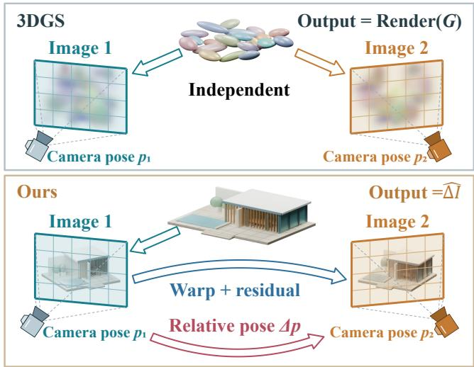
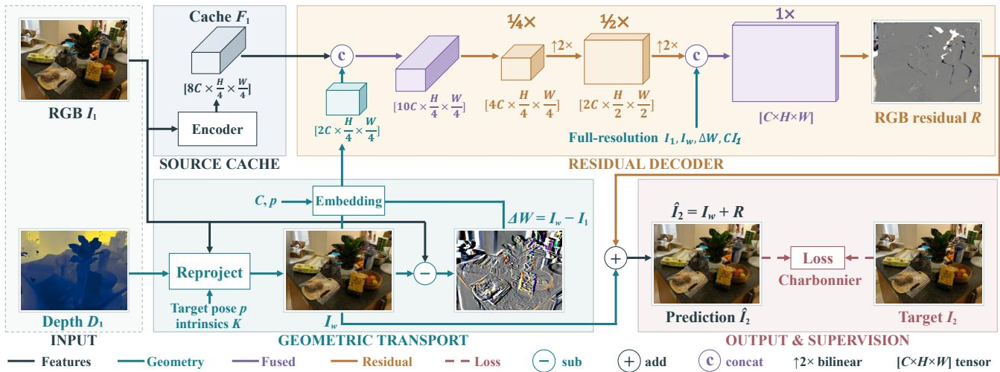
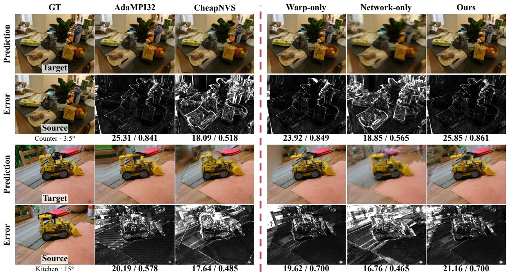
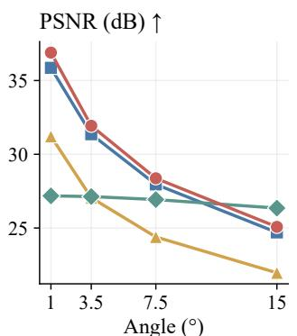
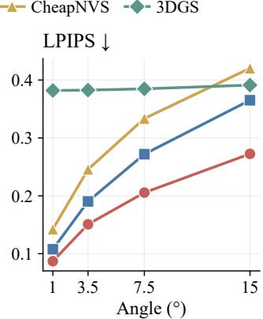

# LVS: LOCAL VIEW SYNTHESIS FROM RELATIVE CAMERA POSE BY REUSING PREVIOUS VIEWS

Qizhou Huo1,2, Xuan Sun1,2, Yongfei Guo1,2, Zhipeng Wang1,3, Yuanhao Gong1,3

1Changchun Institute of Optics, Fine Mechanics and Physics, Chinese Academy of Sciences 2University of Chinese Academy of Sciences, Beijing, China 3Chinese Academy of Sciences, Beijing, China

## ABSTRACT

Interactive scene exploration requires frequent view updates, although small camera motions preserve much of the visible content. Conventional 3D Gaussian Splatting nevertheless renders each target view, leaving this image overlap unexploited. Reusing rendered images offers an alternative, but geometric warping alone cannot recover newly exposed content and remains sensitive to depth errors. We propose a per-scene framework that replaces repeated scene rendering for nearby views with relative-pose-guided RGB-D image reuse. Geometric warping uses depth and relative pose to transport source content, while a lightweight multiscale network predicts RGB residuals to correct artifacts and infer missing appearance. Cached source features further reduce repeated computation. On GS-render, residual refinement improves PSNR by 0.72 dB over pure warping; evaluations on captured and rendered scenes demonstrate low query latency. This separation of scene rendering from local view updates supports responsive scene exploration, with potential applications in augmented and virtual reality.

Index Terms— Novel view synthesis, geometric warping, residual learning

## 1. INTRODUCTION

Novel view synthesis enables interactive exploration of reconstructed scenes. Conventional scene renderers generate an image for each requested camera pose. During local navigation, however, small camera motions often leave substantial visible content shared with a previously rendered image. This overlap creates an opportunity to reuse the source image, which already contains much of the appearance needed by a nearby target. The central question is how to exploit this overlap while accounting for the image changes introduced by camera motion.

  
Fig. 1. Local view synthesis. 3DGS renders each target view from the scene representation (top). Our method reuses a rendered RGB-D image through relative-pose-guided warping and RGB residual correction (bottom).

## 1.1. Scene Rendering and Image Reuse

Neural Radiance Fields (NeRF) integrate radiance along camera rays, whereas 3D Gaussian Splatting (3DGS) projects and composites Gaussian primitives [1,2]. Both reuse a persistent scene representation, but conventional target queries still require a new rendering pass. Image-based approaches exploit source observations through learned transformations [3–5], multiplane representations [6–9], projected features [10–12], or learned multiview blending [13]. We focus on synthesizing nearby views from an available rendered RGB-D image.

## 1.2. Pose-Guided Warping and Residual Refinement

Given depth, intrinsics, and relative pose, geometric warping establishes correspondences and transports observed structure [14]. However, newly exposed regions lack source observations, while depth inaccuracies, resampling, and viewdependent appearance introduce further errors. CheapNVS learns flow, masks, and inpainting for RGB-D synthesis [15]; NeuralPassthrough combines depth-based warping with twoview fusion [16]. Layered inpainting completes hidden content for single-image view synthesis [17, 18]. Reusing a single rendered image therefore requires preserving transported detail while correcting regions where correspondence is unreliable or absent.

  
Fig. 2. Framework overview. Depth and relative pose guide warping, while a multiscale decoder combines cached source features and geometric cues to predict an RGB residual. Adding this residual to the warped image yields the target prediction. Dashed red arrows indicate training supervision.

## 1.3. Motivations and Contributions

We address this problem by separating geometric transport from residual appearance correction (Fig. 1). For each static scene, we train a model that refines a pose-guided warp through multiscale RGB residual prediction. Image and geometry guidance retain spatial detail, while cached source features support repeated target queries without invoking the scene renderer. Our main contributions are:

• We present a relative-pose-guided framework for local view synthesis by reusing rendered RGB-D images.

• We design a multiscale residual network with source feature reuse and full-resolution RGB/geometry cues.

• We assess reconstruction quality, query cost, and viewpoint range on real and rendered scenes, with component ablations on rendered data.

## 2. RELATIVE-POSE-GUIDED IMAGE REUSE WITH RESIDUAL REFINEMENT

Figure 2 shows our image reuse pipeline: relative pose guides geometric warping, and a multiscale decoder predicts an RGB correction from source features and geometric cues. The following subsections describe reprojection, residual prediction, and training with source reuse.

## 2.1. Relative-Pose-Guided Reprojection

Let $I _ { 1 } , D _ { 1 }$ denote the source RGB image and depth, and $K$ the shared camera intrinsic matrix. Rotation matrix Q and translation vector t map source-camera points to targetcamera coordinates. A source pixel x projects to target pixel y as

$$
\widetilde { y } \sim K \big [ Q \big ( \bar { D } _ { 1 } ( x ) K ^ { - 1 } \widetilde { x } \big ) + t \big ] .\tag{1}
$$

Here tildes denote homogeneous pixel coordinates with final component one, ∼ denotes equality up to scale, and $\bar { D } _ { 1 }$ is depth after filling missing values and fitting local inverse-depth planes. For network conditioning, p is the sixdimensional twist (logarithmic coordinates) of the inverse, target-to-source motion [19].

Source colors are bilinearly splatted and filtered by depth; accepted colors are averaged with their splat weights. Coverage C stores accumulated weights clipped to [0, 1], with projected centers set to one. Coverage-weighted coarse-tofine filling yields the warped image $I _ { w } = \mathscr { W } ( I _ { 1 } , D _ { 1 } , K , p )$ where W denotes this fixed geometric procedure. The original $C$ is preserved to distinguish filled regions from supported observations. Without projected support, the warp returns $I _ { 1 }$

## 2.2. Multiscale Residual Refinement

The learned encoder Enc extracts reusable source features $F _ { 1 } = \mathrm { E n c } ( I _ { 1 } )$ . We define $\Delta W = I _ { w } - I _ { 1 }$ as an RGB image difference. The decoder Dec predicts the RGB residual $R ,$ added to $I _ { w }$ to obtain the target prediction $\widehat { I } _ { 2 }$

$$
\begin{array} { r l } & { R = \mathrm { D e c } ( F _ { 1 } , I _ { 1 } , I _ { w } , \Delta W , C , p ) , } \\ & { \widehat { I } _ { 2 } = I _ { w } + R . } \end{array}\tag{2}
$$

Resized $I _ { w } , \Delta W , C$ and broadcast $p$ are linearly embedded and concatenated with $F _ { 1 }$ at quarter resolution. Refinement

  
Fig. 3. Qualitative comparison on Counter (3.5◦) and Kitchen (15◦). The first column shows target/source images; other columns show predictions and mean absolute RGB error maps. Scores are PSNR/SSIM. The dashed divider separates external baselines from our component comparisons.

proceeds through half to full resolution, where a skip connection supplies $I _ { 1 } , I _ { w } , \Delta W , C$ to preserve spatial detail. A single linear RGB head outputs R.

## 2.3. Training and Source Reuse

For each static scene, the encoder and decoder are jointly trained by minimizing the Charbonnier loss [20]

$$
\mathcal { L } = \mathrm { m e a n } \bigg ( \sqrt { ( \widehat { I } _ { 2 } - I _ { 2 } ) ^ { 2 } + \epsilon ^ { 2 } } \bigg ) .\tag{3}
$$

Here, L denotes the training loss, $\widehat { I } _ { 2 }$ and $I _ { 2 }$ are the predicted and ground-truth target RGB images, and $\epsilon \ = \ 1 0 ^ { - 3 }$ is a smoothing constant. Squaring and square-root operations are applied elementwise, and mean averages over all pixels and RGB channels. Zero-initializing the RGB head makes the initial prediction equal to $I _ { w }$ . At inference, source features and prepared geometry are cached once per source; each target requires reprojection, residual decoding, and composition.

## 3. EXPERIMENTS

We evaluate rendered-image reuse through reconstruction quality, component ablations, and viewpoint changes. The following experiments assess how geometric transport and residual refinement support local synthesis, together with the computational cost of source reuse.

## 3.1. Experimental Setup

We evaluate rendered RGB-D data from GS-render (three Mip-NeRF 360 scenes [21]) and Blender (Barcelona Pavilion), alongside captured 7-Scenes data [22]. Images are $6 4 0 \times 4 8 0$ , with disjoint source splits and viewpoint changes up to $1 5 ^ { \circ }$ ; rendered tests include held-out motion directions. Our models use per-scene Adam [23] training $( 1 0 ^ { - 3 } )$ and validation-selected checkpoints.

Baselines are reimplemented CheapNVS [15], pretrained AdaMPI32 [8], and scene-trained 3DGS [2], with different training regimes and inputs. PSNR, SSIM [24], and LPIPS [25] use identical held-out targets and equal averaging across sources, angular bins, and scenes. Timing uses an RTX 5090, FP32, batch one, and CUDA synchronization; memory excludes metrics and target RGB.

## 3.2. Local View Synthesis Results

Table 1 shows that Ours achieves the highest PSNR and SSIM among the evaluated methods in each domain. On GS-render, it exceeds AdaMPI32 by 1.00 dB PSNR, supporting reuse of an existing rendering for nearby target views. This advantage also holds on Blender, while 7-Scenes tests the framework with captured RGB-D inputs. AdaMPI32 nevertheless achieves lower LPIPS on 7-Scenes.

Figure 3 compares identical source–target pairs. At 3.5◦, residual refinement reduces errors around object boundaries relative to Pure Warp. At 15◦, it improves PSNR while visi-

Table 1. Test quality and query cost. Cache and peak memory are in MiB; 3DGS parameter counts refer to stored Gaussian scalars. Best values are bold.
<table><tr><td>Domain</td><td>Method</td><td>PSNR ↑</td><td>SSIM ↑</td><td>LPIPS ↓</td><td>Params (M)</td><td>Query (ms)</td><td>Cache</td><td>Peak</td></tr><tr><td>7-Scenes</td><td>CheapNVS</td><td>16.77</td><td>0.601</td><td>0.505</td><td>9.917</td><td>8.88</td><td>11.4</td><td>264.2</td></tr><tr><td>7-Scenes</td><td>AdaMPI32</td><td>20.47</td><td>0.701</td><td>0.378</td><td>18.946</td><td>5.60</td><td>403.8</td><td>7697.1</td></tr><tr><td>7-Scenes</td><td>3DGS</td><td>18.79</td><td>0.674</td><td>0.458</td><td>45.853</td><td>2.60</td><td></td><td>518.0</td></tr><tr><td>7-Scenes</td><td>Ours</td><td>20.74</td><td>0.721</td><td>0.395</td><td>0.110</td><td>0.95</td><td>14.4</td><td>95.8</td></tr><tr><td>GS-render</td><td>CheapNVS</td><td>20.33</td><td>0.622</td><td>0.329</td><td>9.917</td><td>8.75</td><td>11.4</td><td>264.2</td></tr><tr><td>GS-render</td><td>AdaMPI32</td><td>25.89</td><td>0.791</td><td>0.213</td><td>18.946</td><td>5.72</td><td>403.8</td><td>7697.1</td></tr><tr><td>GS-render</td><td>3DGS</td><td>36.65</td><td>0.974</td><td>0.053</td><td>55.421</td><td>3.06</td><td></td><td>582.1</td></tr><tr><td>GS-render</td><td>Ours</td><td>26.89</td><td>0.841</td><td>0.189</td><td>0.110</td><td>0.98</td><td>14.4</td><td>95.8</td></tr><tr><td>Blender</td><td>CheapNVS</td><td>26.16</td><td>0.804</td><td>0.285</td><td>9.917</td><td>9.02</td><td>11.4</td><td>264.2</td></tr><tr><td>Blender</td><td>AdaMPI32</td><td>29.97</td><td>0.864</td><td>0.234</td><td>18.946</td><td>5.60</td><td>403.8</td><td>7697.1</td></tr><tr><td>Blender</td><td>3DGS</td><td>26.90</td><td>0.846</td><td>0.385</td><td>16.427</td><td>2.06</td><td></td><td>226.3</td></tr><tr><td>Blender</td><td>Ours</td><td>30.57</td><td>0.882</td><td>0.179</td><td>0.110</td><td>0.98</td><td>14.4</td><td>95.8</td></tr></table>

Table 2. Component ablation on GS-render, averaged over three scenes. Best values are bold.
<table><tr><td>Variant</td><td>PSNR ↑</td><td>SSIM ↑</td><td>LPIPS ↓</td><td>Params (K)</td></tr><tr><td>Warp-only</td><td>26.166</td><td>0.8340</td><td>0.1898</td><td>0.0</td></tr><tr><td>Network-only</td><td>19.659</td><td>0.5833</td><td>0.4299</td><td>109.7</td></tr><tr><td>Residual-1/4</td><td>26.526</td><td>0.8338</td><td>0.1910</td><td>104.5</td></tr><tr><td>Residual-1/2</td><td>26.706</td><td>0.8343</td><td>0.1902</td><td>108.7</td></tr><tr><td>Residual-Full</td><td>26.887</td><td>0.8407</td><td>0.1888</td><td>110.4</td></tr></table>

ble distortions remain, illustrating the difficulty of correcting larger viewpoint changes from a single source.  
Ours AdaMPI32 CheapNVS 3DGS

## 3.3. Ablation Studies

## 3.4. Viewpoint Range and Computational Cost

Figure 4 examines viewpoint changes on Blender. Ours has higher PSNR at smaller angles, but 3DGS overtakes it at $1 5 ^ { \circ }$ Ours retains lower LPIPS. This crossover illustrates the limited viewpoint range of single-source reuse. Blender covers one scene; cross-scene transfer is not evaluated.

Table 2 evaluates geometry and residual refinement on the three GS-render scenes. Pure Warp returns $I _ { w } ,$ while Pure Network predicts image change from RGB and pose. Quarter/Half variants predict residuals at reduced resolution and upsample them. Learned variants share optimization and checkpoint selection. Full refinement improves Pure Warp by 0.721 dB PSNR, with a smaller LPIPS change. PSNR increases from quarter to full resolution, supporting progressive refinement. Pure Network performs substantially worse, indicating the value of depth-guided transport in this system. Since capacities and inputs differ, these comparisons assess complete component configurations.

Table 1 reports query latency of 0.95–0.98 ms for Ours, with a 14.4 MiB source cache and 95.8 MiB peak allocated memory. Source reuse shares feature extraction and geometry preparation across queries; target-dependent reprojection and residual prediction remain necessary for each new view.

  
Fig. 4. Viewpoint sensitivity on Blender. PSNR (left) and LPIPS (right) are evaluated at matched target poses.

## 4. CONCLUSION

We presented a per-scene framework for local view synthesis by reusing rendered RGB-D images without rerendering the scene. Relative-pose-guided warping preserves shared content, while multiscale residual refinement corrects transport errors and infers missing appearance. Experiments on captured and rendered scenes demonstrate low query latency, and GS-render ablations support the benefit of residual refinement. These findings highlight image reuse as a practical approach to responsive scene navigation, with potential AR/VR applications. Performance declines with larger viewpoint changes; extending the supported range and enabling cross-scene generalization remain future work.

## 5. REFERENCES

[1] Ben Mildenhall, Pratul P. Srinivasan, Matthew Tancik, et al., “NeRF: Representing scenes as neural radiance fields for view synthesis,” in Proc. ECCV, 2020, vol. 12346 of Lecture Notes in Computer Science, pp. 405– 421.

[2] Bernhard Kerbl, Georgios Kopanas, Thomas Leimkuhler, et al., “3D Gaussian splatting for real-time¨ radiance field rendering,” ACM Trans. Graph., vol. 42, no. 4, pp. 1–14, 2023.

[3] Tinghui Zhou, Shubham Tulsiani, Weilun Sun, et al., “View synthesis by appearance flow,” in Proc. ECCV, 2016, vol. 9908 of Lecture Notes in Computer Science, pp. 286–301.

[4] Eunbyung Park, Jimei Yang, Ersin Yumer, et al., “Transformation-grounded image generation network for novel 3D view synthesis,” in Proc. CVPR, 2017, pp. 702–711.

[5] Xu Chen, Jie Song, and Otmar Hilliges, “Monocular neural image based rendering with continuous view control,” in Proc. ICCV, 2019, pp. 4089–4099.

[6] Tinghui Zhou, Richard Tucker, John Flynn, et al., “Stereo magnification: Learning view synthesis using multiplane images,” ACM Trans. Graph., vol. 37, no. 4, pp. 1–12, 2018.

[7] Richard Tucker and Noah Snavely, “Single-view view synthesis with multiplane images,” in Proc. CVPR, 2020, pp. 548–557.

[8] Yuxuan Han, Ruicheng Wang, and Jiaolong Yang, “Single-view view synthesis in the wild with learned adaptive multiplane images,” in Proc. SIGGRAPH, 2022, pp. 1–8.

[9] Cong Wang, Yu-Ping Wang, and Dinesh Manocha, “LoLep: Single-view view synthesis with locallylearned planes and self-attention occlusion inference,” in Proc. ICCV, 2023, pp. 10807–10817.

[10] Olivia Wiles, Georgia Gkioxari, Richard Szeliski, et al., “SynSin: End-to-end view synthesis from a single image,” in Proc. CVPR, 2020, pp. 7465–7475.

[11] Alex Yu, Vickie Ye, Matthew Tancik, et al., “pixel-NeRF: Neural radiance fields from one or few images,” in Proc. CVPR, 2021, pp. 4576–4585.

[12] Qianqian Wang, Zhicheng Wang, Kyle Genova, et al., “IBRNet: Learning multi-view image-based rendering,” in Proc. CVPR, 2021, pp. 4690–4699.

[13] Peter Hedman, Julien Philip, True Price, et al., “Deep blending for free-viewpoint image-based rendering,” ACM Trans. Graph., vol. 37, no. 6, pp. 1–15, 2018.

[14] Yuxin Hou, Arno Solin, and Juho Kannala, “Novel view synthesis via depth-guided skip connections,” in Proc. WACV, 2021, pp. 3118–3127.

[15] Konstantinos Georgiadis, Mehmet Kerim Yucel, and Albert Saa-Garriga, “CheapNVS: Real-time on-device narrow-baseline novel view synthesis,” in Proc. ICASSP, 2025, pp. 1–5.

[16] Lei Xiao, Salah Nouri, Joel Hegland, et al., “Neural-Passthrough: Learned real-time view synthesis for VR,” in Proc. SIGGRAPH, 2022, pp. 1–9.

[17] Meng-Li Shih, Shih-Yang Su, Johannes Kopf, et al., “3D photography using context-aware layered depth inpainting,” in Proc. CVPR, 2020, pp. 8028–8038.

[18] Varun Jampani, Huiwen Chang, Kyle Sargent, et al., “SLIDE: Single image 3D photography with soft layering and depth-aware inpainting,” in Proc. ICCV, 2021, pp. 12518–12527.

[19] Joan Sola, J\` er´ emie Deray, and Dinesh Atchuthan, “A´ micro Lie theory for state estimation in robotics,” arXiv:1812.01537, 2018.

[20] P. Charbonnier, L. Blanc-Feraud, G. Aubert, and M. Barlaud, “Deterministic edge-preserving regularization in computed imaging,” IEEE Trans. Image Process., vol. 6, no. 2, pp. 298–311, 1997.

[21] Jonathan T. Barron, Ben Mildenhall, Dor Verbin, et al., “Mip-NeRF 360: Unbounded anti-aliased neural radiance fields,” in Proc. CVPR, 2022, pp. 5470–5479.

[22] Jamie Shotton, Ben Glocker, Christopher Zach, et al., “Scene coordinate regression forests for camera relocalization in RGB-D images,” in Proc. CVPR, 2013, pp. 2930–2937.

[23] Diederik P. Kingma and Jimmy Ba, “Adam: A method for stochastic optimization,” in Proc. ICLR, 2015.

[24] Zhou Wang, Alan C. Bovik, Hamid R. Sheikh, et al., “Image quality assessment: From error visibility to structural similarity,” IEEE Trans. Image Process., vol. 13, no. 4, pp. 600–612, 2004.

[25] Richard Zhang, Phillip Isola, Alexei A. Efros, et al., “The unreasonable effectiveness of deep features as a perceptual metric,” in Proc. CVPR, 2018, pp. 586–595.