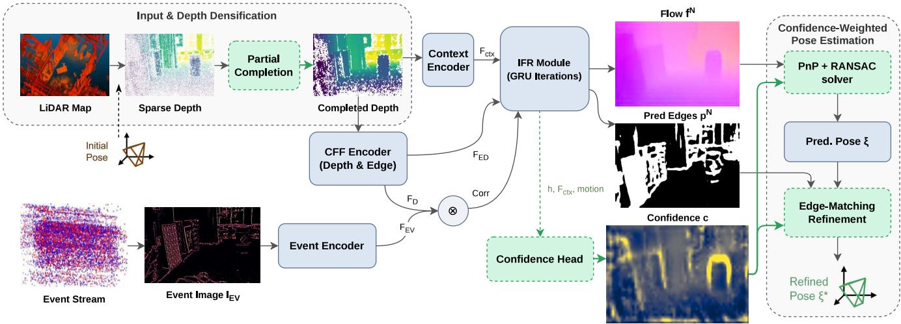
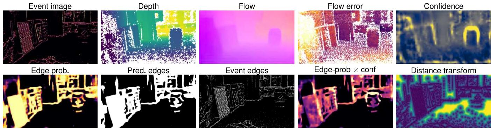
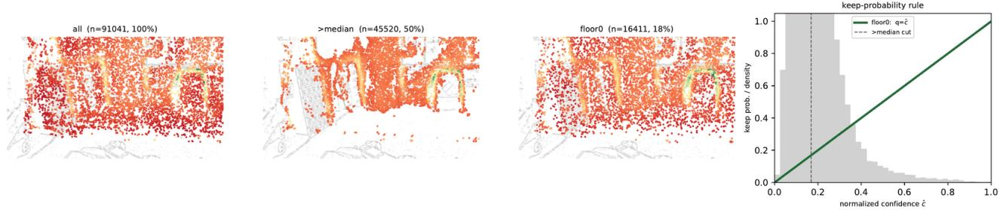
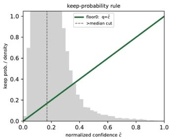
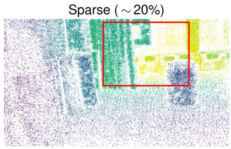
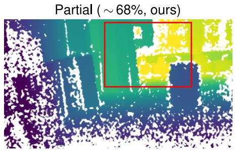
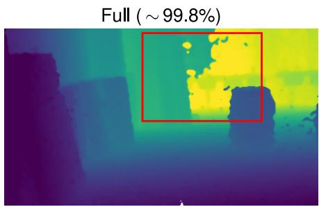

# Learning Which Correspondences to Trust: Confidence-Weighted Event-Camera Localization in LiDAR Maps

Panagiotis Kiousis1,2, Kuangyi Chen2, Jun Zhang2, Friedrich Fraundorfer2

Abstract— Localizing an event camera against a pre-built LiDAR map can be cast as dense optical-flow estimation between a rendered depth view and an event image, followed by a Perspective-n-Point (PnP) solver over the induced 3D– 2D correspondences. Existing pipelines rely on geometric consensus during pose estimation, but do not explicitly model the reliability or pose informativeness, i.e., how strongly a correspondence constrains the camera pose, of individual correspondences. We show that the natural way to learn it— using the per-correspondence error to constrain the learning of confidence—suffers from a depth-dependent bias: small pixel errors reside predominantly at large depths and do not lead to high pose informativeness. Instead, in our method (CELL), we learn a per-correspondence confidence end-to-end through the pose, using a differentiable probabilistic PnP whose logpartition term encourages weight configurations that yield a better-constrained pose distribution. The learned confidence is used in three ways: (i) it reweights the flow supervision in a decoupled training scheme that keeps pose gradients out of the flow/edge backbone; (ii) it drives a probabilistic correspondence selection at test time; and (iii) together with the network’s edgeprobability it weights a final edge-matching refinement. We further design a partial-completion depth representation that adds signal without hallucinating across large gaps. On M3ED and DSEC our full system improves over the LEAR baseline on the majority of the evaluated sequences: it reduces the median translation error by up to 26.9% and the median rotation error by up to 15.8%.

## I. INTRODUCTION

Event cameras report asynchronous per-pixel brightness changes with microsecond latency and very high dynamic range, making them attractive for visual perception in fastmotion and challenging-lighting regimes where frame cameras struggle. A practical form of the problem is maprelative localization: given a pre-built LiDAR point-cloud map, recover the six-degree-of-freedom (6-DoF) pose of an event camera in that map. Recent methods [1], [2] formulate the problem as cross-modal optical-flow estimation between a rendered depth view and an event image: a sparse depth image is rendered from the map at a guessed pose, dense flow is estimated between that depth view and an event image with a RAFT-style recurrent network [3], the flow is lifted to 3D–2D correspondences, and a pose is solved with PnP [4].

A key limitation is that, beyond rejecting geometrically inconsistent correspondences during pose estimation, the baseline does not explicitly model correspondence reliability or how strongly each correspondence constrains the pose.

Structured errors can remain mutually consistent and may survive RANSAC [5]-based consensus filtering, while geometrically consistent correspondences can still differ substantially in their usefulness for pose estimation.

A natural strategy is to supervise the correspondence confidence using per-correspondence error [6] and retain only high-confidence correspondences at inference. However, image-space error is not necessarily well aligned with pose estimation in our setting. Because pixel-space residuals are depth-dependent, distant correspondences can exhibit small flow errors while providing weak constraints on camera translation. As a result, flow-error-supervised confidence can favor correspondences that appear accurate in image space but are not necessarily the most informative for pose estimation, as we show in Sec. V-C. We therefore learn the confidence directly through the pose using differentiable probabilistic PnP [7]. Instead of matching confidence to an image-space error target, the probabilistic pose objective optimizes the correspondence weights according to how well they constrain the pose distribution. The resulting confidence is therefore learned with respect to the poseestimation objective rather than using flow error as a proxy for correspondence quality.

Our contributions are summarized as follows:

1) We propose a pose-supervised correspondence confidence learned through differentiable probabilistic PnP, together with a decoupled training strategy that uses the learned confidence to reweight flow supervision without propagating pose gradients into the backbone.

2) We use the learned confidence for probabilistic correspondence selection and confidence-weighted edgematching refinement, and introduce partial depth completion to increase useful correspondences while preserving geometric boundaries.

3) Experiments on M3ED and DSEC demonstrate improvements over the LEAR baseline on the majority of the evaluated sequences, with gains in translation, rotation, and localization accuracy.

## II. RELATED WORK

Event-based localization. Existing event-based localization methods can be broadly grouped into place recognition, direct pose regression, and map-based localization. Placerecognition approaches retrieve the closest entry from a reference database using event representations such as reconstructed images [8], edge maps [9], sparse informative pixels [10], or learned descriptors [11]. These methods provide coarse localization but do not directly recover a metric 6-DoF pose. Pose-regression methods instead predict the camera pose directly from event data [12]–[15], but typically encode scene-specific information in the learned model, which can limit generalization to unseen environments. Map-based approaches estimate the pose with respect to an explicit 3D representation, either geometrically by aligning events with semi-dense maps [16], [17], or photometrically by matching events against appearance predicted from photometric maps [18], [19] or Gaussian-splatting representations [20]. LiDAR maps, in contrast, provide dense metric geometry unaffected by illumination, motivating event-camera localization directly against LiDAR maps.

  
Fig. 1. Our pipeline. We extend the LEAR baseline with three components (green, dashed): a partial depth completion, a confidence head trained end-to-end through the pose loss, and a confidence-weighted edge-matching refinement. Sample maps are outputs on falcon\_indoor\_flight.

Event-to-LiDAR localization. Cross-modal event–LiDAR matching is comparatively underexplored. Early efforts target extrinsic calibration—marker-based [21] or target-free from edge correspondences [22]—but under controlled conditions that limit scalability, while E2PNet [23] learns an image-like event representation for point-cloud registration but reports only coarse accuracy. Closest to this work, EVLoc [1] casts localization as dense event–depth flow estimation with a RAFT-style network [3] and lifts the flow to 3D–2D correspondences for a PnP solver; LEAR [2] augments this with a jointly-trained depth-edge detector and cross-task fusion, making the rendered depth more “event-like” and improving robustness. We build directly on LEAR. Its final pose estimation already uses PnP with RANSAC to reject geometrically inconsistent correspondences, but correspondence quality is not explicitly learned before the geometric estimation. In particular, RANSAC inlier rejection does not distinguish between correspondences that are geometrically consistent yet differ substantially in how strongly they constrain the camera pose. Our work therefore complements, rather than replaces, geometric consensus by learning a pose-supervised correspondence confidence.

Confidence-based correspondence learning. Downweighting unreliable correspondences before a geometric solve is well studied outside the event domain. NG-RANSAC learns sampling weights for RANSAC [24]; DROID-SLAM predicts per-pixel confidence weights consumed by a differentiable bundle adjustment [25]; and EPro-PnP makes PnP itself differentiable through a probabilistic formulation, learning 2D–3D correspondence weights end-to-end via a pose loss [7]. A related strategy uses reprojection error as a supervision or guidance signal; for example, EGFS [6] uses low-error regions to guide scene-coordinate regression. We observe a limitation of using image-space correspondence error as the supervision signal for confidence learning: pixel-space error is inherently depth-dependent, so low-error correspondences can be biased toward distant, low-parallax points whose small image-space residuals do not necessarily imply strong pose constraints, particularly for translation. We therefore learn confidence directly through a probabilistic pose objective rather than using correspondence error alone as the confidence supervision target.

## III. PRELIMINARIES

We build directly on LEAR [2], which casts event-to-LiDAR localization as dense flow estimation followed by a PnP solver. This section summarizes the baseline components and notation required by our method.

Problem and inputs. Given a pre-built LiDAR map and a coarse initial pose $\mathbf { T } _ { \mathrm { i n i t } } .$ , the goal is to recover the camera’s 6-DoF pose. The map points are transformed into the camera frame and projected with a pinhole model at $\mathbf { T } _ { \mathrm { i n i t } }$ to render a sparse depth image $I _ { D } ;$ in parallel, the events within a short time window are filtered and accumulated into an event image IEV.

Edge-aware flow network. The depth image is encoded into the depth feature $\mathbf { F } _ { D }$ , while a separate event encoder produces the event feature $\mathbf { F } _ { E V } , \mathbf { A }$ context encoder additionally provides context features $\mathbf { F } _ { c t x }$ . Based on the correlation between $\mathbf { F } _ { D }$ and $\mathbf { F } _ { E V }$ , an iterative feature refinement module (IFR) progressively updates the flow using a gated recurrent unit (GRU). During refinement, the IFR maintains a hidden state h and motion features derived from the correlation lookup and the current flow. The recurrent updates produce a sequence of flow estimates $\mathbf { f } ^ { 1 : N }$ and edge-probability maps $\mathbf { p } ^ { 1 : N }$

From flow to pose. For each pixel $\mathbf { u } _ { i }$ with valid depth, the depth value is deprojected to a 3D map point $\mathbf { X } _ { i }$ . The final flow prediction provides the corresponding 2D observation in the event image, $\mathbf { x } _ { i } = \mathbf { u } _ { i } + \mathbf { f } ^ { N } ( \mathbf { u } _ { i } )$ , where $\mathbf { u } _ { i } = \pi ( \mathbf { X } _ { i } , \mathbf { T } _ { \mathrm { i n i t } } )$ and $\pi ( \cdot )$ denotes camera projection. The resulting correspondence set is passed to a PnP solver within a RANSAC scheme to estimate the camera pose. Although RANSAC rejects geometrically inconsistent correspondences, the baseline does not explicitly model correspondence-level reliability or how strongly each correspondence constrains the pose before geometric estimation. In addition, the sparse projected depth limits the spatial support from which valid correspondences can be formed.

## IV. METHOD

Building on the LEAR pipeline described in Sec. III, our method centers on learning a pose-supervised confidence for each 3D–2D correspondence. The learned confidence is used to reweight flow supervision during training, to guide correspondence selection at inference, and to weight a subsequent edge-matching refinement—exploiting an edge-probability map the baseline predicts but only ever uses internally for flow fusion. In addition, we employ a conservative partial depth completion to increase the spatial support of the sparse LiDAR projection while preserving depth discontinuities. An overview of the complete pipeline is shown in Fig. 1.

## A. Partial depth completion

The rendered depth $I _ { D }$ is sparse (approximately 20% of pixels). Sparse projected depth limits the number and spatial coverage of valid correspondences. However, aggressive completion may propagate depth across large unsupported regions, blurring depth discontinuities. We therefore complete the depth only partially—a single dilation of the valid points with a $3 \times 3$ cross kernel, without filling large gaps. This increases the fraction of valid depth pixels from approximately 20% to 68%—supplying the flow and pose supervision with far more valid 2D–3D correspondences— while preserving the object edges the edge branch and later edge matching rely on.

## B. Per-correspondence confidence head

We attach a small head that predicts a dense per-pixel confidence map c, evaluated once per frame. It reads three feature groups from the IFR: (i) K=4 snapshots of the GRU hidden state h (the recurrent flow estimator’s evolving internal state), taken at fixed iteration indices and concatenated; (ii) the context features $\mathbf { F } _ { c t x } ;$ and (iii) motion features derived from the correlation lookup and current flow. These are concatenated $( 4 { \cdot } 1 2 8 + 2 5 6 + 1 2 8 = 8 9 6$ channels at $1 / 8$ resolution) into a per-pixel feature vector g and passed through a two-layer 1×1 convolutional MLP:

$$
\mathrm { C o n f H e a d } ( \mathbf { g } ) = \mathrm { C o n v } _ { 1 \times 1 } ^ { 2 5 6  1 } \big ( \mathrm { R e L U } ( \mathrm { C o n v } _ { 1 \times 1 } ^ { 8 9 6  2 5 6 } ( \mathbf { g } ) ) \big ) .\tag{1}
$$

The single-channel logit map z is bilinearly upsampled to the input resolution and converted to a positive confidence map:

$\mathbf { c } = \mathrm { s o f t p l u s } ( \mathbf { z } ) > 0 .$ . We use softplus because the confidence is subsequently used as a positive relative weight rather than a bounded probability. Since the input features already aggregate spatial and recurrent context, the confidence head itself remains lightweight and per-pixel. The input features to the confidence head are detached, so the gradients from the confidence branch do not propagate into the flow/edge backbone. The per-correspondence confidence $c _ { i }$ is obtained by sampling c at the pixel of correspondence i.

## C. Learning confidence through the pose

The natural flow-error-based baseline, following the errorguided selection idea [6], learns a confidence $\kappa _ { i } > 0$ by supervising each correspondence with

$$
\begin{array} { r } { \mathcal { L } _ { i } ^ { \mathrm { e r r } } = \kappa _ { i } \operatorname { t a n h } \left( \boldsymbol { e } _ { i } / \tau \right) - \eta \log \kappa _ { i } , } \end{array}\tag{2}
$$

where $e _ { i } = \| \mathbf { f } ^ { N } ( \mathbf { u } _ { i } ) - \mathbf { f } _ { \mathrm { g t } } ( \mathbf { u } _ { i } ) \| _ { 2 }$ is the flow error, τ a clamping scale, and η a regularization weight. This fails here because the supervision signal is strongly depth-dependent: distant points tend to exhibit smaller pixel-space displacements and residuals. Minimizing this signal therefore induces a preference that is not aligned with pose informativeness, so flow-error-based selection is systematically biased toward distant, low-parallax points (Fig. 2, Table II).

Pose-supervised weights. We instead learn the weights endto-end through a differentiable probabilistic PnP [7]. Let $r _ { i } ( \mathbf { T } ) = \rho \big ( \| \pi ( \mathbf { X } _ { i } , \mathbf { T } ) - \mathbf { x } _ { i } \| \big )$ denote the robust reprojection residual of correspondence i, where π is the pinhole projection, x is the 2D observation, and $\rho$ is a Huber kernel. The per-correspondence pose weights $\widetilde { c } _ { i } = M \mathrm { s o f t m a x } _ { i } ( \mathbf { z } )$ are a softmax of the logit z over the M correspondences sampled in a frame, scaled so that $\textstyle \sum _ { i } { \tilde { c } } _ { i } = M$ and the weights average to 1, matching the normalization EPro-PnP’s formulation requires. The pose weights and the softplus confidence c are computed from the same logit z: the pose weights are used only in the pose loss, while c (Sec. IV-B) reweights the flow loss and is used for selection and refinement at test time. The pose loss combines a target term and a log-partition term, defined as follows:

$$
\begin{array} { r } { \mathcal { L } _ { \mathrm { t g t } } = \sum _ { i } \tilde { c } _ { i } r _ { i } ( \mathbf { T } _ { \mathrm { g t } } ) , } \end{array}\tag{3}
$$

$$
\mathcal { L } _ { \mathrm { p r e d } } = \log \int \mathrm { e x p } \big ( - \sum _ { i } \tilde { c } _ { i } r _ { i } ( \mathbf { T } ) \big ) d \mathbf { T } ,\tag{4}
$$

$$
\begin{array} { r } { \mathcal { L } _ { \mathrm { p o s e } } = \mathcal { L } _ { \mathrm { t g t } } + \gamma \mathcal { L } _ { \mathrm { p r e d } } . } \end{array}\tag{5}
$$

The target term ${ \mathcal { L } } _ { \mathrm { t g t } }$ (weighted residual at $\mathbf { T } _ { \mathrm { g t } } )$ alone rewards correspondences with low reprojection error, which tend to be distant, low-parallax points—the source of the depth bias. The log-partition ${ \mathcal { L } } _ { \mathrm { p r e d } }$ is small only when the weighted correspondences make the pose distribution sharp. We upweight the log-partition term with γ=1.5 to emphasize poselevel constraint quality, and use the resulting confidence for correspondence selection in Sec. IV-D. The differentiable solver is required only for training, where it makes the pose loss backpropagate into the confidence head. At inference differentiability is unneeded, and we found the baseline’s standard PnP+RANSAC solver to be more accurate and robust. We therefore use it for all test-time results, and the EPro-PnP layer is training-only.

  
Fig. 2. Qualitative maps (falcon\_indoor\_flight). Top: the flow error (purple → yellow = low → high) is low almost everywhere, dominated by the depth-dependent perspective effect rather than by pose-relevant structure—a signal the confidence is not trained to reproduce. Instead, supervised only through the pose loss, the learned confidence reflects both cues: it remains high on some low-error, far-depth regions, but concentrates most strongly on near-depth, high-parallax object edges—the correspondences most informative for translation. Bottom: the edge-probability, the predicted and event edges, the pointwise product of the edge-probability and confidence maps—the refinement weight (edge-prob × conf)—and the event-edge distance transform.

Decoupled training. The confidence head is trained together with the flow/edge network but decoupled from it. The pose loss is applied with the flow detached, so it trains only the confidence head (whose inputs are detached); the flow and edge branches keep training on their own losses. The same confidence, detached, reweights the flow supervision:

$$
\mathcal { L } _ { \mathrm { f l o w } } ^ { c } = \frac { \sum _ { u , \nu } \mathrm { s g } \big ( \mathbf { c } ( u , \nu ) \big ) \mathbf { 1 } \big [ \mathbf { f } _ { \mathrm { g t } } ( u , \nu ) \neq 0 \big ] \| \mathbf { f } ( u , \nu ) - \mathbf { f } _ { \mathrm { g t } } ( u , \nu ) \big ] \| _ { 2 } } { \sum _ { u , \nu } \mathrm { s g } \big ( \mathbf { c } ( u , \nu ) \big ) \mathbf { 1 } \big [ \mathbf { f } _ { \mathrm { g t } } ( u , \nu ) \neq 0 \big ] + \varepsilon } ,\tag{6}
$$

a confidence-weighted mean of the per-pixel end-point error $( \ell _ { 2 }$ norm) over the valid pixels (sg = stop-gradient; $\mathbf { 1 } [ \mathbf { f } _ { \mathrm { g t } } ( u , \nu ) \neq 0 ]$ is 1 where the ground-truth flow is valid and 0 otherwise; ε a small constant for numerical stability). This concentrates flow supervision on confident, pose-important regions and improves the flow, without the pose gradient entering the backbone. The total objective is $\alpha \mathcal { L } _ { \mathrm { f l o w } } ^ { c } +$ $\beta \mathcal { L } _ { \mathrm { e d g e } } + \lambda \mathcal { L } _ { \mathrm { p o s e } } \ ( \alpha { = } 1 , \beta { = } 1 0 0 , \lambda { = } 0 . 1 )$

## D. Confidence-guided selection at test time

Given the learned confidence, we next consider how it should be used when solving for the pose. One strategy is to keep only the correspondences whose confidence is above the per-frame median and discard the rest. This helps, but it implicitly treats the confidence as perfectly reliable: a hard cutoff throws away every low-ranked correspondence, so any error in the confidence ordering removes potentially useful points.

Ideally, each correspondence would be weighted by its confidence inside the solver, keeping all points but letting reliable ones dominate. Since the PnP solver does not support per-correspondence weights, we instead bias the correspondence set through confidence-dependent stochastic sampling. Each correspondence is retained with a probability that increases with its confidence,

$$
q _ { i } = \mathbf { f l o o r } + \left( 1 - \mathbf { f l o o r } \right) \hat { c } _ { i } ,\tag{7}
$$

where $\hat { c } _ { i } \in [ 0 , 1 ]$ is the confidence normalized within the frame (min–max). The raw confidence is a softplus output of arbitrary scale; the per-frame normalization makes the probability of sampling well-defined and invariant to that scale. With floor=0 (denoted floor0), the lowest-confidence point is kept with probability 0 and the highest with probability 1, linearly in between—a soft analogue of weighting that biases, rather than truncates, the sampled subset.

Because the confidence is not perfectly reliable, a purely proportional rule (floor=0) can still discard a useful but low-scored correspondence. We hedge against this with a non-zero floor: with floor=0.5 (denoted floor0.5), even a correspondence with the minimum normalized confidence is retained with probability 0.5, rising linearly to 1 for the most confident. This makes the selection robust to imperfect confidence while still favouring the reliable correspondences.

The sampling also reduces the number of correspondences passed to the geometric solver. With the observed average normalized confidence, floor0 and floor0.5 retain approximately 28% and 64% of the correspondences, respectively, compared with 100% when using all points. This reduces the workload of the subsequent PnP+RANSAC stage.

## E. Confidence-weighted edge-matching refinement

Finally we refine the pose by aligning the predicted depth-edges to the observed event edges (Fig. 2, bottom row). Predicted edges (from the edge-probability map p, thresholded and skeletonized) are deprojected through $I _ { D }$ to 3D points $\mathbf { X } _ { i } ;$ we minimize a robust chamfer distance to the distance transform DT of the event edges over the pose, parameterized as $\pmb { \xi } = ( \pmb { \omega } , \pmb { t } ) \in \mathbb { R } ^ { 6 }$ (axis-angle rotation ω and translation t), with a regularization term to the initial pose:

$$
E ( \pmb { \xi } ) = \frac { \sum _ { i } w _ { i } \rho \left( \mathrm { D T } [ \pi ( \mathbf { X } _ { i } , \pmb { \xi } ) ] \right) } { \sum _ { i } w _ { i } } + a _ { w } \| \pmb { \xi } - \pmb { \xi } _ { \mathrm { i n i t } } \| ^ { 2 } ,\tag{8}
$$

solved with LBFGS, where $\rho$ is the Huber loss, $\pi ( \mathbf { X } _ { i } , \pmb { \xi } )$ projects $\mathbf { X } _ { i }$ under the pose given by $\xi , \xi _ { \mathrm { i n i t } }$ is the initial pose, and $a _ { w }$ weights the regularization term. Each edge is weighted by both the edge-probability and the confidence, $w _ { i } = p _ { i } c _ { i } \mathrm { : }$ the edge-probability indicates whether a genuine edge is present at that location, while the confidence reflects the correspondence’s pose reliability. The combination gives the best accuracy.

TABLE I  
Comparison with EVLoc and LEAR on M3ED and DSEC. METRICS AS IN SEC. V-A; OURS: CONFIDENCE-GUIDED SELECTION WITH CONFIDENCE-WEIGHTED EDGE-MATCHING REFINEMENT; BOLD: BEST PER ROW. EVLOC RESULTS AS REPORTED IN [2] (NO ACCURACY).
<table><tr><td rowspan="2">Dataset</td><td rowspan="2">Test Scene</td><td rowspan="2">Time</td><td colspan="3">EVLoc [1]</td><td colspan="3">LEAR</td><td colspan="3">Ours</td></tr><tr><td>T[cm]↓</td><td>R[°]↓</td><td>Acc↑</td><td>T[cm]↓</td><td>R[°]↓</td><td>Acc↑</td><td>T[cm]↓</td><td>R[°]↓</td><td>Acc↑</td></tr><tr><td rowspan="10">M3ED</td><td>car_forest_into_ponds</td><td>day</td><td>19.76</td><td>0.86</td><td></td><td>15.15</td><td>0.739</td><td>72.8</td><td>12.25</td><td>0.711</td><td>82.9</td></tr><tr><td>car_urban_day_penno</td><td>day</td><td>14.15</td><td>0.60</td><td></td><td>12.14</td><td>0.525</td><td>89.1</td><td>11.94</td><td>0.530</td><td>90.3</td></tr><tr><td>falcon_outdoor_day_penno_parking</td><td>day</td><td>25.11</td><td>1.32</td><td></td><td>23.61</td><td>1.186</td><td>48.8</td><td>19.84</td><td>1.000</td><td>59.2</td></tr><tr><td>falcon_indoor_flight</td><td></td><td>8.11</td><td>0.97</td><td></td><td>6.95</td><td>0.796</td><td>29.3</td><td>6.19</td><td>0.670</td><td>39.1</td></tr><tr><td>spot_indoor_building</td><td></td><td>12.88</td><td>2.07</td><td></td><td>10.85</td><td>1.718</td><td>13.6</td><td>10.53</td><td>1.672</td><td>16.7</td></tr><tr><td>spot_forest_road</td><td>day</td><td>13.55</td><td>0.60</td><td></td><td>12.41</td><td>0.526</td><td>77.1</td><td>9.12</td><td>0.522</td><td>82.9</td></tr><tr><td>falcon_forest_into_forest</td><td>day</td><td>20.46</td><td>1.87</td><td></td><td>18.59</td><td>2.053</td><td>40.3</td><td>18.64</td><td>1.768</td><td>46.5</td></tr><tr><td>spot_outdoor_day_penno</td><td>day</td><td>17.89</td><td>0.88</td><td></td><td>14.81</td><td>0.713</td><td>73.5</td><td>13.13</td><td>0.659</td><td>84.7</td></tr><tr><td>spot_outdoor_night_penno Average</td><td>night</td><td>34.85</td><td>1.71</td><td></td><td>26.94</td><td>1.210</td><td>38.2</td><td>24.36</td><td>1.207</td><td>46.7</td></tr><tr><td>thun_00</td><td></td><td>18.53</td><td>1.21</td><td></td><td>15.72</td><td></td><td>1.052</td><td>53.6</td><td>14.00 0.971</td><td>61.0</td></tr><tr><td rowspan="10">DSEC</td><td>zurich_city_00</td><td>dawn/dusk dawn/dusk</td><td>8.26 7.94</td><td>0.42 0.37</td><td></td><td>8.50 7.15</td><td>0.365 0.348</td><td>100.0 98.9</td><td>6.21 0.334 6.68</td><td>100.0</td></tr><tr><td></td><td>dawn/dusk</td><td></td><td></td><td></td><td></td><td>0.283</td><td></td><td>0.353</td><td>99.6</td></tr><tr><td>zurich_city_01</td><td></td><td>7.63</td><td>0.30</td><td></td><td>6.68</td><td>0.282</td><td>98.0 6.49</td><td>0.284</td><td>98.0</td></tr><tr><td>zurich_city_02</td><td>dawn/dusk</td><td>7.93</td><td>0.31</td><td></td><td>7.07</td><td></td><td>99.6 7.35</td><td>0.276</td><td>99.2</td></tr><tr><td>zurich_city_03</td><td>night</td><td>8.79</td><td>0.61</td><td></td><td>8.60</td><td>0.554</td><td>88.7</td><td>7.42 0.543</td><td>90.9</td></tr><tr><td>zurich_city_04</td><td>dawn/dusk</td><td>7.49</td><td>0.30</td><td></td><td>6.56</td><td>0.282</td><td>99.3 5.89 99.9</td><td>0.259</td><td>98.6</td></tr><tr><td>zurich_city_05</td><td>day</td><td>6.42</td><td>0.28</td><td></td><td>5.67</td><td>0.256</td><td>5.41 6.74</td><td>0.237</td><td>100.0</td></tr><tr><td>zurich_city_06</td><td>day</td><td>8.12</td><td>0.39</td><td></td><td>6.69</td><td>0.330</td><td>97.2</td><td>0.349</td><td>97.0</td></tr><tr><td>zurich_city_07</td><td>day</td><td>7.27</td><td>0.34</td><td></td><td>6.52</td><td>0.292</td><td>99.9 6.47</td><td>0.291 0.235</td><td>99.9</td></tr><tr><td>zurich_city_08</td><td>dawn/dusk</td><td>6.62</td><td>0.27</td><td></td><td>5.73</td><td>0.240</td><td>100.0</td><td>5.72</td><td>99.5</td></tr><tr><td>zurich_city_09</td><td>night</td><td>6.38</td><td>0.29</td><td></td><td>5.94</td><td>0.312</td><td>99.8</td><td>5.80</td><td>0.271</td><td>100.0</td></tr><tr><td>zurich_city_10</td><td>night</td><td>8.37</td><td>0.35</td><td></td><td>7.47</td><td>0.342</td><td>98.5</td><td>7.13</td><td>0.325</td><td>99.5</td></tr><tr><td>zurich_city_11</td><td>dawn/dusk</td><td>6.14</td><td>0.26</td><td></td><td>5.77</td><td>0.251</td><td>100.0</td><td>5.45</td><td>0.214</td><td>100.0</td></tr><tr><td>Average</td><td></td><td>7.49</td><td>0.35</td><td></td><td>6.80</td><td>0.318</td><td>98.4</td><td>6.37</td><td>0.305</td><td>98.6</td></tr></table>

## V. EXPERIMENTS

## A. Setup

Datasets. We evaluate on M3ED [26] and DSEC [27]. M3ED provides LiDAR maps with ground-truth trajectories and is our primary benchmark, spanning heterogeneous environments—indoor flight, outdoor driving, and forest. DSEC adds more complex driving scenarios but offers only disparity images; following LEAR [2], we reconstruct a persample point cloud by back-projecting the disparity-derived depth through the pinhole camera model.

Data processing. As in LEAR [2], a coarse initial pose is simulated by perturbing the ground truth (the identity for DSEC) with uniform random offsets of up to ±50 cm in translation and $\pm 5 ^ { \circ }$ in rotation; the task is to recover the true pose. Inputs are cropped to fixed per-dataset resolutions— 512 × 288 for M3ED and 480 × 360 for DSEC—and the depth normalization scale (the local-map depth ceiling) is set per environment (10 m indoor, 100 m outdoor, 50 m DSEC). At test time, the 6-DoF pose is estimated from the predicted 3D–2D correspondences using PoseLib [28], [29] with PnP+RANSAC and a 12-pixel reprojection-error inlier threshold. The differentiable EPro-PnP [7] layer is used only during training.

Baseline. Our direct baseline is LEAR [2], on which our method is built. All shared components, data splits, training schedules, and geometric settings are kept identical to the baseline; differences are restricted to the components introduced in Sec. IV.

Training. For M3ED a separate model is trained per scene, as the dataset spans heterogeneous environments: for scenes with multiple sequences, the last sequence is held out for evaluation and the rest are used for training; single-sequence scenes instead use a temporal 70/30 train/test split with no overlap. For DSEC, whose scenes share driving dynamics and sensor configuration, a single model is trained across all scenes: for scenes with multiple sequences, the final sequence is held out for evaluation and the rest are pooled for training, while single-sequence scenes are excluded from training entirely and used only for evaluation. Every model is trained for 100 epochs with batch size 2, initial learning rate $4 \times 1 0 ^ { - 5 }$ , weight decay $5 \times 1 0 ^ { - 5 }$ , a OneCycleLR schedule, and the AdamW optimizer; the IFR module runs 12 iterations at training and 24 at test. Training uses a single NVIDIA RTX 5070 Ti GPU.

Metrics. We report the median translation (cm) and rotation (◦) errors as the primary pose metrics, an accuracy rate (the fraction of frames within a pose-error threshold, applied per environment: (5 cm,5◦) indoors and (25 cm,2◦) outdoors), and the flow End-Point Error (EPE, px), averaged per frame over the correspondences kept by the selection and reported as its mean $\mathrm { ( E P E _ { m n } ) }$ and median $\mathrm { ( E P E _ { m d } ) }$ over frames.

## B. Main results

Table I compares our full system with EVLoc and the LEAR baseline across all 22 evaluated sequences. Our method outperforms EVLoc in both median translation and rotation error on all 22 sequences, by 18.5% and 14.9% on average. Compared with LEAR, it reduces the median translation error on 19 sequences and the median rotation error on 18, while improving localization accuracy on 14. Unless otherwise stated, the improvements reported below are relative to LEAR and computed per sequence and then averaged: translation and rotation are reported as relative error reductions, whereas accuracy is reported as an absolute percentage-point gain.

  
Fig. 3. Confidence-guided selection (falcon\_indoor\_flight). Correspondences kept by each rule, coloured by confidence (green = high, red = low; subsampled for clarity), and the probability of sampling rule overlaid on the confidence histogram. floor0 keeps a broad but confidence-biased subset whereas the hard > median cut discards half the points.

TABLE II  
Flow-error-supervised compared to pose-supervised confidence (falcon\_indoor\_flight, SPARSE DEPTH): T[cm]/R[◦]/ACC/MEAN DEPTH OF KEPT POINTS [m].
<table><tr><td>Flow-error-supervised</td><td>Pose-supervised</td></tr><tr><td>15.69/1.59/4.3/7.04</td><td>7.74/0.83/22.4/5.92</td></tr></table>

Across the nine M3ED sequences, our method reduces the median translation error by 10.9% on average, with a maximum reduction of 26.5%, and reduces the median rotation error by 6.6% on average, with a maximum reduction of 15.8%. Localization accuracy improves on all nine sequences, by 7.4 percentage points on average and by up to 11.2 points.

Across the 13 DSEC sequences, our method reduces the median translation error by 5.7% on average, with a maximum reduction of 26.9%, and the median rotation error by 4.3% on average, with a maximum reduction of 14.7%. Localization accuracy is already high for the LEAR baseline, reaching at least 98% on 11 of the 13 sequences, leaving limited room for further improvement. Our method nevertheless maintains or improves accuracy on most sequences.

## C. Flow-error compared to pose supervision

We construct a flow-error-supervised confidence baseline inspired by EGFS [6] (Eq. (2)), using the same network architecture, training data, and optimization schedule as our pose-supervised model. To expose the difference between the two confidence signals, we retain only the top 10% most confident correspondences at inference. This deliberately aggressive selection degrades both methods, but the degradation is substantially larger for flow-error-supervised confidence. As shown in Table II, flow-error supervision tends to assign higher confidence to more distant correspondences, resulting in markedly worse pose estimation. In contrast, the posesupervised confidence retains correspondences with lower average depth and preserves substantially better localization.

TABLE III  
Correspondence selection (NON-REFINED POSES, 22 SEQUENCES). W/N: SEQUENCES ON WHICH A RULE BEATS THE BASELINE; ∆: MEAN CHANGE (MEDIAN T/R IN %, ACC IN POINTS).
<table><tr><td rowspan="2">Selection</td><td colspan="2">med_t</td><td colspan="2">med_r</td><td colspan="2">Acc</td></tr><tr><td>W/N↑</td><td>∆%↓</td><td>W/N↑</td><td>∆%↓</td><td>W/N↑</td><td>∆pp↑</td></tr><tr><td>all</td><td>18/22</td><td>-7.1</td><td>13/22</td><td>-2.1</td><td>14/22</td><td>+2.4</td></tr><tr><td>floor0</td><td>18/22</td><td>-7.5</td><td>15/22</td><td>-3.2</td><td>14/22</td><td>+2.8</td></tr><tr><td>floor0.5</td><td>19/22</td><td>-7.2</td><td>13/22</td><td>-2.5</td><td>14/22</td><td>+2.5</td></tr><tr><td>&gt;median</td><td>14/22</td><td>-5.2</td><td>14/22</td><td>-3.0</td><td>13/22</td><td>+2.4</td></tr></table>

## D. Confidence-guided selection

Table III compares the four selection rules against the baseline on the non-refined poses (before edge-matching refinement), isolating the effect of selection. The all row is our model without any selection: it already accounts for most of the improvement over the baseline, a gain that stems from the partial depth and the decoupled confidence training. Selection operates on top of this model at essentially no runtime cost (Table VIII) and adds a further, smaller gain. Pooled over all 22 sequences, floor0 gives the best overall results, being best or tied on five of the six columns, with the largest mean reductions in both translation (7.5%) and rotation (3.2%) error. The hard >median rule remains competitive on rotation but falls behind on translation: discarding half of the correspondences removes points the solver needs. On DSEC, where the baseline is already near-saturated, selection is largely neutral (all ≈ floor0 ≈ floor0.5) and only the hard cut hurts. Fig. 3 visualises what each rule keeps.

## E. Edge-matching refinement weighting

The refinement of Eq. (8) weights each predicted edge by wi. We compare three choices: none (uniform, wi=1); conf (the per-correspondence confidence $c _ { i }$ sampled at the edge pixel); and both $( w _ { i } = p _ { i } c _ { i }$ , edge-probability × confidence). We report the mean accuracy over all sequences.

As Table IV shows, all three weightings improve accuracy over both the baseline and the non-refined pose. Weighting by the confidence provides a small additional improvement over uniform weighting (+0.29 vs. +0.26 points relative to the non-refined pose), suggesting that the learned confidence can also provide a useful weighting cue for the refinement. Weighting by both the edge-probability and the confidence is strongest overall (+3.12/+0.32). The edge probability and correspondence confidence provide complementary weighting cues: the former reflects the predicted presence of an edge, whereas the latter is learned through pose supervision. Multiplying the two keeps edges that are both geometrically reliable and genuinely present, which is what the chamfer term needs. We therefore adopt the both weighting.

  
Fig. 4. Depth-completion variants (onfalcon\_indoor\_flight): sparse LiDAR (∼20%), our edge-preserving partial completion (∼68%), andfull completion (∼99.8%). Full propagates depth across object boundaries (red box), unlike partial (Table V).  
TABLE VI

TABLE IV  
Edge weighting for the refinement: MEAN ACCURACY AND ITS GAIN OVER LEAR AND THE NON-REFINED POSE.
<table><tr><td>Edge weighting</td><td>Mean Acc</td><td>Δ vs LEAR</td><td>Δ vs non-ref.</td><td>≥ base</td></tr><tr><td>none (uniform)</td><td>83.18</td><td>+3.06</td><td>+0.26</td><td>16/22</td></tr><tr><td>conf (confidence)</td><td>83.21</td><td>+3.09</td><td>+0.29</td><td>16/22</td></tr><tr><td>both (edge-prob × conf)</td><td>83.24</td><td>+3.12</td><td>+0.32</td><td>16/22</td></tr></table>

TABLE V

Depth-input completion ON falcon\_outdoor\_day\_penno\_parking (ALL CORRESPONDENCES, NO SELECTION).
<table><tr><td>Depth input</td><td>Valid</td><td>med_t [cm]↓</td><td>acco [%]↑</td><td> $\mathrm { E P E } _ { \mathrm { m n } \downarrow }$ </td><td> $\mathrm { E P E } _ { \mathrm { m d } \downarrow }$ </td></tr><tr><td>sparse</td><td>~20%</td><td>23.15</td><td>51.1</td><td>8.74</td><td>6.06</td></tr><tr><td>full dense</td><td>~99.8%</td><td>23.26</td><td>50.6</td><td>10.23</td><td>6.42</td></tr><tr><td>partial (ours)</td><td>~68%</td><td>20.80</td><td>57.6</td><td>8.08</td><td>5.78</td></tr></table>

## F. Depth completion: sparse vs. partial vs. full

Table V isolates the depth input by comparing the three completions on our model trained with the decoupled scheme (Sec. IV-C), at the all selection (no confidence selection), on a data-rich outdoor scene. A full completion is counterproductive: it fills nearly every pixel (∼99.8%) but hallucinates depth at object margins (Fig. 4), which adds geometrically wrong correspondences—accuracy drops below even the sparse input (50.6 vs. 51.1) and the flow itself degrades (median EPE 6.06 → 6.42 px, with the mean rising more sharply, 8.74 → 10.23). The partial completion instead fills conservatively (∼68%): it grows the valid regions enough to add useful correspondences while preserving object bound aries, and is the best of the three on every metric (+6.5 accuracy, −2.4 cm median translation, and lowest EPE).

## G. Incremental ablation

Table VI incrementally adds the proposed components on falcon\_outdoor\_day\_penno\_parking. Partial depth completion and decoupled confidence training provide the largest accuracy gains, improving accuracy by 2.3 and 6.5 percentage points, respectively. Confidence-guided selection adds a further 1.3-point improvement, while the final edge-matching refinement provides a smaller additional gain of 0.3 points and reduces the median translation error by 0.22 cm. Overall, the full system reduces the median translation and rotation errors by 3.77 cm and 0.186◦ and improves localization accuracy by 10.4 percentage points over the baseline.

Incremental ablation ON falcon\_outdoor\_day\_penno\_parking: EACH ROW ADDS ONE COMPONENT; PARENTHESES GIVE THE CHANGE VS. THE PREVIOUS ROW. †REFINEMENT CHANGES ONLY THE POSE, SO EPE EQUALS THE FLOOR0 ROW.
<table><tr><td>Configuration</td><td>med_t↓</td><td>med_r↓</td><td>Acc↑</td><td>EPEmn ↓</td><td>EPEmd ↓</td></tr><tr><td>base: LEAR (sparse)</td><td>23.61</td><td>1.186</td><td>48.8</td><td>9.42</td><td>5.97</td></tr><tr><td>+ partial depth</td><td>22.65 (−0.96)</td><td>1.240 (+0.054)</td><td>51.1 (+2.3)</td><td>9.63</td><td>6.31</td></tr><tr><td>+ decoupled conf. training</td><td>20.80 (−1.85)</td><td>1.080 (−0.160)</td><td>57.6 (+6.5)</td><td>8.08</td><td>5.78</td></tr><tr><td>+ confidence selection</td><td>20.06 (−0.74)</td><td>1.027 (−0.053)</td><td>58.9 (+1.3)</td><td>7.48</td><td>5.27</td></tr><tr><td>+ edge-matching refinement (Ours)</td><td>19.84 (−0.22)</td><td>1.000 (−0.027)</td><td>59.2 (+0.3)</td><td colspan="2">= floor0</td></tr><tr><td>net (base → Ours)</td><td>19.84 (−3.77)</td><td>1.000 (−0.186)</td><td>59.2 (+10.4)</td><td>7.48</td><td>5.27</td></tr></table>

TABLE VII

Halved iteration budget: OURS AT 12 IFR ITERATIONS VS. THE 24-ITERATION LEAR BASELINE (W/N AND ∆ AS IN TABLE III).
<table><tr><td rowspan="2">Split</td><td colspan="2">med_t</td><td colspan="2">med_r</td><td colspan="2">Acc</td></tr><tr><td>W/N↑</td><td>∆%↓</td><td>W/N↑</td><td>∆%↓</td><td>W/N↑</td><td>∆pp↑</td></tr><tr><td>M3ED (9)</td><td>6/9</td><td>-3.2</td><td>6/9</td><td>-1.8</td><td>7/9</td><td>+3.3</td></tr><tr><td>DSEC (13)</td><td>7/13</td><td>-3.2</td><td>7/13</td><td>-1.6</td><td>5/13</td><td>-0.2</td></tr><tr><td>All (22)</td><td>13/22</td><td>-3.2</td><td>13/22</td><td>-1.7</td><td>12/22</td><td>+1.2</td></tr></table>

## H. Halving the iteration budget

As IFR flow updates dominate the network cost (Table VIII), Table VII runs our full recipe at 12 iterations against the 24-iteration LEAR baseline. At roughly half the flow-update cost, it still reduces the median translation error on 13/22 sequences and increases accuracy on 12/22, mainly on M3ED (7/9 scenes, +3.3 points on average). On nearsaturated DSEC, both median errors still improve.

## I. Runtime and memory

Table VIII breaks down the per-frame cost. The core network (feature encoding + IFR flow estimation) is essentially unchanged from the baseline: the confidence head and the partial-depth dilation add negligible runtime and memory over the baseline network, so our accuracy gains come at essentially no extra network cost. Flow estimation dominates the network and is linear in the iteration count, so halving it (24 → 12) roughly halves that stage. The edge-matching refinement is the one substantial addition. It is therefore best viewed as an optional final stage: with it disabled, the network’s runtime and memory are on par with the baseline, yet localization still improves over it (Table III).

TABLE VIII  
Runtime and memory ON falcon\_indoor\_flight; MEMORY IS THE PEAK ALLOCATION, EXCLUDING THE FIXED CUDA CONTEXT (≈ 300 MB).
<table><tr><td>Method</td><td>Stage</td><td>Runtime [ms]</td><td>Memory [MB]</td></tr><tr><td rowspan="2">Baseline (LEAR)</td><td>Feature encoding</td><td>8.89</td><td rowspan="2">335</td></tr><tr><td>Flow estimation (24 iters)</td><td>77.15</td></tr><tr><td rowspan="4">Ours</td><td>Feature encoding</td><td>8.90</td><td rowspan="4">339</td></tr><tr><td>Flow estimation (24/12 iters)</td><td>76.24/39.15</td></tr><tr><td>Confidence head</td><td>0.09</td></tr><tr><td>Edge-matching refinement</td><td>203.82</td></tr></table>

## VI. CONCLUSION

We presented a pose-supervised correspondence confidence for localizing event cameras in LiDAR maps. Learned through the pose via a differentiable-PnP loss, the confidence is reused throughout the pipeline: it reweights flow supervision in a decoupled training scheme, drives a probabilistic correspondence selection at test time, and—combined with edge-probability—weights a final edge-matching refinement. Together, these components improve localization over the LEAR baseline on both M3ED and DSEC.

Limitations. The learned confidence needs sufficient training data to become reliable, which limits its benefit on datascarce scenes, and the gains on DSEC are modest since accuracy there is already near-saturated. The method also depends on the initial pose used to render the depth view and may degrade when this pose is far from the true one.

## REFERENCES

[1] K. Chen, J. Zhang, and F. Fraundorfer, “EVLoc: Event-based visual localization in LiDAR maps via event-depth registration,” in Proc. IEEE Int. Conf. Robot. Autom. (ICRA), 2025.

[2] K. Chen, J. Zhang, Y. Hu, Y. Zhou, and F. Fraundorfer, “LEAR: Learning edge-aware representations for event-to-LiDAR localization,” in Proc. IEEE Int. Conf. Robot. Autom. (ICRA), 2026.

[3] Z. Teed and J. Deng, “RAFT: Recurrent all-pairs field transforms for optical flow,” in Proc. Eur. Conf. Comput. Vis. (ECCV), 2020, pp. 402–419.

[4] M. Persson and K. Nordberg, “Lambda twist: An accurate fast robust perspective three point (P3P) solver,” in Proc. Eur. Conf. Comput. Vis., 2018.

[5] M. A. Fischler and R. C. Bolles, “Random sample consensus: A paradigm for model fitting with applications to image analysis and automated cartography,” Commun. ACM, vol. 24, no. 6, pp. 381–395, 1981.

[6] T.-R. Liu, H.-K. Yang, J.-M. Liu, C.-W. Huang, T.-C. Chiang, Q. Kong, N. Kobori, and C.-Y. Lee, “Reprojection errors as prompts for efficient scene coordinate regression,” in Proc. Eur. Conf. Comput. Vis., 2024.

[7] H. Chen, P. Wang, F. Wang, W. Tian, L. Xiong, and H. Li, “EPro-PnP: Generalized end-to-end probabilistic perspective-n-points for monocular object pose estimation,” in Proc. IEEE/CVF Conf. Comput. Vis. Pattern Recognit. (CVPR), 2022, pp. 2781–2790.

[8] T. Fischer and M. Milford, “Event-based visual place recognition with ensembles of temporal windows,” IEEE Robot. Autom. Lett., vol. 5, no. 4, pp. 6924–6931, 2020.

[9] A. J. Lee and A. Kim, “EventVLAD: Visual place recognition with reconstructed edges from event cameras,” in Proc. IEEE/RSJ Int. Conf. Intell. Robots Syst. (IROS), 2021, pp. 2247–2252.

[10] T. Fischer and M. Milford, “How many events do you need? Eventbased visual place recognition using sparse but varying pixels,” IEEE Robot. Autom. Lett., vol. 7, no. 4, pp. 12 275–12 282, 2022.

[11] D. Kong, Z. Fang, K. Hou, H. Li, J. Jiang, S. Coleman, and D. Kerr, “Event-VPR: End-to-end weakly supervised deep network architecture for visual place recognition using event-based vision sensor,” IEEE Trans. Instrum. Meas., vol. 71, pp. 1–18, 2022.

[12] A. Nguyen, T.-T. Do, D. G. Caldwell, and N. G. Tsagarakis, “Realtime 6DOF pose relocalization for event cameras with stacked spatial LSTM networks,” in Proc. IEEE/CVF Conf. Comput. Vis. Pattern Recognit. Workshops, 2019, pp. 1638–1645.

[13] Y. Jin, L. Yu, G. Li, and S. Fei, “A 6-DOFs event-based camera relocalization system by CNN-LSTM and image denoising,” Expert Syst. Appl., vol. 170, p. 114535, 2021.

[14] H. Lin, M. Li, Q. Xia, Y. Fei, B. Yin, and X. Yang, “6-DoF pose relocalization for event cameras with entropy frame and attention networks,” in Proc. ACM SIGGRAPH Int. Conf. Virtual-Reality Continuum Appl. Ind. (VRCAI), 2022, pp. 1–8.

[15] H. Ren, J. Zhu, Y. Zhou, H. Fu, Y. Huang, and B. Cheng, “A simple and effective point-based network for event camera 6-DOFs pose relocalization,” in Proc. IEEE/CVF Conf. Comput. Vis. Pattern Recognit. (CVPR), 2024, pp. 18 112–18 121.

[16] R. Yuan, T. Liu, Z. Dai, Y.-F. Zuo, and L. Kneip, “EVIT: Event-based visual-inertial tracking in semi-dense maps using windowed nonlinear optimization,” in Proc. IEEE/RSJ Int. Conf. Intell. Robots Syst. (IROS), 2024, pp. 10 656–10 663.

[17] Y.-F. Zuo, W. Xu, X. Wang, Y. Wang, and L. Kneip, “Cross-modal semidense 6-DOF tracking of an event camera in challenging conditions,” IEEE Trans. Robot., vol. 40, pp. 1600–1616, 2024.

[18] G. Gallego, J. E. A. Lund, E. Mueggler, H. Rebecq, T. Delbruck, and D. Scaramuzza, “Event-based, 6-DOF camera tracking from photometric depth maps,” IEEE Trans. Pattern Anal. Mach. Intell., vol. 40, no. 10, pp. 2402–2412, 2018.

[19] S. Bryner, G. Gallego, H. Rebecq, and D. Scaramuzza, “Event-based, direct camera tracking from a photometric 3D map using nonlinear optimization,” in Proc. IEEE Int. Conf. Robot. Autom. (ICRA), 2019, pp. 325–331.

[20] T. Liu, R. Yuan, Y. Ju, X. Xu, J. Yang, X. Meng, X. Lagorce, and L. Kneip, “GS-EVT: Cross-modal event camera tracking based on Gaussian splatting,” in Proc. IEEE Int. Conf. Robot. Autom. (ICRA), 2025, pp. 4587–4593.

[21] K. Ta, D. Bruggemann, T. Brödermann, C. Sakaridis, and L. Van Gool, “L2E: Lasers to events for 6-DoF extrinsic calibration of LiDARs and event cameras,” in Proc. IEEE Int. Conf. Robot. Autom. (ICRA), 2023, pp. 11 425–11 431.

[22] W. Xing, S. Lin, L. Yang, and J. Pan, “Target-free extrinsic calibration of event-LiDAR dyad using edge correspondences,” IEEE Robot. Autom. Lett., vol. 8, no. 7, pp. 4020–4027, 2023.

[23] X. Lin, C. Qiu, Z. Cai, S. Shen, Y. Zang, W. Liu, X. Bian, M. Müller, and C. Wang, “E2PNet: Event to point cloud registration with spatiotemporal representation learning,” in Proc. Adv. Neural Inf. Process. Syst. (NeurIPS), vol. 36, 2023, pp. 18 076–18 089.

[24] E. Brachmann and C. Rother, “Neural-guided RANSAC: Learning where to sample model hypotheses,” in Proc. IEEE/CVF Int. Conf. Comput. Vis. (ICCV), 2019, pp. 4322–4331.

[25] Z. Teed and J. Deng, “DROID-SLAM: Deep visual SLAM for monocular, stereo, and RGB-D cameras,” in Proc. Adv. Neural Inf. Process. Syst. (NeurIPS), vol. 34, 2021, pp. 16 558–16 569.

[26] K. Chaney, F. Cladera, Z. Wang, A. Bisulco, M. A. Hsieh, C. Korpela, V. Kumar, C. J. Taylor, and K. Daniilidis, “M3ED: Multi-robot, multisensor, multi-environment event dataset,” in Proc. IEEE/CVF Conf. Comput. Vis. Pattern Recognit. Workshops (CVPRW), 2023, pp. 4016– 4023.

[27] M. Gehrig, W. Aarents, D. Gehrig, and D. Scaramuzza, “DSEC: A stereo event camera dataset for driving scenarios,” IEEE Robot. Autom Lett., vol. 6, no. 3, pp. 4947–4954, 2021.

[28] V. Larsson and contributors, “PoseLib – minimal solvers for camera pose estimation,” https://github.com/PoseLib/PoseLib, 2020.

[29] T. Sattler et al., “RansacLib – a template-based \*SAC implementation,” https://github.com/tsattler/RansacLib, 2019.