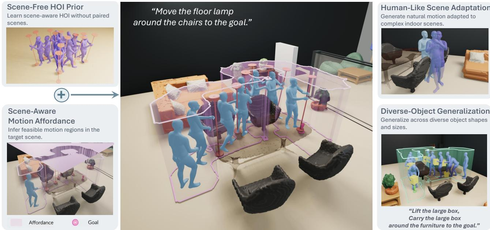
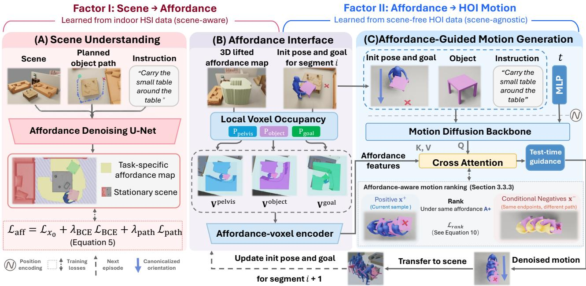
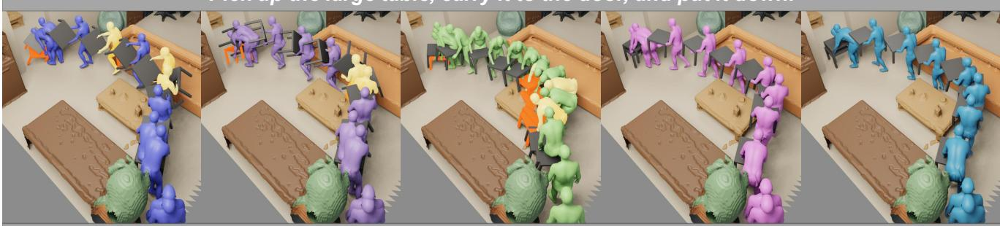
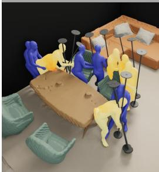
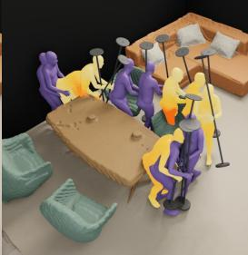
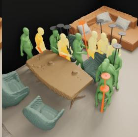
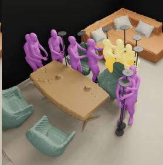
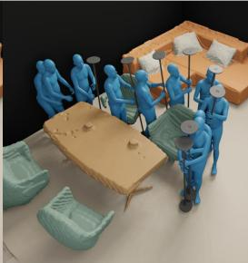

# MAMHOI: Factorizing Scene-Aware Human-Object Interaction through Affordances

Mingyuan Lei Yoonchang Sung Tat-Jen Cham

College of Computing and Data Science Nanyang Technological University, Singapore

## Abstract

Generating realistic human-object interactions (HOI) in complex 3D scenes requires two complementary capabilities: reasoning about interaction feasibility in the environment and synthesizing realistic humanobject motion. However, supervision for these capabilities is rarely available jointly at scale. Human-scene datasets provide rich information about environment-aware motion, while human-object datasets capture detailed interaction dynamics, yet paired human-object-scene data remain scarce. We present MAMHOI, an affordance-mediated factorization for scene-aware human-object interaction generation. MAMHOI factorizes scene-aware HOI generation through an explicit motion-affordance interface between scene understanding and motion synthesis: a scene-conditioned model first predicts where and how an interaction can be feasibly executed, and an affordance-conditioned HOI model then generates the corresponding humanobject motion. This factorization allows scene understanding and interaction dynamics to be learned from complementary sources of supervision without requiring paired human-object-scene data. Experiments in complex indoor environments show that MAMHOI reduces object–scene penetration while better preserving human–object interaction quality, yielding more realistic and physically feasible scene-aware interactions.

Project page: https://leimingyuan.github.io/MAMHOI-project-page/

## 1 Introduction

Generating realistic human-object interactions (HOIs) in complex 3D environments requires more than synthesizing plausible human and object motion. The generated interaction must also adapt to the surrounding scene: the human must approach and manipulate the object without violating scene geometry, while the object must move through feasible regions and reach its intended target. Recent generative motion models have substantially improved the realism, diversity, and controllability of human motion and human-object interaction synthesis [1, 2, 8, 11, 20, 29]. However, many of these models are developed in scene-free or simplified environments and therefore do not directly address how an interaction should adapt to complex scene geometry. Scene-aware HOI generation requires two complementary capabilities. First, the model must reason about interactionfeasibility: where and how an interaction can be executed given the scene layout, object location, and task objective. Second, it must model interaction dynamics: how the human and object should move together while maintaining realistic motion, contact, and manipulation behavior. Although these capabilities must ulti mately operate together, supervision for them is rarely available jointly at scale. Human-scene datasets provide rich examples of environment-aware behavior [12, 13, 22], while human-object datasets capture detailed synchronized interaction dynamics [16, 26]. In contrast, collecting human-object-scene interactions that jointly cover diverse motions, objects, and scene geometries is substantially more difficult.

Existing methods bridge this gap in several ways. Some methods incorporate scene constraints through object waypoints, interaction anchors, or trajectory refinement [16, 28], while others construct synthetic sceneinteraction pairs and directly train scene-conditioned generators [4]. Recent work further shows that humanobject and human-scene data can be combined through hybrid training without requiring fully annotated humanobject-scene interactions [31]. These approaches demonstrate the value of leveraging complementary data sources, but leave a fundamental modeling question open: how should scene-level interaction feasibility and detailed human-object dynamics be connected when their strongest supervision comes from different sources with distribution gap?

  
Figure 1: MAMHOI learns from Scene-Free HOI priors and transfers the ability to complex environments through scene-aware motion affordances. This factorization enables physically plausible interactions across cluttered scenes and diverse objects.

We address this question by explicitly factorizing scene-aware HOI generation through an intermediate motion affordance. Rather than directly learning a single distribution over human motion, object manipu lation, and scene geometry, Motion-Affordance-Mediated Human–Object Interaction (MAMHOI) separates scene understanding from human-object motion synthesis. The scene-understanding component predicts an affordance representation that captures task-relevant regions in which the interaction can be feasibly executed, while the motion generator synthesizes synchronized human-object motion conditioned on this representation. The affordance therefore serves as an explicit interface between the two capabilities: it communicates the scene-dependent constraints needed for interaction without prescribing the final human-object trajectory.

Concretely, MAMHOI predicts motion affordance from scene geometry, object-motion cues, and language instructions, and converts the predicted affordance into local scene occupancy voxel grids around the human, object, and target region. These representations condition a diffusion-based human-object motion generator, allowing detailed interaction dynamics learned from motion-rich HOI data to adapt to complex environments. Planning is used only to provide coarse object-level structural cues rather than to determine the resulting human motion. This factorization allows scene reasoning and interaction synthesis to exploit complementary sources of supervision without requiring densely paired human-object-scene data.

Experiments across interaction-only and scene-aware settings demonstrate the benefit of this formulation. MAMHOI preserves high-quality HOI dynamics while substantially improving scene compatibility, reducing penetrations without compromising object trajectory adherence.

Our main contributions are summarized as follows:

• We introduce MAMHOI, an affordance-mediated factorization of scene-aware HOI generation that separates scene-level interaction feasibility from detailed human-object motion synthesis, allowing the two capabilities to exploit complementary sources of supervision.

• We formulate motion affordance as an explicit interface between scene reasoning and interaction synthesis, conveying task-relevant environmental constraints to the motion generator without restricting generation to a single prescribed trajectory.

• We demonstrate that MAMHOI improves scene feasibility, particularly by reducing object–scene penetration, while preserving high-quality human–object interaction dynamics across complex indoor environments.

## 2 Related Work

## 2.1 Human-Centric Motion Generation

Text-conditioned human motion generation aims to synthesize realistic motion from natural-language descriptions. Early methods use VAE- or GAN-based formulations, while recent diffusion and autoregressive models improve motion quality, diversity, and semantic alignment [1, 2, 6–8, 11, 18, 20, 29, 30]. HOI generation extends this task by modeling human motion jointly with object manipulation, contact, and relative human-object movement [5, 19, 21, 26]. Recent HOI methods incorporate explicit contact constraints, object affordances, relation-aware denoising, object geometry, and trajectory conditions to generate coordinated human-object motion [3, 17, 24, 27]. In parallel, human-scene interaction (HSI) methods condition human motion on static scene geometry represented by point clouds, meshes, voxels, or egocentric features [9, 12, 13, 22]. Afford-Motion [23] further introduces scene affordance as an intermediate representation for language-guided HSI, defining it as a continuous distance field between human joints and 3D scene surfaces. While sharing the idea of affordance-mediated generation, our motion affordance differs in both representation and role: it encodes the feasible spatial support of the joint human–object interaction rather than body–scene proximity, and serves to transfer scene-level feasibility to an HOI generator learned from scene-free human–object motion. Physicsbased simulation and reinforcement learning have also been used to produce physically feasible interactions with static scene elements [10, 25]. HOI methods generally emphasize manipulation in scene-free or simplified environments, whereas HSI methods primarily model human navigation and interaction with static scene elements.

## 2.2 Scene-Aware Human-Object Interaction Generation

Recent methods have begun to address scene-aware human-object interaction generation. CHOIS [16] generates synchronized human-object motion from language, initial states, object geometry, and sparse object waypoints that can be provided by a high-level scene planner. Its scene constraints are therefore conveyed mainly through externally planned waypoints rather than an explicit representation of feasible interaction regions. HOSIG [28] decomposes the task into scene-aware grasp-pose generation, heuristic navigation, and scene-guided motion synthesis. However, both its interaction anchors and controllable motion generator rely on paired humanobject-scene interaction data, and its released setup demonstrates only limited object coverage.

Another line of work addresses the scarcity of paired interaction-scene data through data augmentation. UniHM [4] constructs synthetic scene-motion pairs by placing existing motions into collision-free regions of indoor scenes and trains a unified scene-conditioned generator on the resulting data. Such augmentation primarily encourages the model to identify feasible regions in which a motion can be executed, while its waypoint conditioning does not guarantee exact object trajectory adherence. InfBaGel [31] further combines synthesized human-object-scene interactions with real human-scene interaction data through hybrid training. While this improves scene feasibility, jointly learning from heterogeneous motion distributions introduces a trade-off between scene-level physical feasibility and preserving task-specific human-object interaction priors.

Our method instead avoids constructing or jointly fitting heterogeneous paired human-object-scene data. We represent scene constraints through motion affordance and learn scene feasibility separately from humanobject motion, allowing scene knowledge to guide where interactions are feasible while preserving the interaction distribution learned from dedicated human-object data.

  
Figure 2: Overview of MAMHOI. (A) The scene-understanding module predicts a task-specific affordance from the scene, planned object path, and instruction, where the instruction guides the task-relevant human placement along the object path. (B) The affordance interface lifts the predicted affordance to 3D and queries local occupancy around the pelvis, object, and goal position of current segment, and encodes them into affordance features through a ViT-based Affordance-voxel encoder. (C) The resulting affordance features condition segment-wise HOI generation through cross-attention, with each generated segment initializing the next. Through this design, scene-aware HOI generation is factorized into a scene-to-affordance factor learned from indoor HSI data and an affordance-to-motion factor learned from scene-free HOI data.

## 3 Methodology

## 3.1 Problem Formulation

Given a 3D scene, a language instruction, an initial human–object state, object geometry, and a planned object path, our goal is to generate a synchronized human–object motion sequence x that is consistent with both the task and the surrounding scene. Let $c _ { \mathrm { t a s k } }$ and $c _ { \mathrm { s c e n e } }$ denote the task and scene conditions, respectively. The general objective is

$$
p ( \mathbf { x } \mid c _ { \mathrm { t a s k } } , c _ { \mathrm { s c e n e } } ) .\tag{1}
$$

We factorize this distribution through a sequence-level motion affordance A that summarizes the scenedependent spatial constraints relevant to the interaction. We assume that, once this affordance is given, the detailed scene condition becomes approximately redundant for human–object motion synthesis. Under the conditional-independence assumptions detailed in Appendix A,

$$
p ( \mathbf { x } \mid c _ { \mathrm { t a s k } } , c _ { \mathrm { s c e n e } } ) \approx \int p ( \mathbf { x } \mid \mathbf { A } , c _ { \mathrm { t a s k } } ) p ( \mathbf { A } \mid c _ { \mathrm { t a s k } } ^ { \prime } , c _ { \mathrm { s c e n e } } ) d \mathbf { A } .\tag{2}
$$

Here, $c _ { \mathrm { t a s k } } ^ { \prime }$ retains only the information required for affordance prediction. In our implementation, $c _ { \mathrm { t a s k } } ^ { \prime } =$ (P, Text), where P denotes the planner-provided object path, while $c _ { \mathrm { t a s k } }$ additionally contains object geometry and initial human–object states. This factorization separates the supervision required for scene reasoning from that required for detailed interaction synthesis, making it possible to learn them independently from HSI and HOI data. The predicted affordance then serves as the interface through which scene-dependent constraints are transferred to the motion generator.

## 3.2 Data Representation

We represent each interaction segment using human motion H, object motion O, object geometry G, sparse motion conditions $\mathbf { C } _ { \mathrm { m o t i o n } }$ , and a scene-aware affordance condition a. For $N _ { J }$ human joints, human motion is represented by 3D joint positions and continuous 6D joint rotations, while object motion consists of its centroid and rotation. We denote the complete human–object motion sequence as $\mathbf { x } _ { 0 } = [ \mathbf { H } , \mathbf { O } ]$ . Both human and object motion are transformed into the same canonical human-local coordinate frame to remove global orientation ambiguity and align the motion with the scene representation. Following CHOIS [16], object geometry is encoded using a Basis Point Set (BPS) descriptor $\bar { \mathbf { G } } \in \mathbb { R } ^ { 1 0 2 4 \times 3 }$ . The masked condition $\mathbf { C } _ { \mathrm { m o t i o n } }$ contains the initial human–object state, sparse object waypoints, and the object goal state.

We distinguish between the sequence-level 2D affordance map A predicted by the scene understanding model and the local 3D affordance condition a consumed by the motion generator. Specifically, a consists of three local occupancy voxel grids, Vpelvis, Vobj, Vgoal $\in \ \{ 0 , 1 \} ^ { 3 2 \times 3 2 \times 3 2 }$ , centered at the human pelvis, current object position, and object goal, respectively. These voxels capture local spatial constraints relevant to the given state, task and goal, and share the same canonical orientation as the motion representation. We concatenate them along the channel dimension as

$$
\mathbf { a } = \mathbf { V } ^ { \mathrm { p e l v i s } } \oplus \mathbf { V } ^ { \mathrm { o b j } } \oplus \mathbf { V } ^ { \mathrm { g o a l } } \in \{ 0 , 1 \} ^ { 3 \times 3 2 \times 3 2 \times 3 2 } ,\tag{3}
$$

where ⊕ denotes channel-wise concatenation. The text instruction, object geometry, and affordance condition are encoded as $\mathbf { e } _ { \mathrm { t e x t } } , \mathbf { e } _ { \mathrm { g e o } } ,$ and $\mathbf { e } _ { \mathrm { a f f } }$ using CLIP, an MLP, and a ViT-based Affordance-voxel encoder, respectively, and jointly condition the model.

## 3.3 Motion-Affordance-Mediated Human–Object Interaction Framework

## 3.3.1 Scene Understanding Model

We define a motion affordance as the spatial support within which a human–object interaction can feasibly evolve. It is represented as a sequence-level binary 2D region covering the interaction space of both the human and the manipulated object. Given a 2D scene depth map, a planner-provided object path, and a language instruction, the Scene Understanding Model predicts this affordance for the target interaction:

$$
\hat { \mathbf { A } } = g _ { \psi } ( \mathbf { S } _ { \mathrm { d e p t h } } , \mathbf { P } , \mathbf { e } _ { \mathrm { t e x t } } ) ,\tag{4}
$$

where $\mathbf { S } _ { \mathrm { d e p t h } }$ denotes the 2D scene depth map, P denotes the planner-provided object path, and $\mathbf { e } _ { \mathrm { t e x t } }$ is the CLIP text embedding.

The model first encodes the scene depth map using a residual 2D U-Net, while a path encoder transforms P into a sequence of positional features and CLIP encodes the language instruction. At the U-Net bottleneck, the spatial scene features serve as queries in a multi-head cross-attention layer, while the path and text features provide keys and values. The conditioned spatial features are then decoded into a 2D affordance probability map, which is thresholded at τ to obtain the binary affordance mask $\hat { A } .$ . This allows the model to identify task-relevant regions by jointly reasoning about scene geometry, object-level navigation intent, and language semantics.

During training, the scene understanding model is supervised using ground-truth motion affordances constructed from the corresponding scene-aware motion trajectories. We optimize

$$
\mathcal { L } _ { \mathrm { a f f } } = \mathcal { L } _ { x _ { 0 } } + \lambda _ { \mathrm { B C E } } \mathcal { L } _ { \mathrm { B C E } } + \lambda _ { \mathrm { p a t h } } \mathcal { L } _ { \mathrm { p a t h } } ,\tag{5}
$$

where the auxiliary terms emphasize affordance prediction around the planner path and explicitly encourage path coverage, respectively. Detailed definitions and loss weights are provided in Appendix B.1.1.

We first lift the predicted 2D affordance into the scene coordinate system using the scene geometry, obtaining a 3D affordance representation $\begin{array} { r l } {  { \bigl \mathcal { V } ( \hat { \mathbf { A } } , \mathbf { S } _ { \mathrm { d e p t h } } ) } } \end{array}$ . For each autoregressive segment, we then query this representation around three interaction-centric reference points:

$$
\mathbf { V } ^ { k } = \operatorname { Q u e r y } \left( \mathcal { V } ( \hat { \mathbf { A } } , \mathbf { S } _ { \mathrm { d e p t h } } ) , \mathbf { c } ^ { k } \right) , \qquad k \in \{ \mathrm { p e l v i s , o b j , g o a l } \} .\tag{6}
$$

Each queried volume has size $3 2 \times 3 2 \times 3 2$ . The three local affordance voxels are concatenated to form a and passed to the motion diffusion backbone.

## 3.3.2 Affordance-Conditioned Motion Diffusion Backbone

During training on scene-free HOI data, we construct the affordance condition from the observed human–object motion as discussed in 4.1. At inference, the condition is supplied by the scene-understanding model. Following CHOIS [16] and the conditional denoising formulation used in InfBaGel [31], we adopt a similar backbone for synchronized human–object motion synthesis. Our main architectural difference lies in how scene information is incorporated: the predicted local affordance voxels are encoded by a ViT-based scene encoder and injected into the motion backbone through multi-head cross-attention. This allows scene information to condition the motion generator through the learned affordance representation rather than being directly coupled to the human– object motion representation.

For each autoregressive segment, let $\mathbf { x } _ { 0 } \in \mathbb { R } ^ { T \times D _ { x } }$ denote the clean T-frame human–object motion segment and ${ \bf x } _ { n }$ its noisy version at diffusion step n. Following the clean-sample prediction strategy, the denoising network predicts $\hat { \mathbf { x } } _ { 0 }$ from the noisy motion and multimodal conditions:

$$
\begin{array} { r } { \hat { \mathbf { x } } _ { 0 } = f _ { \theta } ( \mathbf { x } _ { n } , n , \mathbf { C } _ { \mathrm { m o t i o n } } , \mathbf { e } _ { \mathrm { t e x t } } , \mathbf { e } _ { \mathrm { a f f } } , \mathbf { e } _ { \mathrm { g e o } } ) . } \end{array}\tag{7}
$$

Here, $\mathbf { C } _ { \mathrm { m o t i o n } }$ denotes the masked sparse motion conditions defined above, while ${ \bf e } _ { \mathrm { t e x t } } , { \bf e } _ { \mathrm { a f f } }$ , and $\mathbf { e } _ { \mathrm { g e o } }$ denote the text, affordance, and object-geometry features, respectively.

The local affordance voxels are encoded by a ViT-based scene encoder:

$$
\mathbf { e } _ { \mathrm { a f f } } = E _ { \mathrm { V i T } } ( \mathbf { a } ) .\tag{8}
$$

The resulting affordance features are used as keys and values in a multi-head cross-attention layer, while intermediate motion features from the diffusion backbone serve as queries. This enables the denoising model to adapt human–object motion to the local spatial constraints captured by the predicted affordance.

Motion is generated autoregressively over segments. After generating each segment, the updated human pelvis and object positions define the reference locations for the next segment, while the corresponding goal condition determines the goal-centered query. The three local affordance voxels are therefore re-queried from the sequence-level affordance for each segment, allowing the motion generator to adapt its local scene condition as the interaction progresses.

Affordance-aware motion ranking. We use a positive SDF loss as an absolute feasibility anchor. Specifically, the 2D affordance mask A is converted into a truncated signed distance field $\Phi _ { \mathbf { A } } = \mathrm { S D F } ( \mathbf { A } )$ , which is normalized to [−1, 1] and positive inside the valid affordance region. The anchor penalizes generated human joints that fall outside or too close to the valid region:

$$
\mathcal { L } _ { \mathrm { s d f } } ( \mathbf { x } , \mathbf { A } ) = \frac { 1 } { T N _ { J } } \sum _ { t = 1 } ^ { T } \sum _ { j = 1 } ^ { N _ { J } } \big [ \delta - \Phi _ { \mathbf { A } } \left( \pi ( \mathbf { J } _ { t , j } ( \mathbf { x } ) ) \right) \big ] _ { + } ,\tag{9}
$$

where $\pi ( \cdot )$ projects a 3D joint position onto the 2D coordinate system of the affordance map, $\Phi _ { \mathbf { A } }$ is positive inside the valid affordance region and negative outside, $\delta \geq 0$ denotes a safety margin from the affordance boundary, and $[ \cdot ] _ { + } = \operatorname* { m a x } ( \cdot , 0 )$ . The positive anchor is therefore $\mathcal { L } _ { \mathrm { s d f } } ( \hat { \mathbf { x } } _ { 0 } , \mathbf { A } )$ . However, this positive-only objective provides limited scene-aware gradients once most generated motions lie within feasible regions. We therefore complement it with a hard-negative ranking objective that distinguishes alternative motion modes.

Waypoints constrain where an interaction should proceed but do not uniquely determine how the human and object should move. Even under similar start and goal configurations, multiple plausible interaction modes may exist within a local endpoint-conditioned motion manifold. We construct positive-negative motion pairs $( \mathbf { x } ^ { + } , \mathbf { x } ^ { - } )$ with similar relative start and goal configurations but substantially different intermediate trajectories. Both are evaluated against $\Phi _ { \mathbf { A } ^ { + } } = \mathrm { S D F } ( \mathbf { A } ^ { + } )$ , the SDF derived from the positive ground-truth affordance ${ \mathbf { A } } ^ { + }$ We require the affordance-compatible positive motion to have a lower SDF penalty than the alternative mode by at least a margin m:

$$
\mathcal { L } _ { \mathrm { r a n k } } = \left[ m + \mathcal { L } _ { \mathrm { s d f } } ( \mathbf { x } ^ { + } , \mathbf { A } ^ { + } ) - \mathcal { L } _ { \mathrm { s d f } } ( \mathbf { x } ^ { - } , \mathbf { A } ^ { + } ) \right] _ { + } .\tag{10}
$$

Unlike positive-only SDF supervision, this objective remains active whenever the two modes are insufficiently separated, providing denser relative supervision. We define the scene-aware objective as

$$
\mathcal { L } _ { \mathrm { s c e n e } } = \lambda _ { \mathrm { s d f } } \mathcal { L } _ { \mathrm { s d f } } ( \hat { \mathbf { x } } _ { 0 } , \mathbf { A } ) + \lambda _ { \mathrm { r a n k } } \mathcal { L } _ { \mathrm { r a n k } } .\tag{11}
$$

Motion reconstruction and auxiliary objectives. In addition to the scene-aware objective, we train the motion diffusion backbone with clean-motion and semantic-contact reconstruction losses, together with forwardkinematics consistency for the human end effectors and manipulated object. The complete training objective is

$$
\mathcal { L } _ { \mathrm { t o t a l } } = \lambda _ { \mathrm { d i f f } } \mathcal { L } _ { \mathrm { d i f f } } + \lambda _ { \mathrm { f k } } \mathcal { L } _ { \mathrm { f k } } + \mathcal { L } _ { \mathrm { s c e n e } } .\tag{12}
$$

We additionally apply weak classifier-free guidance following InfBaGel [31] to strengthen scene conditioning while limiting deviation from the learned human–object motion distribution. Detailed definitions of the auxiliary objectives are provided in the Appendix.

Test-time guidance. Following CHOIS [16], we retain hand–object contact and feet–floor guidance during diffusion sampling. To separate learned scene adaptation from post-hoc geometric correction, we additionally evaluate a simple scene-SDF guidance that can be applied to diffusion-based motion generators without retraining:

$$
\mathcal { G } _ { \mathrm { s d f } } = \frac { 1 } { T | \mathcal { T } | } \sum _ { t = 1 } ^ { T } \sum _ { j \in \mathcal { I } } \big [ d _ { \mathrm { s c e n e } } ( \mathbf { J } _ { t , j } ) \big ] _ { + } ,\tag{13}
$$

where $\mathcal { I }$ denotes the selected joints, $d _ { \mathrm { s c e n e } } ( \cdot )$ is positive inside occupied regions, and $[ \cdot ] _ { + } = \operatorname* { m a x } ( \cdot , 0 )$ . The guidance directly penalizes scene penetration during sampling using a small set of proxy body joints. We treat this guidance only as an optional test-time refinement, rather than as part of the proposed MAMHOI factorization. The complete test-time guidance formulation is provided in the Appendix.

## 4 Experiment

## 4.1 Evaluation Settings

Datasets. We train the two components of MAMHOI on complementary datasets: the scene understanding model is trained on LINGO [12], while the human–object motion backbone is trained on OMOMO [15]. Affordance supervision for both components is constructed using relaxed axis-aligned bounding-box (AABB) regions around the corresponding motion trajectories, providing a common spatial representation across the two data sources.

For interaction-only evaluation, we use the OMOMO validation split, which contains 534 paired human– object motion sequences of 120 frames, covering 12 movable objects and 2 unseen subjects. With scene absent, this setting evaluates intrinsic interaction quality, including motion distribution, text–motion alignment, and diversity against paired ground truth.

For scene-aware evaluation, we construct a physical test set from static scenes in the LINGO test split, where paired ground-truth human–object motion is unavailable. We manually specify feasible start–goal con figurations and use $\mathbf { A } ^ { * }$ planning to generate 164 unique object paths from 20 test scenes. Evaluating five movable objects per path yields about 820 trials, which are used to assess physical feasibility such as contact and penetrations.

Baselines. We compare against CHOIS [16], and InfBaGel [31]. To ensure a consistent evaluation setting, all methods are initialized from the same standing human pose. Due to the significantly different temporal horizon of the original CHOIS model, which is trained with 120-frame motion windows, we retrain CHOIS using 30-frame windows to match our setting. We retain the native trajectory-conditioning interface of each method during evaluation.

## 4.2 Evaluation Metrics

Interaction-Only Metrics. For the OMOMO validation setting, we follow standard Text-to-HOI evaluation protocols. We report Frechet Inception Distance (FID) to measure the distributional similarity between gener-´ ated and ground-truth motions, R-precision to evaluate text-motion alignment, Multimodal Distance (MMD) to measure the distance between generated motion and text features, and Diversity to evaluate motion variation.

Scene-Aware Physical Metrics. Following InfBaGel [31], we organize the physical metrics into three categories: Human–Scene, Object–Scene, and Human–Object. For all three categories, we report $\bar { D } _ { \mathrm { v t x } }$ and $\bar { D } _ { \mathrm { f r m } }$ as penetration-depth metrics. For Human–Scene penetration, we additionally report $R _ { \mathrm { f r m } }$ , the percentage of frames in which penetration occurs. For Human–Scene evaluation, we report $J _ { \mathrm { H } } ^ { \mathrm { s e q } }$ to measure human-motion jerk over the sequence. For Object–Scene evaluation, $D _ { \mathrm { p a t h } } ^ { \mathrm { o b j } }$ measures the average distance between the generated object trajectory and the planned object path. For Human–Object evaluation, $R _ { \mathrm { c o n } }$ denotes the percentage of frames with active human–object contact. Lower values indicate better performance for all metrics except $R _ { \mathrm { c o n } }$

## 4.3 Results on OMOMO Validation

Table 1 reports interaction-only results on the OMOMO validation split. All methods are evaluated without any scene-specific guidance, while retaining their standard interaction-level guidance or trajectory constraints. For our method, the affordance condition is constructed under an empty-scene assumption. InfBaGel is evaluated with its native pelvis-trajectory constraint, which provides an explicit global motion constraint in this scenefree setting. Therefore, these results primarily evaluate interaction and motion generation quality rather than scene-aware physical plausibility.

Compared with CHOIS, our full model improves FID, R-precision, MMD, and diversity, while InfBaGel also achieves strong retrieval performance and the highest diversity under its pelvis-constrained setting. Interestingly, removing $\mathcal { L } _ { \mathrm { r a n k } }$ further improves several scene-free metrics, most notably FID and MMD. This reflects the intended role of $\mathcal { L } _ { \mathrm { r a n k } }$ as a scene-conditioning regularizer rather than a pure motion-fidelity objective: it discourages the generator from ignoring the scene-derived affordance condition, which can introduce a tradeoff with unconstrained motion fidelity when no scene information is present. Accordingly, its benefit is not fully captured by the scene-free OMOMO evaluation. As shown by the scene-aware ablations in the Appendix, this regularization improves scene-condition sensitivity and reduces scene penetration.

Table 1: Interaction-only evaluation on the OMOMO validation split. All methods retain their standard nonscene guidance or trajectory constraints and no scene-specific guidance is applied. InfBaGel is evaluated with its native pelvis-trajectory constraint. Best results are shown in bold and second-best results are underlined.
<table><tr><td rowspan="2">Method</td><td rowspan="2">FID↓</td><td colspan="3">R-precision↑</td><td rowspan="2">MMD↓</td><td rowspan="2">Diversity↑</td></tr><tr><td>top-1</td><td>top-2</td><td> $\mathrm { t o p } { - 3 }$ </td></tr><tr><td>CHOIS [16]</td><td>2.7892</td><td>0.7428</td><td>0.8678</td><td>0.9062</td><td>3.9086</td><td>8.3841</td></tr><tr><td>InfBaGel [31]</td><td>2.2451</td><td>0.8149</td><td>0.9159</td><td>0.9423</td><td>3.4893</td><td>9.2597</td></tr><tr><td>Ours</td><td>1.8361</td><td>0.7764</td><td>0.9279</td><td>0.9543</td><td>3.2798</td><td>8.6923</td></tr><tr><td> $\mathrm { O u r s - \mathcal { L } _ { r a n k } }$ </td><td>0.9403</td><td>0.8173</td><td>0.8750</td><td>0.9375</td><td>3.1553</td><td>8.7915</td></tr></table>

Table 2: Comparison of methods on the constructed scene-aware test set. We evaluate human–scene penetration, object–scene penetration, object trajectory adherence, motion smoothness, and human–object interaction quality. $\mathcal { G } _ { \mathrm { s d f } }$ denotes the same generic test-time scene-SDF guidance applied to CHOIS and MAMHOI. Inf-BaGel is evaluated with its native Bump-aware Guidance. Best results are shown in bold and second-best results are underlined.
<table><tr><td rowspan="3">Method</td><td colspan="4">Human-Scene</td><td colspan="4">Object-Scene</td><td colspan="3">Human-Object</td></tr><tr><td> $\bar { D } ^ { \mathrm { v t x } } \downarrow$ </td><td> $\bar { D } ^ { \mathrm { f r m } } \downarrow$ </td><td> $R ^ { \mathrm { f r m } }$ </td><td>↓  $J _ { \mathrm { H } } ^ { \mathrm { s e q } } \downarrow$ </td><td> $\bar { D } ^ { \mathrm { v t x } }$ </td><td>→</td><td> $\bar { D } ^ { \mathrm { f r m } } \downarrow$ </td><td> $D _ { \mathrm { p a t h } } ^ { \mathrm { o b j } } \downarrow$ </td><td> $R _ { \mathrm { c o n } }$  ←</td><td> $\bar { D } ^ { \mathrm { v t x } } \downarrow$ </td><td> $\bar { D } ^ { \mathrm { f r m } } \downarrow$ </td></tr><tr><td></td><td> $\times 1 0 ^ { - 3 } \times 1 0 ^ { - 3 }$ </td><td></td><td> $\%$ </td><td></td><td> $\times 1 0 ^ { - 3 }$ </td><td> $\times 1 0 ^ { - 3 }$ </td><td></td><td> $\%$ </td><td> $\times 1 0 ^ { - 3 }$ </td><td> $\times 1 0 ^ { - 3 }$ </td></tr><tr><td>CHOIS</td><td>47.337</td><td>36.232</td><td>29.645</td><td>7808.0</td><td>0.545</td><td></td><td>2.267</td><td>0.1532</td><td>90.97</td><td>1.353</td><td>2.366</td></tr><tr><td> $\mathrm { C H O I S } + \mathcal { G } _ { \mathrm { s d f } }$ </td><td>32.936</td><td>24.925</td><td>18.437</td><td>7906.9</td><td>0.487</td><td></td><td>2.041</td><td>0.1537</td><td>90.44</td><td>1.435</td><td>2.458</td></tr><tr><td>InfBaGel</td><td>36.478</td><td>26.315</td><td>31.848</td><td>5258.7</td><td>3.136</td><td></td><td>7.281</td><td></td><td>92.39</td><td>1.507</td><td>2.424</td></tr><tr><td>Ours</td><td>28.587</td><td>22.009</td><td>14.990</td><td>4429.3</td><td>0.403</td><td></td><td>1.440</td><td>0.1492</td><td>94.87</td><td>1.416</td><td>2.200</td></tr><tr><td> $\mathrm { O u r s } + \mathcal { G } _ { \mathrm { s d f } }$ </td><td>25.884</td><td>19.889</td><td>13.745</td><td>4276.1</td><td>0.398</td><td></td><td>1.498</td><td>0.1507</td><td>95.69</td><td>1.431</td><td>2.243</td></tr></table>

## 4.4 Results on Scene-Aware Test Set

Table 2 and Figure 3 summarize the quantitative and qualitative comparisons on the constructed LINGO-scene test set. Even without test-time scene-SDF refinement, MAMHOI achieves lower human–scene and object– scene penetration than CHOIS and InfBaGel, while also improving object-path adherence and human–object contact. Notably, the unguided MAMHOI model remains better than $\mathrm { C H O I S } + \mathcal { G } _ { \mathrm { s d f } }$ on all reported human– scene and object–scene measures, motion jerk, object-path error, and contact. Qualitatively, its generated interactions more consistently follow feasible regions in cluttered scenes while maintaining coordinated human– object motion. These results indicate that the scene compatibility of MAMHOI is primarily captured by the learned affordance-conditioned motion distribution rather than imposed through test-time geometric correction.

Applying the same $\mathcal { G } _ { \mathrm { s d f } }$ refinement to CHOIS and MAMHOI further reduces human–scene penetration for both models, demonstrating that direct geometric correction provides a complementary collision-reduction mechanism independent of the learned generator. For MAMHOI, this refinement yields the lowest overall human–scene penetration while introducing small trade-offs in frame-averaged object–scene penetration and object-path adherence. We do not additionally apply $\mathcal { G } _ { \mathrm { s d f } }$ to InfBaGel, as its native inference procedure already incorporates Bump-aware Guidance, which explicitly detects scene collisions and iteratively pushes human and object motion away from occupied regions. We therefore retain InfBaGel’s native guidance configuration rather than stacking an additional scene-collision objective. Overall, the comparison separates two complementary effects: $\mathcal { G } _ { \mathrm { s d f } }$ directly suppresses penetration during sampling, whereas MAMHOI learns a scene-adaptive interaction distribution through affordance conditioning.

  
“Lift the floor lamp, walk through the chairs, and put it down.”

  
(a) CHOIS

  
(b) CHOIS + Gsdf

  
(c) InfBaGel

  
(d) Ours

  
(e) Ours + Gsdf  
Figure 3: Qualitative comparison on the constructed scene-aware test set. $\mathcal { G } _ { \mathrm { s d f } }$ denotes the generic test-time scene-SDF refinement applied to CHOIS and MAMHOI, while InfBaGel is evaluated with its native Bump aware Guidance. Penetration regions are highlighted from yellow to red.

User Study. We conduct a perceptual study on the scene-aware test set following the two-alternative forcedchoice (2AFC) protocol of ZeroHSI [14]. The study contains 136 left–right comparison pairs, where participants select the more realistic motion generated for the same input. We collect 884 valid votes across 52 responses and detailed results are reported in Table 6. Participants consistently prefer MAMHOI over CHOIS: Ours is preferred over CHOIS and $\mathrm { C H O I S } { + } \mathcal { G } _ { \mathrm { s d f } }$ in 86.7% and 92.3% of votes, respectively, while $\mathrm { O u r s } { + } \mathcal { G } _ { \mathrm { s d f } }$ is preferred in 81.1% and 84.3%. These results provide perceptual evidence that the advantage of MAMHOI extends beyond geometric penetration metrics. Interestingly, $\mathcal { G } _ { \mathrm { s d f } }$ does not improve human preference, despite reducing penetration quantitatively, suggesting that post-hoc geometric correction does not necessarily improve perceived motion naturalness.

## 5 Conclusion

We presented MAMHOI, an affordance-mediated factorization for scene-aware human-object interaction generation that separates scene-level interaction feasibility from detailed human-object motion synthesis. By using motion affordance as an explicit interface between scene reasoning and motion generation, MAMHOI allows these complementary capabilities to be learned from different sources of supervision without requiring paired human-object-scene data. Experiments in complex indoor environments show that this formulation improves scene feasibility, particularly by reducing object–scene penetration, while preserving high-qualit human–object interaction dynamics, enabling more realistic and physically feasible scene-aware interactions.

## References

[1] Xin Chen, Biao Jiang, Wen Liu, Zilong Huang, Bin Fu, Tao Chen, Jingyi Yu, and Gang Yu. Executing your commands via motion diffusion in latent space. In Proceedings of the IEEE/CVF Conference on Computer Vision and Pattern Recognition, 2023.

[2] Rishabh Dabral, Muhammad Hamza Mughal, Vladislav Golyanik, and Christian Theobalt. MoFusion: A framework for denoising-diffusion-based motion synthesis. In Proceedings ofthe IEEE/CVF Conference on Computer Vision and Pattern Recognition, 2023.

[3] Christian Diller and Angela Dai. CG-HOI: Contact-guided 3d human-object interaction generation. In Proceedings ofthe IEEE/CVF Conference on Computer Vision and Pattern Recognition, 2024.

[4] Zichen Geng, Zeeshan Hayder, Wei Liu, and Ajmal Mian. UniHM: Universal human motion generation with object interactions in indoor scenes, 2025.

[5] Anindita Ghosh, Rishabh Dabral, Vladislav Golyanik, Christian Theobalt, and Philipp Slusallek. IMoS: Intent-driven full-body motion synthesis for human-object interactions. Computer Graphics Forum, 2023.

[6] Chuan Guo, Xinxin Zuo, Sen Wang, Shihao Zou, Qingyao Sun, Annan Deng, Minglun Gong, and Li Cheng. Action2motion: Conditioned generation of 3d human motions. In Proceedings of the 28th ACM International Conference on Multimedia, 2020.

[7] Chuan Guo, Shihao Zou, Xinxin Zuo, Sen Wang, Wei Ji, Xingyu Li, and Li Cheng. Generating diverse and natural 3d human motions from text. In Proceedings of the IEEE/CVF Conference on Computer Vision and Pattern Recognition (CVPR), pages 5152–5161, June 2022.

[8] Chuan Guo, Yuxuan Mu, Muhammad Gohar Javed, Sen Wang, and Li Cheng. MoMask: Generative masked modeling of 3d human motions. In Proceedings of the IEEE/CVF Conference on Computer Vision and Pattern Recognition, 2024.

[9] Mohamed Hassan, Vasileios Choutas, Dimitrios Tzionas, and Michael J. Black. Resolving 3d human pose ambiguities with 3d scene constraints. In Proceedings ofthe IEEE/CVF International Conference on Computer Vision, 2019.

[10] Siyuan Huang, Zan Wang, Puhao Li, Baoxiong Jia, Tengyu Liu, Yixin Zhu, Wei Liang, and Song-Chun Zhu. Diffusion-based generation, optimization, and planning in 3d scenes. In Proceedings of the IEEE/CVF Conference on Computer Vision and Pattern Recognition, 2023.

[11] Biao Jiang, Xin Chen, Wen Liu, Jingyi Yu, Gang Yu, and Tao Chen. MotionGPT: Human motion as a foreign language. In Advances in Neural Information Processing Systems, 2023.

[12] Nan Jiang, Zimo He, Zi Wang, Hongjie Li, Yixin Chen, Siyuan Huang, and Yixin Zhu. Autonomous character-scene interaction synthesis from text instruction. In ACM SIGGRAPH Asia Conference Papers, 2024.

[13] Nan Jiang, Zhiyuan Zhang, Hongjie Li, Xiaoxuan Ma, Zan Wang, Yixin Chen, Tengyu Liu, Yixin Zhu, and Siyuan Huang. Scaling up dynamic human-scene interaction modeling. In Proceedings of the IEEE/CVF Conference on Computer Vision and Pattern Recognition, 2024.

[14] Hongjie Li, Hong-Xing Yu, Jiaman Li, and Jiajun Wu. Zerohsi: Zero-shot 4d human-scene interaction by video generation. In International Conference on 3D Vision (3DV), 2026.

[15] Jiaman Li, Jiajun Wu, and C. Karen Liu. Object motion guided human motion synthesis. ACM Transactions on Graphics, 42(6):1–11, 2023. doi: 10.1145/3618333.

[16] Jiaman Li, Alexander Clegg, Roozbeh Mottaghi, Jiajun Wu, Xavier Puig, and C. Karen Liu. Controllable human-object interaction synthesis. In European Conference on Computer Vision, 2024.

[17] Xiaogang Peng, Yiming Xie, Zizhao Wu, Varun Jampani, Deqing Sun, and Huaizu Jiang. Hoi-diff: Textdriven synthesis of 3d human-object interactions using diffusion models. In Proceedings ofthe IEEE/CVF Conference on Computer Vision and Pattern Recognition (CVPR) Workshops, pages 2903–2913, June 2025.

[18] Mathis Petrovich, Michael J. Black, and Gul Varol. TEMOS: Generating diverse human motions from¨ textual descriptions. In European Conference on Computer Vision (ECCV), 2022.

[19] Omid Taheri, Vasileios Choutas, Michael J. Black, and Dimitrios Tzionas. GOAL: Generating 4d wholebody motion for hand-object grasping. In Proceedings ofthe IEEE/CVF Conference on Computer Vision and Pattern Recognition, 2022.

[20] Guy Tevet, Sigal Raab, Brian Gordon, Yonatan Shafir, Daniel Cohen-Or, and Amit H. Bermano. Human motion diffusion model. In International Conference on Learning Representations, 2023.

[21] Yinhuai Wang, Jing Lin, Ailing Zeng, Zhengyi Luo, Jian Zhang, and Lei Zhang. PhysHOI: Physics-based imitation of dynamic human-object interaction, 2023.

[22] Zan Wang, Yixin Chen, Tengyu Liu, Yixin Zhu, Wei Liang, and Siyuan Huang. HUMANISE: Languageconditioned human motion generation in 3d scenes. In Advances in Neural Information Processing Systems, 2022.

[23] Zan Wang, Yixin Chen, Baoxiong Jia, Puhao Li, Jinlu Zhang, Jingze Zhang, Tengyu Liu, Yixin Zhu, Wei Liang, and Siyuan Huang. Move as you say, interact as you can: Language-guided human motion generation with scene affordance. In Proceedings ofthe IEEE/CVF Conference on Computer Vision and Pattern Recognition, pages 433–444, 2024.

[24] Qianyang Wu, Ye Shi, Xiaoshui Huang, Jingyi Yu, Lan Xu, and Jingya Wang. THOR: Text to humanobject interaction diffusion via relation intervention, 2024.

[25] Zeqi Xiao, Tai Wang, Jingbo Wang, Jinkun Cao, Wenwei Zhang, Bo Dai, Dahua Lin, and Jiangmiao Pang. Unified human-scene interaction via prompted chain-of-contacts. In International Conference on Learning Representations, 2024.

[26] Sirui Xu, Zhengyuan Li, Yu-Xiong Wang, and Liang-Yan Gui. InterDiff: Generating 3d human-object interactions with physics-informed diffusion. In Proceedings of the IEEE/CVF International Conference on Computer Vision, 2023.

[27] Sirui Xu, Ziyin Wang, Yu-Xiong Wang, and Liang-Yan Gui. Interdreamer: Zero-shot text to 3d dynamic human-object interaction. In A. Globerson, L. Mackey, D. Belgrave, A. Fan, U. Paquet, J. Tomczak, and C. Zhang, editors, Advances in Neural Information Processing Systems, volume 37, pages 52858–52890. Curran Associates, Inc., 2024. doi: 10.52202/ 079017-1675. URL https://proceedings.neurips.cc/paper\_files/paper/2024/ file/5eca2e4fe7858cbbfef4e08573cfcb25-Paper-Conference.pdf.

[28] Wei Yao, Yunlian Sun, Hongwen Zhang, Yebin Liu, and Jinhui Tang. Hosig: Full-body human-objectscene interaction generation with hierarchical scene perception. In Proceedings of the AAAI Conference on Artificial Intelligence, 2026.

[29] Jianrong Zhang, Yangsong Zhang, Xiaodong Cun, Shaoli Huang, Yong Zhang, Hongwei Zhao, Hongtao Lu, and Xi Shen. T2M-GPT: Generating human motion from textual descriptions with discrete representations. In Proceedings of the IEEE/CVF Conference on Computer Vision and Pattern Recognition, 2023.

[30] Mingyuan Zhang, Zhongang Cai, Liang Pan, Fangzhou Hong, Xinying Guo, Lei Yang, and Ziwei Liu. Motiondiffuse: Text-driven human motion generation with diffusion model. IEEE Transactions on Pattern Analysis and Machine Intelligence, 2024.

[31] Yude Zou, Junji Gong, Xing Gao, Zixuan Li, Tianxing Chen, and Guanjie Zheng. Infbagel: Humanobject-scene interaction generation with dynamic perception and iterative refinement. In The Fourteenth International Conference on Learning Representations, 2026. URL https://openreview.net/ forum?id=TeyHNq4WlI.

## A Derivation of the Factored Generation Objective

We derive the factored objective used in Equation 2. Introducing the intermediate sequence-level affordance variable A and marginalizing over it gives

$$
p ( \mathbf { x } \mid c _ { \mathrm { t a s k } } , c _ { \mathrm { s c e n e } } ) = \int p ( \mathbf { x } \mid \mathbf { A } , c _ { \mathrm { t a s k } } , c _ { \mathrm { s c e n e } } ) p ( \mathbf { A } \mid c _ { \mathrm { t a s k } } , c _ { \mathrm { s c e n e } } ) d \mathbf { A } .\tag{14}
$$

This formulation corresponds to first sampling

$$
\mathbf { A } \sim p ( \mathbf { A } \mid c _ { \mathrm { t a s k } } , c _ { \mathrm { s c e n e } } )\tag{15}
$$

and then generating motion conditioned on the sampled affordance and task specification.

We assume that the affordance summarizes the scene-dependent spatial constraints required for motion generation. Once A is given, the remaining scene condition is therefore approximately redundant:

$$
p ( x \mid \mathbf { A } , c _ { \mathrm { t a s k } } , c _ { \mathrm { s c e n e } } ) \approx p ( x \mid \mathbf { A } , c _ { \mathrm { t a s k } } ) .\tag{16}
$$

We further introduce a coarse task condition $c _ { \mathrm { t a s k } } ^ { \prime }$ containing only the components needed for affordance prediction and assume

$$
p ( \mathbf { A } \mid c _ { \mathrm { t a s k } } , c _ { \mathrm { s c e n e } } ) \approx p ( \mathbf { A } \mid c _ { \mathrm { t a s k } } ^ { \prime } , c _ { \mathrm { s c e n e } } ) .\tag{17}
$$

Substituting these two approximations into the marginalization above yields

$$
p ( x \mid c _ { \mathrm { t a s k } } , c _ { \mathrm { s c e n e } } ) \approx \int p ( x \mid \mathbf { A } , c _ { \mathrm { t a s k } } ) p ( \mathbf { A } \mid c _ { \mathrm { t a s k } } ^ { \prime } , c _ { \mathrm { s c e n e } } ) d \mathbf { A } ,\tag{18}
$$

which is the factored generation objective presented in Equation 2.

## B Additional Method Details

## B.1 Scene Understanding Model

## B.1.1 Affordance Training Objective

Let $\mathbf { A } ^ { * } \in \{ 0 , 1 \} ^ { H \times W }$ denote the ground-truth binary motion affordance. We map it to the diffusion data space as

$$
{ \bf x } _ { 0 } = 2 { \bf A } ^ { * } - 1 ,\tag{19}
$$

and obtain the noisy affordance $\mathbf { x } _ { t }$ using the standard forward diffusion process. Conditioned on the scene depth map, planner-provided path, and text embedding, the denoising network directly predicts the clean affordance $\hat { \mathbf { x } } _ { 0 }$

The primary denoising objective is

$$
\mathcal { L } _ { x _ { 0 } } = \| \hat { \mathbf { x } } _ { 0 } - \mathbf { x } _ { 0 } \| _ { 2 } ^ { 2 } .\tag{20}
$$

Because the task-relevant affordance typically occupies only a small portion of the scene, uniform pixelwise supervision can under-emphasize regions relevant to the planned interaction. We therefore introduce a path-weighted binary cross-entropy loss. Let $d _ { i }$ denote the 2D distance from pixel i to the planner-provided path P, and let $w _ { i }$ be a distance-decaying weight with decay parameter $\tau = 3$ and maximum weight 6. The loss is

$$
\mathcal { L } _ { \mathrm { B C E } } = \frac { 1 } { H W } \sum _ { i = 1 } ^ { H W } w _ { i } \mathrm { B C E W i t h L o g i t s } \left( 2 \hat { x } _ { 0 , i } , A _ { i } ^ { * } \right) .\tag{21}
$$

This weighting places stronger supervision around the full object path while retaining pixel-wise supervision over the complete affordance map.

In addition, we explicitly encourage the planner-provided path to lie inside the predicted affordance. Let

$$
\hat { \mathbf { p } } = \sigma ( 2 \hat { \mathbf { x } } _ { 0 } )\tag{22}
$$

denote the predicted affordance probabilities. For path points $\{ \mathbf { p } _ { j } \} _ { j = 1 } ^ { K }$ , we define

$$
\mathcal { L } _ { \mathrm { p a t h } } = - \frac { 1 } { \sum _ { j = 1 } ^ { K } \omega _ { j } } \sum _ { j = 1 } ^ { K } \omega _ { j } \log \hat { \mathbf { p } } ( \mathbf { p } _ { j } ) ,\tag{23}
$$

where the start and end points receive $\omega _ { j } = 4$ , and the remaining path points use $\omega _ { j } = 1$ . This term directly encourages path coverage, with additional emphasis on the initial and goal regions of the interaction.

The complete training objective is

$$
\mathcal { L } _ { \mathrm { a f f } } = \mathcal { L } _ { x _ { 0 } } + \lambda _ { \mathrm { B C E } } \mathcal { L } _ { \mathrm { B C E } } + \lambda _ { \mathrm { p a t h } } \mathcal { L } _ { \mathrm { p a t h } } ,\tag{24}
$$

where we set $\lambda _ { \mathrm { B C E } } = 0 . 1$ and $\lambda _ { \mathrm { p a t h } } = 0 . 2$ in all experiments.

## B.2 Motion Diffusion Backbone

## B.2.1 Additional Training Objectives and Test-Time Guidance

Motion reconstruction and kinematic consistency. In addition to the scene-aware objective introduced in the main paper, we supervise clean human–object motion reconstruction together with semantic contact prediction:

$$
\mathcal { L } _ { \mathrm { d i f f } } = \left\| \hat { \mathbf { x } } _ { 0 } - \mathbf { x } _ { 0 } \right\| _ { 1 } + \lambda _ { \mathrm { c o n } } \left\| \hat { \mathbf { C } } - \mathbf { C } \right\| _ { 1 } ,\tag{25}
$$

where $\hat { \mathbf { C } }$ and C denote the predicted and ground-truth semantic contact states, respectively.

We further enforce forward-kinematics consistency for both the human end effectors and the manipulated object:

$$
\mathcal { L } _ { \mathrm { f k } } = \left\| \hat { \mathbf { J } } _ { \mathrm { e e } } ^ { \mathrm { F K } } - \mathbf { J } _ { \mathrm { e e } } \right\| _ { 1 } + \lambda _ { \mathrm { o b j } } \left\| \hat { \mathbf { K } } ^ { \mathrm { F K } } - \mathbf { K } \right\| _ { 1 } ,\tag{26}
$$

where $\hat { \mathbf { J } } _ { \mathrm { e e } } ^ { \mathrm { F K } }$ denotes the hand and foot positions reconstructed from the predicted human joint rotations, and $\hat { \mathbf { K } } ^ { \mathrm { F K } }$ denotes object keypoints transformed using the predicted object pose.

The complete training objective is

$$
\mathcal { L } _ { \mathrm { t o t a l } } = \lambda _ { \mathrm { d i f f } } \mathcal { L } _ { \mathrm { d i f f } } + \lambda _ { \mathrm { f k } } \mathcal { L } _ { \mathrm { f k } } + \mathcal { L } _ { \mathrm { s c e n e } } .\tag{27}
$$

We use $\lambda _ { \mathrm { d i f f } } = 1 , \lambda _ { \mathrm { f k } } = 0 . 5 , \lambda _ { \mathrm { c o n } } = 2$ , and $\lambda _ { \mathrm { o b j } } = 1$ . For the scene-aware objective defined in the main paper, we set $\lambda _ { \mathrm { s d f } } = 0 . 2 , \lambda _ { \mathrm { r a n k } } = 0 . 1$ , and use a ranking margin of $m = 0 . 2$

Test-time guidance. Following CHOIS [16], we retain hand–object contact and feet–floor guidance during diffusion sampling. The hand–object guidance encourages contacting hands to remain close to the object surface:

$$
\mathcal { G } _ { \mathrm { c o n } } = \left\| \mathbf { M } _ { l } \odot \left( \mathbf { J } _ { l } ^ { \mathrm { h a n d } } - \mathbf { Q } _ { l } ^ { \mathrm { o b j } } \right) \right\| _ { 1 } + \left\| \mathbf { M } _ { r } \odot \left( \mathbf { J } _ { r } ^ { \mathrm { h a n d } } - \mathbf { Q } _ { r } ^ { \mathrm { o b j } } \right) \right\| _ { 1 } ,\tag{28}
$$

where $\mathbf { M } _ { l }$ and ${ { \bf { M } } _ { r } }$ are the predicted contact masks, $\mathbf { J } _ { l } ^ { \mathrm { h a n d } }$ and $\mathbf { J } _ { r } ^ { \mathrm { h a n d } }$ denote the hand positions, and $\mathbf { Q } _ { l } ^ { \mathrm { { o b j } } }$ and $\mathbf { Q } _ { r } ^ { \mathrm { { o b j } } }$ denote their nearest points on the object surface.

Feet–floor guidance encourages the lower supporting foot to remain close to the floor:

$$
\mathcal { G } _ { \mathrm { f e e t } } = \left. \operatorname* { m i n } \left( ( \mathbf { J } _ { l } ^ { \mathrm { f o o t } } ) _ { z } , ( \mathbf { J } _ { r } ^ { \mathrm { f o o t } } ) _ { z } \right) - h \right. _ { 2 } ,\tag{29}
$$

where $( { \bf J } _ { l } ^ { \mathrm { f o o t } } ) _ { z }$ and $( \mathbf { J } _ { r } ^ { \mathrm { f o o t } } )$ denote the vertical positions of the left and right feet, and h is the target foot height. For optional scene-SDF guidance, the predicted human joints are transformed from the canonical motion frame back to the scene coordinate system. We query the pelvis and foot joints against the signed distance field constructed from the 2D scene occupancy map:

$$
\mathcal { G } _ { \mathrm { s d f } } = \frac { 1 } { T | \mathcal { T } | } \sum _ { t = 1 } ^ { T } \sum _ { j \in \mathcal { I } } \left[ d _ { \mathrm { s c e n e } } \left( \mathbf { J } _ { t , j } \right) \right] _ { + } ,\tag{30}
$$

where $\mathcal { I }$ denotes the selected joints, $d _ { \mathrm { s c e n e } } ( \cdot )$ denotes the scene signed distance with positive values indicating penetration, and $[ \cdot ] _ { + } = \operatorname* { m a x } ( \cdot , 0 )$

The complete test-time guidance objective is

$$
\mathcal { G } = \gamma _ { \mathrm { c o n } } \mathcal { G } _ { \mathrm { c o n } } + \gamma _ { \mathrm { f e e t } } \mathcal { G } _ { \mathrm { f e e t } } + \gamma _ { \mathrm { s d f } } \mathcal { G } _ { \mathrm { s d f } } .\tag{31}
$$

We use $\gamma _ { \mathrm { c o n } } = 2$ and $\gamma _ { \mathrm { f e e t } } = 1$ , and apply these two reconstruction guidance terms only during the final 10 reverse-diffusion steps. For the optional scene-SDF refinement, we use $\gamma _ { \mathrm { s d f } } = 1 . 6$ . Scene-SDF guidance is disabled for the default MAMHOI model and is enabled only for results explicitly denoted by $\mathbf { M A M H O I } { + } \mathcal { G } _ { \mathrm { s d f } }$

## C Implementation Details

## C.1 Data and Preprocessing

Scene-aware data. The scene-understanding component is trained on LINGO [12], which provides human motion in complex indoor environments together with scene geometry and language descriptions. Following the formulation in the main paper, we construct a sequence-level motion affordance from each scene-aware motion sequence using relaxed axis-aligned spatial support covering the observed interaction region. The corresponding scene geometry is represented in the horizontal scene coordinate system, while an object-level path provides coarse navigation structure for affordance prediction. The scene-understanding model therefore learns to predict feasible interaction support from the scene, planned path, and language instruction without requiring paired human–object manipulation data.

Both the scene input and the predicted affordance map are represented at a spatial resolution of $2 5 6 \times 2 5 6$ The ground-truth binary affordance is mapped to the diffusion data space as described in Appendix B.1.1. At inference time, the predicted affordance probability map is thresholded at 0.5 before being passed to the downstream motion generator.

Human–object interaction data. The affordance-conditioned motion generator is trained using the processed OMOMO human–object interaction data [15], following the motion representation of CHOIS [16]. The data contain synchronized human and object motion, text annotations, object geometry, and semantic contact labels. We divide each motion sequence into 30-frame windows with a stride of 15 frames during training. Each window is transformed into a canonical coordinate frame defined by the initial human orientation. Human joint positions and object center-of-mass positions are normalized using statistics computed from the training set.

Object geometry is represented using a Basis Point Set (BPS) descriptor containing 1,024 three-dimensional vectors. For each training window, a reference object configuration is sampled to construct the BPS condition and to express subsequent object rotations relative to the reference orientation. Windows without valid text annotations are excluded when language conditioning is used.

## C.2 Scene Understanding Model

The scene-understanding model predicts the sequence-level binary motion affordance introduced in Sec. 3.3.1 from the scene representation, planner-provided object path, and language instruction. Both the input scene representation and predicted affordance map have a spatial resolution of $2 5 6 \times 2 5 6$

Scene denoising network. We implement the affordance denoising network as a residual 2D U-Net. The encoder contains three downsampling stages with channel dimensions $6 4  1 2 8  2 5 6$ , resulting in an 8× spatial downsampling at the bottleneck. Residual blocks use Group Normalization and SiLU activations. The decoder progressively upsamples the conditioned bottleneck features to the original spatial resolution and predicts the clean affordance map.

Path and language encoding. The planner-provided object path is represented as a sequence of normalized 2D coordinates. Each path point is independently encoded by an MLP with dimensions $2  1 2 8  2 5 6 ,$ followed by Layer Normalization, producing a sequence of 256-dimensional path features. The language instruction is encoded using a frozen CLIP ViT-B/32 text encoder. Its 512-dimensional representation is projected to 256 dimensions using a trainable linear projection.

Cross-modal conditioning. Task information is injected at the U-Net bottleneck through a multi-head crossattention layer. The spatial bottleneck features serve as queries, while the encoded path and language features provide keys and values. The cross-attention operates at a feature dimension of 256 with eight attention heads. The resulting conditioned spatial features are passed to the U-Net decoder to predict the affordance map. This design preserves the dense spatial structure of the scene while allowing the planned path and language instruction to modulate task-relevant regions.

Affordance diffusion and supervision. We use 1,000 diffusion timesteps and sample diffusion timesteps uniformly during training. The denoising network directly predicts the clean affordance $\hat { \mathbf { x } } _ { 0 }$ . The training objective consists of the clean-affordance denoising loss, path-weighted binary cross-entropy loss, and pathcoverage loss defined in Appendix B.1.1. We use $\lambda _ { \mathrm { B C E } } = 0 . 1$ and $\lambda _ { \mathrm { p a t h } } = 0 . 2$ . The distance-decay parameter of the path-weighted BCE is set to 3 with a maximum weight of 6, while the start and goal points in the pathcoverage objective receive a weight of 4. At inference time, the predicted probability map is thresholded at 0.5 to obtain the binary affordance used by the downstream motion generator.

Training details. The scene-understanding model is optimized using Adam with a learning rate of $1 \times 1 0 ^ { - 4 }$ and a batch size of 32. We train the model for 500 epochs on a single NVIDIA A6000 GPU, requiring approximately 15 hours. The U-Net, path encoder, text projection, cross-attention module, and affordance decoder are optimized jointly, while the CLIP text encoder remains frozen. This component is trained independently from the human–object motion generator.

## C.3 Affordance Interface and Motion Generator

Local affordance representation. The predicted sequence-level affordance is lifted into the scene coordinate system and queried locally for each motion window. We extract three $3 2 \times 3 2 \times 3 2$ local volumes centered at the current human pelvis, manipulated object, and object goal, respectively. Each local volume has a horizontal extent of 2.4 m, corresponding to the range [−1.2, 1.2] m relative to its query center and a horizontal voxel resolution of 7.5 cm. All three local volumes share the canonical orientation of the current motion window.

Before feature encoding, each local volume is projected along the vertical axis using minimum pooling, and the resulting horizontal representation is broadcast along height. The three processed volumes are concatenated along the channel dimension and encoded using a ViT-based affordance encoder. The encoder uses 8×8 spatial patches, an embedding dimension of 512, six Transformer blocks, 16 attention heads, a feed-forward dimension of 1,024, and dropout of 0.1.

The resulting 512-dimensional affordance feature conditions the motion network through an eight-head cross-attention adapter. The adapter additionally contains layer normalization, a $5 1 2  2 0 4 8  5 1 2$ feedforward block with GELU activation, and a learned sigmoid gate on the attention residual. A learned nullaffordance embedding is used for condition dropout and classifier-free guidance.

Motion representation. Each frame of the diffusion state contains 220 dimensions. The object state consists of its three-dimensional center-of-mass position and a nine-dimensional relative rotation matrix. Human motion is represented by the three-dimensional positions of 24 joints and continuous 6D rotations for 22 joints. We additionally predict four semantic contact values.

The masked motion condition contains the initial human pose, initial object pose, sparse object-motion conditions, and terminal object position. Object geometry is encoded from the 1024 × 3 BPS descriptor using an MLP with dimensions $3 0 7 2  5 1 2  2 5 6$ . Language is encoded using a frozen CLIP ViT-B/32 text encoder and projected to a 512-dimensional feature.

Motion diffusion backbone. We use a conditional denoising diffusion model that directly predicts the clean human–object motion xˆ0. The noisy motion, masked motion condition, and object-geometry feature form a 696-dimensional frame-wise input, which is projected to a hidden dimension of 512. The temporal backbone contains four Transformer layers with full self-attention and four attention heads per layer. Sinusoidal positional embeddings encode temporal position, and a prepended conditioning token combines the projected text feature with the diffusion-timestep embedding.

The affordance feature is injected after temporal motion encoding through the cross-attention adapter described above. A final linear projection predicts the complete 220-dimensional human–object motion representation. We use 1,000 diffusion steps with a cosine noise schedule.

During training, the affordance condition is replaced by the learned null-affordance embedding with probability 0.2. This condition dropout enables classifier-free guidance over the scene-derived affordance while leaving the remaining task conditions unchanged.

## C.4 Motion Training Strategies

Orientation-balanced sampling. The OMOMO training data contain an imbalance in relative human–object configurations. We therefore apply a balanced sampling strategy based on the mean horizontal human–object displacement within each motion window. Windows belonging to the two selected relative-orientation groups are sampled with inverse-frequency weighting such that they contribute equal expected sampling mass during training. This reduces the dominance of frequently occurring relative interaction orientations.

Interaction-onset weighting. To emphasize the transition from approach motion to active manipulation, we identify interaction onset using hand contact together with object motion. Contact is detected using a threshold of 0.5, while object translation and vertical displacement are detected using per-frame thresholds of 0.01 and 0.003, respectively. Events are required to persist for at least two consecutive frames.

Frames preceding the detected onset and frames within three frames after onset receive a weight of 3, while the remaining valid frames receive a weight of 1. The weighting is applied consistently to the motion reconstruction, semantic-contact, forward-kinematics, and object-keypoint objectives. Each window is normalized by the sum of its valid frame weights, so the strategy changes the relative emphasis around interaction onset without globally increasing the contribution of an entire window.

Affordance-aware ranking. The ranking objective uses positive–negative motion pairs with similar relative start and goal configurations but substantially different intermediate trajectories, as described in the main paper. Both motions are evaluated against the SDF of the positive ground-truth affordance, and the objective encourages the positive motion to have a lower affordance-violation cost than the alternative motion. We use a ranking margin of $m = 0 . 2$ and weight this objective by $\lambda _ { \mathrm { r a n k } } = 0 . 1$ . The positive SDF anchor is weighted by $\lambda _ { \mathrm { s d f } } = 0 . 2$

## C.5 Training and Inference

Independent training of the two factors. The scene-understanding model and the affordance-conditioned human–object motion generator are trained independently. The former learns the scene-to-affordance mapping from LINGO, whereas the latter learns the affordance-to-HOI mapping from OMOMO. Consequently, neither training stage requires paired human–object–scene manipulation data.

Motion-generator training. The motion generator is optimized using Adam with a learning rate of $2 \times 1 0 ^ { - 4 }$ and a batch size of 128. We train the reported model for 450,000 optimization steps on a single NVIDIA A6000 GPU, requiring approximately 47 hours. Diffusion timesteps are sampled uniformly during training.

The model is optimized using the clean-motion reconstruction, semantic-contact, forward-kinematics, objectkeypoint, SDF-anchor, and affordance-ranking objectives described above. We use $\lambda _ { \mathrm { d i f f } } ~ = ~ 1 , ~ \lambda _ { \mathrm { f k } } ~ = ~ 0 . 5$ $\lambda _ { \mathrm { c o n } } = 2 , \lambda _ { \mathrm { o b j } } = 1 , \lambda _ { \mathrm { s d f } } = 0 . 2$ , and $\lambda _ { \mathrm { r a n k } } = 0 . 1$ . The ranking margin is $m = 0 . 2$

Gradient norms are clipped to 10. An exponential moving average of the model parameters is maintained with decay 0.995 and updated every ten optimization steps. The EMA parameters are used for all reported motion-generation results.

Autoregressive generation. Long-horizon interactions are generated autoregressively using 30-frame motion windows with an overlap of 10 frames, corresponding to a stride of 20 frames. After each window is generated, the predicted human and object states are transformed into the canonical coordinate frame of the subsequent window. The local pelvis-, object-, and goal-centered affordance conditions are then queried again from the sequence-level affordance at their updated locations.

For overlapping windows, translations are blended linearly, while rotations are interpolated using quaternion spherical interpolation. This procedure allows the local affordance condition to evolve with the generated interaction while maintaining temporal continuity across successive windows.

Motion diffusion sampling. Inference uses ancestral reverse diffusion with 1,000 denoising steps. Scene classifier-free guidance combines the null-conditioned and affordance-conditioned predictions as

$$
\begin{array} { r } { \hat { \mathbf { x } } _ { 0 } = \hat { \mathbf { x } } _ { 0 } ^ { \mathrm { n u l l } } + s \left( \hat { \mathbf { x } } _ { 0 } ^ { \mathrm { a f f } } - \hat { \mathbf { x } } _ { 0 } ^ { \mathrm { n u l l } } \right) , } \end{array}\tag{32}
$$

where s controls the strength of affordance conditioning. We use weak scene classifier-free guidance with $s \in [ 1 . 0 , 1 . 3 ]$ . The relatively small guidance strength increases sensitivity to the scene-derived affordance while limiting deviation from the learned human–object interaction distribution.

Table 3: Ablation of the coordinate frame used for local scene voxels. Both variants use identical interactioncentric voxel regions; the scene-aligned variant retains the global scene orientation, while ours canonicalizes the voxels with respect to the human orientation. Human-aligned canonicalization consistently improves sceneaware motion generation, with test-time SDF guidance providing additional collision reduction. Best and second-best results are shown in bold and underlined, respectively.
<table><tr><td rowspan="3">Method</td><td colspan="2">Human-Scene</td><td colspan="3">Object-Scene</td><td colspan="3">Human-Object</td></tr><tr><td> $\bar { D } ^ { \mathrm { v t x } } \downarrow \bar { D } ^ { \mathrm { f r m } } \downarrow { R ^ { \mathrm { f r m } } } \downarrow \ J _ { \mathrm { H } } ^ { \mathrm { s e q } } \downarrow \ \bar { D } ^ { \mathrm { v t x } } \downarrow \bar { D } ^ { \mathrm { f r m } } \downarrow D _ { \mathrm { p a t h } } ^ { \mathrm { o b j } } \downarrow { R _ { \mathrm { c o n } } } \uparrow \bar { D } ^ { \mathrm { v t x } } \downarrow \bar { D } ^ { \mathrm { f r m } } \downarrow$   $\times 1 0 ^ { - 3 } \times 1 0 ^ { - 3 }$ </td><td></td><td></td><td> $\times 1 0 ^ { - 3 } \times 1 0 ^ { - 3 }$ </td><td></td><td>%</td><td></td><td></td></tr><tr><td>Scene-aligned</td><td>41.016 32.254 26.858 7299.80.624</td><td>%</td><td></td><td>2.185</td><td>0.1544</td><td>91.99</td><td>1.443</td><td> $\times 1 0 ^ { - 3 } \times 1 0 ^ { - 3 }$  2.504</td></tr><tr><td>Scene-aligned + Gsdf 32.240 25.043 17.404 7686.90.551</td><td></td><td></td><td></td><td>1.921</td><td>0.1535</td><td>93.02</td><td>1.487</td><td>2.536</td></tr><tr><td>Ours</td><td>28.587 22.00914.9904429.30.403</td><td></td><td></td><td>1.440</td><td>0.1492</td><td>94.87</td><td>1.416</td><td>2.200</td></tr><tr><td> $\mathrm { O u r s } + \mathcal { G } _ { \mathrm { s d f } }$ </td><td>25.884 19.889 13.745 4276.1 0.398</td><td></td><td></td><td>1.498</td><td>0.1507</td><td>95.69</td><td>1.431</td><td>2.243</td></tr></table>

Hand–object and feet–floor reconstruction guidance are applied only during the final 10 reverse-diffusion steps, using $\gamma _ { \mathrm { c o n } } = 2 \mathrm { a n d } \gamma _ { \mathrm { f e e t } } = 1$ . For experiments explicitly using scene-SDF refinement, we additionally set $\gamma _ { \mathrm { s d f } } = 1 . 6$ . The scene-SDF term is not used for the default MAMHOI results.

## D Additional Experiments

## D.1 Ablation of Voxel Coordinate Frame

We study the effect of the coordinate frame used to represent local scene geometry in Table 3. Both variants use the same interaction-centric local occupancy voxels and differ only in their orientation. The scene-aligned variant preserves the orientation of the global scene coordinate frame, whereas our representation rotates each voxel into the canonical human coordinate frame. This alignment removes variation caused by the global scene orientation and presents nearby geometry consistently with respect to the human motion.

Canonicalizing the local scene voxels to the human orientation consistently improves performance over keeping them aligned with the scene coordinate frame. Without test-time guidance, the human-aligned representation improves all reported metrics, with particularly large reductions in human-scene penetration and motion jerk. This suggests that expressing nearby geometry in a human-centric coordinate frame provides a more consistent spatial reference for learning the mapping between scene context and interaction motion, rather than requiring the model to account for arbitrary global scene orientations. Test-time SDF guidance is complementary to this representation, further reducing human-scene penetration and improving the contact ratio. The guided human-aligned model achieves the strongest human-scene results, while the unguided variant retains slightly better performance on several object-scene and human-object penetration metrics.

## D.2 Ablation of Affordance-Aware Motion Ranking

Table 4 evaluates the counterfactual ranking loss under the same local affordance representation, both with and without test-time SDF guidance. Adding $L _ { \mathrm { r a n k } }$ improves scene compatibility, reducing human–scene and object–scene penetration while substantially improving motion smoothness and contact. These gains come with small trade-offs in object-path adherence and mixed human–object penetration results. These improvements indicate that the relative counterfactual signal helps distinguish motion modes that satisfy similar endpoint constraints but follow different intermediate trajectories.

Although $\mathcal { L } _ { \mathrm { r a n k } }$ improves most scene-aware metrics, it does not improve every metric. The variants without $\mathcal { L } _ { \mathrm { r a n k } }$ achieve slightly lower object-path error and sequence-level human–object penetration, whereas adding $\mathcal { L } _ { \mathrm { r a n k } }$ consistently reduces human–scene and object–scene penetration, lowers motion jerk, and increases the contact ratio. Test-time SDF guidance is complementary and provides further reductions in human–scene penetration.

Table 4: Ablation study of the counterfactual ranking loss $\mathcal { L } _ { \mathrm { r a n k } } .$ , with and without test-time SDF guidance. $\mathit { \Omega } ^ { \mathrm { { s } } } \mathrm { { o } } \mathrm { { u r s } } ^ { \prime \mathrm { { s } } }$ denotes the model trained with $\mathcal { L } _ { \mathrm { r a n k } }$ . Best and second-best results are shown in bold and underlined, respectively.
<table><tr><td rowspan="2">Method</td><td>Human-Scene</td><td colspan="3">Object-Scene</td><td colspan="3">Human-Object</td></tr><tr><td> $\bar { D } ^ { \mathrm { v t x } } \downarrow \bar { D } ^ { \mathrm { f r m } } \downarrow { R ^ { \mathrm { f r m } } } \downarrow \ J _ { \mathrm { H } } ^ { \mathrm { s e q } } \downarrow \bar { D } ^ { \mathrm { v t x } } \downarrow \bar { D } ^ { \mathrm { f r m } } \downarrow D _ { \mathrm { n a t h } } ^ { \mathrm { o b j } } \downarrow { R _ { \mathrm { c o n } } } \uparrow \bar { D } ^ { \mathrm { v t x } } \downarrow \bar { D } ^ { \mathrm { f r m } } \downarrow$   $\times 1 0 ^ { - 3 } \times 1 0 ^ { - 3 } \%$ </td><td></td><td> $\times 1 0 ^ { - 3 } \times 1 0 ^ { - 3 }$ </td><td></td><td></td><td></td><td></td></tr><tr><td>Ours  $\tau _ { \mathrm { r a n k } }$ </td><td></td><td>30.133 22.890 17.342 6907.60.517</td><td></td><td>2.002</td><td>0.1464</td><td>% 92.27</td><td> $\times 1 0 ^ { - 3 } \times 1 0 ^ { - 3 }$  1.394 2.361</td></tr><tr><td>Ours  $- \mathcal { L } _ { \mathrm { r a n k } } + \mathcal { G } _ { \mathrm { s d f } }$ </td><td>27.194 20.717 14.813 6818.20.458</td><td></td><td>1.843</td><td>0.1463</td><td>92.49</td><td>1.401</td><td>2.357</td></tr><tr><td>Ours</td><td>28.587 22.00914.9904429.3</td><td>0.403</td><td>1.440</td><td>0.1492</td><td>94.87</td><td>1.416</td><td>2.200</td></tr><tr><td></td><td></td><td></td><td>1.498</td><td>0.1507</td><td>95.69</td><td>1.431</td><td>2.243</td></tr><tr><td> $\mathrm { O u r s } + \mathcal { G } _ { \mathrm { s d f } }$ </td><td>25.884 19.889 13.745 4276.1 0.398</td><td></td><td></td><td></td><td></td><td></td><td></td></tr></table>

## D.3 Results on the TRUMANS-Based Test Set

We additionally evaluate our method on a TRUMANS-based setting to enable comparison with HOSIG [28]. Unlike our primary evaluation protocol, TRUMANS inherently contains paired human motion and scene context. Consequently, the motion distribution itself may already encode scene-specific biases, introducing scene– motion distribution leakage that does not strictly match our intended setting, where scene understanding and human–object interaction priors are learned from separate sources. We therefore treat this experiment as an auxiliary evaluation rather than part of our main benchmark. Its purpose is to examine whether the proposed factorization preserves the information carried by both factors when trained and evaluated on a dataset where scene and motion distributions are already correlated.

For this experiment, we train the corresponding models using the TRUMANS data and evaluate them on the test set used by HOSIG. The test set contains 30 planned motion sequences involving three object categories— mouse, bottle, and cup—distributed across 20 scenes. This evaluation is substantially smaller than our primary benchmark. In particular, HOSIG has a comparatively expensive inference pipeline, making large-scale evaluation impractical under the same setting. We therefore retain the original HOSIG test split and report the results as a controlled comparison on this common subset.

We compare against CHOIS [16], Lingo [12], and HOSIG. Since Lingo generates human motion but does not independently synthesize object motion, object-related and human–object metrics are not applicable and are omitted for this method. HOSIG jointly models human–object interaction in scenes and therefore permits evaluation across all three metric groups. We note that HOSIG represents object motion using sparse keyframes followed by post-processing. This procedure strongly constrains the resulting interaction geometry and leads to an almost saturated human–object contact ratio, which should be interpreted together with its different objectmotion generation mechanism.

As shown in Table 5, our method remains competitive with models trained directly on the coupled TRU-MANS scene–motion distribution. For human–scene penetration, it achieves the best frame-averaged penetration, penetration rate, and motion jerk, while remaining close to Lingo in sequence-level vertex penetration. This is notable because Lingo is directly designed for scene-aware human motion generation and can exploit the paired scene–motion statistics present in TRUMANS.

Our method also achieves the lowest available object–scene penetration and the smallest object path deviation. These results indicate that separating scene reasoning from interaction generation does not prevent the model from retaining effective spatial and trajectory information when evaluated on a distribution where the two factors are naturally correlated. In other words, the factorized formulation does not appear to discard the scene-related information required for motion adaptation, nor the interaction information required for object manipulation.

Table 5: Comparison on the TRUMANS-based scene-aware test set. Missing or inapplicable metrics are denoted by “–”. Best and second-best available results are shown in bold and underlined, respectively.
<table><tr><td rowspan="3">Method</td><td colspan="4">Human-Scene</td><td colspan="3">Object-Scene</td><td colspan="3">Human-Object</td></tr><tr><td> $\bar { D } ^ { \mathrm { v t x } } \downarrow$  -3  $\times 1 0 ^ { \cdot }$ </td><td> $\bar { D } ^ { \mathrm { f r m } } \downarrow$   $\times 1 0 ^ { - }$ </td><td> $R ^ { \mathrm { f r m } }$  ↓ -3  $\%$ </td><td> ${ J _ { \mathrm { H } } ^ { \mathrm { s e q } } \downarrow }$ </td><td> $\bar { D } ^ { \mathrm { v t x } }$  ↓ -3  $\times 1 0 ^ { - }$ </td><td> $\bar { D } ^ { \mathrm { f r m } }$  ↓ -3  $\times 1 0 ^ { \cdot }$ </td><td> $D _ { \mathrm { p a t h } } ^ { \mathrm { o b j } } \downarrow$ </td><td> $R _ { \mathrm { c o n } }$  ↑</td><td> $\bar { D } ^ { \mathrm { v t x } }$  → -3</td><td> $\bar { D } ^ { \mathrm { f r m } }$  ↓</td></tr><tr><td>CHOIS</td><td>68.559</td><td>55.442</td><td>50.064</td><td>14079.9</td><td>0.476</td><td>4.468</td><td>0.1173</td><td>56.90</td><td> $\times 1 0 ^ { - }$  0.806</td><td>2.611</td></tr><tr><td>HOSIG</td><td>45.652</td><td>38.502</td><td>26.572</td><td>18099.7</td><td>7.910</td><td>18.200</td><td>0.4471</td><td>98.26</td><td>2.457</td><td>4.969</td></tr><tr><td>Lingo</td><td>24.541</td><td>19.870</td><td>27.566</td><td>13077.9</td><td></td><td></td><td></td><td></td><td></td><td></td></tr><tr><td>Ours</td><td>25.534</td><td>19.680</td><td>17.282</td><td>10252.5</td><td>0.003</td><td>0.044</td><td>0.0964</td><td>90.11</td><td>2.460</td><td>4.694</td></tr></table>

  
Figure 4: Example interface used in the perceptual study. For each trial, participants view two motion sequences generated under the same scene and task configuration and select the interaction that appears more physically plausible and natural in the scene. Method identities are hidden, while trial order and left–right placement are randomized.

For human–object interaction, HOSIG obtains the highest contact ratio. As noted above, its object motion is generated from sparse keyframes with subsequent post-processing, which strongly preserves contact and leads to a near-saturated $R _ { \mathrm { c o n } }$ . CHOIS achieves the lowest human–object penetration, whereas our method shows higher penetration under this metric. Taken together, this auxiliary experiment is not intended to establish the advantages of our unpaired training formulation, since the TRUMANS setting already contains coupled scene– motion information. Instead, it provides complementary evidence that the proposed factorization can preserve both scene-aware and interaction-aware information even when applied to a distribution in which these factors are entangled.

## E User Study Details

We conduct a two-alternative forced-choice (2AFC) perceptual study to complement the geometry-based evaluation in the main paper. The study evaluates whether generated human–object interactions appear physically plausible and natural in complex indoor scenes.

Study design. We construct 136 pairwise comparisons from the scene-aware test set. Each comparison presents two motion sequences generated under the same task and scene configuration. The comparison pool contains four method pairings: Ours vs. CHOIS, Ours + SDF guidance vs. CHOIS + SDF guidance, Ours vs. CHOIS + SDF guidance, and Ours + SDF guidance vs. CHOIS. The 136 comparisons are divided into eight tracks, each containing 17 trials, to limit the workload of each individual response.

For each trial, participants view the two generated sequences side by side and answer: “Which interaction looks more physically plausible and natural in the given scene?” Participants select either the left or right sequence. Method identities are not shown during evaluation.

Randomization and visualization. The order of trials within each track is randomized, and the left–right placement of the compared methods is independently randomized for each trial. Both sequences in a comparison use the same rendering configuration and character colors, such that visual appearance does not reveal the underlying method. These choices reduce potential ordering, side-selection, and rendering biases.

Participants and data collection. Approximately 48 participants were recruited through Prolific and inperson recruitment. Some participants completed more than one track, resulting in 52 completed track-level responses in total. Since each response contains 17 pairwise trials, we collect 884 valid pairwise judgments. Participation was voluntary, and the collected responses are used only for research purposes and reported in aggregate.

Aggregation. For each of the four method pairings, we aggregate all binary preferences from the corresponding trials and report the percentage of judgments favoring each method. The complete aggregated results are shown in Table 6.

Table 6: Aggregated results of the perceptual study. “Method A” and “Method B” are used only to organize the table and do not correspond to fixed left or right positions in the study interface; the displayed left–right placement was randomized independently for every trial.
<table><tr><td>Method A</td><td>Method B</td><td></td><td>A votes B votes</td><td>Total votes</td><td></td><td>s A pref. B pref.</td></tr><tr><td>Ours</td><td>CHOIS</td><td>195</td><td>30</td><td>225</td><td>86.7%</td><td>13.3%</td></tr><tr><td>Ours+Gsdf</td><td>CHOIS+Gsdf</td><td>182</td><td>34</td><td>216</td><td>84.3%</td><td>15.7%</td></tr><tr><td>Ours</td><td>CHOIS+Gsdf</td><td>204</td><td>17</td><td>221</td><td>92.3%</td><td>7.7%</td></tr><tr><td>Ours+Gsdf</td><td>CHOIS</td><td>180</td><td>42</td><td>222</td><td>81.1%</td><td>18.9%</td></tr><tr><td colspan="5">Total judgments 884</td><td></td><td></td></tr></table>