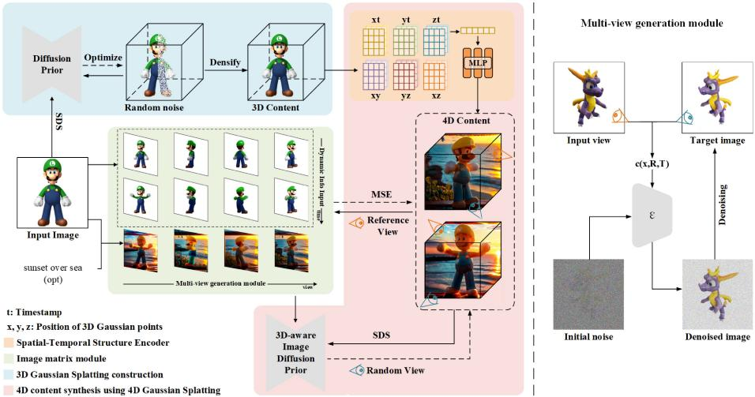
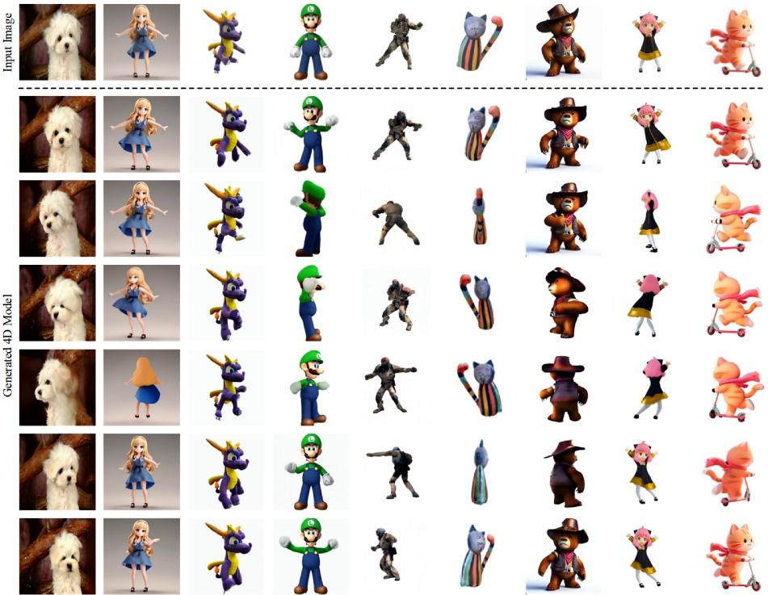
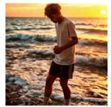
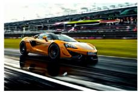
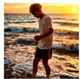
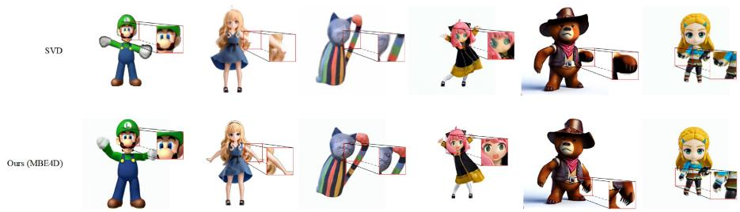

# MATE4D: Matrix-Guided Editable 4D Generation from a Single Image

Xiaotian Chen1,2 and Dongfu Yin1⋆

1 Guangdong Laboratory of Artificial Intelligence and Digital Economy (SZ) 2 Shenzhen University chenxiaotian,yindongfu@gml.ac.cn

Abstract. Generative models have rapidly pushed content creation beyond 2D imagery toward dynamic 3D and 4D scene synthesis. Yet producing realistic and temporally stable 4D content from a single image is still dificult because one view provides limited structural cues and weak motion evidence. We introduce MATE4D, a framework that converts one input image into editable dynamic 4D content. Our method constructs a spatio-temporal multi-view image matrix with text-guided background manipulation, delivering coherent supervision over viewpoint, appearance, and motion. These synthesized observations are used to optimize 3D Gaussian primitives, which are then animated through a lightweight deformation module to form a 4D representation. The resulting scenes preserve geometry more faithfully, maintain smoother temporal behavior, and keep background edits more consistent, reducing context ambiguity and motion artifacts. Experiments on Objaverse-XL and Difusion4D show that MATE4D outperforms strong baselines in visual quality, eficiency, and controllability, supporting practical AR/VR content creation.

Keywords: Single-image 4D generation · Multi-view synthesis · Background editing · Lighting control · 4D Gaussian splatting Single-image 4D Generation, Multi-view Synthesis, Background Editing, Dynamic Scene Reconstruction.

## 1 Introduction

With the rapid progress of generative modeling, content creation has evolved from 2D images [1] to videos [2–4] and further to 3D scene generation [5–8]. Building upon these advances, recent studies have explored dynamic 4D content generation [12, 13, 11], typically represented using dynamic Neural Radiance Fields (NeRFs) [14]. Methods such as Hexplane [15], CONSISTENT4D [16], and MAV3D [12] combine difusion models with dynamic NeRF formulations to generate temporally varying 3D scenes from text or video inputs.

In parallel, single-image-based multi-view image generation has gained increasing attention due to its eficiency and practicality. Approaches such as

  
Fig. 1. The overall pipeline of MATE4D. (Left) From a single input image, MATE4D generates a spatio-temporal multi-view image matrix that supervises 3D Gaussian Splatting and a deformation field to produce 4D content, while a text-guided module enables background editing. (Right) A fine-tuned difusion-based generator synthesizes novel-view images for each frame, enriching the matrix with temporal and viewpoint diversity.

Zero123 [21], Zero123++ [22], and SyncDreamer [24] demonstrate the feasibility of synthesizing consistent novel views from a single image, providing efective supervision for downstream 3D reconstruction. On the representation side, 3D content generation has benefited from point-based, implicit, and Gaussian-based formulations. In particular, 3D Gaussian Splatting (3D GS) [20] enables highquality real-time rendering, and has recently been extended to dynamic scenarios through 4D Gaussian Splatting (4D GS) [18, 28, 29], ofering an eficient representation for dynamic scenes with reduced optimization cost.

Despite these advances, generating high-fidelity dynamic 4D content remains challenging. Difusion- and NeRF-based 4D methods often sufer from high computational cost, long optimization time, and limited visual sharpness. Singleimage multi-view generation methods struggle to maintain geometric consistency across viewpoints, frequently leading to structural distortions, texture inconsistencies, and missing background information. These issues are further amplified when such generated views are used to supervise 3D or 4D reconstruction.

Although 4D Gaussian Splatting significantly improves rendering eficiency, existing approaches typically rely on multi-view or video inputs. When applied to single-image scenarios, they encounter fundamental limitations, including inaccurate camera estimation, insuficient background Gaussian initialization, and motion-induced surface tearing during deformation. Moreover, while background editing and lighting control have been actively studied in 2D and static 3D domains—through methods such as ControlNet [30], IC-Light [31],

  
Fig. 2. Visual results. From a single input image, MATE4D produces geometrically consistent and temporally coherent dynamic scenes. The visualized results across diferent timestamps and viewpoints highlight our method’s ability to preserve fine structural details and ensure smooth motion continuity without geometric distortion.

GaussianEditor [33], and Scafold-GS [34]—such capabilities remain largely unexplored in dynamic 4D generation.

To address these limitations, we propose a novel 4D generation framework that directly generates dynamic 4D content from a single image, using 4D Gaussian Splatting as the core representation. Our method incorporates multi-view image matrix generation to enhance geometric completeness, and further introduces text and lighting supervision inspired by IC-Light to guide dynamic appearance modeling. This design efectively improves the clarity of generated 4D content, enriches motion diversity, and enables editable backgrounds, advancing practical and controllable 4D content generation from minimal input.

Our main contributions are summarized as follows:

1. We propose MATE4D, a novel single-image-to-4D generation framework that uniquely enables the creation of background-editable 4D content via text prompts.

2. We design three key components: an image matrix module that synthesizes temporally coherent multi-view sequences, a 4D Gaussian Splatting representa-

tion with a lightweight deformation field for dynamic modeling, and a textguided background editing module for realistic environmental control.

3. We conduct extensive experiments on large-scale benchmarks, including Objaverse-XL and Difusion4D, and demonstrate that our method achieves stateof-the-art performance in spatial fidelity, temporal coherence, and editing flexibility, surpassing existing 4D generation approaches.

  
Cowboy bear dolls on the western prairie

  
Handsome man playing football with the sunset over the sea

  
Sports car driving on the track

  
Fig. 3. Dynamic 4D frames from a single edited view via text-guided background editing, with consistent motion and viewpoints, showing 4D foreground-background generation.

## 2 Related Work

## 2.1 Single-image multi-view generation

Single-image novel-view synthesis has rapidly advanced with the development of difusion priors. Zero-1-to-3 conditions a large difusion model on relative camera poses to synthesize new viewpoints from a single image [21]. Zero123++ improves cross-view consistency through joint generation of tiled multi-view outputs [22]. SyncDreamer and Wonder3D further strengthen 3D awareness by modeling multi-view correlations and auxiliary geometric cues [24, 5]. Although these methods provide efective supervision for static 3D reconstruction, they do not explicitly address the joint temporal-view consistency required for editable 4D generation.

## 2.2 4D content generation

Early 4D generation methods are largely based on dynamic NeRF formulations, where time is introduced into implicit radiance field models to represent deforming scenes. More recent work distills video difusion priors into dynamic 3D representations, enabling text- or image-driven 4D generation [12, 16, 17]. However, such pipelines often sufer from high optimization cost, unstable geometry, and limited rendering eficiency. Gaussian-based representations ofer a more practical alternative. 3D Gaussian Splatting achieves high-quality realtime rendering with explicit point primitives [20], and 4D Gaussian variants extend this idea to dynamic scenes by coupling a canonical point cloud with time-dependent deformations [18, 29, 32]. Still, existing methods rarely consider editable environments as part of the 4D learning objective.

## 2.3 Editable background and lighting control

Text-guided control and relighting have been extensively studied in 2D generation. ControlNet injects structural conditions into difusion backbones for controllable image generation [30]. Recent relighting methods, such as IC-Light, emphasize consistent illumination transfer while preserving subject appearance [31]. In static 3D editing, Gaussian-based scene editing frameworks show that explicit representations are well suited to controllable appearance manipulation [33]. Our work difers from these settings by incorporating editable background and lighting control directly into dynamic 4D generation from a single image.

## 3 Method

The proposed MATE4D framework generates spatio-temporally coherent 4D content from a single input image. As illustrated in Fig 1, it consists of three components: an image matrix module for constructing coherent multi-view sequences, a 4D content synthesis stage based on Gaussian Splatting, and a background editing module that enables flexible control of illumination and environment.

Table 1. Quantitative comparison of visual quality with state-of-the-art methods on Objaverse-XL dataset. MATE4D† represents our model evaluated with foreground masks for a fair comparison with baselines. MATE4D denotes evaluation on the full image including text-guided edited backgrounds.
<table><tr><td>Methods</td><td>Background</td><td>CLIP-I↑</td><td>LPIPS↓</td><td>SSIM↑</td><td>PSNR↑</td></tr><tr><td>Animate124 [17]</td><td></td><td>0.854</td><td>0.132</td><td>0.812</td><td>33.841</td></tr><tr><td>DG4D [28]</td><td>√</td><td>0.923</td><td>0.145</td><td>0.764</td><td>34.054</td></tr><tr><td>V4D [41]</td><td>√</td><td>0.889</td><td>0.131</td><td>0.89</td><td>33.726</td></tr><tr><td>Consistent4D [16]</td><td></td><td>0.921</td><td>0.165</td><td>0.841</td><td>34.102</td></tr><tr><td>EG4D [38]</td><td></td><td>0.932</td><td>0.133</td><td>0.857</td><td>34.211</td></tr><tr><td>Diffusion4D [32]</td><td></td><td>0.905</td><td>0.134</td><td>0.868</td><td>34.257</td></tr><tr><td>STAG4D [43]</td><td></td><td>0.918</td><td>0.126</td><td>0.871</td><td>35.077</td></tr><tr><td>Efficient4D [44]</td><td></td><td>0.912</td><td>0.146</td><td>0.875</td><td>34.289</td></tr><tr><td>4DGen [45]</td><td></td><td>0.927</td><td>0.124</td><td>0.879</td><td>34.362</td></tr><tr><td>Gaussian-Flow [46]</td><td>√</td><td>0.949</td><td>0.146</td><td>0.904</td><td>34.475</td></tr><tr><td>SV4D [29]</td><td>V</td><td>0.913</td><td>0.129</td><td>0.952</td><td>34.583</td></tr><tr><td>MATE4D† (Ours)</td><td></td><td>0.972</td><td>0.214</td><td>0.884</td><td>36.154</td></tr><tr><td>MATE4D(Ours)</td><td>V</td><td>0.961</td><td>0.152</td><td>0.936</td><td>38.762</td></tr></table>

## 3.1 Image Matrix Module

Given a single input image $I _ { 0 }$ , we first transform it into a dynamic video sequence $\{ I _ { t } \} _ { t = 1 } ^ { \bar { T } }$ to introduce temporal information. Since each frame $I _ { t }$ contains only a single viewpoint, we design a view-conditioned generation mechanism that synthesizes novel views from relative camera parameters $( \Delta \theta , \Delta \phi , \Delta r )$ . Specifically, we fine-tune a difusion-based multi-view generation model (Fig 1, right) to produce consistent novel viewpoints for each frame, conditioned on the input image and relative camera transformation. This ensures that the resulting image matrix preserves both temporal dynamics and viewpoint diversity. Formally, the training objective is defined as:

$$
\operatorname* { m i n } _ { \theta } \ \mathbb { E } _ { z \sim \mathcal { E } ( x ) , t , \epsilon \sim \mathcal { N } ( 0 , 1 ) } \left\| \epsilon - \epsilon _ { \theta } ( z _ { t } , t , c ( x , R , T ) ) \right\| _ { 2 } ^ { 2 } ,\tag{1}
$$

where x denotes the input frame, $c ( x , R , T )$ is the embedding that fuses image features with relative viewpoint, $\epsilon _ { \theta }$ is a U-Net denoiser, and $z _ { t }$ is the noisy latent at timestep t.

By applying this procedure across T frames and V viewpoints, we obtain an image matrix M encoding both temporal dynamics and multi-view diversity. To maintain spatio-temporal coherence, we further enforce perceptual alignment between generated frames and their inputs, rather than treating each viewpoint independently.

Table 2. Quantitative comparison of visual consistency with state-of-the-art methods on Objaverse-XL dataset. MATE4D† represents our model evaluated with foreground masks for a fair comparison with baselines. MATE4D denotes evaluation on the full image including text-guided edited backgrounds.
<table><tr><td>Methods</td><td>Background</td><td>FVD-F↓</td><td>FVD-V↓</td><td>FVD-Diag↓</td><td>FVD4D↓</td></tr><tr><td>Animate124 [17]</td><td></td><td>725.947</td><td>392.617</td><td>553.847</td><td>559.347</td></tr><tr><td>DG4D [28]</td><td>√</td><td>697.843</td><td>450.585</td><td>615.681</td><td>638.150</td></tr><tr><td>V4D [41]</td><td>√</td><td>792.536</td><td>417.853</td><td>589.326</td><td>602.419</td></tr><tr><td>Consistent4D [16]</td><td></td><td>1133.931</td><td>488.382</td><td>741.526</td><td>871.950</td></tr><tr><td>EG4D [38]</td><td></td><td>814.229</td><td>432.941</td><td>612.719</td><td>641.238</td></tr><tr><td>Diffusion4D [32]</td><td></td><td>836.742</td><td>440.328</td><td>624.538</td><td>655.842</td></tr><tr><td>STAG4D [43]</td><td></td><td>861.881</td><td>469.074</td><td>636.832</td><td>546.560</td></tr><tr><td>Efficient4D [44]</td><td></td><td>848.913</td><td>447.512</td><td>635.217</td><td>678.527</td></tr><tr><td>4DGen [45]</td><td></td><td>865.327</td><td>459.837</td><td>525.656</td><td>702.316</td></tr><tr><td>Gaussian-Flow [46]</td><td>√</td><td>956.567</td><td>490.777</td><td>702.736</td><td>762.753</td></tr><tr><td>SV4D [29]</td><td>√</td><td>677.686</td><td>368.538</td><td>648.932</td><td>614.350</td></tr><tr><td>MATE4D† (Ours)</td><td></td><td>258.912</td><td>412.342</td><td>232.973</td><td>192.423</td></tr><tr><td>MATE4D(Ours)</td><td>√</td><td>236.338</td><td>395.536</td><td>214.359</td><td>175.828</td></tr></table>

## 3.2 4D Content Synthesis

Based on the constructed image matrix ${ \mathcal { M } } ,$ we initialize a 3D Gaussian Splatting representation $\mathcal { G } _ { 0 } = \{ g _ { i } \} _ { i = 1 } ^ { N }$ and extend it into a dynamic 4D representation via a spatio-temporal deformation field. Each Gaussian $g _ { i }$ is parameterized by its $( x , y , z )$ position, covariance, opacity, and spherical harmonics coeficients. The deformation field $D _ { \phi }$ predicts time-dependent transformations $g _ { i } ^ { t } = D _ { \phi } ( g _ { i } , t )$ , resulting in a set of 4D Gaussians $\mathcal { G } _ { 4 D }$

To optimize this representation, we render each viewpoint $\hat { I } _ { t , v }$ using diferentiable splatting and minimize its discrepancy with the image matrix:

$$
\mathcal { L } _ { R e f } = \frac { 1 } { T V } \sum _ { t = 1 } ^ { T } \sum _ { v = 1 } ^ { V } \left. \hat { I } _ { t , v } - I _ { t , v } \right. _ { 2 } ^ { 2 } .\tag{2}
$$

In addition, to ensure generalization to unseen viewpoints and recovery of occluded structures, we incorporate a score distillation sampling (SDS) loss with a pretrained 2D difusion prior:

$$
\nabla _ { \Theta } \mathcal { L } _ { S D S } = \mathbb { E } _ { t , p , \epsilon } \left[ \omega ( t ) \left( \epsilon _ { \phi } ( \hat { I } ; t , \hat { I } ^ { r } , \triangle p ) - \epsilon \right) \frac { \partial \hat { I } } { \partial \Theta } \right] ,\tag{3}
$$

where $\triangle p$ denotes the relative pose change, $\omega ( t )$ is the timestep-dependent weight, and $\epsilon _ { \phi }$ is the noise predicted by the difusion prior. The joint objective $\mathcal { L } _ { R e f } + \lambda \mathcal { L } _ { S D S }$ thus balances data fidelity with prior-guided plausibility.

  
Fig. 4. Detail enlarge comparison diagram. This figure illustrates the comparative performance of the baseline method (SVD) and our proposed method (MATE4D) in terms of detail recovery and boundary treatment.

Table 3. Regarding the quantitative results of MATE4D on the Difusion4D dataset. The lower the value, the better the performance.
<table><tr><td>Methods</td><td>FVD-F↓</td><td>FVD-Diag↓</td><td>FVD4D↓</td></tr><tr><td>DG4D [28]</td><td>487.207</td><td>702.853</td><td>731.330</td></tr><tr><td>V4D [41]</td><td>489.728</td><td>688.939</td><td>643.227</td></tr><tr><td>Consistent4D [16]</td><td>481.891</td><td>672.648</td><td>752.762</td></tr><tr><td>EG4D [38]</td><td>463.518</td><td>674.495</td><td>728.486</td></tr><tr><td>Diffusion4D [32]</td><td>437.921</td><td>596.207</td><td>598.456</td></tr><tr><td>STAG4D [43]</td><td>456.227</td><td>599.936</td><td>536.330</td></tr><tr><td>Efficient4D [44]</td><td>415.793</td><td>628.828</td><td>672.768</td></tr><tr><td>4DGen [45]</td><td>408.087</td><td>593.873</td><td>539.441</td></tr><tr><td>Gaussian-Flow [46]</td><td>370.532</td><td>555.611</td><td>618.817</td></tr><tr><td>SV4D [29]</td><td>397.279</td><td>543.332</td><td>598.021</td></tr><tr><td>MATE4D(ours)</td><td>273.924</td><td>457.342</td><td>397.346</td></tr></table>

## 3.3 Background Editing

To enable editing of background and illumination, we introduce a text-guided background editing module. Given an input image $I _ { 0 }$ and a textual description T, we generate a background-enhanced image:

$$
I _ { 0 } ^ { b g } = f _ { b g } ( I _ { 0 } , T ) ,\tag{4}
$$

where $f _ { b g }$ modifies the environment while preserving object integrity.

The edited image $I _ { 0 } ^ { b g }$ is processed by the same image matrix module, producing a background-aware matrix $\mathcal { M } _ { b g }$ . To disentangle background from object geometry, we initialize a background-free Gaussian point cloud and jointly optimize it with $\mathcal { M } _ { b g }$ . This design enabling background-editable 4D synthesis under varying illumination and environmental conditions.

## 4 Experiments

## 4.1 Datasets and Evaluation Metrics

Objaverse-XL. We evaluate our method on the Objaverse-XL dataset [35], a large-scale repository of over 10 million 3D objects spanning diverse categories. For 4D generation tasks, we utilize rendered multi-view sequences of these objects, enabling assessment of our model’s ability to synthesize temporally consistent dynamic scenes from complex geometries.

Difusion4D. To further validate our approach, we use the Difusion4D dataset [32], which provides dynamic 4D sequences generated via difusion-based models. It contains a wide range of objects and motions, capturing realistic appearance variations and temporal dynamics. This dataset serves as a challenging benchmark for evaluating both spatial fidelity and temporal coherence.

Evaluation Metrics. To measure visual quality, we adopt CLIP-I, PSNR, SSIM, and LPIPS. To evaluate motion consistency, we employ a suite of FVD metrics, including FVD-F, FVD-V, FVD-Diag, and FVD4D, which capture temporal fidelity, viewpoint consistency, and deformation accuracy in generated 4D content.

## 4.2 Implementation Details

In the multi-view generation module, we fix the rotation along the y-axis and vary the x-axis rotation with ofsets $\Delta x = [ 0 , 1 0 , 2 0 , 1 0 , 0 , - 1 0 , - 2 0 , - 1 0 , 0 ]$ for the second stage. To introduce dynamic information, we adopt SVD as the temporal modeling backbone. For background editing, images are rendered at a resolution of $5 1 2 \times 5 1 2$ . During 4D Gaussian Splatting optimization, we supervise reconstruction using batches of 9 images sampled from the multi-view image matrix.

Table 4. Performance comparison between RGBA and RGB image formats. Quantitative comparison of MB4D and SV4D across multiple datasets using RGBA and RGB formats. Performance is evaluated via CLIP-I and PSNR metrics.
<table><tr><td colspan="2">Data Format</td><td colspan="2">RGBA</td><td colspan="3">RGB</td></tr><tr><td colspan="2">Data Source</td><td>Unsplash</td><td>Dalle Objaverse</td><td>Unsplash</td><td>Dalle</td><td>Objaverse</td></tr><tr><td>SV4D</td><td>CLIP-I PSNR</td><td>0.967 35.97</td><td>0.965 34.12</td><td>0.958 33.68</td><td>0.941 0.954 28.12 32.88</td><td>0.915 27.59</td></tr><tr><td>MATE4D (Ours)</td><td>CLIP-I PSNR</td><td>0.979↑ 34.13</td><td>0.969 35.94</td><td>0.941 36.44↑</td><td>0.913 0.973 27.56 32.35</td><td>0.921 35.20</td></tr></table>

Table 5. Ablation study of IMM, BEM, and DII.
<table><tr><td></td><td>IMM</td><td>BEM</td><td>DII</td><td>CLIP-I↑</td><td>PSNR↑</td><td>FVD4D↓</td></tr><tr><td>(a)</td><td></td><td></td><td></td><td>0.859</td><td>30.54</td><td>1</td></tr><tr><td>(b)</td><td></td><td>√</td><td></td><td>0.949</td><td>35.734</td><td>-</td></tr><tr><td>(c)</td><td>√</td><td></td><td>√</td><td>0.957</td><td>36.245</td><td>213.653</td></tr><tr><td>(d)</td><td></td><td>√</td><td>√</td><td>0.861</td><td>30.441</td><td>421.562</td></tr><tr><td>(e)</td><td>√</td><td>√</td><td>√</td><td>0.961</td><td>38.762</td><td>175.828</td></tr></table>

## 4.3 Main Results

As shown in Table 1 and Table 2, MATE4D achieves state-of-the-art performance across most metrics, specifically reaching the highest CLIP-I (0.961), PSNR (38.762), and SSIM (0.936). These results, along with the lowest FVD scores, verify its superior ability to preserve spatial fidelity and temporal coherence. To further evaluate our background editing capability, we report results in two modes: MATE4D (evaluated on unedited images for fair comparison with baselines) and MATE4D† (full-image evaluation after background editing). While MATE4D† shows an expected decrease in pixel-wise metrics (PSNR/SSIM) due to the divergence between the synthesized and original background pixels, its CLIP-I score increases to 0.972, and the FVD metrics remain competitive. This gap demonstrates that our Background Editing Module (BEM) significantly enhances global semantic coherence and temporal stability while maintaining competitive motion quality, efectively balancing high-fidelity reconstruction with versatile editability.

At present, mainstream image formats include RGBA and RGA. We evaluated our method across diferent formats on multiple datasets using CLIP-I and PSNR, comparing against SV4D [29] as the baseline. As shown in Table 4, our method consistently achieves better performance. The generation quality improves notably with RGBA inputs, likely because the alpha channel provides useful semantic cues for 4D reconstruction. Performance further increases with grayscale inputs, indicating that their concise and robust representation benefits downstream tasks and future research.

Beyond quantitative results, qualitative comparisons further validate the robustness of our framework. As illustrated in Fig 2 and Fig 3, MATE4D generates realistic and temporally coherent 4D sequences from a single image, faithfully preserving fine-grained textures such as clothing folds and fur details, while maintaining stable geometry under challenging rotations. The smooth transitions across viewpoints and timestamps demonstrate that the learned 4D Gaussian representation efectively mitigates motion discontinuities and geometric distortions, issues frequently observed in prior approaches.

As shown in Fig 4, we further compare our MATE4D with Stable Video Difusion (SVD) [2]. While SVD sufers from blurred high-frequency details, boundary noise, and jagged edges, our method produces sharper contours, suppresses

Table 6. Quantitative ablation study of loss components on the Difusion4D dataset.
<table><tr><td>Method</td><td>PSNR↑</td><td>SSIM↑</td><td></td><td>CLIP-I↑ FVD4D↓</td></tr><tr><td>w/o LsDs (LMSE Only)</td><td>39.12</td><td>0.941</td><td>0.912</td><td>245.5</td></tr><tr><td>w/o LMSE  $( \mathcal { L } _ { S D S } \ \mathrm { O n l y } )$ </td><td>24.35</td><td>0.721</td><td>0.885</td><td>310.2</td></tr><tr><td>Full Model  $( \mathcal { L } _ { M S E } + \mathcal { L } _ { S D S } )$ </td><td>38.76</td><td>0.936</td><td>0.961</td><td>175.8</td></tr></table>

artifacts more efectively, and delivers smoother, more natural transitions. This results in significantly improved visual fidelity and structural integrity in the generated 4D content.

We further evaluate on the Difusion4D dataset, with results presented in Table 3. MATE4D consistently achieves the lowest FVD-based scores, demonstrating strong generalization to challenging dynamic motions and diverse object categories.

## 4.4 Ablation Studies

To evaluate the contribution of each component, we conduct ablation studies on the Image Matrix Module (IMM), the Background Editing Module (BEM), and the Dynamic Info Input (DII). Quantitative results are summarized in Table 5. The base configuration without any proposed modules (a) fails to generate reliable 4D content, yielding the lowest CLIP-I (0.859) and PSNR (30.54). Introducing IMM alone (b) significantly enhances spatial fidelity (CLIP-I 0.949, PSNR 35.734), underscoring its essential role in multi-view consistency. Adding DII (c) further improves semantic and pixel-level accuracy while markedly reducing FVD4D to 213.653, which validates the importance of temporal dynamics for motion coherence. Conversely, the configuration omitting IMM (d) performs poorly (PSNR 30.441, FVD4D 421.562), highlighting that IMM is indispensable for stable geometry. Our full model (e) achieves the best performance across all metrics (CLIP-I 0.962, PSNR 38.762, FVD4D 175.828). In this setting, BEM complements IMM and DII by further enhancing visual quality and background consistency. These results demonstrate that the three modules are mutually beneficial and essential for high-fidelity, temporally coherent 4D generation, confirming the efectiveness of our framework.

To further verify the efectiveness of the MATE4D optimization objective, we conducted a detailed ablation study on the reconstruction loss $\mathcal { L } _ { M S E }$ and the score distillation sampling loss $\mathcal { L } _ { S D S }$ . As shown in Table 6, the experimental results indicate that these two components play complementary roles in balancing the generation quality and geometric fidelity. Specifically, when the reconstruction loss $\mathcal { L } _ { M S E }$ is removed and only SDS is relied upon for guidance, the PSNR drops sharply from 38.76 dB to 24.35 dB, which strongly demonstrates that explicit pixel supervision based on the image matrix is crucial for maintaining high fidelity of the generated assets with the input images and preventing texture

drift. On the other hand, although the PSNR in the reference view slightly increases after removing $\mathcal { L } _ { S D S }$ (due to overfitting of the model in the limited view), the CLIP-I and FVD4D metrics, which reflect the overall generation quality and spatiotemporal coherence, deteriorate significantly.

## 5 Conclusion

We introduced MATE4D, a framework for generating dynamic 4D content from a single image. By integrating a spatio-temporal image matrix, a Gaussianbased deformation representation, and a background editing module, our method achieves geometric realism, smooth temporal dynamics, and controllable environmental conditions. Comprehensive evaluations on large-scale benchmarks demonstrate that MATE4D delivers state-of-the-art performance in both spatial fidelity and temporal coherence, while providing enhanced flexibility for immersive AR/VR applications. This work takes a step toward practical and editable 4D generation from minimal inputs. Future work will focus on further reducing computational overhead, while enhancing generalization to diverse application scenarios and enriching the diversity of dynamic motions.

## 6 Acknowledgments

This work was supported by the Shenzhen Science and Technology Program under Grant KJZD20240903104400001 and was financially supported by the Research Task Assignment Project from Guangdong Laboratory of Artificial Intelligence and Digital Economy (SZ), under Grant No. GML-26420004.

## References

1. Rombach, R., Blattmann, A., Lorenz, D., Esser, P., Ommer, B.: High-resolution image synthesis with latent difusion models. In: Proceedings of the IEEE/CVF Conference on Computer Vision and Pattern Recognition (CVPR) (2022)

2. Blattmann, A., et al.: Stable Video Difusion: Scaling latent video difusion models to large datasets. CoRR (2023)

3. Chai, W., Guo, X., Wang, G., Lu, Y.: StableVideo: Text-driven consistency-aware difusion video editing. In: Proceedings of the IEEE/CVF International Conference on Computer Vision (ICCV) (2023)

4. Esser, P., Chiu, J., Atighehchian, P., Granskog, J., Germanidis, A.: Structure and content-guided video synthesis with difusion models. In: Proceedings of the IEEE/CVF International Conference on Computer Vision (ICCV) (2023)

5. Long, X., et al.: Wonder3D: Single image to 3D using cross-domain difusion. In: Proceedings of the IEEE/CVF Conference on Computer Vision and Pattern Recognition (CVPR) (2024)

6. Liu, M., et al.: One-2-3-45++: Fast single image to 3D objects with consistent multi-view generation and 3D difusion. In: Proceedings of the IEEE/CVF Conference on Computer Vision and Pattern Recognition (CVPR) (2024)

7. Chen, Z., et al.: 3DTopia-XL: Scaling high-quality 3D asset generation via primitive difusion. In: Proceedings of the IEEE/CVF Conference on Computer Vision and Pattern Recognition (CVPR) (2025)

8. Gao, J., et al.: GET3D: A generative model of high quality 3D textured shapes learned from images. In: Advances in Neural Information Processing Systems (NeurIPS) (2022)

9. Park, J.J., Florence, P., Straub, J., Newcombe, R., Lovegrove, S.: DeepSDF: Learning continuous signed distance functions for shape representation. In: Proceedings of the IEEE/CVF Conference on Computer Vision and Pattern Recognition (CVPR) (2019)

10. Chou, G., Bahat, Y., Heide, F.: Difusion-SDF: Conditional generative modeling of signed distance functions. In: Proceedings of the IEEE/CVF International Conference on Computer Vision (ICCV) (2023)

11. Chen X, Yin D, Yu F, et al. MBE4D: Multi-View Background-Editable 4D Generation from a Single Image[C]//ICASSP 2026-2026 IEEE International Conference on Acoustics, Speech and Signal Processing (ICASSP). IEEE, 2026: 9182-9186.

12. Singer, U., et al.: Text-to-4D dynamic scene generation. In: Proceedings of the 40th International Conference on Machine Learning (ICML) (2023)

13. Ling, H., Kim, S.W., Torralba, A., Fidler, S., Kreis, K.: Align your gaussians: Text-to-4D with dynamic 3D gaussians and composed difusion models. In: Proceedings of the IEEE/CVF Conference on Computer Vision and Pattern Recognition (CVPR) (2024)

14. Mildenhall, B., et al.: NeRF: Representing scenes as neural radiance fields for view synthesis. Communications of the ACM (2021)

15. Cao, A., Johnson, J.: HexPlane: A fast representation for dynamic scenes. In: Proceedings of the IEEE/CVF Conference on Computer Vision and Pattern Recognition (CVPR) (2023)

16. Jiang, Y., Zhang, L., Gao, J., Hu, W., Yao, Y.: Consistent4D: Consistent 360◦ dynamic object generation from monocular video. In: International Conference on Learning Representations (ICLR) (2024)

17. Zhao, Y., Yan, Z., Xie, E., Hong, L., Li, Z., Lee, G.H.: Animate124: Animating one image to 4D dynamic scene. arXiv preprint arXiv:2311.14603 (2023)

18. Wu, G., et al.: 4D Gaussian splatting for real-time dynamic scene rendering. In: Proceedings of the IEEE/CVF Conference on Computer Vision and Pattern Recognition (CVPR) (2024)

19. Vaswani, A., et al.: Attention is all you need. Advances in Neural Information Processing Systems (NeurIPS) (2017)

20. Kerbl, B., Kopanas, G., Leimk¨uhler, T., Drettakis, G.: 3D Gaussian splatting for real-time radiance field rendering. ACM Transactions on Graphics (TOG) (2023)

21. Liu, R., et al.: Zero-1-to-3: Zero-shot one image to 3D object. In: Proceedings of the IEEE/CVF International Conference on Computer Vision (ICCV) (2023)

22. Shi, R., et al.: Zero123++: A single image to consistent multi-view difusion base model. arXiv preprint arXiv:2310.15110 (2023)

23. Liu, Y.-L., et al.: Robust dynamic radiance fields. In: Proceedings of the IEEE/CVF Conference on Computer Vision and Pattern Recognition (CVPR) (2023)

24. Liu, Y., et al.: SyncDreamer: Generating multiview-consistent images from a singleview image. arXiv preprint arXiv:2309.03453 (2023)

25. Hong, Y., et al.: LRM: Large reconstruction model for single image to 3D. arXiv preprint arXiv:2311.04400 (2023)

26. Li, T., et al.: Neural 3D video synthesis from multi-view video. In: Proceedings of the IEEE/CVF Conference on Computer Vision and Pattern Recognition (CVPR) (2022)

27. Fang, J., et al.: Fast dynamic radiance fields with time-aware neural voxels. In: SIGGRAPH Asia 2022 Conference Papers (2022)

28. Ren, J., Pan, L., Tang, J., Zhang, C., Cao, A., Zeng, G., Liu, Z.: DreamGaussian4D: Generative 4D Gaussian splatting. arXiv preprint arXiv:2312.17142 (2023)

29. Xie, Y., Yao, C.-H., Voleti, V., Jiang, H., Jampani, V.: SV4D: Dynamic 3D content generation with multi-frame and multi-view consistency. arXiv preprint arXiv:2407.17470 (2024)

30. Zhang, L., Rao, A., Agrawala, M.: Adding conditional control to text-to-image difusion models. In: Proceedings of the IEEE/CVF International Conference on Computer Vision (ICCV) (2023)

31. Zhang, L., Rao, A., Agrawala, M.: Scaling in-the-wild training for difusion-based illumination harmonization and editing by imposing consistent light transport. In: International Conference on Learning Representations (ICLR) (2025)

32. Liang, H., Yin, Y., Xu, D., Liang, H., Wang, Z., Plataniotis, K.N., Zhao, Y., Wei, Y.: Difusion4D: Fast spatial-temporal consistent 4D generation via video difusion models. arXiv preprint arXiv:2405.16645 (2024)

33. Chen, Y., et al.: GaussianEditor: Swift and controllable 3D editing with Gaussian splatting. In: Proceedings of the IEEE/CVF Conference on Computer Vision and Pattern Recognition (CVPR) (2024)

34. Lu, T., et al.: Scafold-GS: Structured 3D gaussians for view-adaptive rendering. In: Proceedings of the IEEE/CVF Conference on Computer Vision and Pattern Recognition (CVPR) (2024)

35. Liang, R., et al.: DifusionRenderer: Neural inverse and forward rendering with video difusion models. In: Proceedings of the IEEE/CVF Conference on Computer Vision and Pattern Recognition (CVPR) (2025)

36. Unterthiner, T., et al.: Towards accurate generative models of video: A new metric & challenges. arXiv preprint arXiv:1812.01717 (2018)

37. Melas-Kyriazi, L., Laina, I., Rupprecht, C., Vedaldi, A.: RealFusion: 360deg reconstruction of any object from a single image. In: Proceedings of the IEEE/CVF Conference on Computer Vision and Pattern Recognition (CVPR) (2023)

38. Sun, Q., et al.: EG4D: Explicit generation of 4D object without score distillation. arXiv preprint arXiv:2405.18132 (2024)

39. Fridovich-Keil, S., et al.: K-Planes: Explicit radiance fields in space, time, and appearance. In: Proceedings of the IEEE/CVF Conference on Computer Vision and Pattern Recognition (CVPR) (2023)

40. Wang, F., Chen, Z., Wang, G., Song, Y., Liu, H.: Masked space-time hash encoding for eficient dynamic scene reconstruction. In: Advances in Neural Information Processing Systems (NeurIPS) (2023)

41. Gan, W., Xu, H., Huang, Y., Chen, S., Yokoya, N.: V4D: Voxel for 4D novel view synthesis. IEEE Transactions on Visualization and Computer Graphics (TVCG) (2023)

42. Voleti, V., et al.: SV3D: Novel multi-view synthesis and 3D generation from a single image using latent video difusion. In: European Conference on Computer Vision (ECCV) (2025)

43. Zeng, Y., et al.: Stag4D: Spatial-temporal anchored generative 4D gaussians. In: European Conference on Computer Vision (ECCV) (2025)

44. Pan, Z., Yang, Z., Zhu, X., Zhang, L.: Eficient4D: Fast dynamic 3D object generation from a single-view video. arXiv preprint arXiv:2401.08742 (2024)

45. Yin, Y., Xu, D., Wang, Z., Zhao, Y., Wei, Y.: 4DGen: Grounded 4D content generation with spatial-temporal consistency. arXiv preprint arXiv:2312.17225 (2023)

46. Lin, Y., Dai, Z., Zhu, S., Yao, Y.: Gaussian-Flow: 4D reconstruction with dynamic 3D Gaussian particle. In: Proceedings of the IEEE/CVF Conference on Computer Vision and Pattern Recognition (CVPR) (2024)