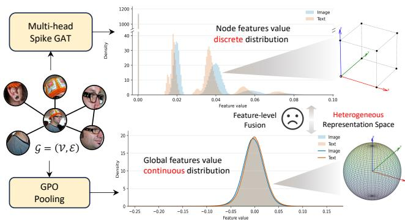
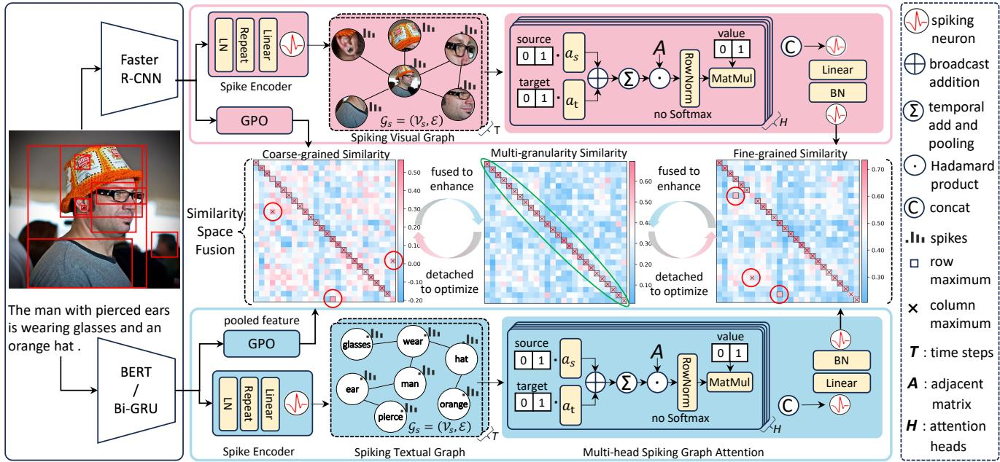
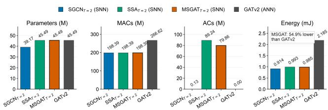
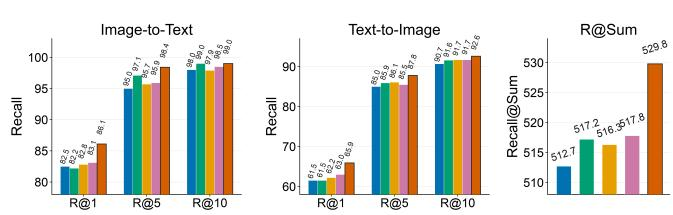
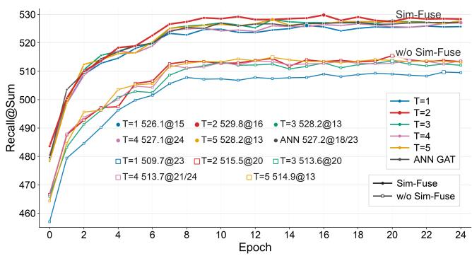

# MSGAT: Multi-Head Spiking Graph Attention with Similarity-Space Fusion for Image-Text Retrieval

Xintao Zong1, Wenxuan Liu1, Jianhao Ding1, Zhaofei Yu1∗, Tiejun Huang1∗ 1Peking University

## Abstract

Spiking neural networks (SNNs) ofer an energy-eficient computing paradigm through sparse event-driven computation, showing great potential for eficient multimodal learn- ing. However, applying SNNs to high-level multimodal tasks, such as image-text retrieval (ITR), remains challenging, since sparse spike representations make it dificult to capture se- mantic structures required for cross-modal alignment. Exist- ing spiking ITR methods rely on local alignment and addi- tional soft-label supervision during training, while lacking awareness of structural and multi-granularity relationships. To address these issues, we propose a Multi-head Spiking Graph Attention Network (MSGAT) for structural modeling and equip it with dynamic attention heads to capture comple- mentary relational patterns and enable spike-driven graph rea- soning and aggregation. However, within a two-branch multi- granularity fusion framework, the fine-grained spike represen- tations generated by MSGAT are sparse and discrete, whereas the global representations are continuous, making conven- tional feature-level fusion susceptible to interference across heterogeneous representations. Therefore, we introduce Sim-Fuse, a similarity-space fusion alignment strategy integrating coarse- and fine-grained matching relations while avoiding direct fusion of heterogeneous representations. Experiments on Flickr30K and MSCOCO show our method outperforms ANN methods under matched settings and existing SNN re- trieval baselines. Moreover, with only two time steps, our SNN achieves comparable or superior performance to its ANN counterpart while reducing theoretical module-level energy by 55%. The code is provided in the Supplementary Materials.

## Introduction

Image-text retrieval (ITR) aims to identify semantically corresponding samples across visual and textual modali- ties (Chen et al. 2021). Recent ANN-based methods have achieved remarkable performance by global semantic align- ment (Zhang et al. 2024), fine-grained region-word correspondence (Pan, Wu, and Zhang 2023), multi-level matching strategies (Fu et al. 2023), and large-scale pre-trained models (Huang et al. 2024). However, existing methods typically rely on deep architectures, dense floating-point operations, and complex cross-modal interactions (Lee et al. 2018), in-curring considerable computational and energy costs that limit scalability in large-scale retrieval scenarios. Spiking neural networks (SNNs) provide a promising alternative for eficient multimodal learning through sparse spike activa- tions and event-driven computation. Recently, CMSF (Zong et al. 2026) established the feasibility of SNNs for cross-modal retrieval. Nevertheless, CMSF primarily relies on lo- cal spike encoding and additional soft-label supervision dur- ing training, leaving semantic relation reasoning and global semantic alignment underexplored, although both are impor- tant for multimodal understanding and alignment.

  
Figure 1: Motivation. Sparse, discrete SNN representations and continuous representations produced by ANN-based GPO (Generalized Pooling Operator) lie in heterogeneous spaces, making conventional feature-level fusion inefective.

High-level cross-modal alignment requires modeling structural relationships beyond isolated visual regions and textual tokens. These semantic units are inherently connected through visual and linguistic dependencies, which provide important cues for distinguishing fine-grained semantic cor- respondence. Therefore, spiking ITR calls for an efective spike-driven graph reasoning mechanism that can capture structural dependencies and enable semantic propagation.

Fine-grained local features and coarse-grained global features provide complementary information for multi- granularity image-text alignment. Existing ANN-based ITR methods commonly integrate these representations through feature-level fusion. However, such a strategy introduces an- other challenge in SNNs, as illustrated in Fig. 1: fine-grained representations from SNNs exhibit sparse and discrete char- acteristics, while global representations from GPO (Chen et al. 2021) remain continuous. Conventional feature-level fusion across these heterogeneous representation spaces may introduce interference and destabilize joint optimization.

To address these challenges, we propose a Multi-head Spiking Graph Attention Network (MSGAT) with Similarity Space Fusion (Sim-Fuse) alignment strategy for ITR. Specifically, MSGAT constructs spiking visual and textual graphs and performs spike-driven graph reasoning and aggregation, enabling fine-grained structural semantic modeling. By em- ploying multiple dynamic attention heads, MSGAT captures com lementar relational atterns from diferent re resen- tation subspaces while preserving the event-driven nature of SNNs. Furthermore, we introduce Sim-Fuse, which inte- grates coarse- and fine-grained matching relations at the sim- ilarity level, avoiding feature-level fusion between the dis- crete and continuous representations produced by MSGAT and GPO, respectively. This similarity-space fusion enables multi-granularity semantic integration. Together, MSGAT and Sim-Fuse form an eficient spiking retrieval framework that improves multi-granularity semantic alignment while retaining the computational advantages of SNNs.

Under comparable feature-extraction settings, experi- ments on Flickr30K and MSCOCO demonstrate that our method outperforms ANN-based methods and existing SNN retrieval baselines. Moreover, with only two time steps, our proposed MSGAT achieves performance comparable or even superior to that of its ANN counterpart while reducing the theoretical inference energy of the graph-reasoning module by approximately 55%.

The main contributions are summarized as follows:

• We propose MSGAT, a novel spike-driven multihead graph attention network that introduces dynamic structure-aware reasoning into image-text retrieval. By exploiting graph relationships and complementary atten- tion heads, MSGAT enables fine-grained semantic graph propagation under sparse event-driven computation.

• We introduce Sim-Fuse, a similarity-space fusion align-ment strategy for SNNs that integrates coarse- and fine- grained matching relations while bypassing heteroge- neous feature representation spaces, efectively improving multi-granularity semantic alignment.

• Extensive experiments on Flickr30K and MSCOCO demonstrate that the proposed framework outperforms state-of-the-art methods. With only two time steps, our model achieves competitive performance with ANN counterparts while reducing energy consumption by 55%.

## Related Works

## Image-Text Retrieval

Recent image-text retrieval methods have explored graph structures to model semantic relations beyond isolated re- gions or tokens. VSRN (Li et al. 2019) performs graph con-volutional reasoning over bottom-up image regions to obtain relation-enhanced visual features. GSMN (Liu et al. 2020a) constructs structured visual and textual graphs whose nodes correspond to objects, relations, or attributes, and learns fine-grained phrase correspondence through node-level and structure-level matching. CSGM (Cheng et al. 2022) formulates retrieval as object-level and relationship-level matching between visual and textual scene graphs. HREM (Fu et al. 2023) further models fragment-level and instance-level se-mantic relations with a cross-embedding association graph to improve hard negative discrimination. CORA (Pham et al. 2024) represents captions as scene graphs and uses graph attention networks to encode object-attribute and objectobject relations in a dual-encoder framework. CHAN (Pan, Wu, and Zhang 2023) emphasizes discriminative hard alignments to reduce noisy fine-grained matching. CMSF (Zong et al. 2026) first applies SNNs to ITR, demonstrating their feasibility for semantically demanding complex multimodal tasks. However, it relies on soft-label supervision and suf- fers from interference by semantically irrelevant nodes in self-attention. Our proposed MSGAT mitigates these limi- tations via spike-driven graph reasoning, graph aggregation, multi-head dynamic attention, and multi-granularity fusion.

## Spiking Neural Networks

Early work such as (Cao, Chen, and Khosla 2015) explored converting deep CNNs into SNNs by interpreting ANN activations as firing rates. (Lv, Xu, and Zheng 2023) proposed a two-stage pipeline combining ANN-to-SNN conversion with fine-tuning. Parallel eforts investigated direct training with surrogate gradients (Wu et al. 2018) . Spikformer (Zhou et al. 2023) and its variants (Zhou et al. 2024; Yao et al. 2024) proposed a spike-driven self-attention mechanism, marking a milestone in the development of SNNs. Recently, SNNs have achieved notable progress in unimodal visual tasks, such as image classification (Song et al. 2024), object detection (Li et al. 2025; Luo et al. 2024), semantic segmentation (Lei et al. 2025), and saliency detection (Liu et al. 2025). Some works have extended SNNs to graph-structured learning. Spiking- GCN (Zhu et al. 2022) encodes graph structures into spike sequences with graph convolution operation, GSAT (Wang and Jiang 2022) learns spike-based graph attention for robust representation learning, SpikeGCL (Li et al. 2024) introduces graph contrastive learning into SNNs to obtain compact bi- nary representations, and SpikeNet (Li et al. 2023a) explores spiking neurons for dynamic representation learning. Spik- ingHAN (Cao et al. 2026) further applies SNNs to hetero-geneous graph learning with a shared convolution layer. Our MSGAT is tailored to multimodal ITR and difers from prior graph static-attention methods by introducing multi-head dy- namic attention with softmax-free spike aggregation to cap- ture structural semantic representations.

## Proposed Method

An overview of our MSGAT is shown in Fig. 2. We first extract floating-point image and text node features and then construct spiking visual and textual graphs. MSGAT cap- tures fine-grained structural semantics through spike-driven graph reasoning, whereas GPO preserves coarse-grained in- formation. The resulting similarity matrices are adaptively fused, and the stop-gradient fused similarity supervises the two pre-fusion matrices via KL-divergence alignment.

  
Figure 2: Framework of MSGAT for ITR. Left: Replaceable extractors produce floating-point node features. Top and bottom: GPO derives global features, Spike Encoder converts node features into spikes for Spiking Graph construction. MSGAT performs spike-driven graph reasoning and aggregation to obtain neighborhood-aware spiking fine-grained features. Middle: Coarse- and fine-grained similarities are fused into a detached multi-granularity target, which in turn aligns and optimizes the two branches.

Spiking Neuron As the fundamental unit of SNNs, a spiking neuron receives input currents $X [ t ]$ and accumulates membrane potentials, which are compared to a threshold to determine firing. The dynamics of the leaky integrate-and- fire (LIF) neuron model (Maass 1997) are:

$$
H [ t ] = V [ t - 1 ] + \frac { 1 } { \tau } \left( X [ t ] - \left( V [ t - 1 ] - V _ { \mathrm { r e s e t } } \right) \right) ,\tag{1}
$$

$$
S [ t ] = { \left\{ \begin{array} { l l } { 1 , } & { { \mathrm { i f ~ } } H [ t ] \geq V _ { \mathrm { t h } } , } \\ { 0 , } & { { \mathrm { o t h e r w i s e } } , } \end{array} \right. }\tag{2}
$$

$$
V [ t ] = H [ t ] \left( 1 - S [ t ] \right) + V _ { \mathrm { r e s e t } } S [ t ] .\tag{3}
$$

where $\tau$ is the membrane time constant. When $H [ t ]$ exceeds the threshold $V _ { \mathrm { t h } }$ , the neuron emits a spike $S [ t ] ;$ ; if spiking occurs, $V [ t ]$ resets to $V _ { \mathrm { r e s e t } }$ , otherwise it remains $H [ t ]$

## Spiking Graph Construction

Following the standard practice in ITR tasks (Lee et al. 2018; Faghri et al. 2018; Chen et al. 2021), we use pre-extracted visual region features by Faster-RCNN (Ren et al. 2017) as model inputs: $\mathbf { X } ^ { v } = [ \bar { \mathbf { x } _ { 1 } ^ { v } } , \mathbf { x } _ { 2 } ^ { v } , \ldots , \mathbf { x } _ { N } ^ { v } ] ^ { \top } \in \mathbb { R } ^ { N \times 2 0 4 8 }$ , and a pre-trained BERT (Devlin et al. 2019) to extract word features: $\mathbf { X } ^ { w } \ = \ [ \mathbf { x } _ { 1 } ^ { w } , \mathbf { x } _ { 2 } ^ { w } , \ldots , \mathbf { x } _ { L } ^ { w } ] ^ { \top } \ \in \ \mathbb { R } ^ { L \times 7 6 8 }$ $\mathbf { x } _ { i } ^ { w }$ and $\mathbf { x } _ { i } ^ { v }$ denote the embedding of the i-th textual node and visual node respectively. Subsequently, a linear layer maps them to a shared embedding dimension of D.

Spiking Textual Graph We construct a textual graph by combining explicit syntactic dependencies and latent seman- tic correlations. To capture explicit linguistic structures, we use Stanford CoreNLP (Manning et al. 2014) to extract syntactic dependency relations among textual nodes. Based on the parsed dependency relations, we construct a syntactic adjacency matrix: $\mathbf { A } _ { s u } ^ { w } \in \{ 0 , 1 \} ^ { L \times L }$ . Since syntactic dependencies may not cover all latent semantic correlations, we further construct a semantic graph:

$$
\mathbf { A } _ { s e } ^ { w } = \mathbb { I } ( c o s i n e ( \mathbf { x } _ { i } ^ { w } , \mathbf { x } _ { j } ^ { w } ) > \theta ^ { w } ) \in \{ 0 , 1 \} ^ { L \times L } ,\tag{4}
$$

where $\mathbb { I } ( \cdot )$ denotes the indicator function, which assigns a value of 1 if the cosine similarity cosine(·) between two nodes exceeds the threshold $\theta ^ { w }$ , and 0 otherwise. Finally, the syntactic dependency matrix and semantic similarity matrix are combined as:

$$
\mathbf { A } ^ { w } = \mathbb { I } ( ( \mathbf { A } _ { s y } ^ { w } + \mathbf { A } _ { s e } ^ { w } ) > 0 ) \in \{ 0 , 1 \} ^ { L \times L } .\tag{5}
$$

Spiking Visual Graph The regions detected by Faster R-CNN may contain multiple instances of the same object cat-egory, such as several "people" within a single image. Since these instances typically exhibit similar embeddings, it is rea- sonable to establish edges between the corresponding nodes. Accordingly, we construct the adjacency matrix of the visual graph based on the pairwise cosine similarity:

$$
\mathbf { A } ^ { v } = \mathbb { I } ( c o s i n e ( \mathbf { x } _ { i } ^ { v } , \mathbf { x } _ { j } ^ { v } ) > \theta ^ { v } ) \in \{ 0 , 1 \} ^ { N \times N } ,\tag{6}
$$

where $\theta ^ { v }$ is the threshold of visual node-level similarity.

Spike Encoder To meet the spatiotemporal requirements of SNNs, we employ a Spike Encoder to convert floating- point node features into spiking pattern embeddings (Lv et al. 2024). Given an input floating-point tensor $X _ { f }$ , we first apply layer normalization and then replicate $T$ time steps.

$$
\boldsymbol X _ { s } ^ { t } = \mathcal S \mathcal N \left( \boldsymbol \gamma ^ { t } \odot \mathrm { L N } \left( \boldsymbol X _ { f } \right) + \boldsymbol \beta ^ { t } \right) , t = 1 , \ldots , T .\tag{7}
$$

where $\gamma ^ { t }$ and $\beta ^ { t }$ are learnable scale and bias parameters associated with the t-th time step, respectively, and ⊙ denotes element-wise multiplication, $\dot { S } \dot { N } ( \cdot )$ is the spiking neuron.

## Multi-head Spiking Graph Attention

Graph attention networks (Veličković et al. 2018) provide an efective mechanism for modeling relational dependencies by adaptively aggregating information from neighboring nodes. GATv2 (Brody, Alon, and Yahav 2022) improves the origi-nal attention formulation by allowing the attention ranking to dynamically vary with diferent source-target node pairs, enabling more expressive graph reasoning.

Inspired by the dynamic source-target interaction in GATv2, we propose a Multi-head Spiking Graph Atten- tion Network (MSGAT). Given spiking node features $\mathbf { X } _ { s } \in$ $\{ 0 , 1 \} ^ { T \times N \times D }$ , MSGAT first generates spiking source $( \mathbf { Q } ) .$ target (K), and value (V) matrix though linear projections and LIF neuron respectively:

$$
\begin{array} { r } { ( \mathbf { Q } , \mathbf { K } , \mathbf { V } ) = \mathrm { L I F } \left( \mathrm { B N } \left( \mathbf { X } _ { s } ( \mathbf { W } _ { q } , \mathbf { W } _ { k } , \mathbf { W } _ { v } ) \right) \right) , } \end{array}\tag{8}
$$

where $\mathbf { W } _ { q } , \mathbf { W } _ { k }$ and Wv are projection weights. Then, multihead attention mechanism is adopted to split the spike tensor into H sub-space. For the h-th head, they are reshaped as:

$$
\begin{array} { r } { \mathbf { q } ^ { h } , \mathbf { k } ^ { h } , \mathbf { v } ^ { h } \in \{ 0 , 1 \} ^ { T \times N \times d } , \ d = D / H . } \end{array}\tag{9}
$$

To compute dynamic source-target attention, MSGAT first constructs a vector-valued edge response for each pair of nodes i and j. The response for head h is defined as:

$$
e _ { i j } ^ { h } = \frac { 1 } { T } \sum _ { t = 1 } ^ { T } \left( { \bf a } _ { q } ^ { h } \odot { \bf q } _ { i } ^ { h } [ t ] + { \bf a } _ { k } ^ { h } \odot { \bf k } _ { j } ^ { h } [ t ] \right) + b ^ { h } \mathbf { 1 } d ,\tag{10}
$$

where $\mathbf { a } _ { q } ^ { h }$ and $\mathbf { a } _ { k } ^ { h }$ are learnable head-specific attention vec- tors, and $b ^ { h }$ is a learnable broadcast scalar bias, ⊙ denotes Hadamard product. Since $\mathbf { q } _ { i } ^ { h } [ t ]$ and $\mathbf { k } _ { j } ^ { h } [ t ]$ are binary, their element-wise products with the attention vectors can be com- puted by accumulating the corresponding weights.

MSGAT applies ReLU before feature reduction, allowing target attention rankings to vary across source nodes, and subsequently incorporates the binary adjacent matrix $\textbf { A } \in$ $\{ 0 , 1 \} ^ { \mathbf { \Upsilon } N \times N }$ to preserve only valid graph neighborhoods:

$$
\bar { e } _ { i j } ^ { h } = { \bf A } _ { i j } \odot \sum _ { r = 1 } ^ { d } \mathrm { R e L U } \left( e _ { i j , r } ^ { h } \right) \in \mathbb { R } _ { \ge 0 } ^ { h \times N \times N } ,\tag{11}
$$

where ReLU(·) can be implemented by simple thresholding operations in neuromorphic systems.

To avoid the exponential computation introduced by Soft- Max, MSGAT adopts row-wise normalization:

$$
{ \tilde { e } } _ { i j } ^ { h } = \frac { { \bar { e } } _ { i j } ^ { h } } { \sum _ { j \in \mathcal { N } ( i ) } { \bar { e } } _ { i j } ^ { h } + \epsilon } \in [ 0 , 1 ) ^ { h \times N \times N } ,\tag{12}
$$

where ϵ is a small constant that prevents numerical instability when the denominator becomes zero due to sparse responses. The spike-driven neighborhood aggregation is formulated as:

$$
\mathbf { o } ^ { h } = \sum _ { j = 1 } ^ { N } \tilde { e } _ { i j } ^ { h } \mathbf { v } _ { j } ^ { h } \in [ 0 , 1 ) ^ { T \times h \times N \times d } .\tag{13}
$$

Finally, the complementary information from all source- target dynamic attention heads is concatenated as:

$$
\mathbf { O } = \mathbf { o } ^ { 1 } \| \mathbf { o } ^ { 2 } \| \ldots \| \mathbf { o } ^ { H } \in [ 0 , 1 ) ^ { T \times N \times D } .\tag{14}
$$

where $" \Vert "$ indicates concatenation. The aggregated spiking representation is further converted into spike outputs through a LIF neuron: $\hat { \mathbf { O } } = \mathrm { L I F } \left( \mathbf { O } \right) \in \{ 0 , 1 \} ^ { T \times N \times D }$

## Similarity-Space Fuse Alignment Strategy

As illustrated in Fig. 1, fine-grained representations from the MSGAT exhibit sparse and discrete characteristics, which are misaligned with the continuous GPO representations. This representation discrepancy makes feature-level fusion suboptimal, as verified in Fig. 4. To address this issue, we propose Similarity-Space Fuse Alignment Strategy (Sim-Fuse), which bypasses representation-level fusion and performs multi-granularity alignment in the similarity space.

For fine-grained branch, we compute the fine-grained sim- ilarity tensor: $\mathbf { s } ( \mathbf { X } ^ { v } , \mathbf { X } ^ { w } ) \ \in \ \mathbb { R } ^ { B \times B \times N \times L }$ , B denotes the batch size. Then, we aggregate similarities from the word- to-region direction by selecting the most relevant region for each word (Pan, Wu, and Zhang 2023), and the most relevant word for each region along the reverse direction:

$$
\mathbf { s } _ { w  r } = \frac { 1 } { L } \sum _ { l = 1 } ^ { L } \operatorname* { m a x } _ { n } \mathbf { s } _ { n , l } , \mathbf { s } _ { r  w } = \frac { 1 } { N } \sum _ { n = 1 } ^ { N } \operatorname* { m a x } _ { l } \mathbf { s } _ { n , l } .\tag{15}
$$

Finally, we combine the fine-grained similarities, defined as:

$$
\mathbf { S } _ { f } = \frac { \mathbf { s } _ { w  r } + \mathbf { s } _ { r  w } } { 2 } \in \mathbb { R } ^ { B \times B } .\tag{16}
$$

For coarse-grained branch, we use Generalized Pooling Operator (GPO) to aggregate region and word nodes into global image and text embeddings: $\mathbf { g } ^ { v }$ and $\mathbf { g } ^ { w } \in \mathbb { R } ^ { B \times D }$ , and the coarse-grained similarity is computed as: $\mathbf { S } _ { c } \ =$ cosine $( \mathbf { g } ^ { v } , \mathbf { g } ^ { w } )$ . The fused similarity matrix $\mathbf { S } _ { f u s e } \mathrm { i s }$ ob- tained by a learnable weighted combination of $\mathbf { S } _ { f }$ and $\mathbf { S } _ { c } .$

$$
\mathbf { S } _ { f u s e } = \lambda _ { f } \mathbf { S } _ { f } + \lambda _ { c } \mathbf { S } _ { c } .\tag{17}
$$

Next, each row and column of the similarity matrices is converted into matching probability distribution R and C using temperature-scaled softmax. The image-to-text align- ment loss is defined as:

$$
\mathcal { L } _ { K L } ^ { i 2 t } = D _ { K L } ( \bar { \mathbf { R } } _ { f u s e } | | \mathbf { R } _ { f } ) + D _ { K L } ( \bar { \mathbf { R } } _ { f u s e } | | \mathbf { R } _ { c } ) ,\tag{18}
$$

where ¯ denotes the stop-gradient operation. Similarly, the text-to-image alignment loss is defined as:

$$
\mathcal { L } _ { K L } ^ { t 2 i } = D _ { K L } ( \bar { \mathbf { C } } _ { f u s e } \Vert \mathbf { C } _ { f } ) + D _ { K L } ( \bar { \mathbf { C } } _ { f u s e } \Vert \mathbf { C } _ { c } ) .
$$

The final similarity alignment loss is:

(19)

$$
\mathcal { L } _ { K L } = \frac { 1 } { 2 } \left( \mathcal { L } _ { K L } ^ { i 2 t } + \mathcal { L } _ { K L } ^ { t 2 i } \right) .\tag{20}
$$

Through this objective, $\mathbf { S } _ { f u s e }$ integrates complementary coarse- and fine-grained matching cues and provides guid- ance for optimizing $\mathbf { S } _ { f }$ and $\mathbf { S } _ { c } .$ In turn, the refined branch similarities further enhance the fused similarity, forming a collaborative refinement process.

## Training Objectives

We improve the hubness-aware loss (Liu et al. 2020b) as our training objective. For the similarity matrix S, we define the $\mathbf { S } _ { i i } , i \in [ 1 , B ]$ as positive pairs, $\mathbf { S } _ { i j }$ and $\mathbf { S } _ { j i } , j \in [ 1 , i ) \cup ( i , B ]$ as negative pairs. The loss function is formulated as:

$$
\begin{array} { l } { \displaystyle \mathcal { L } = \frac { 1 } { B } \sum _ { i = 1 } ^ { B } ( \frac { 1 } { \mu } \log ( 1 + \sum _ { j = 1 , j \neq i } ^ { B } e ^ { \mu ( \bar { \mathbf { S } } _ { i j } - \gamma ) } ) } \\ { \displaystyle \qquad + \frac { 1 } { \mu } \log ( 1 + \sum _ { j = 1 , j \neq i } ^ { B } e ^ { \mu ( \bar { \mathbf { S } } _ { j i } - \gamma ) } ) - \log ( 1 + \mathbf { S } _ { i i } ) ) , } \end{array}\tag{21}
$$

where µ and γ are temperature scale and margin, respectively.

Node-level Objective Sparse spike representations are sensitive to noise, and unreliable activations introduced at early stages may be propagated and amplified during sub- sequent spiking graph reasoning. To stabilize the inputs of MSGAT, we impose an auxiliary node-level objective before Spike Encoder. Given the visual nodes $X ^ { v }$ and textual nodes $X ^ { w }$ , the similarity $\mathbf { S } _ { n o d e }$ is computed by Eq.16, and according to Eq.21, $\mathscr { L } _ { n } = \mathscr { L } \left( \mathbf { S } _ { n o d e } \right)$

Structure-level Objective After MSGAT reasoning, each node aggregates information from its graph neighborhood and encodes relation-enhanced structural semantics. The structure-level objective is defined as $\mathcal { L } _ { s } = \mathcal { L } \left( \mathbf { S } _ { f } \right) + \mathcal { L } \left( \mathbf { S } _ { c } \right)$ to capture local and global structural information.

According to Eq.17, the loss function of fused similarity matrix is defined as: $\mathcal { L } _ { f } ~ = ~ \mathcal { L } \left( \mathbf { S } _ { f u s e } \right)$ . It encourages the model to jointly optimize fine-grained branch and coarse-grained branch with learnable weights. And the final total objective is formulated as:

$$
\mathcal { L } _ { t o t a l } = \mathcal { L } _ { f } + \lambda _ { 1 } \mathcal { L } _ { n } + \lambda _ { 2 } \mathcal { L } _ { s } + \lambda _ { 3 } \mathcal { L } _ { K L }\tag{22}
$$

where $\lambda _ { 1 } , \lambda _ { 2 }$ and $\lambda _ { 3 }$ are weights to balance diferent losses.

## Experiments

## Datasets Metrics and Settings

We evaluate MSGAT on two widely used benchmarks: Flickr30K (Young et al. 2014) and MSCOCO (Lin et al. 2014). Flickr30K contains 31,783 images and MSCOCO includes 123,287 images, each paired with five cap- tions. Following the standard evaluation protocol (Lee et al. 2018; Zhang et al. 2024), Flickr30K is split into 29,000/1,000/1,000 images for training/validation/testing, while MSCOCO uses 113,287/1,000/5,000 images.

The commonly used evaluation metrics for ITR are Re- call@K (K=1,5,10), which depict the percentage of ground truth being retrieved at top 1, 5, 10 results, respectively. To show the overall matching performance, we also compute the sum of all the Recall values (R@Sum).

For a fair comparison, we employ Faster R-CNN and BERT as feature extractors. MSGAT is implemented with the SpikingJelly (Fang et al. 2023) framework and trained on a single NVIDIA RTX4090 GPU. More parameter and model setting details are provided in the Supplementary Materials.

## Main Experimental Results

We compare MSGAT with state-of-the-art ANN-based meth- ods and the existing SNN retrieval baseline on Flickr30K and MSCOCO, as shown in Tab. 1 and Tab. 2. Methods are grouped according to their feature extraction backbones, and unlike SCAN (Lee et al. 2018), VSRN (Li et al. 2019), and VSRN++ (Li et al. 2023b), which boost performance via multi-model ensembling, MSGAT reports single-model re- sults like MMCA (Wei et al. 2020) and NAAF (Zhang et al. 2022). On the MSCOCO 1K (5-fold) and Flickr30K 1K test sets, MSGAT achieves R@Sum scores of 539.0 and 529.8, respectively, outperforming all compared methods. Com- pared with CMSF, MSGAT improves R@Sum by 5.2 and 5.9 points on the two benchmarks, demonstrating the efective- ness of spike-driven graph reasoning and similarity-space fu- sion. Moreover, with only two time steps, MSGAT surpasses its ANN counterpart by 2.0 and 2.6 R@Sum points, showing the potential of SNNs for eficient cross-modal retrieval. On the more challenging MSCOCO 5K test set (Tab. 2), MSGAT achieves the best R@Sum of 452.0 and consistently outper- forms its ANN counterpart across most metrics with T=2. Although MaxMatch (Alomari et al. 2025) achieves com-petitive performance, it relies on Hungarian-based match- ing (Kuhn 1955) with additional computational complexity. In contrast, MSGAT provides eficient structure-aware reasoning and similarity-level alignment under sparse spike computation. Compared with the SNN baseline CMSF (Zong et al. 2026), MSGAT is slightly lower on text-to-image R@5 and R@10, but achieves much better overall performance with a simpler architecture and training pipeline.

  
Figure 3: Eficiency Analysis. SSA: spike self-attention; AC: accumulate; MAC: multiply-accumulate operation.

Eficiency Analysis of MSGAT As shown in Fig. 3, we compare MSGAT with other methods in terms of parame- ters, MACs, ACs, measured by (Chen et al. 2023), and the-oretical inference energy consumption estimated following (Lv et al. 2024). The reported cost excludes the replace-able feature extractors, i.e., Faster R-CNN and BERT. SSA, MSGAT, and GATv2 have the same number of parameters, 45.49M, since they all use four linear projection layers in attention block. For SNN-based methods, the MACs mainly come from projecting floating-point features into the same dimension D, leading SGCN, SSA, and MSGAT to share the same MACs cost of 198.39M. For ACs, SGCN only requires 0.13M because its weight tensor passes through the neuron once simply, while MSGAT also reduces 10.5% ACs com- pared with SSA. Overall, MSGAT consumes only 0.985 mJ, reducing theoretical inference energy by 54.9% compared with GATv2 and demonstrating strong energy eficiency.

## Ablation Studies

Ablation on MSGAT Module Tab. 3 evaluates diferent fine-grained branch designs. Removing this branch gives an R@Sum of 512.7, confirming its importance. SSA and SGCN improve performance to 520.4 and 524.7, respec- tively; however, SGCN cannot model dynamic attention among nodes, while SSA may be disturbed by irrelevant node interactions. MSGAT achieves the best R@Sum of 529.8, outperforming w/o fine-grained matching, SSA, and SGCN by 17.1, 9.4, and 5.1 points, respectively. It also performs best on most recall metrics and surpasses the GAT-ANN counterpart by 2.6 R@Sum. These results show that MS- GAT provides stronger structure-aware fine-grained match- ing under sparse spike representations. We further attribute this advantage partly to Sim-Fuse, which is better suited to heterogeneous features with diferent distributions than con- tinuous ANN features.

<table><tr><td rowspan="3">Method</td><td rowspan="3">Venue</td><td rowspan="3">|S</td><td colspan="6">MSCOCO 1K (5-fold) Test Set</td><td></td><td colspan="6">FLICKR30K 1K Test Set</td></tr><tr><td colspan="3">Image-to-Text</td><td colspan="3">Text-to-Image</td><td>R@</td><td colspan="2">Image-to-Text</td><td colspan="3">Text-to-Image</td><td rowspan="2">R@ Sum</td></tr><tr><td></td><td>R@1 R@5 R@10|</td><td></td><td></td><td>R@1 R@5 R@10|</td><td></td><td>Sum</td><td>R@1 R@5</td><td></td><td>R@10|</td><td>|R@1 R@5 R@10|</td><td></td></tr><tr><td colspan="10">Faster R-CNN + BiGRU</td><td colspan="7"></td></tr><tr><td>SCAN*</td><td>ECCV18</td><td></td><td>72.7</td><td>94.8</td><td>98.4</td><td>58.8</td><td>88.4 94.8</td><td>507.9</td><td></td><td>67.4 90.3</td><td>95.8</td><td>48.6</td><td>77.7</td><td>85.2</td><td>465.0</td></tr><tr><td>VSRN*</td><td>ICCV19</td><td></td><td>76.2</td><td>94.8</td><td>98.2</td><td>62.8 89.7</td><td>95.1</td><td>516.8</td><td>71.3</td><td>90.6</td><td>96.0</td><td>54.7</td><td>81.8</td><td>88.2</td><td>482.6</td></tr><tr><td>VSE∞</td><td>CVPR21</td><td></td><td>78.5</td><td>96.0</td><td>98.7</td><td>61.7 90.3</td><td>95.6</td><td>520.8</td><td>76.5</td><td>94.2</td><td>97.7</td><td>56.4</td><td>83.4</td><td>89.9</td><td>498.1</td></tr><tr><td>NAAF</td><td>CVPR22</td><td></td><td>78.1</td><td>96.1</td><td>98.6</td><td>63.5 89.6</td><td>95.3</td><td>521.2</td><td>79.6</td><td>96.3</td><td>98.3</td><td>59.3</td><td>83.9</td><td>90.2</td><td>507.6</td></tr><tr><td>CMSF</td><td>CVPR26</td><td>V</td><td>78.9</td><td>96.2</td><td>98.7</td><td>63.6 91.0</td><td>96.3</td><td>524.7</td><td>80.7</td><td>95.0</td><td>97.6</td><td>61.3</td><td>85.9</td><td>91.3</td><td>511.8</td></tr><tr><td>MSGAT</td><td>Ours (T=2)</td><td>√</td><td>80.5</td><td>96.5</td><td>98.4</td><td>64.4 91.0</td><td>96.2</td><td>527.0</td><td>82.2</td><td>95.6</td><td>97.9</td><td>61.8</td><td>86.5</td><td>92.5</td><td>516.5</td></tr><tr><td colspan="10">Faster R-CNN + BERT</td><td colspan="7"></td></tr><tr><td>MMCA CVPR20</td><td></td><td></td><td>74.8</td><td>95.6</td><td>97.7</td><td>61.6</td><td>89.8</td><td>95.2</td><td>514.7</td><td>74.2</td><td>92.8</td><td>96.4</td><td>54.8 81.4</td><td>87.8</td><td></td><td>487.4</td></tr><tr><td>VSE∞</td><td>CVPR21</td><td colspan="7">79.7</td><td>527.5</td><td>81.7</td><td>95.4</td><td>97.6</td><td>61.4 85.9</td><td>91.5</td><td>513.5</td></tr><tr><td>VSRN++*</td><td>TPAMI23</td><td></td><td>77.9</td><td>96.4 96.0</td><td>98.9 98.5</td><td>64.8 64.1</td><td>91.4 91.0</td><td>96.3 96.1</td><td>523.6</td><td>79.2 94.6</td><td>97.5</td><td></td><td>60.6 85.6</td><td>91.4</td><td>508.9</td></tr><tr><td>CHAN</td><td>CVPR23</td><td></td><td>81.4</td><td>96.9</td><td>98.9</td><td>66.5</td><td>92.1</td><td>96.7</td><td>532.6 80.6</td><td>96.1</td><td>97.8</td><td>63.9</td><td>87.5</td><td>92.6</td><td>518.5</td></tr><tr><td>HREM</td><td>CVPR23</td><td></td><td>81.1</td><td>96.6</td><td>98.9</td><td>66.1</td><td>91.6 96.5</td><td></td><td>530.7 83.3</td><td>96.0</td><td>98.1</td><td>63.5</td><td>87.1</td><td>92.4</td><td>520.4</td></tr><tr><td>USER</td><td>TIP24</td><td></td><td>82.8</td><td>96.8</td><td>98.8</td><td>66.1</td><td>90.6 95.6</td><td></td><td>530.5 82.7</td><td>97.0</td><td>98.3</td><td>63.1</td><td>86.7</td><td>92.1</td><td>519.9</td></tr><tr><td>CORA</td><td>CVPR24</td><td></td><td>82.4</td><td>96.8</td><td>98.8</td><td>66.2</td><td>91.9 96.6</td><td></td><td>532.7 83.7</td><td>96.6</td><td>98.3</td><td>62.3</td><td>87.1</td><td>92.6</td><td>520.1</td></tr><tr><td>MaxMatch</td><td>ACL25</td><td></td><td>83.0</td><td>96.9</td><td>98.9</td><td>66.4 91.9</td><td>96.6</td><td>533.8</td><td>84.2</td><td>96.1</td><td>97.9</td><td>63.2</td><td>87.3</td><td>92.2</td><td>520.8</td></tr><tr><td>CMSF</td><td>CVPR26</td><td>√</td><td>81.9</td><td>96.7</td><td>98.9</td><td>67.1 92.4</td><td>96.8</td><td>533.8</td><td>82.1</td><td>96.3</td><td>98.0</td><td>65.9</td><td>88.4</td><td>93.2</td><td>523.9</td></tr><tr><td>MSGAT</td><td>Ours (ANN)</td><td></td><td>84.8</td><td>97.1</td><td>98.8</td><td>67.4 92.4</td><td>96.5</td><td>537.0</td><td>85.7</td><td>97.3</td><td>98.7</td><td>65.4</td><td>87.4</td><td>92.7</td><td>527.2</td></tr><tr><td></td><td>Ours (T=2)</td><td>√</td><td></td><td>97.1</td><td>99.0</td><td>67.8</td><td>96.8</td><td></td><td>539.0</td><td></td><td></td><td></td><td></td><td></td><td></td></tr><tr><td>MSGAT</td><td></td><td></td><td>85.8</td><td></td><td></td><td>92.5</td><td></td><td></td><td>86.1</td><td>98.4</td><td>99.0</td><td>65.9</td><td>87.8</td><td>92.6</td><td>529.8</td></tr></table>

Table 1: Results on the MSCOCO and Flickr30K 1K test sets. Best and second-best results are marked in bold and underline, respectively. ∗ denotes ensemble results, and S indicates spike-driven methods. For fair comparison, we report only Faster R-CNN- and BERT/BiGRU-based baselines; results with pretrained VLMs are provided in the Supplementary Material.

<table><tr><td rowspan="4">Methods</td><td colspan="5">MSCOCO 5K Test Set</td></tr><tr><td>Image-to-Text</td><td colspan="3">Text-to-Image</td><td rowspan="2">R@ Sum</td></tr><tr><td>R@1 R@5</td><td>R@10</td><td>R@1</td><td>R@5 R@10</td></tr><tr><td colspan="6">Faster R-CNN + BiGRU</td></tr><tr><td>SCAN* VSRN*</td><td>50.4 82.2 53.0 81.1</td><td>90.0</td><td>38.6 40.5</td><td>69.3 70.6</td><td>80.4 81.1</td><td>410.9 415.7</td></tr><tr><td>VSE∞</td><td>56.6 83.6</td><td>89.4 91.4</td><td>39.3</td><td>69.9</td><td>81.1</td><td>421.9</td></tr><tr><td>NAAF</td><td>58.9 85.2</td><td>92.0</td><td>42.5</td><td>70.9</td><td>81.4</td><td>430.9</td></tr><tr><td>CMSF</td><td>58.5 85.3</td><td>92.5</td><td>42.5</td><td>72.0</td><td>82.2</td><td>432.0</td></tr><tr><td>MSGATT=2</td><td>60.4 85.6</td><td>92.6</td><td>43.4</td><td>72.9</td><td>83.4</td><td>438.3</td></tr><tr><td colspan="7">Faster R-CNN + BERT</td></tr><tr><td>MMCA 54.0 90.7 38.7</td><td colspan="4">82.5</td><td>69.7 80.8</td><td>416.4 434.2</td></tr><tr><td>VSE∞ VSRN++*</td><td>58.3 85.3 54.7 82.9</td><td>92.3 90.9</td><td>42.4 42.0</td><td>72.7 72.2</td><td>83.2 82.7</td><td>425.4</td></tr><tr><td></td><td>59.8 87.2</td><td>93.3</td><td>44.9</td><td></td><td></td><td></td></tr><tr><td>CHAN</td><td>62.3 87.6</td><td>93.4</td><td></td><td>74.5</td><td>84.2</td><td>443.9</td></tr><tr><td>HREM</td><td>87.4</td><td></td><td>43.9</td><td>73.6</td><td>83.3</td><td>444.1</td></tr><tr><td>USER</td><td>63.7 86.8</td><td>93.5</td><td>44.8</td><td>73.4</td><td>82.7</td><td>445.5</td></tr><tr><td>CORA</td><td>62.4 63.3 87.9</td><td>92.6</td><td>44.2</td><td>73.6</td><td>83.9</td><td>443.6</td></tr><tr><td>MaxMatch CMSF</td><td>61.5 86.7</td><td>93.2 92.8</td><td>44.2</td><td>73.9</td><td>83.9</td><td>446.5</td></tr><tr><td>MSGATANN</td><td>87.9</td><td>93.5</td><td>45.1</td><td>75.0</td><td>84.6</td><td>445.8</td></tr><tr><td></td><td>64.7</td><td></td><td>45.1</td><td>73.9</td><td>83.6</td><td>448.8</td></tr><tr><td>MSGATT=2</td><td>65.2 88.7</td><td>93.9</td><td>45.5</td><td>74.5</td><td>84.3</td><td>452.0</td></tr></table>

Table 2: Results on MSCOCO 5K Test Set. Best results are in bold, and the second-best scores are underlined. T = 2 indicates the number of time steps in MSGAT, while ANN denotes the ANN counterpart of MSGAT.

Ablation on Sim-Fuse Strategy Fig. 4 compares coarse-and fine-grained fusion strategies on the Flickr30K 1K test set. GPO-only and MSGAT-only achieve R@Sum scores of 512.7 and 517.2, respectively, demonstrating the benefit of structure-aware fine-grained matching. However, feature- level fusion provides limited gains: Add-Fuse decreases R@Sum to 516.3 due to interference between discrete MS- GAT and continuous GPO representations, while Concat- Fuse reaches only 517.4, with its marginal improvement potentially arising from the doubled feature dimensionality rather than efective cross-granularity interaction. In con- trast, Sim-Fuse bypasses this feature-space mismatch and integrates both branches directly in the similarity space, sub- stantially improving R@Sum to 529.8.

Ablation on Training Objectives Tab. 4 investigates the efect of diferent training objectives. Using only the fused loss $\mathcal { L } _ { f }$ achieves an R@Sum of522.2, while adding the node- level objective ${ \mathcal { L } } _ { n }$ further improves it to 525.0 by providing stable spike representations before MSGAT reasoning. Since $\mathbf { S } _ { f u s e }$ is derived from fine- and coarse-grained similarities $\mathbf { S } _ { f }$ and $\mathbf { S } _ { c }$ , introducing structure-level supervision $\mathcal { L } s$ enhances individual similarity and increases R@Sum to 526.4. Finally, $\mathcal { L } _ { K L }$ aligns $\mathbf { S } _ { f }$ and $\mathbf { S } _ { c }$ with the detached fused sim- ilarity distribution, achieving the best performance of 529.8. These results verify the efectiveness of each objective.

  
Figure 4: Efectiveness of Similarity-Space Fuse strategy on Flickr30K 1K test set. Add-Fuse and Concat-Fuse denote features addition and concatenation, respectively.

  
Figure 5: Training Performance of MSGAT with 1 to 5 Time Steps. The upper set of curves corresponds to Sim-Fuse, whereas the lower set corresponds to without Sim-Fuse.

Ablation on Time Steps The time steps ablation in Fig. 5 shows that MSGAT achieves the best performance at T=2, reaching a R@Sum of 529.8. This result outperforms the ANN-based GATv2 and other spiking variants, indicating that a small number of time steps is suficient for efective spiking graph representation learning. Although increasing the time step beyond T=2 does not further improve the best result, it shows that MSGAT is robust to diferent temporal configurations. Without Sim-Fuse, the performance at T=1 decreases substantially to 509.7, suggesting that Sim-Fuse plays an important role in stabilizing training. Overall, T=2 provides the best balance between accuracy and eficiency.

Ablation on Attention Heads Tab. 5 analyzes the efect of the number ofattention heads in MSGAT. Multi-head decom- position enables complementary structural modeling across feature subspaces, with 8 heads achieving the best R@Sum of 529.8. More heads reduce subspace dimensionality and ef- fective spike activations, weakening per-head representation capacity, whereas fewer heads limit subspace diversity and complementary information. In particular, the 2-head setting degenerates into all-zero spike attention outputs after thresh- olding, preventing efective neighborhood aggregation and graph information propagation. These results indicate that 8 heads provide the most stable trade-of between subspace diversity and per-head spike representation capacity.

Additional sensitivity analyses of the thresholds $\theta ^ { v }$ and $\theta ^ { w }$ , ablations on Spike Encoder and the energy estimation formula, etc., are presented in the Supplementary Material.

<table><tr><td rowspan="2">Fine-grained Branch</td><td colspan="2">Image-to-Text</td><td colspan="3">Text-to-Image</td><td rowspan="2">R@ Sum</td></tr><tr><td>R@1</td><td>R@5 R@10</td><td>R@1</td><td>R@5</td><td>R@10</td></tr><tr><td>w/o</td><td>82.5</td><td>95.0</td><td>98.0</td><td>61.5 85.0</td><td>90.7</td><td>512.7</td></tr><tr><td> ${ \mathrm { S S A } } _ { T = 2 }$ </td><td>81.9</td><td>96.7</td><td>98.5</td><td>64.1 87.2</td><td>92.1</td><td>520.4</td></tr><tr><td> $\mathrm { S G C N } _ { T = 2 }$ </td><td>84.1</td><td>97.4 99.0</td><td>64.8</td><td>87.0</td><td>92.3</td><td>524.7</td></tr><tr><td> $\mathbf { M S G A T } _ { T = 2 }$ </td><td>86.1</td><td>98.4 99.0</td><td>65.9</td><td>87.8</td><td>92.6</td><td>529.8</td></tr><tr><td>GATv2-ANN</td><td>85.7</td><td>97.3</td><td>98.7</td><td>65.4 87.4</td><td>92.7</td><td>527.2</td></tr></table>

Table 3: Ablation of fine-grained branch on Flickr30K 1K test set. Best results are in bold.
<table><tr><td colspan="3">Loss function</td><td colspan="2">Image-to-Text</td><td colspan="2">Text-to-Image</td><td rowspan="2">R@ Sum</td></tr><tr><td>Lf Ln Ls</td><td></td><td> $\mathcal { L } _ { K L }$ </td><td>R@1R@5R@10</td><td></td><td>R@1R@5R@10</td><td></td></tr><tr><td>√</td><td></td><td></td><td>84.1 97.1</td><td>98.5</td><td>64.2 86.3</td><td>92.0</td><td>522.2</td></tr><tr><td>√ V</td><td></td><td></td><td>84.2 97.5</td><td>99.0</td><td>64.9 86.9</td><td>92.4</td><td>525.0</td></tr><tr><td>V</td><td>√</td><td></td><td>85.6 97.8</td><td>99.0</td><td>64.8 87.0</td><td>92.2</td><td>526.4</td></tr><tr><td></td><td>√</td><td>√√</td><td>86.1 98.4</td><td>99.0</td><td>65.9 87.8</td><td>92.6</td><td>529.8</td></tr></table>

Table 4: Influence of loss function on Flickr30K 1K test set. Best results are in bold.
<table><tr><td rowspan="2">Heads</td><td colspan="3">Image-to-Text</td><td colspan="2">Text-to-Image</td><td rowspan="2">R@ Sum</td></tr><tr><td>R@1 R@5</td><td></td><td>R@10</td><td>R@1 R@5</td><td>R@10</td></tr><tr><td>2</td><td></td><td></td><td>I</td><td>一 1</td><td></td><td></td></tr><tr><td>4</td><td>83.6</td><td>97.0</td><td>98.2</td><td>64.6 86.4</td><td>92.5</td><td>522.3</td></tr><tr><td>8</td><td>86.1</td><td>98.4</td><td>99.0</td><td>65.9 87.8</td><td>92.6</td><td>529.8</td></tr><tr><td>16</td><td>84.6</td><td>97.4</td><td>98.9</td><td>64.2 87.1</td><td>92.3</td><td>524.5</td></tr><tr><td>32</td><td>84.0</td><td>97.3</td><td>98.7</td><td>64.2 86.9</td><td>92.4</td><td>523.0</td></tr></table>

Table 5: Efect of the number of MSGAT dynamic attention heads on Flickr30K 1K test set. Best results are in bold.

## Conclusion

In this work, we present MSGAT, a spiking framework for image-text retrieval that combines structure-aware graph rea- soning with similarity-space alignment. The proposed Multi- head Spiking Graph Attention Network performs spike- driven adaptive neighborhood aggregation over visual and textual graphs, enabling fine-grained relational modeling un- der sparse event-driven computation. To address the dis- tribution mismatch between discrete spike representations and continuous global representations produced by MSGAT and GPO, respectively, Sim-Fuse integrates coarse- and fine- grained matching relations in similarity space. Experiments on Flickr30K and MSCOCO demonstrate that MSGAT out- performs existing SNN retrieval baseline and surpasses state- of-the-art ANN-based methods. With only two time steps, MSGAT exceeds its ANN counterpart GATv2, while reduc- ing theoretical energy consumption by approximately 55%. Overall, this work advances structure-aware multimodal rea- soning in SNNs and provides a promising, accurate, and energy-eficient solution for cross-modal retrieval.

## References

Alomari, H.; Sivakumar, A.; Zhang, A.; and Thomas, C. 2025. Maximal Matching Matters: Preventing Representa- tion Collapse for Robust Cross-Modal Retrieval. In Proc. Annu. Meet. Assoc. Comput. Linguist., 31769–31785.

Brody, S.; Alon, U.; and Yahav, E. 2022. How Attentive are Graph Attention Networks? In Proc. Int. Conf. Learn. Represent. OpenReview.net.

Cao, B.; Peng, Q.; Xie, X.; Chen, L.; Shi, M.; and Liu, J. 2026. Spiking Heterogeneous Graph Attention Networks. In Koenig, S.; Jenkins, C.; and Taylor, M. E., eds., Proc. AAAI Conf. Artif. Intell., 19853–19861. AAAI Press.

Cao, Y.; Chen, Y.; and Khosla, D. 2015. Spiking Deep Convolutional Neural Networks for Energy-Eficient Object Recognition. Int. J. Comput. Vis., 113(1): 54–66.

Chen, G.; Peng, P.; Li, G.; and Tian, Y. 2023. Training Full Spike Neural Networks via Auxiliary Accumulation Pathway. arXiv preprint arXiv:2301.11929.

Chen, J.; Hu, H.; Wu, H.; Jiang, Y.; and Wang, C. 2021. Learning the Best Pooling Strategy for Visual Semantic Em- bedding. In Proc. IEEE/CVF Conf. Comput. Vis. Pattern Recog., 15789–15798.

Cheng, Y.; Zhu, X.; Qian, J.; Wen, F.; and Liu, P. 2022. Cross-Modal Graph Matching Network for Image-Text Retrieval. ACM Trans. Multimedia Comput. Commun. Appl., 18(4).

Devlin, J.; Chang, M.-W.; Lee, K.; and Toutanova, K. 2019. BERT: Pre-training of Deep Bidirectional Transformers for Language Understanding. In Proc. Conf. North Am. Chapter Assoc. Comput. Linguist., 4171–4186.

Faghri, F.; Fleet, D. J.; Kiros, J. R.; and Fidler, S. 2018. VSE++: Improving Visual-Semantic Embeddings with Hard Negatives. In Proc. Brit. Mach. Vis. Conf., 12.

Fang, W.; Chen, Y.; Ding, J.; Yu, Z.; Masquelier, T.; Chen, D.; Huang, L.; Zhou, H.; Li, G.; and Tian, Y. 2023. SpikingJelly: An open-source machine learning infrastructure platform for spike-based intelligence. Science Advances, 9(40): eadi1480.

Fu, Z.; Mao, Z.; Song, Y.; and Zhang, Y. 2023. Learn- ing Semantic Relationship among Instances for Image-Text Matching. In Proc. IEEE/CVF Conf. Comput. Vis. Pattern Recog., 15159–15168.

Huang, H.; Nie, Z.; Wang, Z.; and Shang, Z. 2024. Cross- Modal and Uni-Modal Soft-Label Alignment for Image-Text Retrieval. In Proc. AAAI Conf. Artif. Intell., 18298–18306.

Kuhn, H. W. 1955. The Hungarian method for the assignment problem. Nav. Res. Logist. Q., 2(1-2): 83–97.

Lee, K.-H.; Chen, X.; Hua, G.; Hu, H.; and He, X. 2018. Stacked Cross Attention for Image-Text Matching. In Proc. Eur. Conf. Comput. Vis., 212–228.

Lei, Z.; Yao, M.; Hu, J.; Luo, X.; Lu, Y.; Xu, B.; and Li, G. 2025. Spike2former: Eficient spiking transformer for high- performance image segmentation. In Proc. AAAI Conf. Artif. Intell., volume 39, 1364–1372.

Li, C.; Liu, W.; Gong, G.; Ding, X.; and Zhong, X. 2025. SU-YOLO: Spiking Neural Network for Eficient Underwater Object Detection. Neurocomputing, 644: 130310.

Li, J.; Yu, Z.; Zhu, Z.; Chen, L.; Yu, Q.; Zheng, Z.; Tian, S.; Wu, R.; and Meng, C. 2023a. Scaling Up Dynamic Graph Representation Learning via Spiking Neural Networks. In Proc. AAAI Conf. Artif. Intell., 8588–8596. AAAI Press.

Li, J.; Zhang, H.; Wu, R.; Zhu, Z.; Wang, B.; Meng, C.; Zheng, Z.; and Chen, L. 2024. A Graph is Worth 1-bit Spikes: When Graph Contrastive Learning Meets Spiking Neural Networks. In Proc. Int. Conf. Learn. Represent. OpenReview.net.

Li, K.; Zhang, Y.; Li, K.; Li, Y.; and Fu, Y. 2019. Vi- sual Semantic Reasoning for Image-Text Matching. In Proc. IEEE/CVF Int. Conf. Comput. Vis., 4653–4661.

Li, K.; Zhang, Y.; Li, K.; Li, Y.; and Fu, Y. 2023b. Image- Text Embedding Learning via Visual and Textual Semantic Reasoning. IEEE Trans. Pattern Anal. Mach. Intell., 45(1): 641–656.

Lin, T.; Maire, M.; Belongie, S. J.; Hays, J.; Perona, P.; Ramanan, D.; Dollár, P.; and Zitnick, C. L. 2014. Microsoft COCO: Common Objects in Context. In Proc. Eur. Conf. Comput. Vis., 740–755.

Liu, C.; Mao, Z.; Zhang, T.; Xie, H.; Wang, B.; and Zhang, Y. 2020a. Graph Structured Network for Image-Text Match- ing. In Proc. IEEE/CVF Conf. Comput. Vis. Pattern Recog., 10918–10927. Computer Vision Foundation / IEEE.

Liu, F.; Ye, R.; Wang, X.; and Li, S. 2020b. HAL: Improved Text-Image Matching by Mitigating Visual Semantic Hubs. In Proc.AAAIConf.Artif. Intell., 11563–11571. AAAI Press.

Liu, W.; Deng, Y.; Chen, K.; Zhong, X.; Yu, Z.; and Huang, T.-J. 2025. SOTA: Spike-Navigated Optimal Transport Saliency Region Detection in Composite-bias Videos. In Proc. Int. Joint Conf. Artif. Intell.

Luo, X.; Yao, M.; Chou, Y.; Xu, B.; and Li, G. 2024. Integer valued training and spike-driven inference spiking neural network for high-performance and energy-eficient object de tection. In Proc. Eur. Conf. Comput. Vis., 253–272.

Lv, C.; Wang, Y.; Han, D.; Zheng, X.; Huang, X.; and Li, D. 2024. Eficient and Efective Time-Series Forecasting with Spiking Neural Networks. In Proc. Int. Conf. Mach. Learn.

Lv, C.; Xu, J.; and Zheng, X. 2023. Spiking Convolutional Neural Networks for Text Classification. In Proc. Int. Conf. Learn. Represent.

Maass, W. 1997. Networks of spiking neurons: The third gen- eration of neural network models. Neural Networks, 10(9): 1659–1671.

Manning, C. D.; Surdeanu, M.; Bauer, J.; Finkel, J. R.; Bethard, S.; and McClosky, D. 2014. The Stanford CoreNLP Natural Language Processing Toolkit. In Proc. Annu. Meet. Assoc. Comput. Linguist., 55–60.

Pan, Z.; Wu, F.; and Zhang, B. 2023. Fine-grained Image- text Matching by Cross-modal Hard Aligning Network. In Proc. IEEE/CVF Conf. Comput. Vis. Pattern Recog., 19275– 19284.

Pham, K.; Huynh, C.; Lim, S.; and Shrivastava, A. 2024. Composing Object Relations and Attributes for Image-Text Matching. In Proc. IEEE/CVF Conf. Comput. Vis. Pattern Recog., 14354–14363. IEEE.

Ren, S.; He, K.; Girshick, R. B.; and Sun, J. 2017. Faster R-CNN: Towards Real-Time Object Detection with Region Proposal Networks. IEEE Trans. Pattern Anal. Mach. Intell., 39(6): 1137–1149.

Song, X.; Song, A.; Xiao, R.; and Sun, Y. 2024. One-step Spiking Transformer with a Linear Complexity. In Proc. Int. Joint Conf. Artif. Intell., 3142–3150.

Veličković, P.; Cucurull, G.; Casanova, A.; Romero, A.; Liò, P.; and Bengio, Y. 2018. Graph Attention Networks. In Proc. Int. Conf. Learn. Represent.

Wang, B.; and Jiang, B. 2022. Spiking GATs: Learn- ing Graph Attentions via Spiking Neural Network. CoRR, abs/2209.13539.

Wei, X.; Zhang, T.; Li, Y.; Zhang, Y.; and Wu, F. 2020. Multi- Modality Cross Attention Network for Image and Sentence Matching. In Proc. IEEE/CVF Conf. Comput. Vis. Pattern Recog., 10938–10947.

Wu, Y.; Deng, L.; Li, G.; Zhu, J.; and Shi, L. 2018. Spatio- temporal backpropagation for training high-performance spiking neural networks. Front. Neurosci., 12: 331.

Yao, M.; Hu, J.; Hu, T.; Xu, Y.; Zhou, Z.; Tian, Y.; Xu, B.; and Li, G. 2024. Spike-driven Transformer V2: Meta Spiking Neural Network Architecture Inspiring the Design of Next- generation Neuromorphic Chips. In Proc. Int. Conf. Learn. Represent.

Young, P.; Lai, A.; Hodosh, M.; and Hockenmaier, J. 2014. From image descriptions to visual denotations: New simi- larity metrics for semantic inference over event descriptions. Trans. Assoc. Comput. Linguistics, 2: 67–78.

Zhang, K.; Mao, Z.; Wang, Q.; and Zhang, Y. 2022. Negative-Aware Attention Framework for Image-Text Matching. In Proc. IEEE/CVF Conf. Comput. Vis. Pattern Recog., 15640– 15649.

Zhang, Y.; Ji, Z.; Wang, D.; Pang, Y.; and Li, X. 2024. USER: Unified Semantic Enhancement With Momentum Contrast for Image-Text Retrieval. IEEE Trans. Image Process., 33: 595–609.

Zhou, C.; Zhang, H.; Zhou, Z.; Yu, L.; Huang, L.; Fan, X.; Yuan, L.; Ma, Z.; Zhou, H.; and Tian, Y. 2024. QKFormer: Hierarchical Spiking Transformer using Q-K Attention. In Adv. Neural Inform. Process. Syst.

Zhou, Z.; Zhu, Y.; He, C.; Wang, Y.; Yan, S.; Tian, Y.; and Yuan, L. 2023. Spikformer: When Spiking Neural Network Meets Transformer. In Proc. Int. Conf. Learn. Represent.

Zhu, Z.; Peng, J.; Li, J.; Chen, L.; Yu, Q.; and Luo, S. 2022. Spiking Graph Convolutional Networks. In Proc. Int. Joint Conf. Artif. Intell., 2434–2440.

Zong, X.; Zhong, X.; Liu, W.; Ding, J.; Yu, Z.; and Huang, T. 2026. Brain-Inspired Multimodal Spiking Neural Network for Image-Text Retrieval. ArXiv, abs/2603.26787.