# MULTI-AGENT EGOCENTRIC WORLD MODEL WITH FINE-GRAINED EMBODIED INTERACTION

Dahyun Chung Siyoon Jin Hyunwook Choi Honggyu An Junyoung Seo Hyunsung Kim Seung Wook Kim† Seungryong Kim†

† Co-corresponding authors

KAIST AI

https://cvlab-kaist.github.io/ME-World

(a) Inputs

Agent body motions and head poses  
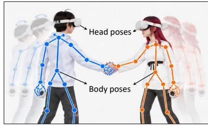  
Agent 1  
Agent 2  
Identity and World Selection

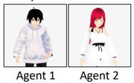

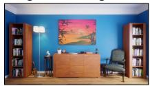  
Shared World  
First Frame Initialization

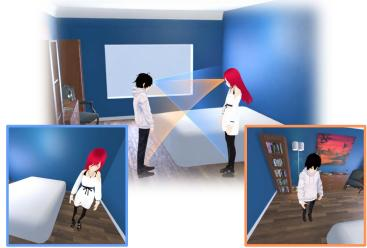  
Agent 1 View  
Agent 2 View  
(b) Generated Videos

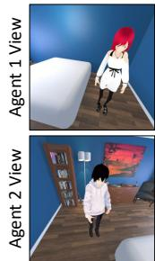  
Frame #1

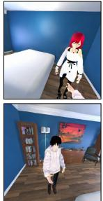  
Frame #15

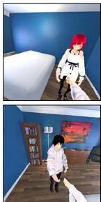  
Frame #30

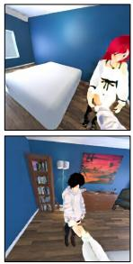  
Frame #45

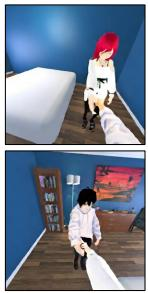  
Frame #60

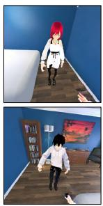  
Frame #70

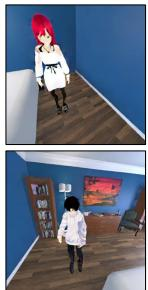  
Frame #77

Figure 1: Teaser. Given multi-agent motions, head poses, character identities, and a shared world with first-frame initialization in (a), ME-World jointly generates synchronized ego streams (b) that remain consistent in character identity, scene appearance, and interaction outcomes across agents.

## ABSTRACT

Egocentric world models predict first-person observations conditioned on an agent’s actions, but most focus on a single agent. Real embodied settings often involve multiple agents that act and interact within a shared environment. Existing multi-agent world models rely on coarse actions like locomotion, camera control, or discrete commands, leaving fine-grained embodied interactions underexplored. We formulate multi-agent egocentric world modeling as synchronized ego-stream generation for multiple agents interacting through fine-grained actions in a shared world. This requires cross-view action consistency, sharedenvironment consistency, and consistent propagation of interaction-induced state updates. We propose Multi-agent Egocentric World Model (ME-World), which jointly denoises multiple ego streams in a shared token sequence, conditions each stream on all agents’ target-view poses, and grounds generation with shared environment memory. We train and evaluate on real and synthetic multi-agent data and introduce shared-world consistency metrics for environment, update, and identity consistency. Experiments show ME-World improves shared-world consistency, action control, identity preservation, and video quality over existing methods.

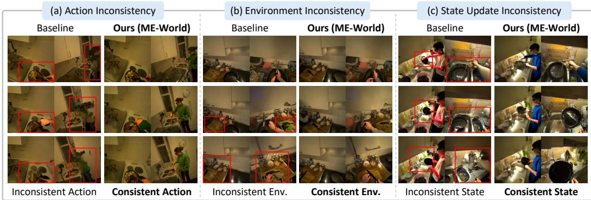  
Figure 2: Motivation. Three challenges in multi-agent egocentric world modeling. Without shared action conditioning, (a) actions are inconsistent across ego streams. Without joint generation, independent ego streams show (b) environment inconsistency and (c) inconsistent state updates.

## 1 INTRODUCTION

Video world models (Ha & Schmidhuber, 2018) generate future observations conditioned on a user’s actions or controls, enabling an agent to imagine how a scene may evolve without acting in the real world. Such action-conditioned prediction has been widely explored in autonomous driving (Gao et al., 2024), robotics (Kim et al., 2026b; Ye et al., 2026), open-domain world simulation (NVIDIA et al., 2025; Ball et al., 2025), and games (Wang et al., 2026; Tang et al., 2026). Recent work has extended it to egocentric world modeling (Zhang et al., 2026; Hao et al., 2026), where an embodied agent predicts its future first-person observations, or ego stream, conditioned on its own actions.

Most existing egocentric world models (Bai et al., 2026; Chen et al., 2026b; Gu et al., 2026; Pallotta et al., 2026; Xiu et al., 2026; Li et al., 2026) assume a single embodied ego, referred to as an agent, and capture how its actions shape its own future ego stream. In real-world settings, however, multiple agents often coexist and interact with one another and with shared objects, jointly changing a common, evolving state of the environment, objects, and agents, which we term the shared world state. A multi-agent world model must therefore make each interaction visible from every agent’s viewpoint and reflect the resulting state changes simultaneously across all observations.

Recent multi-agent egocentric world models (Savva et al., 2026; Wu et al., 2026; Hu et al., 2026b) extend egocentric world modeling to multiple agents in a shared environment. However, they mostly target domains where actions are abstracted into low-dimensional controls, such as discrete commands in multiplayer games (Enigma team, 2025), camera trajectories in driving and videos (Zhu et al., 2026; Sun et al., 2026), and robot control in manipulation (Liu et al., 2026). While such abstractions support multi-view generation under given controls, they fail to capture the dual role of fine-grained embodied actions as both first-person controls and cross-view observable events. In human interaction, body and hand motion, and head-induced viewpoint changes must remain consistent across agents, while the same interaction may also update shared objects and the environment.

We address this gap in embodied multi-agent settings as shown in Fig. 1, which arise naturally in multi-agent generative VR (Tu et al., 2026), embodied AI simulation (Puig et al., 2023), and multi robot collaboration (Chen et al., 2026a). In these setting, the challenge goes beyond generating different viewpoints of a common world. (i) Cross-view actions must be synchronized, so that an agent’s action appears plausible in its own stream and matches how others observe it (Fig. 2 (a)). (ii) The shared environment must remain consistent, so that ego streams do not depict conflicting layouts, appearances, or objects (Fig. 2 (b)). (iii) Interaction-induced state changes must propagate to every ego stream rather than diverging into conflicting object states or outcomes (Fig. 2 (c)). We therefore ask: How can a world model generate multiple ego streams consistent with a single evolving shared world, while each agents observe, act, and interact differently?

To address these challenges, we introduce Multi-agent Egocentric World Model (ME-World), which generates multiple ego streams as coupled observations of one shared world. Rather than generating each stream independently, ME-World performs joint multi-agent generation by denoising all streams in a shared token sequence, resolving interaction outcomes and state changes consistently across streams. To make this joint generation aware of embodied actions, we introduce shared action conditioning, which provides the target agent’s own motion and other agents’ motion observed from its stream. The generated streams are further grounded by shared environment memory, which provides view-aligned evidence by warping history observations into each target view, and common anchor references shared across all streams to maintain scene appearance. By coupling generation, action conditioning, and environment evidence across agents, ME-World maintains consistency in cross-view actions, shared environment, and interaction-induced state updates.

Learning this model requires synchronized multi-ego data sharing one world state. Existing egocentric datasets (Grauman et al., 2022; 2024; Sener et al., 2022; Rai et al., 2021; Sigurdsson et al., 2018; Damen et al., 2018; Jia et al., 2020; Ma et al., 2024) primarily capture single agents, or lack coverage of agent number, viewpoint diversity, interactions, and appearance variation. We therefore combine real multi-ego data (Gavryushin et al., 2026) with synthetic multi-ego data (Xu et al., 2024; Liang et al., 2024) covering diverse agent configurations, environments, and interaction scenarios.

Finally, we introduce an evaluation protocol for shared-world consistency. Existing evaluations measure video quality (Unterthiner et al., 2019; Zhang et al., 2018), control alignment (Gu et al., 2026), and cross-view consistency through geometric agreement or VLM-based judgments (Wu et al., 2026; Hu et al., 2026b; Savva et al., 2026), but do not assess whether multiple ego streams consistently represent the same evolving shared world beyond directly provided input. We therefore propose $S _ { \mathrm { e n v } }$ , which measures whether newly generated environment regions remain consistent across ego streams, and $S _ { \mathrm { u p d a t e } } ,$ , which measures whether interaction-induced state changes, such as a moved frying pan, are reflected consistently across views. On the synthetic benchmark, we further report $S _ { \mathrm { i d } }$ for identity preservation with respect to ground-truth reference characters. These metrics complement quality and control metrics for evaluating embodied multi-agent world modeling.

ME-World consistently improves shared-world consistency, action control, identity preservation, and video quality on real and synthetic benchmarks. Ablations validate our three core components, showing the importance of modeling ego streams as coupled observations of one evolving world.

Our contributions are summarized as follows:

• We introduce embodied multi-agent world modeling for synchronized ego stream generation among multiple agents interacting in a shared world. We propose ME-World, coupling streams via joint generation, shared action, and shared environment memory.

• We combine real and synthetic multi-agent data covering diverse environments, appearances, and interactions. We introduce shared-world consistency metrics evaluating whether ego streams depict the same environment and reflect induced state changes.

## 2 RELATED WORKS

Egocentric World Models. Some egocentric world models condition on whole-body motion (Bai et al., 2026; Tu et al., 2026; Pallotta et al., 2026), fine-grained hand and camera control (Xie et al., 2026; Chen et al., 2026b), or jointly generated body motion (Xiu et al., 2026). Others model human world interaction through dexterous manipulation (Kim et al., 2026a; Goswami et al., 2026), explicit 3D memory (Gu et al., 2026; Yan et al., 2026), or goal-directed world evolution (Hao et al., 2026; Li et al., 2026; Shen et al., 2026). These focus on a single agent, whereas we model multiple embodied agents whose actions and interaction-induced changes remain consistent across ego views within a shared world.

Multi-agent World Models. Recent video world models extend to multiple agents whose actions and observations are coupled through a shared environment, including multiplayer games (Enigma team, 2025; Savva et al., 2026; Wu et al., 2026; Liu et al., 2026; Po et al., 2026; Hu et al., 2026a), driving (Zhu et al., 2026), robotics (Wu et al., 2026; Liu et al., 2026), and open-domain videos (Hu et al., 2026b). A challenge is maintaining a coherent world across controlled views, addressed via joint or cross-agent attention (Savva et al., 2026; Sun et al., 2026; Hu et al., 2026b; Liu et al., 2026; Zhu et al., 2026), shared scene representations (Wu et al., 2026), or shared memories and explicit world states (Po et al., 2026; Mo et al., 2026; Cai et al., 2026; Zhao et al., 2026; Xu et al., 2026). In contrast, we study synchronized egocentric views of interacting humans, where finegrained articulated actions must remain consistent across ego streams while affecting other agents and the shared environment.

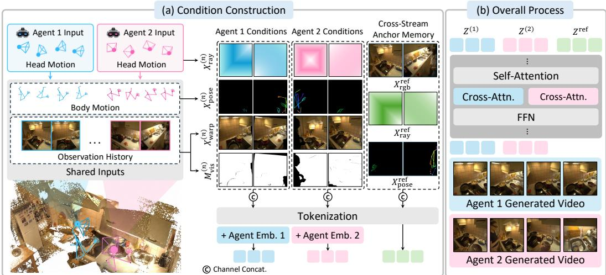  
Figure 3: Overall architecture (a) For each agent, ME-World builds viewing ray conditions and shared-action conditions from agents’ input and build shared environment memory from the both agents’ history. (b) ME-World jointly generates synchronized ego streams.

## 3 METHOD

## 3.1 OVERVIEW AND FORMULATION

ME-World addresses embodied multi-agent world modeling, where N agents act and interact in the same evolving shared world while observing it from their own egocentric viewpoints. Given each agent’s future embodied action sequence, text prompt, initial ego frame and observation history, our goal is to generate future ego streams for all agents, with each stream following its own action and all streams remaining consistent with the same shared environment and shared world state.

For each n-th agent, we denote its future ego stream and action sequence which includes head and body motion as $X ^ { ( n ) } = \{ x _ { t } ^ { ( n ) } \} _ { t = 1 } ^ { T }$ , and $A ^ { ( n ) } = \{ a _ { t } ^ { ( n ) } \} _ { t = 1 } ^ { T }$ , where T is the length of frames. We also denote its text prompt and initial ego frame as $P ^ { ( n ) }$ and $x _ { 0 } ^ { ( n ) }$ , respectively. The observation histories of all agents are pooled into shared observation-history pool E. The full conditioning signal is defined as $C = \{ \bar { E } , A ^ { ( 1 : N ) } , P ^ { ( 1 : N ) } , x _ { 0 } ^ { ( 1 : N ) } \}$ , where $A ^ { ( 1 : N ) } , P ^ { ( 1 : N ) }$ , and $x _ { 0 } ^ { ( 1 : N ) }$ denote the action sequences, text prompts and initial ego frames of all agents, respectively.

The formulation is general to N agents, but for clarity we present the two-agent case used in our experiments. The key challenge is that each agent observes only a partial view of the world, while the generated streams must agree on the shared environment, the agents’ actions, and interaction induced state changes. To address this, ME-World couples ego streams through joint multi-agent generation (Sec. 3.2), guides them with shared action conditioning (Sec. 3.3), and grounds them with shared environment memory (Sec. 3.4). The overall architecture is shown in Fig. 3.

## 3.2 JOINT MULTI-AGENT GENERATION

Since agents interact within the same environment, their ego streams are not independent. When an action changes the state of an agent, object, or region, this update should be reflected in all relevant ego streams rather than resolved separately per stream. We therefore generate all streams jointly within a single pretrained video diffusion transformer (DiT) (Ali et al., 2025), as shown in Fig. 3 (b). Rather than generating each stream independently, the model jointly denoises their latent sequences under the conditioning C, allowing cross-stream information exchange. Formally, it learns the joint conditional distribution $\smash { p _ { \theta } ( X ^ { ( 1 ) } , . . . , X ^ { ( N ) } \mid C ) }$ , where θ denotes the model parameters.

Using a frozen video VAE, each ego stream $X ^ { ( n ) }$ is encoded into a latent sequence $Z ^ { ( n ) }$ . During denoising, all agents’ noisy latents at timestep τ are concatenated along the token dimension as:

$$
Z _ { \tau } ^ { \mathrm { g e n } } = \left[ Z _ { \tau } ^ { ( 1 ) } ; \dots ; Z _ { \tau } ^ { ( N ) } \right] .\tag{1}
$$

The DiT processes this joint sequence with self-attention, allowing evidence from one ego stream to inform others, so all streams evolve as mutually informed observations of the same shared world rather than isolated videos. Within this joint sequence, however, the model must still identify which stream each token belongs to and which conditions it should follow. We apply identical rotary positional embeddings (RoPE) (Su et al., 2023) to all streams, aligning their space-time positions in a common positional frame, and distinguish the streams by adding a learnable agent embedding $e ^ { ( n ) }$ to the tokens of n-th agent. For text conditioning, each stream uses a separate cross-attention path, since different agents may observe different regions of the same scene. Each stream thus follows its own prompt $P ^ { ( n ) }$ , while visual information is shared through joint self-attention.

## 3.3 SHARED ACTION CONDITIONING

Joint generation allows ego streams to exchange information through self-attention, but does not specify how each agent should move in the shared world. A straightforward method is to condition each ego stream on its own action, treating the action as private to the stream. However, in multiagent generation, an agent’s action is also observed from other agents’ viewpoints and can change the shared world state via interaction. If each stream receives only its own action, the same embodied interaction may be rendered inconsistently across viewpoints. We therefore use shared action conditioning, guiding each ego stream with all agent’s motion rather than by its own action alone.

For each n-th agent, the action at frame t is decomposed into body and head motion as $a _ { t } ^ { ( n ) } =$ $\{ a _ { t , \mathrm { b o d y } } ^ { ( n ) } , a _ { t , \mathrm { h e a d } } ^ { ( n ) } \}$ . The body motion $a _ { t , \mathrm { b o d y } } ^ { ( n ) }$ is encoded as a self-action skeleton map capturing egovisible hand and arm motion. The head motion $a _ { t , \mathrm { h e a d } } ^ { ( n ) }$ is treated as an action in egocentric generation, since it determines the agent’s camera trajectory and visible region. Head motion is represented with Plucker ray maps, which provide a geometric encoding of the induced camera rays.¨

To construct the shared action condition for n-th agent’s ego stream, we define a pose condition sequence $X _ { \mathrm { p o s e } } ^ { ( n ) } = \{ x _ { t , \mathrm { p o s e } } ^ { ( n ) } \} _ { t = 1 } ^ { T } . \mathrm { A t }$ each frame, $x _ { t , \mathrm { p o s e } } ^ { ( n ) }$ is rendered on the target image plane using n-th agent’s self-action skeleton map $a _ { t , \mathrm { b o d y } } ^ { ( n ) }$ , other agents’ 3D body poses, and relative camera geometry. The skeleton map captures the ego-visible own hand and arm motion, while other agents’ poses are projected to n-th agent’s camera coordinates. This yields a unified pose condition representing both n-th agent’s own motion and the visible motions of other agents in n-th agent’s ego view.

For head motion, we collect Plucker ray maps as¨ $X _ { \mathrm { r a y } } ^ { ( n ) } = \{ a _ { t , \mathrm { h e a d } } ^ { ( n ) } \} _ { t = 1 } ^ { T }$ , encoding per-pixel camera rays induced by n-th agent’s head motion. We express all ray maps in a shared canonical frame, making camera trajectories and viewing directions across ego streams geometrically comparable.

$X _ { \mathrm { p o s e } } ^ { ( n ) }$ is encoded with a frozen VAE encoder, while $X _ { \mathrm { r a y } } ^ { ( n ) }$ is projected with an MLP. The encoded pose and ray features are concatenated with the noisy latent $Z _ { \tau } ^ { ( n ) }$ along the channel dimension and combined with the remaining conditions for joint denoising. Unlike conditioning each ego stream only on the target agent’s own motion, shared action conditioning renders other agents’ body poses into the target ego view, giving the model explicit cross-agent motion cues. This is important for finegrained embodied interaction, where hands, arms, body pose, and gaze-induced viewpoint changes must remain consistent across ego streams. As a result, the model better represents interactions such as approaching, manipulating, or responding to another agent within the same shared world.

## 3.4 SHARED ENVIRONMENT MEMORY

Shared action conditioning makes the agents’ actions explicit, but it does not tell the model what the surrounding world should look like. Even with joint self-attention, each ego stream still observes only a partial view, so the model may lack a common reference for scene layout, background appearance, and object state. We therefore introduce shared environment memory from the shared observation-history pool E, which aggregates the observation histories of all agents.

A straightforward way to use this memory is to feed the selected history images as reference images. However, using the history images as references conditions each stream only implicitly, where it does not specify what each generated frame should depict in that agent’s view. We therefore introduce the stream-aligned geometric memory path, which transforms relevant observations in

E into target-view conditions for each ego stream, providing geometry-aligned evidence for the frames being generated. Such evidence, however, constrains only the regions it covers and discards the original appearance. The cross-stream anchor memory path complements it by appending selected observations in their clean, unwarped form as shared anchor tokens, anchoring the global appearance and grounding all streams in the same environment during joint denoising.

Stream-Aligned Geometric Memory. The stream-aligned geometric memory path makes the shared environment memory directly usable for each target ego stream. Since history images in $E$ come from past viewpoints, they may not directly match the ego viewpoint. For each target stream, we select the history image $\bar { X _ { \mathrm { h i s t } } }$ whose reprojection gives the largest valid coverage of the target view, and warp it according to n-agent’s target ray condition $X _ { \mathrm { r a y } } ^ { ( \bar { n } ) }$ . During projection, we mask dynamic agent regions using SAM3 (Carion et al., 2026) to avoid transferring outdated poses. This warping yields a warped RGB condition $X _ { \mathrm { w a r r } } ^ { ( n ) }$ and a visibility mask $M _ { \mathrm { v i s } } ^ { ( n ) }$ , which provide aligned scene evidence and indicate supported regions, respectively. We encode these conditions with a frozen VAE encoder and concatenate them with the noisy latent $Z _ { \tau } ^ { ( n ) }$ along the channel dimension, directly conditioning denoising on the aligned scene evidence.

Cross-Stream Anchor Memory. While stream-aligned geometric memory provides target-view guidance, it is inherently view-specific so that each stream is conditioned only on evidence that can be reliably projected into its own viewpoint, rather than on a holistic view of the scene. This can leave regions missing, discard clean appearance cues from the original observations, and limit the model’s understanding of the shared environment as a whole. To complement this, the cross-stream anchor memory path preserves selected history images from E in their original, unwarped form as shared scene references. We greedily select $\check { K }$ history observations, choosing each new anchor to maximize the target-view regions not covered by previously selected anchors, so that the anchors provide complementary scene coverage. The selected observations are encoded by the VAE into reference features $Z _ { \mathrm { r e f } } = \{ z _ { \mathrm { r e f } } ^ { k } \} _ { k = 1 } ^ { K }$ and appended to the joint denoising sequence along the token dimension, allowing all ego streams to attend to the same anchors during generation. Extending Eq. 1 with shared environment memory, the input joint sequence to the DiT is formed as:

$$
{ \cal Z } _ { \tau } ^ { \mathrm { j o i n t } } = [ { \cal Z } _ { \tau } ^ { \mathrm { g e n } } ; { \cal Z } _ { \mathrm { r e f } } ] ,
$$

where each $Z _ { \tau } ^ { ( n ) }$ is channel-wise concatenated with shared action and stream-aligned conditions, and $Z _ { \mathrm { r e f } }$ denotes the cross-stream anchor features augmented with corresponding camera-ray and shared action conditions.

## 3.5 TRAINING OBJECTIVE

We fine-tune the pretrained model with rectified flow (Liu et al., 2022). Let $Z _ { 0 } ^ { \mathrm { g e n } } = [ Z _ { 0 } ^ { ( 1 ) } ; \dots ; Z _ { 0 } ^ { ( N ) } ]$ denote the clean latents of all agents, and $\epsilon ^ { \mathrm { g e n } } = \lvert \epsilon ^ { ( 1 ) } ; \ldots ; \epsilon ^ { ( N ) } \rvert$ where $\epsilon ^ { ( n ) } \sim \mathcal { N } ( 0 , I )$ . For $\tau \sim \mathcal { U } ( 0 , 1 )$ , we construct $Z _ { \tau } ^ { \mathrm { g e n } } \bar { = } ( 1 - \tau ) Z _ { 0 } ^ { \mathrm { g e n } } + \tau \epsilon ^ { \bar { \mathrm { g e n } } }$ . The model $f _ { \theta }$ is trained with

$$
\begin{array} { r } { \mathcal { L } _ { \mathrm { F M } } = \mathbb { E } _ { Z _ { 0 } , \epsilon , \tau , C } \left[ \left| \left| f _ { \theta } \left( Z _ { \tau } ^ { \mathrm { j o i n t } } , \tau , C \right) - ( \epsilon ^ { \mathrm { g e n } } - Z _ { 0 } ^ { \mathrm { g e n } } ) \right| \right| _ { 2 } ^ { 2 } \right] . } \end{array}
$$

## 4 EXPERIMENTS

## 4.1 SHARED-WORLD CONSISTENCY METRIC

Existing multi-agent world models evaluate cross-view consistency using geometric agreement or VLM-based judgments (Wu et al., 2026; Hu et al., 2026b; Savva et al., 2026). However, such consistency can arise directly from shared input conditions, making it difficult to isolate the consistency established by the model itself. Distinguishing this consistency is critical for assessing whether the model can maintain a shared environment beyond the explicit input. We therefore introduce $S _ { \mathrm { e n v } }$ which measures environment consistency only in regions not directly provided by geometric memory. Beyond the environment itself, a coherent shared world should consistently reflect interactioninduced state changes across agent views, which we measure with $S _ { \mathrm { u p d a t e } }$ . It should also preserve the identity of each agent when observed from different viewpoints, which we measure with $S _ { \mathrm { i d } }$

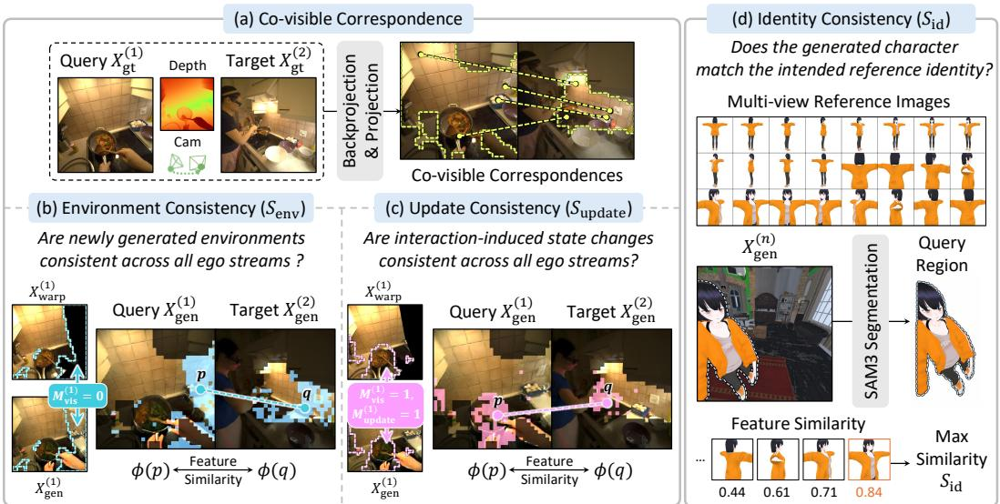  
Figure 4: Evaluation Protocol for Shared-World Consistency. We evaluate generated environments with $S _ { \mathrm { e n v } }$ , state updates with $S _ { \mathrm { u p d a t e } } ,$ and identity with $S _ { \mathrm { i d } }$ . Ground-truth geometry is used only to establish co-visible correspondences, while consistency is measured on generated streams.

For evaluation, we denote the n-th agent’s ground-truth and generated stream as $X _ { \mathrm { g t } } ^ { ( n ) }$ and $X _ { \mathrm { g e n } } ^ { ( n ) }$ respectively. Fig. 4 (a) visualizes, on ground-truth views for clarity, the co-visible correspondences used for $S _ { \mathrm { e n v } }$ and $S _ { \mathrm { u p d a t e } } ,$ obtained from metric depth and ground-truth camera poses. These scores are computed on generated stream pairs. We report $S _ { \mathrm { e n v } }$ and $S _ { \mathrm { u p d a t e } }$ on the real dataset, and all three metrics on synthetic dataset (Appendix C.1), where distinct character appearances enable referencebased $S _ { \mathrm { i d } }$ evaluation. Additional details are provided in Appendix B.1. For clarity, we describe metrics using 1st agent as the query stream and 2nd agent as the paired stream.

Environment Consistency. $S _ { \mathrm { e n v } }$ evaluates whether the model maintains a shared environment in regions unsupported by warped history. For a query stream $X _ { \mathrm { g e n } } ^ { ( 1 ) }$ , we select regions where $M _ { \mathrm { v i s } } ^ { ( 1 ) } = 0 .$ meaning $X _ { \mathrm { w a r p } } ^ { ( 1 ) }$ provides no valid scene guidance. We measure DINOv3 feature similarity between these regions and corresponding regions in $X _ { \mathrm { g e n } } ^ { ( 2 ) }$ defined by co-visible correspondence, since they should depict the same shared environment despite lacking warped-history guidance.

State Update Consistency. $S _ { \mathrm { u p d a t e } }$ evaluates whether regions updated from the warped history are consistent across ego streams. We define an update mask $M _ { \mathrm { u p d a t e } } ^ { ( 1 ) }$ by comparing $X _ { \mathrm { g e n } } ^ { ( 1 ) }$ with $X _ { \mathrm { w a r p } } ^ { ( 1 ) }$ in feature space, where high feature difference indicates generated content that has changed from the history. For query stream $X _ { \mathrm { g e n } } ^ { ( 1 ) }$ , we select regions with valid warped-history guidance and detected updates, where $M _ { \mathrm { v i s } } ^ { ( 1 ) } = 1$ and $M _ { \mathrm { u p d a t e } } ^ { ( 1 ) } = 1$ . We measure DINOv3 feature similarity (Simeoni et al.,´ 2025) between these updated regions and the corresponding regions in $X _ { \mathrm { g e n } } ^ { ( 2 ) }$ defined by co-visible correspondences, since interaction-induced changes should appear as shared-world updates.

Identity Consistency. On the synthetic benchmark, $S _ { \mathrm { i d } }$ evaluates whether the visible other agent preserves its intended appearance as part of the shared world. For each generated stream, we extract the visible other agent using SAM3 (Carion et al., 2026) and compute its DINOv3 feature (Simeoni´ et al., 2025). We then compare it with the multi-view reference features of the corresponding groundtruth character and use the maximum cosine similarity as the identity score. This measures whether different ego streams depict the same counterpart in the shared world, rather than drifting to inconsistent character identities. The final score is averaged over valid frames and ego streams.

## 4.2 IMPLEMENTATION DETAILS

Model and Training Setup. We initialize from the Cosmos-Predict2.5 2B(Ali et al., 2025) multiview diffusion transformer. We train separate models on fine-tuning the DiT and conditioning modules while keeping the video VAE and text encoder frozen. We use the rectified-flow objective with AdamW (Loshchilov & Hutter, 2019), a learning rate of $3 \times 1 0 ^ { - 5 }$ , and a global batch size of 4 on

GT  
(a) Ours  
(b) GEN3C  
(c) AnyView  
(d) EgoSim  
(e) JointControl  
(f) DreamX  
(g) LingBot  
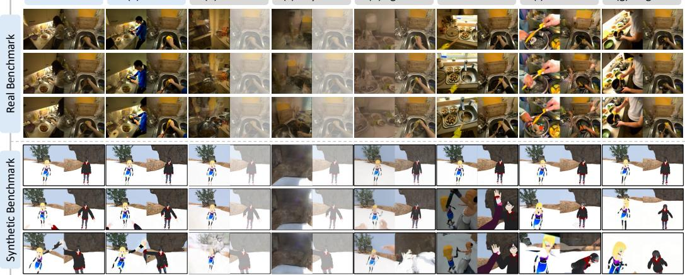  
Figure 5: Qualitative Comparison with Existing Methods. We compare ME-World on the real (top) and synthetic (bottom) benchmarks. Each column shows three timestamps from two synchronized ego streams. For multi-view baselines, the ground-truth conditioning stream is shown with reduced opacity. Best viewed zoomed in.

GT  
(a) Ours  
(b) MultiWorld  
(c) Solaris  
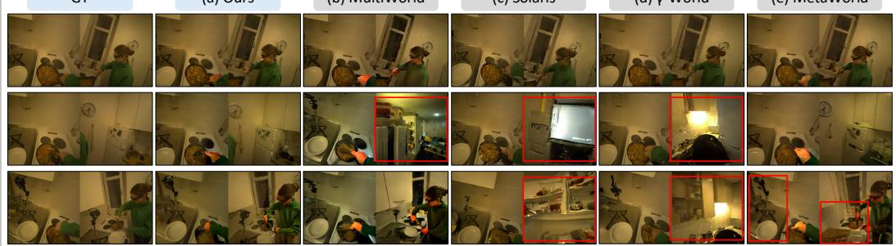  
(d) γ-World  
(e) MetaWorld  
Figure 6: Qualitative Comparison with Multi-Agent World Models. We compare ME-World with existing multi-agent world models on the real benchmark. Each column shows three timestamps from two synchronized ego streams. ME-World better preserves a coherent shared environment and synchronized interactions across the two viewpoints. Best viewed zoomed in.

four A100 GPUs. At inference, we use 35 denoising steps and a classifier-free guidance scale of 7.0.   
Further details are provided in Appendix D.2.

Evaluation Metrics. We also evaluate camera control, self-action control, other-agent action control, and video quality. For camera control, we use Translation Error (Trans. Err) and Rotation Error (Rot. Err). Following E3C (Gu et al., 2026), self-action control measures the agent’s hand presence and alignment using Hand-F1 and Hand-mIoU, while other-agent action control measures the visibility and pose alignment using Full-Body-F1 and PCK@10. For video quality, we report PSNR (Huynh-Thu & Ghanbari, 2008), SSIM (Wang et al., 2004), LPIPS (Zhang et al., 2018), and FVD (Unterthiner et al., 2019). Additional details are provided in Appendix B.2.

Baselines. We compare three categories of methods: (i) multi-view video generation models (GEN3C (Ren et al., 2025), AnyView-DVS (Van Hoorick et al., 2026)), (ii) single-ego world models (EgoSim (Hao et al., 2026), JointControlVideo (Zhang et al., 2026)), and (iii) general world models (DreamX-World (DreamX Team et al., 2026), LingBot-World (Robbyant Team et al., 2026)). All baselines use released checkpoints without fine-tuning and receives their supported conditions. Multi-view models use ground-truth source videos, whereas single-ego and general world models generate the two streams independently. Implementations details are provided in the Appendix B.3.

Multi-Agent Baselines. To further compare with recent multi-agent world models under a controlled setting, we adapt MultiWorld (Wu et al., 2026), Solaris (Savva et al., 2026), γ-World (Liu et al., 2026), and MetaWorld (Hu et al., 2026b) to our embodied multi-agent setting. All adaptations use the same backbone, training data, and Shared Action Conditioning as ME-World, while retaining the characteristic multi-agent and scene-conditioning mechanisms of each method. Implementation details provided in Appendix B.3.4.

Table 1: Quantitative Comparison with Existing Methods. We compare ME-World with multiview generation, single-ego world, and general world models on the real and synthetic benchmarks. N/A denotes metrics that are not applicable to a benchmark.
<table><tr><td rowspan="2">Method</td><td colspan="2">Shared-World Consistency Senv ↑</td><td colspan="2">Camera Control</td><td colspan="2">Self Action Control</td><td colspan="2">Other-Agent Action Control</td><td colspan="4">Video Quality</td></tr><tr><td>Supdate ↑</td><td></td><td>Sid ↑</td><td>Trans. Err.↓</td><td>Rot. Err.↓ Hand-F1↑ Real Benchmark</td><td>Hand-mIoU↑|</td><td>|Full-Body-F1↑</td><td>Full-Body-PCK↑</td><td>PSNR↑</td><td>SSIM↑</td><td>LPIPS↓</td><td>FVD↓</td></tr><tr><td colspan="10"></td><td colspan="3"></td></tr><tr><td>GEN3C (Ren et al., 2025)</td><td>0.417</td><td>0.412</td><td>N/A</td><td>0.12</td><td>12.376 0.537 4.736</td><td>0.087</td><td>0.229</td><td>0.456</td><td>18.083</td><td></td><td>0.582 0.444</td><td>1358</td></tr><tr><td>AnyView-DVS (Van Hoorick et al., 2026)</td><td>0.332</td><td>0.319</td><td>N/A</td><td>0.079</td><td>0.169</td><td>0.005</td><td>0.037</td><td>0.071</td><td>15.899</td><td>0.546</td><td>0.603</td><td>1834.9</td></tr><tr><td>EgoSim (Hao et al., 2026)</td><td>0.332</td><td>0.319 N/A</td><td></td><td>0.114</td><td>11.501 0.75</td><td>0.393</td><td>0.274</td><td>0.514</td><td>16.398</td><td>0.574</td><td>0.448</td><td>1012.7</td></tr><tr><td>JointControlVideo (Zhang et al., 2026)</td><td>0.328</td><td>0.291 N/A</td><td>0.166</td><td>21.663</td><td>0.799</td><td>0.249</td><td>0.215</td><td>0.402</td><td>15.18</td><td>0.473</td><td>0.574</td><td>694</td></tr><tr><td>DreamX-World (DreamX Team et al., 2026)</td><td>0.306 0.279</td><td>N/A</td><td>0.145</td><td>15.979</td><td>0.754</td><td>0.06</td><td>0.342</td><td>0.274</td><td>14.045</td><td>0.442</td><td>0.618</td><td>1098.9</td></tr><tr><td>LingBot-World (Robbyant Team et al., 2026)</td><td>0.329 0.284</td><td>N/A</td><td>0.105</td><td>13.173</td><td>0.738</td><td>0.064</td><td>0.395</td><td>0.243</td><td>14.8421</td><td>0.489</td><td>0.576</td><td>689.9</td></tr><tr><td>ME-World (Ours)</td><td>0.468 0.466</td><td>N/A</td><td>0.042</td><td>2.256</td><td>0.888</td><td>0.531</td><td>0.822</td><td>0.881</td><td>19.849</td><td>0.656</td><td>0.289</td><td>637.9</td></tr><tr><td colspan="10">Synthetic Benchmark</td><td colspan="3"></td></tr><tr><td>GEN3C (Ren et al., 2025)</td><td>0.414</td><td>0.406</td><td>0.433</td><td>0.438</td><td>21.459</td><td></td><td></td><td></td><td></td><td></td><td></td><td>1299.3</td></tr><tr><td>AnyView-DVS (Van Hoorick et al., 2026)</td><td>0.402</td><td>0.383</td><td>0.238</td><td>0.23</td><td>0.286 9.004 0.014</td><td>0.051 0.0</td><td>0.307 0.064</td><td>0.226 0.038</td><td>15.032 13.446</td><td>0.572 0.498</td><td>0.488 0.667</td><td>1523</td></tr><tr><td>EgoSim (Hao et al., 2026)</td><td>0.318</td><td>0.301</td><td>0.43</td><td>0.363</td><td>18.193 0.441</td><td>0.095</td><td>0.387</td><td>0.278</td><td>14.235</td><td>0.526</td><td>0.534</td><td>1205.7</td></tr><tr><td>JointControlVideo (Zhang et al., 2026)</td><td>0.306</td><td>0.27</td><td>0.518</td><td>0.513</td><td>29.977 0.527</td><td>0.12</td><td>0.315</td><td>0.131</td><td>11.706</td><td>0.462</td><td>0.613</td><td>886.1</td></tr><tr><td>DreamX-World (DreamX Team et al., 2026)</td><td>0.38</td><td>0.358 0.484</td><td></td><td>0.413 22.644</td><td>0.26</td><td>0.016</td><td>0.347</td><td>0.127</td><td>12.17</td><td>0.456</td><td>0.599</td><td>1169.5</td></tr><tr><td>LingBot-World (Robbyant Team et al., 2026)</td><td>0.249</td><td>0.21 0.5</td><td></td><td>0.463</td><td>29.962 0.271</td><td>0.01</td><td>0.316</td><td>0.09</td><td>10.577</td><td>0.489</td><td>0.65</td><td>841.5</td></tr><tr><td>ME-World (Ours)</td><td>0.441</td><td>0.436</td><td>0.561</td><td>0.293</td><td>9.057 0.593</td><td>0.587</td><td>0.506</td><td>0.644</td><td>16.595</td><td>0.621</td><td>0.328</td><td>465.5</td></tr></table>

Table 2: Quantitative Comparison with Multi-Agent World Models. We compare ME-World with multi-agent world models on the real benchmark. Since existing multi-agent world models are designed for different domains and control interfaces, we adapt them to our embodied multi-agent setting for a controlled comparison.
<table><tr><td></td><td colspan="2">Shared-World Consistency</td><td colspan="2">Camera Control</td><td colspan="2">Self Action Control</td><td colspan="2">Other-Agent Action Control</td><td colspan="4">Video Quality</td></tr><tr><td>Method</td><td>| Senv ↑</td><td>Supdate ↑</td><td>| Trans. Err.↓</td><td>Rot. Err.↓</td><td>Hand-F1↑ Real Benchmark</td><td>Hand-mIoU↑</td><td>Full-Body-F1↑</td><td>Full-Body-PCK↑</td><td>PSNR↑</td><td>SSIM↑</td><td>LPIPS.↓</td><td>FVD↓</td></tr><tr><td colspan="9"></td><td colspan="5"></td></tr><tr><td>MultiWorld (Wu et al., 2026)</td><td>0.395</td><td>0.376</td><td>0.113</td><td>11.616</td><td>0.868</td><td>0.497</td><td>0.804</td><td>0.837</td><td>15.323</td><td>0.481</td><td>0.525</td><td></td><td>694</td></tr><tr><td>Solaris (Savva et al., 2026)</td><td>0.324</td><td>0.293</td><td>0.171</td><td>27.18</td><td>0.709</td><td>0.048</td><td>0.146</td><td>0.236</td><td>14.98</td><td>0.474</td><td></td><td>0.594</td><td>984.2</td></tr><tr><td>γ-World (Liu et al., 2026)</td><td>0.304</td><td>0.266</td><td>0.181</td><td>24.414</td><td>0.758</td><td>0.064</td><td>0.188</td><td>0.214</td><td></td><td>14.892</td><td>0.469</td><td>0.584</td><td>788</td></tr><tr><td>MetaWorld (Hu et al., 2026b)</td><td>0.421</td><td>0.413</td><td>0.054</td><td>4.086</td><td>0.865</td><td>0.379</td><td>0.816</td><td>0.787</td><td></td><td>18.928</td><td>0.627</td><td>0.329</td><td>704.4</td></tr><tr><td>ME-World (Ours)</td><td>0.468</td><td>0.466</td><td>0.042</td><td>2.256</td><td>0.888</td><td>0.531</td><td>0.822</td><td>0.881</td><td></td><td>19.849</td><td>0.656</td><td>0.289</td><td>637.9</td></tr></table>

## 4.3 RESULTS

Real Benchmark. Tab. 1 and Fig. 5 compare ME-World with multi-view generation models (Ren et al., 2025; Van Hoorick et al., 2026), single-ego world models (Hao et al., 2026; Zhang et al., 2026), and general world models (DreamX Team et al., 2026; Robbyant Team et al., 2026) on the real (Gavryushin et al., 2026) and synthetic benchmarks. Multi-view methods use one agent’s ground-truth ego stream as a reference, but still show lower shared-world consistency and blurry or ghosted actions, indicating that reference-stream synthesis alone cannot resolve interactions across agents. Single-ego world models follow the target agent’s action, but lack conditioning for the other agent, leading to weaker other-agent action control and mismatched motions under dynamic viewpoints. General world models generate plausible individual streams, but often fail to keep the two ego streams consistent in environment and interaction outcomes. In contrast, ME-World consistently improves shared-world consistency, self- and other-agent action control, and video quality while producing coherent scenes and synchronized interactions. Additional results are in Appendix A.1.

Synthetic Benchmark. The synthetic benchmark enables reference-based evaluation of counterpart identity preservation with Sid, as each agent is assigned a distinct character appearance. Existing methods often fail to preserve the appearance and produce mismatched motions across ego streams, causing identity drift and inconsistent interactions. In contrast, ME-World achieves the strongest shared-world consistency, improves camera control, self- and other-agent action control, and video quality. Additional synthetic results, including broader multi-agent and autoregressive generation settings, are provided in Appendix A.1 and A.2.

Multi-Agent Baselines. Tab. 2 and Fig. 6 compare ME-World with multi-agent world models. For a controlled comparison in our embodied egocentric setting, we adapt each method using the same video backbone NVIDIA et al. (2025), training data Gavryushin et al. (2026), and Shared Action Conditioning as ME-

Table 3: Adapted Multi-Agent Architectures. ✓ uses the corresponding ME-World component, △ denotes a methodspecific replacement, and × no explicit counterpart.
<table><tr><td>Method</td><td>Joint Multi-Agent Generation</td><td>Shared Action Conditioning</td><td>Shared Environment Memory</td></tr><tr><td>MultiWorld (Wu et al., 2026)</td><td>√</td><td>√</td><td>△</td></tr><tr><td>Solaris (Savva et al., 2026)</td><td>√</td><td>√</td><td>X</td></tr><tr><td>γ-World (Liu et al., 2026)</td><td>△</td><td>√</td><td>×</td></tr><tr><td>MetaWorld (Hu et al., 2026b)</td><td>△</td><td>√</td><td>△</td></tr><tr><td>ME-World</td><td>√</td><td>√</td><td>√</td></tr></table>

World. MultiWorld (Wu et al., 2026) and MetaWorld (Hu et al., 2026b) achieve relatively strong action control, with MetaWorld also showing the strongest shared-world consistency and video quality among the baselines. In contrast, Solaris (Savva et al., 2026) and γ-World (Liu et al., 2026) show larger degradation in shared-world consistency and fine-grained action control under our embodied setting. ME-World achieves the best performance across all metrics, demonstrating stronger shared world consistency, action control, and video quality. Tab. 3 summarizes the resulting adaptations. MultiWorld replaces our Shared Environment Memory with its VGGT-based Global State Encoder, while Solaris uses no explicit environment-conditioning module. γ-World replaces joint full self attention with Sparse Hub Attention and Simplex Rotary Agent Encoding, whereas MetaWorld uses World-State Alignment with warped observations and depth-based conditions. We reimplement MetaWorld World-State Alignment following the paper, as no official implementation is publicly available.

Table 4: Component Ablation Results. We evaluate the effects of each component. ’FT’ means fine-tuned by our real dataset.
<table><tr><td rowspan="2">Index Variant</td><td rowspan="2"></td><td rowspan="2">| FT | Senv ↑</td><td colspan="2">Shared-World Consistency</td><td colspan="2">Camera Control</td><td colspan="2">Self Action Control</td><td colspan="2">Other-Agent Action Control</td><td colspan="3">Video Quality</td></tr><tr><td></td><td>Supdate ↑</td><td>Trans. Err.↓</td><td>Rot. Err.↓</td><td>Hand-F1↑</td><td>Hand-mIoU↑</td><td>Full-Body-F1↑ Full-Body-PCK↑</td><td>PSNR↑</td><td>SSIM↑</td><td>LPIPS↓</td><td>FVD↓</td></tr><tr><td colspan="10"></td><td colspan="5"></td></tr><tr><td>(2)</td><td>Cosmos-Predict2.5 (I2V + Text)</td><td></td><td>0.289</td><td>0.245</td><td>0.178</td><td>19.993</td><td>0.783</td><td>0.080</td><td>0.248</td><td>0.284</td><td>14.701</td><td>0.468</td><td>0.586</td><td>1006</td></tr><tr><td></td><td>Cosmos-Predict2.5 (I2V + Text)</td><td>×&gt;</td><td>0.290</td><td>0.249</td><td>0.170</td><td>24.513</td><td>0.789</td><td>0.079</td><td>0.238</td><td>0.309</td><td>14.941</td><td>0.473</td><td>0.602</td><td>768.3</td></tr><tr><td>(3)</td><td></td><td></td><td>0.401</td><td>0.388</td><td>0.056</td><td>4.998</td><td>0.857</td><td>0.457</td><td>0.580</td><td>0.385</td><td>18.835</td><td>0.628</td><td>0.349</td><td>558.6</td></tr><tr><td>(4)</td><td>(2) + Self Hand Pose + History Warp (3) + Joint Gen.</td><td>&gt;&gt;</td><td>0.426</td><td>0.421</td><td>0.067</td><td>6.451</td><td>0.846</td><td>0.354</td><td>0.563</td><td>0.416</td><td>18.985</td><td>0.637</td><td>0.344</td><td>554.7</td></tr><tr><td>(5)</td><td>(4) + Shared Action</td><td>&gt;&gt;</td><td>0.445</td><td>0.442</td><td>0.058</td><td>4.720</td><td>0.876</td><td>0.410</td><td>0.803</td><td>0.809</td><td>19.315</td><td>0.649</td><td>0.328</td><td>651.9</td></tr><tr><td>(6)</td><td>(4) + Shared Env.</td><td></td><td>0.456</td><td>0.455</td><td>0.042</td><td>2.930</td><td>0.859</td><td>0.491</td><td>0.685</td><td>0.428</td><td>19.366</td><td>0.646</td><td>0.299</td><td>541.7</td></tr><tr><td>(7)</td><td>(3) + Shared Action + Shared Env.</td><td>√</td><td>0.433</td><td>0.422</td><td>0.039</td><td>2.565</td><td>0.879</td><td>0.489</td><td>0.813</td><td>0.847</td><td>19.180</td><td>0.651</td><td>0.324</td><td>717.8</td></tr><tr><td>(8)</td><td>(7) + Joint Gen. (Ours)</td><td></td><td>0.468</td><td>0.466</td><td>0.042</td><td>2.256</td><td>0.888</td><td>0.531</td><td>0.822</td><td>0.881</td><td>19.849</td><td>0.656</td><td>0.289</td><td>637.9</td></tr></table>

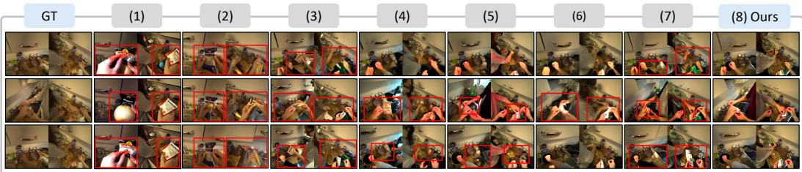  
Figure 7: Qualitative Results of Ablation Studies. Removing individual components leads to inconsistencies in agent appearance, embodied actions, and the shared environment across ego streams. Red boxes highlight representative artifacts. Best viewed zoomed in.

## 4.4 ABLATION STUDY

Tab. 4 and Fig. 7 show that each component addresses a distinct failure mode. Off-the-shelf and directly fine-tuned Cosmos-Predict2.5 baselines, variants (1) and (2), fail to produce plausible multiagent ego futures, highlighting the need for explicit multi-agent conditioning. Without joint multiagent generation, variants (3) and (7) produce inconsistent ego streams, where agent appearance and the surrounding environment diverge across views. Without shared action conditioning, vari ants (3), (4), and (6) exhibit cross-view action misalignment. Without shared environment memory, variants (3), (4), and (5) generate inconsistent backgrounds across streams. These results show that joint generation couples the predictions, shared action conditioning aligns embodied behavior, and shared environment memory anchors both streams to a common evolving world.

## 5 CONCLUSION

We introduced multi-agent egocentric world modeling, where multiple agents interact in a shared world through their own egocentric viewpoints. We proposed ME-World, which jointly generates ego streams with shared action conditioning and environment memory. We also constructed real and synthetic benchmarks with shared-world consistency metrics. Experiments show that ME-World improves shared-world consistency and fine-grained action control while maintaining strong video quality, highlighting the importance of modeling ego streams as coupled observations of an evolving world. Our framework offers several directions for extension. Jointly modeling actions and obser vations could enable agents to plan behaviors and anticipate their effects on the shared world, while efficient cross-agent communication and memory could support larger groups. Combined with efficient video generation, these extensions could enable real-time, interactive multi-agent world simulation. We hope this work advances world models toward simulating multiple embodied agents in a persistent and evolving world.

## REFERENCES

Arslan Ali, Junjie Bai, Maciej Bala, Yogesh Balaji, Aaron Blakeman, Tiffany Cai, Jiaxin Cao, Tianshi Cao, Elizabeth Cha, Yu-Wei Chao, et al. World simulation with video foundation models for physical ai. arXiv preprint arXiv:2511.00062, 2025.

Yutong Bai, Danny Tran, Amir Bar, Yann LeCun, Trevor Darrell, and Jitendra Malik. Whole-body conditioned egocentric video prediction. Advances in Neural Information Processing Systems, 38:164375–164418, 2026.

Philip J. Ball, Jakob Bauer, Frank Belletti, Bethanie Brownfield, Ariel Ephrat, Shlomi Fruchter, Agrim Gupta, Kristian Holsheimer, Aleksander Holynski, Jiri Hron, Christos Kaplanis, Marjorie Limont, Matt McGill, Yanko Oliveira, Jack Parker-Holder, Frank Perbet, Guy Scully, Jeremy Shar, Stephen Spencer, Omer Tov, Ruben Villegas, Emma Wang, Jessica Yung, Cip Baetu, Jordi Berbel, David Bridson, Jake Bruce, Gavin Buttimore, Sarah Chakera, Bilva Chandra, Paul Collins, Alex Cullum, Bogdan Damoc, Vibha Dasagi, Maxime Gazeau, Charles Gbadamosi, Woohyun Han, Ed Hirst, Ashyana Kachra, Lucie Kerley, Kristian Kjems, Eva Knoepfel, Vika Koriakin, Jessica Lo, Cong Lu, Zeb Mehring, Alex Moufarek, Henna Nandwani, Valeria Oliveira, Fabio Pardo, Jane Park, Andrew Pierson, Ben Poole, Helen Ran, Tim Salimans, Manuel Sanchez, Igor Saprykin, Amy Shen, Sailesh Sidhwani, Duncan Smith, Joe Stanton, Hamish Tomlinson, Dimple Vijaykumar, Luyu Wang, Piers Wingfield, Nat Wong, Keyang Xu, Christopher Yew, Nick Young, Vadim Zubov, Douglas Eck, Dumitru Erhan, Koray Kavukcuoglu, Demis Hassabis, Zoubin Gharamani, Raia Hadsell, Aaron van den Oord, Inbar Mosseri, Adrian¨ Bolton, Satinder Singh, and Tim Rocktaschel. Genie 3: A new frontier for world models.¨ Google DeepMind Blog, 2025. URL https://deepmind.google/discover/blog/ genie-3-a-new-frontier-for-world-models/.

Ziqi Cai, Siqi Yang, Yimu Wang, Zixian Gao, Yunheng Liu, Shuchen Weng, Erwin Wu, Kaipeng Zhang, and Boxin Shi. Mass: Multiplayer world models with authoritative shared state. arXiv preprint arXiv:2608.06257, 2026.

Nicolas Carion, Laura Gustafson, Yuan-Ting Hu, Shoubhik Debnath, Ronghang Hu, Didac Suris Coll-Vinent, Chaitanya Ryali, Kalyan Vasudev Alwala, Haitham Khedr, Andrew Huang, et al. Sam 3: Segment anything with concepts. In International conference on learning representations, volume 2026, pp. 138846–138923, 2026.

Joao Carreira and Andrew Zisserman. Quo vadis, action recognition? a new model and the kinetics˜ dataset. In Proceedings of the IEEE Conference on Computer Vision and Pattern Recognition (CVPR), pp. 6299–6308, 2017.

Hongjin Chen, Wei Zhang, Pengfei Li, Shihao Ma, Ke Ma, Yujie Jin, Zijun Xu, Xiaohui Wang, Yupeng Zheng, Zining Wang, Jieru Zhao, Yilun Chen, and Wenchao Ding. Rhythm: Learning interactive whole-body control for dual humanoids, 2026a. URL https://arxiv.org/abs/ 2603.02856.

Yushuo Chen, Xiaoyu Shi, Xiaoshi Wu, Xintao Wang, Pengfei Wan, and Yebin Liu. Handsonworld: Unconstrained egocentric video generation with camera-disentangled hand control, 2026b. URL https://arxiv.org/abs/2607.02075.

Dima Damen, Hazel Doughty, Giovanni Maria Farinella, Sanja Fidler, Antonino Furnari, Evangelos Kazakos, Davide Moltisanti, Jonathan Munro, Toby Perrett, Will Price, et al. Scaling egocentric vision: the epic-kitchens dataset. In European conference on computer vision, pp. 753–771. Springer, 2018.

DreamX Team, Yancheng Bai, Rui Chen, Xiangxiang Chu, Rujing Dang, Hao Dou, Bingjie Gao, Qiwen Gu, Siyu Hong, Jiachen Lei, et al. Dreamx-world 1.0: A general-purpose interactive world model. arXiv preprint arXiv:2606.16993, 2026.

Enigma team. Introducing multiverse: The first ai multiplayer world model, 2025. URL https: //enigma.inc/blog.

Shenyuan Gao, Jiazhi Yang, Li Chen, Kashyap Chitta, Yihang Qiu, Andreas Geiger, Jun Zhang, and Hongyang Li. Vista: A generalizable driving world model with high fidelity and versatile controllability, 2024. URL https://arxiv.org/abs/2405.17398.

Alexey Gavryushin, Dingxi Zhang, Zhao Huang, Alexandros Delitzas, Jiaqi Chen, Ben Ellis, Cedric Zollner, Manthan Patel, Manuel Kaufmann, Marc Pollefeys, et al. Comind: Understanding col-¨ laborative human activity from multiple minds and views. In European Conference on Computer Vision, pp. 502–523. Springer, 2026.

Zheng Ge, Songtao Liu, Feng Wang, Zeming Li, and Jian Sun. Yolox: Exceeding yolo series in 2021. arXiv preprint arXiv:2107.08430, 2021.

Raktim Gautam Goswami, Amir Bar, David Fan, Tsung-Yen Yang, Gaoyue Zhou, Prashanth Krishnamurthy, Michael Rabbat, Farshad Khorrami, and Yann LeCun. World models for learning dexterous hand-object interactions from human videos, 2026. URL https://arxiv.org/ abs/2512.13644.

Kristen Grauman, Andrew Westbury, Eugene Byrne, Zachary Chavis, Antonino Furnari, Rohit Girdhar, Jackson Hamburger, Hao Jiang, Miao Liu, Xingyu Liu, et al. Ego4d: Around the world in 3,000 hours of egocentric video. In Proceedings ofthe IEEE/CVF conference on computer vision and pattern recognition, pp. 18995–19012, 2022.

Kristen Grauman, Andrew Westbury, Lorenzo Torresani, Kris Kitani, Jitendra Malik, Triantafyllos Afouras, Kumar Ashutosh, Vijay Baiyya, Siddhant Bansal, Bikram Boote, Eugene Byrne, Zach Chavis, Joya Chen, Feng Cheng, Fu-Jen Chu, Sean Crane, Avijit Dasgupta, Jing Dong, Maria Escobar, Cristhian Forigua, Abrham Gebreselasie, Sanjay Haresh, Jing Huang, Md Mohaiminul Islam, Suyog Jain, Rawal Khirodkar, Devansh Kukreja, Kevin J Liang, Jia-Wei Liu, Sagnik Majumder, Yongsen Mao, Miguel Martin, Effrosyni Mavroudi, Tushar Nagarajan, Francesco Ragusa, Santhosh Kumar Ramakrishnan, Luigi Seminara, Arjun Somayazulu, Yale Song, Shan Su, Zihui Xue, Edward Zhang, Jinxu Zhang, Angela Castillo, Changan Chen, Xinzhu Fu, Ryosuke Furuta, Cristina Gonzalez, Prince Gupta, Jiabo Hu, Yifei Huang, Yiming Huang, Weslie Khoo, Anush Kumar, Robert Kuo, Sach Lakhavani, Miao Liu, Mi Luo, Zhengyi Luo, Brighid Meredith, Austin Miller, Oluwatumininu Oguntola, Xiaqing Pan, Penny Peng, Shraman Pramanick, Merey Ramazanova, Fiona Ryan, Wei Shan, Kiran Somasundaram, Chenan Song, Audrey Southerland, Masatoshi Tateno, Huiyu Wang, Yuchen Wang, Takuma Yagi, Mingfei Yan, Xitong Yang, Zecheng Yu, Shengxin Cindy Zha, Chen Zhao, Ziwei Zhao, Zhifan Zhu, Jeff Zhuo, Pablo Arbelaez, Gedas Bertasius, David Crandall, Dima Damen, Jakob Engel, Giovanni Maria Farinella, Antonino Furnari, Bernard Ghanem, Judy Hoffman, C. V. Jawahar, Richard Newcombe, Hyun Soo Park, James M. Rehg, Yoichi Sato, Manolis Savva, Jianbo Shi, Mike Zheng Shou, and Michae Wray. Ego-exo4d: Understanding skilled human activity from first- and third-person perspectives, 2024. URL https://arxiv.org/abs/2311.18259.

Qiao Gu, Lingni Ma, Adam W Harley, Richard Newcombe, Florian Shkurti, and Julian Straub. E3C: Video generation with 3d environmental memory and ego-exo human pose control. arXiv preprint arXiv:2605.26316, 2026.

David Ha and Jurgen Schmidhuber. Recurrent world models facilitate policy evolution.¨ Advances in neural information processing systems, 31, 2018.

Jinkun Hao, Mingda Jia, Ruiyan Wang, Hongrui Zhu, Jiafei Cao, Xihui Liu, Ran Yi, Lizhuang Ma, Jiangmiao Pang, and Xudong Xu. Egosim: Egocentric world simulator for embodied interaction generation. arXiv preprint arXiv:2604.01001, 2026.

Anthony Hu, Vaclav Volhejn, Adrien Ramanana Rahary, Chris Mulder, Aditya Makkar, Alyx Liao,´ Amelie Royer, Manu Orsini, Adam Jelley, Eloi Alonso, Florian Laurent, Fredrik Nor´ en, James´ Swingos, Jan Hunermann, Kent Rollins, Lucas Hosseini, Matthieu Le Cauchois, Maxim Peter,¨ Pim de Witte, Tim Brown, Vincent Micheli, Moritz Bohle, Gabriel de Marmiesse, Viktoriia Shar-¨ manska, Lucia Specia, Michael Black, and Patrick Perez. Multiplayer interactive world models´ with representation autoencoders, 2026a. URL https://arxiv.org/abs/2607.05352.

Teng Hu, Mingchun Lu, Yating Wang, Jiangning Zhang, Jinkun Hao, Ye Pan, Ran Yi, Lizhuang Ma, and Dacheng Tao. Metaworld: Scaling multi-agent video world model from single-view video data. arXiv preprint arXiv:2606.02753, 2026b.

Quan Huynh-Thu and Mohammed Ghanbari. Scope of validity of PSNR in image/video quality assessment. Electronics Letters, 44(13):800–801, 2008. doi: 10.1049/el:20080522.

Baoxiong Jia, Yixin Chen, Siyuan Huang, Yixin Zhu, and Song-Chun Zhu. Lemma: A multi-view dataset for le arning m ulti-agent m ulti-task a ctivities. In European Conference on Computer Vision, pp. 767–786. Springer, 2020.

Rawal Khirodkar, He Wen, Julieta Martinez, Yuan Dong, Zhaoen Su, and Shunsuke Saito. Sapiens2. In International Conference on Learning Representations, volume 2026, pp. 58484–58507, 2026.

Byungjun Kim, Taeksoo Kim, Junyoung Lee, and Hanbyul Joo. Dexterous world models. In Proceedings of the IEEE/CVF Conference on Computer Vision and Pattern Recognition, pp. 29663– 29673, 2026a.

Moo Jin Kim, Yihuai Gao, Tsung-Yi Lin, Yen-Chen Lin, Yunhao Ge, Grace Lam, Percy Liang, Shuran Song, Ming-Yu Liu, Chelsea Finn, and Jinwei Gu. Cosmos policy: Fine-tuning video models for visuomotor control and planning, 2026b. URL https://arxiv.org/abs/2601. 16163.

Yu Li, Menghan Xia, Gongye Liu, Xintao Wang, Conglang Zhang, Lei Ke, Yuxuan Lin, Ruihang Chu, Pengfei Wan, Kun Gai, et al. Anchorworld: Embodied egocentric world simulation with view-based evolution customization. arXiv preprint arXiv:2606.07326, 2026.

Han Liang, Wenqian Zhang, Wenxuan Li, Jingyi Yu, and Lan Xu. Intergen: Diffusion-based multihuman motion generation under complex interactions. International Journal of Computer Vision, 132(9):3463–3483, 2024.

Haotong Lin, Sili Chen, Junhao Liew, Donny Y Chen, Zhenyu Li, Guang Shi, Jiashi Feng, and Bingyi Kang. Depth anything 3: Recovering the visual space from any views. arXiv preprint arXiv:2511.10647, 2025.

Fangfu Liu, Kai He, Tianchang Shen, Tianshi Cao, Sanja Fidler, Yueqi Duan, Jun Gao, Igor Gilitschenski, Zian Wang, and Xuanchi Ren. Gamma-world: Generative multi-agent world modeling beyond two players. arXiv preprint arXiv:2605.28816, 2026.

Xingchao Liu, Chengyue Gong, and Qiang Liu. Flow straight and fast: Learning to generate and transfer data with rectified flow. arXiv preprint arXiv:2209.03003, 2022.

Ilya Loshchilov and Frank Hutter. Decoupled weight decay regularization, 2019. URL https: //arxiv.org/abs/1711.05101.

Lingni Ma, Yuting Ye, Fangzhou Hong, Vladimir Guzov, Yifeng Jiang, Rowan Postyeni, Luis Pesqueira, Alexander Gamino, Vijay Baiyya, Hyo Jin Kim, et al. Nymeria: A massive collection of multimodal egocentric daily motion in the wild. In European Conference on Computer Vision, pp. 445–465. Springer, 2024.

Sicheng Mo, Yuheng Li, Ziyang Leng, Krishna Kumar Singh, and Bolei Zhou. Streaming multi agent autoregressive diffusion model with world state registers. arXiv preprint arXiv:2607.21594, 2026.

NVIDIA, :, Niket Agarwal, Arslan Ali, Maciej Bala, Yogesh Balaji, Erik Barker, Tiffany Cai, Prithvijit Chattopadhyay, Yongxin Chen, Yin Cui, Yifan Ding, Daniel Dworakowski, Jiaojiao Fan, Michele Fenzi, Francesco Ferroni, Sanja Fidler, Dieter Fox, Songwei Ge, Yunhao Ge, Jinwei Gu, Siddharth Gururani, Ethan He, Jiahui Huang, Jacob Huffman, Pooya Jannaty, Jingyi Jin, Seung Wook Kim, Gergely Klar, Grace Lam, Shiyi Lan, Laura Leal-Taixe, Anqi Li, Zhaoshuo´ Li, Chen-Hsuan Lin, Tsung-Yi Lin, Huan Ling, Ming-Yu Liu, Xian Liu, Alice Luo, Qianli Ma, Hanzi Mao, Kaichun Mo, Arsalan Mousavian, Seungjun Nah, Sriharsha Niverty, David Page, Despoina Paschalidou, Zeeshan Patel, Lindsey Pavao, Morteza Ramezanali, Fitsum Reda, Xiaowei Ren, Vasanth Rao Naik Sabavat, Ed Schmerling, Stella Shi, Bartosz Stefaniak, Shitao Tang, Lyne Tchapmi, Przemek Tredak, Wei-Cheng Tseng, Jibin Varghese, Hao Wang, Haoxiang Wang, Heng Wang, Ting-Chun Wang, Fangyin Wei, Xinyue Wei, Jay Zhangjie Wu, Jiashu Xu, Wei Yang, Lin Yen-Chen, Xiaohui Zeng, Yu Zeng, Jing Zhang, Qinsheng Zhang, Yuxuan Zhang, Qingqing Zhao, and Artur Zolkowski. Cosmos world foundation model platform for physical ai, 2025. URL https://arxiv.org/abs/2501.03575.

Enrico Pallotta, Sina Mokhtarzadeh Azar, Lars Doorenbos, Serdar Ozsoy, Umar Iqbal, and Juergen Gall. Egocontrol: Controllable egocentric video generation via 3d full-body poses. In Proceedings ofthe IEEE/CVF Conference on Computer Vision and Pattern Recognition, pp. 4269–4279, 2026.

Ryan Po, David Junhao Zhang, Amir Hertz, Gordon Wetzstein, Neal Wadhwa, and Nataniel Ruiz. Multigen: Level-design for editable multiplayer worlds in diffusion game engines. arXiv preprint arXiv:2603.06679, 2026.

Poly Haven. Scene files. https://blog.polyhaven.com/category/scene-files/, 2026. Accessed: September 24, 2026.

Xavier Puig, Eric Undersander, Andrew Szot, Mikael Dallaire Cote, Tsung-Yen Yang, Ruslan Partsey, Ruta Desai, Alexander William Clegg, Michal Hlavac, So Yeon Min, Vladim´ır Vondrus,ˇ Theophile Gervet, Vincent-Pierre Berges, John M. Turner, Oleksandr Maksymets, Zsolt Kira, Mrinal Kalakrishnan, Jitendra Malik, Devendra Singh Chaplot, Unnat Jain, Dhruv Batra, Akshara Rai, and Roozbeh Mottaghi. Habitat 3.0: A co-habitat for humans, avatars and robots, 2023. URL https://arxiv.org/abs/2310.13724.

Qwen Team. Qwen3.6-35B-A3B: Agentic coding power, now open to all, April 2026. URL https://qwen.ai/blog?id=qwen3.6-35b-a3b.

Nishant Rai, Haofeng Chen, Jingwei Ji, Rishi Desai, Kazuki Kozuka, Shun Ishizaka, Ehsan Adeli, and Juan Carlos Niebles. Home action genome: Cooperative compositional action understanding. In 2021 IEEE/CVF Conference on Computer Vision and Pattern Recognition (CVPR), pp. 11179– 11188. IEEE, 2021.

Xuanchi Ren, Tianchang Shen, Jiahui Huang, Huan Ling, Yifan Lu, Merlin Nimier-David, Thomas Muller, Alexander Keller, Sanja Fidler, and Jun Gao. Gen3c: 3d-informed world-consistent video¨ generation with precise camera control. In 2025 IEEE/CVF Conference on Computer Vision and Pattern Recognition (CVPR), pp. 6121–6132. IEEE, 2025.

Robbyant Team, Zelin Gao, Qiuyu Wang, Yanhong Zeng, Jiapeng Zhu, Ka Leong Cheng, Yixuan Li, Hanlin Wang, Yinghao Xu, Shuailei Ma, et al. Advancing open-source world models. arXiv preprint arXiv:2601.20540, 2026.

Georgy Savva, Oscar Michel, Daohan Lu, Suppakit Waiwitlikhit, Timothy Meehan, Dhairya Mishra, Srivats Poddar, Jack Lu, and Saining Xie. Solaris: Building a multiplayer video world model in minecraft. arXiv preprint arXiv:2602.22208, 2026.

Fadime Sener, Dibyadip Chatterjee, Daniel Shelepov, Kun He, Dipika Singhania, Robert Wang, and Angela Yao. Assembly101: A large-scale multi-view video dataset for understanding procedural activities. In 2022 IEEE/CVF Conference on Computer Vision and Pattern Recognition (CVPR), pp. 21064–21074. IEEE, 2022.

Yifan Shen, Jiateng Liu, Xinzhuo Li, Yuanzhe Liu, Bingxuan Li, Houze Yang, Wenqi Jia, Yijiang Li, Tianjiao Yu, James Matthew Rehg, Xu Cao, and Ismini Lourentzou. Egoforge: Goal-directed egocentric world simulator, 2026. URL https://arxiv.org/abs/2603.20169.

Gunnar A Sigurdsson, Abhinav Gupta, Cordelia Schmid, Ali Farhadi, and Karteek Alahari. Charades-ego: A large-scale dataset of paired third and first person videos. arXiv preprint arXiv:1804.09626, 2018.

Oriane Simeoni, Huy V Vo, Maximilian Seitzer, Federico Baldassarre, Maxime Oquab, Cijo Jose, ´ Vasil Khalidov, Marc Szafraniec, Seungeun Yi, Michael Ramamonjisoa, et al. Dinov3.¨ arXiv preprint arXiv:2508.10104, 2025.

Jianlin Su, Yu Lu, Shengfeng Pan, Ahmed Murtadha, Bo Wen, and Yunfeng Liu. Roformer: Enhanced transformer with rotary position embedding, 2023. URL https://arxiv.org/abs/ 2104.09864.

Huiqiang Sun, Zhan Peng, Size Wu, Kun Wang, Kang Liao, Dianyi Wang, Xingyu Zeng, Sheng Jin, Yangguang Li, Zhiguo Cao, et al. Prisma-world: Camera-controllable multi-agent video world model. arXiv preprint arXiv:2606.09507, 2026.

Junshu Tang, Jiacheng Liu, Jiaqi Li, Longhuang Wu, Haoyu Yang, Penghao Zhao, Siruis Gong, Xiang Yuan, Shuai Shao, Linfeng Zhang, and Qinglin Lu. Hunyuan-gamecraft-2: Instructionfollowing interactive game world model, 2026. URL https://arxiv.org/abs/2511. 23429.

Yuanpeng Tu, Hao Luo, Xi Chen, Xiang Bai, Fan Wang, and Hengshuang Zhao. Playerone: Egocentric world simulator. Advances in Neural Information Processing Systems, 38:145235–145261, 2026.

Thomas Unterthiner, Sjoerd van Steenkiste, Karol Kurach, Raphael Marinier, Marcin Michalski,¨ and Sylvain Gelly. FVD: A new metric for video generation. In ICLR 2019 Workshop on Deep Generative Modelsfor Highly Structured Data (DeepGenStruct), 2019.

Basile Van Hoorick, Dian Chen, Shun Iwase, Pavel Tokmakov, Muhammad Zubair Irshad, Igor Vasiljevic, Swati Gupta, Fangzhou Cheng, Sergey Zakharov, and Vitor Campagnolo Guizilini. Anyview: Synthesizing any novel view in dynamic scenes. arXiv preprint arXiv:2601.16982, 2026.

Zhou Wang, Alan C. Bovik, Hamid R. Sheikh, and Eero P. Simoncelli. Image quality assessment: from error visibility to structural similarity. IEEE Transactions on Image Processing, 13(4):600– 612, 2004. doi: 10.1109/TIP.2003.819861.

Zile Wang, Zexiang Liu, Jiaxing Li, Kaichen Huang, Baixin Xu, Fei Kang, Mengyin An, Peiyu Wang, Biao Jiang, Yichen Wei, Yidan Xietian, Jiangbo Pei, Liang Hu, Boyi Jiang, Hua Xue, Zidong Wang, Haofeng Sun, Wei Li, Wanli Ouyang, Xianglong He, Yang Liu, Yangguang Li, and Yahui Zhou. Matrix-game 3.0: Real-time and streaming interactive world model with longhorizon memory, 2026. URL https://arxiv.org/abs/2604.08995.

Haoyu Wu, Jiwen Yu, Yingtian Zou, and Xihui Liu. Multiworld: Scalable multi-agent multi-view video world models. arXiv preprint arXiv:2604.18564, 2026.

Linxi Xie, Lisong C. Sun, Ashley Neall, Tong Wu, Shengqu Cai, and Gordon Wetzstein. Generated reality: Human-centric world simulation using interactive video generation with hand and camera control, 2026. URL https://arxiv.org/abs/2602.18422.

Jingqiao Xiu, Fangzhou Hong, Yicong Li, Mengze Li, Wentao Wang, Sirui Han, Liang Pan, and Ziwei Liu. Egotwin: Dreaming body and view in first person. In International Conference on Learning Representations, volume 2026, pp. 28642–28659, 2026.

Liang Xu, Xintao Lv, Yichao Yan, Xin Jin, Shuwen Wu, Congsheng Xu, Yifan Liu, Yizhou Zhou, Fengyun Rao, Xingdong Sheng, et al. Inter-x: Towards versatile human-human interaction analysis. In 2024 IEEE/CVF Conference on Computer Vision and Pattern Recognition (CVPR), pp. 22260–22271. IEEE, 2024.

Qianxun Xu, Xianfang Zeng, Xinyao Liao, Wei Cheng, Gang Yu, and Chi Zhang. Consistworld: Evidence routing for consistent multi-agent world models, 2026. URL https://arxiv.org/ abs/2609.22641.

Yufei Xu, Jing Zhang, Qiming Zhang, and Dacheng Tao. Vitpose: Simple vision transformer baselines for human pose estimation. Advances in neural information processing systems, 35:38571– 38584, 2022.

Zexuan Yan, Yuzhou Wu, Yue Ma, Zonghang He, Kaibo Yin, Xiaobing Tu, Yinggui Wang, Jinkui Ren, Xiantao Zhang, Shijian Wang, Jinghong Liu, and Linfeng Zhang. Egogenesis: Egocentric world-action modeling with online anchored projective memory and action-3d rope, 2026. URL https://arxiv.org/abs/2607.28243.

Seonghyeon Ye, Yunhao Ge, Kaiyuan Zheng, Shenyuan Gao, Sihyun Yu, George Kurian, Suneel Indupuru, You Liang Tan, Chuning Zhu, Jiannan Xiang, Ayaan Malik, Kyungmin Lee, William Liang, Nadun Ranawaka, Jiasheng Gu, Yinzhen Xu, Guanzhi Wang, Fengyuan Hu, Avnish Narayan, Johan Bjorck, Jing Wang, Gwanghyun Kim, Dantong Niu, Ruijie Zheng, Yuqi Xie, Jimmy Wu, Qi Wang, Ryan Julian, Danfei Xu, Yilun Du, Yevgen Chebotar, Scott Reed, Jan Kautz, Yuke Zhu, Linxi ”Jim” Fan, and Joel Jang. World action models are zero-shot policies, 2026. URL https://arxiv.org/abs/2602.15922.

Chenyangguang Zhang, Botao Ye, Boqi Chen, Alexandros Delitzas, Fangjinhua Wang, Marc Pollefeys, and Xi Wang. Controllable egocentric video generation via occlusion-aware sparse 3d hand joints, 2026. URL https://arxiv.org/abs/2603.11755.

Richard Zhang, Phillip Isola, Alexei A. Efros, Eli Shechtman, and Oliver Wang. The unreasonable effectiveness of deep features as a perceptual metric. In Proceedings of the IEEE Conference on Computer Vision and Pattern Recognition (CVPR), pp. 586–595, 2018.

Renjie Zhao, Yuxiang Wu, Mingyu Zhang, Jiaxin Li, Sisi Li, Yimin Sheng, Tianxi Tan, Zhenkai Zhang, Jianyi Zhu, and Yong-Lu Li. Population-scalable multi-agent world modeling. arXiv preprint arXiv:2608.08600, 2026.

Jiayi Zhu, Jianing Zhang, Yiying Yang, Wei Cheng, and Xiaoyun Yuan. Shareverse: Multi-agent consistent video generation for shared world modeling. arXiv preprint arXiv:2603.02697, 2026.

## APPENDIX

## A Additional Results

A.1 Additional Qualitative Results   
A.2 Generalization to Extended Settings   
B Evaluation Details   
B.1 Shared-World Consistency Metrics   
B.2 Evaluation Metrics   
B.3 Baseline Implementation Details   
C Dataset Construction   
C.1 Synthetic Dataset Generation   
C.2 Real Dataset Curation   
C.3 Benchmark Construction   
D Implementation Details   
D.1 Model Details   
D.2 Training Details

Generated Result 1  
Generated Result 2  
Generated Result 3  
Generated Result 4  
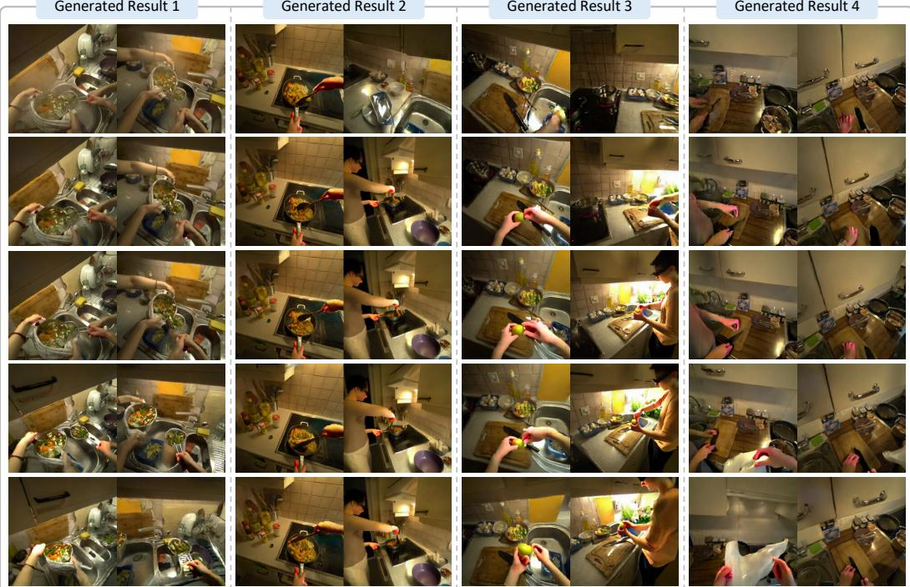  
Figure 8: Additional Qualitative Results on the Real Benchmark. We show additional generations from diverse interaction sequences in real benchmark. Each example contains the two synchronized ego streams generated jointly by our model across multiple timesteps. Best viewed zoomed in.

Generated Result 1  
Generated Result 2  
Generated Result 3  
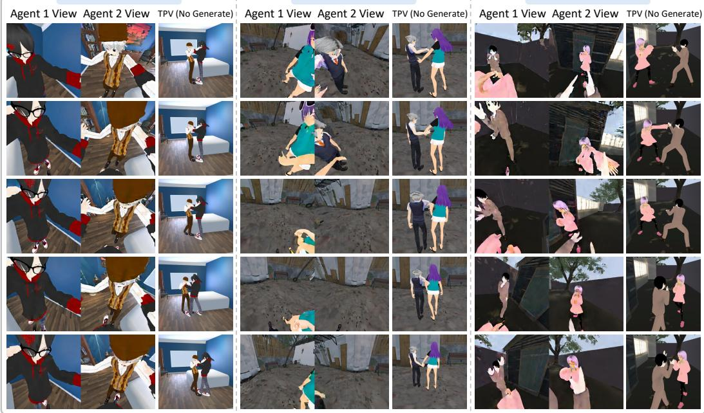  
Figure 9: Additional Qualitative Results on the Synthetic Benchmark. We show additional generations from diverse interaction sequences in synthetic benchmark. For each example, the two ego views are jointly generated by our model. The third-person view (TPV) is shown only as a visual reference to help interpret the shared scene and interaction, and is not generated or used as input by our model. Best viewed zoomed in.

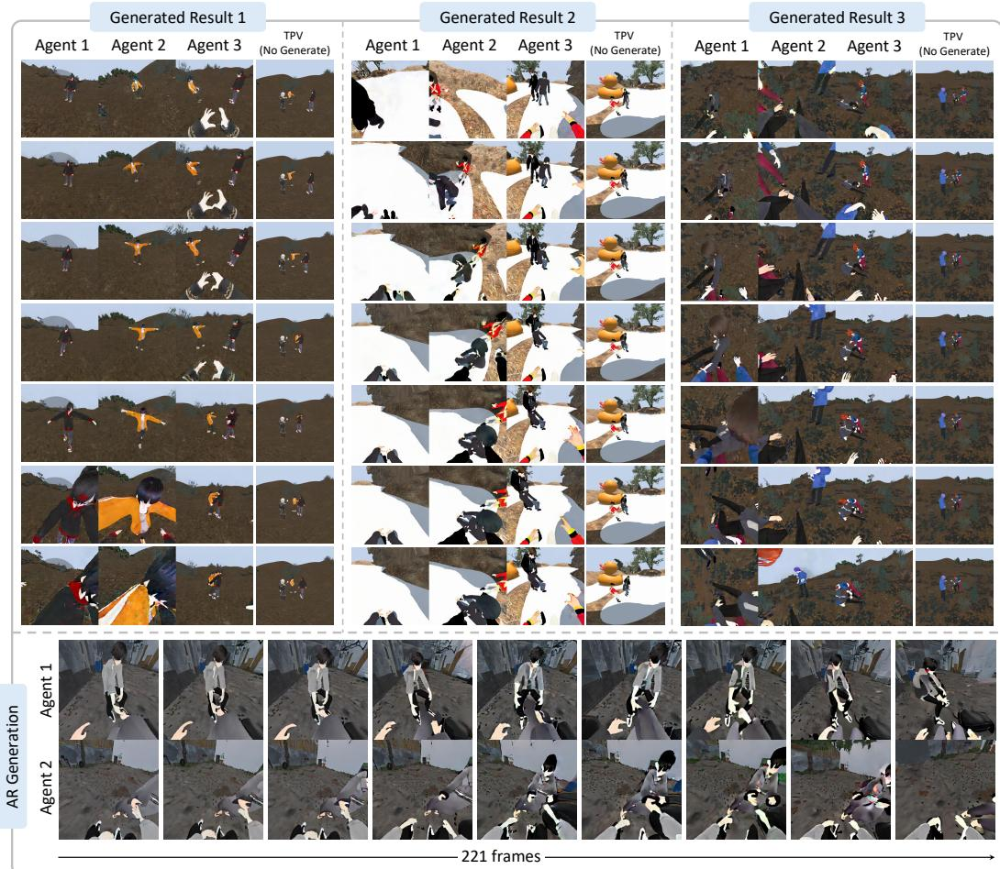  
Figure 10: Multi-Agent and Autoregressive Generation. We further demonstrate our model in more diverse generation settings, including multi-agent and long-horizon generation. Our model jointly generates three synchronized ego views for three interacting agents (top), and autoregressively generates two-agent sequences of 221 frames (bottom). For the three-agent results, the thirdperson view (TPV) is provided only as a visual reference to help interpret the shared scene and interaction, and is not generated or used as input by our model. Best viewed zoomed in.

## A ADDITIONAL RESULTS

## A.1 ADDITIONAL QUALITATIVE RESULTS

We provide additional qualitative results on the real and synthetic benchmarks in Fig. 8 and 9. Across diverse real-world interactions, our model generates coherent paired ego views that preserve shared scene content and compatible interaction dynamics despite substantial viewpoint differences between the two agents. On the synthetic benchmark, where agent identity and motion can be inspected more clearly, the model consistently preserves the appearance of both agents and their coordinated interactions across the generated ego views.

## A.2 GENERALIZATION TO EXTENDED SETTINGS

We further demonstrate our model in diverse generation settings beyond the standard two-agent, fixed-length setting used for training.

Multi-Agent Generation. Our framework extends naturally to a larger number of agents without modifying the underlying architecture. To add a third agent, we simply append an additional ego stream and its corresponding agent token, project the third agent’s body and hand poses into each ego view in the same manner as in the two-agent setting, and include the resulting conditions in joint generation. All ego streams are then processed together with shared attention and the same shared environment memory. As shown in Fig. 10 (top), this simple extension enables the model to jointly generate three synchronized ego views for three interacting agents while preserving a common shared scene and their mutual interactions.

Autoregressive Generation. We further extend generation along the temporal dimension by autoregressively chaining multiple generation chunks. As shown in Fig. 10 (bottom), this produces a 221-frame two-agent sequence while maintaining the interacting agents and shared environment over the extended horizon. Each subsequent chunk is conditioned on two frames from the preceding generated chunk, while generation within each chunk remains bidirectional. To improve robustness to imperfect generated context, we perturb the conditional latents during training. We randomly condition on one or two frames, and when two frames are used, independent Gaussian noise with standard deviation 0.1 is applied with probability 0.5. The denoising target remains clean, exposing the model to imperfect handoff frames without requiring autoregressive rollouts during training.

## B EVALUATION DETAILS

## B.1 SHARED-WORLD CONSISTENCY METRICS

## B.1.1 METRIC IMPLEMENTATION DETAILS

We provide implementation details for the shared-world consistency metrics introduced in Sec. 4.1. Following the notation in the main paper, we consider an ordered pair of distinct agents $( n , m )$ where agent n is the query stream and agent m is the corresponding target stream. For clarity, we describe the metrics for a synchronized frame and omit the frame index t. We report $S _ { \mathrm { e n v } } , S _ { \mathrm { \iota } }$ update on both benchmarks, and $S _ { \mathrm { i d } }$ on synthetic.

Feature Representation and Change Mask. We extract DINOv3 (Simeoni et al., 2025) ViT-L/16´ features on a $3 2 \times 3 2$ patch grid, denoted by $\phi ( \cdot )$ . For each patch $p$ in the generated query view $X _ { \mathrm { g e n } } ^ { ( n ) }$ , we compute its discrepancy from the stream-aligned warped condition:

$$
d _ { \mathrm { g e n } } ^ { ( n ) } ( p ) = \left. \phi ( X _ { \mathrm { g e n } } ^ { ( n ) } ) ( p ) - \phi ( X _ { \mathrm { w a r p } } ^ { ( n ) } ) ( p ) \right. _ { 2 } .\tag{2}
$$

To account for reprojection artifacts, we set the change threshold $\tau ^ { ( n ) }$ to the 80th percentile of feature distances over valid non-human background patches in each frame. The generated change mask is then

$$
M _ { \mathrm { u p d a t e } } ^ { ( n ) } ( p ) = \mathbb { 1 } \left[ d _ { \mathrm { g e n } } ^ { ( n ) } ( p ) > \tau ^ { ( n ) } \right] .\tag{3}
$$

All visibility and change masks are evaluated on the same patch grid.

Cross-View Correspondence. As illustrated in Fig. 4 (a), we establish correspondences between the synchronized ground-truth views $X _ { \mathrm { g t } } ^ { ( n ) }$ and $X _ { \mathrm { g t } } ^ { ( m ) }$ using metric depth and ground-truth camera poses. Each patch center $p$ in the query view is back-projected into 3D and projected into the target view to obtain its corresponding patch $q .$ We retain correspondences whose projected locations lie within the image boundaries and whose reprojected depths agree with the target-view depths within 10 cm. The resulting co-visible correspondence set is denoted by $\mathcal { C } ^ { ( n  m ) }$

For each $( p , q ) \in { \mathcal { C } } ^ { ( n  m ) }$ , we compute the cross-view feature similarity between the corresponding generated regions:

$$
s ^ { ( n  m ) } ( p , q ) = \cos ( \phi ( X _ { \mathrm { g e n } } ^ { ( n ) } ) ( p ) , \phi ( X _ { \mathrm { g e n } } ^ { ( m ) } ) ( q ) ) .\tag{4}
$$

Environment Consistency. $S _ { \mathrm { e n v } }$ measures whether environment content generated without direct scene evidence remains consistent across ego streams. As illustrated in Fig. 4 (b), we select covisible correspondences whose query patch is not covered by the stream-aligned geometric memory:

$$
\mathcal { C } _ { \mathrm { e n v } } ^ { ( n  m ) } = \{ ( p , q ) \in \mathcal { C } ^ { ( n  m ) } \ \Big | \ M _ { \mathrm { v i s } } ^ { ( n ) } ( p ) = 0 \} .\tag{5}
$$

For our two-agent setting, we average both ordered directions:

$$
S _ { \mathrm { e n v } } = \frac { 1 } { 2 } \sum _ { ( n , m ) \in \{ ( 1 , 2 ) , ( 2 , 1 ) \} } \operatorname { A v g } _ { ( p , q ) \in \mathcal { C } _ { \mathrm { e n v } } ^ { ( n  m ) } } s ^ { ( n  m ) } ( p , q ) .\tag{6}
$$

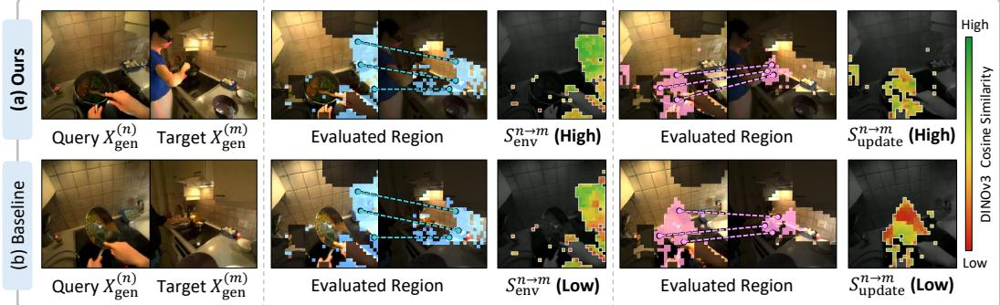  
Figure 11: Metric validation. We visualize the query regions evaluated by $S _ { \mathrm { e n v } }$ and $S _ { \mathrm { u p d a t e } } ,$ their co-visible correspondences in the target stream, and the resulting DINOv3 cosine similarities. The consistent generation in (a) shows high correspondence similarity and receives higher metric scores, whereas the cross-view inconsistencies in (b) appear as localized similarity drops and lower scores. This correspondence provides qualitative evidence that the proposed metrics capture the intended cross-view consistency. Best viewed zoomed in.

The visibility constraint is applied only to the query patch $p ;$ its corresponding target patch $q$ need not be uncovered.

State Update Consistency. $S _ { \mathrm { u p d a t e } }$ measures whether interaction-induced state changes are represented consistently across ego streams. As illustrated in Fig. 4 (c), we select co-visible correspondences whose query patch differs from valid warped scene evidence:

$$
{ \mathcal { C } } _ { \mathrm { u p d a t e } } ^ { ( n  m ) } = \{ ( p , q ) \in { \mathcal { C } } ^ { ( n  m ) } \ \middle \vert \ M _ { \mathrm { u p d a t e } } ^ { ( n ) } ( p ) = 1 , \ M _ { \mathrm { v i s } } ^ { ( n ) } ( p ) = 1 \} .\tag{7}
$$

We then compute

$$
S _ { \mathrm { u p d a t e } } = \frac { 1 } { 2 } \sum _ { ( n , m ) \in \{ ( 1 , 2 ) , ( 2 , 1 ) \} } \mathrm { A v g } _ { ( p , q ) \in { \cal C } _ { \mathrm { u p d a t e } } ^ { ( n  m ) } } s ^ { ( n  m ) } ( p , q ) .\tag{8}
$$

Requiring $M _ { \mathrm { v i s } } ^ { ( n ) } ( p ) = 1$ ensures that the detected change is measured relative to valid scene appearance evidence rather than an uncovered region.

Identity Consistency. On synthetic, $S _ { \mathrm { i d } }$ evaluates whether the generated interaction partner preserves its intended avatar appearance. As illustrated in Fig. 4 (d), for each benchmark avatar, we construct a multi-view reference images by rendering the avatar from 12 azimuths under full-body and upper-body framings and encode the masked renders using the CLS token of DINOv3 ViT-L/16 (Simeoni et al., 2025). For each generated frame after the provided first frame, we detect the´ interaction partner using SAM3 (Carion et al., 2026) and encode the detected character using the same feature extractor. We compare its feature against the multi-view reference images of the corresponding ground-truth avatar and take the maximum cosine similarity over the reference views. $S _ { \mathrm { i d } }$ is obtained by averaging these similarities over all valid frames and both ego streams.

## B.1.2 METRIC VALIDATION

Qualitative Validation. Fig. 11 visualizes how the proposed metrics respond to actual generation successes and failures. We highlight the query regions selected for $S _ { \mathrm { e n v } }$ and $S _ { \mathrm { u p d a t e } }$ and visualize the DINOv3 cosine similarity of their co-visible correspondences in the other ego stream. Our generation preserves high similarity in both regions, yielding $S _ { \mathrm { e n v } } = 0 . 5 8 2$ and $\bar { S } _ { \mathrm { u p d a t e } } = 0 . 4 9 5$ . In contrast, independent single-stream generation shows visible cross-view disagreement in the same regions, reflected by lower similarities and scores of 0.498 and 0.402, respectively. For clarity, the figure visualizes one correspondence direction, while the reported scores use bidirectional evaluation.

Controlled Validation. We further validate the metric behavior by introducing controlled cross-view inconsistencies into 100 benchmark clips (Tab. 5). Only one ego stream is modified and the paired stream is kept unchanged, while the metrics are computed with the standard bidirectional evaluation. We consider three cases: temporal misalignment by shift ing one stream by five frames, an environment conflict by replacing content without direct scene evidence $( M _ { \mathrm { v i s } } \ = \ 0 )$ with a fixed appearance, and a state conflict by similarly replacing regions containing interaction-induced state changes $( M _ { \mathrm { { g e n } } } ~ = ~ 1 , M _ { \mathrm { { v i s } } } ~ = ~ 1 )$

Temporal misalignment decreases both metrics. More specifically, the environment conflict decreases $S _ { \mathrm { e n v } }$ by 0.090 while changing $S _ { \mathrm { u p d a t e } }$ by only 0.019, whereas the state conflict decreases $S _ { \mathrm { u p d a t e } }$ by 0.147, compared with 0.059 for $S _ { \mathrm { e n v } }$ . These differentiated responses support that the two metrics capture their intended, complementary aspects of shared-world consistency.

Table 5: Controlled validation of the proposed metrics. We evaluate how $S _ { \mathrm { e n v } }$ and $S _ { \mathrm { u p d a t e } }$ respond to temporal misalignment, environment conflict, and state conflict. Values in brackets denote changes from the original generations.
<table><tr><td>Metric</td><td>Ours</td><td>Misalignment Env. Conflict</td><td></td><td>State Conflict</td></tr><tr><td> $S _ { \mathrm { e n v } }$ </td><td>0.468</td><td> $\begin{array} { l } { { \overline { { 0 . 3 9 9 \left( - 0 . 0 6 9 \right) } } } } \\ { { 0 . 3 7 7 \left( - 0 . 0 9 0 \right) } } \end{array}$ </td><td> $\mathbf { 0 . 3 7 7 \left( - 0 . 0 9 0 \right) }$ </td><td>0.408 (−0.059)</td></tr><tr><td> $S _ { \mathrm { u p d a t e } }$ </td><td>0.466</td><td></td><td> $0 . 4 4 7 \ ( - 0 . 0 1 9 )$ </td><td> $\mathbf { 0 . 3 2 0 } _ { ( - 0 . 1 4 7 ) }$ </td></tr></table>

## B.2 EVALUATION METRICS

In addition to shared-world consistency, we evaluate camera control, self-action control, other-agent action control, and video quality.

Camera Control. We estimate camera trajectories from generated videos using DA3-GIANT (Lin et al., 2025) and align them to the ground-truth trajectories with a similarity transformation to resolve monocular scale ambiguity. We report the absolute trajectory error (ATE) of camera centers and the mean rotation error between aligned and ground-truth camera orientations.

Action Control. Following $\mathrm { E ^ { 3 } C }$ (Gu et al., 2026), we evaluate self-action and other-agent action control separately. For self-action control, we segment the wearer’s hands using SAM3 (Carion et al., 2026) and report Hand-F1 and Hand-mIoU for hand presence and spatial alignment, respectively. For other-agent action control, we detect the interaction partner and estimate body keypoints using YOLOX (Ge et al., 2021) and ViTPose (Xu et al., 2022). We report Full-Body-F1 for partner detection and Full-Body-PCK@10 for pose alignment over matched detections.

Video Quality. We report PSNR (Huynh-Thu & Ghanbari, 2008), SSIM (Wang et al., 2004), and LPIPS (Zhang et al., 2018) between generated and ground-truth videos to measure reconstruction fidelity and perceptual similarity. We additionally compute FVD (Unterthiner et al., 2019) using I3D (Carreira & Zisserman, 2017) features to assess video-level distributional similarity.

## B.3 BASELINE IMPLEMENTATION DETAILS

## B.3.1 MULTI-VIEW VIDEO GENERATION

GEN3C (Ren et al., 2025). We use the GEN3C-Cosmos-7B checkpoint (704 × 1280, 121-frame chunks). For each generation direction, we construct a per-frame 4D cache from the source view’s ground-truth RGB video, metric depth estimated by DA3 (Lin et al., 2025), and ground-truth camera parameters. We render the cache along the target camera trajectory, using temporally corresponding source frames, and provide the rendered observations and validity masks as warp conditions, together with the target initial frame and caption. We letterbox the $5 0 4 \times 5 0 4$ inputs into 704 × 1280, adjusting intrinsics accordingly. We pad the 77-frame camera trajectory to 121 frames by repeating its final pose and truncate the output to 77 frames. We use 35 denoising steps, guidance scale 1.0, and point-filter threshold 0.05. The central $7 0 4 \times 7 0 4$ region is cropped before evaluation.

AnyView-DVS (Van Hoorick et al., 2026). We use the AnyView-DVS-2B checkpoint, conditioned on the source ground-truth video and both cameras’ intrinsics and extrinsics through Plucker rays.¨ The target initial frame, text, and depth are not provided. We re-anchor poses to the target camera at frame 0 and scale translations by $1 \dot { / } 8$ following the released configuration. We resize the inputs to 576 × 576 with adjusted intrinsics and generate 41 frames, the maximum supported length (1 + 4k). We use 35 sampling steps and guidance scale 0.

## B.3.2 SINGLE-EGO WORLD MODELS

EgoSim (Hao et al., 2026). We use EgoSim-14B based on Wan2.1-Fun-14B-InP. Following the released pipeline, we construct an environment prior by back-projecting each view’s ground-truth initial frame using estimated metric depth and rendering it along the ground-truth camera trajectory, together with a coverage mask. We render the wearer’s Aria MPS hand tracking (21 landmarks per hand) into a 3D skeleton video using the official rendering parameters. We additionally provide the initial-frame CLIP embedding and corresponding caption. Inputs are letterboxed into 480 × 832 with adjusted intrinsics. We generate 61 frames using the first 61 frames of the conditions, retaining the benchmark’s 10 FPS indexing rather than resampling to the model’s nominal 16 FPS. We use 50 denoising steps without classifier-free guidance.

JointControlVideo (Zhang et al., 2026). We use the released LoRA and hand-controller weights. Each view is independently conditioned on its ground-truth initial frame, caption, and the wearer’s 3D hand-joint trajectories. We reorder Aria MPS hand landmarks into the MANO-21 joint ordering and provide 42 joints in the camera coordinate system, along with camera intrinsics. Untracked hands are zeroed, consistent with training-time joint dropout. We letterbox inputs into 480×832 and generate 77 frames using 50 denoising steps and guidance scale 5.0. The model does not explicitly receive camera trajectories.

## B.3.3 GENERAL WORLD MODELS

DreamX-World (DreamX Team et al., 2026). We use the DreamX-World-5B-Cam checkpoint based on Wan2.2-TI2V-5B. Each ego stream is independently generated from its ground-truth initial frame, caption, and camera trajectory. We resize the initial frame to 480 × 480 using bicubic interpolation and generate 77 frames at the same resolution. The official inference interface converts discrete camera commands into per-frame poses. We bypass this conversion and directly provide the recorded camera poses in the same internal format. The model interpolates the poses to 20 latent frames and expresses them relative to the initial camera, using fixed intrinsics and metric-scale translations without normalization.

LingBot-World (Robbyant Team et al., 2026). We use the LingBot-World-Base-Cam checkpoint based on Wan2.2-I2V-A14B. Each ego stream is independently generated from its ground-truth initial frame, caption, and camera trajectory. We resize the initial frame to 480 × 480 using bicubic interpolation and generate 77 frames at the same resolution. We provide per-frame camera-to-world poses and intrinsics. Following the official implementation, the camera poses are interpolated to 20 latent frames, expressed relative to the initial camera, and normalized by the maximum translation magnitude before Plucker-ray encoding. We compensate for the repository’s intrinsic rescaling from¨ its 480 × 832 reference canvas to preserve the effective intrinsics at 480 × 480.

## B.3.4 MULTI-AGENT WORLD MODELS

MultiWorld (Wu et al., 2026). We adapt MultiWorld to our embodied multi-agent setting using the same video backbone, training data, and Shared Action Conditioning as ME-World. We retain our Joint Multi-Agent Generation, jointly denoising the two ego streams through full self-attention over the concatenated stream tokens. For environment conditioning, we replace our Shared Environment Memory with MultiWorld’s VGGT-based Global State Encoder. We extract a shared global representation from the observation history using frozen VGGT features and inject the resulting representation into the ego streams through cross-attention. Our stream-aligned geometric memory and cross-stream anchor memory are not used in this adaptation.

Solaris (Savva et al., 2026). We adapt Solaris using the same backbone, training data, and Shared Action Conditioning as ME-World. The two ego streams are jointly denoised using Joint Multi-Agent Generation, allowing their tokens to interact through full self-attention. Unlike ME-World, this adaptation does not use an additional explicit environment-conditioning module. It therefore corresponds to joint multi-agent generation with Shared Action Conditioning but without Shared Environment Memory.

γ-World (Liu et al., 2026). We adapt γ-World using the same backbone, training data, and Shared Action Conditioning as ME-World. Instead of our Joint Multi-Agent Generation, we retain γ-World’s multi-agent interaction mechanism based on Sparse Hub Attention and Simplex Rotary Agent Encoding. The ego streams communicate through the shared hub tokens rather than full self-attention over a single concatenated sequence. We do not introduce an additional explicit environment-conditioning module, isolating the effect of its native cross-agent communication mechanism under the same embodied action conditions.

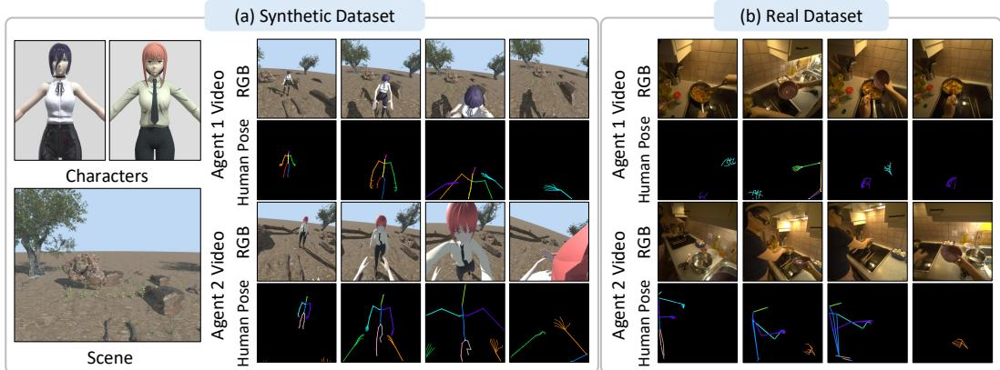

Figure 12: Dataset example. Examples are from (a) our generated synthetic dataset and (b) curated real-world CoMind dataset, showing synchronized ego streams and corresponding human poses.  
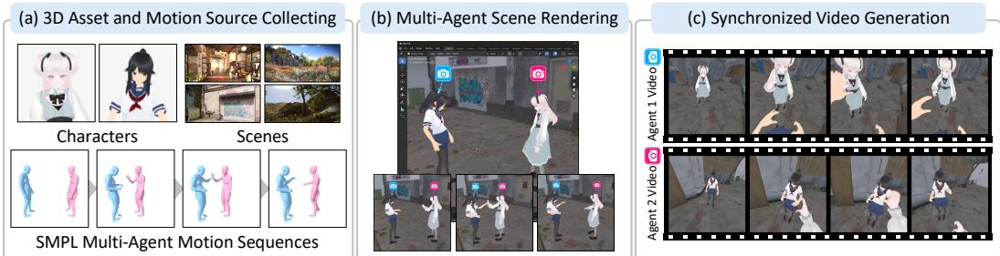  
Figure 13: Synthetic dataset generation pipeline. (a) We collect diverse 3D characters, environments, and paired motions, (b) apply the motions to characters, place them in the shared world space, and attach egocentric cameras, and (c) render synchronized egocentric video pairs.

MetaWorld (Hu et al., 2026b). We adapt MetaWorld using the same backbone, training data, and Shared Action Conditioning as ME-World. Rather than jointly processing all ego tokens with full self-attention, we retain MetaWorld’s World-State Alignment mechanism. Since no official implementation is publicly available, we reimplement this module based on the method described in the paper, where the ego branches are processed separately and exchange synchronized information through cross-view attention. For environment conditioning, we provide geometric scene evidence using warped observations and depth-based conditions, following the MetaWorld formulation.

## C DATASET CONSTRUCTION

We construct training data from both synthetic multi-person interactions and real-world synchronized egocentric recordings, as illustrated in Fig. 12. The synthetic pipeline provides diverse agent appearances, environments, and human-human interactions with complete geometric and motion annotations, whereas the real-world data captures natural interactions and visual complexity. For both sources, we process paired ego streams into a common training format consisting of scene, pose, camera, reference-image, and text conditions.

## C.1 SYNTHETIC DATASET GENERATION

To complement the limited diversity of real data, we construct synchronized egocentric video pairs from interacting avatars in shared 3D environments, as illustrated in Fig. 12 (a). As illustrated in Fig. 13, paired human motions are retargeted to rigged avatars, placed into diverse scenes, and rendered synchronously from two head-mounted cameras. The rendered geometry and poses allow us to construct the same conditioning modalities used for real data, together with shared posed reference images.

Assets and Motion Retargeting. We use 1,822 two-person interaction sequences from Inter-X (Xu et al., 2024) (1,372 sequences across 40 categories) and InterHuman (Liang et al., 2024) (450 sequences), resampled to 10 FPS. We collect 100 rigged VRM avatars and seven indoor and outdoor

Blender environments. For each sequence, we randomly assign two avatars and transfer the SMPL-X motion to their skeletons. Because avatar body proportions can differ substantially from the source motions, we adapt the retargeted arm motion according to avatar limb lengths. Analytic two-bone inverse kinematics further aligns the wrists with their source trajectories, reducing contact errors in interactions such as handshakes. Finger articulation is transferred separately using relative joint flexion, and the retargeted pair is vertically aligned to the scene floor.

Scene Placement and Rendering. We define scene anchors with valid standing positions and orientations and transform each interaction into a canonical pair-centric coordinate system before placement. Ray casting estimates available free space around each anchor, allowing motion trajectories to be assigned only to geometrically compatible locations. We discard placements with frequent camera–geometry intersections, yielding 53 validated scene configurations across the seven environments. For compatible placements, we additionally favor configurations with sufficient mutual view coverage between the two agents, which provides useful shared visual evidence for multi-ego generation.

We attach a head-mounted camera to each avatar and synchronously render the two egocentric streams with a 100◦ horizontal field of view at 504 × 504 resolution and 10 FPS using Blender EEVEE. The wearer’s head geometry is hidden from its own camera to avoid near-camera artifacts. RGB images, metric depth, and person-instance masks are rendered jointly. Avatar animations and cameras are keyframed over the complete interaction to preserve exact temporal synchronization between the two ego streams.

Condition Extraction. We divide the rendered sequences into non-overlapping 77-frame windows and construct the conditioning modalities used by our model. For explicit scene conditioning, we select observations from the available history according to their target-view reprojection coverage. Human pixels are removed using the rendered instance masks before back-projecting the remaining RGB-D observations into 3D and reprojecting them into each target camera. This produces the warped scene observation and its corresponding visibility mask.

For shared action conditioning, we project the articulated skeletons of both agents into each target ego view. Body and finger joints are rendered using consistent identity-specific colors, allowing the model to distinguish the same two agents across viewpoints. Camera motion is represented using per-pixel Plucker ray maps constructed in the shared coordinate system.¨

We additionally construct the implicit shared environment memory by selecting eight clean reference observations shared across the two streams. References are greedily selected to maximize complementary scene coverage over both target ego views. For each reference, we retain its RGB image, camera condition, and identity-colored pose condition. Because the underlying interaction is already specified by the pose conditioning, we use a generic first-person interaction prompt fo synthetic training samples.

Quality Control and Dataset Statistics. We filter sequences with invalid viewing conditions, prolonged extreme partner proximity, or severe camera–geometry intersections. A wall-intrusion score based on near-camera scene geometry provides an additional check for cases in which the virtual head-mounted camera enters scene surfaces. The resulting synthetic corpus contains 4,736 paired 77-frame clips, corresponding to 9,472 egocentric videos, generated from 1,822 interaction sequences, 100 avatars, seven environments, and 53 validated scene configurations. All videos are rendered at 10 FPS and 504 × 504 resolution.

## C.2 REAL DATASET CURATION

We curate CoMind (Gavryushin et al., 2026), which records two interacting wearers during collaborative kitchen activities, into synchronized two-ego training pairs, as illustrated in Fig. 12 (b). The fisheye camera streams are rectified to a pinhole projection and processed at 10 FPS and 504 × 504 resolution. Each training example contains 200 context frames followed by 77 target frames.

Geometry and Scene Conditioning. We use CoMind’s multi-device SLAM reconstruction for recordings with a valid shared solve, which places both head-mounted cameras in a common coordinate system. For every ego pair, we express both cameras in a shared canonical coordinate frame and convert their intrinsics and extrinsics into per-pixel Plucker ray maps, preserving the relative¨ camera geometry between the two views.

Because the released scene geometry is too sparse to directly construct dense target-view appearance conditions, we estimate per-frame metric depth using DA3 (Lin et al., 2025) with the corresponding camera parameters. For each target view, we back-project valid pixels from past observations into 3D and reproject them using the target camera to construct the warped scene appearance condition. The valid reprojection region defines the corresponding binary visibility mask.

Moving people must not be treated as part of the persistent scene memory. We therefore segment human regions using SAM3 (Carion et al., 2026) and remove them from source observations before warping. For each target frame, we select the source observation with the largest valid reprojection coverage after human masking. This provides an explicit geometric memory of previously observed static scene content while preventing ghosting or leakage from past human locations.

Pose Conditioning. CoMind provides egocentric hand poses but does not contain complete whole body motion annotations. We therefore estimate full-body 2D poses using Sapiens2 (Khirodkar et al., 2026), including body, hand, and facial landmarks. We associate detected people across the synchronized ego streams and maintain consistent identities over time. The two agents are rendered with fixed identity-specific colors across both views so that each ego stream receives the projected body motion of both the wearer and the interacting partner in a shared identity convention.

Cross-Stream Anchor Memory Construction. In addition to stream-aligned geometric memory, we construct clean reference observations that provide complementary appearance information about the shared environment. Candidate observations are selected from the available context of both ego streams. Following the synthetic pipeline, we greedily select references according to their complementary target-view coverage and retain their RGB appearance, camera conditions, and identity-consistent pose conditions. The resulting references are shared by both generated streams and form the implicit reference memory used by our model.

Text Conditioning. CoMind does not provide textual descriptions for the egocentric videos. We therefore generate a description for each ego stream using Qwen3.6-35B-A3B (Qwen Team, 2026). The captions describe the visible activity and interaction from the corresponding viewpoint and are used as per-view text conditions during training.

Quality Control and Dataset Statistics. We retain recordings for which the multi-device SLAM reconstruction provides a reliable shared camera solution and remove windows with unreliable camera registrations or invalid visual conditions. After filtering, the real training corpus contains approximately 12K synchronized two-ego clip pairs from 32 recordings. Each pair is processed at 10 FPS and 504 × 504 resolution with 200 context frames and 77 target frames.

## C.3 BENCHMARK CONSTRUCTION

Real Benchmark. We sample 100 clips from the official validation split of CoMind (Gavryushin et al., 2026). These recordings are disjoint from our training data and contain unseen kitchens and participants. We process them using the same geometry, pose, and camera pipeline described above and extract synchronized 77-frame windows from the two ego streams. All metrics are computed at 480 × 480 resolution. We exclude clips with hair occluding the ego camera, mean cross-view co-visibility below 0.075, or fewer than 10 partner-visible frames in both views. Co-visibility is computed through cross-view depth reprojection using the recorded cameras with a 10 cm depthconsistency tolerance. To avoid concentrating the benchmark on a narrow range of viewpoint overlap, we allocate recording-level quotas proportional to each recording’s eligible candidate pool, yielding 28, 25, and 47 clips. Within each recording, candidates are sorted by co-visibility, divided into equal-count strata, and randomly sampled across these strata. The resulting benchmark has a mean cross-view co-visibility of 0.38 and a median of 43 partner-visible frames per clip.

Synthetic Benchmark. We construct 100 evaluation clips using the same rendering and conditioning pipeline as our synthetic training data while using held-out assets. The benchmark spans six Poly Haven (Poly Haven, 2026) environments: Hidden Alley, Verdant Trail, The Shed, Namaqualand, Pawn Shop, and Pine Forest. Candidate windows must contain at least 10 partner-visible frames with at least six body joints inside the image, and must have mean cross-view co-visibility of at least 0.05. We retain at most one window from each interaction sequence to avoid near-duplicate samples. Scene-level quotas are assigned proportional to the eligible validation pool, resulting in 14, 23, 18, 14, 19, and 12 clips for the six scenes, respectively. Within each scene, we perform stratified sampling by co-visibility following the real benchmark protocol. The resulting synthetic benchmark contains 100 distinct interaction sequences, including 84 from Inter-X and 16 from InterHuman, across 86 avatar pairs. It has a mean cross-view co-visibility of 0.31 and provides exact camera, depth, segmentation, pose, and identity annotations for controlled evaluation.

## D IMPLEMENTATION DETAILS

## D.1 MODEL DETAILS

Model Configuration. We initialize ME-World from the Cosmos-Predict2.5 2B(Ali et al., 2025) multi-view diffusion transformer, with a frozen Wan-2.1 causal video VAE and Cosmos-Reason1 7B text encoder. Each training sample contains two synchronized 77-frame ego streams at 480×480 resolution and 10 FPS, encoded into 20 latent frames per view. We use first-frame conditioning and four shared references selected by greedy coverage maximization over both views.

## D.2 TRAINING DETAILS

Training. We train separate checkpoints for Real and Synthetic, using CoMind and our synthetic dataset, respectively, without transferring weights between them. For each model, we fine-tune the DiT and conditioning modules using the rectified-flow objective, applying the loss only to generated latent frames. We use AdamW with a learning rate of $3 \times 1 0 ^ { - 5 }$ , weight decay $1 0 ^ { - 3 }$ , 100 warm-up steps, and linear learning-rate decay. Training uses BF16 and FSDP on four A100 80 GB GPUs with a global batch size of 4. We maintain an exponential moving average (EMA) of the model weights.

Inference. We use the corresponding Real or Synthetic checkpoint with EMA weights, 35 denoising steps, and a classifier-free guidance scale of 7.0 to jointly generate two 77-frame ego streams.