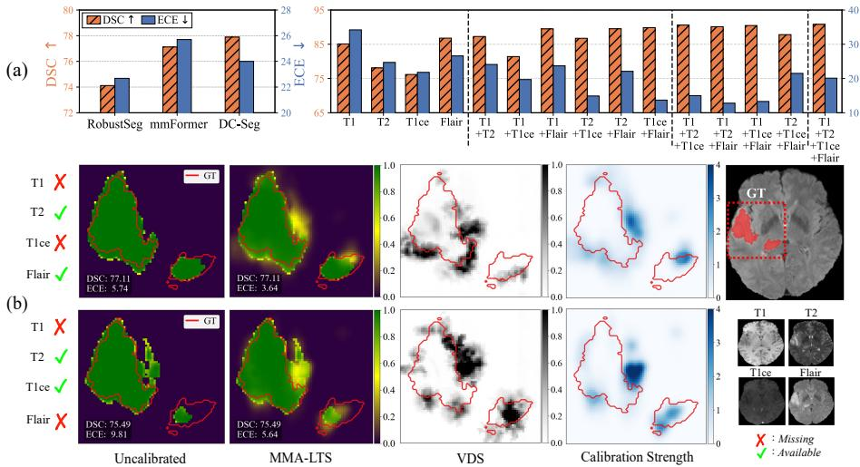
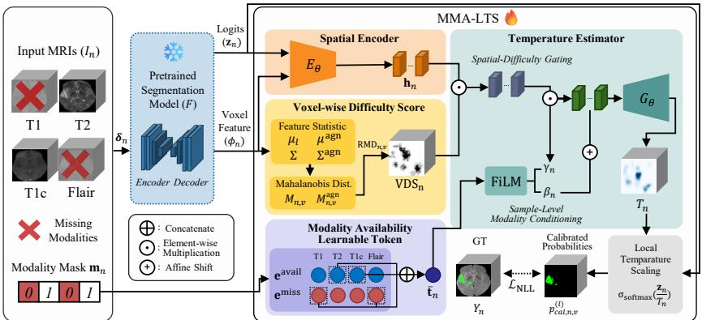
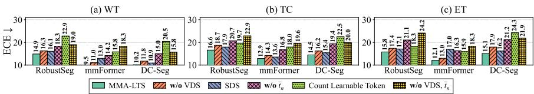
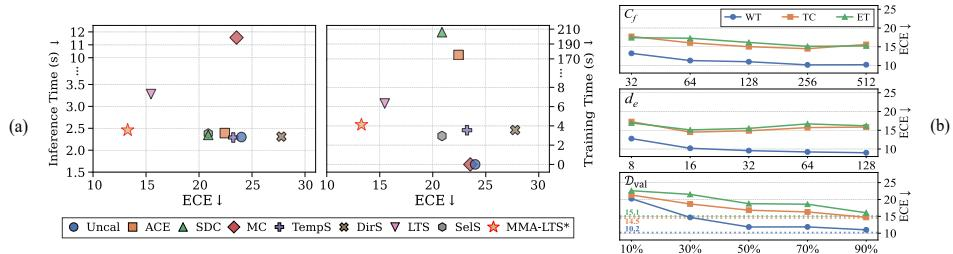

# Missing Modality-Aware Calibration for Trustworthy Brain Tumor Segmentation

Sol Lee, Hyunji Kim, Sungrae Hong, Donghee Han, and Mun Yi⋆

Korea Advanced Institute of Science and Technology, Daejeon, South Korea {leesol4553, hyunjikim, sr5043, handonghee, munyi}@kaist.ac.kr

Abstract. Multimodal brain tumor segmentation typically leverages multiple MRI modalities, yet incomplete modality acquisition is common in clinical practice due to protocol heterogeneity and scan failures. Although recent methods maintain segmentation accuracy under missing modality conditions, they frequently overlook prediction reliability, leading to miscalibrated confidence estimates that hinder clinical adoption. Existing calibration techniques are largely modality-agnostic or assume that prediction dificulty decreases monotonically as additional modalities become available. However, in brain tumor segmentation, prediction dificulty depends primarily on which modalities are absent rather than how many, leading to combination-specific and spatially heterogeneous calibration errors. To address this, we propose Missing Modality-Aware Local Temperature Scaling (MMA-LTS), a post-hoc voxel-wise confidence calibration method. It estimates a spatially adaptive temperature field conditioned on a modality-availability learnable token and a voxelwise dificulty score. Experiments on BraTS 2020 and FeTS 2024 show that MMA-LTS improves calibration while preserving the segmentation accuracy of state-of-the-art models across diverse missing-modality scenarios, thereby enhancing trustworthiness toward clinical deployment.

Keywords: Brain Tumor Segmentation · Multi-Modal · Missing Modality · Confidence Calibration · Post-hoc Calibration

## 1 Introduction

Multimodal brain tumor segmentation plays a critical role in diagnosis, treatment planning, and prognosis assessment. Accurate delineation requires integrating complementary information from multiple MRI modalities, such as T1, T2, T1ce, and FLAIR [4]. However, in real-world clinical workflows, acquiring all modalities is often infeasible due to variations in imaging protocols, scan failures, or patient conditions [25]. As a result, models must operate robustly under incomplete modality settings. Prior approaches addressed this challenge by synthesizing missing modalities [16,23] or training separate models for each possible modality combination [8,22]. More recent methods achieve stronger performance by embedding multimodal inputs into a shared latent space [2,10,26], enabling a unified architecture.

  
Fig. 1. Segmentation performance and calibration results. (a) Left: DSC and ECE of state-of-the-art models on BraTS 2020, averaged over all modality combinations. Right: DC-Seg results per modality combination for WT. (b) Two cases with the same modality count but difering in combination, showing DC-Seg confidence maps (uncalibrated and MMA-LTS), voxel-wise dificulty score (VDS), and calibration strength (|T − 1|).

Despite recent advances, most studies prioritize segmentation accuracy while paying limited attention to prediction reliability under missing-modality conditions. Fig. 1(a) shows that the state-of-the-art DC-Seg [10] achieves higher Dice similarity coeficient (DSC) yet exhibits larger expected calibration error (ECE) than RobustSeg [2]. This suggests that high segmentation performance under incomplete multimodal inputs can obscure poorly calibrated confidence estimates that do not reflect true accuracy. Reliable confidence is essential in medical image segmentation, as miscalibration can undermine clinical decisionmaking [1]. This issue is particularly pronounced in brain tumor segmentation, where heterogeneous subregions and boundaries require calibrated confidence to identify unreliable delineations and support expert intervention [5,15].

Most prior work on segmentation calibration relies on joint prediction-calib ration methods [1,12,18] or post-processing probability correction [5,24], which assume fixed and fully observed inputs and therefore do not address multimodal or missing-modality settings. Although calibration methods for multimodal classification under missing modalities have been proposed [11,14], they typically assume prediction dificulty decreases and confidence increases monotonically as more modalities become available. This assumption does not hold in brain tumor segmentation, where modalities contribute unequally: T1ce primarily highlights enhancing tumor (ET) regions, whereas T2 and FLAIR better capture whole tumor (WT) extent [17]. As illustrated in Fig. 1(b), prediction dificulty depends on which modalities are missing rather than how many, resulting in spatially heterogeneous calibration errors.

  
Fig. 2. The overall framework of MMA-LTS.

Motivated by this observation, we propose MMA-LTS (Missing Modality-Aware Local Temperature Scaling), a plug-in post-hoc calibration method for multimodal segmentation with incomplete modalities. Unlike prior work, MMA-LTS performs voxel-wise calibration via modality-aware conditioning and spatial dificulty gating, correcting modality-combination-specific and spatially heterogeneous calibration errors without retraining. Experiments on BraTS 2020 [17] and FeTS 2024 [25] demonstrate improved calibration across missing-modality scenarios while preserving segmentation accuracy.

## 2 Method

Assume disjoint data splits $\mathcal { D } _ { \mathrm { t r a i n } } , ~ \mathcal { D } _ { \mathrm { v a l } }$ , and $\mathcal { D } _ { \mathrm { t e s t } } ,$ each consisting of pairs $( I _ { n } , Y _ { n } )$ , where n is the sample index, $I _ { n } \in \mathbb { R } ^ { | \mathcal { M } | \times D \times H \times W }$ is the multimodal input, $\hat { Y } _ { n } \in L ^ { D \times H \times W }$ is the ground-truth label, and M and $L$ denote the sets of modalities and classes, respectively. A segmentation model $F$ pretrained on $\mathcal { D } _ { \mathrm { t r a i n } }$ takes $I _ { n }$ and produces logits $\mathbf { \check { z } } _ { n } \in \mathbb { R } ^ { | \check { L } | \times D \times H \times W }$ . The proposed method aims to calibrate $\mathbf { z } _ { n }$ of $F$ on $\mathcal { D } _ { \mathrm { t e s t } }$ Learnable Tokenunder arbitrary modality availability. To this T1end, a calibration module is trained on $\mathcal { D } _ { \mathrm { v a l } }$ , yielding spatially adaptive confi-T2dence estimates without retraining F. The overall framework is shown in Fig. 2.

## 2.1 Missing Modality-Aware Local Temperature Scaling

Spatial Encoder. F extracts modality-specific features $\{ \mathbf { f } _ { n , k } \} _ { k \in \mathcal { M } }$ and produces a joint representation $\phi _ { n } \in \mathbb { R } ^ { C _ { f } \times D \times H \times W }$ and $\mathbf { z } _ { n }$ from $I _ { n } ,$ where $C _ { f }$ is the channel dimension. These two signals are concatenated and passed through a 3D CNN module $E _ { \theta }$ to obtain a spatial embedding $\mathbf { h } _ { n } \in \mathbb { R } ^ { C _ { f } \times \mathbf { \tilde { D } } \times H \times W }$ , which serves as the base representation for temperature estimation.

Voxel-wise Dificulty Score (VDS). To capture spatial dificulty induced by modality loss, we extend Mahalanobis-distance-based estimation [3] to 3D segmentation. We collect voxel feature-label pairs $\mathcal { V } = \{ ( \mathbf { g } _ { n , v } , y _ { n , v } ) \}$ from $\mathcal { D } _ { \mathrm { t r a i n } }$ to model the feature distribution of pretrained $F ,$ where v indexes a voxel location, $\mathbf { g } _ { n , v } = \phi _ { n } ( v ) \in \mathbb { R } ^ { C _ { f } }$ denotes the feature vector at voxel $v , y _ { n , v } = Y _ { n } ( v ) \in L$ the corresponding label, and $\mathcal { V } _ { l }$ the subset of voxels belonging to each class $l \in L$ We estimate the class-conditional and class-agnostic statistics as:

$$
\begin{array} { r } { \mu _ { l } = \displaystyle \frac { 1 } { | \mathcal { V } _ { l } | } \sum _ { ( n , v ) \in \mathcal { V } _ { l } } \mathbf { g } _ { n , v } , \qquad \pmb { \Sigma } = \displaystyle \frac { 1 } { | \mathcal { V } | } \sum _ { l \in L } \sum _ { ( n , v ) \in \mathcal { V } _ { l } } ( \mathbf { g } _ { n , v } - \mu _ { l } ) ( \mathbf { g } _ { n , v } - \mu _ { l } ) ^ { \top } , } \\ { \mu ^ { \mathrm { a g n } } = \displaystyle \frac { 1 } { | \mathcal { V } | } \sum _ { ( n , v ) \in \mathcal { V } } \mathbf { g } _ { n , v } , \qquad \pmb { \Sigma } ^ { \mathrm { a g n } } = \displaystyle \frac { 1 } { | \mathcal { V } | } \sum _ { ( n , v ) \in \mathcal { V } } ( \mathbf { g } _ { n , v } - \mu ^ { \mathrm { a g n } } ) ( \mathbf { g } _ { n , v } - \mu ^ { \mathrm { a g n } } ) ^ { \top } . } \end{array}\tag{1}
$$

The class-conditional and agnostic Mahalanobis distances are then defined as:

$$
\begin{array} { r } { M _ { n , v } = ( { \bf g } _ { n , v } - { \pmb \mu } _ { y _ { n , v } } ) ^ { \top } \pmb { \Sigma } ^ { - 1 } ( { \bf g } _ { n , v } - { \pmb \mu } _ { y _ { n , v } } ) , } \\ { M _ { n , v } ^ { \mathrm { a g n } } = ( { \bf g } _ { n , v } - { \pmb \mu } _ { \mathrm { a g n } } ) ^ { \top } ( { \pmb \Sigma } ^ { \mathrm { a g n } } ) ^ { - 1 } ( { \bf g } _ { n , v } - { \pmb \mu } ^ { \mathrm { a g n } } ) . } \end{array}\tag{2}
$$

$M _ { n , v }$ measures deviation from the class distribution and $M _ { n , v } ^ { \mathrm { a g n } }$ from the global distribution, where $y _ { n , v }$ is obtained from ground-truth labels during training and replaced by the predicted label $\hat { y } _ { n , v } = \arg \operatorname* { m a x } { \mathbf { z } _ { n , v } }$ at inference time. We adopt $\mathrm { R M D } _ { n , v } \ = \ M _ { n , v } \ - \ M _ { n , v } ^ { \mathrm { a g n } }$ as a voxel-wise dificulty proxy, where larger values indicate voxels that are atypical within their class yet unremarkable globally, reflecting low class discriminability and thus indicating harder regions. After normalization and reshaping, we obtain $\mathrm { V D S } _ { n } \in [ 0 , 1 ] ^ { D \times H \times W }$

Modality Availability Learnable Token. We encode modality availability as a sample-level conditioning signal for calibration. Let $S ( I _ { n } ) \subseteq { \mathcal { M } }$ denote the set of available modalities and define the binary mask $\mathbf { m } _ { n , k } = \mathbb { I } [ k \in \mathcal { S } ( I _ { n } ) ]$ , where 1 and 0 indicate available and missing, respectively. For each $k \in \mathcal { M }$ , learnable tokens $\mathbf { e } _ { k } ^ { \mathrm { a v a i l } } , \mathbf { e } _ { k } ^ { \mathrm { m i s s } } \in \mathbb { R } ^ { d _ { e } }$ represent the available and missing states, where $d _ { e }$ is the token dimension. The modality state token $\mathbf { t } _ { n , k }$ is defined as

$$
\mathbf { t } _ { n , k } = \mathbf { m } _ { n , k } \mathbf { e } _ { k } ^ { \mathrm { a v a i l } } + ( 1 - \mathbf { m } _ { n , k } ) \mathbf { e } _ { k } ^ { \mathrm { m i s s } } .\tag{3}
$$

Concatenating all modality tokens yields the summary vector $\bar { \mathbf { t } } _ { n } = \bigoplus _ { k \in \mathcal { M } } \mathbf { t } _ { n , k } \in$ $| \mathbb { R } ^ { | \mathcal { M } | \cdot d _ { e } }$ , which serves to globally modulate the calibration strength. Temperature Estimator. The estimator learns a mapping that produces a voxel-wise temperature field using spatial features $\mathbf { h } _ { n }$ , voxel-wise dificulty score $\mathrm { V D S } _ { n }$ , and modality availability token $\bar { \mathbf { t } } _ { n }$ . Spatial dificulty gating is first applied to selectively emphasize regions requiring stronger calibration. Sample-level modality conditioning is then performed via FiLM-based afine modulation [21] to adjust feature modulation according to the sample-wise modality configuration. The resulting temperature field $\bar { T _ { n } } \in \mathbb { R } ^ { D \times H \times \bar { W } }$ is then given by

$$
T _ { n } = G _ { \theta } \Big ( (  { \mathbf { h } } _ { n } \odot  { \mathrm { V D S } } _ { n } ) \odot \gamma _ { n } + \beta _ { n } \Big ) ,\tag{4}
$$

where ⊙ denotes element-wise multiplication, $( \gamma _ { n } , \beta _ { n } ) = f _ { \mathrm { F i L M } } ( \bar { \bf t } _ { n } )$ denote afine modulation parameters, and $G _ { \theta }$ is a 3D CNN predictor. Spatial-dificulty gating determines where stronger calibration is needed, while sample-level modality conditioning controls how strongly it is applied based on available modalities. Local Temperature Scaling. Following prior work [5], the estimated temperature field $T _ { n }$ is applied to post-hoc rescale the logits ${ \bf z } _ { n }$ of F via temperaturescaled softmax, yielding calibrated voxel-wise class probabilities:

$$
p _ { \mathrm { c a l } , n , v } ^ { ( l ) } = \sigma _ { \mathrm { s o f t m a x } } \left( \frac { \mathbf { z } _ { n , v } } { T _ { n , v } } \right) ^ { ( l ) } , l \in L .\tag{5}
$$

where $T _ { n , v }$ and ${ \bf z } _ { n , v }$ denote the temperature and logit at voxel $v ,$ respectively. Since $T _ { n , v } \in \mathbb { R } ^ { + }$ , class ordering is preserved, with values greater than 1 reducing overconfidence and values less than 1 mitigating underconfidence.

Training Objective. ModDrop [20] is applied as $\mathbf { f } _ { n , k } = \delta _ { n , k } \mathbf { f } _ { n , k } .$ where $\delta _ { n , k }$ is a Bernoulli indicator randomly set to 0 during training. MMA-LTS is optimized via the negative log-likelihood (NLL) loss over the voxel grid Ω, which counteracts the miscalibration of F by recovering the true probability distribution:

$$
\mathcal { L } _ { \mathrm { N L L } } = - \frac { 1 } { \left| \varOmega \right| } \sum _ { v \in \varOmega } \log p _ { \mathrm { c a l } , n , v } ^ { ( y _ { n , v } ) }\tag{6}
$$

## 3 Experiments

## 3.1 Implementation Details

Dataset. Experiments are conducted on BraTS 2020 [17] and FeTS 2024 [25], each providing 3D multi-contrast MRI scans with four modalities (FLAIR, T1ce, T1, T2) and three tumor subregions: whole tumor (WT), tumor core (TC), and enhancing tumor (ET). BraTS 2020 contains 369 cases split as (219/50/100) for $\left( \mathcal { D } _ { \mathrm { t r a i n } } / \mathcal { D } _ { \mathrm { v a l } } / \mathcal { D } _ { \mathrm { t e s t } } \right)$ [10], and FeTS 2024 contains 1,251 cases split as (1000/125/ 126) [27]. All volumes are skull-stripped, co-registered to a common anatomical template, resampled to 1mm3, and z-score normalized.

Segmentation Backbones and Calibration Methods. We evaluate MMA-LTS on state-of-the-art brain tumor segmentation models for missing-modality robustness: RobustSeg [2], mmFormer [26], and DC-Seg [10]. For calibration, we compare against joint prediction-calibration approaches such as mL1-ACE [1] and SDC [12], as well as post-hoc probability correction methods, including Temperature Scaling (TS) [7], Dirichlet Scaling (DirS) [9], Local Temperature Scaling (LTS) [5], Selective Scaling (SelS) [24], and MC Dropout (MC) [6]. All calibration methods are applied uniformly across backbones.

Training Settings. All backbones are trained on $\mathcal { D } _ { \mathrm { t r a i n } }$ with batch size 2 for 500/250 epochs on BraTS 2020/FeTS 2024, augmented with random $8 0 ^ { 3 }$ crops, $\pm 1 0 ^ { \circ }$ rotation, intensity shifts, and flipping. Post-hoc calibration methods and MMA-LTS are trained for 40 epochs using AdamW [13] (batch size 1, learning rate $1 \times 1 0 ^ { - 4 } )$ on $\mathcal { D } _ { \mathrm { v a l } }$ , while mL1-ACE and SDC are trained with backbones.

Table 1. DSC and ECE comparison of DC-Seg on BraTS 2020. • and ◦ denote available and missing modalities. Temperature scaling-based methods (TS, DirS, LTS, SelS, MMA-LTS) preserve the DSC of the uncalibrated model; only ECE is reported.
<table><tr><td>Type</td><td>FLAIR T1 Tice T2</td><td>o o o</td><td>o 0 ● o</td><td>o ● o o</td><td>o o o</td><td>o o</td><td>o O</td><td>o o</td><td>o O</td><td>o o</td><td>O</td><td></td><td>O</td><td>O</td><td>o</td><td></td><td>Avg.</td></tr><tr><td>WT</td><td>Uncalibrated DSC mL1-ACE [1] L DSC SDC [12] L DSC MC [6] L DSC</td><td>24.7 85.1 27.0 83.7 22.4 85.6 24.8 85.0</td><td>21.8 78.1 25.4 76.9 21.8 78.3 22.0</td><td>34.2 76.2 39.4 72.4 33.4 75.6 34.2</td><td>26.6 86.8 26.4 86.1 23.5 86.8 26.7</td><td>14.9 87.3 16.4 86.6 13.7 87.7 14.9</td><td>19.7 81.4 23.5 79.4 19.2 81.5 19.7</td><td>23.7 89.5 23.7 88.2 20.4 89.5 23.6</td><td>24.1 86.7 25.9 85.1 21.8 87.1 24.3</td><td>22.1 89.5 22.1 88.5 19.0 89.8 22.2</td><td>13.7 89.9 14.0 89.2 12.7 90.1 13.6</td><td>13.3 90.6 13.8 89.9 12.2 90.8 13.4</td><td>21.5 90.1 21.2 89.5 18.4 90.4 21.5</td><td>12.8 90.5 13.0 90.0 11.7 90.7 12.9</td><td>15.0 87.8 16.4 86.8 13.8 88.1 15.3</td><td>13.0 90.8 13.0 90.5 11.6 91.0 13.0</td><td>20.1 86.7 21.4 85.5 18.4 86.9 20.1</td></tr><tr><td>TC</td><td>DSC mL1-ACE DSC SDC L DSC MC L DSC TS DirS LTS</td><td>MMA-LTS* 12.6 Uncalibrated 37.6 73.2 33.6 72.5 31.8 73.3 37.6 73.0 36.5 34.9</td><td>12.7 19.1 84.5 17.6 84.0 16.7 84.7 19.4 84.8 18.4 17.6</td><td>15.1 43.2 64.6 40.7 63.2 37.6 64.3 42.8 54.8 41.9 40.5</td><td>13.0 43.4 70.7 38.8 70.0 36.3 70.5 43.7 70.7 42.2 40.7</td><td>8.1 16.5 87.6 14.0 87.4 14.0 87.6 16.6 87.6 15.9</td><td>17.9 86.8 16.6 84.9 15.0 86.0 17.8 86.9 17.2</td><td>38.9 73.9 34.3 72.8 32.2 74.1 38.6 74.3 37.8</td><td>35.6 73.9 32.2 73.0 30.1 74.0 35.8 73.7 34.6</td><td>35.5 75.3 31.1 74.4 29.1 75.8 35.6 75.4</td><td>16.4 87.4 13.4 87.5 14.0 87.1 16.4 87.5</td><td>17.4 87.4 14.2 87.4 14.7 87.1 17.5 87.5</td><td>35.4 75.5 30.7 74.9 29.1 76.0 35.3 75.5</td><td>16.1 87.5 12.9 87.6 13.5 87.2 16.0 87.5</td><td>16.9 87.2 14.3 86.7 14.5 86.9 17.0 87.4 16.3</td><td>17.0 27.1 87.3 13.8 87.1 14.4 87.0 17.0 87.4 16.4</td><td>80.2 23.9 79.6 22.9 80.1 27.1 80.3</td></tr><tr><td>ET</td><td>SelS MMA-LTS* Uncalibrated DSC mL1-ACE DSC SDC DSC MC</td><td>22.2 32.2 18.2 36.5 51.8 31.8 51.4 11.8 51.3 36.4 13.1</td><td>12.6 15.7 10.9 12.8 80.0 11.1 79.4 31.5 80.0</td><td>27.5 27.7 37.2 39.8 20.4 20.1 46.8 46.9 40.9 42.4 45.3 43.0 38.6 41.8 42.7 38.0 39.1 44.0</td><td>15.2 10.6 14.3 10.2 9.9 83.2 7.8 83.2 8.9</td><td>16.3 11.1 15.5 10.1 10.9 83.4 10.5 81.2 9.7</td><td>36.1 24.1 35.1 20.9 43.4 47.0 39.6 45.8 36.2</td><td>33.0 21.2 32.0 18.9 37.2 51.6 34.4 50.3</td><td>32.9 21.2 32.2 17.6 37.5 52.5 32.9 51.9</td><td>10.2 14.0 9.7 11.2 82.7 8.5 82.7</td><td>10.5 15.0 10.3 10.5 83.5 7.8 83.5</td><td>15.8 32.7 21.6 32.0 19.3 38.0 52.6 33.6</td><td>14.8 10.0 13.9 9.7 10.4 83.2 7.9</td><td>10.9 14.7 10.6 10.1 83.6</td><td>15.5 15.5 10.7 13.5 10.6 10.4 83.6 8.0 7.9 83.3</td><td>25.1 16.8 24.2 14.5 24.8 66.8 22.0 83.3 66.1</td></tr></table>

MC uses $p = 0 . 3$ with 5 forward passes. For MMA-LTS, we set $C _ { f } = 1 6$ and $d _ { e } = 2 5 6$ . All experiments are conducted on an $\mathrm { { N V I D I A } ^ { \textregistered } }$ RTX A6000 GPU. Evaluation Metrics. We evaluate segmentation with DSC [28] and calibration with ECE [19] following recent works [1,12], where ECE is computed over foreground voxels using 10 bins and averaged across test volumes.

## 3.2 Experiment Results

Comparative Experiments. Tables 1 and 2 present results on BraTS 2020 and FeTS 2024. MMA-LTS achieves the lowest ECE across most tumor regions and 15 modality combinations while preserving DSC. On BraTS 2020, MMA-LTS reduces average WT/TC/ET ECE to 10.2/14.5/15.1, outperforming the second-best LTS (13.1/16.8/16.5). On FeTS 2024, MMA-LTS similarly achieves the best ECE across tumor regions (9.5/12.0/11.6), demonstrating efective correction of modality-combination-induced and spatially heterogeneous confidence distortions. Table 3 further confirms consistent ECE reduction across RobustSeg and mmFormer backbones, validating its generalized calibration efectiveness. Ablation Study. Fig. 3 presents ablation results of MMA-LTS on DC-Seg with BraTS 2020. Removing VDS or replacing it with sample-averaged dificulty (SDS) consistently increases ECE across all tumor regions, highlighting the importance of spatial dificulty estimation. Removing the modality availability token $\bar { t } _ { n }$ or substituting it with a count-based token also degrades ECE, as it is limited in capturing modality combination-specific calibration errors. These results demonstrate that each component contributes to calibration improvement across all tumor regions under missing modalities.

Table 2. DSC and ECE comparison of DC-Seg on FeTS 2024.
<table><tr><td>Type</td><td>FLAIR T1 T1ce T2</td><td>0 o o</td><td>o o o</td><td>o ● o o</td><td>o o o</td><td>o o</td><td>o o</td><td>o o</td><td>o O</td><td>o o</td><td>O O</td><td>o</td><td>O</td><td>O</td><td>o</td><td></td><td>Avg.</td></tr><tr><td>WT</td><td>Uncalibrated DSC mL1-ACE [1] L DSC SDC DSC MC [6] L DSC</td><td>20.9 87.7 20.4 86.5 18.2 87.8 20.8</td><td>17.0 79.3 20.7 78.8 17.3 80.1 16.9</td><td>80.8 27.2 78.4 22.6 80.5 25.3</td><td>90.3 15.9 90.5 15.2 90.8 17.9</td><td>89.0 12.7 88.1 10.9 89.2 12.0</td><td>83.4 17.4 82.3 13.6 83.7 14.7</td><td>91.8 14.0 91.7 13.1 92.1 15.8</td><td>88.5 18.5 87.3 16.3 88.7 19.3</td><td>91.9 13.8 91.9 13.2 92.3 15.3</td><td>91.6 8.1 92.1 7.6 92.1 8.7</td><td>92.3 8.1 92.4 7.5 92.6 8.5</td><td>92.2 13.2 92.1 12.3 92.4 14.7</td><td>92.5 7.9 92.6 7.3 92.8 8.5</td><td>89.2 12.5 88.4 10.7 89.3 12.0</td><td>88.9 8.0 92.6 7.3 92.8 14.6</td><td>88.6 14.6 88.4 10.7 89.1 15.0</td></tr><tr><td>TC</td><td>mL1-ACE DSC SDC L DSC MC L DSC TS DirS LTS SelS</td><td>Uncalibrated 30.2 75.8 26.5 74.3 23.4 76.2 30.1 75.9 26.9 26.7 18.2</td><td>14.5 88.9 13.9 88.0 12.5 89.2 14.4 88.9 13.3 13.2 14.4</td><td>32.4 73.8 29.3 71.4 28.7 73.1 32.7 73.8 28.6 28.5 19.9</td><td>31.8 76.9 27.2 75.5 27.6 77.1 31.7 76.9 28.4 28.2 17.7</td><td>91.6 9.9 90.9 9.7 91.6 10.8 91.5 9.8 9.9</td><td>90.5 12.1 89.4 11.1 90.6 12.9 90.4 11.9 11.7</td><td>80.4 22.0 78.7 22.9 80.2 26.3 80.3 23.1 23.0</td><td>80.4 22.9 77.7 21.9 80.1 25.7 80.5 22.7 22.7</td><td>81.0 23.2 78.7 21.9 80.9 25.2 81.2 22.4 22.1</td><td>91.3 10.7 90.6 10.0 91.7 11.7 91.4 10.5</td><td>91.8 10.3 91.0 10.2 91.9 11.5 91.9 10.4</td><td>82.3 21.3 80.0 20.3 82.3 23.6 82.7 20.8</td><td>92.0 9.9 91.1 9.5 91.9 10.6 92.0 9.5</td><td>92.2 10.4 90.6 9.7 92.1 10.9 92.1 9.7 9.6</td><td>85.4 9.7 91.3 9.5 92.2 19.2 92.4 17.2 17.0</td><td>84.3 17.3 84.9 16.7 85.4 19.8 85.5 17.7 17.6</td></tr><tr><td>ET</td><td>MMA-LTS* Uncalibrated DSC mL1-ACE L DSC SDC LDSC</td><td>23.7 17.7 27.4 58.9 23.8 58.0 23.1 59.1</td><td>12.5 11.3 10.2 85.5 10.7 84.6 9.0 85.5</td><td>23.3 24.3 19.5 17.6 31.4 27.8 54.6 59.6 28.7 24.0 52.6 58.1 27.8 23.8 54.1 59.3</td><td>11.7 9.2 7.8 7.8 87.6 7.5 87.1 6.7</td><td>13.2 11.6 9.4 8.9 87.6 8.9 86.3 7.7</td><td>15.4 20.3 15.2 24.2 63.5 20.4 62.3 21.0</td><td>14.5 19.5 14.1 23.6 63.7 21.0 61.4</td><td>14.7 20.7 14.3 22.6 65.3 21.1 63.8</td><td>11.9 9.8 8.1 7.7 87.7 7.4 87.4</td><td>11.7 9.8 8.0 7.5 88.6 6.9 88.1</td><td>14.2 18.9 13.6 21.5 66.8 19.5 65.5</td><td>11.3 9.2 7.5 7.6 88.0 6.9 87.8</td><td>11.4 9.2 7.6 7.8 88.3 7.7 86.9</td><td>11.4 15.8 7.8 16.2 75.6 6.5 88.2</td><td>14.1 15.8 12.0 16.8 74.5 14.7 74.5</td></tr></table>

Table 3. DSC and ECE comparison of RobustSeg and mmFormer on BraTS 2020 and FeTS 2024. Values are reported as ECE/DSC and averaged over modality combinations.
<table><tr><td>Dataset</td><td>Model</td><td> $| \mathbf { T y p e } |$ </td><td> $\mathbf { U } \mathbf { n c a l }$ </td><td>mL1-ACE</td><td>SDC</td><td>MC</td><td>TS</td><td>DirS</td><td>LTS</td><td>SelS</td><td>MMA-LTS*</td></tr><tr><td rowspan="5">BraTS 2020</td><td rowspan="3">RobustSeg</td><td>WT</td><td>20.7/84.1</td><td>19.7/80.1</td><td>20.1/83.5</td><td>20.7/84.3</td><td>19.5</td><td>20.5</td><td>15.6</td><td>15.9</td><td>14.9</td></tr><tr><td>TC</td><td>26.2/75.3</td><td>24.0/71.3</td><td>23.7/74.8</td><td>25.5/75.4</td><td>24.9</td><td>24.0</td><td>18.9</td><td>18.6</td><td>16.6</td></tr><tr><td>ET</td><td>21.2/63.0</td><td>19.9/59.8</td><td>19.3/62.8</td><td>20.8/63.1</td><td>20.2</td><td>20.1</td><td>21.0</td><td>20.0</td><td>15.8</td></tr><tr><td rowspan="2">mmFormer</td><td>WT</td><td>22.1/86.3</td><td>20.3/86.1</td><td>20.4/86.6</td><td>22.2/86.1</td><td>21.5</td><td>22.1</td><td>17.0</td><td>18.4</td><td>11.6</td></tr><tr><td>TC</td><td>29.1/79.7</td><td>25.3/78.7</td><td>26.3/79.7</td><td>29.2/79.6</td><td>28.4</td><td>28.4</td><td>19.4</td><td>24.9</td><td>17.4</td></tr><tr><td rowspan="6">FeTS 2024</td><td rowspan="3">RobustSeg</td><td>ET</td><td>26.5/65.4</td><td>22.6/64.2</td><td>23.9/65.3</td><td>26.6/65.2</td><td>25.8</td><td>26.3</td><td>17.8</td><td>22.1</td><td>16.5</td></tr><tr><td>WT</td><td>15.9/86.7</td><td>17.6/85.3</td><td>15.0/86.9</td><td>16.5/86.9</td><td>13.9</td><td>15.2</td><td>11.4</td><td>10.9</td><td>9.5</td></tr><tr><td>TC</td><td>20.8/81.6</td><td>19.4/79.5</td><td>17.6/81.7</td><td>20.9/81.7</td><td>18.5</td><td>18.5</td><td>14.3</td><td>14.9</td><td>12.9</td></tr><tr><td rowspan="3"></td><td>ET</td><td>17.0/71.7</td><td>16.6/69.8</td><td>14.7/71.2</td><td>17.1/71.8</td><td>14.9</td><td>15.2</td><td>12.8</td><td>13.2</td><td>12.0</td></tr><tr><td>WT</td><td>16.6/86.8</td><td>14.5/87.4</td><td>11.9/86.7</td><td>16.8/86.5</td><td>15.3</td><td>16.7</td><td>12.8</td><td>16.3</td><td>11.8</td></tr><tr><td>TC ET</td><td>22.9/83.3 19.5/72.7</td><td>15.6/82.8 13.8/72.3</td><td>15.5/83.6 14.0/72.6</td><td>23.0/83.1 19.6/72.6</td><td>21.4 28.0</td><td>22.5 21.2</td><td>16.9 17.2</td><td>22.3 19.0</td><td>13.3 13.2</td></tr></table>

  
Fig. 3. Ablation study of MMA-LTS. ECE are averaged over modality combinations.

  
Fig. 4. Time eficiency and sensitivity analysis (DC-Seg, BraTS 2020). (a) ECE versus inference and training time. (b) Sensitivity to $C _ { f } , d _ { e } ,$ and $\mathcal { D } _ { \mathrm { v a l } }$ size (dashed: 100%).

Qualitative Analysis. Fig. 1(b) presents two cases with identical modality counts but diferent modality combinations (T2+FLAIR and T2+T1ce). Although their DSC values are comparable, the uncalibrated model exhibits different confidence patterns, with pronounced overconfident errors near tumor boundaries, assigning high tumor probability to non-tumor regions (false positives) and confidently mispredicting true tumors as background (false negatives), particularly in the T2+T1ce case. The VDS maps consistently highlight these ambiguous regions, while the calibration strength maps indicate where stronger correction is required for diferent modality combinations. MMA-LTS suppresses overconfident predictions and corrects spatially heterogeneous confidence distortions, yielding more reliable confidence estimates. Nonetheless, residual overconfidence near tumor boundaries remains, leaving room for improvement.

Time Eficiency and Sensitivity Analysis. As a lightweight post-hoc module with a frozen backbone, MMA-LTS achieves the lowest ECE with inference time comparable to temperature scaling-based methods and much lower training cost than retraining approaches (mL1-ACE, SDC) (Fig. 4(a)). MC requires multiple forward passes and thus higher inference cost. Sensitivity analysis (Fig. 4(b)) confirms robustness to hyperparameters and $\mathcal { D } _ { \mathrm { v a l } }$ size, showing stable ECE for $C _ { f } \geq 1 2 8$ and $d _ { e } \geq 1 6$ , with performance saturating beyond 50% of $\mathcal { D } _ { \mathrm { v a l } }$

## 4 Conclusion

We present MMA-LTS, a plug-in post-hoc calibration method that corrects modality-combination-specific and spatially heterogeneous miscalibration in brain tumor segmentation under missing modalities. By conditioning on modality availability and voxel-wise dificulty, MMA-LTS enables spatially adaptive calibration without retraining the segmentation model or compromising accuracy. Experiments on BraTS 2020 and FeTS 2024 demonstrate consistent ECE reductions across multiple backbones and diverse missing-modality scenarios, establishing MMA-LTS as a practical step toward trustworthy clinical deployment. Future work includes extending validation to other anatomical domains and imaging modalities, incorporating reliability metrics beyond ECE with formal statistical testing, and further clinical validation in real-world settings.

Acknowledgments. This work was supported by the National Research Foundation of Korea (NRF) grant funded by the Korean government (MSIT) under grant number RS-2022-NR068758. We are also deeply grateful for the generous support provided by the Seegene Medical Foundation in South Korea.

Disclosure of Interests. The authors have no competing interests to declare that are relevant to the content of this article.

## References

1. Barfoot, T., Garcia Peraza Herrera, L.C., Glocker, B., Vercauteren, T.: Average calibration error: A diferentiable loss for improved reliability in image segmentation. In: International Conference on Medical Image Computing and Computer-Assisted Intervention. pp. 139–149. Springer (2024)

2. Chen, C., Dou, Q., Jin, Y., Chen, H., Qin, J., Heng, P.A.: Robust multimodal brain tumor segmentation via feature disentanglement and gated fusion. In: International conference on medical image computing and computer-assisted intervention. pp. 447–456. Springer (2019)

3. Cui, P., Zhang, D., Deng, Z., Dong, Y., Zhu, J.: Learning sample dificulty from pretrained models for reliable prediction. Advances in Neural Information Processing Systems 36, 25390–25408 (2023)

4. Ding, Y., Yu, X., Yang, Y.: Rfnet: Region-aware fusion network for incomplete multi-modal brain tumor segmentation. In: Proceedings of the IEEE/CVF international conference on computer vision. pp. 3975–3984 (2021)

5. Ding, Z., Han, X., Liu, P., Niethammer, M.: Local temperature scaling for probability calibration. In: Proceedings of the IEEE/CVF International Conference on Computer Vision. pp. 6889–6899 (2021)

6. Gal, Y., Ghahramani, Z.: Dropout as a bayesian approximation: Representing model uncertainty in deep learning. In: international conference on machine learning. pp. 1050–1059. PMLR (2016)

7. Guo, C., Pleiss, G., Sun, Y., Weinberger, K.Q.: On calibration of modern neural networks. In: International conference on machine learning. pp. 1321–1330. PMLR (2017)

8. Hu, M., Maillard, M., Zhang, Y., Ciceri, T., La Barbera, G., Bloch, I., Gori, P.: Knowledge distillation from multi-modal to mono-modal segmentation networks. In: International Conference on Medical Image Computing and Computer-Assisted Intervention. pp. 772–781. Springer (2020)

9. Kull, M., Perello Nieto, M., Kängsepp, M., Silva Filho, T., Song, H., Flach, P.: Beyond temperature scaling: Obtaining well-calibrated multi-class probabilities with dirichlet calibration. Advances in neural information processing systems 32 (2019)

10. Li, H., Li, Z., Mao, Y., Ding, Z., Huang, Z.: Dc-seg: Disentangled contrastive learning for brain tumor segmentation with missing modalities. In: International Conference on Medical Image Computing and Computer-Assisted Intervention. pp. 138–148. Springer (2025)

11. Li, S., Chen, C., Han, J.: Simmlm: A simple framework for multi-modal learning with missing modality. In: Proceedings of the IEEE/CVF International Conference on Computer Vision. pp. 24068–24077 (2025)

12. Liang, W., Zhang, W.E., Yue, L., Xu, M., Maennel, O., Chen, W.: Calibrating on medical segmentation model through signed distance. In: Proceedings of the 34th ACM International Conference on Information and Knowledge Management. pp. 1778–1787 (2025)

13. Loshchilov, I., Hutter, F.: Decoupled weight decay regularization. arXiv preprint arXiv:1711.05101 (2017)

14. Ma, H., Zhang, Q., Zhang, C., Wu, B., Fu, H., Zhou, J.T., Hu, Q.: Calibrating multimodal learning. In: International Conference on Machine Learning. pp. 23429– 23450. PMLR (2023)

15. Mehrtash, A., Wells, W.M., Tempany, C.M., Abolmaesumi, P., Kapur, T.: Confidence calibration and predictive uncertainty estimation for deep medical image segmentation. IEEE transactions on medical imaging 39(12), 3868–3878 (2020)

16. Meng, X., Sun, K., Xu, J., He, X., Shen, D.: Multi-modal modality-masked difusion network for brain mri synthesis with random modality missing. IEEE Transactions on Medical Imaging 43(7), 2587–2598 (2024)

17. Menze, B.H., Jakab, A., Bauer, S., Kalpathy-Cramer, J., Farahani, K., Kirby, J., Burren, Y., Porz, N., Slotboom, J., Wiest, R., et al.: The multimodal brain tumor image segmentation benchmark (brats). IEEE transactions on medical imaging 34(10), 1993–2024 (2014)

18. Mukhoti, J., Kulharia, V., Sanyal, A., Golodetz, S., Torr, P., Dokania, P.: Calibrating deep neural networks using focal loss. Advances in neural information processing systems 33, 15288–15299 (2020)

19. Naeini, M.P., Cooper, G., Hauskrecht, M.: Obtaining well calibrated probabilities using bayesian binning. In: Proceedings of the AAAI conference on artificial intelligence. vol. 29 (2015)

20. Neverova, N., Wolf, C., Taylor, G., Nebout, F.: Moddrop: adaptive multi-modal gesture recognition. IEEE Transactions on Pattern Analysis and Machine Intelligence 38(8), 1692–1706 (2015)

21. Perez, E., Strub, F., De Vries, H., Dumoulin, V., Courville, A.: Film: Visual reasoning with a general conditioning layer. In: Proceedings of the AAAI conference on artificial intelligence. vol. 32 (2018)

22. Qiu, Y., Chen, D., Yao, H., Xu, Y., Wang, Z.: Scratch each other’s back: Incomplete multi-modal brain tumor segmentation via category aware group self-support learning. In: Proceedings of the IEEE/CVF International Conference on Computer Vision. pp. 21317–21326 (2023)

23. Shen, L., Zhu, W., Wang, X., Xing, L., Pauly, J.M., Turkbey, B., Harmon, S.A., Sanford, T.H., Mehralivand, S., Choyke, P.L., et al.: Multi-domain image completion for random missing input data. IEEE transactions on medical imaging 40(4), 1113–1122 (2020)

24. Wang, D., Gong, B., Wang, L.: On calibrating semantic segmentation models: Analyses and an algorithm. In: Proceedings of the IEEE/CVF Conference on Computer Vision and Pattern Recognition. pp. 23652–23662 (2023)

25. Zhang, C., Chen, Y., Fan, Z., Huang, Y., Weng, W., Ge, R., Zeng, D., Wang, C.: Tc-difrecon: Texture coordination mri reconstruction method based on difusion model and modified mf-unet method. In: 2024 IEEE International Symposium on Biomedical Imaging (ISBI). pp. 1–5. IEEE (2024)

26. Zhang, Y., He, N., Yang, J., Li, Y., Wei, D., Huang, Y., Zhang, Y., He, Z., Zheng, Y.: mmformer: Multimodal medical transformer for incomplete multimodal learning of brain tumor segmentation. In: International conference on medical image computing and computer-assisted intervention. pp. 107–117. Springer (2022)

27. Zhu, S., Chen, Y., Chen, W., Wang, Y., Liu, C., Jiang, S., Qin, F., Wang, C.: Bridging the gap in missing modalities: Leveraging knowledge distillation and style matching for brain tumor segmentation. In: International Conference on Medical Image Computing and Computer-Assisted Intervention. pp. 95–106. Springer (2025)

28. Zijdenbos, A.P., Dawant, B.M., Margolin, R.A., Palmer, A.C.: Morphometric analysis of white matter lesions in mr images: method and validation. IEEE transactions on medical imaging 13(4), 716–724 (1994)