# MultiWorldBench: Do Independently Controlled Views Describe One Shared World?

Zhangbo Xu Ruoxi Zhang Rui Hu∗ Yisong Wang Zhiying Guangnian Technology Co., Ltd.

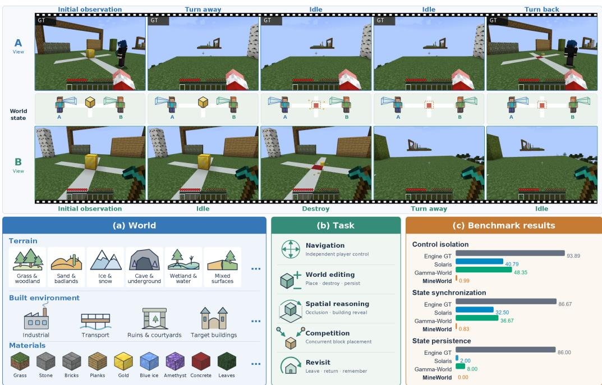  
Figure 1: Overview of MultiWorldBench. Top: A turns away while B destroys the gold block; when A returns, the edit persists. The middle row depicts the evolving world state and viewing directions. Bottom: (a) terrain, builtenvironment, and material diversity; (b) five task families; and (c) measured control-isolation, state-synchronization, and state-persistence scores from Table 3 (0–100; higher is better).

## Abstract

Multiplayer world models must ensure that independently controlled views remain consistent with one shared and persistent world. We introduce MultiWorldBench, a diagnostic Minecraft benchmark containing 495 case configurations across seven task suites and ten capabilities, including independent control, cross-view motion, shared-state synchronization, persistence, structural reasoning, concurrent interaction, and delayed revisit. We evaluate Solaris, Gamma-World, and MineWorld, using Engine GT as a reference. Gamma-World achieves the highest ten-capability average among the generated systems at 21.39, followed by Solaris at 20.88 and MineWorld at 1.89, while Engine GT reaches 91.69. Gamma-World performs better on several control, shared-state, and revisit capabilities, whereas Solaris leads in cross-view motion and racecondition consistency. Nevertheless, all generated systems score at most 8.00 on state persistence and 1.33 on structural consistency, and none succeeds in spatial reasoning or building-identity preservation. Human preferences produce the same overall ranking and show strong alignment with the automatic evaluation, with a mean dimension-level Spearman correlation of 0.96. These results show that plausible individual views do not yet constitute a coherent multiplayer world.

## 1 Introduction

Interactive world models have developed rapidly from learned latent simulators into actionconditioned video generators that support navigation and intervention [1, 2, 4]. The emerging multiplayer setting introduces a more demanding objective: several independently controlled views must describe one persistent world. A valid system must respond to each player’s own actions, isolate that player from unrelated controls, synchronize changes that belong to the shared state, and preserve entities when they leave and later re-enter view. Recent multiplayer world models indicate that this setting is becoming technically feasible [5, 7, 9].

Minecraft provides a particularly useful testbed because it ofers a stable control interface, scalable trajectory collection, discrete materials, and world changes that can be checked at known grid locations. Recent work has consequently introduced synchronized multiplayer data and model architectures in Minecraft [7, 9]. Yet evaluation has not advanced at the same pace. Solaris includes an evaluation suite for multiplayer generation [9], but current protocols provide limited variation in scene geometry, coarse summaries of distinct failure modes, and a narrow range of evaluation methods. As a result, they cannot fully distinguish whether a model follows each player’s controls, leaks one player’s actions into another view, reproduces the same physical motion across viewpoints, synchronizes an intervention, or preserves the identity of a revisited object. Per-view visual quality is also insuficient: two individually plausible videos may disagree on the number, material, motion, or location of objects. Table 1 positions these diferences against representative video and interactive-world benchmarks.

Figure 1 summarizes the world configurations and task families in MultiWorldBench. The persistence case illustrates how an edit made by one player must remain visible when another player later returns to the edited region. In a shared-state case, both players observe a colored cross marking one grid location. One or both players place or destroy a block at its center while their initial visibility is controlled. A valid rollout must execute the requested action, show a consistent block count and target location in both views, and, for placement, preserve the intended material. In a more challenging building-reveal case, player Bravo initially sees both player Alpha and a building, whereas Alpha sees an occluder. After Alpha removes the occluder, Alpha should observe the same building that remains visible to Bravo. These cases turn the abstract notion of a “shared world” into falsifiable cross-view observations.

To close this gap, we introduce MultiWorldBench, a benchmark organized around two requirements. The first is independent control, which asks whether each player responds to its assigned actions without interference from the other player and whether the resulting motion is compatible across views. The second is world consistency, which asks whether both views support the same persistent state. The benchmark contains three navigation metrics, five shared-world metrics, and two revisit metrics. Specifically, it evaluates control isolation, coordination fairness, cross-view motion, state synchronization, state persistence, structural consistency, spatial reasoning, race-condition consistency, style consistency, and building-identity consistency.

MultiWorldBench is designed around three principles. First, it orders cases according to the visual information shared between players. Players may be mutually visible, visible in only one direction, or mutually invisible. This progression reduces direct cross-view evidence and provides a candidate easy-to-hard ordering. The cases retain these visibility labels for stratified evaluation, although the aggregate results reported here do not by themselves establish such a dificulty ordering. Second, the benchmark covers the major Minecraft action families supported by current multiplayer video models. Navigation includes forward and backward movement, lateral movement, rotation, idle controls, and cross-view motion responses. The shared-state suite combines placement and destruction with one or two active players. Concurrent placement, occluder removal, and delayed cross-player revisit extend this taxonomy to conflicting actions, structural reveal, and long-term world persistence. Third, MultiWorldBench uses evaluation methods matched to the failure being tested. Estimated camera trajectories measure player-specific control responses; action-grounded visual judgments assess whether an actor’s movement produces the expected relative displacement in both views; binary visual judgments evaluate shared block states and building identity; segmentation and viewpoint estimation measure structural and spatial consistency; and color distributions measure style consistency after delayed revisit. This combination produces an interpretable capability profile instead of collapsing heterogeneous behaviors into a single video-quality score.

We evaluate Solaris [9], Gamma-World [7], and MineWorld [3] on 495 benchmark cases, using Engine GT as a reference. Three principal findings emerge. First, multiplayer-oriented models provide more stable independent view control, but remain far from the Engine-GT reference. Compared with MineWorld, Solaris and Gamma-World respond more reliably to player commands and exhibit better control isolation, role-level stability, and cross-view motion correspondence. However, both still sufer from control leakage, inaccurate motion magnitude, and incompatible responses across views when compared with Engine GT. Second, errors in basic actions and instruction execution propagate to more complex shared-world tasks. Solaris and Gamma-World may still move too little or too far, continue moving after a command ends, fail to execute a block operation, or apply the wrong operation, material, or location. Because synchronization, persistence, building reveal, spatial reasoning, and concurrent interaction all depend on correct movement and a valid initial world state, these basic failures can invalidate the later task before its target capability is meaningfully tested. Third, current systems demonstrate little reliable world memory. Generated systems frequently lose edited states, scene structure, or object identity after a region leaves view, even when coarse visual style remains similar. Human preferences reproduce the same overall model ordering and show strong rank agreement with the automatic evaluation. These findings are descriptive results under the recorded evaluation protocols rather than claims of statistical significance.

Our contributions are threefold: (1) a visibility-conditioned benchmark that varies cross-player evidence from mutual visibility to mutual invisibility and supports stratified evaluation; (2) a 495-case, seven-suite action taxonomy spanning navigation, cross-view motion, synchronized and persistent interventions, concurrent actions, building reveal, and delayed revisit; and (3) a tencapability evaluation system combining geometric, trajectory-based, VLM-based, segmentationbased, viewpoint-based, and distributional measurements, together with a matched comparison of two multiplayer world models, a single-player world-model baseline, an Engine-GT reference, and human-preference validation.

## 2 Related Work

World models and interactive generation. World models learn predictive dynamics to support action and planning [4]. Genie and DIAMOND demonstrate complementary approaches to interactive visual environments [1, 2]. Minecraft-based systems such as MineWorld further explore action-conditioned generation in interactive environments [3]. These single-player settings evaluate the evolution of an individual observation stream, but do not directly test whether independently controlled player views remain consistent with one shared world.

Video and interactive benchmarks. VBench and EvalCrafter evaluate perceptual, semantic, motion, and temporal video quality [6, 8], while T2V-CompBench evaluates compositional generation, including motion and spatial relationships [10]. Interactive-world benchmarks extend evaluation to action-conditioned and multi-turn generation. WBench evaluates multi-turn interaction [13], MIND examines action control and revisit memory [12], and WorldMark evaluates action dynamics and world memory [11]. GameWorld also evaluates interactive generation in game environments [14]. These evaluations address capabilities relevant to interactive world modeling, but do not directly assess whether changes induced by independently controlled players remain consistent across their respective views.

Multiplayer world models. Solaris introduces synchronized Minecraft data, a multiplayer video world model, and task-specific evaluations of movement, grounding, memory, building, and view consistency [9]. Gamma-World extends multiplayer generation toward larger numbers of agents and reports results on multiplayer tasks using distributional and perceptual metrics, including FID and FVD [7]. These studies establish important foundations for multiplayer world modeling. However, their evaluation protocols do not jointly provide the visibility stratification and capability-specific measurements needed to distinguish independent control, shared-state propagation, concurrent-edit resolution, and delayed cross-player identity preservation.

Table 1 summarizes the coverage of representative benchmarks and model-specific evaluation suites under the multiplayer capability definitions used in this work. MultiWorldBench brings these capabilities into a unified evaluation framework, combining controlled visibility, independent player control, shared-state interventions, and delayed cross-player revisits. It contains 495 case configurations across seven task suites and provides ten metrics organized into Navigation, Shared World, and Revisit.

Table 1: Comparison under our multiplayer capability definitions. ✓: direct evaluation; L: limited or indirect coverage; ×: no corresponding evaluation identified. Scale follows each source’s counting unit; – indicates an unreported count.
<table><tr><td rowspan="2">Benchmark</td><td colspan="3">Paired visibility</td><td colspan="3">Navigation</td><td colspan="5">Shared world</td><td rowspan="2">Revisit</td><td rowspan="2"></td><td rowspan="2">Scale N</td></tr><tr><td></td><td></td><td></td><td></td><td></td><td></td><td>A ↔ B A → B A | B Iso. Fair. Mot. Sync. Pers. Str. Spa. Race Style ID</td><td></td><td></td><td></td><td></td></tr><tr><td colspan="10">Video-generation benchmarks</td><td></td><td></td><td></td><td></td><td></td></tr><tr><td>VBench [6]</td><td>×</td><td>×</td><td>X</td><td>×</td><td>X</td><td>×</td><td>×</td><td>X</td><td>X</td><td>×</td><td>X</td><td>×</td><td>946</td></tr><tr><td>EvalCrafter [8]</td><td>×</td><td>×</td><td>×</td><td>X</td><td>×</td><td>×</td><td>X</td><td>X</td><td></td><td>×</td><td>X</td><td>X</td><td>700</td></tr><tr><td>T2V-CompBench [10]</td><td>X</td><td>X</td><td>X</td><td>×</td><td>X</td><td>X</td><td>X</td><td>X</td><td>X</td><td>X</td><td>X</td><td>X</td><td>1,400</td></tr><tr><td colspan="10">Interactive world-model benchmarks and evaluations</td><td></td><td></td><td></td><td></td><td></td></tr><tr><td>WBench [13]</td><td>X</td><td>X</td><td>X</td><td>X</td><td>X</td><td>X</td><td>X</td><td>X</td><td>X</td><td>X</td><td>L</td><td>L</td><td>289</td></tr><tr><td>GameWorld [14]</td><td>X</td><td>X</td><td>X</td><td>X</td><td></td><td>X</td><td>X</td><td>X</td><td>X</td><td>X</td><td>L</td><td>L</td><td>2,432</td></tr><tr><td>MineWorld Eval. [3]</td><td>X</td><td>X</td><td>X</td><td>X</td><td></td><td></td><td>X</td><td>X</td><td>X</td><td>X</td><td>X</td><td>X</td><td>1,000</td></tr><tr><td colspan="10">Multiplayer world-model evaluations</td><td></td><td></td><td></td><td></td><td></td></tr><tr><td>Gamma-World [7]</td><td>X</td><td>X</td><td>X</td><td>×</td><td></td><td></td><td></td><td></td><td>×</td><td>X</td><td>X</td><td>×</td><td></td></tr><tr><td>Solaris Eval. [9]</td><td>√</td><td>√</td><td>×</td><td>L</td><td>√</td><td></td><td></td><td>L</td><td>L</td><td>X</td><td>×</td><td>×</td><td></td></tr><tr><td>MultiWorldBench</td><td>√</td><td>√</td><td>√</td><td>√</td><td>5</td><td>√</td><td>了</td><td>√</td><td>√</td><td>√</td><td>√</td><td>√</td><td>495</td></tr></table>

## 3 Benchmark Design

## 3.1 Paired observations and independent actions

Let $a _ { t } ^ { i }$ and $\ v x _ { t } ^ { i }$ denote the native action and observation of player $i \in \{ A , B \}$ . The model generates

$$
p _ { \theta } ( x _ { t + 1 } ^ { A } , x _ { t + 1 } ^ { B } \mid x _ { \leq t } ^ { A } , x _ { \leq t } ^ { B } , a _ { \leq t } ^ { A } , a _ { \leq t } ^ { B } ) .\tag{1}
$$

The views should admit one shared world state, while each player’s camera remains driven by its own controls. The benchmark tests observable consequences of this requirement rather than assuming access to a model’s internal state.

Engine recordings execute native movement, camera, placement, and destruction actions. Scene initialization is separate from the recorded trajectory. Case files specify role poses, target geometry, action intervals, expected changes, and evaluation frames. When a rollout is not collected in the engine, its supplied action schedule is identified as planned conditioning, not an executed ground-truth log. The V4 navigation suites use newly recorded native Engine-GT trajectories and their executed action logs as references for model conditioning and evaluation.

## 3.2 Dataset Statistics

MultiWorldBench comprises 495 evaluation cases spanning diverse Minecraft environments. We annotate each case along four complementary dimensions: terrain, spatial openness, lighting, and built-environment complexity, as summarized in Fig. 2. The 20 cross-view-motion cases use a controlled marker arena and are categorized as mountain/arena, open, bright, and simple. Representative frames are provided in Appendix A.

Terrain Diversity. The dataset contains six terrain groups (Fig. 2(a)). The merged mountain/arena group is the largest (45.1%), followed by forest (16.0%), desert (14.9%), snow (11.5%), water (10.1%), and cave environments (2.4%). These groups cover natural biomes, underground spaces, and controlled or constructed environments.

Spatial Openness and Lighting. Most cases occur in open environments (73.5%), followed by semi-open (26.1%) and enclosed environments (0.4%), as shown in Fig. 2(b). Lighting is predominantly bright (89.1%), with moderate (6.1%) and dim (4.8%) cases providing more challenging visibility conditions (Fig. 2(c)).

Built-Environment Complexity. As shown in Fig. 2(d), simple built environments constitute 58.6% of the dataset, complex built environments account for 37.4%, and natural environments account for 4.0%. These groups range from scenes without salient constructed structures to environments containing sparse constructions or dense architectural layouts.

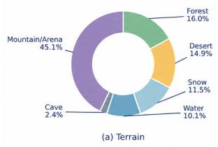

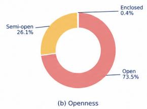

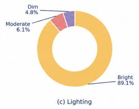

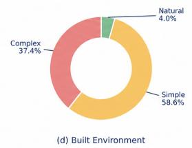  
Figure 2: Dataset composition in MultiWorldBench. Distribution of 495 cases by terrain, spatial openness, lighting, and built-environment complexity.

## 3.3 Evaluation case construction

Each case specifies 1) scene geometry and initial visibility, 2) player roles and target locations, and 3) an action schedule with expected changes and evaluation frames. The benchmark contains 495 case configurations across seven task suites supporting ten capabilities. Initial visibility is mutual, one-way, or absent and describes only the starting configuration. Geometryrich scenes provide stronger camera-tracking constraints than flat environments, although they cannot eliminate reconstruction error. For block-intervention tasks, colored crosses mark target locations, expected block counts are specified explicitly, and dropped items are excluded from full-block counts.

1) Matched navigation. Six scenes, three visibility conditions, and ten schedules per scene– visibility combination yield 180 cases. Each case tests both players as the target, repeating the target player’s action while the other player is idle, performs the same action, or performs a diferent action. The schedules include forward and backward movement, left and right strafing, yaw and pitch rotation, combined translation and rotation, and idle controls. For readability, illustrative controls are denoted as W (forward), S (backward), A (left strafe), ← (leftward camera rotation), and idle. Representative paired views for the three visibility conditions and examples of the native navigation controls are shown in Fig. 3. Scene and visibility assignments are balanced across action conditions. These cases support both control-isolation and coordination-fairness evaluation.

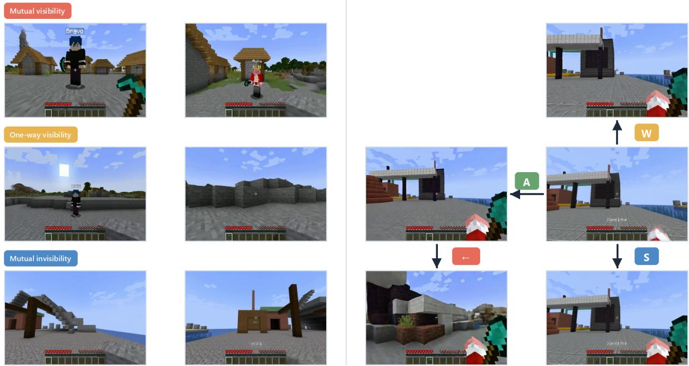  
Figure 3: Visibility configurations and navigation controls. The left panel presents paired agent views under mutual visibility, one-way visibility, and mutual invisibility. The right panel illustrates the native navigation controls, including forward and backward movement, left strafing, and leftward camera rotation. Frames within each example are sampled from the same continuous video.

2) Cross-view motion. Twenty cases evaluate whether the actor’s movement is represented consistently across the two player views. The actor remains visible to the other player, enabling comparison between the movement indicated by the actor’s own view and that observed from the partner’s view.

3) Shared-state interaction. Five scenes, three visibility conditions, four interaction types, and two variants yield 120 cases. The interaction types combine one or two active players with placement or destruction, producing 60 cases for each operation. The suite tests whether the intended edit succeeds and whether the resulting world state appears consistently across the two player views. Representative before-and-after examples are shown in Fig. 4.

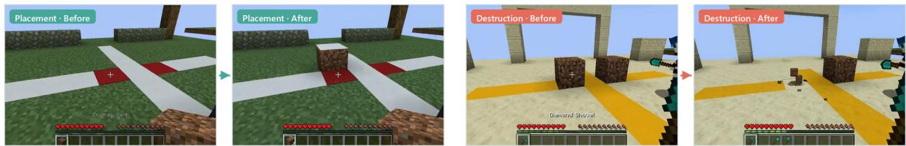  
Figure 4: Representative shared-state interactions. From left to right: the marked target before placement, the resulting placed block, the scene before destruction, and the scene after destruction. Teal denotes placement and coral denotes destruction. Each before–after pair is sampled from the same continuous rollout.

4) Shared-state persistence. Five environments, five block materials, and two operations yield 50 cases. One player places or destroys a block at the center of a visible cross, after which the other player returns to the operation region. A rollout is successful only when the expected edit is visible to the operator after the action and remains visible to the returning observer.

5) Building reveal. In 75 cases, A’s initial view is occluded while B can see the target building. A then removes the occluder to reveal the building, as illustrated in the first two panels of Fig. 5. Successful revelation is a shared prerequisite for structural-consistency and spatial-reasoning evaluation, so both metrics use the same cases.

6) Concurrent placement. In 30 cases, both players attempt to place diferent candidate materials at the same location and time using a single placement event. The two views are compared for agreement on block count, block type, and whether the result matches one of the intended materials. 7) Delayed cross-player revisit. Ten scene configurations and their role-swapped counterparts yield 20 directional cases. The first observer sees the building and turns away; after the building remains outside both views for a 70-frame idle interval (3.5 seconds at 20 Hz), the second observer turns toward it. The evidence pair compares frames 20 and 155, while role swapping exchanges the early and late observers. Unlike a same-camera return, this protocol tests appearance and identity persistence across both time and player identity. Representative occlusion, reveal, and cross-player revisit views are summarized in Fig. 5.

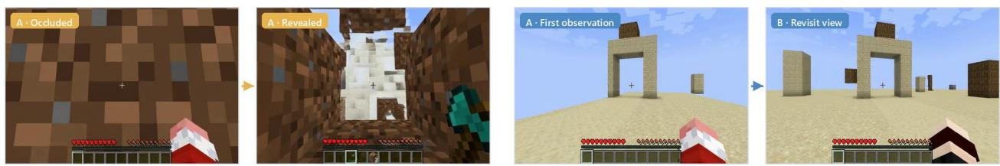  
Figure 5: Building reveal and cross-player revisit. The first two panels show A’s initially occluded view and the target exposed after removal of the occluding block. The last two panels show the same target from the two observer roles used in the role-swapped revisit protocol. Orange denotes the occlusion–reveal transition, while blue denotes the cross-player observation pair.

Table 2: Evaluation tasks and case support. The seven task suites contain 495 case configurations. A task suite may support multiple metrics; cases shared by multiple metrics are counted only once.
<table><tr><td>Task</td><td>Cases</td><td>Evaluation target</td></tr><tr><td>Matched navigation</td><td>180</td><td>Control isolation and coordination fairness</td></tr><tr><td>Cross-view motion</td><td>20</td><td>Consistency between actor-view and partner-view motion</td></tr><tr><td>Shared-state interaction</td><td>120</td><td>Placement/destruction agreement across views</td></tr><tr><td>Shared-state persistence</td><td>50</td><td>Operator and returning-observer change agreement</td></tr><tr><td>Building reveal</td><td>75</td><td>Structural identity, revealed area, and relative viewpoint</td></tr><tr><td>Concurrent placement</td><td>30</td><td>Count, type, and intended-material agreement</td></tr><tr><td>Delayed cross-player revisit</td><td>20</td><td>Color-distribution and building-ID persistence</td></tr><tr><td>Total</td><td>495</td><td>Seven task suites supporting ten capabilities</td></tr></table>

## 4 Evaluation

Scores retain their native scales in the stored artifacts. We display all results on [0, 100] for readability, multiplying binary or normalized scores by 100. This display conversion does not make heterogeneous metrics interchangeable.

## 4.1 Navigation

Response features. The V4 navigation evaluator estimates camera poses with MCV using known-map 2D–3D correspondences and PnP. Videos are processed at 480p with camera intrinsics transformed consistently with image resizing and cropping; point replenishment, robust tracking, and backward recovery improve pose coverage. Translation is expressed in the map coordinate scale, without additional scaling to GT motion. For each action interval, the translational response comprises planar endpoint displacement, planar path length, and RMS deviation from the endpoint chord normalized by path length. Rotation is represented by a start-relative path on SO(3) and its accumulated angular travel, rather than endpoint angle alone.

For non-negative translational feature samples X, Y, let ${ \widehat { W } } _ { 1 } ( X , Y )$ be the implemented empiricalquantile approximation to one-dimensional Wasserstein distance. Define

$$
s _ { f } ( X , Y ) = 1 0 0 \left[ 1 - \operatorname* { m i n } \left( 1 , \frac { \widehat { W } _ { 1 } ( X , Y ) } { \operatorname* { m a x } ( \operatorname* { m e a n } | X | + \operatorname* { m e a n } | Y | , \epsilon _ { f } ) } \right) \right] .\tag{2}
$$

The denominator floors are 0.5 map units for endpoint displacement and path length, and 0.1 for normalized chord deviation; rotation comparisons use a $1 0 ^ { \circ }$ floor. Similarity alone can reward equal inactivity, so commanded-motion response checks are applied as specified below. Insuficient pose evidence is reported separately from an observed control failure. The recorded navigation run requires at least three common valid action ofsets across the four isolation repetitions and a contiguous jointly valid run of at least three samples for a fairness response. Optional bounded-gap interpolation uses linear translation and quaternion interpolation between reliable anchors within an action interval, with no extrapolation; it must be declared in the run configuration and was disabled in the stored V4 180-case run.

Control isolation. Comparisons are constructed within a case: the target repeats the same movement and camera command while the partner’s command changes. Two repetitions provide reference responses. Let $P _ { r , h , j } ^ { ( k ) }$ denote the start-relative response profile for target role r, channel $h \in$ {translation, rotation}, reference repetition $j \in \{ 1 , 2 \}$ , and profile sample $k ,$ and let $Q _ { r , h , c } ^ { ( k ) }$ denote the response under partner condition c. Profiles preserve the recorded command progress and elapsed time. Define

$$
\begin{array} { r l } & { \displaystyle { e _ { r , h , c } = \frac { 1 } { 2 } \sum _ { j = 1 } ^ { 2 } \frac { K ^ { - 1 } \sum _ { k = 1 } ^ { K } d _ { h } ( { P } _ { r , h , j } ^ { ( k ) } , Q _ { r , h , c } ^ { ( k ) } ) } { \operatorname* { m a x } ( L _ { h } ( { P } _ { r , h , j } ) , \epsilon _ { h } ) } , } } \\ & { \displaystyle { S _ { \mathrm { i s o l a t i o n } } = 1 0 0 \operatorname* { m i n } _ { r , h , c } \left[ 1 - \operatorname* { m i n } ( 1 , e _ { r , h , c } ) \right] . } } \end{array}\tag{3}
$$

Here $d _ { \mathrm { t r a n s l a t i o n } }$ is Euclidean position distance, $d _ { \mathrm { { r o t a t i o n } } }$ is the geodesic rotation angle, and $L _ { h }$ is the reference path length in the corresponding units. The floors are $\epsilon _ { \mathrm { t r a n s l a t i o n } } = 0 . 5$ map units and $\epsilon _ { \mathrm { r o t a t i o n } } = 1 0 ^ { \circ }$ . Both channels are evaluated for every action, including an uncommanded channel. Repeated-reference error is diagnostic only and is not subtracted from the treatment error.

A WBench-style repeated-trajectory control-consistency check using translation and rotation cnATE must reach the provisional threshold 0.6; otherwise isolation is unavailable. Only the target trajectory is required for its directional comparison. Static frames establish a noise baseline from the configured initial idle interval, or the final one-second idle interval when no initial interval is specified. With suficient pose and noise evidence, a commanded reference response at or below the larger of the measured noise and response floor receives zero; fewer than three valid noise samples makes the comparison unavailable. The uncommanded channel uses the denominator floor without a motion-response gate, and treatment responses are not motion-gated. Thus passing consistency is an eligibility condition, not a correction that removes residual repeatability error.

Coordination fairness. Within each case, response samples from A and B are grouped by identical recorded movement and camera commands. Let $\mathcal { H } _ { c }$ contain only the channels commanded by action class $c .$ For translation, $T _ { c }$ is the minimum of Eq. 2 over endpoint displacement, path length, and normalized chord deviation. For rotation, compare start-relative rotation paths at 20 samples. The cost of matching two responses $a , b$ is

$$
C ( { a } , { b } ) = \operatorname* { m i n } \left( 1 , \frac { 2 0 ^ { - 1 } \sum _ { k = 1 } ^ { 2 0 } \theta ( ( R _ { a } ^ { ( k ) } ) ^ { \top } R _ { b } ^ { ( k ) } ) + | \ell _ { a } - \ell _ { b } | } { \operatorname* { m a x } ( ( \ell _ { a } + \ell _ { b } ) / 2 , 1 0 ^ { \circ } ) } \right) ,\tag{4}
$$

where $\theta$ and accumulated angular travels $\ell _ { a } , \ell _ { b }$ are in degrees. Equal-size empirical expansions of the two response sets are optimally assigned, giving $U _ { c } = 1 0 0 ( 1 - \mathrm { m e a n } C )$ over the assigned pairs. This retains rotation direction and intermediate motion, including overshoot and return.

For channel $h ,$ let $\rho _ { r , c , h }$ be the fraction of role $r \mathrm { { s } }$ responses exceeding its duration-scaled static-noise threshold. With $V _ { c , \mathrm { t r a n s l a t i o n } } = T _ { c }$ and $V _ { c , \mathrm { r o t a t i o n } } = U _ { c }$ , fairness is

$$
S _ { \mathrm { f a i r } } = \frac { 1 } { | \mathcal { C } | } \sum _ { c \in \mathcal { C } } \operatorname* { m i n } _ { h \in \mathcal { H } _ { c } } \left[ V _ { c , h } \operatorname* { m i n } ( \rho _ { A , c , h } , \rho _ { B , c , h } ) \right] .\tag{5}
$$

Here $\mathcal { C }$ contains the action classes with suficient response evidence for both roles. A case without such evidence is unavailable. Equal nonresponse receives zero, and inactive channels do not inflate the score. The case score averages its eligible action classes; the reported aggregate averages evaluable cases and reports their coverage. This measures comparable commanded responses across roles, not success on a joint cooperative goal.

Cross-view motion consistency. A VLM directly compares before-and-after screenshots from the observer and actor views in the 20-case lateral-translation suite. Frames 10 and 60 are used to judge whether the other player’s horizontal image position moves left, right, or remains stationary, without requesting localization boxes, coordinates, or visual markers. Each view is checked independently against the expected image-space direction of the recorded action. For binary correctness judgments qobserver, qactor,

$$
S _ { \mathrm { c r o s s - v i e w } } = 1 0 0 q _ { \mathrm { o b s e r v e r } } q _ { \mathrm { a c t o r } } .\tag{6}
$$

Both views must be correct for a case to pass. An unclear judgment or an unparseable response is unavailable, while missing generated video is a task failure rather than a zero-valued visual judgment. The aggregate is the mean over evaluable cases, with coverage reported separately. This direct-VLM protocol remains an experimental visual assessment.

## 4.2 Shared world

Shared-state synchronization. A VLM answers independent binary questions: did the intended action succeed; do both views show the same expected number of changed blocks; and did the change occur at the marked target location? Placement adds a fourth question: do both views show the same intended material? Initial and synchronized post-action images supply context. Unclear visual evidence receives zero under this judge protocol. Before voting, a per-frame visibility check requires the marked target cross to be observable; a failed check sets all scored answers for that frame to zero. Each gated question is majority-voted over frames 60, 70, and 80 in the 120-case experiment.

$$
\begin{array} { l } { { S _ { \mathrm { p l a c e } } = \frac { q _ { \mathrm { s u c c e s s } } + q _ { \mathrm { c o u n t } } + q _ { \mathrm { l o c a t i o n } } + q _ { \mathrm { m a t e r i a l } } } { 4 } , } } \\ { { S _ { \mathrm { d e s t r o y } } = \frac { q _ { \mathrm { s u c c e s s } } + q _ { \mathrm { c o u n t } } + q _ { \mathrm { l o c a t i o n } } } { 3 } . } } \end{array}\tag{7}
$$

The overall score is the equal mean of the placement and destruction means. Success is a question, not a multiplicative gate in this protocol.

Shared-state persistence. The judge receives labeled before-and-after pairs for the operator and the returning observer. It asks whether the expected change occurred in the operator view and whether the returning observer sees the same expected change at the marked cross. For each pair, the marked cross and its center target cell must be clearly visible in both the before and after images; otherwise the corresponding question is zero. A case uses the strict product of the two binary answers. Placement and destruction pass rates are macro-averaged, so each operation contributes equally.

Cross-view structural consistency. Two binary judgments ask whether the generated revealed building is the same building as its corresponding GT, and whether generated A and B show the same building. Each question uses majority vote over frames 80, 100, and 120; the case score is the minimum of the two votes. In the current merged design, occluder removal and target revelation are shared prerequisites.

Spatial reasoning. After the same reveal prerequisites, spatial evaluation reuses the GT-identity judgment from structural consistency. It does not ask a second identity question. Segmentation measures projected-area agreement $S _ { \mathrm { a r e a } } = 1 0 0 \operatorname* { m i n } ( A _ { \mathrm { p r e d } } , A _ { \mathrm { G T } } ) / \operatorname* { m a x } ( A _ { \mathrm { p r e d } } , A _ { \mathrm { G T } } )$ . Camera-angle agreement decreases linearly with wrapped angular error and reaches zero at $3 0 ^ { \circ }$ . After passing the prerequisites and identity check, the score is the lower of area and angle agreement. Missing reliable geometry makes the case unavailable; a failed prerequisite is an observed failure and scores zero. The shared prerequisites prevent duplicated identity judgments across structural and spatial evaluation.

Race-condition consistency. For simultaneous single-event placement, the V4 VLM reports target visibility, changed-block count, and material separately for A and B at synchronized frames 60, 80, and 100, using the intended candidate blocks as reference images. At checkpoint t, let $v _ { t }$ indicate that the target is visible in both views, $a _ { t }$ indicate agreement on count and material, and $u _ { t }$ indicate a valid placement outcome. Valid outcomes contain one or two blocks made from the supplied candidate materials; two-block material combinations are unordered. The case score is

$$
S _ { \mathrm { r a c e } } = 1 0 0 \mathbf { 1 } \left[ \sum _ { t \in \{ 6 0 , 8 0 , 1 0 0 \} } v _ { t } a _ { t } u _ { t } \geq 2 \right] .\tag{8}
$$

Conditions must pass jointly at the same checkpoint before temporal voting. Both views showing an empty target can satisfy state agreement but cannot pass valid placement; a hidden target, an invalid material, or three or more changed blocks fails the checkpoint. Missing judge output is a task error. This evaluates visible shared-state consistency and execution under conflicting actions without prescribing a winner. The earlier protocol separately majority-voted its count, type, and candidate-match questions before taking their minimum; results from that protocol must not be treated as V4 joint-vote scores without rescoring.

## 4.3 Revisit consistency

Style. We crop each image to vertical fractions [.08, .88] and horizontal fractions [.08, .92], suppress near-black/white achromatic pixels, and normalize a joint $1 6 \times 1 6 \times 1 6$ RGB histogram h. For a visit–return pair,

$$
\begin{array} { r } { d ( h _ { 0 } , h _ { 1 } ) = \sqrt { \frac { 1 } { 2 } \mathrm { K L } _ { 2 } ( h _ { 0 } \| m ) + \frac { 1 } { 2 } \mathrm { K L } _ { 2 } ( h _ { 1 } \| m ) } , } \\ { m = ( h _ { 0 } + h _ { 1 } ) / 2 . \qquad } \end{array}\tag{9}
$$

The generated distance is compared with the engine GT distance for the same pair. With caseconfigured pairs $\mathcal { P }$ (one cross-player pair per directional case in the current suite),

$$
S _ { \mathrm { s t y l e } } = 1 0 0 \operatorname* { m a x } \left( 0 , 1 - \frac { | \mathcal { P } | ^ { - 1 } \sum _ { p \in \mathcal { P } } | d _ { p } ^ { \mathrm { g e n } } - d _ { p } ^ { \mathrm { G T } } | } { 0 . 2 5 } \right) .\tag{10}
$$

For the Engine-GT baseline, $d _ { p } ^ { \mathrm { g e n } }$ is obtained from an independent native recapture of the same case, while $\bar { d } _ { p } ^ { \mathrm { G T } }$ comes from the original reference recording. Its score therefore measures agreement in visit–return color change between two engine recordings and need not equal 100. This detects changes such as sand-like colors becoming grass-like colors. It is insensitive to spatial rearrangement that preserves the histogram, and is therefore complemented by identity.

Identity. For each pair, the VLM asks whether the same building appears at initial visit and return. GT identity judgments are recorded as reference checks rather than used as a score gate in the current Solaris/Gamma handof evaluation. The GT/MineWorld supplementary evaluation and the generic metric entry point instead exclude cases whose GT identity check fails; their eligibility policy must be reported explicitly, and they are not interchangeable with the reference-only handof protocol. A case passes only if every generated evidence pair preserves building identity; the current directional cases each contain one pair. Missing evidence is not replaced by a passing vote. We report the mean across 20 directional cases as the primary aggregate and the mean of the lower primary/counter score within each of ten scene pairs as a stricter role-swap diagnostic.

## 4.4 Human Preference Annotation

Data preparation. We sample cases from each evaluated capability and collect the corresponding videos produced by four systems: Engine GT, Solaris, Gamma-World, and MineWorld. We denote the set of evaluated systems as

$$
\mathcal { M } = \{ \mathrm { E n g i n e ~ G T } , \mathrm { S o l a r i s } , \mathrm { G a m m a } \mathrm { - W o r l d } , \mathrm { M i n e W o r l d } \} .\tag{11}
$$

For each case and evaluation dimension, we construct a complete pairwise comparison among the four systems. The number of system pairs for each case is therefore

$$
| { \mathcal { P } } | = { \binom { | { \mathcal { M } } | } { 2 } } = { \binom { 4 } { 2 } } = 6 .\tag{12}
$$

Using $E , S , G ,$ and M to denote Engine GT, Solaris, Gamma-World, and MineWorld, respectively, the comparison set is

$$
\mathcal { P } = \{ ( E , S ) , ( E , G ) , ( E , M ) , ( S , G ) , ( S , M ) , ( G , M ) \} .\tag{13}
$$

Each annotation task presents one pair of system outputs generated under the same benchmark case and task condition. This construction ensures that the two videos in each comparison correspond to the same evaluation target.

Annotation protocol. Each task presents the two videos with synchronized playback controls, together with a dimension-specific evaluation question. The instructions explicitly state the evidence that annotators should consider and the unrelated factors that should be ignored. For example, when evaluating control isolation, annotators determine whether the target player’s response remains consistent when its own action is held fixed and the other player’s action changes, including whether an idle target view remains stable. Diferences in texture sharpness, general visual quality, and minor rendering details are ignored unless they directly afect the target capability.

After viewing both videos, the annotator selects one of four outcomes:

$$
y _ { c , d } ^ { ( i , j ) } \in \{ i \succ j , ~ i \sim j , ~ j \succ i , ~ \emptyset \} , \qquad ( i , j ) \in \mathcal { P } ,\tag{14}
$$

where c denotes the benchmark case and d denotes the evaluation dimension. The relations $i \succ j$ and $j \succ i$ indicate that one system performs better than the other, while $i \sim j$ indicates no meaningful diference. The symbol $\emptyset$ denotes an invalid comparison for which a reliable judgment cannot be made because of missing content, playback failure, or insuficient visual evidence. Each task evaluates only one capability dimension. Consequently, the same pair of videos may receive diferent judgments under diferent evaluation criteria.

## 5 Experiments

## 5.1 Setup and evidence

We evaluate Solaris, Gamma-World, and MineWorld across three benchmark tracks, using Engine GT as a reference where applicable. The evaluation comprises 495 case configurations covering ten capabilities, with all scores reported on a 0–100 scale. Track averages weight their constituent metrics equally, and the overall score is the equally weighted average of all ten capability scores. Table 3 and Figure 6 summarize the results. Among the generated systems, Gamma-World achieves the highest overall average (21.39), followed by Solaris (20.88) and MineWorld (1.89). Gamma-World narrowly leads Solaris on Navigation (52.84 vs. 51.95) and performs better on Revisit (3.04 vs. 0.89), whereas Solaris slightly leads on Shared World (10.23 vs. 9.87), primarily due to its stronger race-condition consistency (16.67 vs. 3.33). Overall, all three generated systems remain weak in state persistence, structural consistency, spatial reasoning, and identity preservation, indicating that plausible short-term outputs do not yet constitute coherent multiplayer worlds.

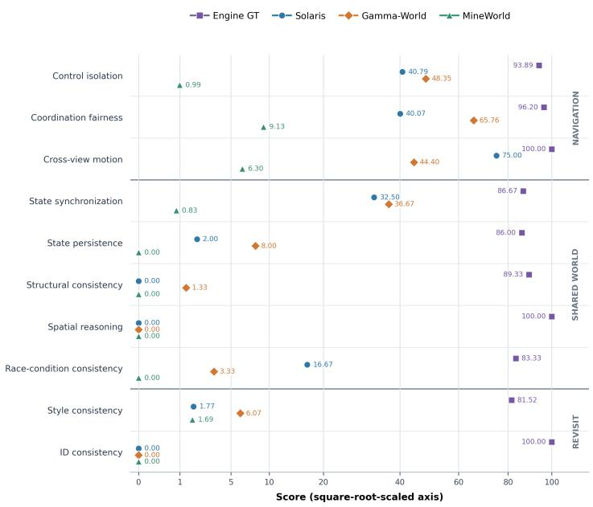  
(a) Ten-capability score profile.

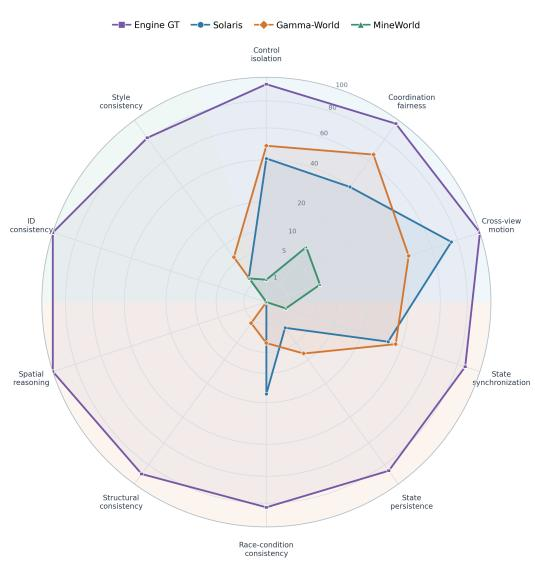  
(b) Ten-capability radar profile.  
Figure 6: Capability comparison across Navigation, Shared World, and Revisit. Both panels use square-root-scaled positions to improve the visibility of diferences among low scores; displayed tick labels and annotations retain the original scores.

Table 3: Main results across ten capabilities. Scores are displayed on a 0–100 scale; higher is better. Track averages weight metrics equally, and the overall score weights all ten capabilities equally. Bold marks the higher model score or a tie; averages are bold for readability.
<table><tr><td>Capability</td><td>Cases</td><td>Engine GT</td><td>Solaris</td><td>Gamma-World</td><td>MineWorld</td></tr><tr><td>Navigation</td><td></td><td></td><td></td><td></td><td></td></tr><tr><td>Control isolation</td><td>180</td><td>93.89</td><td>40.79</td><td>48.35</td><td>0.99</td></tr><tr><td>Coordination fairness</td><td>180</td><td>96.20</td><td>40.07</td><td>65.76</td><td>9.13</td></tr><tr><td>Cross-view motion</td><td>20</td><td>100.00</td><td>75.00</td><td>44.40</td><td>6.30</td></tr><tr><td>Track average</td><td></td><td>96.70</td><td>51.95</td><td>52.84</td><td>5.47</td></tr><tr><td>Shared world</td><td></td><td></td><td></td><td></td><td></td></tr><tr><td>State synchronization</td><td>120</td><td>86.67</td><td>32.50</td><td>36.67</td><td>0.83</td></tr><tr><td>State persistence</td><td>50</td><td>86.00</td><td>2.00</td><td>8.00</td><td>0.00</td></tr><tr><td>Structural consistency</td><td>75</td><td>89.33</td><td>0.00</td><td>1.33</td><td>0.00</td></tr><tr><td>Spatial reasoning</td><td>75</td><td>100.00</td><td>0.00</td><td>0.00</td><td>0.00</td></tr><tr><td>Race-condition consistency</td><td>30</td><td>83.33</td><td>16.67</td><td>3.33</td><td>0.00</td></tr><tr><td>Track average</td><td></td><td>89.07</td><td>10.23</td><td>9.87</td><td>0.17</td></tr><tr><td>Revisit</td><td></td><td></td><td></td><td></td><td></td></tr><tr><td>Style consistency</td><td>20</td><td>81.52</td><td>1.77</td><td>6.07</td><td>1.69</td></tr><tr><td>ID consistency</td><td>20</td><td>100.00</td><td>0.00</td><td>0.00</td><td>0.00</td></tr><tr><td>Track average</td><td></td><td>90.76</td><td>0.89</td><td>3.04</td><td>0.85</td></tr><tr><td>Overall average</td><td></td><td>91.69</td><td>20.88</td><td>21.39</td><td>1.89</td></tr></table>

## 5.2 Per-Dimension Results

We discuss the principal results across navigation, shared-world consistency, and delayed revisit below. Representative qualitative examples are provided in Appendix B.

## 5.2.1 Navigation.

Control isolation. Among the generated systems, Gamma-World (48.35) leads Solaris (40.79) and MineWorld (0.99), but remains below Engine GT (93.89). Figure 10 illustrates the central failure: although Bravo receives no command, Alpha’s action still afects Bravo’s view. Gamma-World exhibits a smaller unintended shift in this example, while Solaris changes the inactive view more substantially. MineWorld exhibits unstable camera poses, with large, irregular viewpoint shifts even in the absence of a command to Bravo.

Coordination fairness. Gamma-World (65.76) outperforms Solaris (40.07) and MineWorld (9.13), but remains below Engine GT (96.20). Among the generated systems, Gamma-World gives Alpha and Bravo the most comparable camera-motion responses to the same command. Solaris shows larger role-dependent diferences in motion magnitude, while MineWorld’s substantial camera drift obscures the commanded response in both views.

Cross-view motion consistency. Across the 20 cross-view motion cases, Solaris (75.00) leads Gamma-World (44.40) and MineWorld (6.30), while Engine GT (100.00) provides the reference. Appendix Figure 11 illustrates a representative result: Engine GT and Solaris reproduce the expected displacement in both views, Gamma-World omits the corresponding response, and MineWorld loses scene correspondence. Overall, plausible motion in a single view does not guarantee motion consistency across multiple views.

## 5.2.2 Shared world.

State synchronization. Engine GT (86.67) substantially outperforms Gamma-World (36.67), Solaris (32.50), and MineWorld (0.83). The aggregate masks a clear operation diference: on placement, Solaris (15.00) outperforms Gamma-World (1.67), whereas on destruction, Gamma-World (71.67) outperforms Solaris (50.00). In the placement example (Figure 12), Solaris places a dirt block, but the block appears undersized and suspended above the target location rather than being grounded in the scene. Gamma-World performs the wrong action, turning the placement instruction into destruction and removing the target block. MineWorld loses cross-view scene correspondence. In the destruction example (Figure 12), Solaris and Gamma-World remove the target in both views, while MineWorld again produces divergent world states.

State persistence. Gamma-World (8.00), Solaris (2.00), and MineWorld (0.00) all remain far below Engine GT (86.00). As illustrated in Figure 13, Engine GT preserves the edit when the other player returns. Gamma-World does not successfully establish the intended edit, but it retains the surrounding scene and the cross-shaped ground marker after the return, showing relatively better scene continuity. In contrast, Solaris not only fails to preserve the edit but also largely erases the original scene structure in the returning view. MineWorld generates a substantially diferent surrounding environment and fails to maintain a stable shared world.

Structural consistency. Gamma-World (1.33) passes only one of the 75 building-reveal cases, while Solaris (0.00) and MineWorld (0.00) pass none; all three remain far below Engine GT (89.33). In Figure 14, the building visible to Bravo is also revealed to Alpha by Engine GT. The generated systems instead leave Alpha occluded, trapped in altered geometry, or in a scene that no longer corresponds to Bravo’s view.

Spatial reasoning. Solaris (0.00), Gamma-World (0.00), and MineWorld (0.00) all fail this evaluation, while Engine GT (100.00) serves as a reference check. The same building-reveal example in Figure 14 illustrates this failure. When the target building is missing, remains occluded, or changes identity across views, its relative direction cannot be recovered consistently.

Race-condition consistency. Solaris (16.67) outperforms Gamma-World (3.33) and MineWorld (0.00), but remains far below Engine GT (83.33). The task concurrently places a gold block and a diamond block at the same location and requires both views to jointly observe a unique final world state. As shown in Figure 15, Solaris at least produces matching beige sandstone-like blocks whose color is closer to gold, although the material remains incorrect. Gamma-World either generates a block with the wrong color or fails to execute the placement, while MineWorld fails to maintain a common scene across the two views.

## 5.2.3 Revisit.

Style consistency. Gamma-World (6.07) performs modestly better than Solaris (1.77) and MineWorld (1.69), but all generated-system scores remain very low relative to Engine GT (81.52). In Figure 16, Gamma-World retains a broadly similar gray stone-ground and sky palette after the delayed return, even though the building disappears. This example illustrates that palette similarity alone does not establish the persistence of the same world.

ID consistency. Solaris (0.00), Gamma-World (0.00), and MineWorld (0.00) all fail to preserve building identity, whereas Engine GT (100.00) passes the identity reference check. In the same delayed-revisit case (Figure 16), Engine GT preserves the building, while Solaris and Gamma-World remove it and MineWorld changes the scene almost entirely. Building identity is therefore not recovered even when coarse color statistics remain partially similar.

## 5.3 Human Preference Results and Metric Alignment

Human preference win ratio. Following VBench [6], a win, tie, and loss contribute 1, 0.5, and 0 points, respectively. Let $\mathcal { J } _ { m , d }$ denote the set of valid pairwise judgments involving system m in evaluation dimension d. The human preference win ratio is defined as

$$
H _ { m , d } = \frac { 1 } { | \mathcal { I } _ { m , d } | } \sum _ { j \in \mathcal { I } _ { m , d } } h _ { m , d } ^ { ( j ) } , \qquad h _ { m , d } ^ { ( j ) } \in \{ 0 , 0 . 5 , 1 \} .\tag{15}
$$

We summarize performance across the evaluated dimensions using the macro-average

$$
\overline { { H } } _ { m } = \frac { 1 } { | \mathcal { D } | } \sum _ { d \in \mathcal { D } } H _ { m , d } ,\tag{16}
$$

where D denotes the set of ten evaluated dimensions. Engine GT (99.33%) achieves the highest overall human win ratio. Among the generated systems, Gamma-World (50.67%) ranks first, followed by Solaris (37.67%) and MineWorld (12.33%). Gamma-World achieves the highest human win ratio among the generated systems in eight of the ten dimensions, whereas Solaris leads in race-condition consistency and cross-view motion. This result is consistent with the overall automatic evaluation, which also ranks Gamma-World above Solaris and MineWorld.

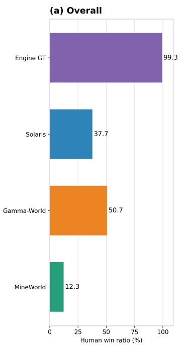

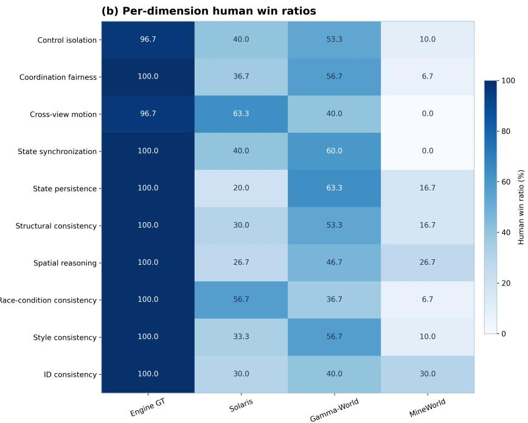  
Figure 7: Human preference win ratios. The left panel reports the macro-average win ratio across the ten evaluated dimensions. The right panel reports the win ratio of each system within each dimension.

Alignment with automatic evaluation. Following VBench [6], we convert the automatic scores into system-level win ratios. Let M denote the set of four evaluated systems, including Engine GT, and let $q _ { m , d }$ denote the automatic score of system m in dimension d. For every pair of distinct systems m and $m ^ { \prime }$ , we define

$$
a _ { m , m ^ { \prime } , d } = \left\{ \begin{array} { l l } { 1 , } & { q _ { m , d } > q _ { m ^ { \prime } , d } , } \\ { 0 . 5 , } & { q _ { m , d } = q _ { m ^ { \prime } , d } , } \\ { 0 , } & { q _ { m , d } < q _ { m ^ { \prime } , d } , } \end{array} \right.\tag{17}
$$

and calculate the automatic-evaluation win ratio as

$$
A _ { m , d } = \frac { 1 } { \vert \mathcal { M } \vert - 1 } \sum _ { m ^ { \prime } \in \mathcal { M } \backslash \{ m \} } a _ { m , m ^ { \prime } , d } .\tag{18}
$$

For each dimension, we then calculate Spearman’s rank correlation between the human and automatic win ratios, assigning average ranks to tied values:

$$
\rho _ { d } = \mathrm { S p e a r m a n } \left( \{ H _ { m , d } \} _ { m \in \mathcal { M } } , \{ A _ { m , d } \} _ { m \in \mathcal { M } } \right) .\tag{19}
$$

As shown in Figure 8, the correlations are high across the ten dimensions (range: 0.82–1.00; mean: 0.96). Seven dimensions exhibit identical system-level rankings between human preferences and the automatic evaluation: control isolation $( \rho = 1 . 0 0 )$ , coordination fairness $( \rho = 1 . 0 0 )$ , cross-view motion $( \rho = 1 . 0 0 )$ , state synchronization $( \rho = 1 . 0 0 )$ , state persistence $( \rho = 1 . 0 0 )$ , race-condition consistency $( \rho = 1 . 0 0 )$ , and style consistency $( \rho = 1 . 0 0 )$ . Structural consistency $( \rho = 0 . 9 5 )$ , spatial reasoning $( \rho = 0 . 8 2 )$ , and ID consistency $( \rho = 0 . 8 2 )$ also show strong rank agreement. Overall, the automatic evaluation produces system rankings that are highly aligned with the aggregated human preferences across the evaluated dimensions.

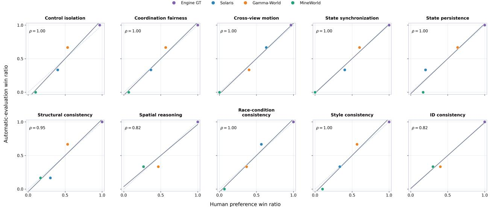  
Figure 8: Alignment between human preference and automatic evaluation. Each panel corresponds to one of the ten evaluation dimensions, and each point represents one system. The horizontal and vertical axes show the human and automatic-evaluation win ratios, respectively. The solid line shows a linear fit, and ρ denotes Spearman’s rank correlation.

## 6 Conclusion and Limitations

Multiplayer world models are more stable under independent multi-view control, but still fail to maintain a shared world. We introduced MultiWorldBench to evaluate whether independently controlled video streams behave as observations of one shared and persistent world. Across the ten evaluated capabilities, MineWorld frequently produces malformed scene geometry, substantial camera drift, and divergent environments across the two player views. In comparison, Solaris and Gamma-World generally maintain more stable viewpoints, produce recognizable playerspecific camera motion, and occasionally propagate an interaction or converge to a visually consistent outcome across both views. These improvements suggest that multiplayer-oriented training provides a better foundation for coordinated generation, although substantial cross-view inconsistencies remain.

Failures in basic movement and placement propagate to more complex tasks. Solaris handles forward and backward translation comparatively well, but its rotation magnitude and stopping behavior are poorly calibrated: it may turn insuficiently or continue rotating after the command has ended. Gamma-World usually follows the intended motion direction, but its movement magnitude may be too small or its rotation may overshoot. Both systems also struggle with placement. Solaris may generate a floating, incomplete, or temporally desynchronized block, whereas Gamma-World may place the block at the wrong location, propagate it to only one view, or even convert a placement instruction into destruction. These failures extend beyond the corresponding navigation or synchronization dimensions. Persistence, building reveal, spatial reasoning, race-condition resolution, and delayed revisit all depend on successful movement and the creation of a valid initial world state. When these prerequisites fail, the subsequent task necessarily fails as well. The results therefore reveal an end-to-end fragility in which errors in basic control and interaction propagate into more complex shared-world evaluations.

Current systems demonstrate little reliable world memory. After an edited region or building leaves view, the generated systems rarely recover the same object, spatial arrangement, and shared state when another player returns. Gamma-World sometimes preserves more of the coarse scene context or color palette than Solaris and MineWorld, but this relative advantage does not amount to object or world-state memory: the edited block or target building is still frequently missing. Moreover, some apparent persistence failures begin earlier, because the requested edit is never successfully created or the camera does not turn far enough for the target to leave view. Such cases cannot be interpreted purely as forgetting, because the prerequisites for testing memory have not been satisfied. Overall, current systems may maintain short-term visual continuity, but they do not yet preserve a stable latent world across actions, viewpoints, and time.

Limitations. Our evaluation is limited to Minecraft. Although Minecraft is widely used for training and evaluating current world models, its discrete voxel-based visual style remains substantially diferent from the continuous, photorealistic dynamics of the real world. In addition, future evaluations should include more cases, environments, and action sequences to test whether the observed results generalize across a broader range of conditions.

## References

[1] Eloi Alonso, Adam Jelley, Vincent Micheli, Anssi Kanervisto, Amos Storkey, Tim Pearce, and Fran¸cois Fleuret. DIAMOND: Difusion for world modeling: Visual details matter in Atari. Advances in Neural Information Processing Systems, 37, 2024.

[2] Jake Bruce, Michael Dennis, Ashley Edwards, Jack Parker-Holder, Yuge Shi, Edward Hughes, Matthew Lai, Aditi Mavalankar, Richie Steigerwald, Chris Apps, et al. Genie: Generative interactive environments. arXiv preprint arXiv:2402.15391, 2024.

[3] Junliang Guo, Yang Ye, Tianyu He, Haoyu Wu, Yushu Jiang, Tim Pearce, and Jiang Bian. MineWorld: a real-time and open-source interactive world model on Minecraft. arXiv preprint arXiv:2504.08388, 2025.

[4] David Ha and J¨urgen Schmidhuber. World models. arXiv preprint arXiv:1803.10122, 2018.

[5] Anthony Hu, V´aclav Volhejn, Adrien Ramanana Rahary, Chris Mulder, Aditya Makkar, Alyx Liao, Am´elie Royer, Manu Orsini, Adam Jelley, Eloi Alonso, Florian Laurent, Fredrik Nor´en, James Swingos, Jan H¨unermann, Kent Rollins, Lucas Hosseini, Matthieu Le Cauchois, Maxim Peter, Pim de Witte, Tim Brown, Vincent Micheli, Moritz B¨ohle, Gabriel de Marmiesse, Viktoriia Sharmanska, Lucia Specia, Michael Black, and Patrick P´erez. Multiplayer interactive world models with representation autoencoders. arXiv preprint arXiv:2607.05352, 2026.

[6] Ziqi Huang, Yinan He, Jiashuo Yu, Fan Zhang, Chenyang Si, Yuming Jiang, Yuanhan Zhang, Tianxing Wu, Qingyang Jin, Nattapol Chanpaisit, et al. VBench: Comprehensive benchmark suite for video generative models. Proceedings of the IEEE/CVF Conference on Computer Vision and Pattern Recognition, pages 21807–21818, 2024.

[7] Fangfu Liu, Kai He, Tianchang Shen, Tianshi Cao, Sanja Fidler, Yueqi Duan, Jun Gao, Igor Gilitschenski, Zian Wang, and Xuanchi Ren. Gamma-world: Generative multi-agent world modeling beyond two players. arXiv preprint arXiv:2605.28816, 2026.

[8] Yaofang Liu, Xiaodong Cun, Xuebo Liu, Xintao Wang, Yong Zhang, Haoxin Chen, Yang Liu, Tieyong Zeng, Raymond Chan, and Ying Shan. Evalcrafter: Benchmarking and evaluating large video generation models. In Proceedings of the IEEE/CVF Conference on Computer Vision and Pattern Recognition, pages 22139–22149, 2024.

[9] Georgy Savva, Oscar Michel, Daohan Lu, Suppakit Waiwitlikhit, Timothy Meehan, Dhairya Mishra, Srivats Poddar, Jack Lu, and Saining Xie. Solaris: Building a multiplayer video world model in minecraft. arXiv preprint arXiv:2602.22208, 2026.

[10] Kaiyue Sun, Kaiyi Huang, Xian Liu, Yue Wu, Zihan Xu, Zhenguo Li, and Xihui Liu. T2V-CompBench: A comprehensive benchmark for compositional text-to-video generation. In Proceedings of the IEEE/CVF Conference on Computer Vision and Pattern Recognition, pages 8406–8416, 2025.

[11] Xiaojie Xu, Zhengyuan Lin, Kang He, Yukang Feng, Xiaofeng Mao, Yuanyang Yin, Kaipeng Zhang, and Yongtao Ge. Worldmark: A unified benchmark suite for interactive video world models. arXiv preprint arXiv:2604.21686, 2026.

[12] Yixuan Ye, Xuanyu Lu, Yuxin Jiang, Yuchao Gu, Rui Zhao, Qiwei Liang, Jiachun Pan, Fengda Zhang, Weijia Wu, and Alex Jinpeng Wang. MIND: Benchmarking memory consistency and action control in world models. arXiv preprint arXiv:2602.08025, 2026.

[13] Kaining Ying, Hengrui Hu, Siyu Ren, Jiamu Li, Fengjiao Chen, Ziwen Wang, Xuezhi Cao, Xunliang Cai, and Henghui Ding. WBench: A comprehensive multi-turn benchmark for interactive video world model evaluation. arXiv preprint arXiv:2605.25874, 2026.

[14] Yifan Zhang, Chunli Peng, Boyang Wang, Puyi Wang, Qingcheng Zhu, Fei Kang, Biao Jiang, Zedong Gao, Eric Li, Yang Liu, and Yahui Zhou. Matrix-Game: Interactive world foundation model. arXiv preprint arXiv:2506.18701, 2025.

## A Dataset Diversity Gallery

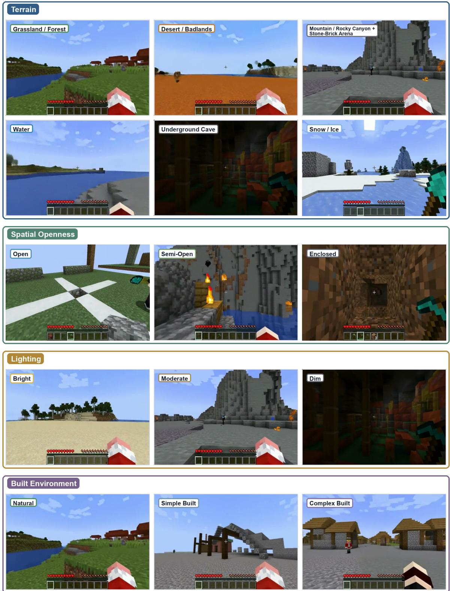  
Figure 9: Dataset diversity in MultiWorldBench. Representative environments grouped by terrain, spatial openness, lighting condition, and built-environment complexity.

Bravo idle: before Alpha action

## B Qualitative Examples

This appendix provides representative qualitative examples for the capabilities discussed in Section 5.2. The quantitative results are reported in Table 3.

## B.1 Navigation

Control isolation. Figure 10 compares the inactive Bravo view before and after Alpha performs the commanded action.

Bravo idle: after Alpha action  
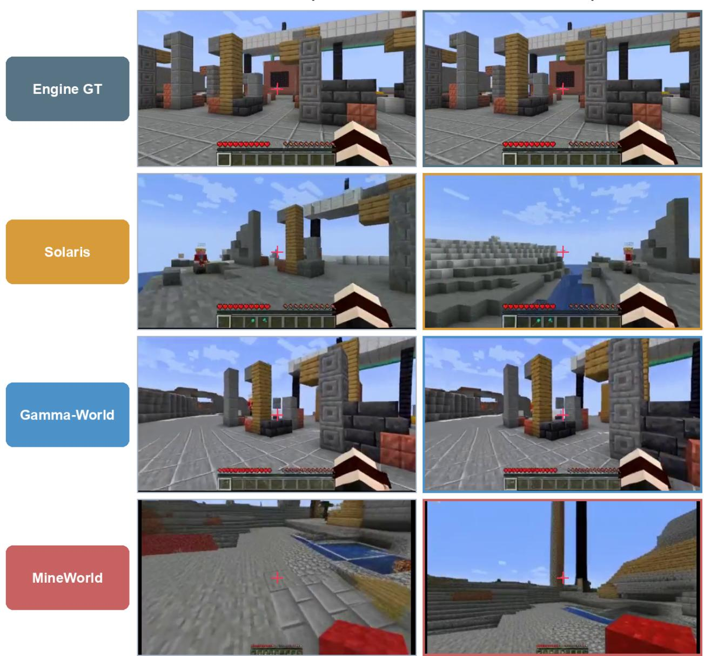  
Figure 10: Control isolation (case MWB3-N-RG180-NV-SC05-02). The inactive Bravo view is shown before and after Alpha performs the commanded action. Rows correspond to Engine GT, Solaris, Gamma-World, and MineWorld.

Cross-view motion. Figure 11 compares the actor and observer views before and after Bravo performs a left strafe while Alpha remains stationary. The other player should shift right in both views.

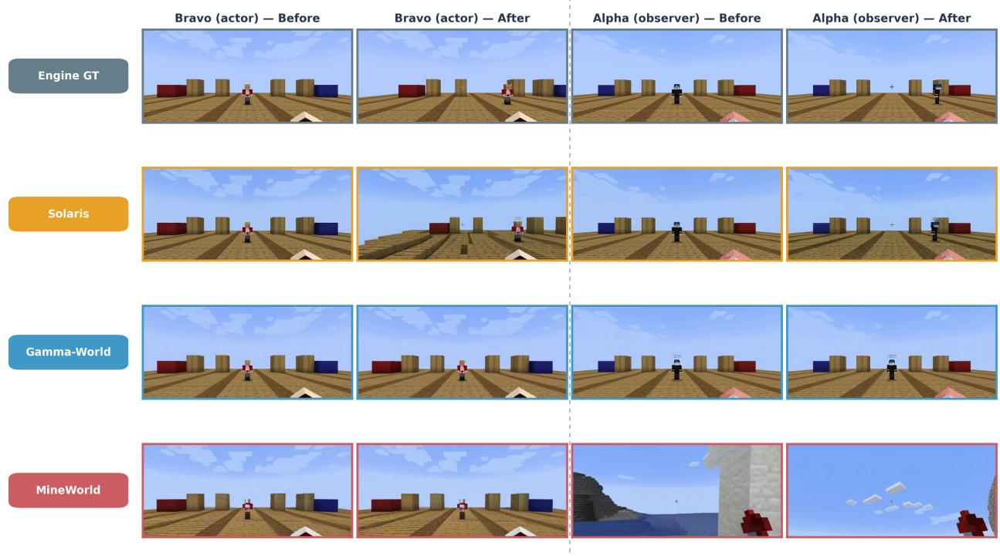  
Figure 11: Cross-view motion consistency (case MWB4-CV-TR20-S03-03). The actor and observer views are shown before and after the action. Rows correspond to Engine GT, Solaris, Gamma-World, and MineWorld.

## B.2 Shared-World Consistency

State synchronization. Figure 12 shows the Alpha and Bravo views before and after placement and destruction.

(a) Placement  
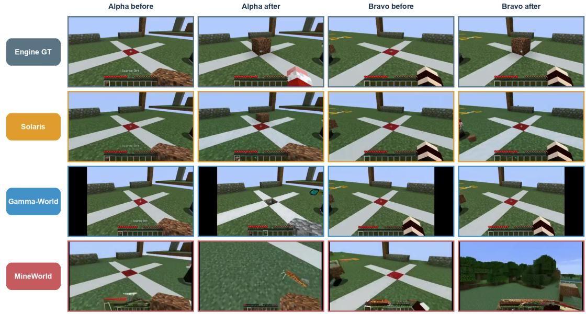

(b) Destruction  
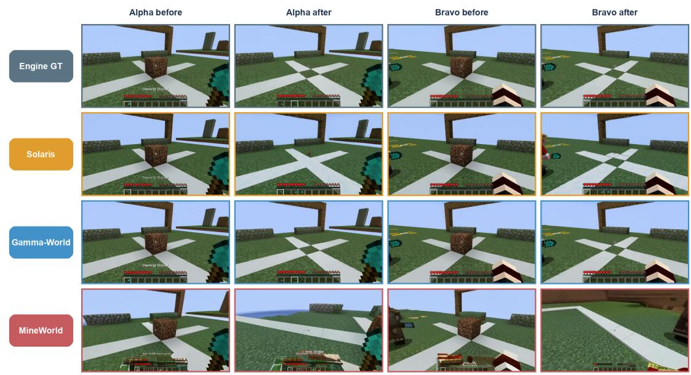  
Figure 12: State synchronization under placement and destruction. (a) Placement case MWB3-S-SS001, showing the Alpha and Bravo views before and after Alpha attempts to place the target block. (b) Destruction case MWB3-S-SS003, showing both views before and after Alpha attempts to destroy the target block. In both panels, rows correspond to Engine GT, Solaris, Gamma-World, and MineWorld.

State persistence. Figure 13 compares the operator’s view after the edit with the other player’s view after returning to the location.

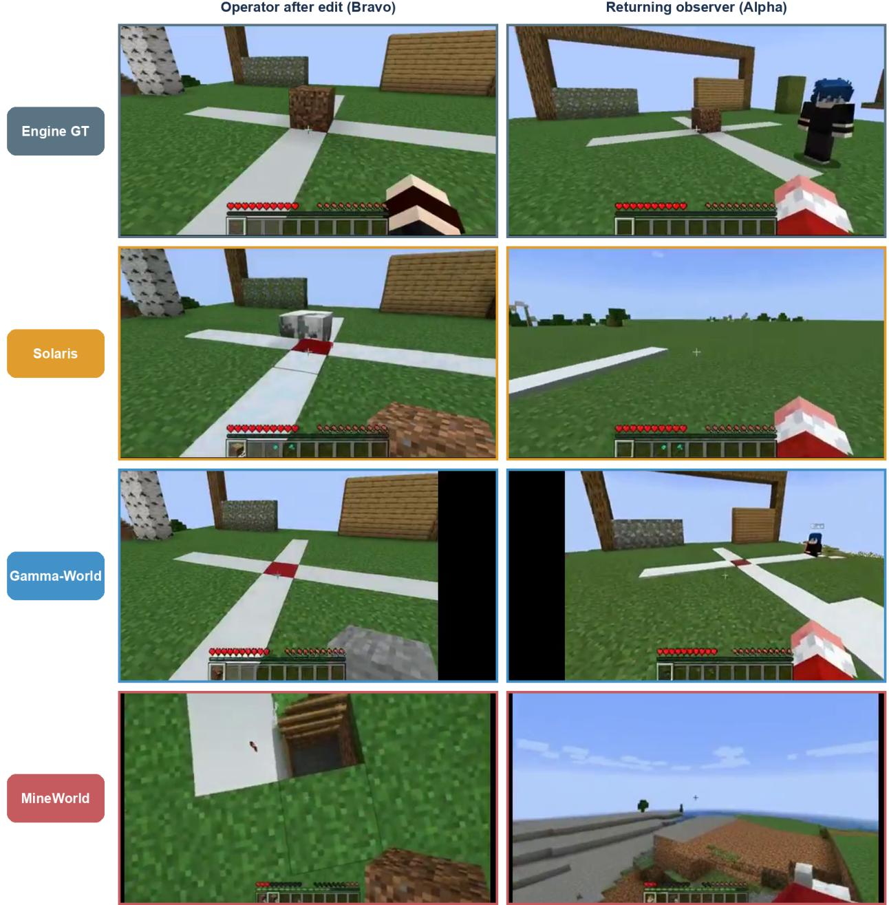  
Figure 13: State persistence (case MWB3-S-SP001). The left column shows the operator after the edit, and the right column shows the other player after returning. Rows correspond to Engine GT, Solaris, Gamma-World, and MineWorld.

Structural consistency and spatial reasoning. Figure 14 compares whether the building visible to Bravo is revealed from Alpha after the occluder is removed.

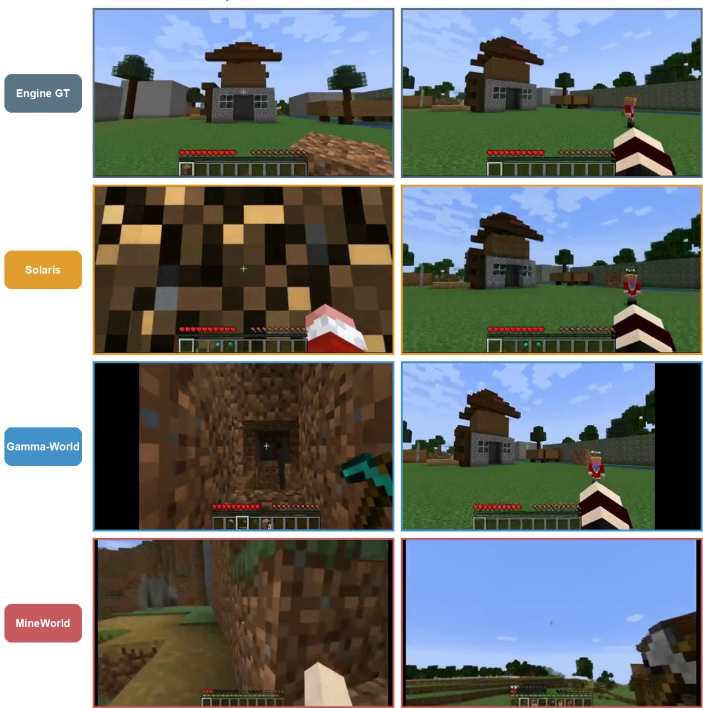  
Figure 14: Structural consistency and spatial reasoning (case MWB3-S-RV-S01-B01-A20). The Alpha and Bravo views are shown after the occluder-removal action. Rows correspond to Engine GT, Solaris, Gamma-World, and MineWorld.

Race-condition consistency. Figure 15 shows the two player views after gold and diamond blocks are placed concurrently at the same target location.

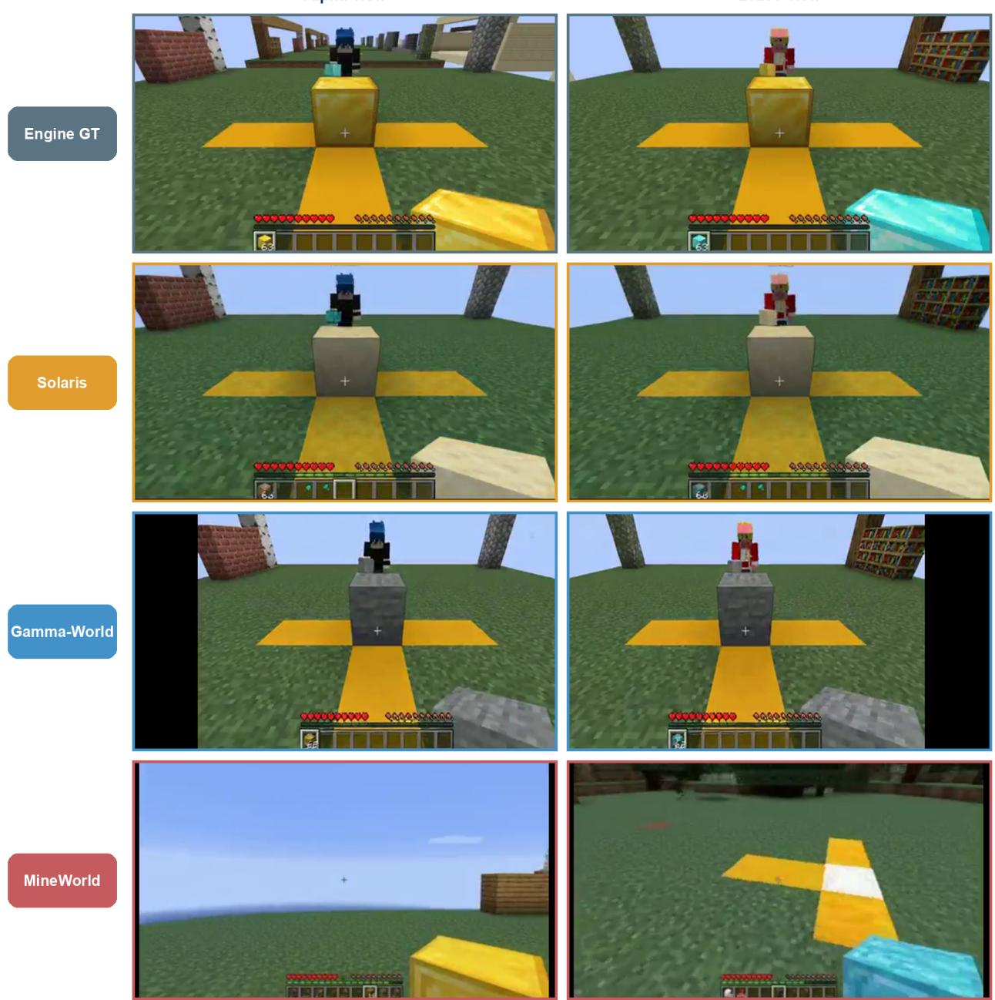  
Figure 15: Race-condition consistency (case MWB3-SW-RC001). Alpha and Bravo concurrently place gold and diamond blocks at the same target. The resulting Alpha and Bravo views are shown for Engine GT, Solaris, Gamma-World, and MineWorld.

## B.3 Delayed Revisit

Style and ID consistency. Figure 16 compares the initial Alpha view with Bravo’s delayed return to the same location.

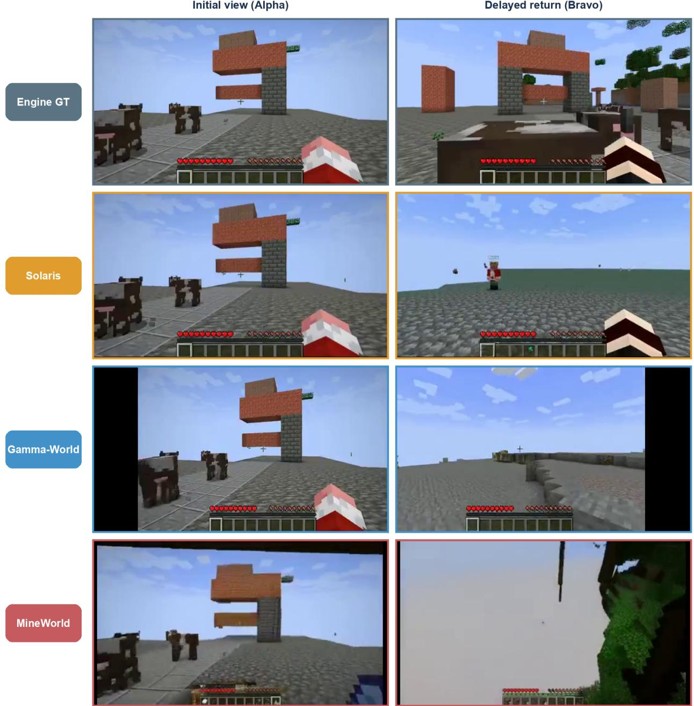  
Figure 16: Style and ID consistency under delayed revisit (case MWB3-R-H09P). The initial Alpha view and the delayed Bravo view are shown for Engine GT, Solaris, Gamma-World, and MineWorld.

## C Human Preference Annotation

This appendix describes the human-preference annotation procedure, including task construction, the annotation interface, annotator training, and quality-control measures.

## C.1 Annotation Procedure

Task construction. The human study covers ten evaluation dimensions. For each dimension, we sample five benchmark cases and conduct complete pairwise comparisons among four systems: Engine GT, Solaris, Gamma-World, and MineWorld. Each case therefore contains

$$
{ \binom { 4 } { 2 } } = 6\tag{20}
$$

system pairs, resulting in

$$
1 0 \times 5 \times { \binom { 4 } { 2 } } = 3 0 0\tag{21}
$$

pairwise comparisons in the main annotation study. Each comparison is independently assessed by three annotators. Before entering the main study, each annotator completes 30 pre-annotation trials. Each annotator therefore completes 330 tasks in total, including the pre-annotation trials and the main study.

Dimension-specific judgments. Each annotation task evaluates only one capability dimension. The annotators are instructed to judge the two system outputs according to the dimension-specific criterion and to ignore unrelated diferences. For example, building identity consistency focuses on whether the distinctive layout, silhouette, openings, roof, and other recognizable components of the same building are preserved after revisiting. General image quality is ignored when it does not afect the identity judgment. The same video pair may therefore receive diferent judgments under diferent evaluation dimensions.

Annotation interface. Figure 17 shows the annotation interface. The top section presents the evaluation dimension and its corresponding question. A case-specific evaluation guide describes the action sequence, the expected behavior, and the major failure patterns. Separate Focus and Ignore instructions further clarify which visual evidence should and should not afect the judgment.

The middle section displays the outputs as System A and System B, without revealing their underlying system identities. Each system panel contains the synchronized Alpha and Bravo player views. Annotators can replay or play both system outputs together, pause playback, and adjust the playback speed. After viewing the two outputs, the annotator selects one of four responses: A Better, Tie, B Better, or Cannot Judge. The final option is used when missing content, playback failure, or insuficient visual evidence prevents a reliable comparison. Responses are saved locally and exported after the annotation session.

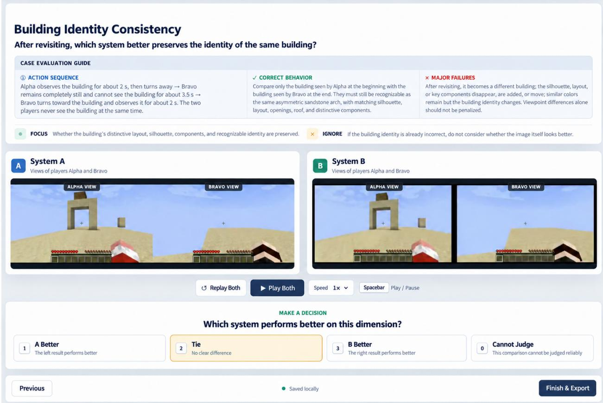  
Figure 17: Human-preference annotation interface. The interface provides a dimensionspecific question, a case-level evaluation guide, explicit focus and ignore criteria, synchronized Alpha and Bravo views for Systems A and B, joint playback controls, and four response options: A Better, Tie, B Better, and Cannot Judge.

## C.2 Annotator Training and Quality Control

Pre-annotation test. Before the main study, each annotator completes 30 pre-annotation samples covering the evaluation dimensions and the four response types. The pre-annotation phase familiarizes annotators with the interface, dimension-specific definitions, expected behaviors, and common failure patterns. Incorrect or ambiguous judgments are reviewed with the annotators before they proceed to the main annotation tasks.

Random inspection and relabeling. We randomly inspect 20% of the completed annotations in each annotation batch. The inspection checks whether the selected response follows the dimensionspecific instructions and whether the available video evidence supports the judgment. If the error rate of the inspected annotations in a batch exceeds 10%, the entire batch is reassigned to a diferent annotator for independent relabeling. This procedure is applied throughout the study to identify systematic misunderstandings and reduce residual annotation errors.