# Multimodal Remote Sensing Image Registration: A Comprehensive Review, Challenges and Prospects

Zhiqiang Han, Yuanxin Ye, Qiuyun Wu, Jinhao Chen, Bai Zhu, Siyuan Hao ∗

Zhiqiang Han, Yuanxin Ye, Qiuyun Wu and Jinhao Chen are with the Faculty of Geosciences and

Engineering, Southwest Jiaotong University. Chengdu, 611756, China.

Bai Zhu is with the Yunnan Key Laboratory of Quantitative Remote Sensing / Yunnan

International Joint Laboratory for Integrated Sky-Ground Intelligent Monitoring of Mountain

Hazards, Faculty of Land Resources Engineering, Kunming University of Science and

Technology. Kunming, 650093, China.

Siyuan Hao is with the School of Software Engineering, Beijing Jiaotong University. Beijing, 100044, China.

Corresponding author: Siyuan Hao (syhao@bjtu.edu.cn)

## ABSTRACT

Multimodal remote sensing image registration is a crucial prerequisite for the collaborative process- ing and downstream application of remote sensing data, such as image fusion, change detection, and target recognition. However, significant variations in radiometry, geometry, scale, viewpoint, and time often exist between multimodal images. These diferences, driven by varying sensor geometries, physical radiation mechanisms, imaging platforms, and environmental disturbances, pose severe challenges to achieving high-precision, robust registration.

This paper systematically reviews the progress of mainstream multimodal remote sensing image registration methods. Based on their registration pipelines, existing approaches are categorized into three main types: region-based, feature-based, and deep learning-based methods. We de- tail the core principles, representative algorithms, advantages, and limitations of each category. Additionally, we summarize publicly available multimodal image datasets in the remote sensing domain, analyzing their specific characteristics and applicable scenarios. Finally, we highlight current bottlenecks in high-precision registration research and outline future development trends. 1 This review aims to provide a comprehensive reference and valuable insights for researchers in related fields.

Table of Contents Description: This paper presents a comprehensive review of multimodal remote sensing image registration, systematically categorizing region-based, feature-based, and deep learning-based paradigms while analyzing mainstream datasets, cutting-edge challenges, and future development trends.

## 1. Introduction

Multimodal remote sensing images are typically obtained from observations of the same object at diferent times using diferent sensors and imaging mechanisms, such as optical-infrared image (Li et al. 2022b), optical-hyperspectral image (Wang et al. 2024b) , optical-SAR image (Kulkarni and Rege 2020), optical-LiDAR image (Wang et al. 2023), optical-nighttime light image and optical-map image (Jiang et al. 2021). As shown in Figure 1.

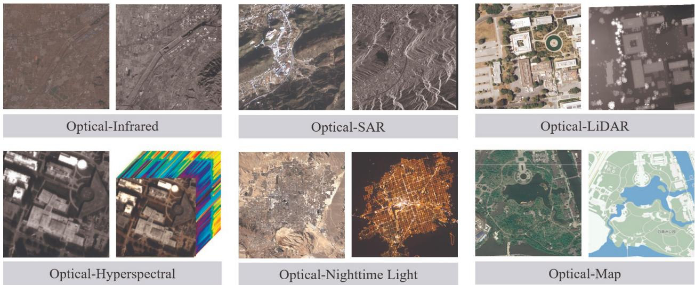  
Figure 1. Multimodal remote sensing image pairs.

Compared with single-modal sensors, the joint processing of multimodal remote sensing data yields more reliable, comprehensive, and accurate observation results (Brown 1992). Consequently, research on multimodal image registration is of significant scientific importance. Furthermore, registration serves as a fundamental prerequisite for numerous downstream applications, such as image fusion (Tang et al. 2023b), change detection (Sun et al. 2024), and object detection (Belmouhcine et al. 2023). Ultimatel , efective multi-level and multifaceted Earth observation relies on the thorough integration of these diverse data sources (Tang et al. 2023a).

Multimodal remote sensing images inherently exhibit significant radiometric, geometric, scale, perspective, and temporal discrepancies. These arise from the distinct physical radiation mech- anisms and spatial configurations of various sensors (e.g., infrared, LiDAR, and SAR) (Ye et al. 2022b; Zhu et al. 2021), as well as the diverse platforms (satellite, aerial, and ground) that host them. Furthermore, image quality is highly susceptible to environmental and meteorological con- ditions (Feng et al. 2021). Consequently, pervasive interferences such as noise, cloud occlusion, and blur pose substantial challenges to high-precision image registration. Figure 2 illustrates these primary challenges.

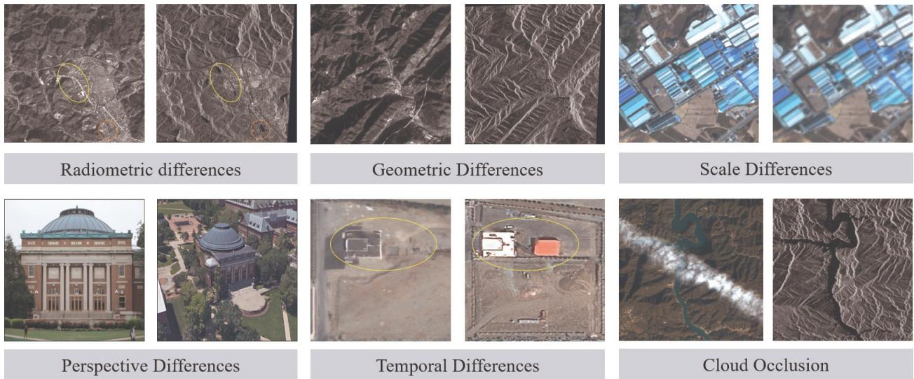  
Figure 2. Challenges in multimodal remote sensing image registration.

The primary objective of multimodal remote sensing image registration is to accurately identify uniformly distributed corresponding point pairs across images to derive an optimal geometric transformation model (Xiang et al. 2023). Let $I _ { 1 } ( x , y )$ and $I _ { 2 } ( x , y )$ denote the reference and input images, respectively. Their geometric mapping relationship can be formulated as $I _ { 2 } ( x , y ) =$ $g \left[ I _ { 1 } \left( f ( x , y ) \right) \right]$ , where � represents the 2D geometric transformation function and � denotes the 1D grayscale transformation function (Brown 1992).

Traditional registration methods are primarily suited for single-modal images with linear ra- diometric diferences. When applied to multimodal remote sensing images exhibiting significant geometric distortions and nonlinear radiometric variations, these methods struggle to construct robust feature descriptors and similarity measures capable of capturing shared characteristics.

Consequently, although mainstream commercial software (e.g., ENVI, ERDAS, and PCI) provides basic registration tools, their reliance on traditional techniques prevents high-precision multimodal registration. To address these limitations, recent research has focused on developing highly accu- rate, eficient, and robust multimodal registration methods.

Based on distinct registration processes, traditional methods are primarily classified into region- based and feature-based approaches (Sommervold et al. 2023). Recently, thanks to their robust ability to extract high-dimensional representations, deep learning algorithms have firmly estab- lished themselves as a crucial third pillar in multimodal remote sensing registration (Jiang et al. 2015). Guided by this taxonomy, this paper systematically reviews the current research landscape. The overall structure is illustrated in Figure 3. First, we provide a detailed review tracing the evolution of these three methodological categories from single-modal to multimodal applications, discussing representative algorithms and providing links to open-source implementations. Subse- quently, we present a comprehensive analysis of publicly available multimodal datasets. Finally, we conclude by highlighting current bottlenecks in high-precision registration and outlining future research directions.

Five Challenges in Multimodal Remote Sensing Image Registration  
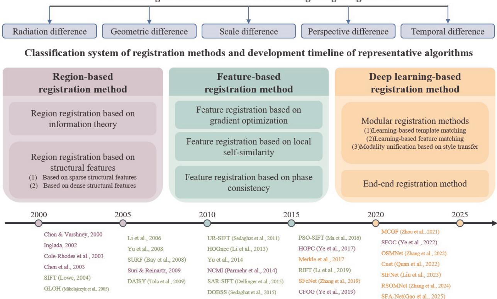  
Figure 3. Overall framework of this survey.

## 2. Region-based registration method

Region-based registration methods, often referred to as template-based methods, fundamentally rely on optimizing an appropriate similarity metric to accurately estimate geometric transformation parameters. Unlike natural images, a distinct advantage of remote sensing imagery is the avail- ability of precise prior geometric information, such as Position and Orientation System (POS) or Rational Polynomial Coeficient (RPC) data (Shen et al. 2017; Wu et al. 2016). Leveraging this georeferencing data efectively mitigates significant scale and rotation discrepancies between mul- timodal images. Because the initial georeferencing error is typically limited to a few dozen pixels in the image space, it provides a reliable coarse search range for subsequent template matching (Jiang et al. 2015).

Based on the domain of image representation, region-based registration algorithms can be broadly divided into spatial and frequency categories. Within spatial domain techniques, representative similarity metrics typically include the sum of squared diferences (SSD), normalized crosscorrelation (NCC), and mutual information (MI) (Amin and Hamid 2015; Chen et al. 2003). In contrast, approaches operating in the frequency domain primarily rely on phase correlation (PC) as their core measure (Tong et al. 2015). Because PC exploits the inherent scaling, rotational, and translational properties of the Fourier transform, it demonstrates strong capability in handling these geometric discrepancies across images (Reddy and Chatterji 1996).

However, the aforementioned traditional region-based methods typically drive the registration process by optimizing intensity-based similarity metrics to estimate geometric transformations. Consequently, approaches like SSD, NCC, and PC fail to yield robust results for multimodal remote sensing images, as these metrics are highly sensitive to the severe nonlinear radiometric variations inherent in such data (Yang et al. 2024b).

Inspired by medical imaging applications (Wells et al. 1996), information-theoretic metrics, particularly mutual information (MI), were the first widely adopted similarity measures for multimodal remote sensing registration. To further improve accuracy and computational eficiency, subsequent research introduced a series of novel techniques, defined herein as structure-feature-based methods. The following sections review these two categories in detail.

## 2.1. Region registration method based on information theory

Leveraging the statistical correlation between images, information-theoretic methods have been widely applied to multimodal remote sensing registration (Chen and Varshney 2000). By efectively accommodating non-linear radiometric variations, these approaches demonstrate signifi- cantly greater robustness than traditional metrics such as SSD, NCC, and PC. Building upon this foundation, numerous enhanced methods—most notably mutual information (MI) (Chen et al. 2003) and its advanced variants (Cole-Rhodes et al. 2003; Suri and Reinartz 2010; Xu et al. 2016)—have been developed for diverse multimodal tasks. Finally, Table 1 summarizes the core concepts of representative region-based registration algorithms.

Table 1. Region registration method based on information theory
<table><tr><td>Representative algorithm</td><td>Core ideas</td></tr><tr><td>Chen and Varshney (2000)</td><td>Image pyramids &amp; MI; Robust to nonlinear radiative differences</td></tr><tr><td>Inglada (2002)</td><td>Evaluation of MI; Good comprehensive performance</td></tr><tr><td>Chen et al. (2003)</td><td>GPVE optimization; Solves interpolation artifacts</td></tr><tr><td>Cole-Rhodes et al. (2003)</td><td>SPSA gradient policy optimization; Accelerated convergence</td></tr><tr><td>Suri and Reinartz (2010)</td><td>Feature selection for high-resolution images; Improved performance</td></tr><tr><td>NCMI (Parmehr et al. 2014)</td><td>Histogram-based non-parametric PDF estimation; Improved performance</td></tr><tr><td>Xu et al. (2016)</td><td>Symmetric Kullback-Leibler divergence; Robust to insufficient overlap</td></tr><tr><td>TOMI (Li et al. 2021b)</td><td>Tensor direction parallelism &amp; gradient MI; Robust to nonlinear radiation</td></tr><tr><td>Wang et al. (2024a)</td><td>Grayscale NMI ; A novel segmentation strategy</td></tr></table>

Chen and Varshney (2000) introduced a wavelet-based pyramid registration method, providing early evidence of MI’s potential in multimodal remote sensing applications. Subsequently, Inglada (2002) evaluated four similarity metrics using multi-temporal SPOT imagery, concluding that MI delivers superior overall performance despite radiometric dissimilarities. Furthermore, Chen et al. (2003) investigated interpolation algorithms for MI joint histogram estimation, identifying nearest-neighbor interpolation as the most efective. To mitigate interpolation-induced artifacts during MI calculations, they also proposed generalized partial volume estimation (GPVE).

To enhance MI optimization, a gradient-based simultaneous perturbation stochastic approxima- tion (SPSA) approach was utilized by Cole-Rhodes et al. (2003), achieving successful alignment of multi-sensor and multi-temporal image pairs. Focusing on complex urban environments at high resolutions, an automated hierarchical (coarse-to-fine) MI pipeline was constructed by Suri and Reinartz (2010) specifically for matching Ikonos and TerraSAR-X datasets. To tackle the alignment of airborne LiDAR with optical data, Parmehr et al. (2014) presented the normalized combined mutual information (NCMI) metric, which substantially boosted registration precision. Additionally, the Jefrey divergence—functioning as a symmetric variation of the Kullback-Leibler divergence—was put forward by Xu et al. (2016), proving its advantages compared to previously modified MI techniques. Later, Li et al. (2021b) established the tensor orientation and mutual information (TOMI) measure. By fusing gradient distributions with structural orientations, the TOMI framework delivers superior resilience against heavy noise and extreme nonlinear radiomet- ric shifts. Most recently, to overcome the ongoing bottlenecks of computational ineficiency and local distortions in high-resolution scenarios, Wang et al. (2024a) introduced a rapid automated technique driven by grayscale normalized mutual information (GNMI). Through an innovative block-based segmentation scheme that merges varying patch sizes, this strategy bypasses conven- tional feature extraction, thereby concurrently elevating processing speed and alignment accuracy for strongly heterogeneous SAR-optical image pairs.

Overall, information-theoretic methods have proven highly efective in handling multimodal registration across diverse imaging mechanisms by relying on joint histogram-based statistical similarities. However, they have traditionally sufered from significant limitations, primarily their high computational complexity, which makes them extremely time-consuming. Although recent advancements—such as the aforementioned block-based segmentation strategies—have begun to successfully mitigate these eficiency bottlenecks, the inherent computational demands have historically restricted their widespread application, particularly for large-scale multimodal imagery.

## 2.2. Structure-feature-based region registration methods

Depending on whether feature extraction is pixel-wise, this review categorizes structure-feature- based methods into sparse and dense approaches. To establish reliable correspondences across multimodal images, these methods employ classical metrics to evaluate the similarity of the ex- tracted features. Specifically, sparse structure-based methods typically capture geometric structures using a relatively sparse sampling grid (Li et al. 2013; Xiong et al. 2020; Ye et al. 2017b). Finally,

Table 2 summarizes representative structure-feature-based algorithms, detailing their core concepts and providing open-source code links where available.

Table 2. Structural feature-based registration methods
<table><tr><td>Method type</td><td>Representative algorithm</td><td>Core ideas</td><td>Acquisition channels</td></tr><tr><td>Sparse structural features</td><td>HOGNCC (Li et al. 2013)</td><td>HOG &amp; NCC combination</td><td></td></tr><tr><td></td><td>DLSS (Ye et al. 2017b)</td><td>Dense local self-similar description; Shape attributes</td><td>[Code]</td></tr><tr><td></td><td>HOPC (Ye et al. 2017a)</td><td>Histogram of Oriented Phase Consistency; Global satellite image processing</td><td>[Code]</td></tr><tr><td></td><td>HOMPC (Fu et al. 2018)</td><td>Log-Gabor filtering; Local amplitude &amp; phase consistency</td><td></td></tr><tr><td></td><td>RLSS (Xiong et al. 2020)</td><td>Spearman rank correlation &amp; LSS; Local shape attribute description</td><td></td></tr><tr><td>Dense structural features</td><td>CFOG (Ye et al. 2019)</td><td>Pixel-by-pixel structural matching; HOG, LSS &amp; CFOG framework</td><td>[Code]</td></tr><tr><td></td><td>OS-PC (Xiang et al. 2020a)</td><td>Multi-channel feature representation; Fast optical-SAR registration</td><td></td></tr><tr><td></td><td>AWOG (Fan et al. 2021)</td><td>Angle-weighted strategy; CFOG gradient distribution</td><td></td></tr><tr><td></td><td>DCF-EPW Xiang et al.</td><td>Dilated convolution features; Directional phase</td><td></td></tr><tr><td></td><td>(2022b) SFOC (Ye et al. 2022b)</td><td>correlation Multi-scale 1st &amp; 2nd gradients; Coarse-to-fine</td><td>[Code]</td></tr><tr><td></td><td>MAGD (Xiang et al. 2023)</td><td>registration system Multi-directional anisotropic Gaussian derivatives; High-accuracy evaluation dataset</td><td>[Code]</td></tr></table>

Li et al. (2013) utilized the Histogram of Oriented Gradients (HOG) to represent structural features, employing zero-mean NCC as a similarity measure for SAR and optical image regis- tration. Addressing shape attributes, Ye et al. (2017b) proposed the Dense Local Self-Similarity (DLSS) descriptor, leveraging NCC to achieve high-precision optical-to-SAR matching. Inspired by HOG, Ye et al. (2017a) extended the phase congruency (PC) model to capture structural attributes, introducing the Histogram of Oriented Phase Congruency (HOPC). When paired with NCC, HOPC demonstrated robust performance across optical, LiDAR, and SAR imagery exhibit- ing severe nonlinear radiometric diferences, and has since been successfully scaled for global satellite image processing (Zhang et al. 2021). Building upon this foundation, Fu et al. (2018) developed a descriptor that integrates multi-directional amplitude and from log-Gabor filters, fur- ther enhancing registration robustness. Additionally, Xiong et al. (2020) designed the rank-based local self-similarity (RLSS) descriptor using the Spearman rank correlation coeficient, efectively characterizing local shape properties to achieve superior matching accuracy.

However, the aforementioned descriptors (e.g., HOG, HOPC, and DLSS) rely on relatively sparse sampling grids to capture structural features. This inherent sparsity inevitably leads to the loss of critical structural information, thereby limiting their registration accuracy and robustness. Conversely, dense structure-based methods employ pixel-wise descriptors to map image intensities into high-dimensional feature spaces, efectively driving the registration process (Fan et al. 2021; Xiang et al. 2022a; Ye et al. 2019).

Ye et al. (2019) proposed a fast and robust template matching framework utilizing novel pixelwise channel features of oriented gradients (CFOG). To maximize computational eficiency, they accelerated the sum of squared diferences (SSD) optimization in the frequency domain via the fast Fourier transform (FFT). Notably, this highly adaptable framework can seamlessly integrate other pixel-level descriptors, such as HOG, LSS, and SURF. Addressing the failure of traditional phase correlation under severe nonlinear radiometric and geometric discrepancies, Xiang et al. (2020a) formulated specialized multi-channel feature representations for optical and SAR imagery. By employing the Sobel and ratio of exponentially weighted averages (ROEWA) operators, they developed two robust strategies to enhance 3D phase correlation performance across both spatial and frequency domains.

Fan et al. (2021) enhanced CFOG via an angle-weighted strategy, distributing gradient values along the two principal directions to improve matching performance. To address large georeferenc- ing errors, Xiang et al. (2022b) proposed the DCF-EPW (Dilated Convolutional Feature-Epipolar Oriented Matching Window) method. Its depthwise separable dilated convolutions (DCF) lever-age large receptive fields to maintain positional invariance, while its epipolar-oriented rectangular templates capture more overlapping regions than traditional square templates, thereby establishing higher-precision optical-SAR correspondences.

Identifying that previous dense methods overlook local pixel relationships, multi-scale contexts, and superior second-order gradient details, Ye et al. (2022b) developed the SFOC (Steerable Filters of First- and Second-Order Channels) descriptor. By integrating both gradient orders, SFOC extracts highly discriminative structural features. Furthermore, they constructed an open-source, coarse-to-fine registration framework by accelerating traditional NCC via FFT and integral images. Finally, Xiang et al. (2023) formulated the multi-directional anisotropic Gaussian derivatives (MAGD) feature. Their approach successfully handles geometric distortions by pairing MAGD with a geometry-invariant mask within a confidence-guided local matching process. They also released a comprehensive evaluation dataset comprising hundreds of multimodal image pairs. Extending these multi-channel gradient principles to extreme environments, recent research has also integrated multi-channel oriented gradient templates with self-supervised super-resolution to tackle highly complex underwater terrain navigation in Arctic waters (Huang et al. 2026).

Within structure-feature-based approaches, sparse methods are restricted to calculations on predefined sampling grids, limiting their similarity evaluation entirely to the spatial domain. Consequently, frequency-domain metrics are inapplicable. In contrast, dense structure-based methods can seamlessly exploit similarity metrics in both the spatial and frequency domains. Balancing robustness and computational eficiency, these dense approaches demonstrate clear advantages in overcoming severe nonlinear radiometric variations, making them highly suitable for modern multimodal remote sensing applications.

## 3. Feature-based registration method

In summary, region-based methods are highly efective at overcoming radiometric diferences when the initial spatial ofset is limited. However, they remain highly sensitive to significant rotation and scale variations, and their robustness is severely compromised if prior georeferencing data is missing or highly inaccurate. To overcome these geometric constraints, feature-based registration methods provide a compelling alternative. Unlike region-based approaches that evaluate similarity over predefined templates or grids, feature-based methods generally do not require georeferencing data as an initial constraint. By extracting salient local features (such as points, lines, or regions) and establishing correspondences through invariant descriptors, they ofer enhanced flexibility and resilience against severe geometric distortions.

Unlike region-based approaches, feature-based methods generally do not require georeferencing data as an initial constraint. Instead, they first extract salient features (such as points, lines, or regions) and then establish correspondences by computing descriptors for these features (Geng et al. 2025). Consequently, feature detection and description form the core pillars of multimodal matching. This section systematically reviews recent advancements in these two critical steps for remote sensing image registration.

In remote sensing, mainstream feature matching relies on extracting highly repeatable feature points and constructing local invariant descriptors to represent their neighborhoods. Traditionally rooted in computer vision, these classical detection and description techniques depend heavily on image intensity or gradient information. Prominent feature point detectors include Moravec (1980), Harris (Harris et al. 1988), DoG (Lowe 2004), and FAST (Rosten et al. 2010). For feature description, SIFT (Lowe 2004), GLOH (Mikolajczyk and Schmid 2005), SURF (Bay et al. 2008), and DAISY (Tola et al. 2010) remain the most widely adopted local invariant descriptors.

To address the unique characteristics of remote sensing imagery, researchers have actively adapted classical feature detection and description operators. Li et al. (2006) pioneered the application of SIFT for remote sensing image registration. Subsequently, Yu et al. (2008) integrated Harris and SIFT detectors within a cross-matching strategy based on wavelet pyramids and triangulated irregular networks (TINs) to register Quickbird, SPOT, and TM images. To improve feature quality, Sedaghat et al. (2011) proposed Uniform Robust SIFT (UR-SIFT), utilizing stability and significance constraints to extract uniformly distributed features across both scale and image spaces. Building upon this, they later introduced Adaptive Binning SIFT (AB-SIFT) (Sedaghat and Ebadi 2015), which employs an adaptive histogram quantization strategy to generate descriptors more robust against local geometric distortions.

Because the aforementioned feature operators rely heavily on image intensity or gradient infor- mation, they struggle to achieve high-precision matching on multimodal remote sensing images exhibiting severe geometric distortions and nonlinear radiometric diferences. To address these limitations, recent research has introduced a variety of novel multimodal registration methods specifically designed to overcome scale and rotation variations, radiometric discrepancies, and noise interference.

These advanced multimodal registration methods can generally be classified into three categories. The first approach enhances descriptor robustness against nonlinear radiometric diferences through gradient optimization (Dellinger et al. 2015; Xiang et al. 2018; Yao et al. 2022). The second category leverages local self-similarity (LSS) within log-polar coordinates, extracting internal geometric structures from local neighborhoods to build resilience against radiometric variations (Hong et al. 2022; Sedaghat and Ebadi 2015; Sedaghat and Mohammadi 2019). Finally, a third group employs PC models to formulate registration algorithms inherently invariant to illumination and contrast fluctuations (Yao et al. 2021; Ye et al. 2018b; Zhang et al. 2025b; Zhu et al. 2023a).

To summarize these advancements, Table 3 provides a comprehensive overview of representative feature-based multimodal registration methods, detailing their core concepts alongside links to available open-source code. The following subsections will review these three methodological categories in detail.

## 3.1. Feature registration method based on gradient optimization

Dellinger et al. (2015) redefined gradient calculation by replacing traditional diferential methods with the ROEWA operator. This adaptation, known as SAR-SIFT, yields gradient magnitudes and orientations that are highly robust to speckle noise, enabling the efective registration of multi-view SAR images. Building on this, Ma et al. (2017) introduced PSO-SIFT (Position Scale Orientation SIFT), which formulates a novel gradient definition within the Gaussian scale space to enhance feature matching. Similarly, Xiang et al. (2018) developed OS-SIFT, which leverages multi-scale Sobel and ROEWA operators to generate consistent gradients across optical and SAR imagery. They further constructed a Harris scale space and employed a GLOH-like descriptor to reliably establish correspondences. More recently, Yao et al. (2022) proposed CoFSM (Co-occurrence Filter Space Matching), utilizing co-occurrence filters for scale space construction and Butterworth filters for gradient optimization. This efectively mitigates the interference of nonlinear radiometric diferences, thereby enhancing multimodal descriptor robustness.

## 3.2. Feature registration method based on local self-similarity

Focusing on internal geometric structures, Sedaghat and Ebadi (2015) substituted gradients with correlation values to generate orientation histograms. By leveraging these correlations, their distinctive order-based self-similarity (DOBSS) descriptor successfully registered multisensor satellite imagery. Building upon this concept, Sedaghat and Mohammadi (2019) designed the histogram of oriented self-similarity (HOSS) descriptor. To achieve rotation invariance and enhance matching accuracy, they introduced a Rotation Index of the Maximal Correlation (RIMC) map integrated with an adaptive log-polar spatial structure.

Furthermore, Xiong et al. (2021) proposed the oriented self-similarity (OSS) descriptor, utilizing ofset mean filtering to rapidly compute features based on structural symmetry. They subsequently refined this filtering process and employed local statistical weighted diferentials to suppress coher- ent speckle, resulting in the adjacent self-similarity (ASS) descriptor (Xiong et al. 2022). During the same period, Hong et al. (2022) formulated the max-index based local self-similarity (MLSS) descriptor by combining maximum index mapping with LSS, summing vectors across varying ra- dial intervals at identical angles to achieve highly robust multimodal registration. Expanding upon these oriented feature representations, a novel multi-dimensional oriented self-similarity (MOSS) descriptor was introduced (Zhang et al. 2024b) to capture richer structural dimensions, thereby further enhancing the robust registration of multi-modal remote sensing images. Most recently, to amplify structural saliency and mitigate noise, Yang et al. (2024b) integrated 3D Gaussian convolution into the earlier ASS framework. Their resulting ASTC (adjacent self-similarity 3-D convolution) descriptor demonstrated significant experimental gains in robustness, accuracy, and eficiency.

Table 3. Feature-based registration methods
<table><tr><td>Method type</td><td>Representative ālgorithm</td><td>Core ideas</td><td>Acquisition channels</td></tr><tr><td rowspan="5">Gradient optimization</td><td>SAR-SIFT (Dellinger et al. 2015)</td><td>Ratio gradient via ROEWA operator; Robust to SAR speckle noise</td><td>[Code]</td></tr><tr><td>PSO-SIFT (Ma et al. 2017)</td><td>Gradient derivative in Gaussian scale space; Robust to intensity variations</td><td>[Code]</td></tr><tr><td>OS-SIFT (Xiang et al. 2018)</td><td>Multi-scale Sobel &amp; ROEWA operators; Consistent optical-SAR gradients</td><td>[Code]</td></tr><tr><td>CoFSM (Yao et al. 2022)</td><td>Scale space via co-occurrence filtering; Butterworth filter gradient optimization</td><td>[Code]</td></tr><tr><td>DOBSS (Sedaghat and</td><td>Related value histogram; Internal geometric</td><td></td></tr><tr><td rowspan="8">Local self-similarity</td><td>Ebadi 2015) HOSS (Sedaghat and</td><td>layout capture Adaptive log-extreme spatial structure &amp; max</td><td></td></tr><tr><td>Mohammadi 2019) OSS (Xiong et al.</td><td>correlation rotation index map Self-similar symmetry; Fast calculation via</td><td>[Code]</td></tr><tr><td>2021) ASS Xiong et al.</td><td>ofset mean filtering Optimized offset mean filtering; Local</td><td></td></tr><tr><td>(2022) MLSS (Hong et al.</td><td>statistical weighted differential for speckle suppression Max value index map &amp; LSS combination;</td><td>[Code]</td></tr><tr><td>2022) MOSS (Zhang et al.</td><td>Radial interval summation Multi-dimensional oriented self-similarity</td><td></td></tr><tr><td>2024b) ATSC (Yang et al.</td><td>Adjacent self-similarity 3-D convolution</td><td>[Code]</td></tr><tr><td>2024b) LHOPC (Ye et al.</td><td>MMPC-Lap detector &amp; LHOPC descriptor;</td><td></td></tr><tr><td>2018b)</td><td>Robust to complex radiation differenċes</td><td></td></tr><tr><td rowspan="5">Phase consistency</td><td>RIFT (Li et al. 2020)</td><td>Inflection/edge point detection; Maximum Index Map (MIM) construction</td><td>[Code]</td></tr><tr><td>HAPCG (Xiong et al. 2021)</td><td>Anisotropic weighted moment matrix; Absolute phase coherence direction gradients</td><td>[Code]</td></tr><tr><td>MABPC Fan et al. (2022)</td><td>Modified Harris-Laplace detector; Multi-scale phase consistency encoding via adaptive spatial structures</td><td></td></tr><tr><td>R2FD2 (Zhu et al. 2023a)</td><td>Multi-channel autocorrelation &amp; log-Gabor; Rotation-invariant RMIM via DAISY</td><td></td></tr><tr><td>RIFT2 (Li et al. 2023a)</td><td>Replaces convolution sequence ring with a dominant index value</td><td>[Code]</td></tr><tr><td>GLIFT (Zhang et al. 2025b)</td><td></td><td>Log-Gabor filter; FAST; global MIM-based search</td><td>[Code]</td></tr><tr><td>EPC-SRC (Zheng et al.</td><td>2025b)</td><td>Chunked Harris detector; adaptive weighted moment map; GLOH-like structure</td><td></td></tr></table>

## 3.3. Feature registration method based on phase consistency

Ye et al. (2018b) pioneered the use of the illumination- and contrast-invariant PC model for feature detection and description. Their MMPC-Lap (Minimum Moment of Phase Congruency Lap) detector utilizes auto-scale localization to identify stable keypoints in scale space, while the LHOPC (Local Histogram of Oriented Phase Congruency) descriptor adopts a DAISY-like spatial configuration to maintain robustness under complex radiometric variations. Li et al. (2020) introduced the Radiation-variation Insensitive Feature Transform (RIFT), which detects feature points on PC minimum/maximum moment maps and constructs a Maximum Index Map (MIM) via log-Gabor convolution sequences, significantly improving radiation invariance. To further enhance matching, Yao et al. (2021) proposed an anisotropic weighted moment map for detection, coupled with the Histogram of Absolute Phase Congruency Gradients (HAPCG) within a log-polar structure for description.

To mitigate modality-induced detection errors, Fan et al. (2022) integrated nonlinear difusion and spatial consistency into a Harris-Laplace detector, while their MABPC (Multiscale Adaptive Binning Phase Congruency) descriptor utilizes an adaptive binning structure to encode multiscale features. Addressing the potential loss of multi-directional information in traditional PC moment- based detectors, Zhu et al. (2023a) developed the ${ \mathrm { R } } _ { 2 } { \mathrm { F D } } _ { 2 }$ framework. This method employs a multi-channel autocorrelation strategy (MALG) to detect highly repeatable features and introduces a Rotation-invariant Maximum Index Map (RMIM) within a DAISY configuration to achieve radial and rotational invariance. During the same prolific period in 2023, several other significant PC-based frameworks emerged. Notably, to overcome the severe computational bottlenecks of the original RIFT algorithm, Li et al. (2023a) proposed RIFT2, which replaces the convolution sequence ring with a dominant index value technique, dramatically reducing both memory con- sumption and processing time. Concurrently, Jia et al. (2023) developed the MSPCO descriptor by building a nonlinear difusion scale space to better preserve edge information, coupled with an efective scale ratio strategy that significantly boosts computational eficiency. To further address large-scale and rotation discrepancies, Xie et al. (2023) introduced a multi-scale PC-Harris keypoint extractor integrated with a novel polar coordinate-based descriptor. Moving to the latest advance- ments, Zhang et al. (2025b) proposed the GLIFT method, which combines log-Gabor filtering with the FAST algorithm for keypoint detection. By integrating a global MIM-based search with local pixel-level cosine similarity, GLIFT achieves superior results in both match count and precision. In a parallel 2025 advancement, Zheng et al. (2025b) formulated the Extended Phase Consistency Spatial Relationship Constraints (EPC-SRC) algorithm. By utilizing a chunked Harris detector on an adaptive weighted moment map and constructing a multiscale weighted MIM (MSW-MIM) with a GLOH-like structure, EPC-SRC substantially enhances descriptor distinguishability and matching accuracy.

To synthesize these characteristics and better guide algorithm selection across specific multi- modal challenges, the practical utility of these traditional handcrafted descriptors must be weighed against their inherent trade-ofs. Gradient-based optimization methods (e.g., SAR-SIFT, OS-SIFT) excel in miti atin s ecific interference atterns, such as SAR s eckle, makin them hi hl efective for targeted, sensor-specific noise reduction; however, this tailored nature often restricts their gener- alizability across diverse multimodal scenarios. Meanwhile, local self-similarity (LSS) approaches are particularly well-suited for capturing internal geometric layouts, providing reliable resilience against moderate radiometric shifts and structural distortions, yet they frequently struggle under se- vere nonlinear radiometric variations due to the lower discriminative power of their descriptors. In contrast, Phase Congruency (PC)-based methods demonstrate the highest robustness against severe nonlinear radiometric variations and extreme illumination changes. Although PC methods gener- ally incur a higher computational overhead than gradient or LSS approaches—a limitation actively being mitigated by recent algorithmic innovations like memory-optimized RIFT2—they remain the optimal, most reliable choice and the robust cornerstone for aligning highly heterogeneous multimodal image pairs.

## 4. Deep Learning-based Registration Methods

While traditional feature-based methods significantly improve robustness against scale and ro- tation variations compared to region-based techniques, their reliance on handcrafted descriptors limits their generalizability under severe, complex nonlinear radiometric discrepancies. To address these representational bottlenecks, researchers have increasingly turned to deep learning. Driven by rapid advancements in the field, architectures such as Convolutional Neural Networks (CNNs), Fully Convolutional Networks (FCNs), Generative Adversarial Networks (GANs), Siamese Networks (SNs), and Transformers have demonstrated unparalleled capabilities in feature learning. Consequently, these technologies have been extensively integrated into various remote sensing tasks, including photogrammetry, land-cover classification, target recognition, and change detec- tion (Heipke and Rottensteiner 2020; Ma et al. 2019a; Han et al. 2025). By leveraging these powerful, data-driven neural architectures to extract high-level semantic representations, deep learning approaches can more efectively bridge the severe heterogeneous gaps and mitigate the complex noise that traditional handcrafted features often struggle to capture.

By adopting a learning-feedback-adjustment paradigm, data-driven deep learning efectively extracts high-level semantic information from vast datasets, gaining significant traction in multi- modal remote sensing registration (Zhu et al. 2023b). Researchers leverage these deep architectures to extract more refined common features than traditional handcrafted (i.e., shallow) descriptors, thereby better mitigating the discrepancies caused by complex geometric distortions, radiometric variations, and noise.

In this paper, we categorize deep learning-based registration into two frameworks: modular methods and end-to-end methods. Modular approaches integrate deep learning into specific stages of the traditional registration pipeline—replacing individual components within region- or feature-based workflows (e.g., using CNNs, GANs, or Siamese networks for feature extraction or matching). In contrast, end-to-end methods circumvent staged processing by constructing unified neural network architectures that directly output registration results from raw input images.

## 4.1. Modular registration methods

The most prevalent modular strategy involves embedding deep neural networks into traditional feature- or region-based pipelines. By leveraging the data-driven nature of deep learning, these methods extract high-dimensional latent features to yield more robust feature detectors, descriptors, or similarity metrics. This modular integration efectively capitalizes on the superior representation capabilities of deep learning to enhance the overall robustness of the registration process.

## (i) Learning-based Template Matching Methods

Most learning-based template matching methods utilize (pseudo-)Siamese neural architectures (Liu et al. 2023b; Merkle et al. 2017; Wang et al. 2025). The core principle involves training these networks to extract deep latent features that replace traditional intensity or shallow structural information, followed by assessing similarity between the resulting feature maps. This assess- ment is typically executed via neural layers, dot products, convolutions, or classical similarity metrics. Early approaches, such as Merkle et al. (2017), employed a Siamese fully convolutional network (FCN) with dilated convolutions to enlarge the receptive field, computing similarity via dot products. To address the inherent heterogeneity between SAR and optical imagery, Hughes et al. (2018) implemented a pseudo-Siamese architecture—consisting of two independent but identical streams—rather than a weight-sharing Siamese network. To mitigate spatial information loss caused by pooling during feature extraction, Nan et al. (2019) adopted fully convolutional architectures to maintain feature maps at their original input resolution. Similarly, Zhang et al. (2019a) utilized SFCNet (Siamese Fully Convolutional Network), employing convolutional layers to efectively correlate feature pairs.

Table 4. Learning-based template matching
<table><tr><td>Representative algorithm</td><td>Core ideas</td><td>Acquisition channels</td></tr><tr><td>Merkle et al. (2017)</td><td>Siamese FCN; Dot product similarity for optical-SAR offsets</td><td></td></tr><tr><td>Hughes et al. (2018)</td><td>Independent convolutional streams (Pseudo-Siamese); Accommodates image heterogeneity</td><td></td></tr><tr><td>SFCNet (Zhang et al. 2019a)</td><td>Siamese FCN with convolutional connections; Novel feature distance loss</td><td></td></tr><tr><td>Li et al. (2021a)</td><td>Semantic template matching framework</td><td>[code]</td></tr><tr><td>MSF SiamUNet-7 (Liu et al. 2021)</td><td>MSF SiamUNet-7; Phase-structure features; Local texture &amp; global structure fusion</td><td></td></tr><tr><td>OSMNet (Zhang et al. 2022a)</td><td>Multi-frequency channel attention; adaptive weighted loss; Structural consistency</td><td>[Code]</td></tr><tr><td>DDFN (Zhang et al. 2022b)</td><td>Siamese-based deep dense feature network; Deep feature extraction</td><td></td></tr><tr><td>MCGF (Zhou et al. 2022)</td><td>Pseudo-Siamese network; Multi-scale convolutional gradient features; FFT acceleration</td><td></td></tr><tr><td>PCNet (Cao et al. 2023)</td><td>Siamese network; Enhances structural similarity; SSD matching</td><td></td></tr><tr><td>SIFNet (Liu et al. 2023a)</td><td>ResNet-FPN; feature pyramids; encoding-decoding process</td><td></td></tr><tr><td>Yang et al. (2024a)</td><td>Reframing template matching process as a spatial</td><td></td></tr><tr><td>Wang et al. (2025)</td><td>alignment task Combined ResNet and FPN with Swin-Transformer</td><td></td></tr></table>

As deep learning techniques matured, the focus shifted toward richer semantic representations and enhanced localization precision. Li et al. (2021a) introduced a semantic template matching framework that explicitly leverages high-level semantic features to robustly handle radiometric dif- ferences in remote sensing image registration. Further advancing the balance between high-level semantic abstraction and low-level detail preservation, Zhang et al. (2022b) developed the Deep Dense Feature Network (DDFN). Concurrently, Zhou et al. (2022) introduced Multiscale Convolutional Gradient Features (MCGFs) within a fully convolutional pseudo-Siamese framework to better accommodate nonlinear radiometric variations. Building on multi-level feature extraction, Zhang et al. (2022a) proposed OSMNet, integrating multilayer feature fusion and multi-frequency channel attention with an adaptive weighted loss. Focusing on structural consistency, Cao et al. (2023) developed PCNet to enhance the structural similarity of multimodal images before em-ploying the sum of squared diferences (SSD) for registration. Alongside this, Liu et al. (2023b) combined log-Gabor filters with a multiscale fusion network (MSF SiamUNet-7) to integrate multidirectional phase information. More recently, to fundamentally refine matching accuracy, Yang et al. (2024a) proposed a novel method based on center-point localization, efectively reframing the template matching process as a highly robust and precise spatial alignment task.

The emergence of Transformers has further expanded the multimodal registration toolkit (Vaswani et al. 2017). For instance, SIFNet (Liu et al. 2023a) utilizes a ResNet-FPN backbone to construct feature pyramids, incorporating positional encoding and a two-stage encoding-decoding process to facilitate cross-modal interaction. This approach demonstrates substantial performance gains over traditional methods. Extending this paradigm, Wang et al. (2025) combined ResNet and FPN with the computationally eficient Swin-Transformer attention mechanism (Liu et al. 2021) to fuse multiscale features. By incorporating a Spatial Transformer Network (STN) for resampling, their Multihierarchy Flow Field Prediction Network (MFFPN) achieved highly competitive results.

Despite their success in overcoming nonlinear radiometric diferences through powerful deep representations, these learning-based template matching methods remain constrained by their limited adaptability to significant scale and rotation variations between multimodal images.

## (ii) Learning-based Feature Matching Methods

Learning-based feature matching methods primarily leverage deep architectures to generate

Table 5. Learning-based feature matching
<table><tr><td>Representative algorithm</td><td>Core ideas</td><td>Acquisition channels</td></tr><tr><td>Ye et al. (2018a)</td><td>CNN features (FC &amp; conv layers); SIFT</td><td></td></tr><tr><td>Dong et al. (2019)</td><td>DescNet deep feature vectors; Robust keypoint descriptors</td><td></td></tr><tr><td>Ma et al. (2019b)</td><td>Deep &amp; handcrafted feature combination; Fine matching &amp; transformation</td><td></td></tr><tr><td>CMM-Net (Lan et al. 2021)</td><td>CNN high-dimensional feature maps; Keypoint detection &amp; description</td><td>[Code]</td></tr><tr><td>MAP-Net (Cui et al. 2022)</td><td>SPAP module context integration; Attention-weighted dense features</td><td></td></tr><tr><td>Sim-CSPNet (Xiang et al. 2022a)</td><td>Sim-CSPNet architecture; Rapid deep &amp; shallow feature extraction</td><td></td></tr><tr><td>M2DT-Net (Zhang et al. 2022c)</td><td>Fine-tuned CNN invariant features; DEGENSAC mismatch removal</td><td></td></tr><tr><td>Cnet (Quan et al. 2023)</td><td>Attention learning module; Enhanced feature representation</td><td></td></tr><tr><td>MatcherTF (Liang et al.</td><td>Transformer (self &amp; cross-attention); Local</td><td></td></tr><tr><td>2023) Li et al. (2024)</td><td>feature matching network</td><td></td></tr><tr><td>SFA-Net (Gao et al. 2025a)</td><td>ResNet-Transformer architecture SuperPoint; Segment Anything Model</td><td>[Code]</td></tr><tr><td>MINIMA (Ren et al. 2025)</td><td>Shifting the paradigm from architectural</td><td>[Code]</td></tr></table>

trainable detectors or descriptors, significantly enhancing registration performance (Geng et al.   
2025).

Early explorations by Ye et al. (2018a) analyzed fully connected and convolutional layer features across various aggregation scales, integrating them with SIFT to achieve successful multi-sensor registration. Similarly, Dong et al. (2019) utilized the DescNet architecture to generate highdimensional feature vectors. By replacing traditional handcrafted descriptors with these more discriminative deep vectors, they significantly increased the number of correct correspondences. To bridge global relationships and local precision, Ma et al. (2019b) proposed a coarse-to-fine framework. It utilizes a VGG-16 backbone for pyramidal feature detection to approximate spatial relationships, followed by a combination of deep and handcrafted features for refined transformation estimation.

Advancing beyond simple feature replacement, Lan et al. (2021) developed CMM-Net (Cross-Modality Matching Net), drawing inspiration from the D2-Net “detect-and-describe” paradigm to extract keypoints and descriptors simultaneously from high-dimensional CNN feature maps. Cui et al. (2022) introduced MAP-Net, which incorporates Spatial Pyramid Aggregated Pooling (SPAP) and an attention mechanism. The SPAP module integrates global and local contexts, while the attention mechanism weights dense features to extract advanced semantic representations that are highly adaptable to geometric and radiometric variations.

Eficiency and precision have also been key drivers of innovation. Xiang et al. (2022a) designed Sim-CSPNet (Siamese Cross Stage Partial Network) to rapidly extract hybrid deep-shallow descriptors for multi-resolution SAR images. Zhang et al. (2022c) developed M2DT-Net, which utilizes a fine-tuned CNN for robust invariant feature learning, coupled with adaptive distance con- straints and DEGENSAC refinement to filter outliers. Addressing correlation learning, Quan et al. (2022) proposed Cnet, utilizing an attention-based convolutional network to focus on semantically meaningful features. Quan et al. (2023) further extended this into a coarse-to-fine framework featuring rotation rectification based on deep ordinal regression (DOR) and fine registration via Deep Descriptor Learning (DDL). By treating rotation estimation as an ordinal regression problem, the DOR network efectively improves the accuracy of initial orientation alignment.

The integration of Transformers has recently revolutionized feature aggregation through their global attention mechanisms. Liang et al. (2023) developed MatcherTF, which employs self-and cross-attention to generate highly discriminative keypoint descriptors. Similarly, Zhang et al. (2024a) proposed Modality-Independent Consistency Matching (MICM), utilizing a U-Net backbone with Transformer-based encoding-decoding for feature aggregation. Following this, Li et al. (2024) introduced a robust ResNet-Transformer architecture. Exploring further hybridizations, CTNet (Yue et al. 2025) successfully fuses CNN-based local information with Transformer-based global contexts. Beyond purely structural innovations, recent advancements have also embedded physical constraints into Transformer architectures. For instance, combining geographic location attention with phase consistency has proven highly efective in significantly improving generaliza- tion and matching accuracy for complex multi-source SAR imagery (Gao et al. 2025b). Shifting the paradigm from this architectural complexity toward data-driven generalization, Ren et al. (2025) recently introduced MINIMA (Modality Invariant Image Matching). Rather than designing modality-specific modules, MINIMA leverages a generative data engine to transform easily obtain- able RGB data into a comprehensive synthetic dataset (MD-syn) encompassing diverse modalities. By directly training advanced pipelines on these randomly selected modality pairs, their framework achieves exceptional zero-shot cross-modal generalization, successfully bridging severe semantic gaps across various heterogeneous scenarios. Ultimately, these studies collectively highlight the evolving landscape of multimodal registration, progressing from complex attention mechanisms to highly scalable, data-centric learning paradigms.

Self-supervised frameworks like SuperPoint (DeTone et al. 2018) have also been adapted for re-mote sensing. To address SuperPoint’s inherent limitations in cross-modal representation, Gao et al. (2025a) developed SFA-Net, which augments SuperPoint features with edge structures extracted by the Segment Anything Model (SAM). By processing these through a regional self-attention network, they achieved superior performance across multiple metrics.

In summary, learning-based feature matching significantly improves detector repeatability and descriptor robustness by leveraging high-dimensional semantic representations. However, it is noteworthy that current research in multimodal registration remains predominantly focused on fea- ture description, with relatively less exploration into specialized feature detection for heterogeneous data.

## (iii) Modality Unification Methods Based on Style Transfer

To mitigate the impact of significant nonlinear radiometric diferences, generative models such as Generative Adversarial Networks (GANs) have been introduced to the field. These approaches achieve modality unification through style transfer, subsequently employing traditional region- or feature-based techniques to register the transformed images. Specifically, these methods leverage image-to-image translation to ensure that the multimodal images exhibit consistent radiometric characteristics and structural features. For instance, Merkle et al. (2018) utilized Conditional GANs (CGANs) to generate pseudo-SAR image patches from optical data, achieving superior matching accuracy using Normalized Cross-Correlation (NCC) and SIFT features. Similarly, Zhang et al. (2019b) extended visual attribute transfer by fusing original structure and texture info, thereby weakening nonlinear radiometric discrepancies and efectively improving the precision of traditional feature-based matching.

Zhao et al. (2022) proposed a Smooth Cycle-Consistent GAN with a refined loss function to improve the quality ofsynthesized images. By employing D2-Net and LoFTR for matching between style-transferred and original aerial images, they efectively enhanced registration accuracy and robustness. Similarly, Chen et al. (2022) developed a GAN-based matching method for visible and infrared imagery, reducing cross-modal matching dificulty through a custom loss function. Bi et al. (2025) introduced the Cross-modal Style Transfer Network (CSTNet), which utilizes a U-Net generator for optical-to-infrared translation. Their approach ensures structural consistency and modal authenticity via a multi-scale discriminator, while incorporating $L _ { 2 }$ loss to constrain pixel- level similarity. More recently, Wei et al. (2025) designed an unaligned Target-Guided One-Step Condition Difusion Model (UTGOS-CDM) to achieve modality translation.

Table 6. Modality Unification Methods Based on Style Transfer
<table><tr><td>Representative algorithm</td><td>Core ideas</td></tr><tr><td>Arar et al. (2020)</td><td>Special loss function; Strict geometric position preservation; Texture style change</td></tr><tr><td>Zhao et al. (2022)</td><td>Smooth CycleGAN; Novel loss function; Improved generation quality</td></tr><tr><td>Chen et al. (2022)</td><td>Modified CycleGAN; Identity mapping loss for color constraint</td></tr><tr><td>CDA-GAN (Wu et al. 2024)</td><td>Attention mechanism; High-frequency texture retention; Pseudo-SAR generation</td></tr><tr><td>CSTNet (Bi et al. 2025)</td><td>Visible-to-pseudo-infrared conversion; Unified modal features; Multi-scale cascaded network</td></tr><tr><td>Seg-CycleGAN (Zhang et al. 2025a)</td><td>Semantic segmentation guidance; SAR-to-optical conversion; Structural information retention</td></tr></table>

Operationally, the typical workflow of style transfer-based methods relies on a decoupled, two- step pipeline. First, a computationally intensive generative model—such as a GAN or a Difusion model—is employed to translate one modality into the other (e.g., converting an optical image into a pseudo-SAR image), thereby unifying their radiometric characteristics. Second, mature traditional matching algorithms (e.g., SIFT, CFOG, or NCC) are applied directly to the unified image pair to extract features, establish correspondences, and estimate the final geometric transformation.

While this modular design ofers the technical advantage of plug-and-play flexibility with highly interpretable, established matching algorithms, it inherently incurs substantial computational over- head. Qualitatively, when compared to direct end-to-end methods—which execute feature extraction and spatial alignment simultaneously within a single, highly optimized neural forward pass—style transfer approaches necessitate the sequential execution of a heavy generative net- work followed by an iterative traditional matching search. Consequently, although this strategy efectively mitigates nonlinear radiometric diferences, its cumulative computational cost and high latency remain significant limitations for real-time or resource-constrained applications.

Beyond these computational constraints, the eficacy of style transfer-based modality unification remains heavily reliant on the scale and diversity of its training data. Insuficient sample sizes or limited scene coverage frequently lead to degraded modality conversion quality. This inconsistent translation performance across varying geographic scenes and sensor types persists as a critical bottleneck, ultimately compromising the robustness and precision of the subsequent registration process (Velesaca et al. 2024). To circumvent the vulnerabilities inherent in this decoupled paradigm, contemporary research is increasingly shifting away from pure style translation toward unified, end-to-end registration frameworks. By jointly optimizing cross-modal feature extraction and spatial alignment within a single architecture, these modern approaches bypass the need for intermediate image generation, thereby significantly enhancing both generalizability and overall matching eficiency.

## 4.2. End-to-end registration methods

Increasingly, research has pivoted toward direct estimation of geometric transformation param- eters or deformation fields, a trend primarily rooted in computer vision and medical imaging (Ma et al. 2021). Recent studies have extended this paradigm to remote sensing (Hughes et al. 2020; Li et al. 2023b; Wang et al. 2018), with representative end-to-end heterogeneous registration methods summarized in Table 7.

Wang et al. (2018) proposed an end-to-end model that unifies feature extraction and matching within a single network. By establishing a closed loop of information feedforward and feedback, the model directly learns the mapping between image pairs and their corresponding matching labels. To overcome the scarcity of remote sensing training data, a self-learning strategy was introduced, while transfer learning was employed to mitigate the computational burden during training. Similarly, Li et al. (2022a) proposed D-DenseNet, a weight-sharing network designed for robust multimodal feature extraction. By pairing reference and target image patches, the network directly regresses the displacement parameters of the four corner points, enabling fully end-to-end training. Taking a sequential approach, Hughes et al. (2020) introduced a framework for sparse SAR-optical matching comprising three specialized networks: the first identifies salient feature regions; the second performs multi-scale matching based on a feature-space correlation function; and the third functions as an error-rejection module to evaluate matching quality and eliminate significant outliers.

Li et al. (2021a) developed a deep learning-based semantic template matching framework that bypasses traditional feature extraction, matching optimization, and pixel-wise similarity searches. By directly mapping the spatial probability of templates onto the reference image, the framework estimates transformation parameters with high precision and computational eficiency. Similarly, Ye et al. (2022a) introduced MU-Net, an unsupervised, multi-scale network that employs a coarseto-fine registration strategy. By stacking multiple deep neural network (DNN) models, MU-Net prevents backpropagation from converging to local optima, while its structural similarity-based loss function efectively addresses geometric and radiometric discrepancies. Building on this momentum, Li et al. (2023b) proposed a fusion-based matching network that leverages a self-attention mechanism to extract cross-modal feature representations. In this approach, registration is formulated as a regression of specified point displacements, enabling an end-to-end corrective process within the network.

Table 7. End-to-end registration methods
<table><tr><td>Representative algorithm</td><td>Core ideas</td><td>Acquisition channels</td></tr><tr><td>Wang et al. (2018)</td><td>Closed-loop feedforward/feedback mapping; Self-learning for small datasets</td><td></td></tr><tr><td>Hughes et al. (2020)</td><td>Sequential networks: feature extraction, multi-scale matching, error rejection</td><td></td></tr><tr><td>D-DenseNet (Li et al. 2022a)</td><td>Weight-sharing D-DenseNet; Direct learning of 4-corner displacement parameters</td><td></td></tr><tr><td>Li et al. (2021a)</td><td>Semantic template matching framework; Spatial location probability mapping</td><td>[Code]</td></tr><tr><td>MU-Net (Ye et al. 2022a)</td><td>Unsupervised MU-Net; Multi-scale parameter learning; Structural similarity loss</td><td>[Code]</td></tr><tr><td>Li et al. (2023b)</td><td>Self-attention fusion framework; Cross-modal feature regression via point displacements</td><td>[Code]</td></tr><tr><td>Zheng et al. (2025a)</td><td>plug-and-play; U-Net structure; modality prompt module and detail enhancement module</td><td>[Code]</td></tr><tr><td>GDROS(Sun et al. 2025)</td><td>CNN-Transformer hybrid module; least squares regression module</td><td>[Code]</td></tr><tr><td>PGMR(Zheng et al. 2025a)</td><td>Modality Prompt Module; Detail Enhancement Module</td><td>[Code]</td></tr></table>

Moving into the latest advancements of 2025, researchers have increasingly focused on tackling severe geometric distortions and detail preservation in highly heterogeneous data. To address the critical challenge of large geometric transformations in optical-SAR pairs, Sun et al. (2025) pro-posed GDROS, a geometry-guided dense registration framework. By utilizing a CNN-Transformer hybrid module, they construct and iteratively refine a multi-scale 4D correlation volume to estab- lish pixel-wise dense correspondences. Furthermore, they implemented a least squares regression (LSR) module to impose geometric constraints on the predicted dense optical flow, efectively mitigating prediction divergence. Concurrently, Zheng et al. (2025a) introduced PGMR, a plug-and-play multimodal registration method. Built on a “3-layer shared encoder and 3-layer deformation decoder” architecture, PGMR utilizes a Modality Prompt Module (MPM) for feature interaction via a U-Net structure, followed by a Detail Enhancement Module (DEM) to recover fine-grained information lost during resampling.

In summary, while modular registration methods ofer flexibility and ease of training—allowing for the integration of specialized modules to meet specific requirements—they are susceptible to error accumulation across multiple stages, often leading to local optima. In contrast, end-to-end registration methods consolidate the entire matching process into a unified neural architecture. Although continuous information feedback during training facilitates global optimization and mitigates local optima, these methods are often constrained by high computational costs, complex architectures, and limited interpretability.

## 5. Multimodal image registration datasets

This section summarizes several widely used open-source datasets for remote sensing image registration, with detailed specifications and download links provided in Table 8. These datasets vary significantly in scale and purpose: large-scale repositories, containing tens of thousands of multimodal image pairs, are ideal for training deep learning models across various tasks, including registration, fusion, and object recognition. In contrast, smaller-scale datasets—comprising dozens to hundreds of pairs across diverse domains and coverage scenarios—serve as essential benchmarks for testing and evaluating algorithmic performance.

The SARptical dataset (Wang and Zhu 2018) provides a collection of 10,108 strictly aligned optical-SAR image patches. The source data was captured over Berlin, Germany between 2009 and 2013, combining imagery from the TerraSAR-X satellite with airborne UltraCAM photography. The spatial resolution of optical and SAR images are 0.2 meters and 1 meter, respectively, and the pixel size are both 112\*112 pixels. Figure 4 showcases images of partial scenes in the SARptical data set.

SEN1-2 (Schmitt et al. 2018) ofers a large-scale benchmark of 282,384 pairs of SAR and optical images taken by the Sentinel series satellites in 2017, covering diferent surface territory of the five continents in four seasons. The resolution of optical and SAR image is 10 meters, and the picture element size is 256\*256 pixels. Figure 5 showcases images of partial scenes in the SEN1-2 dataset.

Table 8. Multimodal image registration dataset
<table><tr><td>Datasets</td><td>Image types</td><td>Quantity</td><td>Size</td><td>Resolution</td><td>Download</td></tr><tr><td>SARptical (Wang and Zhu 2018)</td><td>Optical-SAR</td><td>10,108 pairs</td><td>112×112</td><td>Opt 0.2m / ŠAR 1m</td><td>[Link]</td></tr><tr><td>SEN1-2 (Schmitt et al. 2018)</td><td>Optical-SAR</td><td>282,384 pairs</td><td>256×256</td><td>10m</td><td>[Link]</td></tr><tr><td>University-1652 (Zheng et àl. 2020)</td><td>Multiple</td><td>1,652 buildings</td><td></td><td></td><td>[Link]</td></tr><tr><td>OS-dataset (Xiang et al. 2020b)</td><td>Optical-SAR</td><td>10,692 pairs</td><td>256×256</td><td>1m</td><td>[Link(vriw)]</td></tr><tr><td>QXS-SAROPT (Huang et al. 2021)</td><td>Optical-SAR</td><td>20,000 pairs</td><td>256×256</td><td>1m</td><td>[Link]</td></tr><tr><td>Multimodal Image Matching Datasets (Jiang et al. 2021)</td><td>Multiple</td><td>164 pairs</td><td></td><td></td><td>[Link]</td></tr><tr><td>SOPatch (Xu et al. 2023)</td><td>Optical-SAR</td><td>&gt;650,000 pairs</td><td></td><td></td><td>[Link(1234)]</td></tr><tr><td>OSEval (Xiang et al. 2023)</td><td>Optical-SAR</td><td>Hundreds of pairs</td><td></td><td>Sub-meter</td><td>[Link]</td></tr><tr><td>3MOS (Ye et al. 2025)</td><td>Optical-SAR</td><td>113,000 pairs</td><td>256×256</td><td>3.5m~ 12.5m</td><td>[Link]</td></tr></table>

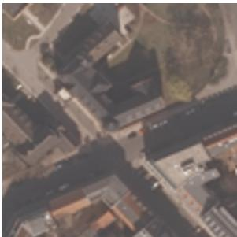

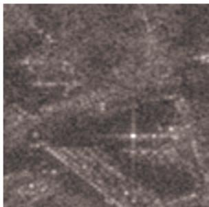

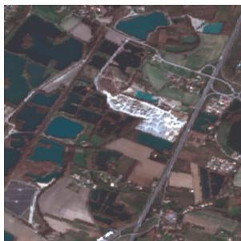

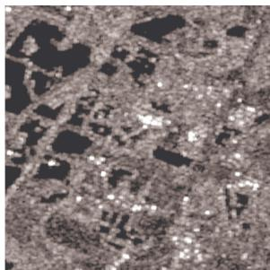

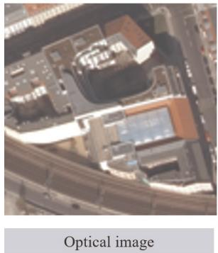

Figure 4. Examples of SARptical dataset  
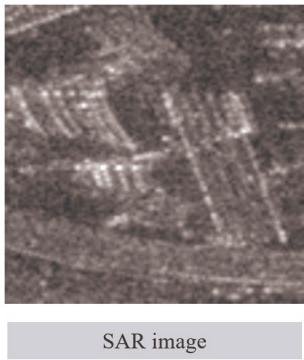

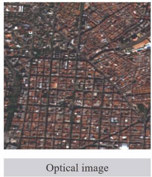

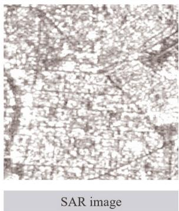  
Figure 5. Examples of SEN1-2 dataset

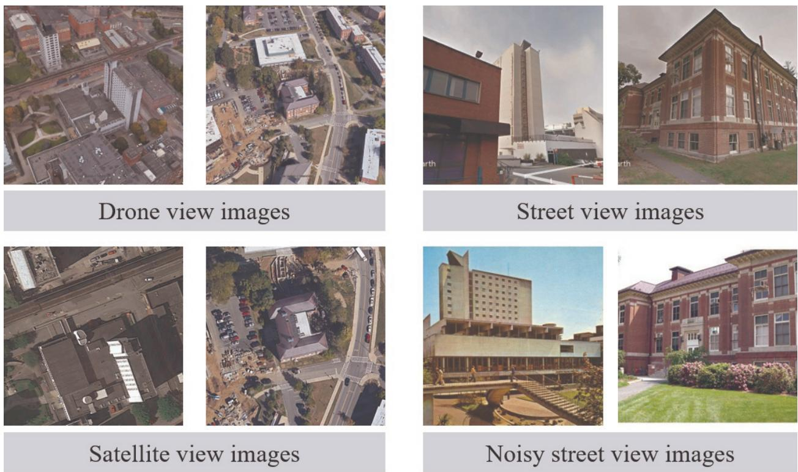  
Figure 6. Examples of University-1652 dataset

University-1652 (Zheng et al. 2020) includes data from three platforms: ground images, drone perspective images generated through Google Earth simulation, and satellite images, collected from 1652 buildings across 72 universities worldwide. Each building in this data set has an average of 1 satellite image, 1 drone image, and 3.38 real street view images. It features rich data sources and imaging perspectives, along with clear annotation information. Figure 6 showcases images of partial scenes from this dataset.

OS-dataset (Xiang et al. 2020b) is a matched dataset consisting of 10,692 pairs of 256\*256 pixels hi-res optical and SAR images. Image coverage includes multiple cities worldwide and their surrounding areas. SAR images are from the Gaofen-3 satellite, with a spatial resolution of 1 m optical images were acquired from the Google Earth platform and resampled to 1 m resolution.Figure 7 showcases images of partial scenes from the OS-dataset.

The QXS-SAROPT (Huang et al. 2021) dataset consists of 20,000 pairs of 256\*256 hi-res optical and SAR images. The QXS-SAROPT data set acquired SAR images from the Gaofen-3

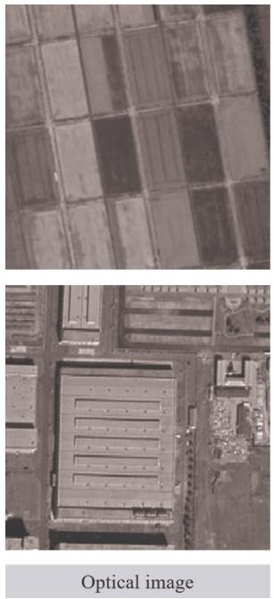

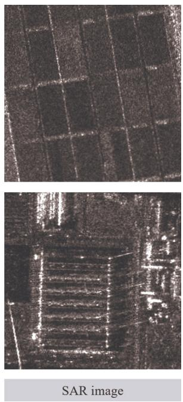  
Figure 7. Examples of OS-dataset

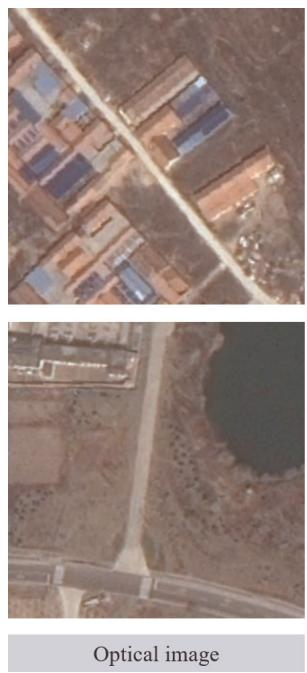

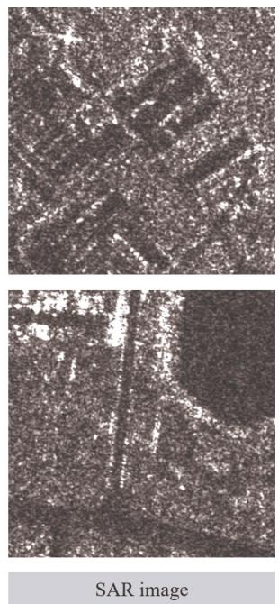  
Figure 8. Examples of QXS-SAROPT dataset

SAR satellite and optical images from Google Earth, maintaining a consistent 1-meter ground resolution for both modalities. Geographically, the data collection focuses exclusively on maritime environments, specifically capturing the port areas of Shanghai, Qingdao, and San Diego. Figure 8 showcases images of partial scenes from the QXS-SAROPT data set.

The Multimodal Image Matching Datasets (Jiang et al. 2021) consists of a selection of original image pairs from datasets related to the fields of medicine, remote sensing, and computer vision, involving 164 pairs of multimodal images of 18 diferent types. Figure 9 presents examples related to remote sensing images in this dataset.

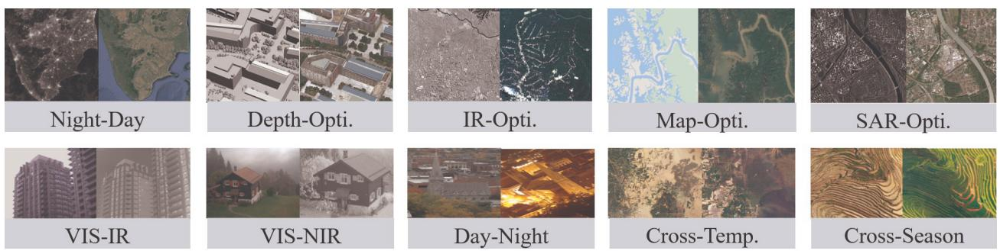  
Figure 9. Examples of remote sensing images in Multimodal Image Matching Dataset

Optical image  
SAR image  
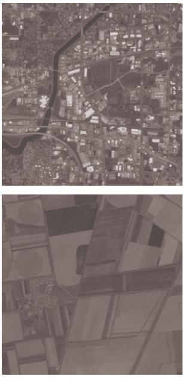

The SOPatch (Xu et al. 2023) dataset is built upon the WHU-SEN-City (Wang et al. 2019), OSdataset, and SEN1-2 datasets, undergoing further precise registration to create an optical and SAR image registration dataset containing over 650,000 pairs. This dataset is composed of various satellite images (Sentinel-1, Sentinel-2, Gaofen-3, etc.), including rich scenes (mountains, lakes, buildings, farmlands, bare land, etc.), enabling the training of models with good generalization ability. Figure 10 showcases images of some scenes in this dataset.

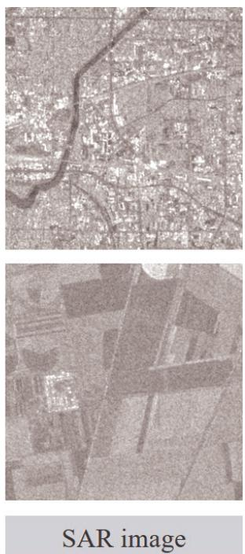  
Figure 10. Examples of SOPatch dataset

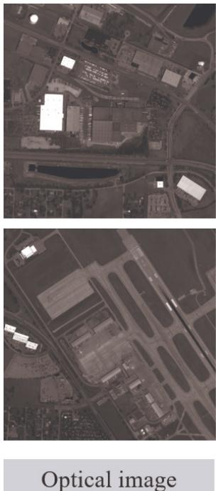

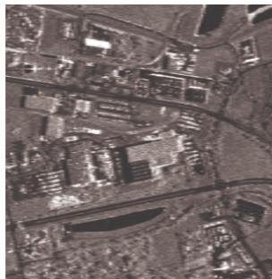

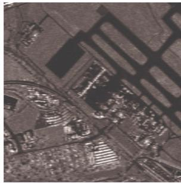  
Figure 11. Examples of OSEval dataset

The OSEval dataset (Xiang et al. 2023) includes an evaluation data set composed of hundreds of pairs of sub-meter resolution optical and SAR images, with various perspectives and covering rich scenes, including airports, residential areas, and industrial areas, as well as dense urban areas. This evaluation data set uses corner points with clear structure in optical and SAR images as ground truth to quantitatively assess optical and SAR registration algorithms, and can ensure unbiased performance comparisons across various registration methodologies. Figure 11 showcases images of partial scenes from the OSEval dataset.

3MOS (Ye et al. 2025) consists of 113,000 pairs of SAR and optical images acquired by five SAR satellites (GF-3, ALOS, Sentinel-1, Radarsat, and RCM) and Google Earth, covering eight distinct scenes including urban, rural, plains, hills, mountains, water, desert, and frozen earth. The spatial resolution of the images ranges from 3.5 meters to 12.5 meters, and the pixel size is 256\*256 pixels. Figure 12 showcases images of partial scenes in the 3MOS dataset.

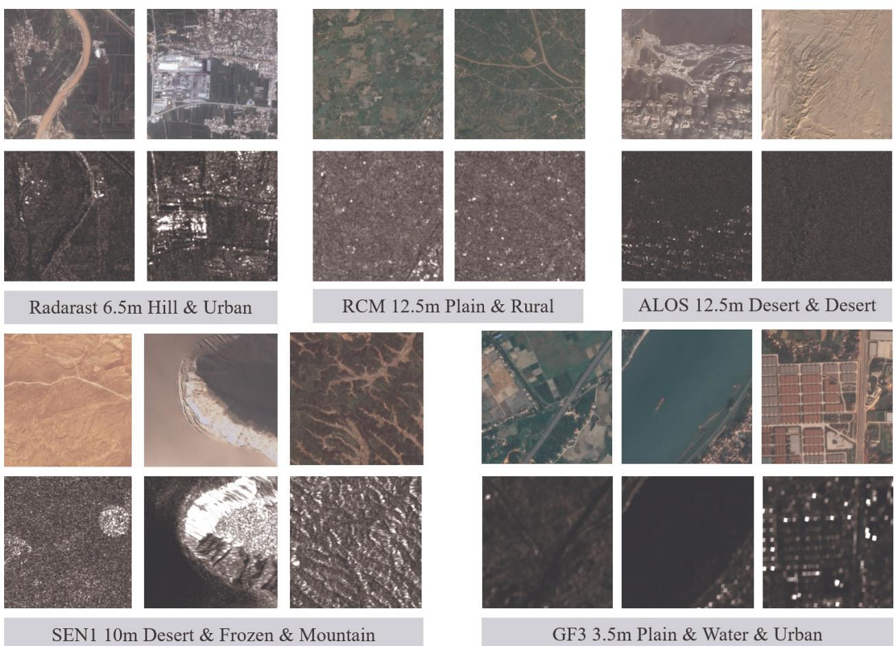  
Figure 12. Examples of 3MOS dataset

To systematically evaluate algorithm performance on these datasets, several quantitative metrics are widely adopted. Root Mean Square Error (RMSE) is the primary metric for measuring matching accuracy, as it directly quantifies the residual geometric deviation between point pairs. To assess robustness against severe multimodal discrepancies, the Correct Match Rate (CMR) (or Inlier Ratio) is utilized, reflecting the algorithm’s capability to identify true correspondences and reject outliers. Together, these metrics provide a rational and comprehensive evaluation of both precision and reliability.

## 6. Summary and prospect of multimodal remote sensing image registration

To guide algorithm selection in practical applications, it is essential to weigh the trade-ofs between mainstream feature-based methods and modern deep learning approaches. Because feature-based methods are highly interpretable and independent of extensive training data, they are reliable and relatively easy to deploy in scenarios involving significant scale and rotation variations. However, their reliance on handcrafted descriptors leaves them vulnerable to severe nonlinear ra- diometric discrepancies. Conversely, deep learning methods excel at bridging these complex radiometric gaps and achieving high matching accuracy by learning structural representations directly from the data. Nevertheless, this enhanced performance comes at a cost: deep learn- ing models depend heavily on massive, high-quality datasets, demand significant computational resources (e.g., GPUs) for training and deployment, and often lack theoretical interpretability. Consequently, feature-based methods remain highly practical for applications with limited data or strict hardware constraints, whereas deep learning becomes the preferred choice when robust radiometric alignment is paramount and suficient computational power is available.

Fundamentally, multimodal image registration serves as a cornerstone for a wide array of down- stream remote sensing applications, including image fusion, change detection, and large-scale image stitching. Over the past few decades, research in this domain has shifted from mitigating sim- ple linear radiometric diferences to resolving complex nonlinear distortions and severe geometric deformations. By systematically reviewing the three primary methodological paradigms—region- based, feature-based, and deep learning-based methods—this paper provides a comprehensive examination of their theoretical frameworks and representative algorithms. Ultimately, this syn- thesis aims not only to ofer a valuable reference for researchers but also to catalyze further methodological innovation within this rapidly evolving field.

Despite substantial advancements across these paradigms, our review reveals that each category faces inherent constraints, limiting its universal applicability in complex real-world scenarios. Region-based methods, for instance, remain heavily dependent on prior knowledge—such as RPC or POS data, coarse mapping models, and manual tie points—to constrain the initial search space. Furthermore, their performance is acutely sensitive to the overlap area; insuficient coverage fre- quently leads to registration failure. Alternatively, feature-based methods leverage local spatial relationships to construct high-dimensional descriptors. While efective, this approach often in- curs a substantial computational burden and remains susceptible to significant outliers. Such mismatches are particularly prevalent in cross-modal scenarios where scale, rotation, and radio- metric variations coexist, sometimes rendering feature-based approaches less robust than their region-based counterparts. Meanwhile, although deep learning-based methods excel at extracting abstract semantic information, their development in remote sensing lags behind the progress seen in the broader computer vision and medical imaging communities. The intricate complexity of remote sensing scenes, combined with high acquisition costs and confidentiality constraints, has led to a scarcity of large-scale, representative datasets. This data bottleneck fundamentally restricts the generalization and evolutionary potential of current learning-based frameworks.

Looking forward, the rapid advancement of integrated sky-ground stereoscopic observation technologies has intensified the demand for intelligent, high-precision, and real-time multimodal registration. Specifically, there is an urgent need to deploy robust registration algorithms in com- plex, emerging application scenarios. These include rapid post-disaster deformation assessment for emergency response, cross-season temporal registration for long-term ecological monitoring, and high-precision alignment in extreme environments. Addressing these highly heterogeneous and dynamic environments will undoubtedly serve as a primary catalyst for future algorithmic breakthroughs.

To meet the rigorous demands of these advanced applications, future research must evolve across all methodological paradigms. For region-based methods, priority should be given to developing deformation-invariant similarity metrics that integrate local appearance with structural features. Simultaneously, exploring lightweight binary descriptors and hardware-software co-design will be crucial for real-time on-board satellite or airborne processing. For feature-based approaches, the focus must shift toward enhancing computational eficiency—such as by utilizing Fast Fourier Transform acceleration strategies—and implementing more robust outlier rejection algorithms to guarantee consistent sub-pixel precision. Finally, overcoming the data scarcity bottleneck in learning-based paradigms requires not only the curation of more comprehensive public datasets via open-source platforms but also a deeper exploration of unsupervised learning and domain adaptation. Ultimately, by seamlessly integrating geoscientific remote sensing knowledge with advanced computer vision architectures, researchers can design task-specific semantic extraction models tailored to the unique physical mechanisms of multimodal sensors, thereby paving the way for highly resilient and universally applicable registration solutions.

## References

Amin, S. and E. Hamid. 2015. Remote Sensing Image Matching Based on Adaptive Binning SIFT Descriptor. Geoscience and Remote Sensing, IEEE Transactions on, 53 (10), 5283–5293, 10.1109/TGRS.2015.2420659

Arar, M., Y. Ginger, D. Danon, A. H. Bermano and D. Cohen-Or. 2020. Unsupervised multimodal Image Registration via Geometry Preserving Image-to-Image Translation. 2020 IEEE/CVF Conference on Computer Vision and Pattern Recognition (CVPR), 13 407–13 416, 10.1109/CVPR42600.2020.01342

Bay, H., A. Ess, T. Tuytelaars and L. Van Gool. 2008. Speeded-Up Robust Features (SURF). Computer Vision and Image Understanding, 110 (3), 346–359, 10.1016/j.cviu.2007.09.014

Belmouhcine, A., J.-C. Burnel, L. Courtrai, M.-T. Pham and S. Lefevre. 2023. Multimodal object\` detection in remote sensing. IGARSS 2023-2023 IEEE International Geoscience and Remote Sensing Symposium, IEEE, 1245–1248

Bi, X., R. Qie, C. Tao, Z. Zhang and Y. Xu. 2025. Unsupervised Multimodal UAV Image Registration via Style Transfer and Cascade Network. Remote Sensing, 17 (13), 2160, 10.3390/rs17132160

Brown, L. G. 1992. A survey of image registration techniques. ACM Comput. Surv., 24 (4), 325–376, 10.1145/146370.146374

Cao, S., B. Yu, L. Luo, R. Zhang, S. Chen, C. Li and H. Shen. 2023. PCNet: A structure similarity enhancement method for multispectral and multimodal image registration. Information Fusion, 94, 200–214, 10.1016/j.infus.2023.02.004

Chen, H., M. K. Arora and P. K. Varshney Corresponding author. 2003. Mutual information-based image registration for remote sensing data. International Journal of Remote Sensing, 24 (18), 3701–3706, 10.1080/0143116031000117047

Chen, H. and P. Varshney. 2000. A pyramid approach for multimodality image registration based on mutual information. Proceedings of the Third International Conference on Information Fusion, Vol. 1, MOD3/9–MOD315 vol.1, 10.1109/IFIC.2000.862613

Chen, T., J. Guo, H. Xinzhong, X. Xie and J. Xi. 2022. Visible and infrared image matching method based on generative adversarial model. Journal of Zhejiang University (Engineering Science), 56 (1), 63–74, 10.3785/j.issn.1008-973X.2022.01.007

Cole-Rhodes, A., K. Johnson, J. LeMoigne and I. Zavorin. 2003. Multiresolution registration of remote sensing imagery by optimization of mutual information using a stochastic gradient. IEEE Transactions on Image Processing, 12 (12), 1495–1511, 10.1109/TIP.2003.819237

Cui, S., A. Ma, L. Zhang, M. Xu and Y. Zhong. 2022. MAP-Net: SAR and Optical Image Matching via Image-Based Convolutional Network With Attention Mechanism and Spatial Pyramid Aggregated Pooling. IEEE Transactions on Geoscience and Remote Sensing, 60, 1–13, 10.1109/TGRS.2021.3066432

Dellinger, F., J. Delon, Y. Gousseau, J. Michel and F. Tupin. 2015. SAR-SIFT: A SIFT- Like Algorithm for SAR Images. IEEE Trans. Geosci. Remote Sensing, 53 (1), 453–466, 10.1109/TGRS.2014.2323552

DeTone, D., T. Malisiewicz and A. Rabinovich. 2018. SuperPoint: Self-Supervised Interest Point Detection and Description. Proceedings of the 2018 IEEE/CVF Conference on Computer Vision and Pattern Recognition Workshops (CVPRW), 337–349, 10.1109/CVPRW.2018.00060

Dong, Y., W. Jiao, T. Long, L. Liu, G. He, C. Gong and Y. Guo. 2019. Local Deep Descriptor for Remote Sensing Image Feature Matching. Remote Sensing, 11 (4), 430, 10.3390/rs11040430

Fan, J., Y. Ye, J. Li, G. Liu and Y. Li. 2022. A Novel Multiscale Adaptive Binning Phase Congruency Feature for SAR and Optical Image Registration. IEEE Trans. Geosci. Remote Sensing, 60, 10.1109/TGRS.2022.3206804

Fan, Z., L. Zhang, Y. Liu, Q. Wang and S. Zlatanova. 2021. Exploiting High Geopositioning Accuracy of SAR Data to Obtain Accurate Geometric Orientation of Optical Satellite Images. Remote Sensing, 13 (17), 3535, 10.3390/rs13173535

Feng, R., Q. Du, H. Luo, H. Shen, X. Li and B. Liu. 2021. A registration algorithm based on optical flow modification for multi-temporal remote sensing images covering the complex-terrain region. National Remote Sensing Bulletin, 25 (2), 630–640, 10.11834/jrs.20209280

Fu, Z., Q. Qin, B. Luo, H. Sun and C. Wu. 2018. HOMPC: A Local Feature Descriptor Based on the Combination of Magnitude and Phase Congruency Information for Multi-Sensor Remote Sensing Images. Remote Sensing, 10 (8), 1234, 10.3390/rs10081234

Gao, T., C. Lan, W. Huang and S. Wang. 2025a. SFA-Net: A SAM-guided focused attention network for multimodal remote sensing image matching. ISPRS Journal of Photogrammetry and Remote Sensing, 223, 188–206, 10.1016/j.isprsjprs.2025.02.032

Gao, T., C. Lan, C. Zhou, Y. Zhang, W. Huang, Y. Wang and L. Wang. 2025b. Arctic sea ice motion retrieval from multisource SAR images using a keypoint-free feature tracking algorithm. 230, 258–274, 10.1016/j.isprsjprs.2025.09.013

Geng, Z., H. Liu, P. Duan, X. Wei and S. Li. 2025. Feature-based multimodal remote sensing image matching: Benchmark and state-of-the-art. ISPRS Journal of Photogrammetry and Remote Sensing, 229, 285–302, 10.1016/j.isprsjprs.2025.08.028

Han, Y., J. Li, Y. Qu, L. Wang, X. Pan and X. Huang. 2025. HFNet: Semantic and Diferential Heterogenous Fusion Network for Remote Sensing Image Change Detection. Journal of Geovisualization and Spatial Analysis, 9 (1), 10.1007/s41651-024-00202-3

Harris, C., M. Stephens and Coauthors. 1988. A combined corner and edge detector. Alvey vision conference, Manchester, UK, Vol. 15, 10–5244

Heipke, C. and F. Rottensteiner. 2020. Deep learning for geometric and semantic tasks in photogrammetry and remote sensing. Geo-Spat. Inf. Sci., 23 (1), 10–19, 10.1080/10095020.2020.1718003

Hong, Y., C. Leng, X. Zhang, J. Peng, L. Jiao and A. Basu. 2022. Max-Index Based Local Self- Similarity Descriptor for Robust Multi-Modal Image Registration. IEEE Geoscience and Remote Sensing Letters, 19, 1–5, 10.1109/LGRS.2022.3156622

Huang, M. and Coauthors. 2021. The QXS-SAROPT Dataset for Deep Learning in SAR-Optical Data Fusion. arXiv, 10.48550/ARXIV.2103.08259

Huang, W., Q. Sun, Q. Xu, T. Gao, J. Ma and B. Wen. 2026. An Arctic underwater terrain matching method integrating template matching and DEM super-resolution. International Journal of Applied Earth Observation and Geoinformation, 149, 105 251, 10.1016/j.jag.2026.105251

Hughes, L. H., D. Marcos, S. Lobry, D. Tuia and M. Schmitt. 2020. A deep learning framework for matching of SAR and optical imagery. ISPRS Journal of Photogrammetry and Remote Sensing, 169, 166–179, 10.1016/j.isprsjprs.2020.09.012

Hughes, L. H., M. Schmitt, L. Mou, Y. Wang and X. X. Zhu. 2018. Identifying Corresponding Patches in SAR and Optical Images With a Pseudo-Siamese CNN. IEEE Geoscience and Remote Sensing Letters, 15 (5), 784–788, 10.1109/LGRS.2018.2799232

Inglada, J. 2002. Similarity measures for multisensor remote sensing images. IEEE International Geoscience and Remote Sensing Symposium, Vol. 1, 104–106, 10.1109/IGARSS.2002.1024955

Jia, L., J. Dong, S. Huang, L. Liu and J. Zhang. 2023. Optical and SAR Image Registration Based on Multi-Scale Orientated Map of Phase Congruency. Electronics, 12 (7), 1635, 10.3390/electronics12071635

Jiang, X., J. Ma, G. Xiao, Z. Shao and X. Guo. 2021. A review of multimodal image matching: Methods and applications. Information Fusion, 73, 22–71, 10.1016/j.infus.2021.02.012

Jiang, Y.-h., G. Zhang, P. Chen, D.-r. Li, X.-m. Tang and W.-c. Huang. 2015. Systematic Error Compensation Based on a Rational Function Model for Ziyuan1-02C. IEEE Transactions on Geoscience and Remote Sensing, 53 (7), 3985–3995, 10.1109/TGRS.2015.2388700

Kulkarni, S. C. and P. P. Rege. 2020. Pixel level fusion techniques for SAR and optical images: A review. Information Fusion, 59, 13–29, 10.1016/j.infus.2020.01.003

Lan, C., W. Lu, J. Yu and Q. Xu. 2021. Deep learning algorithm for feature matching of cross modality remote sensing images. Acta Geodaetica et Cartographica Sinica, 50 (2), 189, 10.11947/j.AGCS.2021.20200048

Li, J., G. Bi, X. Wang, T. Nie and L. Huang. 2024. Radiation-Variation Insensitive Coarse-to-Fine Image Registration for Infrared and Visible Remote Sensing Based on Zero-Shot Learning. Remote Sensing, 16 (2), 214, 10.3390/rs16020214

Li, J., Q. Hu and M. Ai. 2020. RIFT: Multi-Modal Image Matching Based on Radiation-Variation Insensitive Feature Transform. IEEE Transactions on Image Processing, 29, 3296– 3310, 10.1109/TIP.2019.2959244

Li, J., P. Shi, Q. Hu and Y. Zhang. 2023a. RIFT2: Speeding-up RIFT with A New Rotation-Invariance Technique. arXiv, 10.48550/arXiv.2303.00319, 2303.00319

Li, L., L. Han, M. Ding and H. Cao. 2023b. Multimodal Image Fusion Framework for End-to-End Remote Sensing Image Registration. IEEE Transactions on Geoscience and Remote Sensing, 61, 1–14, 10.1109/TGRS.2023.3247642

Li, L., L. Han, M. Ding, H. Cao and H. Hu. 2021a. A deep learning semantic template matching framework for remote sensing image registration. ISPRS Journal of Photogrammetry and Remote Sensing, 181, 205–217, 10.1016/j.isprsjprs.2021.09.012

Li, L., L. Han, M. Ding, Z. Liu and H. Cao. 2022a. Remote Sensing Image Registration Based on Deep Learning Regression Model. IEEE Geoscience and Remote Sensing Letters, 19, 1–5, 10.1109/LGRS.2020.3032439

Li, P., G. Jiang, Q. Ma, W. Xue and W. Yang. 2021b. A hybrid model combining tensor and mutual information for multimodal image registration. Acta Geodaetica et Cartographica Sinica, 50 (7), 916, 10.11947/j.AGCS.2021.20200492

Li, Q., G. Qu and Z. Li. 2013. Matching between SAR images and optical images based on HOG descriptor. IET International Radar Conference 2013, 1–4, 10.1049/cp.2013.0405

Li, X.-m., L. Zheng and Z. Hu. 2006. Sift based automatic registration of remotely-sensed imagery. JOURNAL OF REMOTE SENSING-BEIJING-, 10 (6), 885

Li, Y., Y. Liu, X. Su, X. Luo and L. Yao. 2022b. Review of Infrared and Visible Image Registration. Infrared Technology, 44 (7), 641–651

Liang, C., Y. Dong, C. Zhao and Z. Sun. 2023. A Coarse-to-Fine Feature Match Network Us- ing Transformers for Remote Sensing Image Registration. Remote Sensing, 15 (13), 3243, 10.3390/rs15133243

Liu, M., G. Zhou, L. Ma, L. Li and Q. Mei. 2023a. SIFNet: A self-attention interaction fusion network for multisource satellite imagery template matching. International Journal of Applied Earth Observation and Geoinformation, 118, 103 247, 10.1016/j.jag.2023.103247

Liu, Y., H. Qi and S. Peng. 2023b. Optical and SAR Images Matching Based on Phase Structure Convolutional Features. IEEE Geoscience and Remote Sensing Letters, 20, 1–5, 10.1109/LGRS.2023.3298687

Liu, Z., Y. Lin, Y. Cao, H. Hu, Y. Wei, Z. Zhang, S. Lin and B. Guo. 2021. Swin Transformer: Hier- archical Vision Transformer using Shifted Windows. 2021 IEEE/CVF International Conference on Computer Vision (ICCV), 9992–10 002, 10.1109/ICCV48922.2021.00986

Lowe, D. G. 2004. Distinctive Image Features from Scale-Invariant Keypoints. International Journal of Computer Vision, 60 (2), 91–110, 10.1023/B:VISI.0000029664.99615.94

Ma, J., X. Jiang, A. Fan, J. Jiang and J. Yan. 2021. Image Matching from Handcrafted to Deep Features: A Survey. Int J Comput Vis, 129 (1), 23–79, 10.1007/s11263-020-01359-2

Ma, L., Y. Liu, X. Zhang, Y. Ye, G. Yin and B. A. Johnson. 2019a. Deep learning in remote sensing applications: A meta-analysis and review. ISPRS-J. Photogramm. Remote Sens., 152, 166–177, 10.1016/j.isprsjprs.2019.04.015

Ma, W., Z. Wen, Y. Wu, L. Jiao, M. Gong, Y. Zheng and L. Liu. 2017. Remote Sensing Image Registration With Modified SIFT and Enhanced Feature Matching. IEEE Geoscience and Remote Sensing Letters, 14 (1), 3–7, 10.1109/LGRS.2016.2600858

Ma, W., J. Zhang, Y. Wu, L. Jiao, H. Zhu and W. Zhao. 2019b. A Novel Two-Step Registration Method for Remote Sensing Images Based on Deep and Local Features. IEEE Transactions on Geoscience and Remote Sensing, 57 (7), 4834–4843, 10.1109/TGRS.2019.2893310

Merkle, N., S. Auer, R. M¨uller and P. Reinartz. 2018. Exploring the Potential of Conditional Adver- sarial Networks for Optical and SAR Image Matching. IEEE Journal of Selected Topics in Applied Earth Observations and Remote Sensing, 11 (6), 1811–1820, 10.1109/JSTARS.2018.2803212

Merkle, N., W. Luo, S. Auer, R. M¨uller and R. Urtasun. 2017. Exploiting Deep Matching and SAR Data for the Geo-Localization Accuracy Improvement of Optical Satellite Images. Remote Sensing, 9 (6), 586, 10.3390/rs9060586

Mikolajczyk, K. and C. Schmid. 2005. A performance evaluation of local descriptors. IEEE Transactions on Pattern Analysis and Machine Intelligence, 27 (10), 1615–1630, 10.1109/TPAMI.2005.188

Nan, K., H. Qi and Y. Ye. 2019. A template matching method of multimodal remote sensing images based on deep convolutional feature representation. Acta Geodaetica et Cartographica Sinica, 48 (6), 727, 10.11947/j.AGCS.2019.20180432

Parmehr, E. G., C. S. Fraser, C. Zhang and J. Leach. 2014. Automatic registration of optical imagery with 3D LiDAR data using statistical similarity. ISPRS Journal of Photogrammetry and Remote Sensing, 88, 28–40, 10.1016/j.isprsjprs.2013.11.015

Quan, D., S. Wang, Y. Gu, R. Lei, B. Yang, S. Wei, B. Hou and L. Jiao. 2022. Deep Feature Correlation Learning for Multi-Modal Remote Sensing Image Registration. IEEE Transactions on Geoscience and Remote Sensing, 60, 1–16, 10.1109/TGRS.2022.3187015

Quan, D., H. Wei, S. Wang, Y. Gu, B. Hou and L. Jiao. 2023. A Novel Coarse-to-Fine Deep Learning Registration Framework for Multimodal Remote Sensing Images. IEEE Transactions on Geoscience and Remote Sensing, 61, 1–16, 10.1109/TGRS.2023.3306042

Reddy, B. and B. Chatterji. 1996. An FFT-based technique for translation, rotation, and scaleinvariant image registration. IEEE Transactions on Image Processing, 5 (8), 1266–1271, 10.1109/83.506761

Ren, J., X. Jiang, Z. Li, D. Liang, X. Zhou and X. Bai. 2025. Minima: Modality invariant image matching. Proceedings of the Computer Vision and Pattern Recognition Conference, 23 059– 23 068

Rosten, E., R. Porter and T. Drummond. 2010. Faster and Better: A Machine Learning Approach to Corner Detection. IEEE Transactions on Pattern Analysis and Machine Intelligence, 32 (1), 105–119, 10.1109/TPAMI.2008.275

Schmitt, M., L. H. Hughes and X. X. Zhu. 2018. The sen1-2 dataset for deep learning in sar- optical data fusion. ISPRS Ann. Photogramm. Remote Sens. Spatial Inf. Sci., IV-1, 141–146, 10.5194/isprs-annals-IV-1-141-2018

Sedaghat, A. and H. Ebadi. 2015. Distinctive Order Based Self-Similarity descriptor for multi- sensor remote sensing image matching. ISPRS Journal of Photogrammetry and Remote Sensing, 108, 62–71, 10.1016/j.isprsjprs.2015.06.003

Sedaghat, A. and N. Mohammadi. 2019. Illumination-Robust remote sensing image matching based on oriented self-similarity. ISPRS Journal ofPhotogrammetry and Remote Sensing, 153, 21–35, 10.1016/j.isprsjprs.2019.04.018

Sedaghat, A., M. Mokhtarzade and H. Ebadi. 2011. Uniform Robust Scale-Invariant Feature Matching for Optical Remote Sensing Images. IEEE Trans. Geosci. Remote Sensing, 49 (11), 4516–4527, 10.1109/TGRS.2011.2144607

Shen, X., B. Liu and Q. Li. 2017. Correcting bias in the rational polynomial coeficients of satellite imagery using thin-plate smoothing splines. ISPRS Journal of Photogrammetry and Remote Sensing, 125, 125–131, 10.1016/j.isprsjprs.2017.01.007

Sommervold, O., M. Gazzea and R. Arghandeh. 2023. A Survey on SAR and Optical Satellite Image Registration. Remote Sensing, 15 (3), 850, 10.3390/rs15030850

Sun, Y., L. Lei, Z. Li and G. Kuang. 2024. Similarity and dissimilarity relationships based graphs for multimodal change detection. ISPRS Journal ofPhotogrammetry and Remote Sensing, 208, 70–88, 10.1016/j.isprsjprs.2024.01.002

Sun, Z., S. Zhi, R. Li, J. Xia, Y. Liu and W. Jiang. 2025. Gdros: A geometry-guided dense registration framework for optical–sar images under large geometric transformations. IEEE Transactions on Geoscience and Remote Sensing, 63, 1–15

Suri, S. and P. Reinartz. 2010. Mutual-Information-Based Registration of TerraSAR-X and Ikonos Imagery in Urban Areas. IEEE Transactions on Geoscience and Remote Sensing, 48 (2), 939– 949, 10.1109/TGRS.2009.2034842

Tang, L., X. Xiang, H. Zhang, M. Gong and J. Ma. 2023a. DIVFusion: Darkness-free infrared and visible image fusion. Information Fusion, 91, 477–493, 10.1016/j.infus.2022.10.034

Tang, L., H. Zhang, H. Xu and J. Ma. 2023b. Deep learning-based image fusion: a survey. Journal of Image and Graphics, 28 (1), 3–36, 10.11834/jig.220422

Tola, E., V. Lepetit and P. Fua. 2010. DAISY: An Eficient Dense Descriptor Applied to Wide-Baseline Stereo. IEEE Trans. Pattern Anal. Mach. Intell., 32 (5), 815–830, 10.1109/TPAMI.2009.77

Tong, X., Z. Ye, Y. Xu, S. Liu, L. Li, H. Xie and T. Li. 2015. A Novel Subpixel Phase Correlation Method Using Singular Value Decomposition and Unified Random Sample Consensus. IEEE Transactions on Geoscience and Remote Sensing, 53 (8), 4143–4156, 10.1109/TGRS.2015.2391999

Vaswani, A., N. Shazeer, N. Parmar, J. Uszkoreit, L. Jones, A. N. Gomez, L. Kaiser and I. Polo- sukhin. 2017. Attention Is All You Need. arXiv, 10.48550/ARXIV.1706.03762

Velesaca, H. O., G. Bastidas, M. Rouhani and A. D. Sappa. 2024. Multimodal image regis- tration techniques: a comprehensive survey. Multimed Tools Appl, 83 (23), 63 919–63 947, 10.1007/s11042-023-17991-2

Wang, L., X. Xu, Y. Yu, R. Yang, R. Gui, Z. Xu and F. Pu. 2019. SAR-to-Optical Image Translation Using Supervised Cycle-Consistent Adversarial Networks. IEEE Access, 7, 129 136–129 149, 10.1109/ACCESS.2019.2939649

Wang, M., B. Xiong, Q. Guo and Y. Zhou. 2024a. Fast Registration of High-Resolution Optical-SAR Images Based on Grayscale Normalized Mutual Information. 2023 8th International Conference on Control, Robotics and Cybernetics (CRC), 320–325, 10.1109/CRC60659.2023.10488537

Wang, S., D. Quan, X. Liang, M. Ning, Y. Guo and L. Jiao. 2018. A deep learning framework for remote sensing image registration. ISPRS Journal of Photogrammetry and Remote Sensing, 145, 148–164, 10.1016/j.isprsjprs.2017.12.012

Wang, T., Z. Yan, J. Li, X. Zhao, C. Wang and M. Ng. 2024b. Hyperspectral and multi- spectral image fusion with arbitrary resolution through self-supervised representations. arXiv, 10.48550/arXiv.2405.17818

Wang, W., K. Mu and H. Liu. 2025. A Multihierarchy Flow Field Prediction Network for Multi- modal Remote Sensing Image Registration. IEEE J. Sel. Top. Appl. Earth Observations Remote Sensing, 18, 5232–5243, 10.1109/JSTARS.2025.3532939

Wang, Y., Y. Wan, Y. Zhang, B. Zhang and Z. Gao. 2023. Imbalance knowledge-driven multimodal network for land-cover semantic segmentation using aerial images and Li- DAR point clouds. ISPRS Journal of Photogrammetry and Remote Sensing, 202, 385–404, 10.1016/j.isprsjprs.2023.06.014

Wang, Y. and X. X. Zhu. 2018. The SARptical Dataset for Joint Analysis of SAR and Optical Image in Dense Urban Area. IGARSS 2018 - 2018 IEEE International Geoscience and Remote Sensing Symposium, 6840–6843, 10.1109/IGARSS.2018.8518298

Wei, X., W. Guo, W. Yu, F. Wei and D. Li. 2025. OSDM-MReg: Multimodal Image Registration based One Step Difusion Model. arXiv, 10.48550/arXiv.2504.06027

Wells, W. M., P. Viola, H. Atsumi, S. Nakajima and R. Kikinis. 1996. multimodal volume registration by maximization of mutual information. Medical Image Analysis, 1 (1), 35–51, 10.1016/S1361-8415(01)80004-9

Wu, B., H. Wang, C. Zhang and J. Chen. 2024. Optical-to-SAR Translation Based on CDA-GAN for High-Quality Training Sample Generation for Ship Detection in SAR Amplitude Images. Remote Sensing, 16 (16), 3001, 10.3390/rs16163001

Wu, J., Y. Rao, Y. Hu, M. Cheng and Z. Peng. 2016. Automatic registration of single aerial image with LiDAR data based on “pin-hole”imaging simulation and iterative computation. National Remote Sensing Bulletin, 20 (1), 80–93, 10.11834/jrs.20165070

Xiang, D., Y. Xu, J. Cheng, C. Hu and X. Sun. 2022a. An Algorithm Based on a Feature Interaction- based Keypoint Detector and Sim-CSPNet for SAR Image Registration. Leida xuebao, 11 (6), 1081–1097, 10.12000/jr22110

Xiang, Y., N. Jiao, F. Wang and H. You. 2022b. A Robust Two-Stage Registration Algorithm for Large Optical and SAR Images. IEEE Transactions on Geoscience and Remote Sensing, 60, 1–15, 10.1109/TGRS.2021.3133863

Xiang, Y., R. Tao, L. Wan, F. Wang and H. You. 2020a. OS-PC: Combining Feature Representation and 3-D Phase Correlation for Subpixel Optical and SAR Image Registration. IEEE Trans. Geosci. Remote Sensing, 58 (9), 6451–6466, 10.1109/TGRS.2020.2976865

Xiang, Y., R. Tao, F. Wang, H. You and B. Han. 2020b. Automatic Registration of Optical and SAR Images Via Improved Phase Congruency Model. IEEE J. Sel. Top. Appl. Earth Observations Remote Sensing, 13, 5847–5861, 10.1109/JSTARS.2020.3026162

Xiang, Y., F. Wang and H. You. 2018. OS-SIFT: A Robust SIFT-Like Algorithm for High- Resolution Optical-to-SAR Image Registration in Suburban Areas. IEEE Transactions on Geoscience and Remote Sensing, 56 (6), 3078–3090, 10.1109/TGRS.2018.2790483

Xiang, Y., X. Wang, F. Wang, H. You, X. Qiu and K. Fu. 2023. A Global-to-Local Algorithm for High-Resolution Optical and SAR Image Registration. IEEE Transactions on Geoscience and Remote Sensing, 61, 1–20, 10.1109/TGRS.2023.3309855

Xie, Z., W. Zhang, L. Wang, J. Zhou and Z. Li. 2023. Optical and SAR Image Registration Based on the Phase Congruency Framework. Applied Sciences, 13 (10), 5887, 10.3390/app13105887

Xiong, X., G. Jin, Q. Xu and H. Zhang. 2021. Self-Similarity Features for Multimodal Remote Sensing Image Matching. IEEE J. Sel. Top. Appl. Earth Observations Remote Sensing, 14, 12 440–12 454, 10.1109/JSTARS.2021.3131489

Xiong, X., G. Jin, Q. Xu, H. Zhang, L. Wang and K. Wu. 2022. Robust Registration Algorithm for Optical and SAR Images Based on Adjacent Self-Similarity Feature. IEEE Transactions on Geoscience and Remote Sensing, 60, 1–17, 10.1109/TGRS.2022.3197357

Xiong, X., Q. Xu, G. Jin, H. Zhang and X. Gao. 2020. Rank-Based Local Self-Similarity Descriptor for Optical-to-SAR Image Matching. IEEE Geoscience and Remote Sensing Letters, 17 (10), 1742–1746, 10.1109/LGRS.2019.2955153

Xu, W., X. Yuan, Q. Hu and J. Li. 2023. SAR-optical feature matching: A large-scale patch dataset and a deep local descriptor. International Journal of Applied Earth Observation and Geoinformation, 122, 103 433, 10.1016/j.jag.2023.103433

Xu, X., X. Li, X. Liu, H. Shen and Q. Shi. 2016. Multimodal registration of remotely sensed images based on Jefrey’s divergence. ISPRS Journal of Photogrammetry and Remote Sensing, 122, 97–115, 10.1016/j.isprsjprs.2016.10.005

Yang, J., Y. Zheng, W. Xu, P. Sun and S. Bai. 2024a. An Accurate and Robust Multimodal Template Matching Method Based on Center-Point Localization in Remote Sensing Imagery. Remote Sensing, 16 (15), 2831, 10.3390/rs16152831

Yang, W., L. Mei, Z. Ye, Y. Wang, X. Hu, Y. Zhang and Y. Yao. 2024b. Adjacent Self-Similarity 3-D Convolution for Multimodal Image Registration. IEEE Geoscience and Remote Sensing Letters, 21, 1–5, 10.1109/LGRS.2024.3351158

Yao, Y., Y. Zhang, Y. Wan, X. Liu and H. Guo. 2021. Heterologous Images Matching Considering Anisotropic Weighted Moment and Absolute Phase Orientation. whdxxbxxkxb, 46 (11), 1727– 1736, 10.13203/j.whugis20200702

Yao, Y., Y. Zhang, Y. Wan, X. Liu, X. Yan and J. Li. 2022. Multi-Modal Remote Sensing Image Matching Considering Co-Occurrence Filter. IEEE Trans. on Image Process., 31, 2584–2597, 10.1109/TIP.2022.3157450

Ye, F., Y. Su, H. Xiao, X. Zhao and W. Min. 2018a. Remote Sensing Image Registration Using Convolutional Neural Network Features. IEEE Geosci. Remote Sensing Lett., 15 (2), 232–236, 10.1109/LGRS.2017.2781741

Ye, Y., L. Bruzzone, J. Shan, F. Bovolo and Q. Zhu. 2019. Fast and Robust Matching for Multimodal Remote Sensing Image Registration. IEEE Transactions on Geoscience and Remote Sensing, 57 (11), 9059–9070, 10.1109/TGRS.2019.2924684

Ye, Y., J. Shan, L. Bruzzone and L. Shen. 2017a. Robust Registration of Multimodal Remote Sensing Images Based on Structural Similarity. IEEE Transactions on Geoscience and Remote Sensing, 55 (5), 2941–2958, 10.1109/TGRS.2017.2656380

Ye, Y., J. Shan, S. Hao, L. Bruzzone and Y. Qin. 2018b. A local phase based invariant feature for remote sensing image matching. ISPRS Journal of Photogrammetry and Remote Sensing, 142, 205–221, 10.1016/j.isprsjprs.2018.06.010

Ye, Y., L. Shen, M. Hao, J. Wang and Z. Xu. 2017b. Robust Optical-to-SAR Image Matching Based on Shape Properties. IEEE Geoscience and Remote Sensing Letters, 14 (4), 564–568, 10.1109/LGRS.2017.2660067

Ye, Y., T. Tang, B. Zhu, C. Yang, B. Li and S. Hao. 2022a. A Multiscale Framework With Unsu- pervised Learning for Remote Sensing Image Registration. IEEE Transactions on Geoscience and Remote Sensing, 60, 1–15, 10.1109/TGRS.2022.3167644

Ye, Y., B. Zhu, T. Tang, C. Yang, Q. Xu and G. Zhang. 2022b. A robust multimodal re-mote sensing image registration method and system using steerable filters with first- and second-order gradients. ISPRS Journal of Photogrammetry and Remote Sensing, 188, 331–350, 10.1016/j.isprsjprs.2022.04.011

Ye, Y. and Coauthors. 2025. 3MOS: A multi-source, multi-resolution, and multi-scene optical- SAR dataset with insights for multi-modal image matching. Visual Intelligence, 3 (1), 19, 10.1007/s44267-025-00091-0

Yu, L., D. Zhang and E.-J. Holden. 2008. A fast and fully automatic registration approach based on point features for multi-source remote-sensing images. Computers & Geosciences, 34 (7), 838–848, 10.1016/j.cageo.2007.10.005

Yue, C., Y. Zhang, J. Yan, Y. Liu and P. Guo. 2025. CTNet: Multimodal Remote Sensing Image Keypoint Detection and Description for CNN and Transformer Architectures. IEEE J. Sel. Top. Appl. Earth Observations Remote Sensing, 18, 20 163–20 181, 10.1109/JSTARS.2025.3595440

Zhang, H., L. Lei, W. Ni, T. Tang, J. Wu, D. Xiang and G. Kuang. 2022a. Explore Better Network Framework for High-Resolution Optical and SAR Image Matching. IEEE Transactions on Geoscience and Remote Sensing, 60, 1–18, 10.1109/TGRS.2021.3126939

Zhang, H., L. Lei, W. Ni, T. Tang, J. Wu, D. Xiang and G. Kuang. 2022b. Optical and SAR Image Matching Using Pixelwise Deep Dense Features. IEEE Geosci. Remote Sensing Lett., 19, 1–5, 10.1109/LGRS.2020.3039473

Zhang, H., H. Li, J. Lin, Y. Zhang, J. Fan, H. Liu and K. Liu. 2025a. Seg-CycleGAN: SAR-to- Optical Image Translation Guided by a Downstream Task. IEEE Geoscience and Remote Sensing Letters, 22, 1–5, 10.1109/LGRS.2025.3538868

Zhang, H., W. Ni, W. Yan, D. Xiang, J. Wu, X. Yang and H. Bian. 2019a. Registration of Multimodal Remote Sensing Image Based on Deep Fully Convolutional Neural Network. IEEE J. Sel. Top. Appl. Earth Observations Remote Sensing, 12 (8), 3028–3042, 10.1109/JSTARS.2019.2916560

Zhang, J., W. Ma, Y. Wu and L. Jiao. 2019b. Multimodal Remote Sensing Image Registration Based on Image Transfer and Local Features. IEEE Geosci. Remote Sensing Lett., 16 (8), 1210–1214, 10.1109/LGRS.2019.2896341

Zhang, S., B. Luo, J. Liu, Z. Fu, X. Su and S. Zhu. 2025b. GLIFT: A Global-to-Local Invariant Feature Transformation Method for Multimodal Remote Sensing Image Matching. IEEE Trans. Geosci. Remote Sensing, 63, 1–19, 10.1109/TGRS.2025.3599445

Zhang, Y., C. Lan, H. Zhang, G. Ma and H. Li. 2024a. Multimodal Remote Sensing Image Matching via Learning Features and Attention Mechanism. IEEE Trans. Geosci. Remote Sensing, 62, 10.1109/TGRS.2023.3348980

Zhang, Y., Y. Liu, H. Zhang and G. Ma. 2022c. Multimodal Remote Sensing Image Matching Combining Learning Features and Delaunay Triangulation. IEEE Trans. Geosci. Remote Sensing, 60, 10.1109/TGRS.2022.3229366

Zhang, Y., W. Zhang, Y. Yao, Z. Zheng, Y. Wan and M. Xiong. 2024b. Robust registration of multi-modal remote sensing images based on multi-dimensional oriented self-similarity fea- tures. International Journal ofApplied Earth Observation and Geoinformation, 127, 103 639, 10.1016/j.jag.2023.103639

Zhang, Y., Z. Zhang and J. Gong. 2021. Generalized photogrammetry of spaceborne, airborne and terrestrial multi-source remote sensing datasets. Acta Geodaetica et Cartographica Sinica, 50, 1–11, 10.11947/j.AGCS.2021.20200245

Zhao, J., D. Yang, Y. Li, P. Xiao and J. Yang. 2022. Intelligent Matching Method for Heterogeneous Remote Sensing Images Based on Style Transfer. IEEE J. Sel. Top. Appl. Earth Observ. Remote Sens., 15, 6723–6731, 10.1109/JSTARS.2022.3197748

Zheng, T., G. Dong, P. Zhang, X. He and C. Ren. 2025a. Plug-and-Play General Image Registration for Misaligned Multi-Modal Image Fusion. IEEE Trans. Circuits Syst. Video Technol., 35 (10), 10 017–10 031, 10.1109/TCSVT.2025.3570530

Zheng, Y., S. Yang, J. Wu, Y. Fu and R. Kou. 2025b. Heterogenous remote sensing image regis- tration based on extended phase consistency feature and spatial relationship constraint. Remote Sensing Technology and Application, 40 (1), 144–155, 10.11873/j.issn.1004-0323.2025.1.0144

Zheng, Z., Y. Wei and Y. Yang. 2020. University-1652: A Multi-view Multi-source Benchmark for Drone-based Geo-localization. MM ’20: PROCEEDINGS OF THE 28TH ACM INTERNA-TIONAL CONFERENCE ON MULTIMEDIA, 1395–1403, 10.1145/3394171.3413896

Zhou, L., Y. Ye, T. Tang, K. Nan and Y. Qin. 2022. Robust Matching for SAR and Optical Images Using Multiscale Convolutional Gradient Features. IEEE Geosci. Remote Sens. Lett., 19, 10.1109/LGRS.2021.3105567

Zhu, B., C. Yang, J. Dai, J. Fan, Y. Qin and Y. Ye. 2023a. R2FD2: Fast and Robust Matching of Multimodal Remote Sensing Images via Repeatable Feature Detector and Rotation-Invariant Feature Descriptor. IEEE Trans. Geosci. Remote Sensing, 61, 10.1109/TGRS.2023.3264610

Zhu, B., Y. Ye, L. Zhou, Z. Li and G. Yin. 2021. Robust registration of aerial images and LiDAR data using spatial constraints and Gabor structural features. ISPRS Journal of Photogrammetry and Remote Sensing, 181, 129–147, 10.1016/j.isprsjprs.2021.09.010

Zhu, B., L. Zhou, S. Pu, J. Fan and Y. Ye. 2023b. Advances and Challenges in Multi- modal Remote Sensing Image Registration. IEEE J. Miniat. Air Space Syst., 4 (2), 165–174, 10.1109/JMASS.2023.3244848