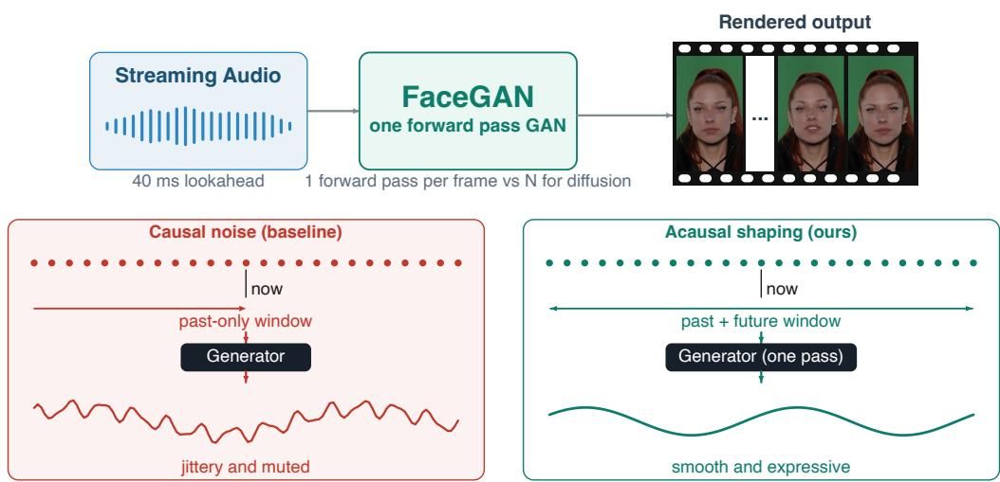
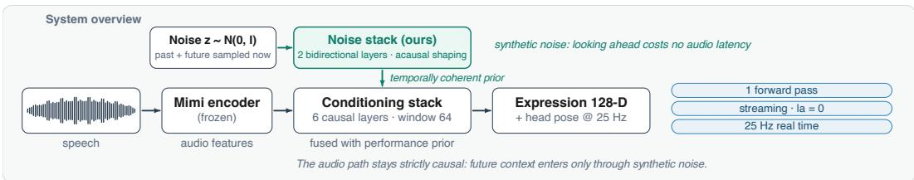
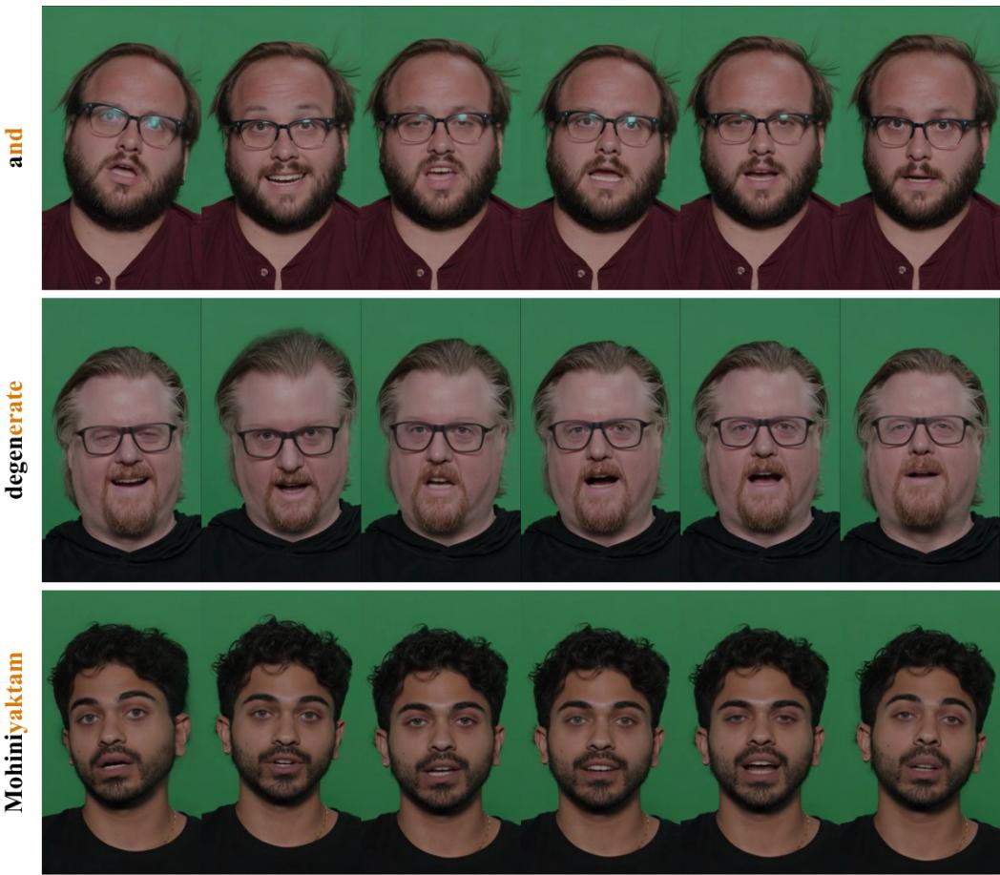
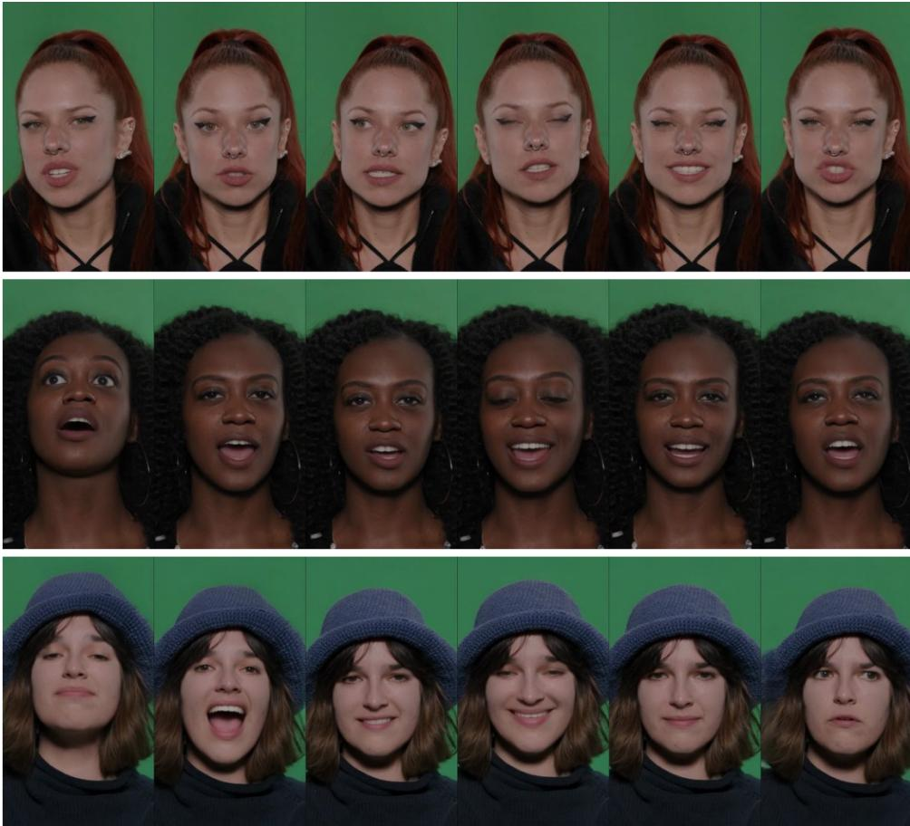

# NO DISTILLATION NEEDED: SINGLE-PASS REAL-TIME TALKING HEADS VIA ACAUSAL NOISE SHAPING

Yu Han, Dejan Markovic, Alexander Richard, Wojciech Zielonka, Akshay Venkatesh, Cheng-hsin Wuu & Michael Zollhoefer Meta Reality Labs

Project Website

  
Figure 1: Streaming audio-to-expression with latency-free acausal noise shaping. Top: audio streams through our method called FaceGAN, which emits every frame in a single forward pass at 25 Hz with 40 ms of audio lookahead; the filmstrip shows rendered output. Bottom: the same causal generator driven by causal noise (left) produces jittery, muted motion, while our acausally shaped noise (right) yields smooth, expressive motion. Bottom traces are illustrative schematics.

## ABSTRACT

Audio-driven facial animation underpins real-time avatars, telepresence, and embodied virtual agents. And it must run online: each frame emitted from audio observed up to the current time, at interactive rates. Recent progress is dominated by diffusion models, which need many network evaluations per sample and are therefore a poor fit for streaming. We argue the cost is unnecessary in this domain. Audio-conditioned facial motion occupies a comparatively low-dimensional manifold, a regime where a single-pass GAN suffices. The obstacle is not capacity but stochastic structure. We show that a causal, time-invariant generator driven by i.i.d. noise cannot suppress its output spectrum over a band without collapsing its per-step innovation. We proposed FaceGAN, which dissolved the limitation by shaping the noise pathway acausally. Because the driving noise is synthetic, its future can be sampled now, so the audio-to-expression path stays causal, and the model supports fully causal operation. FaceGAN emits expression and head pose in a single forward pass per frame and matches or outperforms state-of-art approaches in generation quality. Being feed-forward with bounded attention windows, it generates indefinitely without drift.

## 1 INTRODUCTION

Audio-driven facial expression generation, mapping a stream of speech to a stream of facial motion, is a core building block for virtual avatars, telepresence, embodied agents, game characters, and assistive communication. In practical settings the model runs online: it must emit expression frame t from audio observed up to that time and small lookahead, at interactive frame rates, with bounded and small latency. Offline fidelity is not enough; the deployment constraint is streaming inference.

The task itself is mature, and recent gains have been driven largely by diffusion models, which produce high-fidelity, diverse motion but at the cost of iterative sampling: tens to hundreds of function evaluations per frame. This is a poor fit for streaming: the very mechanism that gives diffusion its quality is what makes it expensive to deploy online. The prevailing response is to accept the cost, or to distill diffusion back down toward a single pass, implicitly conceding that single-pass generation is the desirable endpoint and diffusion is a detour to reach it.

We take the endpoint directly. Our starting observation is that diffusion’s advantages are most pronounced on high-dimensional, highly multimodal data distributions; audio-conditioned facial expression, by contrast, lives on a comparatively low-dimensional manifold and is typically learned under data scarcity. In this regime the gap that motivates iterative refinement largely disappears, and a single-pass generator (concretely, a GAN) can match or exceed diffusion quality while retaining single-pass, low-latency inference. In other words, the efficient, well-understood tool is sufficient here; the question is only whether it can be made to produce natural motion online.

The obstacle to that is not obvious, and it is where our second contribution lies. A naive causal single-pass generator faces an intrinsic spectral limitation: driven by i.i.d. noise, a causal, timeinvariant generator cannot shape the spectrum of its output without paying in innovation variance. We make this precise via the theorem in Sec. 3: suppressing the output spectrum over a band forces the per-step new-information budget to collapse. Empirically this manifests as the trade-off practitioners hit: either the motion is temporally rich but jittery, or smooth but muted and lifeless. Increasing network capacity does not help – it is a property of the generated process, not the architecture.

Our fix is a single, cheap architectural move: acausal shaping of the noise pathway. Because the driving noise is generated internally rather than observed from the environment, an acausal filter over the noise can be realized with zero latency: we simply sample the required future noise now. This makes the noise fed to the generator non-i.i.d. The result is a system that is causal and streaming in the audio→expression pathway, yet free to produce smooth, spectrally clean, and richly stochastic motion. The acausal stage is generator-agnostic in principle and may benefit other generators; whether it helps diffusion is orthogonal to our thesis and left to future work, and even if it did, diffusion’s iterative sampling cost would remain.

Together these two threads, the efficiency of single-pass GANs on this manifold and the noiseshaping technique that unlocks their quality, yield FaceGAN, a low-latency, single-pass audio-toexpression system that matches or surpasses diffusion baselines at a fraction of the inference latency.

Our main contributions are as follows:

• We identify and formalize an intrinsic spectral limitation to causal single-pass generation via the Kolmogorov–Szego theorem, explaining the jitter-vs-muted-motion trade-off as a ˝ property of the generated process rather than the architecture.

• We introduce latency-free acausal noise shaping, which dissolves this limitation by driving a causal generator with non-i.i.d. noise, and show it costs no audio latency.

• We build FaceGAN and show that on the low-dimensional manifold of audio-driven facial expression, a single-pass GAN matches the compared baselines at 43 ms latency and 12× real time on a single GPU.

## 2 RELATED WORK

## 2.1 AUDIO-DRIVEN FACIAL MOTION GENERATION

Audio-driven facial motion generation synthesizes facial movement from speech, and has been studied across output representations ranging from 2D portrait videos Zhou et al. (2020); Prajwal et al. (2020) to 3D mesh templates Karras et al. (2017); Fan et al. (2022); Richard et al. (2021); Xing et al. (2023); Thambiraja et al. (2023) and, more recently, neural rendering with NeRF Guo et al. (2021); Ye et al. (2023); Gafni et al. (2021); Zielonka et al. (2023) or Gaussian Splatting Aneja et al. (2025); Li et al. (2024); Zielonka et al. (2025a;b); Qian et al. (2024) for higher visual fidelity (see Zielonka et al. (2026) for a comprehensive survey of avatar representations and creation methods across face, full-body, hands, hair, and garments). Orthogonal to the choice of representation, a central difficulty is that audio only weakly determines facial dynamics: deterministic regressors collapse toward the conditional mean, producing over-smoothed, under-expressive motion that discards a speaker’s stochastic detail. To recover this diversity, recent work turns to generative models. Diffusion approaches Aneja et al. (2024); Sun et al. (2024) synthesize high-fidelity, varied motion but depend on full-sequence look-ahead or iterative sampling, and even streaming-oriented Xiao et al. (2025) or single-step Lee et al. (2025) variants operate at chunk granularity. Autoregressive token models predict discrete motion codes step by step Chu et al. (2025), which Chu et al. (2026) pushed to strictly causal, zero-lookahead streaming. Both families restore motion diversity, but each carries an inference cost: diffusion pays for iterative refinement, and autoregressive models require a learned tokenizer and sequential, token-by-token decoding.

<table><tr><td>Method</td><td>Arch.</td><td># steps</td><td>Causal</td><td>Live-system</td></tr><tr><td>DiffPoseTalk Sun et al. (2024)</td><td>Diffusion</td><td>500</td><td>2 (chunk-level)</td><td>X</td></tr><tr><td>ARTalk Chu et al. (2025)</td><td>LLM Transformer</td><td>5</td><td>~(chunk-level)</td><td>X</td></tr><tr><td>MemoryTalker Kim et al. (2025)</td><td></td><td>1</td><td></td><td>X</td></tr><tr><td>Fallingwater Chu et al. (2026)</td><td>LLM</td><td>176</td><td>(chunk-level)</td><td>X</td></tr><tr><td>FaceGAN (ours)</td><td>GAN</td><td>1</td><td>(frame-level)</td><td></td></tr></table>

Table 1: Inference characteristics of the compared methods. Only our method is both single-pass and frame-level streaming; see Appendix D for how # steps is counted. Live-system means deployable for live animation: frame-level streaming with low latency, not throughput alone; see Appendix E for the measured benchmark.

Our setting. We target streaming, single-pass generation: each frame is emitted from audio observed up to the current time, in one forward pass, at low latency. This rules out full-sequence and chunk-based methods, and distinguishes us from autoregressive streaming approaches Chu et al. (2025; 2026), which remain sequential in the token dimension. We show that on the comparatively low-dimensional manifold of facial motion, a single-pass GAN matches or exceeds these approaches at a fraction of the inference cost, provided the stochastic degradation that afflicts cheap single-pass generators is addressed, which we do via latency-free acausal noise shaping (Sec. 3.2).

## 2.2 GENERATIVE MODELS FOR MOTION: DIFFUSION VS. SINGLE-PASS GENERATOR

The choice of generative family reflects a trade-off between sample quality and inference cost. Diffusion models became the default for high-dimensional, highly multimodal domains, and continue to scale through flow-based formulations Lipman et al. (2023); Esser et al. (2024); Black Forest Labs (2024), where iterative denoising both stabilizes training and captures complex, multi-peaked distributions. This power comes at a price: sampling requires many sequential network evaluations. Consequently, a large and very active line of work seeks to compress diffusion back toward a single step: consistency models Song et al. (2023); Luo et al. (2023) and their continuous-time refinement Lu & Song (2025), trajectory- and shortcut-based samplers Kim et al. (2024); Frans et al. (2025); Geng et al. (2025), and distillation objectives such as distribution matching Yin et al. (2024b;a) and adversarial distillation Sauer et al. (2024); Xu et al. (2024). That so much recent effort targets onestep sampling underscores the point: single-pass generation is the desirable inference regime, and these methods are routes back to it. Notably, several of these state-of-the-art accelerators converge on ideas from GANs. Adversarial objectives are reintroduced to sharpen few-step samples Sauer et al. (2024); Xu et al. (2024), and recent work distills diffusion models directly into conditional GANs Kang et al. (2024), while modernized GAN architectures and training recipes Kang et al. (2023); Sauer et al. (2023); Huang et al. (2024) have narrowed or closed the quality gap with diffusion at a single forward pass. GANs remain particularly strong on lower-dimensional or strongly structured domains and under limited data Karras et al. (2020), where diffusion’s multi-step machinery offers diminishing returns and can even overfit. Face motion is such a regime: conditioned on audio, expression and head pose occupy a comparatively low-dimensional manifold, and paired audio-motion data is scarce relative to image or video corpora, so a single-pass conditional generator can match iterative samplers in quality while retaining a latency advantage for streaming synthesis.

Our position. We therefore build on a single-pass GAN rather than an iterative or autoregressive sampler. The obstacle is not quality but stochastic structure: a causal, single-pass generator driven by i.i.d. noise faces an intrinsic limit on how it can shape the temporal spectrum of its output without sacrificing motion richness (Sec. 3.2). We show this limitation, not any inherent weakness of GANs, is what has kept cheap single-pass generators uncompetitive for temporally coherent motion, and that it is removed by shaping the noise pathway acausally at no cost to audio-side latency. Table 1 summarizes how the compared methods differ along these axes.

## 3 SPECTRAL LIMITATION OF CAUSAL GENERATION

A causal and time-invariant generator maps i.i.d. noise $\boldsymbol { z } = ( z _ { t } ) _ { t \in \mathbb { Z } }$ to outputs $y = ( y _ { t } ) _ { t \in \mathbb { Z } }$ via

$$
y _ { t } = F ( z _ { t } , z _ { t - 1 } , z _ { t - 2 } , . ~ . ~ . ) ,\tag{1}
$$

where $F$ is any measurable function (an arbitrary neural network). For natural facial motion y should have bandlimited spectrum: energy concentrated at low frequencies, and none above a cutoff. The question is whether such a causal $\bar { F }$ can produce a perfect stopband (exact spectral null) in $y .$ . The linear case is settled by Paley–Wiener theory Paley & Wiener (1934); and here we show a nonlinear $F$ cannot do it either: the argument below applies to the generated stochastic process rather than to any particular architecture, and therefore binds arbitrary causal F without linearization. The argument proceeds in two parts. We first prove impossibility of a perfect stopband via $S z e g \mathrm { \tilde { o } s }$ link between spectral nulls and predictability, then quantify the depth-vs.-innovation trade-off and show how acausal noise shaping escapes it. Background is recalled in Appendix $\operatorname { A } ;$ we use (4)–(5) below.

## 3.1 NO PERFECT SPECTRAL STOPBAND

Theorem (Kolmogorov–Szego).˝ Szego˝ (1920); Kolmogorov (1941); Pourahmadi (2001) Let $y _ { t }$ be a real $L ^ { 2 } .$ -stationary stochastic process with spectral density $S : [ - \pi , \pi ] \to [ 0 , \infty )$ . Then the asymptotic one-step linear prediction error variance equals

$$
\sigma _ { \infty } ^ { 2 } = \exp \left( \frac { 1 } { 2 \pi } \int _ { - \pi } ^ { \pi } \log S ( \omega ) d \omega \right) , \quad \exp ( - \infty ) : = 0 .\tag{2}
$$

Key consequence. If $S = 0$ on a set $E \subseteq [ - \pi , \pi ]$ of positive measure, then log $S = - \infty$ on $E ,$ so R log S dω = −∞ and $\sigma _ { \infty } ^ { 2 } = 0 \mathrm { b y } ( 2 )$ . The process is then deterministic Doob (1953), so $\mathrm { V a r } ( y _ { t } \mid y _ { < t } ) = 0$

Theorem (main claim). Assume the generator uses its current noise, i.e. Var $\left( F ( z _ { t } , z _ { < t } ) \mid z _ { < t } \right) > 0$ a.s. (cf. (4)). Let y be the output in (1). Then its spectral density satisfies $S _ { y } ( \omega ) > 0$ for a.e. ω. In particular, $S _ { y }$ has no perfect stopband.

Proof of main claim. By $( 5 ) , \operatorname { V a r } ( y _ { t } \mid y _ { < t } ) \ge \mathbb { E } [ \operatorname { V a r } ( y _ { t } \mid z _ { < t } ) \mid y _ { < t } ]$ . Given $z _ { < t } , \ y _ { t }$ depends only on $z _ { t } ,$ , so $\operatorname { V a r } ( y _ { t } \mid z _ { < t } ) > 0 \ \mathrm { a . s . }$ . by (4); conditioning on $y _ { < t }$ preserves strict positivity, so $\operatorname { V a r } ( y _ { t } \mid y _ { < t } ) > 0 \operatorname { a . s . }$ Thus $y _ { t }$ lies outside the closed linear span of $y _ { < t }$ and $\sigma _ { \infty } ^ { 2 } > 0$ , which by the key consequence rules out any positive-measure null of $S _ { y }$ □

## 3.2 QUANTITATIVE TRADE-OFF: STOPBAND DEPTH VS. INNOVATION

Suppose $S _ { y } \ \leq \varepsilon$ over a fraction $\delta \in ( 0 , 1 )$ of the spectrum, with $S _ { y }$ scaled so its peak is 1 (hence log $S _ { y } \le 0$ elsewhere). Then from (2),

$$
\log \sigma _ { \infty } ^ { 2 } = { \frac { 1 } { 2 \pi } } \int _ { - \pi } ^ { \pi } \log S _ { y } ( \omega ) d \omega \leq \delta \cdot \log \varepsilon \quad \Longrightarrow \quad \left[ { \frac { \sigma _ { \infty } ^ { 2 } \leq \varepsilon ^ { \delta } . } { \sigma } } \right]\tag{3}
$$

For example, for a 40 dB stopband $( \varepsilon = 1 0 ^ { - 4 }$ in power) over $\delta \ : = \ : 0 . 9$ of the spectrum, $\sigma _ { \infty } ^ { 2 } \leq$ $1 0 ^ { - 3 . 6 } \approx \mathrm { ^ { 2 } . 5 } \times 1 0 ^ { - 4 } \mathrm { . }$ : at most ${ \sim } 0 . 0 2 5 \%$ of input noise variance survives as new per-step information. Insisting on rich stochasticity (large $\sigma _ { \infty } ^ { 2 } )$ forces a leaky stopband (jitter); insisting on small ε collapses $\sigma _ { \infty } ^ { 2 }$ (muted motion); buying back both with deep causal memory costs latency.

Escaping via acausal noise shaping. The limitation binds i.i.d. driving noise via $\operatorname { V a r } ( F ( z _ { t } , z _ { < t } ) \ |$ $z _ { < t } ) ~ > ~ 0 ~ \mathrm { a . s }$ . (cf. (4)). Preprocess acausally $z \mapsto \hat { z } \colon \hat { z } _ { t }$ becomes predictable from $\hat { z } _ { < t }$ since the smoother mixes in future z, so (4) fails for zˆ by design and the downstream causal $F$ in (1) is no longer bound by (3). Since z is synthetic, sampling its future needs no audio lookahead.

## 4 METHOD

Figure 2: System overview. Speech is encoded by a frozen Mimi encoder while an independent noise pathway samples past and future noise (costing no latency, as the noise is drawn rather than observed) and shapes it with two bidirectional layers into a temporally coherent motion prior. A sixlayer causal conditioning stack fuses the audio features with the prior and emits 128-D expression codes plus head pose at 25 Hz in a single forward pass, with no iterative sampling.

Motion representation. We operate in the same motion latent space as Agrawal et al. (2025), using their pretrained encoder. Each frame i is encoded into an expression code $\mathbf { e } _ { i } \in \mathbb { R } ^ { 1 2 8 }$ , head rotation $\mathbf { r } _ { i } ^ { \mathrm { h } } ,$ , head translation $\mathbf { t } _ { i } ^ { \mathrm { h } }$ , and shoulder translation ts (each in $\mathbb { R } ^ { 3 } )$ , concatenated into $\mathbf { y } _ { i } =$ $[ \mathbf { e } _ { i } , \mathbf { r } _ { i } ^ { \mathrm { h } } , \mathbf { t } _ { i } ^ { \mathrm { h } } , \mathbf { t } _ { i } ^ { \mathrm { s } } ] \in \mathbb { R } ^ { 1 3 7 }$ . Adopting this representation makes the comparison to Chu et al. (2026) free of representation confound, since both predict the same signal and are rendered by the same decoder.

System overview. As shown in Figure 2, given a speech waveform, we synthesize a temporally coherent sequence of expression codes and rigid head pose at 25 Hz. Let $\mathbf { a } ~ \in ~ \mathbb { R } ^ { T \times 5 1 2 }$ denote continuous audio embeddings from a frozen Mimi encoder Defossez et al.´ (2024), taken at 25 Hz frame grid of the target codes $\mathbf { y } _ { 1 : T } \in \mathbb { R } ^ { T \times 1 3 7 }$ . The mapping is one-to-many, since many plausible facial performances accompany the same utterance: regression to the conditional mean yields nearstationary motion, so we train adversarially, using expression reconstruction only during warmup; head pose retains a $\ell _ { 1 }$ term throughout training (Sec. 4.3). Variation is supplied by a noise latent $\mathbf { z } _ { 1 : T } \overset { \cdot } { \in } \mathbb { R } ^ { T \times 1 2 8 } , \mathbf { z } _ { t } \sim \mathcal { N } ( \mathbf { 0 } , \mathbf { I } )$ . The generator $G ( \mathbf { z } , \mathbf { a } )$ is a transformer; two multi-scale convolutional discriminators, one audio-conditioned and one unconditional, supply the adversarial signal.

## 4.1 GENERATOR

Two-stack design. G separates what varies from what is determined by speech. A noise stack of $M { = } 2$ layers processes z alone with bidirectional attention; a conditioning stack of N=6 causal layers then fuses the processed latent with audio. Causality bounds the input context only: predicted frames are never fed back, so the model is not autoregressive in its output and the full sequence is produced in a single forward pass. Placing the stochastic path before conditioning lets the latent develop temporally-correlated structure (a coherent motion style over a window) before speech constrains it, rather than perturbing an already-committed trajectory frame by frame. All layers are pre-norm blocks with RMSNorm Zhang & Sennrich (2019), rotary position embeddings Su et al. (2024), and SwiGLU feed-forward Shazeer (2020), with $d _ { \mathrm { m o d e l } } { = } 5 1 2$ , 8 heads, and $d _ { \mathrm { f f } } { = } 4 d _ { \mathrm { m o d e l } }$

Audio conditioning. Audio features are shifted left by L frames so that output frame t is conditioned on $\mathbf { a } _ { t + L }$ . A small lookahead (L=1) supplies the right-context for coarticulation, where a viseme anticipates the following phoneme, at a latency cost of 40 ms (see lookahead ablation in Sec. 5.4). Projected audio is added to the noise-stack output before the conditioning stack.

Windowed attention. Both stacks use windowed attention with radii $R _ { \mathrm { c } }$ (conditioning) and $R _ { \mathfrak { n } }$ (noise); we set $R _ { \mathrm { c } } { = } R _ { \mathrm { n } } { = } 6 4$ . The conditioning stack attends causally over $\left[ t - R _ { \mathrm { c } } { + } 1 , t \right] \left( 2 . 6 \mathrm { s } \right)$ , the noise stack symmetrically over $[ t - R _ { \mathrm { n } } , t + R _ { \mathrm { n } } ] ^ { \mathrm { ^ { - } } } ( 5 . 2 \mathrm { s } )$ , making the receptive field independent of sequence length and admitting KV-cached incremental decoding. Stacking widens this: past dependence reaches $N ( R _ { \mathrm { c } } { - } 1 ) = 3 7 8$ frames of audio (≈15 s), while future dependence is only $M R _ { \mathrm { n } }$ frames of noise and L of audio. Future noise costs no latency (z is sampled, not observed, so future noise is drawn ahead), leaving the L-frame audio lookahead as the only inference latency.

Output head. A single linear projection emits the 137 channels of the motion representation. The pose rows of its bias are initialized to the dataset mean pose, so the model learns only the delta.

## 4.2 DISCRIMINATORS

The conditional discriminator $D _ { c }$ receives two channels, the code sequence and a linear projection of the audio to the same width, and so judges audio–motion correspondence; it applies the same shift as the generator, so each frame is paired with exactly the audio the generator saw. The unconditional discriminator $D _ { u }$ receives the code sequence alone. When head pose is predicted it is appended to the expression channel, scaled per dimension by its dataset standard deviation to match the z-scored expression, and only $D _ { u }$ sees this joint 137-D signal; $D _ { c }$ is restricted to the 128-D expression.

Both discriminators view a clip as a 2-D image over (code × time) and are evaluated at temporal scales $S = \{ 1 , 2 , 4 , 8 \}$ , via average-pooling along time, each judging a different temporal granularity, from per-frame articulation to multi-second head motion. Each scale has a sub-discriminator: five weight-normalized $3 { \times } 3$ convolutions with stride (2, 1), downsampling the feature axis while preserving temporal resolution, with LeakyReLU(0.2), plus a 1-channel output convolution.

## 4.3 TRAINING OBJECTIVE

Both discriminators are trained with the multi-scale hinge loss over scales $s \in S$ , and the generator with the corresponding term plus $\ell _ { 1 }$ feature matching on the deepest convolutional activation of each scale; we write $\mathcal { L } _ { c } ^ { \mathrm { { \bar { a } d v } } } , \mathcal { L } _ { c } ^ { \mathrm { { f m } } }$ for the terms from $D _ { c }$ and likewise for $D _ { u }$ . To prevent the generator ignoring z we add the mode-seeking term of Mao et al. (2019),

$$
\mathcal { L } _ { \mathrm { d i v } } = - \frac { d \big ( e ( z _ { 1 } , a ) , e ( z _ { 2 } , a ) \big ) } { d ( z _ { 1 } , z _ { 2 } ) + \epsilon } ,
$$

with $e ( \cdot )$ the expression channels and d the mean absolute difference; two latents are drawn per step. Head pose is supervised by an $\ell _ { 1 }$ term $\mathcal { L } _ { \mathrm { h p } }$ and regularized by the squared first- and third-order time differences of the prediction, standardized per dimension $( \dot { \mathcal { L } _ { \mathrm { v e l } } } , \dot { \mathcal { L } _ { \mathrm { j i t } } } )$ . The full generator objective is

$$
\mathcal { L } _ { G } = \mathcal { L } _ { c } ^ { \mathrm { a d v } } + \mathcal { L } _ { u } ^ { \mathrm { a d v } } + \lambda _ { \mathrm { f m } } \big ( \mathcal { L } _ { c } ^ { \mathrm { f m } } + \mathcal { L } _ { u } ^ { \mathrm { f m } } \big ) + \lambda _ { \mathrm { d i v } } \mathcal { L } _ { \mathrm { d i v } } + \lambda _ { \mathrm { h p } } \mathcal { L } _ { \mathrm { h p } } + \lambda _ { \mathrm { v e l } } \mathcal { L } _ { \mathrm { v e l } } + \lambda _ { \mathrm { j i t } } \mathcal { L } _ { \mathrm { j i t } } ,
$$

with $\lambda _ { \mathrm { f m } } { = } 2 , \lambda _ { \mathrm { d i v } } { = } 1 , \lambda _ { \mathrm { h p } } { = } 1 , \lambda _ { \mathrm { v e l } } { = } 0 . 0 1 , \lambda _ { \mathrm { j i t } } { = } 0 . 0 5$ . The first 5,000 steps use only the reconstruction $( \ell _ { 1 }$ on expression and pose) and smoothness terms; generator and discriminator steps then alternate.

## 5 EXPERIMENTS

## 5.1 EXPERIMENTAL SETTINGS

Dataset. We use the dataset of Chu et al. (2026): 34,906 clips from 832 subjects (469.6 hours) spanning speech and non-verbal vocalizations, partitioned into 784 training and 48 test identities. All results are reported on a fixed set of 64 held-out clips.

Implementation details. We train generator and discriminators jointly for 200,000 steps on 8 NVIDIA H200 GPUs at batch size 128. Samples are 512-frame crops. The loss covers a 128- frame window whose offset is drawn uniformly from [0, 384] each step; frames before the window are generated to supply its causal history, so the model is supervised at every history depth up to the 378-frame stacked reach. We use AdamW Loshchilov & Hutter (2019) at $\dot { 1 } \times 1 0 ^ { - \check { 4 } }$ (generator) and $2 \times 1 0 ^ { - 4 }$ (discriminators), cosine decay (factor 0.1), and an EMA of the generator weights.

## 5.2 RESULTS

We present quantitative and qualitative results. Unless stated otherwise, our model is evaluated in the final configuration of Sec. 4.1: a single frame of audio lookahead (L=1, 40 ms) and $R _ { \mathrm { c } } { = } R _ { \mathrm { n } } { = } 6 4$ The lookahead ablation is reported in Sec. 5.4. We selected four state-of-the-art methods as baselines: Fallingwater Chu et al. (2026), DiffPoseTalk Sun et al. (2024), MemoryTalker Kim et al. (2025), and ARTalk Chu et al. (2025). All methods except MemoryTalker are stochastic, so for fair quantitative evaluation we draw 64 samples per sequence and average each metric over the draws. To assess distributional realism, we report Frechet Expression Distance (FED) and Fr´ echet Pose´ Distance (FPD); lower is better. To assess expressiveness, we report within-clip variance ratios of the generated motion relative to ground truth; closer to 1.0 is better. We also report motion similarity to ground truth and lip-sync (Sync Score) following the Fallingwater evaluation protocol; higher is better. Table 2 reports the quantitative results, and Figure 3 shows qualitative comparisons (additional examples can be found in Appendix C). All baselines are trained without style conditioning for direct comparability with our method; style-conditioned variants are reported in Appendix B.

<table><tr><td rowspan=1 colspan=1>Method</td><td rowspan=1 colspan=1>FED ↓</td><td rowspan=1 colspan=1>FPD↓</td><td rowspan=1 colspan=1>Similarity ↑</td><td rowspan=1 colspan=1>Sync Score ↑</td><td rowspan=1 colspan=1>Expr Var →1</td><td rowspan=1 colspan=1>Pose Var →1</td></tr><tr><td rowspan=5 colspan=1>FallingwaterDiffPoseTalkMemoryTalkerARTalk</td><td rowspan=1 colspan=1>12.4824†</td><td rowspan=1 colspan=1>1.6070</td><td rowspan=1 colspan=1>0.0976</td><td rowspan=1 colspan=1>0.6964</td><td rowspan=1 colspan=1>0.9803</td><td rowspan=1 colspan=1>1.1863†</td></tr><tr><td rowspan=1 colspan=1>11.3546</td><td rowspan=1 colspan=1>1.4720†</td><td rowspan=1 colspan=1>0.1016</td><td rowspan=1 colspan=1>0.5768†</td><td rowspan=1 colspan=1>0.7591†</td><td rowspan=1 colspan=1>0.5354</td></tr><tr><td rowspan=2 colspan=1>20.704714.5405</td><td rowspan=1 colspan=1>3.7693</td><td rowspan=1 colspan=1>0.1328†</td><td rowspan=1 colspan=1>0.5346</td><td rowspan=1 colspan=1>0.2171</td><td rowspan=1 colspan=1>0.0832</td></tr><tr><td rowspan=1 colspan=1>1.2727</td><td rowspan=1 colspan=1>0.2911</td><td rowspan=1 colspan=1>0.2342</td><td rowspan=1 colspan=1>1.3998</td><td rowspan=1 colspan=1>1.0539</td></tr><tr><td rowspan=1 colspan=1>FaceGAN (ours)</td><td rowspan=1 colspan=1>12.1483</td><td rowspan=1 colspan=1>1.3335</td><td rowspan=1 colspan=1>0.1542</td><td rowspan=1 colspan=1>0.8767</td><td rowspan=1 colspan=1>0.9647</td><td rowspan=1 colspan=1>0.9921</td></tr></table>

Table 2: Quantitative comparison against Fallingwater Chu et al. (2026), DiffPoseTalk Sun et al. (2024), MemoryTalker Kim et al. (2025) and ARTalk Chu et al. (2025). Expr/Pose Var are withinclip variance ratios against ground truth (how much the face and head move over time during an utterance), so best is closest to 1.0. bold gold = best, underline silver = second-best, bronze† third-best per column (ranking direction per arrow). Our method matches the multi-step or noncausal methods, achieving the best Sync Score and within-clip pose variance, while being the second best on every other metric, and operating in real time with single-step inference.

  
Figure 3: Lip articulation on three utterances, with the target phoneme highlighted in each row label. Our mouth shapes track the ground-truth articulation faithfully with single-step inference, unlike the multi-step or non-causal baselines.

Our model substantially outperforms all baselines in Sync Score (Table 2) while being the only method that streams frame by frame at low latency. All other metrics are on par with the current state of the art, which means we did not trade speed for quality, unlike what usually happens with distilled diffusion models. This trade-off is a known artifact of diffusion distillation: DMD’s reverse KL objective behaves in a mode-seeking way, collapsing the generator onto dominant modes of the teacher distribution Yin et al. (2024b); Li et al. (2026).

## 5.3 USER STUDY

To assess the perceptual quality of the generated face motion, we conducted a user preference study with 19 participants and a total of 684 comparisons. We use blind side-by-side A/B testing to compare our method against the baselines. We ask participants to focus on two criteria: lip sync (how well the mouth movements match the speech) and naturalness (whether the facial expressions and head motion look natural). We omit the identity-similarity criterion of Chu et al. (2026), as our method does not condition on speaker style.

Pooled over all baselines, our method is at parity on lip sync and preferred on naturalness (Tab. 3). The per-opponent rows are reported for completeness, but with 76 to 190 comparisons each they resolve differences only above roughly ten points; the two that separate from chance, ARTalk on naturalness and MemoryTalker on both criteria, favour our method, and no baseline is ahead of ours on either criterion. The study agrees with the metrics: a single forward pass reaches the perceptual quality of the multi-step or non-causal baselines.

<table><tr><td rowspan=1 colspan=1>Comparison</td><td rowspan=1 colspan=1>Lip sync</td><td rowspan=1 colspan=1>Naturalness</td></tr><tr><td rowspan=3 colspan=1>vs. Fallingwater Chu et al. (2026)vs. DiffPoseTalk Sun et al. (2024)vs. ARTalk Chu et al. (2025)vs. MemoryTalker Kim et al. (2025)</td><td rowspan=1 colspan=1> $\overline { { 4 5 . 3 \pm 7 . 1 } }$ </td><td rowspan=1 colspan=1> $\overline { { 5 5 . 3 \pm 7 . 1 } }$ </td></tr><tr><td rowspan=1 colspan=1> $5 2 . 1 \pm 7 . 1$ </td><td rowspan=1 colspan=1> $5 2 . 1 \pm 7 . 1$ </td></tr><tr><td rowspan=1 colspan=1> $4 5 . 6 \pm 9 . 1$  ${ \bf 6 7 . 1 \pm 1 0 . 6 }$ </td><td rowspan=1 colspan=1> ${ \bf 6 1 . 1 \pm 9 . 0 }$  ${ \bf 6 8 . 4 \pm 1 0 . 5 }$ </td></tr><tr><td rowspan=1 colspan=1>all baselines</td><td rowspan=1 colspan=1> $\overline { { 5 0 . 5 \pm 4 . 1 } }$ </td><td rowspan=1 colspan=1> $\overline { { { \bf 5 7 . 1 } \pm { \bf 4 . 1 } } }$ </td></tr></table>

Table 3: User study: percentage of comparisons preferring our method, with 95% confidence intervals, over 19 participants and 684 comparisons. 50% means the two are perceptually indistinguishable; bold marks intervals that exclude 50%.

## 5.4 ABLATION STUDY

We ablate the central design choices of our model: the temporal structure of the injected noise (Tab. 4), and the audio lookahead, training objective and discriminator design (Tab. 5). All ablations are trained under identical settings; scores are on the 64-clip test set. Three independent training runs of the full model give the run-to-run band against which differences are judged. Alongside the distribution metrics we report sample diversity for expression and pose: with $K { = } 6 4$ draws per clip, the spread across draws at a fixed frame, in units of the ground-truth temporal spread, so 1 means two samples differ as much as a real face moves and 0 means the model ignores z.

<table><tr><td>causal noise radius</td><td></td><td>att.</td><td colspan="2">Sync↑</td><td colspan="2">FED↓</td><td colspan="2">Expr Div</td><td colspan="2">Pose Div</td><td colspan="2">Expr Var</td></tr><tr><td>V</td><td>512</td><td>512</td><td>0.8654</td><td>-2%</td><td>11.59</td><td>-1%</td><td>0.89</td><td>-3%</td><td>0.84</td><td>+4%</td><td>0.92</td><td>-8%</td></tr><tr><td>√</td><td>129</td><td>129</td><td>0.8905</td><td>+1%</td><td>11.60</td><td>-1%</td><td>0.79</td><td>-14%</td><td>0.64</td><td>-22%</td><td>0.93</td><td>-7%</td></tr><tr><td>V</td><td>64</td><td>64</td><td>0.9074</td><td>+3%</td><td>12.61</td><td>+7%</td><td>0.68</td><td>-25%</td><td>0.52</td><td>-36%</td><td>0.92</td><td>-9%</td></tr><tr><td rowspan="5">ours</td><td>2</td><td>5</td><td>0.8616</td><td>-2%</td><td>11.59</td><td>-1%</td><td>0.82</td><td>-11%</td><td>0.81</td><td>-0%</td><td>1.03</td><td>+3%</td></tr><tr><td>32</td><td>65</td><td>0.8902</td><td>+1%</td><td>11.64</td><td>-1%</td><td>0.91</td><td>-0%</td><td>0.91</td><td>+12%</td><td>1.02</td><td>+1%</td></tr><tr><td>64</td><td>129</td><td>0.8810</td><td>±0.0065</td><td>11.76</td><td>±0.52</td><td>0.91</td><td>±0.03</td><td>0.82</td><td>±0.05</td><td>1.01</td><td>±0.02</td></tr><tr><td>128</td><td>257</td><td>0.8847</td><td>+0%</td><td>11.88</td><td>+1%</td><td>0.91</td><td>-0%</td><td>0.88</td><td>+8%</td><td>1.02</td><td>+2%</td></tr><tr><td></td><td></td><td></td><td></td><td></td><td></td><td></td><td></td><td></td><td></td><td></td><td></td></tr></table>

Table 4: Noise stack, causal versus acausal; causal rows and ours are means of three runs. “att.” is frames seen per layer: $R _ { \mathfrak { n } }$ for a causal stack, $2 R _ { \mathrm { n } } { + } 1$ for an acausal one. Deltas against ours, whose ± is the run-to-run sd over its three runs; grey is inside that band $( < 2 \sigma )$ . For Expr Div and Pose Div only collapse is marked, since higher diversity is not in itself better.

Noise shaping. Sec. 3 predicts that a causal generator driven by i.i.d. noise cannot place a spectral null without collapsing its innovation. Tab. 4 tests this by making the noise stack causal while holding everything else fixed. The two are not directly comparable at equal radius (a causal noise stack sees $R _ { \mathfrak { n } }$ frames, an acausal one $2 R _ { \mathrm { n } } { + } 1 )$ , so we compare at matched attended width and bracket our model with a narrower and a wider causal stack. All three causal stacks under-articulate, at 0.92– 0.93 against ground truth, while every acausal setting stays within 3% of 1.0. At matched width the causal stack also loses 14% of expression diversity and 22% of pose diversity at unchanged Sync and FED; the narrower stack loses 25% and 36%.

<table><tr><td></td><td></td><td colspan="2">Sync ↑</td><td colspan="2">FED↓</td><td colspan="2">FPD↓</td><td colspan="2">Expr Div</td><td colspan="2">Pose Div</td></tr><tr><td>Ours (L=1)</td><td></td><td>|0.8810 ±0.0065</td><td></td><td>11.76 ±0.52</td><td></td><td>1.62</td><td>±0.32</td><td>0.91 ±0.03</td><td></td><td></td><td>|0.82 ±0.05</td></tr><tr><td rowspan="2">Lookahead</td><td> $L { = } 0$   $L { = } 2$ </td><td>0.8698</td><td>3 -1%</td><td>13.08+11%</td><td></td><td></td><td>2.38+46%</td><td></td><td>1.03+13%</td><td></td><td>0.99+21%</td></tr><tr><td> $L { = } 4$ </td><td>0.8737-1% 0.8721</td><td>-1%</td><td>11.42 11.82</td><td>-3% +1%</td><td></td><td> $1 . 9 9 + 2 2 \%$   $2 . 2 4 \ \mathrm { ~ + 3 8 \% }$ </td><td>0.90-1% 0.90-2%</td><td></td><td></td><td>0.85+4% 0.81-0%</td></tr><tr><td rowspan="2">Discriminators</td><td>no  $D _ { u }$ </td><td>0.6403</td><td>-27%</td><td>11.98+2%</td><td></td><td></td><td>4.44+173%</td><td></td><td>1.21+33%</td><td></td><td>0.08 -90%</td></tr><tr><td>no  $D _ { c }$ </td><td>0.0234 -97%</td><td></td><td>15.16+29%</td><td></td><td></td><td> $1 . 8 7 \ + 1 5 \%$ </td><td>1.21</td><td>+33%</td><td></td><td>0.86+5%</td></tr><tr><td rowspan="2">Objective</td><td> $\lambda _ { \mathrm { f m } } { = } 0$ </td><td></td><td>-2%</td><td></td><td></td><td></td><td></td><td></td><td></td><td></td><td></td></tr><tr><td></td><td>0.8602</td><td></td><td>16.48+40%</td><td></td><td></td><td> $1 . 9 4 \ \mathrm { ~ + 2 0 \% }$ </td><td></td><td>1.30+42%</td><td></td><td>1.17+43%</td></tr><tr><td rowspan="2"></td><td> $\lambda _ { \mathrm { d i v } } { = } 0$ </td><td>0.8851+0%</td><td></td><td>11.97+2%</td><td></td><td></td><td> $2 . 7 9 \ + 7 2 \%$ </td><td></td><td>0.09-91%</td><td></td><td>0.07-91%</td></tr><tr><td> $\lambda _ { \mathrm { h p } } { = } 0$ </td><td>0.8625-2%</td><td></td><td>11.18-5%</td><td></td><td> $1 . 5 8 \quad - 3 \%$ </td><td></td><td></td><td>0.97+7%</td><td></td><td>1.00+22%</td></tr></table>

Table 5: Ablations on the 64-clip test set. Deltas are percentages against ours (mean of three runs), whose ± is the run-to-run sd over three runs; grey marks differences inside that band (< 2σ). For Expr Div and Pose Div only collapse is marked, since higher diversity is not in itself better.

Lookahead, objective and discriminators. Lookahead beyond one frame changes nothing, while L=0 costs expression and pose quality. The architecture therefore supports fully causal operation (L=0) where required, trading expression and pose quality for 40 ms. Both discriminators are necessary: without $D _ { c }$ lip-sync collapses entirely (−97% Sync) while pose is untouched, and without $D _ { u }$ pose collapses in both distribution and diversity (+173% FPD, −90% Pose Div) and lip-sync degrades as well. Removing feature matching inflates FED by 40%. The mode-seeking term has a measurable effect on the metric it targets: removing it collapses diversity by 91% in both expression and pose: the generator reproduces a single performance regardless of z, and FPD inflates by 72%. Removing the pose $\ell _ { 1 }$ term is tolerable, costing 2% Sync.

## 5.5 COMPUTATIONAL PERFORMANCE

We report the computational performance for generator alone, excluding frozen audio encoder and renderer. All numbers are measured in streaming mode (one frame per call, with each layer keeping a fixed-size ring buffer over its attention window, so per-frame cost and memory are independent of stream length) on a single H200 in fp32, with no optimisation beyond the KV cache. Latency is input-to-output: the L=1 lookahead (40 ms) plus the forward pass. A single stream runs at 43.3 ms, 12.1× real time. Batching is nearly free: latency is unchanged at 256 concurrent streams, still under 50 ms at 1024, and real time holds to 4096 streams at 62 ms (Tab. 6). Coarser emission trades latency for throughput: at 1 s blocks the per-call cost amortises to 235× real time, at 1 s latency.

<table><tr><td>concurrent streams</td><td>1</td><td>256</td><td>1024</td><td>2048</td><td>4096</td></tr><tr><td>forward / latency (ms)</td><td>3.3 / 43.3</td><td>3.6 / 43.6</td><td>6.5 / 46.4</td><td>11.4/51.4</td><td>21.7 / 61.7</td></tr><tr><td>× real time</td><td>12.1</td><td>11.0</td><td>6.2</td><td>3.5</td><td>1.8</td></tr></table>

Table 6: Latency and throughput of the generator on one H200. Latency is the forward pass plus the 40 ms audio lookahead; real-time factor is against the 40 ms frame budget at 25 Hz.

## 6 CONCLUSION

We showed that audio-driven facial animation does not need iterative sampling. On this task a single-pass GAN matches the compared baselines. Because generation is one forward pass over a causal audio stack with a single frame of lookahead, the same weights run offline and streaming, at 43 ms latency for a single stream and 62 ms at 4096 concurrent streams on one GPU. The ablations locate where the quality comes from: both discriminators are necessary and in different ways, and the noise stack must be acausal: a causal one under-articulates and loses sample diversity, which is free to avoid, since noise is sampled rather than observed.

## AI USE STATEMENT

We used AI tools to aid and polish writing, e.g. to save space by compacting long paragraphs, enhance the clarity of sentences, format tables, etc. We also used AI tools to draft sections of the paper, e.g. we used model config to draft implementation details, and result data to create LaTeX tables. We have reviewed all AI-assisted work, e.g. we proof-read AI modified paragraphs, checked that reported numbers match the experiment results, etc. All conceptual contributions, like use of GANs and causal noise shaping, the experimental designs, ablation and analyses are the sole work of the authors. We take responsibility for the final content of this work, including text, claims or artifacts produced with the aid of generative AI.

## ETHICS STATEMENT

Generation of photorealistic talking heads raises concerns about the potential for misuse, like deepfake creation. Two properties of our system bound that risk without removing it: the model outputs low-dimensional expression and head-pose coefficients rather than pixels, so photorealistic video requires renderer that we do not contribute; and it is not conditioned on speaker identity or style. On the other hand, real-time single-pass operation lowers the cost of misuse relative to existing methods. We hope to raise awareness of risks and encourage productive discussions regarding fair uses of synthetic video generation models.

## REFERENCES

Vasu Agrawal, Akinniyi Akinyemi, Kathryn Alvero, Morteza Behrooz, Julia Buffalini, Fabio Maria Carlucci, Joy Chen, Junming Chen, Zhang Chen, Shiyang Cheng, et al. Seamless interaction: Dyadic audiovisual motion modeling and large-scale dataset. arXiv preprint, 2025.

Shivangi Aneja, Justus Thies, Angela Dai, and Matthias Nießner. FaceTalk: Audio-driven motion diffusion for neural parametric head models. In CVPR, pp. 21263–21273, 2024.

Shivangi Aneja, Artem Sevastopolsky, Tobias Kirschstein, Justus Thies, Angela Dai, and Matthias Nießner. GaussianSpeech: Audio-driven personalized 3D gaussian avatars. In ICCV, pp. 13065– 13075, 2025.

Black Forest Labs. FLUX. https://github.com/black-forest-labs/flux, 2024.

Xuangeng Chu, Nabarun Goswami, Ziteng Cui, Hanqin Wang, and Tatsuya Harada. ARTalk: Speech-driven 3D head animation via autoregressive model. In Proceedings of the SIGGRAPH Asia 2025 Conference Papers, pp. 1–9, Hong Kong, 2025. Association for Computing Machinery.

Xuangeng Chu, Yu Han, Wei Mao, and Shih-En Wei. Personalizing causal audio-driven facial motion via dynamic multi-modal retrieval. In Proceedings of the SIGGRAPH Asia 2026 Conference Papers, 2026.

Alexandre Defossez, Laurent Mazar ´ e, Manu Orsini, Am ´ elie Royer, Patrick P ´ erez, Herv ´ e J ´ egou, ´ Edouard Grave, and Neil Zeghidour. Moshi: a speech-text foundation model for real-time dialogue, 2024.

Joseph L. Doob. Stochastic Processes. Wiley, 1953.

Patrick Esser, Sumith Kulal, Andreas Blattmann, Rahim Entezari, Jonas Muller, Harry Saini, Yam¨ Levi, Dominik Lorenz, Axel Sauer, Frederic Boesel, Dustin Podell, Tim Dockhorn, Zion English, and Robin Rombach. Scaling rectified flow transformers for high-resolution image synthesis. In Proceedings of the 41st International Conference on Machine Learning (ICML), volume 235 of Proceedings ofMachine Learning Research, pp. 12606–12633. PMLR, 2024.

Yingruo Fan, Zhaojiang Lin, Jun Saito, Wenping Wang, and Taku Komura. FaceFormer: Speechdriven 3D facial animation with transformers. In Proceedings of the IEEE/CVF conference on computer vision and pattern recognition, pp. 18770–18780, 2022.

Kevin Frans, Danijar Hafner, Sergey Levine, and Pieter Abbeel. One step diffusion via shortcut models. In The Thirteenth International Conference on Learning Representations (ICLR), 2025.

Guy Gafni, Justus Thies, Michael Zollhofer, and Matthias Nießner. Dynamic neural radiance fields¨ for monocular 4D facial avatar reconstruction. In CVPR, 2021.

Zhengyang Geng, Mingyang Deng, Xingjian Bai, J. Zico Kolter, and Kaiming He. Mean flows for one-step generative modeling. In Advances in Neural Information Processing Systems (NeurIPS), 2025.

Yudong Guo, Keyu Chen, Sen Liang, Yong-Jin Liu, Hujun Bao, and Juyong Zhang. AD-NeRF: Audio driven neural radiance fields for talking head synthesis. In ICCV, 2021.

Yiwen Huang, Aaron Gokaslan, Volodymyr Kuleshov, and James Tompkin. The GAN is dead; long live the GAN! A modern GAN baseline. In Advances in Neural Information Processing Systems (NeurIPS), volume 37, 2024.

Minguk Kang, Jun-Yan Zhu, Richard Zhang, Jaesik Park, Eli Shechtman, Sylvain Paris, and Taesung Park. Scaling up GANs for text-to-image synthesis. In Proceedings of the IEEE/CVF Conference on Computer Vision and Pattern Recognition (CVPR), pp. 10124–10134, 2023.

Minguk Kang, Richard Zhang, Connelly Barnes, Sylvain Paris, Suha Kwak, Jaesik Park, Eli Shechtman, Jun-Yan Zhu, and Taesung Park. Distilling diffusion models into conditional GANs. In Proceedings of the European Conference on Computer Vision (ECCV), pp. 428–447, 2024.

Tero Karras, Timo Aila, Samuli Laine, Antti Herva, and Jaakko Lehtinen. Audio-driven facial animation by joint end-to-end learning of pose and emotion. ACM Trans. Graph., (4):94:1–94:12, 2017.

Tero Karras, Miika Aittala, Janne Hellsten, Samuli Laine, Jaakko Lehtinen, and Timo Aila. Training generative adversarial networks with limited data. In Advances in Neural Information Processing Systems (NeurIPS), volume 33, pp. 12104–12114, 2020.

Dongjun Kim, Chieh-Hsin Lai, Wei-Hsiang Liao, Naoki Murata, Yuhta Takida, Toshimitsu Uesaka, Yutong He, Yuki Mitsufuji, and Stefano Ermon. Consistency trajectory models: Learning probability flow ODE trajectory of diffusion. In The Twelfth International Conference on Learning Representations (ICLR), 2024.

Hyung Kyu Kim, Sangmin Lee, and Hak Gu Kim. MemoryTalker: Personalized speech-driven 3D facial animation via audio-guided stylization. In Proceedings of the IEEE/CVF International Conference on Computer Vision (ICCV), pp. 11241–11251, October 2025.

Andrei N. Kolmogorov. Stationary sequences in Hilbert space. Bull. Moscow Univ., Math. Ser., 2 (6):1–40, 1941.

Jiye Lee, Chenghui Li, Linh Tran, Shih-En Wei, Jason Saragih, Alexander Richard, Hanbyul Joo, and Shaojie Bai. Audio driven real-time facial animation for social telepresence. In Proceedings of the SIGGRAPH Asia 2025 Conference Papers, pp. 1–12, Hong Kong, 2025. Association for Computing Machinery.

Haoyu Li, Tingyan Wen, Lin Qi, Zhe Wu, Yihuang Chen, Xing Zhou, Lifei Zhu, Xueqian Wang, and Kai Zhang. 1.x-Distill: Breaking the diversity, quality, and efficiency barrier in distribution matching distillation, 2026.

Jiahe Li, Jiawei Zhang, Xiao Bai, Jin Zheng, Xin Ning, Jun Zhou, and Lin Gu. TalkingGaussian: Structure-persistent 3D talking head synthesis via gaussian splatting. In ECCV, 2024.

Yaron Lipman, Ricky T. Q. Chen, Heli Ben-Hamu, Maximilian Nickel, and Matt Le. Flow matching for generative modeling. In The Eleventh International Conference on Learning Representations (ICLR), 2023.

Ilya Loshchilov and Frank Hutter. Decoupled weight decay regularization. In International Conference on Learning Representations (ICLR), 2019.

Cheng Lu and Yang Song. Simplifying, stabilizing and scaling continuous-time consistency models. In The Thirteenth International Conference on Learning Representations (ICLR), 2025.

Simian Luo, Yiqin Tan, Longbo Huang, Jian Li, and Hang Zhao. Latent consistency models: Synthesizing high-resolution images with few-step inference. arXiv preprint, 2023.

Qi Mao, Hsin-Ying Lee, Hung-Yu Tseng, Siwei Ma, and Ming-Hsuan Yang. Mode seeking generative adversarial networks for diverse image synthesis. In Proceedings of the IEEE/CVF Conference on Computer Vision and Pattern Recognition (CVPR), pp. 1429–1439, 2019.

Raymond E. A. C. Paley and Norbert Wiener. Fourier Transforms in the Complex Domain, volume 19 of Colloquium Publications. American Mathematical Society, 1934.

Mohsen Pourahmadi. Foundations ofTime Series Analysis and Prediction Theory. Wiley, 2001.

KR Prajwal, Rudrabha Mukhopadhyay, Vinay P Namboodiri, and CV Jawahar. A lip sync expert is all you need for speech to lip generation in the wild. In Proceedings ofthe 28th ACM international conference on multimedia, pp. 484–492, 2020.

Shenhan Qian, Tobias Kirschstein, Liam Schoneveld, Davide Davoli, Simon Giebenhain, and Matthias Nießner. GaussianAvatars: Photorealistic head avatars with rigged 3D gaussians. In Proceedings ofthe IEEE/CVF Conference on Computer Vision and Pattern Recognition, pp. 20299– 20309, 2024.

Alexander Richard, Michael Zollhofer, Yandong Wen, Fernando De la Torre, and Yaser Sheikh.¨ MeshTalk: 3D face animation from speech using cross-modality disentanglement. In ICCV, pp. 1173–1182, 2021.

Axel Sauer, Tero Karras, Samuli Laine, Andreas Geiger, and Timo Aila. StyleGAN-T: Unlocking the power of GANs for fast large-scale text-to-image synthesis. In Proceedings of the 40th International Conference on Machine Learning (ICML), volume 202 of Proceedings of Machine Learning Research, pp. 30105–30118. PMLR, 2023.

Axel Sauer, Dominik Lorenz, Andreas Blattmann, and Robin Rombach. Adversarial diffusion distillation. In Proceedings ofthe European Conference on Computer Vision (ECCV), 2024.

Noam Shazeer. GLU variants improve transformer. arXiv preprint, 2020.

Yang Song, Prafulla Dhariwal, Mark Chen, and Ilya Sutskever. Consistency models. In Proceedings of the 40th International Conference on Machine Learning (ICML), volume 202 of Proceedings of Machine Learning Research, pp. 32211–32252. PMLR, 2023.

Jianlin Su, Yu Lu, Shengfeng Pan, Ahmed Murtadha, Bo Wen, and Yunfeng Liu. RoFormer: Enhanced transformer with rotary position embedding. Neurocomputing, 568:127063, 2024.

Zhiyao Sun, Tian Lv, Sheng Ye, Matthieu Lin, Jenny Sheng, Yu-Hui Wen, Minjing Yu, and Yong-Jin Liu. DiffPoseTalk: Speech-driven stylistic 3D facial animation and head pose generation via diffusion models. ACM Transactions on Graphics (TOG), 43(4):1–9, 2024.

Gabor Szeg´ o. Beitr˝ age zur Theorie der Toeplitzschen Formen.¨ Math. Zeitschrift, 6(3–4):167–202, 1920.

Balamurugan Thambiraja, Ikhsanul Habibie, Sadegh Aliakbarian, Darren Cosker, Christian Theobalt, and Justus Thies. Imitator: Personalized speech-driven 3D facial animation. In ICCV, pp. 20621–20631, 2023.

Lixing Xiao, Shunlin Lu, Huaijin Pi, Ke Fan, Liang Pan, Yueer Zhou, Ziyong Feng, Xiaowei Zhou, Sida Peng, and Jingbo Wang. MotionStreamer: Streaming motion generation via diffusion-based autoregressive model in causal latent space. In Proceedings ofthe IEEE/CVF International Conference on Computer Vision (ICCV), pp. 16948–16958, October 2025.

Jinbo Xing, Menghan Xia, Yuechen Zhang, Xiaodong Cun, Jue Wang, and Tien-Tsin Wong. CodeTalker: Speech-driven 3D facial animation with discrete motion prior. In CVPR, pp. 12780– 12790, 2023.

Yanwu Xu, Yang Zhao, Zhisheng Xiao, and Tingbo Hou. UFOGen: You forward once large scale text-to-image generation via diffusion GANs. In Proceedings of the IEEE/CVF Conference on Computer Vision and Pattern Recognition (CVPR), pp. 8196–8206, 2024.

Zhenhui Ye, Ziyue Jiang, Yi Ren, Jinglin Liu, Jinzheng He, and Zhou Zhao. GeneFace: Generalized and high-fidelity audio-driven 3D talking face synthesis. In ICLR, 2023.

Tianwei Yin, Michael Gharbi, Taesung Park, Richard Zhang, Eli Shechtman, Fr¨ edo Durand, and´ William T. Freeman. Improved distribution matching distillation for fast image synthesis. In Advances in Neural Information Processing Systems (NeurIPS), volume 37, 2024a.

Tianwei Yin, Michael Gharbi, Richard Zhang, Eli Shechtman, Fr¨ edo Durand, William T. Freeman,´ and Taesung Park. One-step diffusion with distribution matching distillation. In Proceedings of the IEEE/CVF Conference on Computer Vision and Pattern Recognition (CVPR), pp. 6613–6623, 2024b.

Biao Zhang and Rico Sennrich. Root mean square layer normalization. In Advances in Neural Information Processing Systems (NeurIPS), volume 32, pp. 12360–12371, 2019.

Yang Zhou, Xintong Han, Eli Shechtman, Jose Echevarria, Evangelos Kalogerakis, and Dingzeyu Li. MakeItTalk: speaker-aware talking-head animation. ACM TOG, 2020.

Wojciech Zielonka, Timo Bolkart, and Justus Thies. Instant volumetric head avatars. In CVPR, pp. 4574–4584, 2023.

Wojciech Zielonka, Timo Bolkart, Thabo Beeler, and Justus Thies. Gem: Gaussian eigen models for human heads. In CVPR, June 2025a.

Wojciech Zielonka, Stephan J. Garbin, Alexandros Lattas, George Kopanas, Paulo Gotardo, Thabo Beeler, Justus Thies, and Timo Bolkart. Synshot: Synthetic prior for few-shot drivable head avatar inversion. In CVPR, June 2025b.

Wojciech Zielonka, Tobias Kirschstein, Timo Bolkart, Simon Giebenhain, Vanessa Sklyarova, Xiang Deng, Donglai Xiang, Shunsuke Saito, Yebin Liu, Matthias Nießner, and Justus Thies. How to build digital humans? from priors to photorealistic avatars. Computer Graphics Forum (Eurographics State-of-the-Art Report), 45(2), 2026.

## A BACKGROUND FOR SPECTRAL LIMITATION

Stationary processes and spectra. $\{ y _ { t } \} _ { t \in \mathbb { Z } }$ is $L ^ { 2 } .$ -stationary if $\mathbb { E } [ y _ { t } ^ { 2 } ] < \infty , \mathbb { E } [ y _ { t } ] = c o n s t .$ , and $\operatorname { C o v } ( y _ { t } , y _ { t + h } ) = \gamma ( h )$ depends only on the lag h (i.e. the process has finite variance and its first and second moments do not drift with absolute time). In particular the process looks statistically the same at every $t ,$ which holds here because the generator (1) is time-invariant and driven by i.i.d. noise. Its spectral density $S \geq 0$ distributes variance over frequency: $\begin{array} { r } { \mathrm { V a r } ( y _ { t } ) = \frac { 1 } { 2 \pi } \int _ { - \pi } ^ { \pi } S ( \bar { \omega } ) d \omega . } \end{array}$ A perfect stopband is $S = 0$ on a set of positive Lebesgue measure (e.g. a frequency interval). The main text uses S and this stopband definition to state $\mathrm { S z e g \tilde { o } s }$ formula and its key consequence.

Predictability. $\sigma _ { \infty } ^ { 2 }$ is the smallest possible mean-squared error predicting $y _ { t }$ from linear combinations of past values $y _ { < t } = ( y _ { t - 1 } , y _ { t - 2 } , . . . )$ . It measures how much genuinely new randomness the process generates per step. If $\sigma _ { \infty } ^ { 2 } = 0 , y _ { t }$ is perfectly recoverable from its past (i.e. it is deterministic), so $\mathrm { V a r } ( y _ { t } \mid y _ { < t } ) = 0$ . An element of the closed linear span $( L ^ { 2 }$ -limits of past linear combinations) is past-measurable, hence a function of $y _ { < t }$ a.s. In the main text this is used to turn $\sigma _ { \infty } ^ { 2 } = 0$ into $\mathrm { V a r } = 0$ , which the main proof then contradicts by showing $\mathrm { V a r } ( y _ { t } \mid y _ { < t } ) > 0 \mathrm { a } . s$

Fresh-noise usage. The generator genuinely uses its current input if holding past noise fixed and varying $z _ { t }$ still varies the output,

$$
\operatorname { V a r } ( F ( z _ { t } , z _ { < t } ) \mid z _ { < t } ) > 0 \quad { \mathrm { a . s . } }\tag{4}
$$

For example, $y _ { t } = z _ { t - 1 }$ would violate (4), while $y _ { t } = z _ { t } + 0 . 5 z _ { t - 1 }$ satisfies it. Any non-trivial generator sampling fresh noise per frame satisfies it. Used as the standing assumption of the main claim; the main proof cites it to force $\mathrm { V a r } ( y _ { t } \mid z _ { < t } ) > 0$

Nested information. Each $y _ { s } , s < t ,$ is computed from $z _ { < t }$ alone, so past outputs are deterministic functions of past noise: knowing $z _ { < t }$ tells you $y _ { < t }$ , but not vice versa (the map is many-to-one for nonlinear $F )$ . In information terms $\sigma ( y _ { < t } ) \subseteq \sigma ( z _ { < t } ) , { \mathrm { i . e . ~ } } \sigma ( y _ { < t } )$ is the less informative of the two. The law of total variance for ${ \mathcal { G } } \subseteq { \mathcal { F } }$ gives

$$
\operatorname { V a r } ( y _ { t } \mid y _ { < t } ) = \mathbb { E } [ \operatorname { V a r } ( y _ { t } \mid z _ { < t } ) \mid y _ { < t } ] + \operatorname { V a r } ( \mathbb { E } [ y _ { t } \mid z _ { < t } ] \mid y _ { < t } ) \ge \mathbb { E } [ \operatorname { V a r } ( y _ { t } \mid z _ { < t } ) \mid y _ { < t } ] .\tag{5}
$$

Both terms are non-negative, so dropping the second yields the lower bound, used in the first line of the main proof to lift variance given noise-past to variance given output-past.

## B STYLE-CONDITIONED RESULTS

The main paper compares all baselines without style conditioning for direct comparability with our method. This appendix reports the same metrics for the style-conditioned variants, plus our (unconditioned) model as a reference. The results are shown in Table 7.

<table><tr><td rowspan=1 colspan=1>Method</td><td rowspan=1 colspan=1>style</td><td rowspan=1 colspan=1>FED↓</td><td rowspan=1 colspan=1>FPD↓</td><td rowspan=1 colspan=1>Similarity ↑</td><td rowspan=1 colspan=1>Sync Score ↑</td><td rowspan=1 colspan=1>Expr Var</td><td rowspan=1 colspan=1>Pose Var</td></tr><tr><td rowspan=5 colspan=1>FallingwaterDiffPoseTalkMemoryTalkerARTalkFaceGAN (ours)</td><td rowspan=5 colspan=1>√VVV</td><td rowspan=1 colspan=1>12.3718†</td><td rowspan=1 colspan=1>1.7186</td><td rowspan=1 colspan=1>0.7052</td><td rowspan=1 colspan=1>0.6977</td><td rowspan=1 colspan=1>1.1058</td><td rowspan=1 colspan=1>1.2905†</td></tr><tr><td rowspan=1 colspan=1>9.8356</td><td rowspan=1 colspan=1>1.3321</td><td rowspan=1 colspan=1>0.5683</td><td rowspan=1 colspan=1>0.5100</td><td rowspan=1 colspan=1>0.6428†</td><td rowspan=1 colspan=1>0.4661</td></tr><tr><td rowspan=1 colspan=1>16.2776</td><td rowspan=1 colspan=1>3.9006</td><td rowspan=1 colspan=1>0.1486</td><td rowspan=1 colspan=1>0.5722†</td><td rowspan=1 colspan=1>0.2651</td><td rowspan=1 colspan=1>0.0227</td></tr><tr><td rowspan=1 colspan=1>12.4887</td><td rowspan=1 colspan=1>1.3644†</td><td rowspan=1 colspan=1>0.5223†</td><td rowspan=1 colspan=1>0.3121</td><td rowspan=1 colspan=1>1.4379</td><td rowspan=1 colspan=1>0.8492</td></tr><tr><td rowspan=1 colspan=1>12.1483</td><td rowspan=1 colspan=1>1.3335</td><td rowspan=1 colspan=1>0.1542</td><td rowspan=1 colspan=1>0.8767</td><td rowspan=1 colspan=1>0.9647</td><td rowspan=1 colspan=1>0.9921</td></tr></table>

Table 7: Style-conditioned comparison against Fallingwater Chu et al. (2026), DiffPoseTalk Sun et al. (2024), MemoryTalker Kim et al. (2025) and ARTalk Chu et al. (2025); ✓marks style conditioning. Expr/Pose Var are within-clip variance ratios against ground truth (how much the face and head move over time during an utterance), so best is closest to 1.0. bold gold = best, underline silver = second-best, bronze† = third-best per column (ranking direction per arrow).

## C ADDITIONAL QUALITATIVE COMPARISONS

As a part of the supplemental material we include videos that show comparison with the baselines.   
In addition, Figure 4 shows another qualitative single-frame example.

  
Ground Fallingwater DiffPoseTalk ARTalk MemoryTalker FaceGAN Truth Chu et al. (2026) Sun et al. (2024) Chu et al. (2025) Kim et al. (2025) (ours)  
Figure 4: Head pose variation across three identities.

## D INFERENCE CHARACTERISTICS IN DETAIL

Table 1 in the main paper summarizes the inference characteristics of the compared methods. Table 8 below gives the per-method verification behind the #-steps counts.

## E REAL-TIME BENCHMARK OF THE COMPARED METHODS

Table 9 reports generation compute and latency for every compared method on an NVIDIA H200 (torch 2.12.1, fp32, batch size 1, 30 s of speech), excluding model loading, audio encoding, rendering, and I/O. Measurements were reproduced on two independent H200 nodes agreeing within 2.2%. FaceGAN was timed without loaded weights; its decode has no data-dependent branching, so timing is weight-independent.

Every method clears 25 fps; what differs is latency. ARTalk reports an RTF of 0.01 and describes this as low latency Chu et al. (2025); we reproduce that throughput (RTF 0.010). Throughput, however, is not latency: its 100-frame window means no frame can be emitted until 4 s of audio has arrived, giving a time-to-first-frame of 4.20 s. Ours emits the first frame in 83 ms, about 50× less; at the same 4 s latency it is 9× faster than ARTalk (880× real time) with no retraining. None of the baselines is therefore deployable for live animation. Lookahead horizons differ by two orders of magnitude: 40 ms for ours, up to 4 s for the chunked baselines, unbounded for MemoryTalker; block size (1–250) is a runtime flag in ours.

<table><tr><td>Method</td><td>Arch.</td><td># steps</td><td>Causal</td><td>Live-system ready</td><td>Step counting</td></tr><tr><td>DiffPoseTalk</td><td>Diffusion</td><td>500</td><td>~(chunk-level)</td><td>X</td><td>Full 500-level DDPM ancestral schedule per 100-frame chunk; one denoising pass per level, no</td></tr><tr><td>ARTalk</td><td>LLM</td><td>5</td><td>～(chunk-level)</td><td>X</td><td>step-skipping Coarse-to-fine AR schedule over 5 token scales ([1, 5, 25, 50, 100]); one</td></tr><tr><td>MemoryTalker</td><td>Transformer</td><td>1</td><td>X</td><td>X</td><td>pass per scale Single deterministic forward pass over the full sequence</td></tr><tr><td>Fallingwater</td><td>LLM</td><td>176</td><td>~(chunk-level)</td><td>X</td><td>Per-token AR over 176 tokens across 4 scales ([1, 25, 50, 100]), with</td></tr><tr><td>FaceGAN (ours)</td><td>GAN</td><td>1</td><td>√(frame-level)</td><td>L</td><td>style-bank cross-attention per step One generator pass per frame; causal attention with 40 ms lookahead</td></tr></table>

Table 8: How # steps is counted. For each method, # steps is the number of sequential forward evaluations of the core generative network needed to finalize one generation unit, independent of clip length. DiffPoseTalk runs the full 500-level DDPM ancestral schedule per 100-frame chunk: one denoising pass per level, with no DDIM or step-skipping. ARTalk generates each 100-frame chunk through a coarse-to-fine autoregressive schedule over 5 token scales (patch sizes [1, 5, 25, 50, 100]), invoking the network once per scale. Fallingwater decodes its 4-scale pyramid (patch sizes [1, 25, 50, 100]) token by token, invoking the network 176 times per chunk with style-bank crossattention at each step. MemoryTalker produces the full sequence in a single deterministic forward pass (audio encoder → memory retrieval → decoder). FaceGAN emits one frame per forward pass of the generator.
<table><tr><td>Method</td><td>Decoding</td><td>Compute</td><td>Latency ↓</td></tr><tr><td>MemoryTalker</td><td>one-shot, non-causal</td><td>0.02s</td><td>full utterance</td></tr><tr><td>DiffPoseTalk</td><td>4 s chunk, 500-step diffusion</td><td>11.2s</td><td>5.56 s</td></tr><tr><td>Fallingwater</td><td>4 s chunk, 176-step AR</td><td>9.0s</td><td>5.29s</td></tr><tr><td>ARTalk</td><td>4s chunk, 5-step ÂR</td><td>0.3 s</td><td>4.20 s</td></tr><tr><td>Ours</td><td>per-frame</td><td>2.4s</td><td>83 ms</td></tr></table>

Table 9: Compute is total wall-clock time to generate 30 s of motion (motion generation only, H200, fp32, batch 1); values below 30 s are faster than real time. Latency is the delay before the first frame can be emitted: for the chunked methods, 4.00 s of audio buffering + per-chunk compute + 0.16 s of centred Savitzky–Golay look-ahead; for ours, one 40 ms frame + 40 ms acausal look-ahead + 3.2 ms compute.

The 4 s floor is architectural: ARTalk and Fallingwater decode each 100-frame window into a coarseto-fine token pyramid (ARTalk Chu et al. (2025): [1, 5, 25, 50, 100]; Fallingwater: [1, 25, 50, 100]) in scale order rather than time order, with the coarsest scale a single token spanning the whole window, while DiffPoseTalk runs 500 diffusion steps per fixed 100-frame window. In ARTalk the window is welded to learned weights, so shrinking it requires retraining; in Fallingwater it is a config choice with length-agnostic encoding, so a smaller window would run with untested quality. Both implementations also zero-pad short clips to a chunk multiple, with untested quality effects.

Fallingwater is about 31× slower than ARTalk despite fewer parameters (71.8M versus 489.5M): 5 scale-parallel steps versus 176 sequential token steps per chunk. Lowering classifier-free guidance from 2.0 to 1.0 changes throughput by about 1%, so sequential depth, not guidance, is the bottleneck.