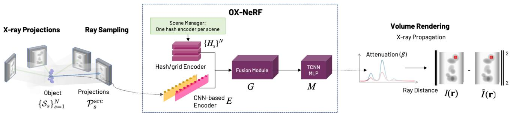
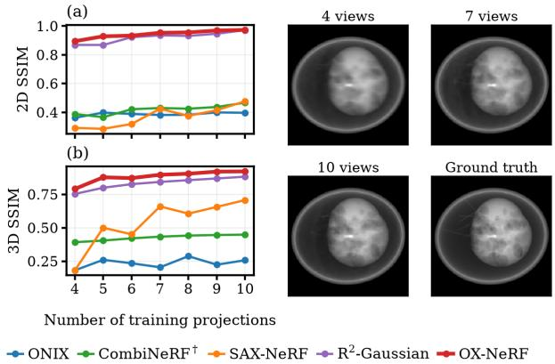
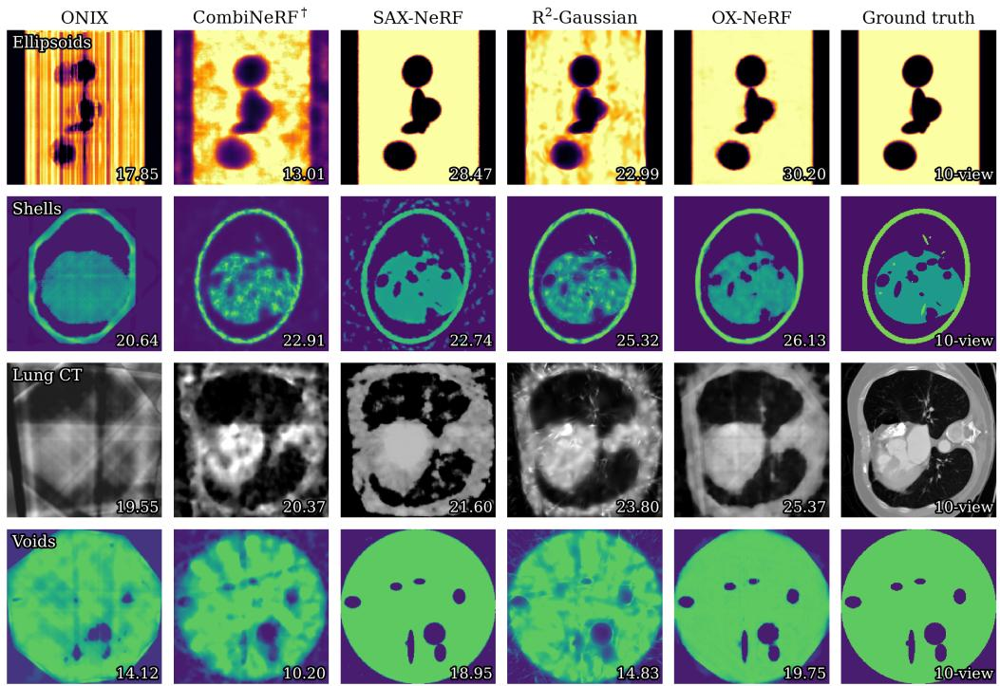

# OX-NeRF: 3D X-ray Tomography Reconstruction from Sparse Views Using Implicit Neural Representation

Thomas Welsch Department of Engineering Science University of Oxford Oxford, United Kingdom

David J. Chapman Department of Engineering Science University of Oxford Oxford, United Kingdom

Min-Hsin Tu Department of Engineering Science University of Oxford Oxford, United Kingdom

Daniel E. Eakins Department of Engineering Science University of Oxford Oxford, United Kingdom

## Abstract

NeRF and Gaussian splatting methods have been successfully applied on X-ray scenes where the views are too sparse for 3D reconstruction via classical methods. Ultrasparse scenes with 10 or fewer views such as those with high-rate or low-dose acquisition still, however, present a significant challenge. To address this problem we present a new framework, Optimised X-ray Neural Radiance Fields (OX-NeRF), that combines cross-scene feature learning with scene-specific optimisation to reconstruct sets of related scenes. OX-NeRF employs a convolutional neural network (CNN) to identify cross-scenefeatures while maintaining scene-specific multi-resolution hash grids ofspatial features. The paired representations are fused and passed to a multilayer perceptron (MLP); the CNN, hash grids and MLP are then jointly optimised end-to-end. Benchmarking on parallel-beam and cone-beam X-ray datasets shows OX-NeRFprovides significantly higher reconstruction accuracy on ultra-sparse scenes compared to existing radiance field methods.

## 1. Introduction

X-ray 3D reconstruction becomes increasingly ill-posed as the number of available projections decreases [12], and in many imaging settings that number is severely constrained. The cumulative radiation dose delivered to a subject can impose a practical limit on how many projections may be acquired [7, 21]. High-rate acquisition imposes a different limit: when the object evolves or is destroyed within microseconds, there is no opportunity to rotate it, and only the projections captured simultaneously are available [3, 36].

Both constraints can lead to an ultra-sparse regime in which a scene is observed by ten or fewer projections [36]. At this level of sparsity the null space of the inverse problem is large enough that classical reconstruction cannot be reliably applied, and alternative approaches are required [51].

We propose Optimised X-ray Neural Radiance Fields (OX-NeRF), a framework for X-ray reconstruction designed for this regime. OX-NeRF takes as input a set of related scenes and trains a single model from which any of them can be reconstructed. A shared convolutional encoder learns cross-scene features common to the set [44], which let the model resolve internal geometry that cannot be inferred from a single scene’s projections alone. At the same time a multi-resolution hash encoding [25] is learned for each scene, so that object-specific structure is stored separately rather than competing for shared capacity. The two sets of features are fused and passed to an MLP which predicts attenuation. The full pipeline is optimised by self-supervision with predicted attenuation integrated along each ray and compared against the measured projections. Once trained, the model can be queried to produce a full 3D reconstruction of any scene in the set.

We evaluate OX-NeRF on four datasets restricted to the ultra-sparse regime of ten projections or fewer. OX-NeRF achieves the highest 3D reconstruction accuracy against existing self-supervised radiance field methods on every dataset at each projection count from four to ten. This establishes it as the state of the art for ultra-sparse X-ray reconstruction.

## 2. Related Work

## 2.1. Computed Tomography

Computed tomography (CT) recovers a 3D volume from 2D projections captured at multiple angles. Classical tomographic reconstruction algorithms fall into analytical and iterative families. Analytical methods such as filtered back projection solve the Radon transform and its inverse [18, 31] and produce a volume almost instantly. The resolution they can attain is tied to the number of projections by the Crowther criterion [12], which requires roughly $\pi D / d$ evenly spaced projections to resolve features of size d in an object of diameter $D .$ Far below that count they introduce severe streak artefacts. Iterative methods [1, 19] formulate reconstruction as an optimisation problem with a regulariser such as total variation [26, 42]. They suppress artefacts at moderate sparsity but at ten projections or fewer a hand-designed regulariser is not sufficient to determine the solution [4, 13, 28]. Supervised deep learning methods replace the hand-designed regulariser with priors learned from datasets of CT volumes and use them to inpaint projections, denoise volumes or predict the reconstruction directly [11, 16, 21, 39, 43, 53]. These methods require labelled representative volumetric data to perform well which is impractical to obtain in many imaging settings.

## 2.2. Radiance fields

Radiance field methods reconstruct a scene by fitting a dif ferentiable representation of it to a set of images [35]: the representation is rendered from each camera, the rendering is compared with the image, and the representation is updated until the two agree. NeRF [23] represents the scene as a continuous function of position learned from posed images through volume rendering. Fourier feature encodings [34] let the network represent fine detail, and learnable multiresolution encodings [22, 25] together with fully fused networks [24] cut training from hours to seconds. 3D Gaussian Splatting (3DGS) [20] replaces NeRF’s implicit function with explicit Gaussian primitives that are rasterised rather than sampled along rays. Both NeRF and 3DGS have been adapted to X-ray imaging by replacing viewdependent colour with attenuation and the compositing step with a line integral. Because the rendered projection can be compared directly with the measured one, these representations enable tomographic reconstruction by self-supervised learning: the representation is optimised against the measured projections alone and no volumetric ground truth is required. Neural attenuation fields of this kind have been fitted to single scans with a range of encodings and sampling strategies [14, 47, 48, 54]. SAX-NeRF adds a line-segment transformer and structure-aware sampling to capture fine internal structure [9]. On the explicit side X-Gaussian adapts splatting to X-ray novel view synthesis [8] and $\textstyle \mathrm { \mathrm { R } } ^ { 2 } .$ -Gaussian rectifies its integration so that a tomographically consistent volume can be extracted [49]. These methods fit one scene at a time and have not been evaluated in the ultra-sparse domain.

## 2.3. Generalisable Radiance Fields

Generalisable radiance fields train a single model across many scenes so that it can reconstruct a new scene from its input views without per-scene optimisation [50]. A shared encoder extracts features from the input views, which are used either to condition a neural field [44] or to predict the parameters of Gaussian primitives directly [10]. In X-ray imaging ONIX [46, 51, 52] conditions a neural field in this way under a parallel-beam renderer and trains across a set of scenes so that the shared prior compensates for missing angular coverage. Its prior is held entirely in shared weights, which limits the capacity available to any single scene. OX-NeRF also features a cross-scene encoder but pairs it with an explicit per-scene spatial representation that is optimised for each scene in the set, so that transferable priors and scene-specific geometry are stored and updated separately.

## 3. Preliminaries

## 3.1. X-ray image formation

X-ray image formation is modelled through the standard weak-interaction approximation. The refractive index n characterises how electromagnetic radiation interacts with matter, and is written as

$$
n = 1 - \delta + i \beta ,\tag{1}
$$

where δ describes phase shift and $\beta$ describes attenuation. In the X-ray regime the refractive index is close to one, which allows a compact wave-based description of transmission through matter. Under the projection approximation [27], the exit wave can be written as

$$
\psi _ { \mathrm { e } } ( x , y ) = \psi _ { 0 } ( x , y ) \cdot \exp \left( - i k \int n ( x , y , z ) d z \right) ,\tag{2}
$$

where $\psi _ { 0 }$ and $\psi _ { \mathrm { e } }$ denote the incident and exit waves, k is the wave number, and the integration is along the propagation direction z.

A projection is the image the transmitted beam leaves on the detector. Each pixel of that image sits at the end of one ray through the scene, and by Eq. 2 the wave arriving at it has accumulated the refractive index along the whole of that ray. Taking the logarithm of the transmission at the pixel therefore gives a line integral of n along its ray, which is the relation between the 3D field and the 2D projection,

$$
I ( \mathbf { r } ) = \ln \left( \frac { \psi _ { \mathrm { e } } } { \psi _ { 0 } } \right) = - i k \int _ { t _ { n } } ^ { t _ { f } } n \left( \mathbf { r } ( t ) \right) d t \approx - i k \sum _ { j = 1 } ^ { N _ { \mathrm { s } } } n _ { j } \Delta _ { j } ,\tag{3}
$$

  
Figure 1. Overview of the OX-NeRF pipeline. $L e f t { \mathrm { : } }$ each scene is recorded by a few X-ray projections at known angles, and a batch of rays is drawn from them by the rule of Section 4.2. Centre: the scene manager activates the hash grid of the current scene, so the hash encoder reads only that scene’s table, while the shared convolutional encoder reads a pixel-aligned descriptor from the source projections; the fusion module combines the two and a fully fused head returns an attenuation value. Right: attenuation is accumulated along the ray by Eq. 3 and compared with the measurement by mean squared error. Only the hash grids are specific to a scene.

where r(t) is the ray of Eq. 4 traced between the near and far bounds $t _ { n }$ and $t _ { f }$ of a bounding volume enclosing the scene, $n _ { j }$ is the field value at the j-th of $N _ { \mathrm { s } }$ sample points, and $\Delta _ { j }$ is the spacing between adjacent samples. Unlike visiblelight imaging there is no occlusion. Every point along the ray contributes in proportion to its attenuation, so a single pixel constrains the whole line rather than a surface. The projections considered here are attenuation projections, to which only the $\beta$ term of n contributes.

Eq. 3 runs from 3D to 2D: given the attenuation $\beta$ throughout the scene, its $\beta$ term yields the attenuation projection along any ray. Reconstruction is the inverse problem. The aim is to recover the true field β at every point of the scene, of which only the measured projections are observed. Sampled on a voxel grid, that field is the 3D reconstruction.

## 3.2. Acquisition geometry

Scene and detector coordinates are related by the affine transformations of the acquisition geometry [33], so every detector pixel defines a ray

$$
\mathbf { r } ( t ) = \mathbf { r } _ { o } + t \mathbf { r } _ { d } , \quad t \in \mathbb { R } ,\tag{4}
$$

with origin $\mathbf { r } _ { o }$ and direction $\mathbf { r } _ { d } .$ . Parallel-beam and conebeam acquisitions differ only in how $\mathbf { r } _ { o }$ and $\mathbf { r } _ { d }$ follow from the recorded geometry, so one renderer serves both without any change to the model. The same transformations can be run in reverse to map a 3D point x to its position $\pi _ { p } ( \mathbf { x } )$ on the detector of any projection $p .$

## 4. Method

## 4.1. Pipeline

The OX-NeRF pipeline, visualised in Figure 1, comprises a convolutional encoder, multi-resolution hash encodings [25], a fusion module and an MLP prediction head. The pipeline takes as input a set of related scenes recorded under a common acquisition setting. Each scene is a number of X-ray projections captured at known angles. The pipeline’s output is a single trained model from which the full attenuation volume of any scene in the set can be reconstructed. The key design choice is the split between shared and perscene components: the encoder, fusion module and MLP learn features that pertain to the whole set, while a hash encoding learns to capture scene-specific features.

Algorithm 1: OX-NeRF Training Loop   
Input: scenes $\{ \mathcal { S } _ { s } \} _ { s = 1 } ^ { N }$ with source projections $\mathcal { P } _ { s } ^ { \mathrm { s r c } }$   
and target projections $\mathcal { P } _ { s } ^ { \mathrm { t g t } }$   
1 initialise the encoder $E _ { \mathrm { { : } } }$ fusion module $G ,$   
prediction head $M$ , and per-scene hash-grid   
encodings $\{ H _ { s } \} _ { s = 1 } ^ { N } ;$   
2 for epoch ← 1 to $N _ { \mathrm { e p } }$ do   
3 if epoch ≡ 1 (mod $\tau )$ then   
4 re-render $\mathcal { P } ^ { \mathrm { t g t } }$ of the next B scenes, cache   
$R \gets | \hat { I } - I | ; / I$ Sec. 4.2   
5 for scene s in shufled order do   
6 $\{ F _ { p } \} _ { p \in \mathcal { P } _ { s } ^ { \mathrm { s r c } } }  E ( \mathcal { P } _ { s } ^ { \mathrm { s r c } } )$ ; // encode   
7 draw rays from ${ \mathcal { P } } _ { s } ^ { \mathrm { t g t } } ,$ Pr ∝ R + floor;   
// Eq. 5   
8 stratified sample x along each ray; // Eq. 4   
9 foreach x, $p \in \mathcal { P } _ { s } ^ { \mathrm { s r c } }$ do   
10 $\big \lfloor \beta _ { p } \gets \hat { M } \big ( G \big [ \check { F } _ { p } ( \pi _ { p } ( \mathbf { x } ) ) , H _ { s } ( \mathbf { x } ) \big ] \big )$   
11 $\beta ( \mathbf { x } ) \gets \sum _ { p } w _ { p } \beta _ { p } ; / /$ Sec. 4.4   
12 ˆI ← integrate $\beta$ along each ray; // Eq. 3   
13 $\mathcal { L } \gets \mathrm { M S E } ( \hat { I } , I )$ , update E, G, M, H ;

OX-NeRF’s training loop is described in Algorithm 1. Each scene s contributes two subsets drawn from its projections: the source projections $\mathcal { P } _ { s } ^ { \mathrm { s r c } }$ , which the convolutional encoder turns into feature maps, and the target projections $\mathcal { P } _ { s } ^ { \mathrm { t g t } }$ , whose measured pixels the loss is computed against.

We write $p$ for a single source projection and $P = | \mathcal { P } _ { s } ^ { \mathrm { s r c } } |$ for how many there are, the same count in every scene. One iteration operates on a single scene and one epoch covers every scene in the set. In an iteration, rays are cast from the pixels of the target projections using a residual-guided strategy: the target projections are periodically re-rendered, and rays are drawn preferentially where the rendered and measured pixels disagree. 3D Points are obtained by stratified sampling along each ray where it crosses a fixed bounding volume shared by every scene in the set [23]. Each point x is then described twice: by the feature map $F _ { p }$ of each source projection $p ,$ read at the 2D position $\pi _ { p } ( \mathbf { x } )$ where x lands on that projection, and by the scene’s hash encoding $H _ { s }$ , queried at the 3D coordinates of x. The two descriptions are fused per source projection and mapped to an attenuation value by the MLP, and geometry-aware weighting then combines the per-projection values into the point’s attenuation. Integrating the attenuation along each ray by Eq. 3 renders the pixel, and the mean squared error against the measured target pixels forms the loss.

The loss is backpropagated at every iteration to keep each update scene-specific: gradients from one scene’s loss reach the shared components and that scene’s hash encoding, and never touch another scene’s. The scene manager keeps every hash encoding resident in GPU memory and routes each query to the active scene’s encoding, so the perscene binding costs no transfers. Over an epoch the shared components accumulate updates from every scene in the set, while each hash encoding is shaped only by feedback from its corresponding scene.

## 4.2. Ray Sampling

Each training iteration renders only a small batch of rays, so where those rays land matters. OX-NeRF selects them using the residual between rendered and measured projections, which indicates where the model is currently weak. Each target projection keeps an error map R, the cached absolute difference between its rendered and measured pixels, and rays are drawn preferentially where R is large. The maps are rebuilt from the model as it trains, so the sampling follows the model’s weaknesses as they move: a region that is repaired stops attracting rays, and the budget shifts to whatever the model still gets wrong.

The ray budget of an iteration is divided evenly across the target projections of the active scene, so no single angle dominates an update. Within each projection, rays are drawn from

$$
\chi ( i ) = ( 1 - \varepsilon ) \frac { R _ { i } ^ { \alpha } } { \sum _ { i ^ { \prime } = 1 } ^ { N _ { \mathrm { p i x } } } R _ { i ^ { \prime } } ^ { \alpha } } + \varepsilon \frac { 1 } { N _ { \mathrm { p i x } } } ,\tag{5}
$$

where $R _ { i }$ is the cached error at pixel $i , i ^ { \prime }$ runs over all $N _ { \mathrm { p i x } }$ pixels of that same projection, and the denominator is what makes the scores a distribution. The exponent α sets how sharply the first term concentrates on the largest errors, with $\alpha = 1$ making the probability proportional to the error. The uniform term receives a fraction ε of the budget and keeps supervision flowing to regions the model currently renders well, so they cannot drift between refreshes.

Rebuilding every error map at every step would dominate the cost of training. Because of this we instead employ a refresh schedule as seen on lines 3 and 4 of Algorithm 1: every τ epochs the next B scenes in a fixed cyclic order have their target projections re-rendered and their maps replaced. Between refreshes a scene keeps its most recent maps, and a scene the cycle has not yet reached draws its rays uniformly.

## 4.3. Feature Extraction and Fusion

Feature extraction is performed on a per-set and per-scene basis, using a convolutional encoder and hash-grid encodings respectively. The convolutional encoder is a ResNet-34 [17] truncated after three stages. The three feature maps are resized to a common resolution and stacked, so every pixel position carries both fine and coarse context. The stacked map of projection $p$ is its feature map $F _ { p } ,$ read at $\pi _ { p } ( \mathbf { x } )$ by bilinear interpolation [44], which gives one image feature vector $\mathbf { c } _ { p } = F _ { p } ( \pi _ { p } ( \mathbf { x } ) )$ per source projection. Every scene in the set has its own hash-grid encoding, which stores trainable feature vectors in tables at several grid resolutions [25]. The active scene’s encoding $H _ { s }$ is queried at the point’s 3D coordinates by interpolating the features of the surrounding grid vertices at each resolution, and the resolutions are concatenated into the vector h $\mathbf { \xi } = H _ { s } ( \mathbf { x } )$

The convolutional encoder is trained by every scene in the set, and conditioning the model on its image features allows it to learn geometric priors common to the whole set [44]. The hash-grid encoding serves one scene alone, so h holds that scene’s fine spatial detail in trainable features rather than network weights, buying capacity and resolution at the cost of per-scene memory [25]. These two descriptions must be fused before prediction. The fusion module G concatenates them and applies one learned linear map,

$$
\begin{array} { r } { { \bf z } _ { p } = G \left[ { \bf c } _ { p } ; { \bf h } \right] , } \end{array}\tag{6}
$$

producing a fused vector of fixed width 128 for each source projection.

## 4.4. Attenuation Prediction and Aggregation

The prediction head is a fully fused MLP of four layers with 128 neurons per layer [24]. It runs once per source projection, so each point receives $P$ candidate attenuation values $\beta _ { p }$ . Rendering needs a single value, and the candidates are not equally trustworthy: a point can land outside a projection or near its edge, where the interpolated features are unreliable. The candidates are therefore combined by a weighted average in which the model learns how much each projection should count. A small linear layer reads $\mathbf { z } _ { p }$ together with two geometric quantities, a flag marking whether the point lands inside projection $p$ and the distance of the landing position from the projection’s centre. A softmax across the P resulting scores gives the weights, and the point’s attenuation is the weighted sum,

$$
\beta = \sum _ { p = 1 } ^ { P } w _ { p } \beta _ { p } , \qquad \sum _ { p = 1 } ^ { P } w _ { p } = 1 .\tag{7}
$$

Multi-view consistency is enforced by construction. Every projection is rendered from the same aggregated field, and each update scores all of a scene’s target projections at once, so no angle can be fitted at the expense of another.

## 5. Results

## 5.1. Datasets

Results were obtained on four datasets: two established and two developed for this comparison. Ellipsoids is the synthetic parallel-beam dataset created by the ONIX authors [51]. It contains scenes of randomly placed ellipsoids recorded at ten fixed angles over 0–180°. Lung CT is drawn from LIDC-IDRI [2], with cone-beam projections generated from the Computed Tomography (CT) volumes using TIGRE [5].

The Shells and Voids datasets are introduced by this work. Shells is a synthetic parallel-beam dataset whose scenes enclose a lobed interior of voids and membranes with far finer structure than Ellipsoids. Voids is a synthetic cone-beam dataset of volumes containing many small voids.

Lung CT, Shells and Voids each have a corresponding generator program that can produce projections at any arbitrary angle from 0–180°. Ellipsoids is limited to its ten fixed projections evenly spaced over 0–180°. Full specifications for how the datasets were generated are given in the supplementary material.

## 5.2. Implementation and Baseline Methods

OX-NeRF is programmed in Python [37] and uses the Py-Torch library [29]. The convolutional encoder used is the ImageNet pretrained ResNet-34 from torchvision [17] while the hash encoding and the fully fused head are from tiny-cuda-nn [24, 25].

OX-NeRF is compared against four baseline methods that represent the state of the art for X-ray 3D reconstruction. Each is self-supervised and learns from projections alone with no volumetric labels. ONIX [51] is the closest relative of OX-NeRF. It has a pixel-aligned neural field conditioned on source projections and trained across scenes. SAX-NeRF [9] fits one scene at a time with a linesegment transformer and structure-aware sampling. $\mathrm { \mathbf { R } } ^ { 2 } \mathrm { - }$ Gaussian [49] represents the volume as an explicit set of Gaussians under a rectified radiative model that keeps the reconstruction tomographically consistent. CombiNeRF [6] is a single-scene NeRF that combines several regularisers for few-shot view synthesis. Two of the four methods required modification before being compared. CombiNeRF was built for RGB scenes, so its renderer needed to be replaced by the X-ray transmission model of Eq. 3. ONIX, meanwhile, needed to be extended to support datasets with a cone-beam geometry.

Table 1. Hyperparameters. One recipe is used for all datasets. P is the number of source projections; τ and B are the residual-map refresh period and scene count of Section 4.2; T is the hash table size.
<table><tr><td>Component</td><td>Setting</td></tr><tr><td>Hash grid</td><td>Per-scene table; 16 levels; 8 features per level; base resolution 16, growth factor  $1 . 5 ; \mathrm { l o g } _ { 2 } T =$ </td></tr><tr><td>Image encoder</td><td>12 ResNet-34, first three stages; ImageNet initiali- sation;  $P = 4$  source projections</td></tr><tr><td>Rays</td><td>2048 rays per iteration; 320 points sampled per</td></tr><tr><td>Residual sampling</td><td>ray  $\alpha = 1 ; \varepsilon = 0 .$  25; refresh every τ = 5 epochs over B = 8 scenes</td></tr><tr><td>Optimisation</td><td>20 000 iterations; Adam, 1  $| \mathbf { r } 5 \times 1 0 ^ { - 4 } ( 2 . 5 \times 1 0 ^ { - 4 } $  for fusion); momentum 0.9, 0.99 [25]</td></tr></table>

Every method was trained and evaluated on one NVIDIA RTX Pro 6000 GPU. OX-NeRF used the hyperparameters in Table 1 with any values not listed there following the defaults of [25]. The other methods were trained using their published default settings. ONIX and OX-NeRF used 50 scenes per dataset for training unless otherwise stated. All other methods were trained on individual scenes. ONIX and OX-NeRF both condition on source projections, and in every setting each was given the same four, evenly spaced across the angular range. Their target projections were all of the projections available in that setting.

## 5.3. Evaluation Setup

OX-NeRF and the baseline methods were evaluated on two tasks: novel view synthesis and 3D reconstruction. Novel view synthesis (NVS) asks the model to render a projection at a held-out angle and scores it against the measured projection at that angle using 2D SSIM [40]. 3D reconstruction asks the model for the full attenuation volume on a voxel grid and scores it against the reference volume using 3D PSNR and 3D SSIM as defined by $\mathbf { R } ^ { 2 } .$ -Gaussian [49]. The same metric definitions are applied to every method rather than each method’s own evaluation script. Because each method measures length in its own unit, every reconstructed volume is the true volume up to one positive constant, which a single least-squares gain removes before scoring. Full definitions of metrics and methodology are provided in the supplementary material.

Table 2 reports both tasks at three view budgets per dataset. Ellipsoids is tested up to nine views because at least one of its ten fixed angles must be held out. On the other three datasets the 2D SSIM is averaged over five held-out angles.

Table 2. Novel view synthesis and 3D reconstruction. NVS reports 2D SSIM on held-out projections; 3D reports PSNR and SSIM of the reconstructed volume against the reference. Best in red bold, second best underlined. 2D PSNR for every cell is in the supplementary material.
<table><tr><td rowspan="3"></td><td rowspan="3"></td><td rowspan="2">NVS</td><td colspan="2">ONIX [51]</td><td rowspan="2"></td><td colspan="3">CombiNeRF [6]</td><td colspan="2">SAX-NeRF [9]</td><td rowspan="2"></td><td colspan="2">R²-Gaussian [49]</td><td rowspan="2"></td><td colspan="3">OX-NeRF</td></tr><tr><td colspan="2">3D</td><td rowspan="2">NVS</td><td colspan="2">3D</td><td colspan="2">NVS</td><td colspan="2">3D NVS</td><td colspan="2">3D</td><td colspan="2">NVS 3D</td></tr><tr><td>PSNR</td><td></td><td>SSIM SSIM</td><td>PSNR</td><td>SSIM</td><td>SSIM</td><td>PSNR</td><td>SSIM</td><td>SSIM</td><td>PSNR</td><td>SSIM</td><td>SSIM</td><td>PSNR</td><td>SSIM</td></tr><tr><td rowspan="3">Ellipsoids</td><td>4</td><td>0.7466</td><td>17.33</td><td>0.3331</td><td></td><td>0.6494</td><td>12.14</td><td>0.2434</td><td>0.6406</td><td>12.36</td><td>0.7037</td><td>0.8069</td><td>16.40</td><td>0.6725</td><td>0.8893</td><td>19.28</td><td>0.8406</td></tr><tr><td>7</td><td>0.7843</td><td>20.45</td><td>0.3161</td><td></td><td>0.6247</td><td>12.38</td><td>0.2508</td><td>0.9394</td><td>27.31</td><td>0.9415</td><td>0.8364</td><td>19.16</td><td>0.7279</td><td>0.9915</td><td>27.89</td><td>0.9566</td></tr><tr><td>9</td><td>0.8098</td><td>20.21</td><td>0.2518</td><td></td><td>0.7360</td><td>13.01</td><td>0.2555</td><td>0.9620</td><td>28.84</td><td>0.9464</td><td>0.9996</td><td>22.67</td><td>0.7719</td><td>0.9966</td><td>28.55</td><td>0.9613</td></tr><tr><td rowspan="3">Shells</td><td>4</td><td>0.3621</td><td>17.12</td><td>0.1822</td><td>0.3883</td><td></td><td>18.31</td><td>0.3921</td><td>0.2916</td><td>16.98</td><td>0.1816</td><td>0.8689</td><td>18.87</td><td>0.7533</td><td></td><td></td><td>0.7912</td></tr><tr><td>7</td><td>0.3815</td><td>20.30</td><td>0.2046</td><td>0.4299</td><td></td><td>21.59</td><td>0.4339</td><td>0.4249</td><td>20.06</td><td>0.6601</td><td>0.9353</td><td>23.21</td><td>0.8435</td><td>0.8947 0.9534</td><td>20.77 24.45</td><td>0.8969</td></tr><tr><td>10</td><td>0.3966</td><td>20.64</td><td>0.2576</td><td>0.4669</td><td></td><td>22.91</td><td>0.4488</td><td>0.4767</td><td>22.74</td><td>0.7076</td><td>0.9718</td><td>25.32</td><td>0.8824</td><td>0.9738</td><td>26.13</td><td>0.9220</td></tr><tr><td rowspan="3">Lung CT</td><td>4</td><td>0.8794</td><td>19.18</td><td>0.5416</td><td>0.8995</td><td></td><td>18.45</td><td>0.5417</td><td>0.9044</td><td>18.82</td><td>0.5657</td><td>0.9205</td><td>20.18</td><td>0.5507</td><td>0.9399</td><td>21.58</td><td>0.6235</td></tr><tr><td>7</td><td>0.9192</td><td>19.71</td><td>0.5583</td><td>0.9004</td><td></td><td>19.32</td><td>0.5404</td><td>0.9272</td><td>20.75</td><td>0.6050</td><td>0.9346</td><td>22.36</td><td>0.6024</td><td>0.9525</td><td>23.77</td><td>0.6769</td></tr><tr><td>10</td><td>0.9153</td><td>19.55</td><td>0.5478</td><td>0.9150</td><td>20.37</td><td></td><td>0.5510</td><td>0.9451</td><td>21.60</td><td>0.5694</td><td>0.9617</td><td>23.80</td><td>0.6423</td><td>0.9667</td><td>25.37</td><td>0.7102</td></tr><tr><td rowspan="3">Voids</td><td>4</td><td>0.9537</td><td>13.00</td><td>0.5004</td><td>0.9271</td><td></td><td>9.22</td><td>0.3341</td><td>0.9535</td><td>12.54</td><td>0.5583</td><td>0.9465</td><td>11.83</td><td>0.3471</td><td>0.9579</td><td>13.71</td><td>0.5938</td></tr><tr><td>7</td><td>0.9438</td><td>13.73</td><td>0.6181</td><td>0.9338</td><td></td><td>9.52</td><td>0.3483</td><td>0.9789</td><td>18.26</td><td>0.8132</td><td>0.9606</td><td>13.82</td><td>0.3751</td><td>0.9853</td><td>19.61</td><td>0.8434</td></tr><tr><td>10</td><td>0.9545</td><td>14.12</td><td>0.5438</td><td>0.9451</td><td>10.20</td><td></td><td>0.3621</td><td>0.9814</td><td>18.95</td><td>0.8552</td><td>0.9721</td><td>14.83</td><td>0.4025</td><td>0.9863</td><td>19.75</td><td>0.8677</td></tr></table>

  
Figure 2. Effect of the number of training projections on the Shells dataset. (a) held-out 2D SSIM and (b) 3D SSIM as the budget increases from four to ten projections. (c) OX-NeRF’s prediction of one held-out projection at three budgets on Shells dataset with the measurement for reference.

## 5.4. Novel View Synthesis and 3D Reconstruction

OX-NeRF renders the most faithful held-out projections in eleven of the twelve settings described in Table 2. The separation is clearest in the settings with fewer views. Figure 2 traces the evolution from four to ten views. As the number of views increases the reconstruction quality of every method improves, as expected, and the advantage of OX-NeRF in NVS becomes less pronounced. By ten views the advantage is marginal and nearly every method renders excellent projections. A rendered projection can, however, agree closely with its measurement without the volume behind it being correct.

On the reconstructed volumes the advantage of OX-NeRF is unambiguous. It achieves the highest 3D SSIM in every setting and the highest 3D PSNR in all but one. The gap between the two tasks is easiest to see at ten views, where the 2D SSIM scores of most methods were high and close together. Figure 3 visualises a slice through the reconstructed volume of each method at that budget. The baseline methods capture the coarse structure but have significant artefacts. These include streaks aligned with the projection directions, a signature of too few angles, and a diffuse haze that fills regions that should be empty. The OX-NeRF reconstructions demonstrate finer detail and have significantly fewer artefacts.

## 5.5. Ablation

Three design choices define OX-NeRF: the per-scene hash grid, the convolutional encoder and residual-guided ray selection. Panel (a) of Table 3 demonstrates the effect of these choices using the Ellipsoids dataset at six training views. The hash grid is compared against the fixed sinusoidal positional encoding of NeRF [23, 34], which maps each coordinate through sines and cosines of increasing frequency and is the standard point encoder that the hash grid was introduced to supersede. The convolutional encoder is compared against its absence, which reduces the model to a perscene neural field with no information from the other scenes in the set. Residual-guided selection is compared against gradient-guided selection [15, 32], which scores each pixel once by its Sobel image gradient and draws rays in proportion. The gradient approach is a natural alternative as both selection methods try to concentrate rays where information is expected to be heuristically.

The convolutional encoder improves on either point en-

  
Figure 3. Qualitative 3D reconstruction at ten training views. Each panel is rendered from the reconstructed volume under an identica display window taken from the ground truth, so panels are directly comparable; the inset number is 3D PSNR in dB.

Table 3. Ablations on Ellipsoids at six target projections. Panel (a) is a full factorial over the point encoder (sinusoidal or hash grid), the convolutional image encoder (present or absent) and the ray-selection rule (∇ gradient-guided, R residual-guided). Panels (b) and (c) use the full model and vary the number of scenes in the set and the hash table size T. All runs share one recipe and one held-out view. Metrics are held-out 2D SSIM and 3D SSIM. Best in bold, second best underlined.

(a) Model components
<table><tr><td>Rays</td><td>Point encoder</td><td>Image encoder</td><td>2D SSIM</td><td>3D SSIM</td></tr><tr><td>∇</td><td>Sinusoidal</td><td></td><td>0.6481</td><td>0.3576</td></tr><tr><td>R</td><td>Sinusoidal</td><td></td><td>0.8011</td><td>0.4431</td></tr><tr><td>∇</td><td>Sinusoidal</td><td>√</td><td>0.8745</td><td>0.7913</td></tr><tr><td>R</td><td>Sinusoidal</td><td>√</td><td>0.9141</td><td>0.8135</td></tr><tr><td>∇</td><td>Hash grid</td><td></td><td>0.6521</td><td>0.2797</td></tr><tr><td>R</td><td>Hash grid</td><td></td><td>0.9553</td><td>0.6414</td></tr><tr><td>∇</td><td>Hash grid</td><td>√</td><td>0.9450</td><td>0.8906</td></tr><tr><td>R</td><td>Hash grid</td><td>√</td><td>0.9858</td><td>0.9542</td></tr><tr><td colspan="3">(b) Training scenes</td><td colspan="2">(c) Hash capacity</td></tr><tr><td>Scenes</td><td>2D SSIM</td><td>3D SSIM</td><td> $\log _ { 2 } T$ </td><td>2D SSIM</td><td>3D SSIM</td></tr><tr><td>25</td><td>0.9569</td><td>0.9063</td><td>10</td><td>0.9539</td><td>0.8784</td></tr><tr><td>50</td><td>0.9794</td><td>0.9450</td><td>12</td><td>0.9678</td><td>0.9062</td></tr><tr><td>75</td><td>0.9828</td><td>0.9446</td><td>14</td><td>0.9823</td><td>0.9418</td></tr><tr><td>100</td><td>0.9859</td><td>0.9455</td><td>16</td><td>0.9781</td><td>0.9420</td></tr></table>

coder alone, and paired with the hash grid gives the best configuration by a wide margin. The hash grid outperforms the sinusoidal encoding in every configuration but one: with gradient-guided rays and no encoder it gives the weakest 3D

SSIM in the panel, since without a prior or error feedback its additional capacity has nothing to constrain it. Residualguided selection improves 3D SSIM in every configuration, and its effect is largest on that same unconstrained hash grid. The gradient rule scores the measurements rather than the model, so it keeps sending rays to edges that are already reconstructed, whereas the residual rule follows the error as it moves. Taken together, the cross-scene encoder and the per-scene hash grid account for most of the improvement and are strongest in combination, with residual sampling providing a further boost.

Panels (b) and (c) of Table 3 vary the number of scenes in the set and the hash table size to test whether the shared prior benefits from more scenes and the per-scene representation from more capacity. Reconstruction quality rises sharply as scenes are added up to 50 and more gradually beyond, and it rises with table size at every step up to log T = 14 before levelling off. The trade-off is GPU memory. Every scene keeps its own hash table resident throughout training. Since each increment of $\log _ { 2 } T$ doubles the size of every table the memory consumed by the hash grids scales with the product of the two. Notably, the defaults of 50 scenes and log T = 12 are not the strongest settings in the ablation. It is instead the largest that this memory trade-off allows on every dataset with Lung CT being the limiting factor.

Table 4. High-view Lung CT stress test. The dense Lung CT scene uses the same cone geometry as Table 2 but extends the training budget to 15, 20 and 25 projections. Columns report 3D reconstruction scores as in Table 2. Best in red bold.
<table><tr><td colspan="2">OX-NeRF</td><td colspan="2">R²-Gaussian</td></tr><tr><td>Views</td><td>3D PSNR 3D SSIM</td><td>3D PSNR</td><td>3D SSIM</td></tr><tr><td>15</td><td>26.47</td><td>0.7442</td><td>25.65 0.6984</td></tr><tr><td>20</td><td>27.04 0.7493</td><td>26.97</td><td>0.7500</td></tr><tr><td>25</td><td>27.14 0.7537</td><td>27.91</td><td>0.7871</td></tr></table>

## 5.6. Increasing Views

OX-NeRF is designed for the ultra-sparse domain. It can be applied to more than ten views but as the number of views increases both theoretical and technical issues arise. The convolutional encoder accounts for a significant portion of the compute budget supplying a prior between angles. The value of that prior, however, falls as the gaps between angles close. Lung CT, the hardest of the four datasets, makes a useful test case. Table 4 extends the comparison against R2-Gaussian, the strongest baseline, to 15, 20 and 25 views. OX-NeRF still leads at 15. At 20 the two methods are on par, and by 25 R2-Gaussian has clearly overtaken. The crossover matches the two designs: R2-Gaussian spends its compute on rendering more rays and as views are added that becomes a better strategy. The OX-NeRF results could likely be improved by increasing the number of rays per iteration, the number of scenes in the set, the hash table size or the number of source projections. Each of these costs memory, however, and with the chosen experimental settings OX-NeRF already peaks at over 90 GB of VRAM.

## 6. Conclusions

OX-NeRF combines a prior learned across a set of scenes with a spatial representation owned by each scene. In the ultra-sparse domain of ten projections or fewer, it demonstrates a significant improvement in 3D reconstruction accuracy over existing self-supervised methods. The result holds on parallel-beam and cone-beam data alike.

There are several potential changes to be investigated that could improve reconstruction accuracy. The most immediate follows from the ablation: the number of scenes and the hash table size both raise reconstruction quality and both were capped by memory, so whether the gains continue on more capable hardware is an open question. Domainspecific priors are another possibility, since building known anatomical structure into a reconstruction has proven effective [45] and the shared components of OX-NeRF could in principle host priors of that kind. Cross-scene Gaussian splatting for X-ray is another route to explore. Cross-scene priors for splatting exist in visible-light imaging [10] and splatting is already established for tomographic reconstruction [49], but the combination has not yet been attempted.

The most exciting future direction is extending OX-NeRF into the time domain so it can be applied to highrate acquisition. The ultra-sparse regime arises in this setting by necessity as a source that captures a transient event in a single shot can record only as many projections as it has simultaneous views. One example is X-ray multiprojection imaging at synchrotrons and free-electron lasers, which records a handful of projections per frame at kilohertz to megahertz frame rates [3, 30, 36, 38, 41]. Every frame shares one acquisition and one geometry. The problem reframes naturally: the input changes from a set to a temporally ordered sequence, and nothing else in the formulation has to change. Further, a sequence could provide useful temporal regularisation given that geometry which is ambiguous in one frame of the sequence could be resolved in another as the objects within it move. Time-resolved reconstruction of simple scenes from sparse projections has already been shown to be feasible [46, 52]. The aim is to build on this and use OX-NeRF to reconstruct more complex scenes that demonstrate high-rate phenomena.

## Acknowledgements

We thank Daniel Mosko for discussions on the ONIXˇ method, Yi-chen Ju for ideas on the fusion scheme, and Yuhe Zhang for sharing the ellipsoids dataset. This work was supported by the United States Air Force Office of Scientific Research under award number FA8655-24-1-7353, and by the EPSRC and First Light Fusion under the AM-PLIFI Prosperity Partnership (EP/X025373/1), funding the NVIDIA Blackwell GPU used in this research. Any opinions, findings, and conclusions or recommendations expressed in this material are those of the author(s) and do not necessarily reflect the views of the United States Air Force.

## References

[1] Anders H Andersen and Avinash C Kak. Simultaneous Algebraic Reconstruction Technique (SART): A superior implementation of the ART algorithm. Ultrasonic Imaging, 6 (1):81–94, 1984.

[2] Samuel G. Armato, Geoffrey McLennan, Luc Bidaut, Michael F. McNitt-Gray, Charles R. Meyer, Anthony P. Reeves, Binsheng Zhao, Denise R. Aberle, Claudia I. Henschke, Eric A. Hoffman, et al. The Lung Image Database Consortium (LIDC) and Image Database Resource Initiative (IDRI): A Completed Reference Database of Lung Nodules on CT Scans. Medical Physics, 38(2):915–931, 2011.

[3] Eleni Myrto Asimakopoulou, Valerio Bellucci, Sarlota Birnsteinova, Zisheng Yao, Yuhe Zhang, Ilia Petrov, Carsten Deiter, Andrea Mazzolari, Marco Romagnoni, Dusan Korytar, Zdenko Zaprazny, Zuzana Kuglerova, Libor Juha, Bratislav Lukic, Alexander Rack, Liubov Samoylova, Fran-´ cisco Garcia-Moreno, Stephen A. Hall, Tillmann Neu, Xiaoyu Liang, Patrik Vagovic, and Pablo Villanueva-Perez. Development towards high-resolution kHz-speed rotationfree volumetric imaging. Optics Express, 32(3):4413–4426, 2024.

[4] Semih Barutcu, Selin Aslan, Aggelos K. Katsaggelos, and Doga G˘ ursoy. Limited-angle computed tomography with¨ deep image and physics priors. Scientific Reports, 11(1):1– 12, 2021.

[5] Ander Biguri, Manjit Dosanjh, Steven Hancock, and Manuchehr Soleimani. TIGRE: a MATLAB-GPU toolbox for CBCT image reconstruction. Biomedical Physics & Engineering Express, 2(5):055010, 2016.

[6] Matteo Bonotto, Luigi Sarrocco, Daniele Evangelista, Marco Imperoli, and Alberto Pretto. CombiNeRF: A Combination of Regularization Techniques for Few-Shot Neural Radiance Field View Synthesis. In Proceedings of the International Conference on 3D Vision (3DV), 2024.

[7] David J. Brenner and Eric J. Hall. Computed Tomography — An Increasing Source of Radiation Exposure. New England Journal ofMedicine, 357(22):2277–2284, 2007.

[8] Yuanhao Cai, Yixun Liang, Jiahao Wang, Angtian Wang, Yulun Zhang, Xiaokang Yang, Zongwei Zhou, and Alan Yuille. Radiative Gaussian Splatting for Efficient X-Ray Novel View Synthesis. In European Conference on Computer Vision, pages 283–299. Springer Science and Business Media, 2024.

[9] Yuanhao Cai, Jiahao Wang, Alan Yuille, Zongwei Zhou, and Angtian Wang. Structure-Aware Sparse-View X-ray 3D Reconstruction. In Proceedings of the IEEE/CVF Conference on Computer Vision and Pattern Recognition (CVPR), pages 11174–11183, 2024.

[10] David Charatan, Sizhe Lester Li, Andrea Tagliasacchi, and Vincent Sitzmann. pixelSplat: 3D Gaussian Splats from Image Pairs for Scalable Generalizable 3D Reconstruction. In Proceedings of the IEEE/CVF Conference on Computer Vision and Pattern Recognition (CVPR), pages 19457–19467, 2024.

[11] Abril Corona-Figueroa, Jonathan Frawley, Sam Bond Taylor, Sarath Bethapudi, Hubert P.H. Shum, and Chris G. Will-

cocks. MedNeRF: Medical Neural Radiance Fields for Reconstructing 3D-aware CT-Projections from a Single X-ray. In Proceedings ofthe Annual International Conference ofthe IEEE Engineering in Medicine and Biology Society, EMBS, pages 3843–3848. Institute of Electrical and Electronics Engineers Inc., 2022.

[12] R. A. Crowther, D. J. DeRosier, and A. Klung. The recon struction of a three-dimensional structure from projections and its application to electron microscopy. In Proceedings of the Royal Society of London. A. Mathematical and Physical Sciences, pages 319–340. The Royal Society London, 1970.

[13] Heinz W. Engl and Ronny Ramlau. Regularization of Inverse Problems, 2015.

[14] Yanping Fu, Hao Geng, Zhuangzhuang Zhao, Shaojie Zhang, and Haifeng Zhao. Sparse-View X-ray 3D Recon struction using Hybrid Representation Neural Attenuation Fields. In 2025 IEEE International Conference on Acoustics, Speech and Signal Processing (ICASSP), pages 1–5, Hyder abad, India, 2025. Institute of Electrical and Electronics En gineers (IEEE).

[15] Wenshuo Gao, Lei Yang, Xiaoguang Zhang, and Huizhong Liu. An improved Sobel edge detection. In 2010 3rd IEEE International Conference on Computer Science and Informa tion Technology, pages 67–71, 2010.

[16] Rui Guo, Johannes Stubbe, Yuhe Zhang, Christian Matthias Schleputz, Camilo Rojas Gomez, Mahoor Mehdikhani,¨ Christian Breite, Yentl Swolfs, and Pablo Villanueva-Perez. Deep-learning image enhancement and fibre segmenta tion from time-resolved computed tomography of fibrereinforced composites. Composites Science and Technology, 244:110278, 2023.

[17] Kaiming He, Xiangyu Zhang, Shaoqing Ren, and Jian Sun. Deep Residual Learning for Image Recognition. In Proceed ings of the IEEE conference on computer vision and pattern recognition, pages 770–778, 2016.

[18] Avinash C. Kak and Malcolm Slaney. Principles of com puterized tomographic imaging. Society for Industrial and Applied Mathematics, 2001.

[19] Stefan Karczmarz. Angenaherte Auflosung von systemen linearer Gleichungen. Bulletin International de l’Acad´emie Polonaise des Sciences et des Lettres, 1937.

[20] Bernhard Kerbl, Georgios Kopanas, Thomas Leimkuhler,¨ and George Drettakis. 3D Gaussian Splatting for Real-Time Radiance Field Rendering. ACM Transactions on Graphics, 42(4):139, 2023.

[21] Maximilian B Kiss, Ander Biguri, Zakhar Shumaylov, Ferdia Sherry, K Joost Batenburg, Carola-Bibiane Schonlieb,¨ Sch¨ Schonlieb, and Felix Lucka. Benchmarking learned¨ algorithms for computed tomography image reconstruction tasks. Applied Mathematics for Modern Challenges, 3(0): 1–43, 2024.

[22] Julien N.P. Martel, David B. Lindell, Connor Z. Lin, Eric R. Chan, Marco Monteiro, and Gordon Wetzstein. ACORN: Adaptive Coordinate Networks for Neural Scene Represen tation. ACM Transactions on Graphics, 40(4), 2021.

[23] Ben Mildenhall, Pratul P. Srinivasan, Matthew Tancik, Jonathan T. Barron, Ravi Ramamoorthi, and Ren Ng. NeRF:

representing scenes as neural radiance fields for view synthesis. Communications ofthe ACM, 65(1):99–106, 2021.

[24] Thomas Muller, Fabrice Rousselle, Jan Nov¨ ak, and Alexan-´ der Keller. Real-time Neural Radiance Caching for Path Tracing. ACM Transactions on Graphics, 40(4):36, 2021.

[25] Thomas Muller, Alex Evans, Christoph Schied, and Alexan-¨ der Keller. Instant neural graphics primitives with a multiresolution hash encoding. ACM Transactions on Graphics, 41 (4):102, 2022.

[26] Shanzhou Niu, Yang Gao, Zhaoying Bian, Jing Huang, Wufan Chen, Gaohang Yu, Zhengrong Liang, and Jianhua Ma. Sparse-view x-ray CT reconstruction via total generalized variation regularization. Physics in Medicine & Biology, 59 (12):2997, 2014.

[27] D Paganin. Coherent X-ray Optics. Oxford University Press, 2006.

[28] Xiaochuan Pan, Emil Y. Sidky, and Michael Vannier. Why do commercial CT scanners still employ traditional, filtered back-projection for image reconstruction? Inverse Problems, 25(12):123009, 2009.

[29] Adam Paszke, Sam Gross, Francisco Massa, Adam Lerer, James Bradbury, Gregory Chanan, Trevor Killeen, Zeming Lin, Natalia Gimelshein, Luca Antiga, Alban Desmaison, Andreas Kopf, Edward Yang, Zach DeVito, Martin Raison,¨ Alykhan Tejani, Sasank Chilamkurthy, Benoit Steiner, Lu Fang, Junjie Bai, and Soumith Chintala. PyTorch: An Imperative Style, High-Performance Deep Learning Library. In Advances in Neural Information Processing Systems, pages 8024–8035, 2019.

[30] Tomas Rosen, Zisheng Yao, Jonas Tejbo, Patrick Wegele,´ Julia K. Rogalinski, Frida Nilsson, Kannara Mom, Zhe Hu, Samuel A. McDonald, Kim Nygard, Andrea˚ Mazzolari, Alexander Groetsch, Korneliya Gordeyeva, L. Daniel Soderberg, Fredrik Lundell, Lisa Prahl Wittberg,¨ Eleni Myrto Asimakopoulou, and Pablo Villanueva-Perez. Synchrotron X-Ray Multi-Projection Imaging (XMPI) for High-Resolution 4D Characterization of Multiphase Flows. arXiv preprint, 2024.

[31] L. A. Shepp and Benjamin F. Logan. FOURIER RECON-STRUCTION OF A HEAD SECTION. IEEE Transactions on Nuclear Science, 21(3):21–43, 1974.

[32] Irwin Sobel and Gary Feldman. A 3x3 Isotropic Gradient Operator for Image Processing, 1968. Presented at the Stanford Artificial Intelligence Project (SAIL).

[33] Richard Szeliski. Image Formation. In Computer Vision: Algorithms and Applications, pages 27–83. Cham: Springer International Publishing, 2022.

[34] Matthew Tancik, Pratul P Srinivasan, Ben Mildenhall, Sara Fridovich-Keil, Nithin Raghavan, Utkarsh Singhal, Ravi Ramamoorthi, Jonathan T Barron, and Ren Ng. Fourier Features Let Networks Learn High Frequency Functions in Low Dimensional Domains. Advances in Neural Information Processing Systems, 33:7537–7547, 2020.

[35] Ayush Tewari, Justus Thies, Ben Mildenhall, Pratul Srinivasan, Edgar Tretschk, Yifan Wang, Christoph Lassner, Vincent Sitzmann, Ricardo Martin-Brualla, Stephen Lombardi, Tomas Simon, Christian Theobalt, Matthias Nießner,

Jonathan T. Barron, Gordon Wetzstein, Michael Zollhofer,¨ and Vladislav Golyanik. Advances in Neural Rendering. Computer Graphics Forum, 41(2):703–735, 2022.

[36] P. Vagovic, C. David, M. Stampanoni, H. N. Chapman, B. Pedrini, V. A. Guzenko, R. Mokso, P. R. Willmott, P. Oberta, S. J. Leake, and P. Villanueva-Perez. Hard x-ray multiprojection imaging for single-shot approaches. Optica, 5 (12):1521–1524, 2018.

[37] Guido Van Rossum and Fred L. Drake. Python 3 Reference Manual. CreateSpace, Scotts Valley, CA, 2009.

[38] Pablo Villanueva-Perez, Valerio Bellucci, Yuhe Zhang, Sar lota Birnsteinova, Rita Graceffa, Luigi Adriano, Eleni Myrto Asimakopoulou, Ilia Petrov, Zisheng Yao, Marco Ro magnoni, Andrea Mazzolari, Romain Letrun, Chan Kim, Jayanath C. P. Koliyadu, Carsten Deiter, Richard Bean, Gabriele Giovanetti, Luca Gelisio, Tobias Ritschel, Adrian Mancuso, Henry N. Chapman, Alke Meents, Tokushi Sato, and Patrik Vagovic. Megahertz X-ray Multi-projection imaging. arXiv preprint, 2023.

[39] Huiyuan Wang, Nan Wang, Hui Xie, Lin Wang, Wangting Zhou, Defu Yang, Xu Cao, Shouping Zhu, Jimin Liang, and Xueli Chen. Two-stage deep learning network-based fewview image reconstruction for parallel-beam projection tomography. Quantitative Imaging in Medicine and Surgery, 12(4):2535–2551, 2022.

[40] Zhou Wang, Alan Conrad Bovik, Hamid Rahim Sheikh, and Eero P. Simoncelli. Image quality assessment: From error visibility to structural similarity. IEEE Transactions on Image Processing, 13(4):600–612, 2004.

[41] Lars Witte, Eliot Jermann, Zhe Hu, Zisheng Yao, Eleni Myrto Asimakopoulou, Julia Katharina Rogalinski, Yuhe Zhang, Kim Nygard, Malgorzata G. Makowska,˚ Markus Bambach, Mohamadreza Afrasiabi, and Pablo Villanueva-Perez. 4D reconstruction of alumina laser melt pools at 25 kHz via operando X-ray multi-projection imag ing. arXiv preprint, 2026.

[42] Ali Pour Yazdanpanah and Emma E. Regentova. Sparseview CT reconstruction using curvelet and TV-based regu larization. In International Conference on Image Analysis and Recognition, pages 672–677. Springer, 2016.

[43] Xingde Ying, Heng Guo, Kai Ma, Jian Wu, Zhengxin Weng, Yefeng Zheng, and YouTu Lab. X2CT-GAN: Reconstructing CT From Biplanar X-Rays With Generative Adversarial Networks. In Proceedings of the IEEE/CVF Conference on Computer Vision and Pattern Recognition (CVPR), pages 10619–10628, 2019.

[44] Alex Yu, Vickie Ye, Matthew Tancik, and Angjoo Kanazawa. pixelNeRF: Neural Radiance Fields from One or Few Images. In Proceedings of the IEEE Computer Society Conference on Computer Vision and Pattern Recognition, pages 4576–4585. IEEE Computer Society, 2020.

[45] Weihao Yu, Yuanhao Cai, Ruyi Zha, Zhiwen Fan, Chenxin Li, and Yixuan Yuan. X2-Gaussian: 4D Radiative Gaussian Splatting for Continuous-time Tomographic Reconstruction. In Proceedings of the IEEE/CVF International Conference on Computer Vision (ICCV), pages 24728–24738, 2025.

[46] Biao Yue, Jianwu Dang, Yangping Wang, Zisheng Yao, Yuhe Zhang, Zhe Hu, Robert Klofkorn, Tobias Ritschel, and Pablo¨

Villanueva-Perez. Physics-informed 4D x-ray image reconstruction from ultra-sparse spatiotemporal data. Measurement Science and Technology, 36(8):085403, 2025.

[47] Guangming Zang, Ramzi Idoughi, Rui Li, Peter Wonka, and Wolfgang Heidrich Kaust. IntraTomo: Self-Supervised Learning-Based Tomography via Sinogram Synthesis and Prediction. In Proceedings of the IEEE/CVF International Conference on Computer Vision (ICCV), pages 1960–1970, 2021.

[48] Ruyi Zha, Yanhao Zhang, and Hongdong Li. NAF: Neural Attenuation Fields for Sparse-View CBCT Reconstruction. In International Conference on Medical Image Computing and Computer-Assisted Intervention, pages 442–452. Springer Science and Business Media Deutschland GmbH, 2022.

[49] Ruyi Zha, Tao Jun Lin, Yuanhao Cai, Jiwen Cao, Yanhao Zhang, and Hongdong Li. R2-Gaussian: Rectifying Radiative Gaussian Splatting for Tomographic Reconstruction. In Advances in Neural Information Processing Systems, 2024.

[50] Jiahui Zhang, Yuelei Li, Anpei Chen, Muyu Xu, Kunhao Liu, Jianyuan Wang, Xiao-Xiao Long, Hanxue Liang, Zexiang Xu, Hao Su, Christian Theobalt, Christian Rupprecht, Andrea Vedaldi, Kaichen Zhou, Hanspeter Pfister, Paul Pu Liang, Shijian Lu, and Fangneng Zhan. Advances in Feed-Forward 3D Reconstruction and View Synthesis: A Survey. arXiv preprint, 2025.

[51] Yuhe Zhang, Zisheng Yao, Tobias Ritschel, and Pablo Villanueva-Perez. ONIX: An X-ray deep-learning tool for 3D reconstructions from sparse views. Applied Research, 2 (4), 2023.

[52] Yuhe Zhang, Zisheng Yao, Robert Klofkorn, Tobias Ritschel,¨ and Pablo Villanueva-Perez. 4D-ONIX for reconstructing 3D movies from sparse X-ray projections via deep learning. Communications Engineering 2025 4:1, 4(1):1–12, 2025.

[53] Yanjie Zheng and Kelsey B. Hatzell. Ultrasparse View Xray Computed Tomography for 4D Imaging. ACS Applied Materials and Interfaces, 15(29):35024–35033, 2023.

[54] Li Zhou, Changsheng Fang, Bahareh Morovati, Yongtong Liu, Shuo Han, Yongshun Xu, and Hengyong Yu. \$\rho\$- NeRF: Leveraging Attenuation Priors in Neural Radiance Field for 3D Computed Tomography Reconstruction. arXiv preprint, 2024.